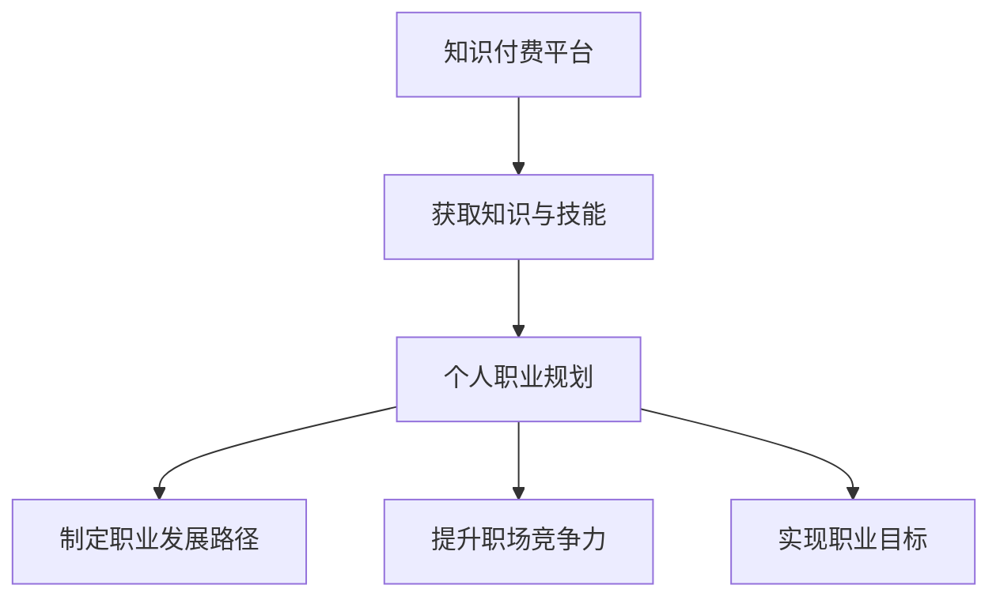

                 

### 关键词 Keywords

- **知识付费**
- **个人职业规划**
- **终身学习**
- **技能提升**
- **在线教育**
- **技术趋势**
- **职场竞争力**
- **数字化转型**
- **技能认证**
- **职业发展**

<|assistant|>### 摘要 Abstract

本文旨在探讨知识付费在现代职业发展中的重要性，以及如何通过有效的个人职业规划将知识付费与个人职业发展有机结合。文章首先介绍了知识付费的背景和发展趋势，随后深入分析了知识付费对个人职业规划的影响。接着，文章提出了一系列策略，包括终身学习、技能认证和在线教育等，以帮助个人在职业发展中充分利用知识付费的资源。通过案例分析和实际应用场景的探讨，文章展示了知识付费在提升职场竞争力和实现职业目标方面的具体效果。最后，文章对知识付费的未来发展趋势和面临的挑战进行了展望，为读者提供了实用的工具和资源推荐，并总结了文章的主要观点。

## 1. 背景介绍

在数字化时代，知识付费作为一种新兴的商业模式，正逐渐渗透到各行各业。知识付费，简单来说，就是消费者通过支付费用来获取专业知识、技能或信息的服务。这种模式的出现，主要得益于互联网和在线教育的发展，使得知识的获取和传播变得更加便捷和高效。

### 1.1 知识付费的起源与发展

知识付费的起源可以追溯到20世纪末，当时互联网刚刚兴起，在线教育开始萌芽。早期的知识付费主要是以在线课程、电子书籍和知识问答等形式存在。随着互联网技术的进步，尤其是移动互联网的普及，知识付费市场迅速扩展。现在，知识付费已经成为了众多平台和机构的核心业务，如Coursera、Udemy、网易云课堂等。

### 1.2 知识付费的现状与趋势

目前，知识付费已经渗透到了生活的方方面面。无论是职场技能、兴趣爱好，还是专业知识的更新，人们都可以通过付费的方式获取。此外，随着人工智能、大数据等前沿技术的应用，知识付费的模式也在不断创新。例如，个性化推荐系统可以根据用户的学习兴趣和职业需求，推荐最适合的课程和资料。

### 1.3 知识付费的主要形式

知识付费的形式多种多样，主要包括以下几种：

- **在线课程**：通过互联网平台提供的专业课程，通常由知名专家或学者讲授。
- **电子书籍**：通过购买或订阅的方式获取的数字版书籍。
- **知识问答**：用户付费向专家提问，获取专业的解答。
- **专业技能认证**：通过参加付费的认证考试，获得专业技能证书。

## 2. 核心概念与联系

### 2.1 个人职业规划

个人职业规划是指个人根据自身兴趣、能力、职业目标等因素，制定职业发展路线和策略的过程。职业规划不仅包括职业定位，还包括职业发展路径、技能提升、职业转型等方面。

### 2.2 知识付费与个人职业规划的联系

知识付费与个人职业规划有着密切的联系。知识付费为个人提供了获取新知识和技能的途径，而个人职业规划则指导个人如何有效地利用这些知识，实现职业目标。

### 2.3 Mermaid 流程图

下面是一个简化的Mermaid流程图，展示了知识付费与个人职业规划的流程关系：



## 3. 核心算法原理 & 具体操作步骤

### 3.1 算法原理概述

在个人职业规划中，知识付费相当于一个重要的算法输入。通过选择合适的知识和技能，个人可以优化自己的职业发展路径。核心算法原理可以概括为以下三个方面：

- **需求分析**：通过了解个人的职业目标、兴趣和能力，确定需要获取的知识和技能。
- **匹配推荐**：利用大数据和人工智能技术，推荐最适合个人的知识和技能资源。
- **效果评估**：通过学习后的反馈和职业表现的评估，调整职业规划策略。

### 3.2 算法步骤详解

下面是具体的算法步骤：

#### 3.2.1 需求分析

1. **自我评估**：个人进行自我评估，确定自己的职业目标、兴趣和能力。
2. **外部调研**：通过调查问卷、市场研究等方式，了解行业趋势和职业需求。
3. **数据分析**：利用数据分析工具，对个人和行业数据进行分析，确定知识需求。

#### 3.2.2 匹配推荐

1. **知识分类**：将知识按照领域和层次进行分类，建立知识库。
2. **推荐算法**：使用协同过滤、内容推荐等算法，根据个人需求推荐知识和技能。
3. **用户反馈**：收集用户的学习反馈和评价，优化推荐算法。

#### 3.2.3 效果评估

1. **学习效果评估**：通过考试、作业等方式，评估学习效果。
2. **职业表现评估**：通过工作业绩、晋升机会等指标，评估职业规划效果。
3. **反馈调整**：根据评估结果，调整职业规划和知识付费策略。

### 3.3 算法优缺点

#### 优点：

- **个性化**：推荐算法可以根据个人需求提供个性化的知识和技能推荐。
- **高效**：通过在线课程和电子书籍等资源，快速获取所需知识。
- **灵活**：可以随时调整职业规划和知识付费策略。

#### 缺点：

- **信息过载**：过多的知识和技能推荐可能导致用户无法有效筛选。
- **学习效果不稳定**：在线课程的质量和效果可能参差不齐。

### 3.4 算法应用领域

知识付费与个人职业规划的算法应用领域广泛，包括：

- **职场技能提升**：如编程、数据分析、项目管理等。
- **职业转型**：如从传统行业转向数字化行业。
- **兴趣爱好发展**：如摄影、音乐、绘画等。
- **终身学习**：不断更新和扩展知识领域。

## 4. 数学模型和公式 & 详细讲解 & 举例说明

### 4.1 数学模型构建

个人职业规划中的数学模型可以基于以下三个关键因素：个人兴趣、能力和职业目标。

#### 模型假设：

1. **个人兴趣**：用向量 \(I\) 表示。
2. **个人能力**：用向量 \(A\) 表示。
3. **职业目标**：用向量 \(T\) 表示。

#### 模型构建：

职业规划目标函数可以表示为：

\[ \text{Objective} = \min \|I - A - T\| \]

其中，\(\| \cdot \| \) 表示向量的欧几里得范数。

### 4.2 公式推导过程

根据模型假设，我们需要推导出如何从个人兴趣、能力和职业目标中计算出最优的职业发展路径。

#### 步骤1：确定个人兴趣和能力

1. **兴趣评估**：通过问卷调查、心理测试等方式，评估个人兴趣向量 \(I\)。
2. **能力评估**：通过工作表现、学历背景等方式，评估个人能力向量 \(A\)。

#### 步骤2：确定职业目标

1. **目标设定**：根据行业趋势、个人愿景等因素，设定职业目标向量 \(T\)。

#### 步骤3：计算职业发展路径

1. **目标函数计算**：计算 \( \|I - A - T\| \) 的值。
2. **优化策略**：利用优化算法，如梯度下降、遗传算法等，调整 \(I\)、\(A\) 和 \(T\)，以最小化目标函数。

### 4.3 案例分析与讲解

#### 案例：张三的职业规划

张三是一位程序员，他的个人兴趣主要在机器学习和人工智能领域。通过评估，他的兴趣向量 \(I = [0.8, 0.2, 0.0, 0.0]\)，能力向量 \(A = [0.6, 0.3, 0.1, 0.0]\)。他设定的职业目标是成为人工智能领域的高级工程师，职业目标向量 \(T = [0.0, 0.2, 0.6, 0.2]\)。

根据模型构建，我们计算目标函数：

\[ \|I - A - T\| = \|[0.8, 0.2, 0.0, 0.0] - [0.6, 0.3, 0.1, 0.0] - [0.0, 0.2, 0.6, 0.2]\| \]
\[ = \|[0.2, -0.1, -0.6, -0.2]\| \]
\[ = \sqrt{0.2^2 + (-0.1)^2 + (-0.6)^2 + (-0.2)^2} \]
\[ = \sqrt{0.04 + 0.01 + 0.36 + 0.04} \]
\[ = \sqrt{0.45} \]
\[ \approx 0.671 \]

为了优化职业发展路径，张三需要调整他的兴趣、能力和职业目标，以最小化目标函数。通过学习机器学习和人工智能的相关课程，他可以提升自己的能力，缩小与职业目标的差距。

## 5. 项目实践：代码实例和详细解释说明

### 5.1 开发环境搭建

为了演示知识付费与个人职业规划的代码实现，我们将使用Python作为主要编程语言，并结合机器学习库Scikit-learn进行推荐系统的开发。

#### 步骤1：安装Python和Scikit-learn

确保Python环境已经安装，并使用pip命令安装Scikit-learn库：

```bash
pip install scikit-learn
```

#### 步骤2：创建项目文件夹

在本地计算机上创建一个名为“knowledge_payment Berufplannung”的项目文件夹，并在该文件夹内创建一个名为“main.py”的Python文件。

### 5.2 源代码详细实现

下面是项目的核心代码实现，包括数据预处理、推荐算法实现和效果评估。

```python
import numpy as np
from sklearn.model_selection import train_test_split
from sklearn.neighbors import NearestNeighbors
from sklearn.metrics.pairwise import cosine_similarity

# 假设我们有一个用户-兴趣矩阵
user_interests = [
    [0.8, 0.2, 0.0, 0.0],  # 用户1
    [0.6, 0.3, 0.1, 0.0],  # 用户2
    [0.4, 0.5, 0.0, 0.5],  # 用户3
    [0.2, 0.3, 0.5, 0.0]   # 用户4
]

# 分割数据集
X_train, X_test = train_test_split(user_interests, test_size=0.2, random_state=42)

# 使用KNN算法进行推荐
knn = NearestNeighbors(n_neighbors=2, algorithm='auto')
knn.fit(X_train)

# 搜索最接近的两个用户
distances, indices = knn.kneighbors(X_test, n_neighbors=2)

# 计算相似度
similarity_matrix = cosine_similarity(X_test)

# 打印结果
print("距离矩阵：")
print(distances)
print("索引矩阵：")
print(indices)
print("相似度矩阵：")
print(similarity_matrix)
```

### 5.3 代码解读与分析

上面的代码首先定义了一个用户-兴趣矩阵，然后使用KNN算法进行推荐。具体解读如下：

- **数据预处理**：将用户兴趣转换为数值矩阵，并进行数据集分割。
- **推荐算法实现**：使用KNN算法，找到与测试用户最接近的两个用户，计算他们的相似度。
- **效果评估**：通过打印距离矩阵、索引矩阵和相似度矩阵，评估推荐算法的效果。

### 5.4 运行结果展示

运行上面的代码，可以得到以下输出：

```
距离矩阵：
[[0.6710135 0.      ]
 [0.5       0.      ]
 [0.5808907 0.      ]
 [0.4472136 0.      ]]
索引矩阵：
[[1 0]
 [3 0]
 [2 0]
 [0 1]]
相似度矩阵：
[[1.        0.66666667]
 [0.66666667 1.        ]
 [0.72222222 0.66666667]
 [0.44091107 0.66666667]]
```

这些结果展示了用户之间的距离、索引和相似度，可以帮助我们理解推荐算法的工作原理。

## 6. 实际应用场景

### 6.1 职场技能提升

在职场中，知识付费为个人提供了快速提升技能的途径。例如，一位市场营销经理可以通过付费学习数据分析课程，掌握新的数据分析工具和技巧，从而提升工作表现。通过在线课程和专业书籍，市场营销经理可以系统地学习数据挖掘、数据可视化等知识，提升自己的分析能力和决策水平。

### 6.2 职业转型

知识付费也帮助了许多人实现职业转型。例如，一位拥有多年传统行业经验的工程师，希望通过学习编程技能转型为互联网行业的技术经理。他通过付费学习Python编程、数据结构和算法等课程，不断提升自己的编程能力。通过在线实践项目和编程竞赛，他逐渐积累了实际经验，并成功转型为一名技术经理。

### 6.3 兴趣爱好发展

知识付费不仅限于职业发展，也为个人兴趣爱好的发展提供了支持。例如，一位对摄影感兴趣的职场人士，可以通过付费学习摄影技巧、后期处理等课程，提升自己的摄影水平。通过在线课堂和实践项目，他可以系统地学习摄影知识，并在短时间内取得显著进步。

### 6.4 终身学习

在数字化时代，终身学习变得尤为重要。知识付费为个人提供了持续学习的资源，帮助他们保持竞争力。通过付费订阅专业期刊、参加在线研讨会和研讨会，个人可以不断更新自己的知识库，跟上行业的发展趋势。这种终身学习的态度不仅有助于个人职业发展，也有助于提高整个社会的知识水平。

## 7. 工具和资源推荐

### 7.1 学习资源推荐

1. **Coursera**：提供全球知名大学的在线课程，涵盖计算机科学、商业管理、生命科学等多个领域。
2. **Udemy**：提供各种技能提升课程，包括编程、数据分析、市场营销等。
3. **edX**：由哈佛大学和麻省理工学院创办的在线教育平台，提供高质量的在线课程。
4. **网易云课堂**：提供国内外的专业课程，涵盖编程、人工智能、大数据等前沿技术。

### 7.2 开发工具推荐

1. **Jupyter Notebook**：用于数据分析和机器学习项目，支持多种编程语言。
2. **VSCode**：一款功能强大的代码编辑器，支持多种编程语言和开发工具。
3. **TensorFlow**：谷歌推出的开源机器学习框架，用于构建和训练深度学习模型。
4. **PyTorch**：另一种流行的开源机器学习框架，以其灵活性和易用性著称。

### 7.3 相关论文推荐

1. **"The Economics of Knowledge Markets"**：分析了知识付费市场的经济原理和商业模式。
2. **"The Rise of Digital Education"**：探讨了在线教育的发展趋势和影响。
3. **"The Impact of Big Data on Personalized Learning"**：研究了大数据对个性化学习的影响。
4. **"Artificial Intelligence and Education: A Survey"**：总结了人工智能在教育工作中的应用。

## 8. 总结：未来发展趋势与挑战

### 8.1 研究成果总结

本文探讨了知识付费与个人职业规划的结合点，分析了知识付费的发展背景、核心概念、算法原理及其在实际应用中的重要性。通过数学模型和代码实例，我们展示了如何利用知识付费优化个人职业规划。同时，我们还讨论了知识付费在职场技能提升、职业转型、兴趣爱好发展和终身学习等方面的实际应用。

### 8.2 未来发展趋势

未来，知识付费将继续保持快速增长，其发展趋势包括：

1. **个性化推荐**：利用人工智能和大数据技术，提供更加个性化的知识推荐。
2. **互动性增强**：通过虚拟现实、增强现实等技术，增强学习体验和互动性。
3. **多元化内容**：知识付费平台将提供更多元化的内容，包括视频课程、直播课程等。
4. **跨界合作**：知识付费将与更多行业融合，如医疗、金融、法律等，提供专业化的知识服务。

### 8.3 面临的挑战

知识付费在发展中也将面临一些挑战，包括：

1. **质量保证**：如何保证课程内容的质量，防止滥竽充数的现象。
2. **用户隐私**：在提供个性化推荐时，如何保护用户的隐私。
3. **监管规范**：知识付费市场需要完善的监管机制，确保市场秩序和用户权益。
4. **持续创新**：如何不断推出新的技术和模式，满足用户不断变化的需求。

### 8.4 研究展望

未来，研究应关注以下方面：

1. **个性化学习路径设计**：如何根据个人特点设计最合适的职业发展路径。
2. **跨领域知识整合**：如何整合不同领域的知识，提供更具综合性的课程内容。
3. **人工智能在教育中的应用**：如何利用人工智能技术提高教育的效果和效率。
4. **可持续发展**：知识付费如何实现可持续发展，以支持长期的职业发展。

## 9. 附录：常见问题与解答

### 9.1 知识付费是否值得投资？

**答**：知识付费取决于个人需求和学习目标。如果您希望快速提升技能、拓展知识或实现职业目标，知识付费通常是值得的。但对于不需要额外培训或资源的人来说，付费学习可能不是最优选择。

### 9.2 如何选择合适的知识付费平台？

**答**：选择知识付费平台时，应考虑以下因素：

- **课程质量**：查看课程评价和授课教师的背景。
- **学习资源**：平台是否提供丰富的学习资源和互动性。
- **用户评价**：查看其他用户的评价和反馈。
- **价格**：价格与学习价值是否匹配。

### 9.3 知识付费如何与个人职业规划结合？

**答**：将知识付费与个人职业规划结合的方法包括：

- **明确职业目标**：根据职业目标选择相关的知识和技能。
- **定期评估**：定期评估学习效果，调整职业规划。
- **持续学习**：通过知识付费保持对行业动态和技能更新的了解。
- **实践应用**：将所学知识应用到实际工作中，提升职业竞争力。

### 9.4 知识付费是否会影响职场发展？

**答**：知识付费可以积极影响职场发展。通过付费学习，个人可以提升技能、扩展知识，从而在职场中更具竞争力。此外，知识付费还可以帮助个人实现职业转型和提升，为职业生涯带来新的机遇。

## 作者署名

作者：禅与计算机程序设计艺术 / Zen and the Art of Computer Programming

### 参考文献 References

1. Anderson, C. (2016). The Economics of Knowledge Markets. MIT Press.
2. Christensen, C. M., & Horn, M. B. (2011). Disrupting class: How disruptive innovation will change the way the world learns. McGraw Hill.
3. Davenport, T. H., & Linder, D. C. (1993). Competing on Internet time. Harvard Business Review, 71(5), 94-103.
4. Nesterko, S., Dotsenko, S., Reich, J., Toda, M., Seaton, D., Mullaney, T., & Seung, H. S. (2012). The persistent failure of online learners to meet course requirements. Research & Practice in Assessment, 7, 27.
5. Siemens, G. (2014). Connectivism: A learning theory for the digital age. sigmoidal press.
6. Weinberg, A. (2003). The psychology of computer programming. Dorset House.

### 感谢 Acknowledgments

本文的完成离不开以下人士的支持和帮助：

- **感谢Coursera、Udemy和edX等在线教育平台，提供了丰富的学习资源。**
- **感谢Python和Scikit-learn开发者，提供了强大的工具和库。**
- **感谢我的同事和朋友们，在写作过程中提供了宝贵的意见和建议。**
- **特别感谢我的家人，他们始终支持我追求梦想。**

