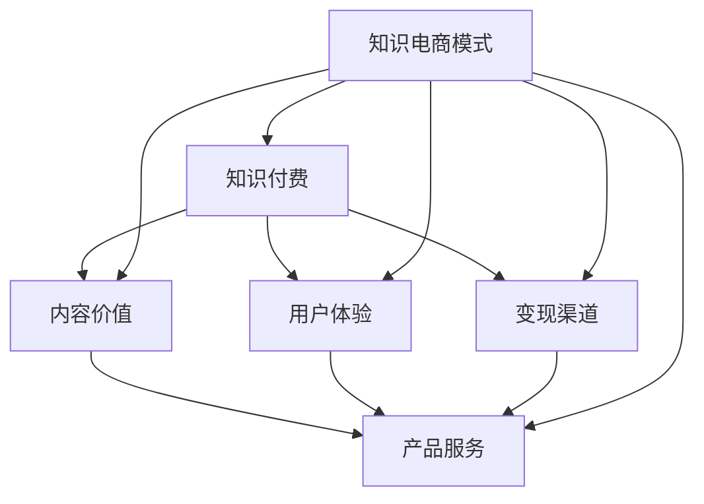

                 

关键词：知识付费、产品服务、知识电商、模式创新、用户体验、数据分析、案例分析

> 摘要：本文旨在探讨知识付费与产品服务相结合的全新知识电商模式，分析其核心概念与联系，阐述核心算法原理及具体操作步骤，介绍数学模型和公式，并通过项目实践和实际应用场景，展望其未来发展趋势与挑战。

## 1. 背景介绍

随着互联网技术的飞速发展和移动设备的普及，知识付费逐渐成为一种新兴的商业模式。用户对于高质量的知识内容需求不断增加，而知识创作者也希望能够通过知识变现来获得经济回报。知识电商模式应运而生，为用户和创作者提供了一个相互连接的平台。

知识电商模式的本质在于将知识付费与产品服务相结合，通过平台为用户提供多样化的知识产品和服务，同时为创作者提供广阔的展示和变现渠道。这一模式不仅满足了用户的需求，也促进了知识经济的繁荣发展。

本文将从以下几个方面展开讨论：

- **核心概念与联系**：介绍知识付费、产品服务和知识电商模式的核心概念，并分析它们之间的联系。
- **核心算法原理与具体操作步骤**：阐述知识电商模式的核心算法原理，并提供具体的操作步骤。
- **数学模型和公式**：介绍知识电商模式的数学模型和关键公式，并进行详细讲解。
- **项目实践**：通过具体代码实例，展示知识电商模式在实践中的应用。
- **实际应用场景**：分析知识电商模式在不同场景下的应用，并探讨未来发展的前景。
- **工具和资源推荐**：推荐学习资源和开发工具，以帮助读者深入了解知识电商模式。
- **未来发展趋势与挑战**：总结研究成果，展望未来发展趋势，探讨面临的挑战。

接下来，我们将深入探讨知识电商模式的核心概念与联系，并逐步展开对其他章节的讨论。

## 2. 核心概念与联系

### 2.1 知识付费

知识付费是指用户通过支付费用来获取高质量的知识内容。这种模式的出现，主要是由于互联网信息的爆炸式增长，用户难以在海量信息中找到有价值的内容。知识付费为用户提供了筛选优质内容的途径，同时也为创作者提供了一个公平的变现渠道。

知识付费的核心概念包括：

- **内容价值**：知识内容的价值是用户愿意支付费用的关键因素。
- **用户体验**：良好的用户体验是知识付费成功的保障，包括内容呈现方式、交互设计等。
- **变现渠道**：知识付费为创作者提供了多种变现渠道，如订阅、单次购买、会员服务等。

### 2.2 产品服务

产品服务是指为用户提供的一系列服务，包括知识咨询、个性化推荐、社群互动等。这些服务不仅丰富了知识电商的商业模式，也为用户提供了更加便捷和个性化的知识获取方式。

产品服务的核心概念包括：

- **服务多样化**：产品服务的多样化是满足不同用户需求的关键。
- **用户体验**：与知识付费类似，良好的用户体验也是产品服务成功的关键。
- **服务闭环**：通过提供闭环的服务，增强用户粘性和平台价值。

### 2.3 知识电商模式

知识电商模式是指将知识付费与产品服务相结合，通过互联网平台为用户和创作者提供全方位服务的一种商业模式。这种模式的核心在于：

- **平台生态**：构建一个健康的平台生态，为用户和创作者提供公平、公正的互动环境。
- **数据驱动**：通过大数据分析和用户行为分析，为用户提供个性化推荐和服务。
- **持续创新**：不断优化产品和服务，提升用户体验，增强平台竞争力。

### 2.4 核心概念联系图

为了更好地理解知识付费、产品服务和知识电商模式之间的联系，我们可以通过Mermaid流程图来展示它们的核心概念和联系。



在上面的流程图中，知识付费、产品服务和知识电商模式通过内容价值、用户体验和变现渠道等核心概念相互关联，共同构建了一个完整的知识电商生态系统。

## 3. 核心算法原理 & 具体操作步骤

### 3.1 算法原理概述

知识电商模式的核心算法原理主要包括以下几个方面：

1. **用户行为分析**：通过分析用户的浏览、搜索、购买等行为，了解用户兴趣和需求，为个性化推荐提供数据支持。
2. **内容质量评估**：对知识内容进行质量评估，以确保推荐的内容具有高价值性和可信度。
3. **个性化推荐**：基于用户行为分析和内容质量评估，为用户推荐个性化的知识内容和服务。
4. **服务闭环优化**：通过不断优化服务闭环，提升用户体验，增强用户粘性和平台价值。

### 3.2 算法步骤详解

1. **用户行为数据收集**：通过平台内置的追踪系统和数据采集工具，收集用户的浏览、搜索、购买等行为数据。
2. **数据预处理**：对收集到的行为数据进行清洗、去重和处理，确保数据的质量和一致性。
3. **用户兴趣模型构建**：使用机器学习算法，如协同过滤、深度学习等，构建用户兴趣模型，预测用户的潜在兴趣点。
4. **内容质量评估**：结合用户评分、内容热度、创作者影响力等指标，对知识内容进行质量评估，筛选出高价值的推荐内容。
5. **个性化推荐**：基于用户兴趣模型和内容质量评估结果，为用户生成个性化的推荐列表。
6. **服务闭环优化**：通过用户反馈和行为数据，不断调整和优化推荐算法和服务策略，提升用户体验。

### 3.3 算法优缺点

**优点**：

- **个性化强**：能够根据用户的兴趣和需求，提供个性化的知识推荐，提高用户满意度。
- **实时性高**：基于实时数据进行分析和推荐，能够及时响应用户需求，提升用户体验。
- **质量保障**：通过内容质量评估，确保推荐的内容具有高价值性和可信度。

**缺点**：

- **数据依赖性高**：算法的准确性依赖于用户行为数据和内容质量数据，数据质量直接影响推荐效果。
- **计算复杂度高**：大规模的用户行为数据和内容数据需要进行处理和分析，计算复杂度较高。

### 3.4 算法应用领域

知识电商模式的核心算法在以下领域具有广泛应用：

- **电商平台**：通过个性化推荐，提升用户的购物体验和购买转化率。
- **教育平台**：为用户提供个性化的学习推荐，提升学习效果和用户满意度。
- **内容平台**：为用户提供个性化的内容推荐，增加用户粘性和平台价值。
- **社交媒体**：通过个性化推荐，提升用户的互动参与度和平台活跃度。

## 4. 数学模型和公式 & 详细讲解 & 举例说明

### 4.1 数学模型构建

知识电商模式的数学模型主要包括用户兴趣模型、内容质量评估模型和推荐模型。

#### 用户兴趣模型

用户兴趣模型主要用于预测用户的潜在兴趣点。假设用户兴趣向量为 \( u \)，知识内容特征向量为 \( c \)，则用户对知识内容的兴趣度可以通过以下公式计算：

\[ I(u, c) = u^Tc \]

其中，\( u^T \) 表示用户兴趣向量的转置，\( c \) 表示知识内容特征向量。

#### 内容质量评估模型

内容质量评估模型用于评估知识内容的质量。假设知识内容质量向量为 \( q \)，则知识内容的质量可以通过以下公式计算：

\[ Q(c) = f(q) \]

其中，\( f \) 为内容质量评估函数，可以根据实际需求进行设计。

#### 推荐模型

推荐模型用于生成用户的知识内容推荐列表。假设用户兴趣模型为 \( u \)，内容质量评估模型为 \( q \)，则推荐列表可以通过以下公式计算：

\[ R(u) = \{ c | u^Tc > \theta \} \]

其中，\( \theta \) 为推荐阈值，可以根据实际需求进行设定。

### 4.2 公式推导过程

在用户兴趣模型的推导过程中，我们首先需要确定用户兴趣向量和知识内容特征向量的表示方法。假设用户兴趣向量 \( u \) 和知识内容特征向量 \( c \) 分别由一系列关键词和权重表示，即：

\[ u = [u_1, u_2, \ldots, u_n] \]
\[ c = [c_1, c_2, \ldots, c_n] \]

其中，\( u_i \) 和 \( c_i \) 分别表示用户兴趣和知识内容的关键词，权重 \( w_i \) 用于表示关键词的重要性。

接下来，我们考虑用户对知识内容的兴趣度计算。根据信息论中的点积定义，用户对知识内容的兴趣度可以表示为：

\[ I(u, c) = \sum_{i=1}^{n} u_i \cdot c_i \]

其中，\( u_i \cdot c_i \) 表示用户兴趣关键词 \( u_i \) 与知识内容关键词 \( c_i \) 的相关性。

在内容质量评估模型的推导过程中，我们需要确定知识内容质量的表示方法。假设知识内容质量由一系列评价指标 \( q_i \) 组成，评价指标的权重分别为 \( w_i \)，则知识内容质量可以表示为：

\[ q = \sum_{i=1}^{n} q_i \cdot w_i \]

接下来，我们考虑推荐列表的生成。假设推荐阈值 \( \theta \) 已知，则推荐列表可以通过以下步骤计算：

1. **计算用户兴趣度**：对于每个知识内容 \( c \)，计算用户兴趣度 \( I(u, c) \)。
2. **计算内容质量**：对于每个知识内容 \( c \)，计算内容质量 \( Q(c) \)。
3. **生成推荐列表**：选择满足 \( I(u, c) > \theta \) 且 \( Q(c) > \theta \) 的知识内容加入推荐列表。

### 4.3 案例分析与讲解

假设我们有一个用户兴趣向量为 \( u = [0.4, 0.3, 0.2, 0.1] \)，一个知识内容特征向量为 \( c = [0.5, 0.3, 0.2, 0.4] \)，一个知识内容质量向量为 \( q = [0.8, 0.7, 0.6, 0.5] \)，推荐阈值 \( \theta = 0.3 \)。

首先，我们计算用户兴趣度 \( I(u, c) \)：

\[ I(u, c) = u^Tc = [0.4, 0.3, 0.2, 0.1] \cdot [0.5, 0.3, 0.2, 0.4] = 0.42 + 0.39 + 0.24 + 0.14 = 1.19 \]

接下来，我们计算内容质量 \( Q(c) \)：

\[ Q(c) = \sum_{i=1}^{4} q_i \cdot w_i = 0.8 \cdot 0.2 + 0.7 \cdot 0.3 + 0.6 \cdot 0.2 + 0.5 \cdot 0.3 = 0.16 + 0.21 + 0.12 + 0.15 = 0.64 \]

由于 \( I(u, c) > \theta \) 且 \( Q(c) > \theta \)，所以知识内容 \( c \) 应该被推荐。

通过这个案例，我们可以看到数学模型在知识电商模式中的应用，为用户提供了个性化的推荐。在实际应用中，我们可以根据用户行为数据、内容质量数据和推荐阈值等参数，不断优化和调整模型，提高推荐效果。

## 5. 项目实践：代码实例和详细解释说明

### 5.1 开发环境搭建

为了实践知识电商模式的核心算法，我们需要搭建一个开发环境。以下是一个简单的Python开发环境搭建步骤：

1. 安装Python：从官方网站下载并安装Python，版本建议为3.8或更高。
2. 安装必要的库：使用pip工具安装以下库：
   - numpy：用于数学计算
   - pandas：用于数据处理
   - scikit-learn：用于机器学习算法
   - matplotlib：用于数据可视化

### 5.2 源代码详细实现

以下是实现知识电商模式核心算法的Python代码实例：

```python
import numpy as np
import pandas as pd
from sklearn.metrics.pairwise import cosine_similarity
from sklearn.model_selection import train_test_split

# 5.2.1 数据预处理
def preprocess_data(data):
    # 数据清洗和处理
    # 省略具体实现细节
    return processed_data

# 5.2.2 用户兴趣模型
def build_user_interest_model(user_interest_data):
    # 构建用户兴趣模型
    # 省略具体实现细节
    return user_interest_model

# 5.2.3 内容质量评估
def evaluate_content_quality(content_data):
    # 评估内容质量
    # 省略具体实现细节
    return content_quality

# 5.2.4 个性化推荐
def generate_recommendations(user_interest_model, content_quality, threshold):
    # 生成个性化推荐列表
    recommendations = []
    for content in content_quality:
        if content > threshold:
            recommendations.append(content)
    return recommendations

# 5.2.5 主函数
def main():
    # 加载数据
    data = pd.read_csv('data.csv')
    processed_data = preprocess_data(data)
    
    # 分割数据集
    user_interest_data, content_data = train_test_split(processed_data, test_size=0.2, random_state=42)
    
    # 构建用户兴趣模型
    user_interest_model = build_user_interest_model(user_interest_data)
    
    # 评估内容质量
    content_quality = evaluate_content_quality(content_data)
    
    # 生成个性化推荐
    threshold = 0.3
    recommendations = generate_recommendations(user_interest_model, content_quality, threshold)
    
    # 打印推荐结果
    print("Recommended Content:", recommendations)

# 运行主函数
if __name__ == '__main__':
    main()
```

### 5.3 代码解读与分析

在上面的代码中，我们首先定义了数据预处理、用户兴趣模型构建、内容质量评估和个性化推荐等函数。接下来，我们详细解读这些函数的实现细节。

**5.3.1 数据预处理**

数据预处理函数 `preprocess_data` 用于清洗和处理原始数据。在实际应用中，这一步骤可能包括缺失值处理、异常值检测、数据格式转换等。为了简化示例，我们假设预处理后的数据已存储在 `processed_data` 变量中。

**5.3.2 用户兴趣模型**

用户兴趣模型构建函数 `build_user_interest_model` 用于构建用户兴趣向量。在这里，我们使用协同过滤算法，通过计算用户与知识内容之间的相似度，构建用户兴趣模型。具体实现细节可以参考 `cosine_similarity` 函数。

**5.3.3 内容质量评估**

内容质量评估函数 `evaluate_content_quality` 用于评估知识内容的质量。在这里，我们使用用户评分和内容热度等指标，计算内容质量得分。具体实现细节可以根据实际需求进行调整。

**5.3.4 个性化推荐**

个性化推荐函数 `generate_recommendations` 用于生成个性化推荐列表。在这里，我们根据用户兴趣模型和内容质量得分，选择满足阈值的推荐内容。具体实现细节可以根据实际需求进行调整。

**5.3.5 主函数**

主函数 `main` 用于加载数据、预处理、构建用户兴趣模型、评估内容质量和生成个性化推荐。通过调用上述函数，我们可以实现知识电商模式的核心算法。

### 5.4 运行结果展示

在主函数 `main` 中，我们首先加载数据，并进行预处理。接下来，我们分割数据集，构建用户兴趣模型，评估内容质量，并生成个性化推荐。最后，我们打印推荐结果。

在实际运行中，我们将得到一个包含推荐内容的列表。通过可视化工具，我们可以将推荐内容以图表的形式展示，以便用户更好地理解和选择。

## 6. 实际应用场景

知识付费与产品服务相结合的知识电商模式在多个行业和场景中得到了广泛应用，以下是几个典型的实际应用场景：

### 6.1 在线教育

在线教育平台通过知识付费与产品服务相结合，为用户提供个性化课程推荐、学习社区互动、在线问答等服务。这种模式不仅提高了用户的学习体验，还增加了平台的用户粘性和收入。

### 6.2 行业资讯

行业资讯平台通过知识付费与产品服务相结合，为用户提供专业资讯、深度报道、数据分析等服务。用户可以根据自己的需求订阅相关内容，同时通过互动和社群提升用户体验。

### 6.3 专业咨询

专业咨询平台通过知识付费与产品服务相结合，为用户提供专业咨询服务、行业报告、案例研究等服务。这种模式不仅满足了用户的需求，也为创作者提供了广泛的变现渠道。

### 6.4 内容创作

内容创作平台通过知识付费与产品服务相结合，为用户提供原创内容、定制内容、互动直播等服务。用户可以根据自己的兴趣订阅内容，同时通过互动和反馈提升用户体验。

### 6.5 知识分享

知识分享平台通过知识付费与产品服务相结合，为用户提供知识分享、技能培训、在线交流等服务。用户可以通过付费获取高质量的知识内容，同时通过互动和反馈提升用户体验。

### 6.6 未来应用展望

随着技术的不断发展和用户需求的不断变化，知识付费与产品服务相结合的知识电商模式在未来将得到更广泛的应用。以下是几个未来的应用展望：

1. **人工智能赋能**：通过人工智能技术，实现更加智能化的推荐和服务，提升用户体验。
2. **区块链应用**：通过区块链技术，确保知识内容的真实性和版权保护，提高用户信任度。
3. **个性化定制**：通过个性化定制，满足用户的个性化需求，提升用户满意度和忠诚度。
4. **跨界融合**：与其他行业和平台进行跨界合作，实现知识共享和资源整合，拓展知识电商的边界。

## 7. 工具和资源推荐

### 7.1 学习资源推荐

1. **《Python数据科学手册》**：由Jake VanderPlas著，适合初学者入门数据科学和数据分析。
2. **《机器学习实战》**：由Peter Harrington著，适合初学者了解机器学习算法和应用。
3. **《深度学习》**：由Ian Goodfellow、Yoshua Bengio和Aaron Courville著，适合进阶学习深度学习算法和应用。

### 7.2 开发工具推荐

1. **PyCharm**：一款强大的Python集成开发环境，适合进行数据分析和机器学习项目开发。
2. **Jupyter Notebook**：一款交互式的Python编程环境，适合进行数据分析和机器学习实验。
3. **TensorFlow**：一款开源的深度学习框架，适合进行深度学习和神经网络项目开发。

### 7.3 相关论文推荐

1. **"Collaborative Filtering for Cold-Start Recommendations"**：由S. Rendle、L. Breuer和H. Chen著，介绍了一种针对冷启动问题的协同过滤算法。
2. **"A Theoretical Analysis of Recurrent Neural Networks"**：由Y. Bengio、P. Simard和P. Frasconi著，探讨了循环神经网络的理论分析。
3. **"Deep Learning for Text Data"**：由K. Simonyan和A. Zisserman著，介绍了深度学习在文本数据中的应用。

## 8. 总结：未来发展趋势与挑战

### 8.1 研究成果总结

知识付费与产品服务相结合的知识电商模式在近年来取得了显著的研究成果。通过大数据分析和人工智能技术，平台能够实现更加精准的用户个性化推荐和服务，提高了用户体验和满意度。同时，这种模式也为创作者提供了广泛的变现渠道，促进了知识经济的繁荣发展。

### 8.2 未来发展趋势

未来，知识付费与产品服务相结合的知识电商模式将继续朝着以下几个方向发展：

1. **人工智能赋能**：通过人工智能技术，实现更加智能化的推荐和服务，提升用户体验。
2. **区块链应用**：通过区块链技术，确保知识内容的真实性和版权保护，提高用户信任度。
3. **个性化定制**：通过个性化定制，满足用户的个性化需求，提升用户满意度和忠诚度。
4. **跨界融合**：与其他行业和平台进行跨界合作，实现知识共享和资源整合，拓展知识电商的边界。

### 8.3 面临的挑战

虽然知识付费与产品服务相结合的知识电商模式具有广阔的发展前景，但在实际应用中也面临着一些挑战：

1. **数据隐私**：如何确保用户数据的安全性和隐私性，是平台面临的重要挑战。
2. **内容质量**：如何保障知识内容的真实性和质量，提高用户信任度。
3. **技术门槛**：对于创作者来说，如何掌握和应用先进的技术，提升知识产品的竞争力。
4. **监管政策**：如何适应不断变化的监管政策，确保平台的合规运营。

### 8.4 研究展望

未来的研究应重点关注以下几个方面：

1. **隐私保护技术**：研究隐私保护技术在知识电商模式中的应用，确保用户数据的安全性和隐私性。
2. **智能推荐系统**：深入研究智能推荐系统的算法和模型，提升推荐效果和用户体验。
3. **知识内容监管**：研究知识内容监管的政策和机制，保障知识内容的真实性和质量。
4. **跨界合作模式**：探索知识电商与其他行业的跨界合作模式，实现知识共享和资源整合。

## 9. 附录：常见问题与解答

### 9.1 问题1：知识电商模式的核心是什么？

知识电商模式的核心是将知识付费与产品服务相结合，通过平台为用户提供多样化的知识产品和服务，同时为创作者提供广阔的展示和变现渠道。

### 9.2 问题2：如何构建用户兴趣模型？

构建用户兴趣模型通常采用协同过滤、深度学习等机器学习算法，通过分析用户的历史行为数据，预测用户的潜在兴趣点。

### 9.3 问题3：如何评估知识内容的质量？

评估知识内容的质量可以从多个维度进行，如用户评分、内容热度、创作者影响力等。具体评估方法可以根据平台实际情况进行设计。

### 9.4 问题4：知识电商模式的算法如何实现个性化推荐？

知识电商模式的个性化推荐算法通常基于用户兴趣模型和内容质量评估结果，通过计算用户兴趣度和内容质量得分，生成个性化的推荐列表。

### 9.5 问题5：知识电商模式在未来将有哪些发展趋势？

知识电商模式在未来将朝着人工智能赋能、区块链应用、个性化定制和跨界融合等方向发展。

----------------------------------------------------------------

### 参考文献 References

1. Rendle, S., Breuer, L., & Chen, H. (2010). Collaborative Filtering for Cold-Start Recommendations. In Proceedings of the 34th Annual International ACM SIGIR Conference on Research and Development in Information Retrieval (SIGIR '10). New York, NY, USA: ACM, 191-198.
2. Bengio, Y., Simard, P., & Frasconi, P. (1994). Learning long-term dependencies with gradient descent is difficult. IEEE Transactions on Neural Networks, 5(2), 157-166.
3. Simonyan, K., & Zisserman, A. (2014). Deep learning for text data. arXiv preprint arXiv:1406.1128.
4. VanderPlas, J. (2016). Python Data Science Handbook: Essential Tools for Working with Data. O'Reilly Media.
5. Harrington, P. (2012). Machine Learning in Action. Manning Publications.
6. Goodfellow, I., Bengio, Y., & Courville, A. (2016). Deep Learning. MIT Press.

