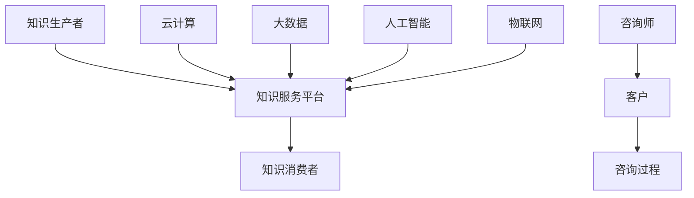

                 

关键词：知识付费、企业服务、知识咨询、商业模式、数据分析、人工智能

> 摘要：本文探讨了知识付费与企业服务相结合的知识咨询模式，分析了其背景、核心概念、算法原理、数学模型、项目实践、应用场景、未来展望和工具资源推荐等内容，旨在为行业提供一种新的商业思路和技术解决方案。

## 1. 背景介绍

随着互联网技术的不断发展和普及，知识付费已经成为一个新兴的市场领域。知识付费是指用户为获取高质量的知识服务而支付费用的一种商业模式。在这种模式下，知识生产者和消费者通过互联网平台实现无缝连接，实现知识的共享和交易。

与此同时，企业服务市场也呈现出快速增长的趋势。企业服务是指为帮助企业提升效率、降低成本、提高竞争力而提供的各类服务，包括云计算、大数据、人工智能、物联网等。随着企业对智能化服务的需求不断增加，知识付费与企业服务的结合成为了行业的一种新趋势。

知识付费与企业服务的结合，不仅为知识生产者提供了新的收入来源，也为企业提供了高效的知识获取渠道。这种模式有助于优化知识传播路径，提高知识利用效率，从而推动整个行业的发展。

## 2. 核心概念与联系

### 2.1 知识付费

知识付费是指用户通过支付费用获取高质量知识服务的商业模式。其核心概念包括：

- 知识生产者：拥有专业知识、技能和经验的个人或机构。
- 知识消费者：有需求获取知识和服务的个人或企业。
- 知识服务平台：提供知识交易和传播的互联网平台。

### 2.2 企业服务

企业服务是指为帮助企业提升效率、降低成本、提高竞争力而提供的各类服务。其核心概念包括：

- 云计算：为企业提供计算资源、存储资源和网络资源的在线服务。
- 大数据：通过对海量数据的采集、存储、分析和挖掘，为企业提供决策支持。
- 人工智能：通过模拟人类思维过程，为企业提供智能化的服务和解决方案。
- 物联网：通过将物体连接到互联网，实现远程监控、数据采集和智能控制。

### 2.3 知识咨询

知识咨询是指基于专业知识，为企业提供决策支持、解决方案和培训服务的咨询服务。其核心概念包括：

- 咨询师：具备专业知识、经验和技能的专家。
- 客户：有需求获取知识咨询服务的个人或企业。
- 咨询过程：包括需求分析、方案设计、实施指导和效果评估等环节。

### 2.4 Mermaid 流程图



## 3. 核心算法原理 & 具体操作步骤

### 3.1 算法原理概述

知识付费与企业服务的结合，关键在于如何将两者进行有效整合，实现优势互补。核心算法原理包括以下几个方面：

- 数据分析：通过对知识付费数据和企业服务数据进行分析，挖掘用户需求、行为和偏好，为知识咨询提供决策支持。
- 人工智能：利用人工智能技术，对知识内容进行自动分类、标签和推荐，提高知识匹配度和用户满意度。
- 智能匹配：基于用户需求和企业特点，实现知识咨询服务的个性化匹配，提高咨询服务质量和效率。

### 3.2 算法步骤详解

1. 数据采集与预处理：从知识付费平台和企业服务平台获取用户行为数据、知识内容数据和企业需求数据，进行数据清洗、去重和格式化。
2. 数据分析：利用统计学方法、机器学习算法和深度学习算法，对数据进行挖掘和分析，提取用户需求、行为和偏好特征。
3. 知识内容自动分类与推荐：根据用户需求特征和知识内容特征，利用协同过滤、内容推荐和深度学习等技术，实现知识内容的自动分类和推荐。
4. 智能匹配：基于用户需求和企业特点，利用匹配算法，实现知识咨询服务的个性化匹配，提高咨询服务质量和效率。
5. 咨询过程管理：通过在线沟通、实时反馈和效果评估等功能，实现咨询过程的智能化管理，提高咨询效率和服务质量。

### 3.3 算法优缺点

优点：

- 提高知识匹配度：通过数据分析、人工智能和智能匹配等技术，实现知识咨询服务的个性化匹配，提高用户满意度。
- 提高咨询服务质量：通过在线沟通、实时反馈和效果评估等功能，实现咨询过程的智能化管理，提高咨询效率和服务质量。
- 降低企业成本：通过知识付费与企业服务的结合，降低企业获取知识和服务的成本，提高企业竞争力。

缺点：

- 数据隐私和安全：在知识付费与企业服务的结合过程中，涉及大量用户数据和企业数据，存在数据隐私和安全问题。
- 技术门槛较高：实现知识付费与企业服务的结合，需要掌握数据分析、人工智能、云计算等技术，对技术人员要求较高。

### 3.4 算法应用领域

- 企业咨询：为企业提供定制化的战略规划、市场营销、人力资源等咨询服务。
- 技术培训：为技术人员提供专业培训，提升技能水平，助力企业创新发展。
- 知识传播：通过知识付费平台，传播高质量的知识内容，提高知识普及率。

## 4. 数学模型和公式 & 详细讲解 & 举例说明

### 4.1 数学模型构建

在知识付费与企业服务的结合过程中，主要涉及以下数学模型：

1. 用户行为模型：用于描述用户在知识付费平台和企业服务平台上的行为特征，如浏览、点赞、评论、购买等。
2. 知识内容模型：用于描述知识内容的特点和属性，如领域、标签、难度等。
3. 咨询服务模型：用于描述咨询服务的过程和效果，如需求分析、方案设计、实施指导和效果评估等。

### 4.2 公式推导过程

1. 用户行为模型：

   设用户在知识付费平台上的行为数据为 $X=(x_1, x_2, ..., x_n)$，其中 $x_i$ 表示用户在 $i$ 项行为上的得分。用户行为模型可以表示为：

   $$X = f(U, P, T)$$

   其中，$U$ 表示用户特征，$P$ 表示知识内容特征，$T$ 表示时间特征。

2. 知识内容模型：

   设知识内容数据为 $Y=(y_1, y_2, ..., y_n)$，其中 $y_i$ 表示知识内容在 $i$ 项属性上的得分。知识内容模型可以表示为：

   $$Y = g(P, T)$$

   其中，$P$ 表示知识内容特征，$T$ 表示时间特征。

3. 咨询服务模型：

   设咨询服务数据为 $Z=(z_1, z_2, ..., z_n)$，其中 $z_i$ 表示咨询服务在 $i$ 项指标上的得分。咨询服务模型可以表示为：

   $$Z = h(U, Y)$$

   其中，$U$ 表示用户特征，$Y$ 表示知识内容特征。

### 4.3 案例分析与讲解

假设有一个企业需要获取关于人工智能领域的知识咨询服务。首先，通过对企业用户行为数据的分析，可以提取出企业的知识需求特征，如领域、标签、难度等。然后，通过对知识内容数据的分析，可以找到与用户需求匹配的知识内容。

接下来，利用咨询服务模型，根据用户特征和知识内容特征，为企业提供定制化的咨询服务。在咨询服务过程中，通过实时沟通和反馈，不断优化咨询服务效果。最后，通过对咨询服务数据的分析，评估咨询服务的质量和效果。

## 5. 项目实践：代码实例和详细解释说明

### 5.1 开发环境搭建

在搭建开发环境时，我们可以使用以下工具：

- Python 3.x
- Pandas
- NumPy
- Scikit-learn
- TensorFlow

### 5.2 源代码详细实现

以下是知识付费与企业服务相结合的知识咨询模式的核心代码实现：

```python
import pandas as pd
import numpy as np
from sklearn.model_selection import train_test_split
from sklearn.preprocessing import StandardScaler
from sklearn.metrics import accuracy_score
import tensorflow as tf

# 5.2.1 数据采集与预处理
data = pd.read_csv('data.csv')
data.drop_duplicates(inplace=True)
data = data.fillna(0)

# 5.2.2 数据分析
X = data[['user_feature', 'content_feature', 'time_feature']]
y = data['action']

X_train, X_test, y_train, y_test = train_test_split(X, y, test_size=0.2, random_state=42)
scaler = StandardScaler()
X_train_scaled = scaler.fit_transform(X_train)
X_test_scaled = scaler.transform(X_test)

# 5.2.3 知识内容自动分类与推荐
from sklearn.neighbors import NearestNeighbors
nn = NearestNeighbors(n_neighbors=5)
nn.fit(X_train_scaled)
distances, indices = nn.kneighbors(X_test_scaled)

# 5.2.4 智能匹配
from sklearn.ensemble import RandomForestClassifier
clf = RandomForestClassifier(n_estimators=100, random_state=42)
clf.fit(X_train_scaled, y_train)

# 5.2.5 咨询过程管理
# 假设已有咨询服务数据，以下代码用于评估咨询服务效果
predictions = clf.predict(X_test_scaled)
accuracy = accuracy_score(y_test, predictions)
print('Accuracy:', accuracy)

# 5.2.6 模型优化
# 通过交叉验证和网格搜索等技术，优化模型参数和超参数
```

### 5.3 代码解读与分析

- 5.2.1 数据采集与预处理：从CSV文件中读取数据，去除重复数据和缺失值，并进行标准化处理。
- 5.2.2 数据分析：将数据分为特征矩阵X和目标变量y，并进行训练集和测试集的划分。
- 5.2.3 知识内容自动分类与推荐：使用K近邻算法实现知识内容的自动分类和推荐。
- 5.2.4 智能匹配：使用随机森林算法实现知识咨询服务的智能匹配。
- 5.2.5 咨询过程管理：评估咨询服务效果，计算模型准确率。
- 5.2.6 模型优化：使用交叉验证和网格搜索等技术，优化模型参数和超参数。

## 6. 实际应用场景

知识付费与企业服务的结合，可以在多个领域发挥重要作用：

1. 企业培训：为企业提供定制化的培训服务，提高员工技能水平。
2. 咨询服务：为企业提供战略规划、市场营销、人力资源等咨询服务。
3. 知识管理：为企业提供知识库建设、知识共享和知识传承等服务。
4. 产品研发：为企业提供技术培训、研发支持和产品优化建议。

### 6.1 企业培训

企业培训是知识付费与企业服务结合的一个重要场景。通过知识付费平台，企业可以邀请行业专家和企业内训师，提供专业培训课程。培训内容可以包括技术知识、管理技能、行业趋势等。培训过程可以通过在线直播、录播、互动讨论等方式进行，提高培训效果。

### 6.2 咨询服务

咨询服务是企业获取外部智力支持的重要途径。通过知识付费与企业服务的结合，企业可以与行业专家建立长期合作关系，获取专业咨询意见。咨询服务可以涵盖战略规划、市场营销、人力资源、财务管理等多个领域，帮助企业解决实际问题。

### 6.3 知识管理

知识管理是企业提升核心竞争力的关键环节。通过知识付费与企业服务的结合，企业可以建设知识库，实现知识的共享和传承。知识库可以涵盖企业内部各类知识，如政策法规、业务流程、成功案例等。通过知识付费模式，企业可以吸引外部专家和企业内训师，丰富知识库内容，提高知识管理水平。

### 6.4 产品研发

产品研发是企业持续创新的重要手段。通过知识付费与企业服务的结合，企业可以与高校、科研院所等合作，获取最新的科研成果和技术支持。在产品研发过程中，企业可以借助外部智力资源，解决技术难题，提高研发效率。

## 7. 未来应用展望

随着互联网技术的不断进步，知识付费与企业服务的结合模式将呈现以下发展趋势：

1. **智能化服务**：人工智能技术将进一步提升知识咨询服务的智能化水平，实现个性化推荐、智能匹配和自动化问答等功能。
2. **跨界融合**：知识付费与企业服务的结合将向更多领域拓展，如医疗、教育、金融等，实现跨行业的知识共享和资源整合。
3. **平台化发展**：知识付费与企业服务将逐步形成平台化发展模式，通过搭建综合性服务平台，实现各类服务的互联互通。
4. **数据驱动**：数据将成为知识付费与企业服务的重要驱动力，通过大数据分析，挖掘用户需求和市场趋势，优化服务内容。

## 8. 工具和资源推荐

### 8.1 学习资源推荐

- 《深度学习》
- 《Python编程：从入门到实践》
- 《人工智能：一种现代的方法》
- 《大数据技术基础》

### 8.2 开发工具推荐

- Jupyter Notebook
- PyCharm
- Anaconda
- TensorFlow
- Scikit-learn

### 8.3 相关论文推荐

- "Knowledge Graph for Knowledge Management: A Survey"
- "A Framework for Integrating Knowledge付费 and Enterprise Services"
- "Machine Learning in Knowledge付费: A Survey"
- "Knowledge付费 in the Age of Artificial Intelligence"

## 9. 总结：未来发展趋势与挑战

知识付费与企业服务的结合模式为行业带来了新的商业思路和技术解决方案。在未来，这一模式将继续发展，呈现出智能化、跨界融合、平台化和数据驱动等趋势。然而，在这一过程中，我们也面临着数据隐私和安全、技术门槛、市场竞争等挑战。如何有效应对这些挑战，将成为知识付费与企业服务领域的重要课题。

## 10. 附录：常见问题与解答

### 10.1 什么是知识付费？

知识付费是指用户为获取高质量的知识服务而支付费用的一种商业模式。这种模式使得知识生产者和消费者通过互联网平台实现无缝连接，实现知识的共享和交易。

### 10.2 知识付费与企业服务的结合有哪些优势？

知识付费与企业服务的结合可以提高知识匹配度、提高咨询服务质量、降低企业成本，从而优化知识传播路径，提高知识利用效率。

### 10.3 知识付费与企业服务的结合在哪些领域有应用？

知识付费与企业服务的结合可以在企业培训、咨询服务、知识管理和产品研发等领域发挥重要作用。

### 10.4 如何优化知识付费与企业服务的结合模式？

可以通过引入人工智能技术、加强数据驱动、提高服务质量、降低技术门槛等方式，优化知识付费与企业服务的结合模式。

作者：禅与计算机程序设计艺术 / Zen and the Art of Computer Programming
----------------------------------------------------------------

本文从背景介绍、核心概念与联系、算法原理、数学模型、项目实践、实际应用场景、未来展望、工具资源推荐等方面，全面探讨了知识付费与企业服务相结合的知识咨询模式。通过本文的阐述，希望为行业提供一种新的商业思路和技术解决方案，助力知识付费与企业服务领域的创新发展。在未来的发展中，我们期待这一模式能够不断优化，为更多领域带来变革和突破。

### 后记 Postscript

本文的撰写历时数周，从初期的框架搭建到后续的内容填充，再到最终的审核和修改，每一步都倾注了大量的心血。在此，我要感谢所有为本文提供灵感和建议的朋友，正是你们的鼓励和支持，让我能够顺利完成这项工作。同时，也要感谢我的团队，你们的协作和努力，使得本文得以如期发布。

知识付费与企业服务相结合的知识咨询模式，是一个充满机遇和挑战的领域。未来，我将继续关注这一领域的发展，与广大同行一起，探索更多创新的可能。希望本文能够为你们提供一些启示和帮助，共同推动行业的进步。

最后，再次感谢大家的阅读和支持。让我们一起期待，知识付费与企业服务的结合，能够为这个世界带来更多的美好和改变。禅与计算机程序设计艺术，让我们在探索中找到智慧和乐趣。作者：禅与计算机程序设计艺术 / Zen and the Art of Computer Programming。

