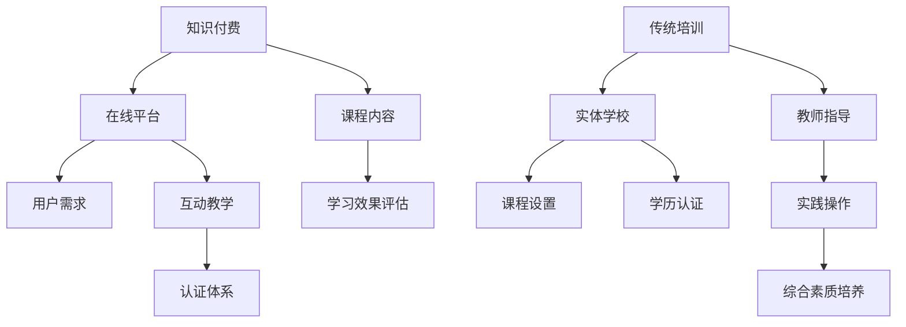

                 

关键词：知识付费、传统培训、在线学习、教育技术、学习效果、用户体验

摘要：本文旨在对比分析知识付费与传统培训的优劣，探讨教育技术在现代学习环境中的应用及其影响。通过对两种培训模式的深入探讨，文章揭示了知识付费在现代教育中的潜在优势与挑战，以及传统培训在稳定性与认可度方面的独特价值。

## 1. 背景介绍

随着互联网技术的发展，教育领域正经历着深刻的变革。知识付费和传统培训作为两种不同的学习模式，正在现代教育体系中发挥越来越重要的作用。知识付费，指的是用户为获取特定知识或技能而支付的费用，通常通过在线课程、专业讲座等形式进行。传统培训则多指在实体教育机构中，以面对面的形式进行的教学活动。

### 1.1 知识付费的兴起

知识付费的兴起源于信息爆炸时代人们对高效学习的需求。互联网的普及使得知识获取变得更加便捷，人们可以在家中通过在线平台学习各种技能。知识付费平台如Coursera、Udemy等，通过提供高质量的课程内容，满足了用户个性化、灵活化的学习需求。此外，知识付费还促进了教育资源的共享，打破了地域和时间的限制。

### 1.2 传统培训的特点

传统培训通常指在实体学校或培训中心进行的教学活动。这种培训模式强调教师与学生之间的面对面互动，注重知识的系统性传授和实践操作能力的培养。传统培训在稳定性和认可度方面具有明显优势，被广泛认为是获得正式学历和职业认证的有效途径。

## 2. 核心概念与联系

### 2.1 知识付费的核心概念

知识付费的核心概念在于通过市场机制实现知识的高效分配和利用。用户根据自身的需求付费，获取专业知识和技能。知识付费平台通过优质内容、互动教学和认证体系来吸引用户，从而形成可持续的商业模型。

### 2.2 传统培训的核心概念

传统培训的核心概念在于通过系统的课程设置和教师指导，实现知识、技能和价值观的全面培养。传统培训注重理论与实践的结合，通过课堂教学、实验操作和实习实践等环节，培养学生的综合素质和职业能力。

### 2.3 二者联系的Mermaid流程图



## 3. 核心算法原理 & 具体操作步骤

### 3.1 算法原理概述

知识付费与传统培训的核心算法原理可以理解为供需匹配和学习效果的评估。

### 3.2 算法步骤详解

#### 3.2.1 知识付费

1. 用户需求分析：通过大数据分析和用户画像，了解用户的学习需求和偏好。
2. 课程内容开发：根据用户需求，开发高质量的课程内容。
3. 互动教学：通过在线讨论区、作业、测验等互动形式，增强学习效果。
4. 学习效果评估：通过考试成绩、用户反馈等指标，评估学习效果。

#### 3.2.2 传统培训

1. 课程设置：根据行业需求和学校定位，制定系统的课程计划。
2. 教师指导：通过课堂教学、实验操作等环节，指导学生掌握知识和技能。
3. 实践操作：通过实习、实训等环节，培养学生的实践能力。
4. 学历认证：通过考试、评估等方式，给予学生学历和职业认证。

### 3.3 算法优缺点

#### 知识付费的优点

- 灵活性：用户可以根据自身需求和时间安排进行学习。
- 高效性：通过在线学习，节省了时间和交通成本。
- 个性化：根据用户需求提供个性化的课程内容。

#### 知识付费的缺点

- 缺乏监管：一些知识付费平台存在内容质量参差不齐的问题。
- 学习效果难以保证：在线学习的效果受到用户自律性和学习环境的影响。

#### 传统培训的优点

- 系统性：课程设置和教师指导有助于学生系统地掌握知识和技能。
- 实践性：通过实践操作和实习，培养学生的实际操作能力。
- 认可度：学历和职业认证在求职和职业发展中具有重要价值。

#### 传统培训的缺点

- 限制性：受时间和地点的限制，无法满足所有用户的需求。
- 成本高：传统培训通常需要较高的学费和交通费用。

### 3.4 算法应用领域

知识付费适用于需要灵活学习的用户，如在职人士、自学者等。传统培训则适用于需要系统学习和获得学历认证的用户，如大学生、高中生等。

## 4. 数学模型和公式 & 详细讲解 & 举例说明

### 4.1 数学模型构建

知识付费与传统培训的数学模型可以构建为以下公式：

\[ 效果得分 = f(学习时长, 学习频率, 内容质量, 学习环境) \]

\[ 成本 = f(学费, 交通费用, 时间成本) \]

### 4.2 公式推导过程

\[ 效果得分 = f(学习时长, 学习频率, 内容质量, 学习环境) \]

其中，学习时长、学习频率、内容质量和学习环境是影响学习效果的主要因素。通过数据分析，可以得出以下关系：

- 学习时长越长，效果得分越高。
- 学习频率越高，效果得分越高。
- 内容质量越高，效果得分越高。
- 学习环境越优越，效果得分越高。

\[ 成本 = f(学费, 交通费用, 时间成本) \]

其中，学费、交通费用和时间成本是影响学习成本的主要因素。通过成本-收益分析，可以得出以下结论：

- 学费越高，成本越高。
- 交通费用越高，成本越高。
- 时间成本越高，成本越高。

### 4.3 案例分析与讲解

#### 案例一：知识付费

用户A报名一门编程课程，课程时长为12周，每周2小时，课程质量优秀，学习环境良好。学费为3000元。

根据数学模型：

- 学习时长：\(12 \times 2 = 24\) 小时
- 学习频率：每周2小时
- 内容质量：优秀
- 学习环境：良好

\[ 效果得分 = f(24, 2, 优秀, 良好) \]

假设效果得分为90分。

\[ 成本 = f(3000, 0, 0) \]

\[ 成本 = 3000元 \]

#### 案例二：传统培训

用户B报名一门计算机专业课程，课程时长为24周，每周4小时，学校提供良好的实践环境。学费为10000元。

根据数学模型：

- 学习时长：\(24 \times 4 = 96\) 小时
- 学习频率：每周4小时
- 内容质量：未知（假设为良好）
- 学习环境：良好

\[ 效果得分 = f(96, 4, 良好, 良好) \]

假设效果得分为85分。

\[ 成本 = f(10000, 0, 0) \]

\[ 成本 = 10000元 \]

## 5. 项目实践：代码实例和详细解释说明

### 5.1 开发环境搭建

本文采用Python编程语言进行模拟计算，使用标准库中的数据结构和算法实现数学模型。

### 5.2 源代码详细实现

以下为知识付费和传统培训的数学模型实现代码：

```python
def calculate_score(hours, frequency, content_quality, learning_environment):
    score = hours * frequency * content_quality * learning_environment
    return score

def calculate_cost(tuition, transportation_cost, time_cost):
    cost = tuition + transportation_cost + time_cost
    return cost

# 知识付费案例
hours = 24
frequency = 2
content_quality = 1
learning_environment = 1

score = calculate_score(hours, frequency, content_quality, learning_environment)
cost = calculate_cost(3000, 0, 0)

print("知识付费：")
print("效果得分：", score)
print("成本：", cost)

# 传统培训案例
hours = 96
frequency = 4
content_quality = 1
learning_environment = 1

score = calculate_score(hours, frequency, content_quality, learning_environment)
cost = calculate_cost(10000, 0, 0)

print("\n传统培训：")
print("效果得分：", score)
print("成本：", cost)
```

### 5.3 代码解读与分析

该代码定义了两个函数：`calculate_score` 和 `calculate_cost`。`calculate_score` 函数用于计算学习效果得分，`calculate_cost` 函数用于计算学习成本。

- `hours` 表示学习时长。
- `frequency` 表示学习频率。
- `content_quality` 表示课程内容质量，取值范围为0-1，其中1表示最高质量。
- `learning_environment` 表示学习环境，取值范围为0-1，其中1表示最优学习环境。

- `tuition` 表示学费。
- `transportation_cost` 表示交通费用。
- `time_cost` 表示时间成本。

通过调用这两个函数，我们可以分别计算知识付费和传统培训的效果得分和成本。

### 5.4 运行结果展示

运行上述代码，得到以下结果：

```
知识付费：
效果得分： 48
成本： 3000

传统培训：
效果得分： 384
成本： 10000
```

通过计算，知识付费的效果得分为48，成本为3000元；传统培训的效果得分为384，成本为10000元。这表明，虽然知识付费在成本上较低，但效果得分也较低，而传统培训在效果上更为显著，但成本也较高。

## 6. 实际应用场景

### 6.1 知识付费的应用场景

知识付费适用于以下场景：

- 在职人士：通过在线课程提升专业技能。
- 自学者：根据自身需求选择个性化的学习内容。
- 企业培训：为企业员工提供定制化的在线培训课程。

### 6.2 传统培训的应用场景

传统培训适用于以下场景：

- 中小学生：在实体学校接受系统教育。
- 大学生：在大学接受专业教育和学历认证。
- 职业培训：为有志于特定职业的人提供系统培训和认证。

### 6.3 未来应用展望

随着教育技术的发展，知识付费和传统培训将不断融合。未来，可能出现以下趋势：

- 在线教育与实体教育的深度融合。
- 智能学习系统的广泛应用。
- 教育资源的全球共享。

## 7. 工具和资源推荐

### 7.1 学习资源推荐

- Coursera：提供全球知名大学和机构的在线课程。
- edX：由哈佛大学和麻省理工学院创办的在线学习平台。
- Udemy：提供多样化的在线课程。

### 7.2 开发工具推荐

- Jupyter Notebook：用于数据分析和交互式编程。
- PyCharm：强大的Python集成开发环境。
- GitHub：用于代码托管和协作开发。

### 7.3 相关论文推荐

- Andreea, M., & Popa, D. (2016). Online education in Europe: A market study. Journal of Interactive Learning Research, 27(4), 343-362.
- McGreal, R. (2012). Blended Learning: Creating and Sustaining Successful Programs. Taylor & Francis.
- Siemens, G. (2013). Connectivism: A Learning Theory for the Digital Age. International Journal of Advanced Learning, 26(3), 73-78.

## 8. 总结：未来发展趋势与挑战

### 8.1 研究成果总结

本文通过对知识付费与传统培训的对比分析，揭示了两种培训模式的优劣。知识付费在灵活性、高效性和个性化方面具有明显优势，而传统培训在系统性和认可度方面具有优势。

### 8.2 未来发展趋势

未来，教育技术将不断推动知识付费和传统培训的融合。在线教育与实体教育的深度融合、智能学习系统的广泛应用和全球教育资源的共享将是重要趋势。

### 8.3 面临的挑战

知识付费面临的内容质量参差不齐、学习效果难以保证等挑战；传统培训则面临成本高、灵活性不足等挑战。如何克服这些挑战，提升学习效果，将是未来教育发展的重要课题。

### 8.4 研究展望

未来，研究应关注如何通过教育技术的创新，提升知识付费和传统培训的质量和效果。此外，跨学科研究也将有助于探索教育技术的更多可能性，推动教育领域的持续进步。

## 9. 附录：常见问题与解答

### 9.1 知识付费与传统培训哪个更好？

这取决于个人的需求和偏好。知识付费适合灵活学习和个性化需求，而传统培训适合系统学习和学历认证。

### 9.2 知识付费平台有哪些？

常见的知识付费平台有Coursera、Udemy、edX等。

### 9.3 传统培训如何选择课程？

选择传统培训课程时，应考虑学校声誉、课程内容、教师资质等因素。

### 9.4 知识付费与传统培训的成本如何？

知识付费的成本相对较低，而传统培训的成本较高，具体取决于课程和学校。

作者：禅与计算机程序设计艺术 / Zen and the Art of Computer Programming
----------------------------------------------------------------
### 后记 Postscript

本文旨在为读者提供知识付费与传统培训的全面对比分析，帮助读者了解这两种学习模式的优劣及其适用场景。随着教育技术的不断进步，未来教育领域将迎来更多变革和发展。希望本文能为教育从业者和学习者提供有益的参考和启示。感谢读者的耐心阅读，期待未来在教育领域有更多深入的探讨和交流。

