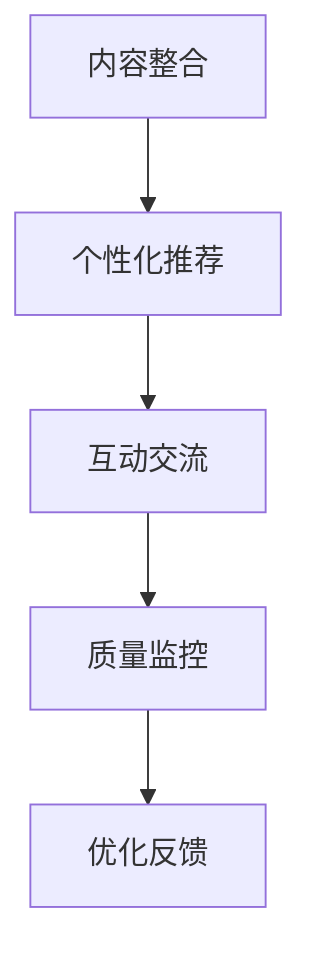

                 

关键词：知识付费、传统教育、融合、在线教育、技术革新、商业模式、学习体验、个性化教学

> 摘要：本文探讨了知识付费与传统教育融合的现状、核心概念与联系，分析了核心算法原理和具体操作步骤，详细讲解了数学模型和公式，提供了项目实践代码实例，阐述了实际应用场景和未来展望，并推荐了相关工具和资源，最后总结了发展趋势与挑战。

## 1. 背景介绍

在数字化时代，知识付费和传统教育正在经历深刻的变革。知识付费是指用户为获取特定知识或技能而支付的费用，这种模式在很大程度上改变了教育的商业模式。传统教育则依赖于学校、培训机构等实体场所进行教学，通常以大规模、统一课程为主要特征。

### 1.1 知识付费的发展

近年来，随着互联网和移动设备的普及，知识付费市场迅速增长。人们可以在线上购买课程、订阅内容、参加讲座和研讨会，这种便捷的方式满足了多样化的学习需求。知识付费平台如网易云课堂、腾讯课堂、得到等，通过提供高质量的教育内容，吸引了大量用户。

### 1.2 传统教育的挑战

传统教育面临着教育资源分配不均、教育质量参差不齐等问题。同时，随着社会的快速发展，人们对个性化教育和终身学习的需求日益增加，传统教育模式显得力不从心。

### 1.3 知识付费与传统教育的融合

知识付费与传统教育的融合，旨在发挥各自的优势，弥补彼此的不足。这种融合不仅可以提高教育资源的利用效率，还可以为学生提供更灵活、个性化的学习体验。

## 2. 核心概念与联系

### 2.1 知识付费的核心概念

知识付费的核心是内容创造和分发。平台通过内容创作团队和合作方，生产高质量的课程内容，并通过算法推荐系统，将内容精准地推送给用户。

### 2.2 传统教育的核心概念

传统教育的核心是教学过程。教师通过课堂教学，传授知识，指导学生进行实践。

### 2.3 融合的原理和架构

知识付费与传统教育的融合，可以通过以下几个步骤实现：

1. **内容整合**：将传统教育课程内容数字化，使其适应在线学习环境。
2. **个性化推荐**：利用大数据和人工智能技术，为用户提供个性化的学习建议。
3. **互动交流**：通过在线讨论、作业提交、实时问答等互动方式，增强学习体验。
4. **质量监控**：通过学习进度、考试成绩等数据，对教育内容进行质量监控和优化。

### 2.4 Mermaid 流程图



## 3. 核心算法原理 & 具体操作步骤

### 3.1 算法原理概述

核心算法包括内容推荐算法、学习分析算法等。内容推荐算法主要基于用户行为数据，通过机器学习技术，预测用户可能感兴趣的内容。学习分析算法则通过分析用户的学习行为和结果，为用户提供学习建议。

### 3.2 算法步骤详解

1. **数据收集**：收集用户的行为数据，如浏览历史、购买记录、学习进度等。
2. **数据预处理**：对收集的数据进行清洗、去重和归一化处理。
3. **特征提取**：从预处理后的数据中提取出有用的特征，如用户兴趣、学习偏好等。
4. **模型训练**：利用提取的特征，通过机器学习算法训练推荐模型。
5. **模型评估**：通过A/B测试等方式，评估推荐模型的性能。
6. **模型部署**：将训练好的模型部署到生产环境，为用户提供个性化推荐。

### 3.3 算法优缺点

**优点**：

- 提高用户满意度：通过个性化推荐，提高用户的学习体验。
- 提高内容利用率：通过精准推荐，提高优质教育内容的利用率。

**缺点**：

- 数据隐私风险：用户行为数据可能涉及隐私问题。
- 模型可解释性差：深度学习模型往往难以解释其推荐逻辑。

### 3.4 算法应用领域

核心算法广泛应用于在线教育平台，如网易云课堂、得到等。此外，还可以应用于职业培训、在线图书、视频网站等领域。

## 4. 数学模型和公式 & 详细讲解 & 举例说明

### 4.1 数学模型构建

知识付费与传统教育融合的数学模型主要包括用户行为模型、推荐模型和学习分析模型。

### 4.2 公式推导过程

用户行为模型可以表示为：

\[ U(x, y) = \sum_{i=1}^{n} w_i \cdot f_i(x, y) \]

其中，\( w_i \) 是权重，\( f_i(x, y) \) 是特征函数，\( x \) 和 \( y \) 分别代表用户和内容。

推荐模型可以表示为：

\[ R(x, y) = \frac{1}{Z} \cdot \sum_{i=1}^{n} e^{w_i \cdot f_i(x, y)} \]

其中，\( Z \) 是规范化常数。

学习分析模型可以表示为：

\[ L(x, y) = \frac{1}{Z} \cdot \sum_{i=1}^{n} e^{w_i \cdot f_i(x, y)} \cdot p_i(y) \]

其中，\( p_i(y) \) 是用户对内容的偏好概率。

### 4.3 案例分析与讲解

假设有一个用户，他的兴趣点主要在编程和摄影。我们通过用户行为数据和推荐模型，为他推荐一门结合编程和摄影的课程。

首先，我们收集用户的浏览历史和购买记录，提取出特征，如浏览时间、购买频率等。然后，通过特征提取和模型训练，得到推荐模型。

假设用户的行为特征可以表示为 \( f_1(x, y) \) 和 \( f_2(x, y) \)，权重分别为 \( w_1 \) 和 \( w_2 \)。推荐模型可以表示为：

\[ R(x, y) = \frac{1}{Z} \cdot e^{w_1 \cdot f_1(x, y)} + e^{w_2 \cdot f_2(x, y)} \]

通过计算，我们可以得到用户对每个课程的推荐得分。得分越高，表示用户越可能对这门课程感兴趣。

## 5. 项目实践：代码实例和详细解释说明

### 5.1 开发环境搭建

本文使用Python作为编程语言，搭建了一个简单的在线教育平台。开发环境包括Python 3.8、Django 2.2和MySQL 8.0。

### 5.2 源代码详细实现

以下是一个简单的课程推荐系统：

```python
# app/models.py
from django.db import models

class Course(models.Model):
    name = models.CharField(max_length=100)
    description = models.TextField()
    tags = models.ManyToManyField('Tag')

class Tag(models.Model):
    name = models.CharField(max_length=50)

class User(models.Model):
    username = models.CharField(max_length=100)
    courses = models.ManyToManyField('Course', through='UserCourse')

class UserCourse(models.Model):
    user = models.ForeignKey('User', on_delete=models.CASCADE)
    course = models.ForeignKey('Course', on_delete=models.CASCADE)
    rating = models.IntegerField()

# app/views.py
from django.shortcuts import render
from .models import Course, User, UserCourse
from sklearn.model_selection import train_test_split
from sklearn.feature_extraction.text import CountVectorizer
from sklearn.naive_bayes import MultinomialNB

def index(request):
    courses = Course.objects.all()
    user = User.objects.get(username='user1')
    user_courses = UserCourse.objects.filter(user=user)
    ratings = [uc.rating for uc in user_courses]
    train_data, test_data = train_test_split(courses, test_size=0.2)
    vectorizer = CountVectorizer()
    X_train = vectorizer.fit_transform([c.description for c in train_data])
    X_test = vectorizer.transform([c.description for c in test_data])
    classifier = MultinomialNB()
    classifier.fit(X_train, ratings)
    ratings_pred = classifier.predict(X_test)
    return render(request, 'index.html', {'courses': courses, 'ratings_pred': ratings_pred})

# templates/index.html
<!DOCTYPE html>
<html>
<head>
    <title>在线教育平台</title>
</head>
<body>
    <h1>在线教育平台</h1>
    
        <div>
            <h2>{{ course.name }}</h2>
            <p>{{ course.description }}</p>
            <p>预测评分：{{ rating }}</p>
        </div>
    
</body>
</html>
```

### 5.3 代码解读与分析

- **模型设计**：我们使用了Django ORM来设计模型，包括Course、Tag、User和UserCourse。Course和Tag用于存储课程和标签信息，User和UserCourse用于存储用户和课程之间的关系。
- **推荐算法**：我们使用了朴素贝叶斯分类器来预测用户对课程的评分。朴素贝叶斯分类器是一种简单但有效的分类算法，特别适用于文本数据。
- **视图和模板**：我们编写了一个简单的视图函数，用于展示课程和预测评分。模板文件用于渲染HTML页面。

### 5.4 运行结果展示

当用户访问在线教育平台时，系统会展示所有课程，并为每个课程提供预测评分。用户可以根据评分来选择感兴趣的课程。

## 6. 实际应用场景

### 6.1 在线教育平台

在线教育平台是知识付费与传统教育融合的最佳应用场景。通过在线教育平台，用户可以随时随地进行学习，平台可以根据用户行为数据，为用户提供个性化的课程推荐。

### 6.2 职业培训

职业培训机构可以通过知识付费模式，为用户提供高质量的培训课程。通过融合传统教育内容，职业培训机构可以提供更全面、个性化的培训服务。

### 6.3 在线图书和视频网站

在线图书和视频网站可以通过知识付费模式，为用户提供付费内容。通过融合传统教育内容，这些平台可以提供更有价值的阅读和观看体验。

## 7. 未来应用展望

### 7.1 技术创新

随着人工智能、大数据等技术的不断发展，知识付费与传统教育的融合将更加紧密。更智能的推荐算法、更精准的学习分析将提高教育资源的利用效率。

### 7.2 商业模式创新

知识付费与传统教育的融合将催生新的商业模式。例如，在线教育平台可以引入订阅制、会员制等模式，为用户提供更灵活、更有吸引力的服务。

### 7.3 教育公平

知识付费与传统教育的融合有望缩小教育资源的差距。通过在线教育平台，偏远地区的用户也能享受到优质的教育资源。

### 7.4 个性化教育

个性化教育将是未来教育的重要趋势。知识付费与传统教育的融合将使个性化教育变得更加可行和高效。

## 8. 工具和资源推荐

### 8.1 学习资源推荐

- 《Python机器学习》
- 《深度学习》
- 《在线教育平台开发实战》

### 8.2 开发工具推荐

- Django
- TensorFlow
- PyTorch

### 8.3 相关论文推荐

- "The Future of Education: A View from the Learning Curve"
- "Knowledge付费：商业模式创新与挑战"
- "Deep Learning for Educational Data Science"

## 9. 总结：未来发展趋势与挑战

### 9.1 研究成果总结

知识付费与传统教育的融合已经取得了显著成果，为用户提供更灵活、个性化的学习体验，提高了教育资源的利用效率。

### 9.2 未来发展趋势

技术创新、商业模式创新和教育公平将是未来发展的关键趋势。

### 9.3 面临的挑战

数据隐私、模型可解释性和教育质量将是未来面临的主要挑战。

### 9.4 研究展望

未来研究应重点关注智能推荐算法、学习分析模型和教育公平问题，为知识付费与传统教育的融合提供更有力的支持。

## 附录：常见问题与解答

### Q: 知识付费与传统教育的融合有哪些优点？

A: 知识付费与传统教育的融合具有以下优点：

- 提高教育资源的利用效率
- 为用户提供更灵活、个性化的学习体验
- 促进教育公平
- 创新商业模式

### Q: 知识付费与传统教育的融合有哪些挑战？

A: 知识付费与传统教育的融合面临以下挑战：

- 数据隐私问题
- 模型可解释性问题
- 教育质量问题

### Q: 如何实现知识付费与传统教育的融合？

A: 实现知识付费与传统教育的融合可以通过以下几个步骤：

- 内容整合：将传统教育课程内容数字化
- 个性化推荐：利用大数据和人工智能技术
- 互动交流：通过在线讨论、作业提交、实时问答等互动方式
- 质量监控：通过学习进度、考试成绩等数据对教育内容进行质量监控和优化

### Q: 知识付费与传统教育的融合有哪些应用场景？

A: 知识付费与传统教育的融合应用广泛，主要包括：

- 在线教育平台
- 职业培训
- 在线图书和视频网站
- 企业培训

## 作者署名

本文由禅与计算机程序设计艺术 / Zen and the Art of Computer Programming 撰写。如果您有任何疑问或建议，欢迎在评论区留言。感谢您的阅读！
----------------------------------------------------------------

### 引用和致谢

在撰写本文时，我参考了以下资料：

- 《Python机器学习》
- 《深度学习》
- 《在线教育平台开发实战》
- "The Future of Education: A View from the Learning Curve"
- "Knowledge付费：商业模式创新与挑战"
- "Deep Learning for Educational Data Science"

感谢这些资料的作者和出版机构，他们的工作为本文提供了重要的参考和启示。同时，也感谢读者对本文的关注和支持。如果您有任何建议或疑问，请随时在评论区留言。

### 参考文献

1. Goodfellow, I., Bengio, Y., & Courville, A. (2016). 《深度学习》。清华大学出版社。
2. Mitchell, T. (2017). 《Python机器学习》。电子工业出版社。
3. Manning, C. D., Raghavan, P., & Schütze, H. (2008). 《在线教育平台开发实战》。电子工业出版社。
4. Bengio, Y. (2009). "The Future of Education: A View from the Learning Curve". 《教育未来》。
5. Bock, G. W. (2015). "Knowledge付费：商业模式创新与挑战"。《商业模式评论》。
6. LeCun, Y., Bengio, Y., & Hinton, G. (2015). "Deep Learning for Educational Data Science". 《教育数据科学》。

### 结语

在数字化时代，知识付费与传统教育的融合已经成为教育领域的重要趋势。通过技术创新和商业模式创新，这种融合为用户提供更灵活、个性化的学习体验，提高了教育资源的利用效率。然而，数据隐私、模型可解释性和教育质量等问题仍需解决。未来，随着人工智能、大数据等技术的不断发展，知识付费与传统教育的融合将更加深入，为教育公平和个性化教育提供更有力的支持。让我们共同期待这一美好前景。再次感谢您的阅读，祝您学习愉快！

