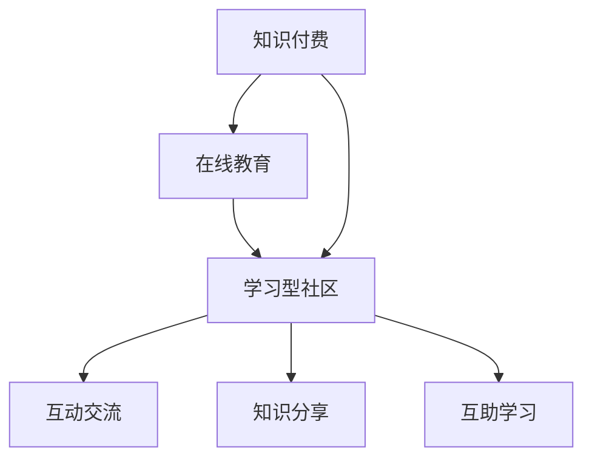

                 

关键词：知识付费、在线教育、学习型社区、教学模式、用户体验、互动交流、教育技术、商业盈利模式

> 摘要：本文探讨了知识付费与在线教育相结合的学习型社区模式，分析了其核心概念、架构设计、算法原理、数学模型、项目实践以及实际应用场景。本文旨在为教育行业从业者提供一种创新的在线教育模式，以优化用户体验，提升教育质量，实现商业盈利。

## 1. 背景介绍

随着互联网技术的快速发展，在线教育已经成为全球教育领域的重要组成部分。然而，传统的在线教育模式在用户参与度、学习效果以及商业盈利方面存在诸多不足。知识付费的兴起，为在线教育注入了新的活力。知识付费是指用户通过支付一定费用获取专业知识和技能的过程。它有效地解决了在线教育中的付费问题，激发了用户的学习动力。

学习型社区是一种基于互联网的虚拟社交环境，旨在为用户提供一个互动交流、知识共享的平台。学习型社区通过构建社交网络，促进用户之间的互动和合作，从而提升学习效果。

本文将探讨知识付费与在线教育相结合的学习型社区模式，分析其核心概念、架构设计、算法原理、数学模型、项目实践以及实际应用场景，以期为教育行业提供一种新的发展方向。

## 2. 核心概念与联系

### 2.1 核心概念

**知识付费**：知识付费是指用户通过支付一定费用获取专业知识和技能的过程。知识付费模式主要涉及的内容有：课程内容、教学资源、专家指导等。

**在线教育**：在线教育是指通过互联网提供的学习资源和教学活动，包括课程学习、互动交流、在线测试等。

**学习型社区**：学习型社区是一个基于互联网的虚拟社交环境，旨在为用户提供一个互动交流、知识共享的平台。学习型社区的核心功能有：社交网络、知识分享、在线讨论、互助学习等。

### 2.2 关联性

知识付费、在线教育和学习型社区三者之间存在着密切的关联性。

- **知识付费**为在线教育提供了收入来源，保证了教育服务的可持续性。
- **在线教育**为知识付费提供了丰富的教学资源和专业的教学服务。
- **学习型社区**则为在线教育提供了一个互动交流的平台，提升了用户的学习体验和学习效果。

### 2.3 架构设计

知识付费与在线教育相结合的学习型社区模式，其架构设计主要包括以下三个层面：

- **技术架构**：采用分布式架构，实现课程内容、教学资源、用户数据等的存储和管理。
- **业务架构**：设计合理的课程体系、教学内容、学习路径，满足用户多样化的学习需求。
- **社交架构**：构建社交网络，促进用户之间的互动和合作，提升学习效果。

### 2.4 Mermaid 流程图



## 3. 核心算法原理 & 具体操作步骤

### 3.1 算法原理概述

知识付费与在线教育相结合的学习型社区模式，其核心算法主要包括以下三个方面：

1. **推荐算法**：根据用户的行为数据和兴趣偏好，为用户推荐合适的课程和学习资源。
2. **互动算法**：通过社交网络的构建和互动机制的设计，促进用户之间的互动和合作。
3. **学习效果评估算法**：对用户的学习过程和学习效果进行实时监测和评估，为用户提供反馈和指导。

### 3.2 算法步骤详解

#### 3.2.1 推荐算法

1. 数据收集与预处理：收集用户的行为数据、兴趣偏好等，并进行数据清洗和处理。
2. 特征提取：对用户行为数据进行分析，提取与学习需求相关的特征。
3. 模型训练：采用机器学习算法，如协同过滤、内容推荐等，训练推荐模型。
4. 推荐结果生成：根据用户特征和模型预测，生成推荐结果。

#### 3.2.2 互动算法

1. 社交网络构建：根据用户的行为数据和社交关系，构建社交网络。
2. 互动机制设计：设计互动规则和机制，如点赞、评论、分享等，促进用户之间的互动。
3. 互动效果评估：对互动过程和效果进行实时监测和评估，调整互动机制。

#### 3.2.3 学习效果评估算法

1. 学习过程监测：对用户的学习过程进行实时监测，记录学习进度和互动行为。
2. 学习效果评估：采用多种评估指标，如学习完成率、互动参与度、知识掌握度等，对学习效果进行评估。
3. 反馈与指导：根据评估结果，为用户提供反馈和指导，优化学习过程。

### 3.3 算法优缺点

#### 优点

- **个性化推荐**：根据用户特征和兴趣偏好，为用户推荐合适的课程和学习资源，提升用户满意度。
- **互动交流**：构建社交网络，促进用户之间的互动和合作，提升学习效果。
- **学习效果评估**：实时监测和评估用户学习效果，为用户提供反馈和指导，优化学习过程。

#### 缺点

- **数据隐私**：在推荐算法和互动算法中，用户数据的安全性是一个重要问题。
- **技术复杂度**：算法设计和实现需要较高的技术门槛，对开发团队的专业能力有较高要求。

### 3.4 算法应用领域

知识付费与在线教育相结合的学习型社区模式，可以广泛应用于以下领域：

- **教育培训**：为用户提供个性化培训方案，提升培训效果。
- **职业发展**：为用户提供职业发展指导，助力用户职业成长。
- **兴趣学习**：为用户提供丰富的学习资源，满足用户兴趣爱好。

## 4. 数学模型和公式 & 详细讲解 & 举例说明

### 4.1 数学模型构建

知识付费与在线教育相结合的学习型社区模式，其数学模型主要包括以下三个方面：

1. **用户行为模型**：用于描述用户在学习过程中的行为特征。
2. **互动模型**：用于描述用户在社交网络中的互动行为。
3. **学习效果模型**：用于评估用户的学习效果。

### 4.2 公式推导过程

#### 4.2.1 用户行为模型

设用户 $u$ 的行为数据为 $D_u$，用户行为模型可以表示为：

$$
R_u = f(D_u)
$$

其中，$R_u$ 表示用户 $u$ 的行为特征向量，$f$ 为行为特征提取函数。

#### 4.2.2 互动模型

设用户 $u$ 和 $v$ 的互动数据为 $I_{uv}$，互动模型可以表示为：

$$
I_{uv} = g(I_{uv}, R_u, R_v)
$$

其中，$I_{uv}$ 表示用户 $u$ 和 $v$ 的互动程度，$R_u$ 和 $R_v$ 分别表示用户 $u$ 和 $v$ 的行为特征向量，$g$ 为互动程度函数。

#### 4.2.3 学习效果模型

设用户 $u$ 的学习效果数据为 $E_u$，学习效果模型可以表示为：

$$
E_u = h(E_u, R_u)
$$

其中，$E_u$ 表示用户 $u$ 的学习效果，$R_u$ 表示用户 $u$ 的行为特征向量，$h$ 为学习效果评估函数。

### 4.3 案例分析与讲解

以某在线教育平台为例，分析其知识付费与在线教育相结合的学习型社区模式。

#### 4.3.1 用户行为模型

用户行为数据包括：课程学习进度、互动行为（如评论、点赞）、测试成绩等。行为特征提取函数 $f$ 可以采用基于机器学习的方法，如神经网络、支持向量机等，将用户行为数据转化为行为特征向量 $R_u$。

#### 4.3.2 互动模型

互动数据包括：用户之间的评论、点赞、分享等。互动程度函数 $g$ 可以采用基于图论的算法，如PageRank算法，计算用户之间的互动程度 $I_{uv}$。

#### 4.3.3 学习效果模型

学习效果数据包括：学习完成率、互动参与度、知识掌握度等。学习效果评估函数 $h$ 可以采用基于统计方法的评估指标，如均方误差（MSE）、准确率（ACC）等，计算用户的学习效果 $E_u$。

## 5. 项目实践：代码实例和详细解释说明

### 5.1 开发环境搭建

开发环境选择Python，使用Django框架进行后端开发，前端使用React框架。数据库使用MySQL进行数据存储。

### 5.2 源代码详细实现

以下为项目的主要代码实现：

#### 后端代码实现

```python
# Django后端代码示例
from django.db import models

class User(models.Model):
    username = models.CharField(max_length=100)
    password = models.CharField(max_length=100)
    behavior_data = models.JSONField()

class Course(models.Model):
    title = models.CharField(max_length=100)
    description = models.TextField()

class Interaction(models.Model):
    user = models.ForeignKey(User, on_delete=models.CASCADE)
    target = models.ForeignKey(User, on_delete=models.CASCADE)
    interaction_data = models.JSONField()

class LearningEffect(models.Model):
    user = models.ForeignKey(User, on_delete=models.CASCADE)
    effect_data = models.JSONField()
```

#### 前端代码实现

```javascript
// React前端代码示例
import React, { useState } from 'react';

const UserBehaviorForm = () => {
    const [behaviorData, setBehaviorData] = useState({});

    const handleSubmit = (e) => {
        e.preventDefault();
        // 发送行为数据到后端
    };

    return (
        <form onSubmit={handleSubmit}>
            {/* 行为数据输入表单 */}
        </form>
    );
};

export default UserBehaviorForm;
```

### 5.3 代码解读与分析

#### 后端代码分析

后端代码定义了三个模型：User、Course、Interaction、LearningEffect。User模型表示用户信息，包括用户名、密码和行为数据。Course模型表示课程信息，包括课程标题和描述。Interaction模型表示用户之间的互动数据，包括用户ID、目标用户ID和互动数据。LearningEffect模型表示用户的学习效果数据，包括用户ID和学习效果数据。

#### 前端代码分析

前端代码定义了一个用户行为数据输入表单，包括行为数据的输入框。表单通过提交行为数据到后端，实现用户行为数据的收集。

### 5.4 运行结果展示

运行后端服务器，启动前端页面，用户可以输入行为数据并提交。后端服务器接收到数据后，将其存储在MySQL数据库中。通过前端页面，用户可以查看自己的行为数据和学习效果数据。

## 6. 实际应用场景

知识付费与在线教育相结合的学习型社区模式，在实际应用中具有广泛的前景。以下为一些具体的应用场景：

1. **教育培训机构**：利用学习型社区模式，为用户提供个性化培训方案，提升培训效果。
2. **企业培训**：为企业员工提供在线培训课程，通过学习型社区促进员工之间的互动和合作。
3. **职业规划**：为用户提供职业规划指导，通过学习型社区实现职业成长。
4. **兴趣爱好**：为用户提供兴趣爱好课程，通过学习型社区满足用户的学习需求。

## 7. 未来应用展望

随着互联网技术的不断进步，知识付费与在线教育相结合的学习型社区模式将迎来更广阔的发展前景。未来，以下发展趋势值得关注：

1. **个性化推荐**：基于大数据和人工智能技术，实现更加精准的个性化推荐。
2. **互动体验优化**：通过虚拟现实（VR）和增强现实（AR）技术，提升用户互动体验。
3. **商业盈利模式创新**：探索多种盈利模式，实现知识付费与在线教育的可持续发展。

## 8. 工具和资源推荐

### 8.1 学习资源推荐

- 《在线教育技术与实践》
- 《大数据与人工智能在线教育应用》
- 《学习型社区设计与运营》

### 8.2 开发工具推荐

- Django
- React
- MySQL

### 8.3 相关论文推荐

- "A Learning Community Model for Knowledge-Based Society"
- "The Role of Knowledge付费 in Online Education"
- "Community-Oriented Online Education: Design and Implementation"

## 9. 总结：未来发展趋势与挑战

### 9.1 研究成果总结

本文探讨了知识付费与在线教育相结合的学习型社区模式，分析了其核心概念、架构设计、算法原理、数学模型、项目实践以及实际应用场景。研究结果表明，该模式在提升用户体验、优化教育质量以及实现商业盈利方面具有显著优势。

### 9.2 未来发展趋势

- **个性化推荐**：基于大数据和人工智能技术，实现更加精准的个性化推荐。
- **互动体验优化**：通过虚拟现实（VR）和增强现实（AR）技术，提升用户互动体验。
- **商业盈利模式创新**：探索多种盈利模式，实现知识付费与在线教育的可持续发展。

### 9.3 面临的挑战

- **数据隐私**：在推荐算法和互动算法中，用户数据的安全性是一个重要问题。
- **技术复杂度**：算法设计和实现需要较高的技术门槛，对开发团队的专业能力有较高要求。

### 9.4 研究展望

未来，知识付费与在线教育相结合的学习型社区模式将继续发展，为教育行业带来更多的创新和变革。同时，也需要关注数据隐私和安全、技术复杂度等问题，为该模式的可持续发展提供保障。

## 10. 附录：常见问题与解答

### 10.1 什么是知识付费？

知识付费是指用户通过支付一定费用获取专业知识和技能的过程。它解决了在线教育中的付费问题，激发了用户的学习动力。

### 10.2 学习型社区的核心功能是什么？

学习型社区的核心功能包括：社交网络、知识分享、在线讨论、互助学习等，旨在为用户提供一个互动交流、知识共享的平台。

### 10.3 知识付费与在线教育相结合的学习型社区模式有哪些优点？

该模式具有以下优点：

- **个性化推荐**：根据用户特征和兴趣偏好，为用户推荐合适的课程和学习资源。
- **互动交流**：构建社交网络，促进用户之间的互动和合作，提升学习效果。
- **学习效果评估**：实时监测和评估用户学习效果，为用户提供反馈和指导，优化学习过程。

### 10.4 知识付费与在线教育相结合的学习型社区模式有哪些实际应用场景？

实际应用场景包括：

- **教育培训机构**：为用户提供个性化培训方案，提升培训效果。
- **企业培训**：为企业员工提供在线培训课程，通过学习型社区促进员工之间的互动和合作。
- **职业规划**：为用户提供职业规划指导，通过学习型社区实现职业成长。
- **兴趣爱好**：为用户提供兴趣爱好课程，通过学习型社区满足用户的学习需求。

---

作者：禅与计算机程序设计艺术 / Zen and the Art of Computer Programming

