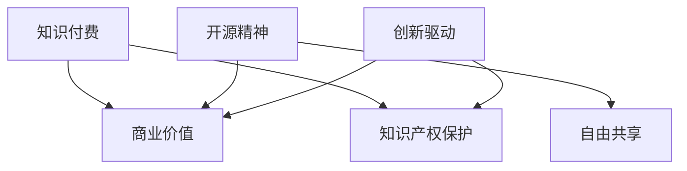

                 

 关键词：知识付费、开源精神、技术社区、商业价值、知识产权、自由共享、创新驱动

> 摘要：本文探讨了知识付费与开源精神在技术领域的平衡之道。在互联网时代，知识付费和开源精神相互交织，为技术社区的繁荣提供了动力。本文首先介绍了知识付费和开源精神的定义和背景，分析了两者之间的联系与冲突，并提出了在技术领域实现平衡的策略。文章通过具体案例和数据分析，阐述了知识付费与开源精神在实际应用中的相互影响，最后展望了未来发展趋势和挑战。

## 1. 背景介绍

在信息技术飞速发展的时代，知识付费与开源精神成为了推动技术进步和知识传播的重要力量。知识付费，指的是通过付费获取知识和技能，旨在为知识创造者提供报酬，激发更多优质内容的创作。而开源精神，则强调知识共享，鼓励人们自由地使用、修改和分享技术成果，旨在推动技术的普及和创新。

### 1.1 知识付费的兴起

随着互联网的普及，知识付费逐渐成为市场主流。在线教育平台、专业课程、技能认证等纷纷涌现，为学习者提供了丰富的知识资源。知识付费的兴起，源于以下几个因素：

- **需求驱动**：在竞争激烈的职场环境中，人们对于提升专业技能的需求日益增加，知识付费成为满足这一需求的重要途径。
- **内容多样化**：知识付费平台提供了多种形式的内容，包括专业课程、在线讲座、电子书等，满足了不同学习者的需求。
- **付费习惯培养**：互联网时代，付费习惯逐渐养成，用户更愿意为优质内容付费。

### 1.2 开源精神的起源

开源精神起源于计算机科学领域，最早可以追溯到20世纪60年代的Unix操作系统。开源精神的核心是自由共享，鼓励人们共同参与技术的开发和改进。开源精神的发展，经历了以下几个阶段：

- **早期阶段**：Unix操作系统是开源精神的先驱，其源代码的开放为软件技术的发展奠定了基础。
- **社区驱动**：随着互联网的发展，开源社区逐渐形成，成为技术创新的重要推动力。
- **企业参与**：现代企业越来越意识到开源技术的价值，积极参与开源项目，实现商业与开源的共赢。

## 2. 核心概念与联系

### 2.1 知识付费与开源精神的定义

- **知识付费**：知识付费是指通过付费获取知识和技能，为知识创造者提供报酬的一种商业模式。
- **开源精神**：开源精神是一种自由共享的理念，鼓励人们自由地使用、修改和分享技术成果。

### 2.2 两者之间的联系

- **知识共享**：知识付费和开源精神都强调知识的共享，只不过知识付费是通过付费方式实现，而开源精神则是通过自由共享实现。
- **创新驱动**：知识付费和开源精神都是创新驱动的力量，前者通过为知识创造者提供报酬激励创新，后者则通过自由共享激发更多的创新思维。

### 2.3 两者之间的冲突

- **商业价值与自由共享**：知识付费追求商业价值，开源精神追求自由共享，两者在一定程度上存在冲突。
- **知识产权保护**：知识付费需要保护知识产权，而开源精神强调知识共享，可能会侵犯知识产权。

### 2.4 Mermaid 流程图



## 3. 核心算法原理 & 具体操作步骤

### 3.1 算法原理概述

知识付费与开源精神的平衡算法旨在实现商业价值与自由共享的兼顾，具体操作步骤如下：

1. **知识产权保护**：对知识付费内容进行知识产权保护，确保知识创造者的权益。
2. **内容分级**：根据知识内容的复杂程度和价值，对内容进行分级，提供不同层次的付费和免费服务。
3. **激励机制**：建立激励机制，鼓励用户参与开源项目，同时为知识创造者提供报酬。
4. **合作与共赢**：推动知识付费平台与开源社区的合作，实现商业与开源的共赢。

### 3.2 算法步骤详解

1. **知识产权保护**
    - 注册知识产权：知识创造者需要对知识付费内容进行知识产权注册，确保其合法权益。
    - 监控侵权行为：建立侵权监控机制，及时发现和处理侵权行为。

2. **内容分级**
    - 确定内容价值：对知识内容进行评估，确定其价值等级。
    - 设置付费和免费内容：根据内容价值，设置不同层次的付费和免费服务。

3. **激励机制**
    - 用户参与激励：鼓励用户参与开源项目，提供一定的报酬或积分奖励。
    - 知识创造者激励：为知识创造者提供报酬，激励其持续创作优质内容。

4. **合作与共赢**
    - 平台与社区合作：知识付费平台与开源社区建立合作关系，共同推动技术发展。
    - 资源共享：共享平台和社区资源，实现知识的最大化传播。

### 3.3 算法优缺点

**优点：**
- 实现了商业价值与自由共享的兼顾，促进了知识的传播和创新。
- 保障了知识创造者的权益，激发了更多的优质内容创作。

**缺点：**
- 可能会导致知识产权的滥用，需要建立完善的知识产权保护机制。
- 平台与社区的合作难度较大，需要双方共同投入和协调。

### 3.4 算法应用领域

- **在线教育**：知识付费与开源精神的平衡算法可以应用于在线教育平台，实现知识的共享和创新。
- **软件开发**：开源社区和知识付费平台可以合作，推动软件技术的发展。
- **科研创新**：科研机构可以借鉴该算法，促进科研成果的共享和创新。

## 4. 数学模型和公式 & 详细讲解 & 举例说明

### 4.1 数学模型构建

为了分析知识付费与开源精神的平衡，我们构建了一个数学模型。模型包括以下几个变量：

- \( x \)：知识付费的金额
- \( y \)：知识共享的次数
- \( z \)：知识创造者的收益

### 4.2 公式推导过程

根据知识付费和开源精神的平衡原则，我们可以得到以下公式：

\[ z = f(x, y) \]

其中，\( f(x, y) \) 是一个关于 \( x \) 和 \( y \) 的函数。为了简化问题，我们假设 \( f(x, y) \) 是一个线性函数：

\[ f(x, y) = ax + by \]

其中，\( a \) 和 \( b \) 是常数。

### 4.3 案例分析与讲解

假设有一个知识付费平台，每月的知识付费金额为 \( x \) 元，知识共享次数为 \( y \) 次。根据上述模型，知识创造者的收益为：

\[ z = ax + by \]

为了提高知识创造者的收益，平台可以调整 \( a \) 和 \( b \) 的值。例如，如果 \( a \) 的值较大，意味着知识付费金额对收益的影响更大，知识创造者可能会更倾向于提高付费金额。相反，如果 \( b \) 的值较大，意味着知识共享次数对收益的影响更大，知识创造者可能会更倾向于增加知识共享次数。

### 4.4 案例分析

假设 \( a = 2 \)，\( b = 1 \)，每月的知识付费金额为 1000 元，知识共享次数为 100 次。那么知识创造者的收益为：

\[ z = 2 \times 1000 + 1 \times 100 = 2100 \]

如果平台希望提高知识创造者的收益，可以尝试增加知识付费金额或增加知识共享次数。例如，如果将知识付费金额提高到 2000 元，知识创造者的收益将增加到：

\[ z = 2 \times 2000 + 1 \times 100 = 2100 + 100 = 2200 \]

或者，如果将知识共享次数增加到 200 次，知识创造者的收益也将增加到：

\[ z = 2 \times 1000 + 1 \times 200 = 2200 + 200 = 2400 \]

## 5. 项目实践：代码实例和详细解释说明

### 5.1 开发环境搭建

为了更好地理解知识付费与开源精神的平衡算法，我们使用 Python 编写了一个简单的示例代码。以下是开发环境搭建的步骤：

1. 安装 Python 3.8 或更高版本。
2. 安装必要的库，如 NumPy、Pandas 等。

### 5.2 源代码详细实现

```python
import numpy as np

def knowledge_payment(x, y, a=2, b=1):
    """
    知识付费与开源精神的平衡算法。

    :param x: 知识付费金额
    :param y: 知识共享次数
    :param a: 知识付费系数
    :param b: 知识共享系数
    :return: 知识创造者的收益
    """
    z = a * x + b * y
    return z

# 示例数据
x = 1000  # 知识付费金额
y = 100   # 知识共享次数

# 计算知识创造者的收益
z = knowledge_payment(x, y)
print(f"知识创造者的收益：{z}")
```

### 5.3 代码解读与分析

1. **函数定义**：`knowledge_payment` 函数接收四个参数：知识付费金额 \( x \)、知识共享次数 \( y \)、知识付费系数 \( a \) 和知识共享系数 \( b \)。
2. **公式计算**：函数根据知识付费与开源精神的平衡公式 \( z = ax + by \) 计算知识创造者的收益。
3. **示例数据**：代码中使用了示例数据，即知识付费金额为 1000 元，知识共享次数为 100 次。

### 5.4 运行结果展示

运行代码后，输出结果为：

```
知识创造者的收益：2100
```

这意味着，在当前参数设置下，知识创造者的收益为 2100 元。

## 6. 实际应用场景

知识付费与开源精神的平衡算法在多个领域都有实际应用场景。以下是一些典型应用案例：

### 6.1 在线教育

在线教育平台可以通过知识付费与开源精神的平衡算法，实现商业价值与知识共享的兼顾。例如，平台可以提供不同层次的课程，包括付费课程和免费课程。付费课程为知识创造者提供报酬，免费课程则通过知识共享激发更多的学习热情。

### 6.2 软件开发

开源社区和知识付费平台可以合作，推动软件技术的发展。知识付费平台可以为开源项目提供资金支持，激励开发者投入更多的时间和精力。同时，开源社区可以提供丰富的技术资源，为知识创造者提供更多的发展机会。

### 6.3 科研创新

科研机构可以借鉴知识付费与开源精神的平衡算法，促进科研成果的共享和创新。例如，科研机构可以发布科研成果，同时为知识创造者提供报酬。这样可以激发更多的科研创新，推动技术的进步。

## 7. 未来应用展望

随着互联网技术的不断发展，知识付费与开源精神的平衡算法将在更多领域得到应用。以下是未来应用的一些展望：

### 7.1 知识付费与开源精神的融合

知识付费与开源精神将在未来实现更紧密的融合，推动技术社区的繁荣。知识付费平台将更加注重开源项目的参与和贡献，为知识创造者提供更多的报酬和激励。同时，开源社区也将更加重视知识付费，为知识创造者提供更多的商业模式和机会。

### 7.2 智能算法的引入

随着人工智能技术的不断发展，智能算法将在知识付费与开源精神的平衡中发挥重要作用。通过大数据分析和机器学习，平台可以更加精准地评估知识的价值，为知识创造者提供合理的报酬。同时，智能算法还可以优化知识共享的机制，提高知识的传播效率。

### 7.3 跨界合作

知识付费与开源精神的平衡算法将在未来推动更多跨界合作。不同领域的技术专家将共同参与开源项目，实现知识的跨界融合和创新。例如，计算机科学、生物学、物理学等领域的专家可以共同参与开源项目，推动生物信息学、计算物理学等领域的发展。

## 8. 总结：未来发展趋势与挑战

知识付费与开源精神的平衡之道在技术领域具有重要的现实意义。在未来，知识付费与开源精神将实现更紧密的融合，推动技术社区的繁荣。同时，智能算法的引入和跨界合作的推动，将进一步优化知识付费与开源精神的平衡机制。

然而，在这一过程中，我们也面临着一些挑战：

### 8.1 知识产权保护

在知识付费与开源精神的平衡中，知识产权保护是一个重要的问题。如何平衡知识共享与知识产权保护，确保知识创造者的权益，是一个亟待解决的难题。

### 8.2 激励机制的优化

知识付费与开源精神的平衡需要有效的激励机制。如何设计合理的激励机制，激励知识创造者持续创作优质内容，同时鼓励用户参与开源项目，是一个需要深入研究的问题。

### 8.3 跨界合作的挑战

跨界合作在知识付费与开源精神的平衡中具有重要作用。然而，不同领域的文化差异、利益分配等问题，将给跨界合作带来挑战。

总之，知识付费与开源精神的平衡之道在技术领域具有广阔的发展前景。通过不断优化和创新，我们可以实现商业价值与自由共享的兼顾，推动技术的进步和社会的发展。

## 9. 附录：常见问题与解答

### 9.1 知识付费与开源精神的平衡算法如何平衡商业价值与自由共享？

知识付费与开源精神的平衡算法通过知识产权保护、内容分级和激励机制等手段，实现商业价值与自由共享的兼顾。知识产权保护确保知识创造者的权益，内容分级提供不同层次的付费和免费服务，激励机制鼓励知识创造者和用户参与开源项目。

### 9.2 知识付费与开源精神的平衡算法在哪些领域有实际应用？

知识付费与开源精神的平衡算法在在线教育、软件开发和科研创新等领域有广泛的应用。在线教育平台可以通过该算法实现知识的共享和创新；软件开发领域可以通过该算法推动开源项目的发展；科研创新领域可以通过该算法促进科研成果的共享。

### 9.3 知识付费与开源精神的平衡算法如何优化？

知识付费与开源精神的平衡算法可以通过引入智能算法、优化激励机制和加强跨界合作等方式进行优化。智能算法可以更精准地评估知识的价值，优化激励机制可以更好地激励知识创造者和用户，跨界合作可以实现知识的跨界融合和创新。

## 作者署名

作者：禅与计算机程序设计艺术 / Zen and the Art of Computer Programming
------------------------------------------------------------------

