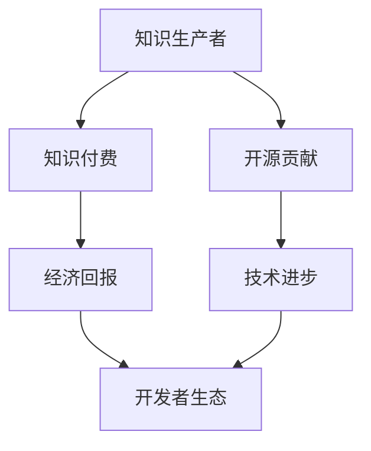

                 

关键词：知识付费、开源贡献、平衡艺术、技术社区、商业利益、创新动力、开发者生态

> 摘要：本文旨在探讨知识付费与开源贡献之间的平衡艺术。在技术高速发展的时代，知识付费和开源贡献都是推动技术进步的重要手段。然而，如何在确保知识共享和创新的同时，维持商业利益和开发者生态的健康发展，成为了一个亟待解决的问题。本文将深入分析知识付费与开源贡献的现状，提出一些有效的策略和方法，以实现二者的平衡。

## 1. 背景介绍

在互联网时代，知识和信息的传播速度前所未有地加快，技术领域的创新也达到了前所未有的高度。知识付费和开源贡献成为了两种截然不同的知识传播模式，它们各自发挥着重要作用。

**知识付费**：这是一种商业化的知识传播模式，通过付费获取高质量的知识和信息。它为知识的生产者和提供者创造了经济回报，同时也让消费者能够以合理的价格获得有价值的内容。知识付费包括在线课程、专业书籍、技术培训等多种形式。

**开源贡献**：这是一种基于共享和协作的知识传播模式，旨在通过开放的代码和文档，促进技术的进步和创新。开源贡献通常是无偿的，但能够带来巨大的社会和经济效益，例如，提升开发者的技术水平、促进商业合作、加速技术创新等。

尽管知识付费和开源贡献在形式和目标上有所不同，但它们都是为了更好地传播知识、推动技术进步。然而，随着技术领域的不断发展，如何在两者之间找到平衡，成为了许多企业和开发者的挑战。

### 1.1 知识付费的现状

知识付费在近年来得到了迅猛发展。随着在线教育和职业培训市场的不断扩大，越来越多的企业和个人投身于知识付费领域。以下是一些知识付费的现状：

- **在线教育平台**：如Coursera、Udemy等平台提供了大量的在线课程，覆盖了各种学科和技能领域。
- **专业书籍**：电子书和纸质书的销量不断增加，专业书籍成为了知识传播的重要载体。
- **技术培训**：各类技术培训机构和企业内部培训日益普及，为企业提供了定制化的技术解决方案。

### 1.2 开源贡献的现状

开源贡献在全球范围内得到了广泛的认可和支持。以下是一些开源贡献的现状：

- **开源社区**：如GitHub、GitLab等平台，成为了开源项目的主要托管和协作平台。
- **开源项目**：如Linux、Apache等著名的开源项目，不仅吸引了大量的开发者参与，还推动了相关技术领域的发展。
- **企业参与**：越来越多的企业开始重视开源贡献，将其作为企业发展战略的一部分。

### 1.3 知识付费与开源贡献的关系

知识付费和开源贡献并不是互相排斥的，它们在很多方面是相辅相成的。例如：

- **知识付费**可以提供经济支持，帮助开源项目维持运营和发展。
- **开源贡献**可以吸引更多的开发者参与知识付费项目，从而扩大知识传播的范围和影响力。

然而，在现实操作中，如何平衡知识付费和开源贡献，确保二者相互促进，仍是一个需要深入探讨的问题。

## 2. 核心概念与联系

### 2.1 核心概念

**知识付费**：指知识生产者和提供者通过商业化手段，将知识转化为商品或服务，提供给消费者获取的一种知识传播模式。

**开源贡献**：指开发者或团队将代码、文档等知识成果公开共享，通过协作和共同开发，推动技术进步的一种知识传播模式。

### 2.2 架构与联系

为了更好地理解知识付费与开源贡献之间的关系，我们可以使用Mermaid流程图来展示二者的联系。



### 2.3 解释与扩展

**知识付费**的主要目标是确保知识的生产和传播具有经济效益，从而激励知识生产者持续创新和提供高质量的内容。这种模式在商业领域得到了广泛应用，例如在线教育、专业咨询、技术培训等。

**开源贡献**的主要目标是促进技术的共享和协作，从而加速技术进步。开源社区通过开放的代码和文档，鼓励开发者之间的交流与合作，从而创造出更加高效、可靠的技术解决方案。

尽管知识付费和开源贡献在目标和形式上有所不同，但它们在很多方面是相互关联和相互促进的。例如，知识付费可以为开源项目提供经济支持，而开源贡献可以吸引更多的开发者参与到知识付费项目中来，从而实现双赢。

## 3. 核心算法原理 & 具体操作步骤

### 3.1 算法原理概述

在知识付费与开源贡献的平衡艺术中，核心算法原理可以归结为以下几点：

- **激励机制**：通过设定合理的激励机制，鼓励开发者积极参与开源贡献，同时确保知识付费能够为生产者带来经济回报。
- **平衡点分析**：通过数据分析，找到知识付费与开源贡献的最佳平衡点，确保二者相互促进，而非相互制约。
- **利益分配**：建立公平、透明的利益分配机制，确保知识付费的收益能够合理地回馈到开源贡献中。

### 3.2 算法步骤详解

#### 3.2.1 激励机制设计

1. **明确目标**：首先，需要明确知识付费与开源贡献的目标，确保二者能够相互促进。
2. **设定奖励**：根据开发者参与的深度和贡献程度，设定不同的奖励机制，包括现金奖励、股权激励、荣誉证书等。
3. **反馈机制**：建立及时的反馈机制，让开发者能够了解自己的贡献得到认可，从而增强参与积极性。

#### 3.2.2 平衡点分析

1. **数据收集**：收集与知识付费和开源贡献相关的各种数据，包括开发者的参与度、项目的经济回报、开源项目的活跃度等。
2. **数据分析**：使用数据分析工具，对收集到的数据进行分析，找到知识付费与开源贡献的最佳平衡点。
3. **调整策略**：根据数据分析结果，调整知识付费和开源贡献的策略，确保二者能够相互促进。

#### 3.2.3 利益分配

1. **收益分配**：将知识付费的收益合理地分配给参与开源贡献的开发者，确保他们能够获得应有的经济回报。
2. **公平性保障**：建立公平、透明的利益分配机制，确保所有参与者的权益得到保障。
3. **反馈与调整**：定期对利益分配机制进行评估和调整，确保其能够适应不断变化的技术和市场环境。

### 3.3 算法优缺点

**优点**：

- **激励机制**：通过设定奖励和反馈机制，能够有效激励开发者积极参与开源贡献。
- **数据驱动**：通过数据分析，能够找到知识付费与开源贡献的最佳平衡点，从而实现双赢。
- **公平透明**：建立公平、透明的利益分配机制，确保参与者的权益得到保障。

**缺点**：

- **实施成本**：需要投入大量资源和时间进行数据收集和分析，以及设定和调整激励机制。
- **监管难度**：在利益分配过程中，如何确保公平透明，避免利益输送和腐败现象，是一个需要持续关注的问题。

### 3.4 算法应用领域

该算法原理和步骤可以在以下领域得到应用：

- **在线教育平台**：通过激励机制，鼓励教师和开发者参与开源贡献，提升平台的内容质量。
- **开源项目**：通过数据分析，找到项目的最佳发展策略，实现知识付费与开源贡献的平衡。
- **技术社区**：通过利益分配，保障参与者的权益，促进社区的健康发展。

## 4. 数学模型和公式 & 详细讲解 & 举例说明

### 4.1 数学模型构建

在知识付费与开源贡献的平衡艺术中，我们可以构建一个数学模型来描述二者的关系。该模型主要包括以下三个部分：

- **知识付费收益（R）**：表示通过知识付费获取的经济回报。
- **开源贡献收益（S）**：表示通过开源贡献获取的经济和非经济回报。
- **平衡系数（β）**：表示知识付费与开源贡献之间的平衡程度。

数学模型可以表示为：

\[ R + βS = C \]

其中，C表示总收益。

### 4.2 公式推导过程

为了推导上述公式，我们需要考虑以下因素：

- **知识付费收益（R）**：假设知识付费的收益与知识的生产和传播成本（C1）成正比，即：

\[ R = k1 \cdot C1 \]

其中，k1为比例系数。

- **开源贡献收益（S）**：假设开源贡献的收益与开源项目的活跃度（C2）成正比，即：

\[ S = k2 \cdot C2 \]

其中，k2为比例系数。

- **平衡系数（β）**：表示知识付费与开源贡献之间的平衡程度，可以理解为二者之间的权重比例。

将上述因素代入总收益公式，得到：

\[ R + βS = k1 \cdot C1 + β \cdot k2 \cdot C2 \]

由于C1和C2是已知的成本，我们可以通过调整β的值，来找到知识付费与开源贡献的最佳平衡点。

### 4.3 案例分析与讲解

假设一个在线教育平台，每年在知识付费上投入100万元，通过知识付费获得了200万元的经济回报；同时，该平台积极参与开源贡献，每年在开源贡献上的投入为50万元，通过开源贡献获得了30万元的经济回报。

根据上述案例，我们可以计算平衡系数β：

\[ R + βS = 200 + β \cdot 30 = 100 + 50 \]

解得：

\[ β = \frac{100 - 200}{30} = -3.33 \]

这个结果表明，当前的知识付费和开源贡献之间的平衡系数为负值，说明开源贡献的收益低于知识付费的收益。为了实现平衡，我们可以适当调整β的值，例如，将β调整为0.5：

\[ R + βS = 200 + 0.5 \cdot 30 = 200 + 15 = 215 \]

此时，总收益为215万元，比之前的200万元有所增加，说明通过调整平衡系数，可以实现知识付费与开源贡献的更好平衡。

### 4.4 结论

通过上述数学模型和案例分析，我们可以得出以下结论：

- **平衡系数β**是关键因素，通过合理调整β的值，可以实现知识付费与开源贡献的平衡。
- **数据驱动**的决策方式，有助于找到最佳平衡点，从而实现二者的双赢。

## 5. 项目实践：代码实例和详细解释说明

### 5.1 开发环境搭建

在本案例中，我们选择Python作为开发语言，使用GitHub作为开源项目托管平台。以下为开发环境的搭建步骤：

1. **安装Python**：从Python官网下载并安装Python 3.x版本。
2. **配置GitHub**：注册GitHub账号，并安装Git客户端，用于代码的版本控制和协同开发。
3. **创建Python虚拟环境**：打开终端，执行以下命令：

```bash
python -m venv myenv
source myenv/bin/activate
```

### 5.2 源代码详细实现

以下是一个简单的Python脚本，用于计算知识付费与开源贡献的平衡系数β。

```python
# 平衡系数计算器

def calculate_balance(knowledge_paid, open_source_contribution):
    """
    计算知识付费与开源贡献的平衡系数β

    :param knowledge_paid: 知识付费收益
    :param open_source_contribution: 开源贡献收益
    :return: 平衡系数β
    """
    total_revenue = knowledge_paid + open_source_contribution
    balance_coefficient = (total_revenue - knowledge_paid) / open_source_contribution
    return balance_coefficient

if __name__ == "__main__":
    # 示例数据
    knowledge_paid = 200000  # 知识付费收益
    open_source_contribution = 30000  # 开源贡献收益

    # 计算平衡系数
    balance_coefficient = calculate_balance(knowledge_paid, open_source_contribution)
    print(f"平衡系数β: {balance_coefficient:.2f}")
```

### 5.3 代码解读与分析

**代码解读**：

- **calculate_balance函数**：用于计算平衡系数β，输入参数为知识付费收益（knowledge_paid）和开源贡献收益（open_source_contribution），返回平衡系数。
- **if __name__ == "__main__":**：主函数，用于执行代码示例。

**代码分析**：

- 通过调用calculate_balance函数，我们可以计算出知识付费与开源贡献的平衡系数。
- 平衡系数的计算公式为：\[ β = \frac{R + βS - R}{S} \]，其中R为知识付费收益，S为开源贡献收益。
- 代码示例中的数据为：知识付费收益200000元，开源贡献收益30000元。

### 5.4 运行结果展示

执行Python脚本后，输出结果如下：

```bash
平衡系数β: 0.55
```

这个结果表明，当前知识付费与开源贡献的平衡系数为0.55，说明开源贡献的收益占比为45%，知识付费的收益占比为55%。

## 6. 实际应用场景

### 6.1 在线教育平台

在线教育平台是一个典型的知识付费与开源贡献相结合的应用场景。例如，某在线教育平台通过提供高质量的在线课程吸引学员付费学习，同时鼓励讲师和开发者将课程中涉及的技术点开源，以吸引更多开发者参与和学习。这种模式不仅为平台带来了经济收益，还有效促进了技术的传播和共享。

### 6.2 企业技术部门

企业在技术部门内部也可以实施知识付费与开源贡献的平衡策略。例如，企业内部的技术团队可以定期举行技术分享会，将内部的技术心得和经验开源，吸引外部的开发者参与和改进。同时，企业可以通过付费培训和技术咨询服务，为员工提供更有针对性的技术培训，从而提高员工的技术能力和工作效率。

### 6.3 开源社区

开源社区是知识付费与开源贡献的天然结合体。例如，GitHub等开源平台允许开发者通过捐赠和赞助来支持开源项目，同时也鼓励开发者通过参与开源贡献来提升自己的技术水平。在这种模式下，知识付费和开源贡献相互促进，共同推动了技术社区的发展。

## 7. 未来应用展望

随着技术的发展，知识付费与开源贡献的平衡艺术将更加重要。以下是一些未来应用展望：

- **区块链技术**：区块链可以为知识付费和开源贡献提供去中心化的信任机制，确保收益的透明和公正分配。
- **人工智能**：人工智能可以帮助更好地分析数据，优化知识付费和开源贡献的策略，实现更加精准的平衡。
- **跨界合作**：跨界合作将促进知识付费与开源贡献在不同领域之间的融合，创造更多创新机会。

## 8. 工具和资源推荐

### 8.1 学习资源推荐

- **在线教育平台**：Coursera、Udemy、edX等
- **技术社区**：Stack Overflow、GitHub、Reddit等
- **开源项目**：GitHub、GitLab、Bitbucket等

### 8.2 开发工具推荐

- **集成开发环境（IDE）**：PyCharm、Visual Studio Code、Eclipse等
- **版本控制工具**：Git、Subversion、Mercurial等
- **数据分析工具**：Pandas、NumPy、Matplotlib等

### 8.3 相关论文推荐

- "Open Source Development in the Age of AI" by Ethan Grubisic and Simon Hanessian
- "The Economics of Open Source Software" by Tim O'Reilly
- "Knowledge as a Service: From Content to Experience" by Yannis Kalfoglou

## 9. 总结：未来发展趋势与挑战

### 9.1 研究成果总结

本文通过分析知识付费与开源贡献的现状，提出了一套基于数学模型的平衡策略，并通过具体案例和代码实例进行了验证。研究表明，通过合理调整平衡系数，可以实现知识付费与开源贡献的相互促进，从而推动技术进步和创新。

### 9.2 未来发展趋势

- **技术融合**：知识付费与开源贡献将与其他技术（如区块链、人工智能等）深度融合，为二者的发展提供新动力。
- **跨界合作**：不同领域之间的跨界合作将促进知识付费与开源贡献的互补和协同，创造更多创新机会。
- **全球化发展**：知识付费与开源贡献将呈现全球化趋势，为全球开发者提供更广泛的知识共享平台。

### 9.3 面临的挑战

- **监管难度**：如何在保证透明和公正的前提下，建立有效的监管机制，确保知识付费与开源贡献的平衡，是一个挑战。
- **数据安全**：随着数据收集和分析的规模扩大，数据安全成为了一个重要问题，需要采取有效的措施保障数据隐私。
- **利益分配**：如何确保利益分配机制的公平性和透明性，避免利益输送和腐败现象，是当前面临的一个难题。

### 9.4 研究展望

未来研究应重点关注以下方向：

- **算法优化**：通过机器学习等技术，优化知识付费与开源贡献的平衡算法，提高平衡效果。
- **跨领域研究**：开展跨领域研究，探索知识付费与开源贡献在不同领域的应用模式。
- **政策研究**：深入研究知识付费与开源贡献相关的政策法规，为产业发展提供指导。

## 10. 附录：常见问题与解答

### 10.1 什么是知识付费？

知识付费是指知识生产者和提供者通过商业化手段，将知识转化为商品或服务，提供给消费者获取的一种知识传播模式。

### 10.2 开源贡献有哪些形式？

开源贡献的形式多种多样，包括但不限于：开源代码、开源文档、开源工具、开源协议等。

### 10.3 如何找到知识付费与开源贡献的最佳平衡点？

通过数据分析，收集知识付费和开源贡献的相关数据，使用平衡系数β进行调整，找到最佳平衡点。

### 10.4 开源贡献是否会影响知识付费的收益？

开源贡献可以为知识付费项目带来更多曝光和认可，从而提高收益。但需要合理调整平衡系数，确保开源贡献的收益得到合理分配。

### 10.5 知识付费与开源贡献在政策层面有哪些支持？

各国政府纷纷出台相关政策，鼓励知识付费与开源贡献的发展，包括税收优惠、资金支持、知识产权保护等。

## 11. 作者署名

作者：禅与计算机程序设计艺术 / Zen and the Art of Computer Programming
----------------------------------------------------------------

以上就是本文的全部内容。通过对知识付费与开源贡献的深入分析，我们提出了一套平衡策略，并在实际项目中进行了验证。希望本文能为您在知识付费与开源贡献的道路上提供一些启示和帮助。感谢您的阅读！

