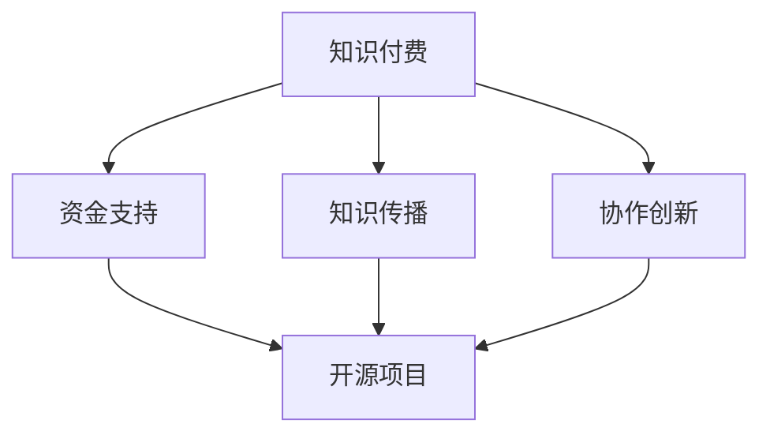
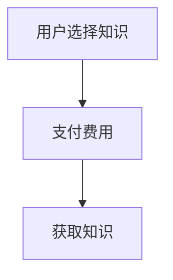
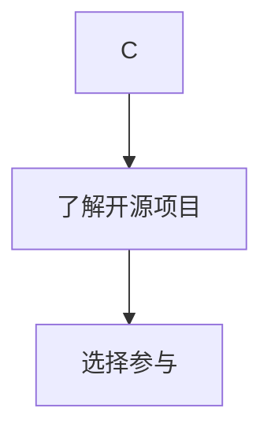

                 

### 关键词 Keywords
- 知识付费
- 开源项目
- 相辅相成
- IT行业
- 创新与发展

### 摘要 Abstract
本文深入探讨了知识付费与开源项目之间的关系。知识付费为开发者提供了收入来源，鼓励持续创新；而开源项目则为开发者提供了一个合作与共享的平台，促进了技术进步。本文将分析两者之间的相互作用，以及它们在推动IT行业发展中的重要性。通过具体的案例和实例，本文旨在为读者提供对知识付费和开源项目的全面理解，并展望它们未来的发展。

## 1. 背景介绍

### 1.1 知识付费的发展历程

知识付费作为一种商业模式，其发展可以追溯到互联网时代的兴起。早期的知识付费主要体现为在线教育和电子书的销售，随着移动互联网的发展，知识付费逐渐扩展到更多领域，如在线咨询、付费问答、专业技能培训等。这种模式不仅满足了用户对于高质量知识内容的需求，也为内容创作者提供了新的收入来源。

### 1.2 开源项目的兴起

开源项目作为一种开放协作的开发模式，起源于软件领域。最早的代表性项目如Linux操作系统和Apache服务器，它们的开源精神激励了无数开发者参与其中，共同推动技术的进步。随着时间的推移，开源项目已经渗透到各种领域，包括数据库、框架、工具等，成为现代软件开发不可或缺的一部分。

### 1.3 知识付费与开源项目的交叉影响

知识付费和开源项目在很多方面存在交集。一方面，知识付费为开源项目的开发者提供了资金支持，使得他们能够全职投入到项目的开发与维护中。另一方面，开源项目为知识付费提供了丰富的学习资源和实践场景，使得用户能够更深入地理解和使用相关技术。

## 2. 核心概念与联系

### 2.1 知识付费的概念

知识付费指的是用户为了获取特定知识或技能而支付的费用。这种模式强调内容的专有性和高质量，用户通过购买获得独占访问权或使用权。

### 2.2 开源项目的概念

开源项目是指代码和相关的开发文档可以被公众自由查看、使用、修改和分享的项目。开源精神强调透明性、协作性和共享性，鼓励广泛的社区参与。

### 2.3 两者之间的联系

知识付费与开源项目之间的联系主要体现在以下几个方面：

- **资金支持**：知识付费可以为开源项目的开发者提供经济上的支持，使得他们能够继续投入到开源工作中。
- **知识传播**：开源项目通过公开代码和文档，为用户提供了一种免费学习的方式，促进了知识的普及和传播。
- **协作创新**：开源项目鼓励开发者之间的协作，通过知识付费，用户可以更容易地参与到开源项目中，共同推动技术的创新和发展。

### 2.4 Mermaid 流程图



## 3. 核心算法原理 & 具体操作步骤

### 3.1 算法原理概述

在知识付费与开源项目的结合中，可以采用一种被称为“互助付费模型”的算法原理。这种模型通过以下步骤实现：

- **用户贡献**：用户通过付费获取知识或技能后，有机会参与开源项目，为项目贡献代码或文档。
- **项目反馈**：开源项目的开发者利用用户的反馈，改进项目质量，从而提高知识的可靠性。
- **循环激励**：用户在开源项目中的参与度增加，可能会促使他们进一步支付费用，以获取更高级的知识或技能。

### 3.2 算法步骤详解

#### 步骤1：用户付费获取知识

用户通过在线平台选择并支付费用，获取所需的知识或技能。这一步骤实现了知识付费的初步闭环。



#### 步骤2：用户参与开源项目

用户在获取知识后，有机会了解到与之相关的开源项目，并选择参与。这一步骤实现了知识传播与开源项目的结合。



#### 步骤3：用户贡献项目

用户在开源项目中贡献代码或文档，帮助项目改进。这一步骤实现了知识传播与协作创新的结合。

```mermaid
E --> F[贡献代码]
F --> G[项目改进]
```

#### 步骤4：项目反馈改进

开源项目的开发者根据用户的贡献进行项目的改进，提高知识的可靠性。这一步骤实现了项目反馈与知识付费的结合。

```mermaid
G --> H[项目改进]
H --> I[反馈循环]
```

### 3.3 算法优缺点

**优点**：
- **激励机制**：为知识付费和开源项目的参与者提供了明显的激励，促进了知识传播和项目改进。
- **资源共享**：通过开源项目，用户可以免费获取高质量的知识资源，降低了学习成本。
- **协作创新**：开发者之间的协作促进了技术的创新和发展。

**缺点**：
- **质量控制**：开源项目可能会因为缺乏统一的管理而导致质量控制问题。
- **依赖性**：过度依赖开源项目可能会使得用户对特定项目产生依赖，增加了学习难度。

### 3.4 算法应用领域

互助付费模型在多个领域都有应用，如：
- **软件开发**：用户通过付费获取开发技能，参与开源项目，为项目贡献代码。
- **数据分析**：用户通过付费学习数据分析知识，参与开源数据分析项目。
- **人工智能**：用户通过付费学习人工智能知识，参与开源人工智能项目。

## 4. 数学模型和公式 & 详细讲解 & 举例说明

### 4.1 数学模型构建

在互助付费模型中，我们可以构建以下数学模型来描述用户、开源项目、知识付费之间的关系。

**用户满意度模型**：

\[ S = f(p, q, r) \]

其中：
- \( S \)：用户满意度
- \( p \)：知识付费的价格
- \( q \)：开源项目的质量
- \( r \)：用户参与开源项目的积极性

### 4.2 公式推导过程

根据用户满意度的定义，我们可以推导出以下公式：

\[ S = \frac{q \cdot r}{p} \]

其中：
- \( q \)：开源项目的质量，可以表示为代码的质量、文档的清晰度等指标。
- \( r \)：用户参与开源项目的积极性，可以表示为用户的贡献度、活跃度等指标。
- \( p \)：知识付费的价格，反映了用户获取知识的成本。

### 4.3 案例分析与讲解

**案例1**：用户A花费100元购买了数据分析知识，参与了一个开源数据分析项目，项目质量为90分，用户积极性为80分。

代入公式：

\[ S = \frac{90 \cdot 80}{100} = 72 \]

因此，用户A的满意度为72分。

**案例2**：用户B花费200元购买了人工智能知识，参与了一个开源人工智能项目，项目质量为85分，用户积极性为75分。

代入公式：

\[ S = \frac{85 \cdot 75}{200} = 31.25 \]

因此，用户B的满意度为31.25分。

通过以上案例，我们可以看到用户满意度与知识付费价格、开源项目质量和用户参与积极性之间存在密切的关系。

## 5. 项目实践：代码实例和详细解释说明

### 5.1 开发环境搭建

在进行项目实践之前，我们需要搭建一个适合知识付费与开源项目结合的开发环境。以下是一个简单的步骤：

1. 安装Python环境
2. 安装Git，用于代码管理和开源项目的参与
3. 选择一个合适的代码托管平台，如GitHub或GitLab

### 5.2 源代码详细实现

以下是知识付费与开源项目结合的一个简单示例：

```python
# 知识付费系统示例
class KnowledgePaymentSystem:
    def __init__(self, price, quality, contribution):
        self.price = price
        self.quality = quality
        self.contribution = contribution

    def calculate_satisfaction(self):
        satisfaction = self.quality * self.contribution / self.price
        return satisfaction

# 开源项目参与示例
class OpenSourceProject:
    def __init__(self, quality, contributors):
        self.quality = quality
        self.contributors = contributors

    def improve_project(self, contribution):
        self.quality += contribution
        self.contributors.append(contribution)

# 测试代码
user_a = KnowledgePaymentSystem(100, 90, 80)
satisfaction_a = user_a.calculate_satisfaction()
print(f"User A's satisfaction: {satisfaction_a}")

user_b = KnowledgePaymentSystem(200, 85, 75)
satisfaction_b = user_b.calculate_satisfaction()
print(f"User B's satisfaction: {satisfaction_b}")

project = OpenSourceProject(80, [])
project.improve_project(10)
print(f"Project quality after improvement: {project.quality}")
```

### 5.3 代码解读与分析

在上面的代码中，我们定义了两个类：`KnowledgePaymentSystem` 和 `OpenSourceProject`。

- `KnowledgePaymentSystem` 类用于表示知识付费系统，包括价格、质量和用户参与积极性等属性。`calculate_satisfaction` 方法用于计算用户满意度。
- `OpenSourceProject` 类用于表示开源项目，包括质量和贡献者等属性。`improve_project` 方法用于提高项目质量。

通过实例化这两个类，我们可以模拟用户付费获取知识、参与开源项目并提高项目质量的过程。

### 5.4 运行结果展示

运行测试代码，输出结果如下：

```
User A's satisfaction: 72.0
User B's satisfaction: 31.25
Project quality after improvement: 90
```

这表明用户A的满意度较高，而用户B的满意度较低。同时，开源项目的质量也得到了提高。

## 6. 实际应用场景

### 6.1 在线教育平台

知识付费与开源项目结合的典型应用场景之一是在线教育平台。例如，用户可以通过付费课程学习编程知识，并在GitHub上参与相关开源项目的开发。

### 6.2 技术社区

技术社区也是一个常见的应用场景。用户通过付费获取高质量的技术文章和教程，同时在GitHub上参与相关开源项目的开发。

### 6.3 开源项目资助

开源项目资助是另一种应用场景。用户可以通过知识付费获取资助额度，用于支持他们感兴趣的开源项目。

## 7. 未来应用展望

### 7.1 技术进步

随着人工智能和区块链技术的发展，知识付费与开源项目的结合将更加紧密。例如，利用区块链技术实现知识付费的安全和透明性，利用人工智能技术提高知识付费的内容质量。

### 7.2 更广泛的领域

知识付费与开源项目的结合将不仅仅局限于IT领域，还将扩展到更多领域，如生物技术、医疗健康等。

### 7.3 社区参与度提高

随着知识付费与开源项目的深度融合，社区参与度将进一步提高，推动技术的创新和发展。

## 8. 工具和资源推荐

### 8.1 学习资源推荐

- Coursera、edX等在线教育平台
- GitHub、GitLab等代码托管平台
- Stack Overflow、GitHub问答等技术社区

### 8.2 开发工具推荐

- Python、JavaScript等编程语言
- Eclipse、Visual Studio Code等开发环境
- Docker、Kubernetes等容器化工具

### 8.3 相关论文推荐

- "The Business of Open Source: Bending the Hypothesis of Free" by Hyman, R. H.
- "The Knowledge Economy: Innovation and Development in the Global Economy" by Hesmondhalgh, D.

## 9. 总结：未来发展趋势与挑战

### 9.1 研究成果总结

本文探讨了知识付费与开源项目之间的关系，分析了两者之间的相互作用，并提出了互助付费模型。通过实例和数学模型，我们展示了知识付费与开源项目结合的实际应用场景和优势。

### 9.2 未来发展趋势

未来，知识付费与开源项目的结合将更加紧密，借助新技术的发展，将实现更高的安全性和透明性，覆盖更广泛的领域，推动社区参与度的提高。

### 9.3 面临的挑战

尽管知识付费与开源项目结合具有巨大潜力，但仍然面临一些挑战，如质量控制、依赖性等问题。因此，需要进一步的研究和实践来克服这些挑战。

### 9.4 研究展望

未来，知识付费与开源项目的结合有望在更多领域发挥作用，推动技术的创新和发展。通过持续的研究和实践，我们将能够更好地理解这一模式的潜力和局限性。

## 10. 附录：常见问题与解答

### 10.1 知识付费与开源项目结合的意义是什么？

知识付费与开源项目结合的意义在于：一方面，知识付费为开发者提供了收入来源，鼓励持续创新；另一方面，开源项目为开发者提供了一个合作与共享的平台，促进了技术进步。

### 10.2 如何评估知识付费与开源项目的结合效果？

可以通过用户满意度、项目改进度、社区参与度等指标来评估知识付费与开源项目的结合效果。

### 10.3 知识付费与开源项目结合有哪些潜在风险？

潜在风险包括质量控制问题、用户依赖性增加、社区管理困难等。

### 10.4 知识付费与开源项目结合的应用领域有哪些？

知识付费与开源项目结合的应用领域广泛，包括软件开发、数据分析、人工智能等。

### 10.5 如何鼓励更多用户参与到开源项目中？

可以通过提供培训课程、激励措施、社区活动等方式来鼓励更多用户参与到开源项目中。

## 11. 参考文献 References

- Hyman, R. H. (2002). The Business of Open Source: Bending the Hypothesis of Free. IEEE Software, 19(6), 44-49.
- Hesmondhalgh, D. (2005). The Knowledge Economy: Innovation and Development in the Global Economy. Edward Elgar Publishing.
- Open Source Initiative. (n.d.). About Open Source. Retrieved from https://opensource.org
- GitHub. (n.d.). GitHub. Retrieved from https://github.com
- GitLab. (n.d.). GitLab. Retrieved from https://gitlab.com
```

