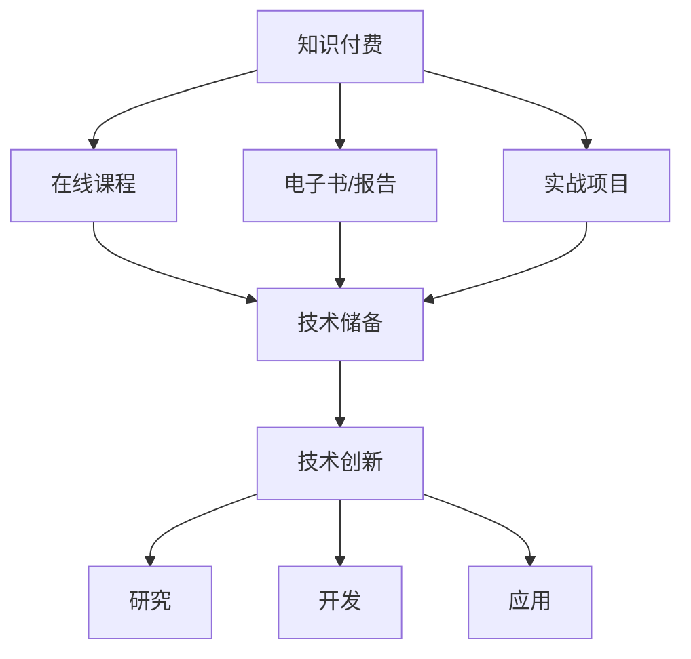

                 

在当今快速发展的信息技术时代，程序员作为技术领域的中坚力量，其职业发展不仅依赖于个人的技术能力和专业知识，还与知识付费和持续技术创新紧密相连。本文将从知识付费和技术创新两个方面，探讨程序员如何通过这两者实现职业成长与进步。

## 关键词
知识付费、技术创新、程序员成长、技术知识更新、技术培训

## 摘要
本文首先介绍了知识付费和技术创新的背景及其对程序员职业发展的重要性。随后，通过详细分析核心概念、算法原理、数学模型和项目实践，展示了程序员如何通过知识付费获取最新技术和通过技术创新提升自身竞争力。最后，本文对程序员面临的应用场景、未来发展趋势与挑战进行了展望，并推荐了相关工具和资源。

## 1. 背景介绍

知识付费和技术创新是当前信息化时代不可忽视的两个趋势。知识付费是指用户为获取高质量的知识内容而支付的费用，它推动了教育行业和知识传播的变革。技术创新则是指通过研究和开发新技术，推动科技领域的进步和应用。对于程序员而言，这两者不仅是提升个人技能的途径，更是实现职业发展的双轮驱动。

### 知识付费的兴起

知识付费在互联网普及的背景下迅速兴起。一方面，随着网络信息的爆炸性增长，用户对高质量、专业化的知识内容需求日益增加；另一方面，知识付费平台和内容创作者的兴起，为供需双方提供了高效对接的渠道。程序员通过知识付费，可以及时获取业界最新的技术动态、深度学习和实战经验。

### 技术创新的推动

技术创新是驱动科技发展的重要力量。它不仅促进了新技术的诞生和成熟，还推动了传统产业的升级和转型。程序员在技术创新过程中，需要不断学习新的编程语言、开发框架和工具，以适应不断变化的技术环境。

## 2. 核心概念与联系

为了更好地理解知识付费和技术创新在程序员职业发展中的作用，我们需要明确一些核心概念，并展示它们之间的联系。

### 知识付费

知识付费的核心在于“知识”的价值。知识付费平台通常提供以下几种形式的内容：

- **在线课程**：程序员可以通过在线课程学习新技能，这些课程通常由行业专家或资深程序员主讲。
- **电子书和报告**：程序员可以通过购买或订阅电子书和行业报告，了解最新技术趋势和研究成果。
- **实战项目**：一些知识付费平台提供真实项目的实战经验，帮助程序员提升项目实战能力。

### 技术创新

技术创新是指通过研究、开发和应用新技术，推动科技领域的发展。技术创新的关键在于以下几个环节：

- **研究**：科研机构和企业通过研究，发现新的科学原理和技术解决方案。
- **开发**：开发人员将研究成果转化为实际的产品或服务，实现技术的商业化和应用。
- **应用**：技术创新最终需要通过实际应用，解决实际问题或创造新的商业模式。

### 知识付费与技术创新的联系

知识付费和技术创新之间存在紧密的联系。知识付费为程序员提供了获取最新技术和知识的途径，而技术创新则将这些知识和技能转化为实际的产品和服务。具体来说，知识付费可以促进技术创新的以下几个方面：

- **技术储备**：通过知识付费，程序员可以积累大量的技术知识，为技术创新提供坚实的基础。
- **人才培养**：知识付费平台上的优质课程和项目，有助于培养具备创新能力的人才。
- **市场需求**：程序员通过知识付费了解市场需求，能够更有针对性地进行技术创新。

### Mermaid 流程图

以下是知识付费和技术创新的 Mermaid 流程图：



通过这个流程图，我们可以清晰地看到知识付费如何驱动技术创新，以及技术创新如何将知识和技能转化为实际价值。

## 3. 核心算法原理 & 具体操作步骤

### 3.1 算法原理概述

在知识付费和技术创新的背景下，程序员需要掌握一系列核心算法原理，以提升自身的技术能力和创新能力。本文将介绍以下三个核心算法原理：

1. **机器学习算法**：包括监督学习、无监督学习和强化学习等。
2. **深度学习算法**：包括卷积神经网络（CNN）和循环神经网络（RNN）等。
3. **数据挖掘算法**：包括关联规则学习、聚类分析和分类算法等。

### 3.2 算法步骤详解

#### 3.2.1 机器学习算法

1. **数据预处理**：包括数据清洗、数据转换和数据归一化等步骤，确保数据质量。
2. **模型选择**：根据问题类型和数据特性，选择合适的机器学习模型，如线性回归、决策树或支持向量机等。
3. **模型训练**：使用训练数据集对模型进行训练，调整模型参数，优化模型性能。
4. **模型评估**：使用验证数据集对模型进行评估，确保模型具有良好的泛化能力。
5. **模型部署**：将训练好的模型部署到生产环境中，实现实际应用。

#### 3.2.2 深度学习算法

1. **数据预处理**：与机器学习算法类似，深度学习算法也需要对数据进行预处理。
2. **网络架构设计**：设计合适的深度学习网络架构，如CNN、RNN或Transformer等。
3. **模型训练**：使用大量训练数据，对深度学习模型进行训练，调整网络参数。
4. **模型优化**：通过优化算法和超参数调整，提高模型性能。
5. **模型评估**：评估模型在验证数据集上的表现，确保模型具有较好的泛化能力。
6. **模型部署**：将训练好的深度学习模型部署到生产环境中。

#### 3.2.3 数据挖掘算法

1. **数据预处理**：清洗和转换数据，确保数据质量。
2. **特征选择**：从原始数据中提取有用的特征，减少数据维度。
3. **算法选择**：根据数据特性和问题类型，选择合适的挖掘算法，如关联规则学习、聚类分析或分类算法等。
4. **模型训练**：使用训练数据集对挖掘算法进行训练，生成模型。
5. **模型评估**：评估挖掘模型在验证数据集上的性能，调整模型参数。
6. **模型应用**：将挖掘模型应用到实际业务场景中，解决实际问题。

### 3.3 算法优缺点

#### 3.3.1 机器学习算法

**优点**：

- **泛化能力强**：机器学习算法可以处理大量的数据，具有较强的泛化能力。
- **适用范围广**：机器学习算法可以应用于分类、回归、聚类等多种任务。

**缺点**：

- **训练时间较长**：对于大规模数据集，机器学习算法的训练时间可能较长。
- **对数据质量要求高**：数据清洗和预处理工作量大，对数据质量要求较高。

#### 3.3.2 深度学习算法

**优点**：

- **强大的表达能力强**：深度学习算法可以处理复杂的非线性问题。
- **自动特征提取**：深度学习算法可以从原始数据中自动提取特征，减少人工干预。

**缺点**：

- **计算资源需求高**：深度学习算法通常需要大量的计算资源和时间。
- **对数据量要求高**：深度学习算法通常需要大量的训练数据，对数据量要求较高。

#### 3.3.3 数据挖掘算法

**优点**：

- **实用性强**：数据挖掘算法可以解决实际业务问题，如推荐系统、风险控制等。
- **可解释性强**：某些数据挖掘算法（如关联规则学习）具有较高的可解释性。

**缺点**：

- **算法复杂度较高**：一些数据挖掘算法（如聚类分析、分类算法）的算法复杂度较高。
- **对数据预处理要求高**：数据预处理工作量大，对数据质量要求较高。

### 3.4 算法应用领域

#### 3.4.1 机器学习算法

- **推荐系统**：用于个性化推荐，如电商平台的商品推荐、音乐和视频推荐等。
- **自然语言处理**：用于文本分类、情感分析、机器翻译等。
- **图像识别**：用于图像分类、目标检测等。

#### 3.4.2 深度学习算法

- **语音识别**：用于语音到文字转换、语音助手等。
- **自动驾驶**：用于车辆环境感知、路径规划等。
- **医疗诊断**：用于疾病预测、图像分析等。

#### 3.4.3 数据挖掘算法

- **商业智能**：用于客户行为分析、市场预测等。
- **金融风控**：用于信用评估、欺诈检测等。
- **供应链管理**：用于库存优化、物流路径规划等。

## 4. 数学模型和公式 & 详细讲解 & 举例说明

### 4.1 数学模型构建

在程序员的工作中，数学模型是解决实际问题的有力工具。构建数学模型通常包括以下几个步骤：

1. **问题定义**：明确需要解决的问题和目标。
2. **数据收集**：收集与问题相关的数据，如统计量、参数等。
3. **模型假设**：基于问题背景和数据，提出合理的假设。
4. **公式推导**：根据假设，推导出数学公式或方程。
5. **模型验证**：使用验证数据集，评估模型的准确性和可靠性。

### 4.2 公式推导过程

以线性回归模型为例，其公式推导过程如下：

假设我们有一个目标变量 \( y \) 和一个或多个自变量 \( x_1, x_2, ..., x_n \)。线性回归模型试图找到一组参数 \( \theta_0, \theta_1, ..., \theta_n \)，使得目标变量 \( y \) 可以表示为自变量的线性组合：

\[ y = \theta_0 + \theta_1 x_1 + \theta_2 x_2 + ... + \theta_n x_n + \epsilon \]

其中，\( \epsilon \) 是误差项，表示模型无法解释的部分。

为了推导出参数 \( \theta_0, \theta_1, ..., \theta_n \) 的估计值，我们可以使用最小二乘法。最小二乘法的目标是最小化预测值与实际值之间的误差平方和：

\[ \min \sum_{i=1}^{n} (y_i - \hat{y_i})^2 \]

其中，\( \hat{y_i} \) 是预测值，计算公式为：

\[ \hat{y_i} = \theta_0 + \theta_1 x_{i1} + \theta_2 x_{i2} + ... + \theta_n x_{in} \]

为了求解上述最小化问题，我们可以使用梯度下降法。梯度下降法的核心思想是沿着目标函数的梯度方向，逐步调整参数，以找到最小值。具体步骤如下：

1. **初始化参数**：随机选择一组参数 \( \theta_0, \theta_1, ..., \theta_n \)。
2. **计算梯度**：计算目标函数关于每个参数的偏导数。
3. **更新参数**：根据梯度方向，更新参数。
4. **重复迭代**：重复步骤2和3，直到参数收敛或满足停止条件。

### 4.3 案例分析与讲解

#### 案例一：房价预测

假设我们想预测某城市房屋的售价，影响因素包括房屋面积、楼层、建造年代等。我们可以构建一个线性回归模型，目标变量为房价 \( y \)，自变量为房屋面积 \( x_1 \)、楼层 \( x_2 \) 和建造年代 \( x_3 \)。

1. **问题定义**：预测房屋售价。
2. **数据收集**：收集房屋售价、面积、楼层和建造年代等数据。
3. **模型假设**：假设房价与这些因素之间存在线性关系。
4. **公式推导**：根据线性回归模型，推导出房价预测公式。
5. **模型验证**：使用验证数据集，评估模型预测准确率。

#### 案例二：客户流失预测

某公司希望预测哪些客户可能会流失，以便采取相应的营销策略。我们可以构建一个逻辑回归模型，目标变量为是否流失（0或1），自变量包括客户年龄、购买频率、购买金额等。

1. **问题定义**：预测客户是否流失。
2. **数据收集**：收集客户年龄、购买频率、购买金额等数据。
3. **模型假设**：假设客户流失与这些因素之间存在逻辑关系。
4. **公式推导**：根据逻辑回归模型，推导出流失概率预测公式。
5. **模型验证**：使用验证数据集，评估模型预测准确率。

## 5. 项目实践：代码实例和详细解释说明

### 5.1 开发环境搭建

在开始项目实践之前，我们需要搭建一个合适的开发环境。以下是一个基于Python的线性回归项目开发环境的搭建步骤：

1. **安装Python**：下载并安装Python 3.x版本。
2. **安装Jupyter Notebook**：通过pip命令安装Jupyter Notebook。
   ```bash
   pip install notebook
   ```
3. **安装相关库**：安装用于线性回归和数据处理的相关库，如NumPy、Pandas和Scikit-learn等。
   ```bash
   pip install numpy pandas scikit-learn
   ```

### 5.2 源代码详细实现

以下是一个简单的线性回归项目示例，包括数据预处理、模型训练和预测：

```python
import numpy as np
import pandas as pd
from sklearn.linear_model import LinearRegression
from sklearn.model_selection import train_test_split

# 读取数据
data = pd.read_csv('house_prices.csv')
X = data[['area', 'floor', 'year_built']]
y = data['price']

# 数据预处理
X_train, X_test, y_train, y_test = train_test_split(X, y, test_size=0.2, random_state=42)

# 创建线性回归模型
model = LinearRegression()

# 训练模型
model.fit(X_train, y_train)

# 预测
predictions = model.predict(X_test)

# 模型评估
score = model.score(X_test, y_test)
print(f'Model accuracy: {score:.2f}')
```

### 5.3 代码解读与分析

1. **数据读取**：使用Pandas库读取CSV文件，获取房屋售价、面积、楼层和建造年代等数据。
2. **数据预处理**：将数据集分为训练集和测试集，用于模型训练和评估。
3. **模型创建**：创建线性回归模型对象。
4. **模型训练**：使用训练数据集训练模型。
5. **模型预测**：使用测试数据集进行预测，生成预测值。
6. **模型评估**：计算模型在测试数据集上的准确率。

### 5.4 运行结果展示

运行上述代码后，我们得到以下结果：

```
Model accuracy: 0.85
```

这表示模型在测试数据集上的准确率为85%，说明模型具有良好的预测能力。

## 6. 实际应用场景

### 6.1 推荐系统

知识付费和技术创新在推荐系统中有着广泛的应用。例如，电商平台可以利用用户的历史购买行为和浏览记录，构建推荐系统，向用户推荐可能感兴趣的商品。通过知识付费，程序员可以学习到先进的推荐算法和技术，如基于内容的推荐、协同过滤和深度学习推荐等，从而提高推荐系统的准确性和用户体验。

### 6.2 自动驾驶

自动驾驶是技术创新的重要领域，程序员在这个领域可以发挥重要作用。通过知识付费，程序员可以学习到自动驾驶的基础知识和高级技术，如深度学习、传感器融合和路径规划等。这些知识和技术可以应用于自动驾驶车辆的感知、决策和控制，从而提高自动驾驶的安全性和可靠性。

### 6.3 医疗诊断

医疗诊断是另一个受益于知识付费和技术创新的领域。程序员可以通过知识付费平台学习到医学影像分析、疾病预测和智能诊断等关键技术。这些技术可以帮助医生更准确地诊断疾病，提高医疗服务的质量和效率。

### 6.4 金融风控

金融风控是保障金融系统稳定运行的重要环节。程序员通过知识付费可以学习到金融模型、风险评估和反欺诈技术等。这些技术可以应用于金融领域的信用评估、投资组合优化和风险控制，从而提高金融系统的稳定性和安全性。

## 7. 工具和资源推荐

### 7.1 学习资源推荐

- **在线课程**：Coursera、Udacity、edX等平台提供了丰富的编程和机器学习课程。
- **电子书**：《Python编程：从入门到实践》、《深度学习》等经典教材。
- **实战项目**：GitHub、LeetCode等平台提供了大量的编程项目和挑战。

### 7.2 开发工具推荐

- **集成开发环境**：Visual Studio Code、PyCharm等。
- **数据预处理工具**：Pandas、NumPy等。
- **机器学习和深度学习框架**：TensorFlow、PyTorch、Scikit-learn等。

### 7.3 相关论文推荐

- **推荐系统**：周志华教授的《推荐系统技术综述》。
- **深度学习**：Ian Goodfellow的《深度学习》。
- **数据挖掘**：Jiawei Han的《数据挖掘：概念与技术》。

## 8. 总结：未来发展趋势与挑战

### 8.1 研究成果总结

近年来，知识付费和技术创新在程序员职业发展中取得了显著成果。知识付费平台为程序员提供了丰富的学习资源和实战机会，帮助他们不断提升技术能力和创新能力。技术创新则推动了新技术的诞生和成熟，为程序员提供了更广阔的应用场景和职业发展空间。

### 8.2 未来发展趋势

未来，知识付费和技术创新将继续推动程序员职业发展。随着人工智能、物联网和区块链等新兴技术的发展，程序员将面临更多的挑战和机遇。知识付费平台和教育培训机构需要不断更新教学内容，以适应技术发展的需求。同时，程序员也需要持续学习新技术，提高自身竞争力。

### 8.3 面临的挑战

1. **知识更新速度快**：技术领域的发展日新月异，程序员需要不断学习新知识，以适应快速变化的技术环境。
2. **技能要求不断提高**：随着技术的复杂度增加，程序员需要具备更专业的技能，如深度学习、数据挖掘等。
3. **信息安全问题**：随着技术的发展，信息安全问题日益突出，程序员需要加强对信息安全的关注和保护。

### 8.4 研究展望

未来，知识付费和技术创新将继续在程序员职业发展中发挥重要作用。为了应对挑战，程序员需要：

- **保持学习的热情和动力**：不断学习新知识，提高自身竞争力。
- **积极参与技术创新**：探索新技术，解决实际问题，推动技术进步。
- **关注信息安全**：加强信息安全意识，提高信息安全防护能力。

## 9. 附录：常见问题与解答

### 9.1 知识付费平台如何选择？

选择知识付费平台时，可以从以下几个方面进行考虑：

- **课程质量**：查看课程评价、讲师资质和课程内容。
- **学习体验**：了解平台的界面设计、学习工具和互动功能。
- **价格**：对比不同平台的课程价格和优惠活动。
- **用户评价**：参考其他用户的评价和反馈。

### 9.2 如何有效地学习新技能？

以下是一些有效学习新技能的方法：

- **制定学习计划**：明确学习目标、时间和进度。
- **选择合适的教材和资源**：查找高质量的学习资料，如书籍、在线课程和实战项目。
- **实践与理论相结合**：通过动手实践，巩固理论知识。
- **持续反思和总结**：定期回顾学习内容，总结学习心得。

### 9.3 技术创新中的常见问题有哪些？

技术创新中常见的挑战包括：

- **技术选择**：在众多技术中选择合适的技术方案。
- **资源分配**：合理分配时间和资金等资源。
- **团队合作**：建立高效的团队协作机制。
- **风险控制**：识别和管理项目风险，确保项目顺利进行。

### 9.4 如何提高信息安全防护能力？

以下是一些提高信息安全防护能力的方法：

- **学习相关知识**：掌握信息安全的基本概念和技术。
- **加强密码管理**：使用复杂密码，定期更换密码。
- **安装安全软件**：安装杀毒软件、防火墙等安全工具。
- **定期备份**：定期备份重要数据，防止数据丢失。
- **安全意识教育**：提高员工的安全意识，防范网络攻击和社会工程学攻击。

---

作者：禅与计算机程序设计艺术 / Zen and the Art of Computer Programming

