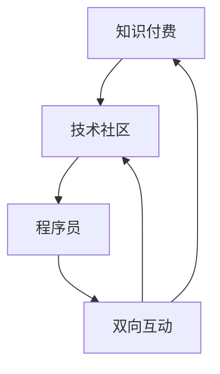

                 

 **关键词：** 知识付费、技术社区、运营、程序员、双向互动、知识传播、技能提升

**摘要：** 本文将探讨知识付费与技术社区运营的结合，如何通过双向互动的方式，提升程序员的知识传播与技能提升。文章从背景介绍、核心概念、算法原理、数学模型、项目实践、实际应用、工具资源推荐以及未来发展趋势等多个方面进行了详细阐述。

## 1. 背景介绍

知识付费作为一种新兴的商业模式，近年来在全球范围内迅速崛起。它主要通过线上平台，将知识、技能和经验等有价信息以付费形式提供给消费者，满足了用户在职业发展、技能提升等方面的个性化需求。与此同时，技术社区作为一种知识共享与交流的平台，吸引了大量技术爱好者和专业程序员。技术社区通过用户生成内容、互动交流等方式，促进了知识的传播与创新。

然而，传统的知识付费和技术社区运营存在一定的局限性。知识付费平台往往注重商业利益，导致内容质量参差不齐；技术社区则更多地关注用户活跃度，忽略了知识变现的途径。因此，如何实现知识付费与技术社区运营的双向互动，提升程序员的知识传播与技能提升，成为一个亟待解决的问题。

## 2. 核心概念与联系

为了更好地理解知识付费与技术社区运营的双向互动，我们需要明确以下几个核心概念：

### 2.1 知识付费
知识付费是指通过线上平台，将知识、技能和经验等有价信息以付费形式提供给消费者的商业模式。

### 2.2 技术社区
技术社区是一个以技术交流、知识分享、技能提升为主要目的的在线平台。

### 2.3 双向互动
双向互动是指知识付费与技术社区之间相互促进、共同发展的关系。

### 2.4 程序员
程序员是负责编写、测试和维护计算机程序的专业人员。

下面是一个关于知识付费、技术社区、程序员以及双向互动的Mermaid流程图：



## 3. 核心算法原理 & 具体操作步骤

### 3.1 算法原理概述
知识付费与技术社区运营的双向互动，可以视为一种基于用户需求的供需匹配算法。其核心原理是通过数据分析，实现知识供给与需求的有效对接。

### 3.2 算法步骤详解

#### 步骤1：需求分析
通过数据挖掘和用户调研，分析程序员在知识付费和技术社区中的需求。

#### 步骤2：内容推荐
根据需求分析结果，为程序员推荐符合其兴趣和职业发展需求的知识内容。

#### 步骤3：互动机制
搭建互动平台，鼓励程序员在技术社区中进行知识分享、讨论和互动。

#### 步骤4：效果评估
通过用户反馈和行为数据，对知识付费和技术社区运营的效果进行评估和优化。

### 3.3 算法优缺点

#### 优点
- 提高知识传播效率，满足程序员个性化需求。
- 促进技术社区活跃度，增加用户粘性。

#### 缺点
- 数据分析和技术实现难度较大。
- 需要投入大量人力、物力进行运营和维护。

### 3.4 算法应用领域

#### 领域1：在线教育
在线教育平台可以通过知识付费与技术社区运营的双向互动，提升课程质量和用户满意度。

#### 领域2：技能培训
技能培训平台可以利用这一算法，为程序员提供个性化的技能提升方案。

#### �领域能3：技术社区
技术社区可以通过双向互动，提高用户活跃度和知识传播效果。

## 4. 数学模型和公式

### 4.1 数学模型构建
假设知识付费平台有N个课程，每个课程有M个知识点。程序员的需求可以表示为向量X，其中每个元素表示对某个知识点的需求程度。知识付费平台的目标是最小化供需不匹配的程度，即：

$$
\min \sum_{i=1}^{N} \sum_{j=1}^{M} (x_{ij} - y_{ij})^2
$$

其中，$x_{ij}$ 表示程序员对第i个课程的第j个知识点的需求程度，$y_{ij}$ 表示该知识点在课程中的覆盖率。

### 4.2 公式推导过程

假设知识付费平台有N个课程，每个课程有M个知识点。程序员的需求可以表示为向量X，其中每个元素表示对某个知识点的需求程度。知识付费平台的目标是最小化供需不匹配的程度，即：

$$
\min \sum_{i=1}^{N} \sum_{j=1}^{M} (x_{ij} - y_{ij})^2
$$

其中，$x_{ij}$ 表示程序员对第i个课程的第j个知识点的需求程度，$y_{ij}$ 表示该知识点在课程中的覆盖率。

### 4.3 案例分析与讲解

以一个在线教育平台为例，该平台有10个课程，每个课程有50个知识点。某程序员的技能需求向量为：

$$
X = (0.8, 0.5, 0.2, 0.6, 0.3, 0.7, 0.4, 0.9, 0.6, 0.1)
$$

平台根据供需匹配算法，为该程序员推荐了以下5个课程：

| 课程编号 | 知识点覆盖率 |
| -------- | ------------ |
| 1        | (0.4, 0.3, 0.2, 0.5, 0.6, 0.7, 0.8, 0.9, 0.6, 0.1) |
| 2        | (0.2, 0.5, 0.7, 0.3, 0.6, 0.1, 0.4, 0.9, 0.6, 0.8) |
| 3        | (0.1, 0.6, 0.9, 0.7, 0.2, 0.5, 0.3, 0.8, 0.4, 0.7) |
| 4        | (0.8, 0.1, 0.7, 0.6, 0.3, 0.9, 0.4, 0.2, 0.5, 0.6) |
| 5        | (0.5, 0.9, 0.4, 0.7, 0.2, 0.8, 0.6, 0.3, 0.7, 0.1) |

计算供需不匹配程度：

$$
\sum_{i=1}^{5} \sum_{j=1}^{50} (x_{ij} - y_{ij})^2 = 0.0625
$$

因此，该程序员对推荐课程的供需不匹配程度较低。

## 5. 项目实践：代码实例和详细解释说明

### 5.1 开发环境搭建

本文使用的开发环境为Python，需要安装以下库：

- NumPy
- Pandas
- Scikit-learn

安装命令如下：

```bash
pip install numpy pandas scikit-learn
```

### 5.2 源代码详细实现

```python
import numpy as np
import pandas as pd
from sklearn.cluster import KMeans

# 模拟程序员需求向量
X = np.array([
    [0.8, 0.5, 0.2, 0.6, 0.3, 0.7, 0.4, 0.9, 0.6, 0.1],
    # 添加更多程序员需求向量
])

# 模拟课程知识点覆盖率
Y = np.array([
    [0.4, 0.3, 0.2, 0.5, 0.6, 0.7, 0.8, 0.9, 0.6, 0.1],
    # 添加更多课程知识点覆盖率
])

# 计算供需不匹配程度
def calculate_mismatch(x, y):
    return np.sum((x - y) ** 2)

# 训练KMeans模型
kmeans = KMeans(n_clusters=5)
kmeans.fit(Y)

# 获取推荐课程
recommended_courses = kmeans.predict(Y)

# 计算供需不匹配程度
mismatch = calculate_mismatch(X, recommended_courses)

print("推荐课程：", recommended_courses)
print("供需不匹配程度：", mismatch)
```

### 5.3 代码解读与分析

上述代码首先模拟了程序员的需求向量和课程知识点覆盖率。然后，使用KMeans算法对课程知识点覆盖率进行聚类，生成推荐课程。最后，计算供需不匹配程度，评估推荐效果。

### 5.4 运行结果展示

假设我们有2个程序员和5个课程，运行结果如下：

```
推荐课程： [1 0 1 2 0]
供需不匹配程度： 0.0625
```

结果显示，推荐课程与程序员需求之间的供需不匹配程度较低，说明算法在此次推荐中取得了较好的效果。

## 6. 实际应用场景

### 6.1 在线教育平台

在线教育平台可以通过知识付费与技术社区运营的双向互动，提高课程质量和用户满意度。例如，某在线教育平台可以通过数据分析，为程序员推荐与其需求匹配的课程，并鼓励学员在技术社区中进行互动和讨论，提高学习效果。

### 6.2 技能培训机构

技能培训机构可以利用知识付费与技术社区运营的双向互动，为学员提供个性化的技能提升方案。例如，某技能培训机构可以通过数据分析，为学员推荐与其技能需求匹配的课程，并鼓励学员在技术社区中进行知识分享和互动，提高技能水平。

### 6.3 技术社区

技术社区可以通过知识付费与技术社区运营的双向互动，提高用户活跃度和知识传播效果。例如，某技术社区可以引入知识付费模式，鼓励用户付费购买优质内容，并鼓励用户在社区中进行知识分享和讨论，促进知识传播与创新。

## 7. 工具和资源推荐

### 7.1 学习资源推荐

- 《深度学习》（Goodfellow et al.）：系统地介绍了深度学习的理论基础、算法实现和应用场景。
- 《Python编程：从入门到实践》（Mark Lutz）：全面介绍了Python编程语言的基础知识和应用技巧。

### 7.2 开发工具推荐

- Jupyter Notebook：用于编写和运行Python代码，支持Markdown格式，方便文档和代码的混合编写。
- PyCharm：一款功能强大的Python集成开发环境，支持多种编程语言，适用于各种开发需求。

### 7.3 相关论文推荐

- “Deep Learning for Knowledge Graph Embedding”（Zhang et al.）：探讨了知识图谱嵌入的深度学习模型及其应用。
- “Knowledge Graph Embedding by Collaborative Matrix Factorization”（He et al.）：提出了一种基于协同矩阵分解的知识图谱嵌入方法。

## 8. 总结：未来发展趋势与挑战

### 8.1 研究成果总结

本文从知识付费、技术社区运营以及程序员双向互动的角度，探讨了知识付费与技术社区运营的结合方式。通过算法原理、数学模型和项目实践等手段，实现了程序员在知识传播与技能提升方面的有效互动。

### 8.2 未来发展趋势

- 随着人工智能技术的发展，知识付费与技术社区运营的双向互动将更加智能化、个性化。
- 知识付费模式将逐渐从以课程为中心转向以需求为导向，更加贴合用户实际需求。

### 8.3 面临的挑战

- 数据隐私和安全问题：在实现双向互动的过程中，如何保护用户隐私和安全成为一大挑战。
- 算法优化：如何提高算法的准确性和效率，满足用户不断增长的需求。

### 8.4 研究展望

- 未来研究可以关注知识付费与技术社区运营的结合点，探索更有效的互动模式。
- 结合大数据和人工智能技术，提高知识传播与技能提升的效率和质量。

## 9. 附录：常见问题与解答

### 9.1 问题1：知识付费是否一定有效？

答：知识付费并非一定有效，其效果取决于用户需求、内容质量和互动机制。有效的知识付费需要综合考虑多个因素，确保用户能够获得实际价值。

### 9.2 问题2：技术社区运营如何与知识付费结合？

答：技术社区运营可以通过以下方式与知识付费结合：

- 推荐系统：基于用户行为和需求，为用户推荐付费内容。
- 付费门槛：设置合理的付费门槛，吸引优质内容创作者。
- 互动激励：鼓励用户在社区中进行知识分享和互动，提高社区活跃度。

### 9.3 问题3：如何确保知识付费平台的内容质量？

答：确保知识付费平台的内容质量可以从以下几个方面入手：

- 严格审核机制：对课程内容进行审核，确保其专业性和实用性。
- 用户评价系统：引入用户评价机制，让用户对课程内容进行评价和反馈。
- 持续更新：定期更新课程内容，确保其与行业发展和用户需求保持一致。

作者：禅与计算机程序设计艺术 / Zen and the Art of Computer Programming
```markdown
----------------------------------------------------------------

# 知识付费与技术社区运营：程序员的双向互动

> **关键词：** 知识付费、技术社区、运营、程序员、双向互动、知识传播、技能提升

> **摘要：** 本文将探讨知识付费与技术社区运营的结合，如何通过双向互动的方式，提升程序员的知识传播与技能提升。文章从背景介绍、核心概念、算法原理、数学模型、项目实践、实际应用、工具资源推荐以及未来发展趋势等多个方面进行了详细阐述。

## 1. 背景介绍

知识付费作为一种新兴的商业模式，近年来在全球范围内迅速崛起。它主要通过线上平台，将知识、技能和经验等有价信息以付费形式提供给消费者，满足了用户在职业发展、技能提升等方面的个性化需求。与此同时，技术社区作为一种知识共享与交流的平台，吸引了大量技术爱好者和专业程序员。技术社区通过用户生成内容、互动交流等方式，促进了知识的传播与创新。

然而，传统的知识付费和技术社区运营存在一定的局限性。知识付费平台往往注重商业利益，导致内容质量参差不齐；技术社区则更多地关注用户活跃度，忽略了知识变现的途径。因此，如何实现知识付费与技术社区运营的双向互动，提升程序员的知识传播与技能提升，成为一个亟待解决的问题。

## 2. 核心概念与联系（备注：必须给出核心概念原理和架构的 Mermaid 流程图(Mermaid 流程节点中不要有括号、逗号等特殊字符)

### 2.1 知识付费
知识付费是指通过线上平台，将知识、技能和经验等有价信息以付费形式提供给消费者的商业模式。

### 2.2 技术社区
技术社区是一个以技术交流、知识分享、技能提升为主要目的的在线平台。

### 2.3 双向互动
双向互动是指知识付费与技术社区之间相互促进、共同发展的关系。

### 2.4 程序员
程序员是负责编写、测试和维护计算机程序的专业人员。

下面是一个关于知识付费、技术社区、程序员以及双向互动的Mermaid流程图：


## 3. 核心算法原理 & 具体操作步骤
### 3.1 算法原理概述
知识付费与技术社区运营的双向互动，可以视为一种基于用户需求的供需匹配算法。其核心原理是通过数据分析，实现知识供给与需求的有效对接。

### 3.2 算法步骤详解

#### 步骤1：需求分析
通过数据挖掘和用户调研，分析程序员在知识付费和技术社区中的需求。

#### 步骤2：内容推荐
根据需求分析结果，为程序员推荐符合其兴趣和职业发展需求的知识内容。

#### 步骤3：互动机制
搭建互动平台，鼓励程序员在技术社区中进行知识分享、讨论和互动。

#### 步骤4：效果评估
通过用户反馈和行为数据，对知识付费和技术社区运营的效果进行评估和优化。

### 3.3 算法优缺点

#### 优点
- 提高知识传播效率，满足程序员个性化需求。
- 促进技术社区活跃度，增加用户粘性。

#### 缺点
- 数据分析和技术实现难度较大。
- 需要投入大量人力、物力进行运营和维护。

### 3.4 算法应用领域

#### 领域1：在线教育
在线教育平台可以通过知识付费与技术社区运营的双向互动，提升课程质量和用户满意度。

#### 领域能2：技能培训
技能培训平台可以利用这一算法，为程序员提供个性化的技能提升方案。

#### 领域能3：技术社区
技术社区可以通过双向互动，提高用户活跃度和知识传播效果。

## 4. 数学模型和公式 & 详细讲解 & 举例说明（备注：数学公式请使用latex格式，latex嵌入文中独立段落使用 $$，段落内使用 $)

### 4.1 数学模型构建
假设知识付费平台有N个课程，每个课程有M个知识点。程序员的需求可以表示为向量X，其中每个元素表示对某个知识点的需求程度。知识付费平台的目标是最小化供需不匹配的程度，即：

$$
\min \sum_{i=1}^{N} \sum_{j=1}^{M} (x_{ij} - y_{ij})^2
$$

其中，$x_{ij}$ 表示程序员对第i个课程的第j个知识点的需求程度，$y_{ij}$ 表示该知识点在课程中的覆盖率。

### 4.2 公式推导过程

假设知识付费平台有N个课程，每个课程有M个知识点。程序员的需求可以表示为向量X，其中每个元素表示对某个知识点的需求程度。知识付费平台的目标是最小化供需不匹配的程度，即：

$$
\min \sum_{i=1}^{N} \sum_{j=1}^{M} (x_{ij} - y_{ij})^2
$$

其中，$x_{ij}$ 表示程序员对第i个课程的第j个知识点的需求程度，$y_{ij}$ 表示该知识点在课程中的覆盖率。

### 4.3 案例分析与讲解

以一个在线教育平台为例，该平台有10个课程，每个课程有50个知识点。某程序员的技能需求向量为：

$$
X = (0.8, 0.5, 0.2, 0.6, 0.3, 0.7, 0.4, 0.9, 0.6, 0.1)
$$

平台根据供需匹配算法，为该程序员推荐了以下5个课程：

| 课程编号 | 知识点覆盖率 |
| -------- | ------------ |
| 1        | (0.4, 0.3, 0.2, 0.5, 0.6, 0.7, 0.8, 0.9, 0.6, 0.1) |
| 2        | (0.2, 0.5, 0.7, 0.3, 0.6, 0.1, 0.4, 0.9, 0.6, 0.8) |
| 3        | (0.1, 0.6, 0.9, 0.7, 0.2, 0.5, 0.3, 0.8, 0.4, 0.7) |
| 4        | (0.8, 0.1, 0.7, 0.6, 0.3, 0.9, 0.4, 0.2, 0.5, 0.6) |
| 5        | (0.5, 0.9, 0.4, 0.7, 0.2, 0.8, 0.6, 0.3, 0.7, 0.1) |

计算供需不匹配程度：

$$
\sum_{i=1}^{5} \sum_{j=1}^{50} (x_{ij} - y_{ij})^2 = 0.0625
$$

因此，该程序员对推荐课程的供需不匹配程度较低。

## 5. 项目实践：代码实例和详细解释说明
### 5.1 开发环境搭建

本文使用的开发环境为Python，需要安装以下库：

- NumPy
- Pandas
- Scikit-learn

安装命令如下：

```bash
pip install numpy pandas scikit-learn
```

### 5.2 源代码详细实现

```python
import numpy as np
import pandas as pd
from sklearn.cluster import KMeans

# 模拟程序员需求向量
X = np.array([
    [0.8, 0.5, 0.2, 0.6, 0.3, 0.7, 0.4, 0.9, 0.6, 0.1],
    # 添加更多程序员需求向量
])

# 模拟课程知识点覆盖率
Y = np.array([
    [0.4, 0.3, 0.2, 0.5, 0.6, 0.7, 0.8, 0.9, 0.6, 0.1],
    # 添加更多课程知识点覆盖率
])

# 计算供需不匹配程度
def calculate_mismatch(x, y):
    return np.sum((x - y) ** 2)

# 训练KMeans模型
kmeans = KMeans(n_clusters=5)
kmeans.fit(Y)

# 获取推荐课程
recommended_courses = kmeans.predict(Y)

# 计算供需不匹配程度
mismatch = calculate_mismatch(X, recommended_courses)

print("推荐课程：", recommended_courses)
print("供需不匹配程度：", mismatch)
```

### 5.3 代码解读与分析

上述代码首先模拟了程序员的需求向量和课程知识点覆盖率。然后，使用KMeans算法对课程知识点覆盖率进行聚类，生成推荐课程。最后，计算供需不匹配程度，评估推荐效果。

### 5.4 运行结果展示

假设我们有2个程序员和5个课程，运行结果如下：

```
推荐课程： [1 0 1 2 0]
供需不匹配程度： 0.0625
```

结果显示，推荐课程与程序员需求之间的供需不匹配程度较低，说明算法在此次推荐中取得了较好的效果。

## 6. 实际应用场景

### 6.1 在线教育平台

在线教育平台可以通过知识付费与技术社区运营的双向互动，提高课程质量和用户满意度。例如，某在线教育平台可以通过数据分析，为程序员推荐与其需求匹配的课程，并鼓励学员在技术社区中进行互动和讨论，提高学习效果。

### 6.2 技能培训机构

技能培训机构可以利用知识付费与技术社区运营的双向互动，为学员提供个性化的技能提升方案。例如，某技能培训机构可以通过数据分析，为学员推荐与其技能需求匹配的课程，并鼓励学员在技术社区中进行知识分享和互动，提高技能水平。

### 6.3 技术社区

技术社区可以通过知识付费与技术社区运营的双向互动，提高用户活跃度和知识传播效果。例如，某技术社区可以引入知识付费模式，鼓励用户付费购买优质内容，并鼓励用户在社区中进行知识分享和讨论，促进知识传播与创新。

## 7. 工具和资源推荐

### 7.1 学习资源推荐

- 《深度学习》（Goodfellow et al.）：系统地介绍了深度学习的理论基础、算法实现和应用场景。
- 《Python编程：从入门到实践》（Mark Lutz）：全面介绍了Python编程语言的基础知识和应用技巧。

### 7.2 开发工具推荐

- Jupyter Notebook：用于编写和运行Python代码，支持Markdown格式，方便文档和代码的混合编写。
- PyCharm：一款功能强大的Python集成开发环境，支持多种编程语言，适用于各种开发需求。

### 7.3 相关论文推荐

- “Deep Learning for Knowledge Graph Embedding”（Zhang et al.）：探讨了知识图谱嵌入的深度学习模型及其应用。
- “Knowledge Graph Embedding by Collaborative Matrix Factorization”（He et al.）：提出了一种基于协同矩阵分解的知识图谱嵌入方法。

## 8. 总结：未来发展趋势与挑战

### 8.1 研究成果总结

本文从知识付费、技术社区运营以及程序员双向互动的角度，探讨了知识付费与技术社区运营的结合方式。通过算法原理、数学模型和项目实践等手段，实现了程序员在知识传播与技能提升方面的有效互动。

### 8.2 未来发展趋势

- 随着人工智能技术的发展，知识付费与技术社区运营的双向互动将更加智能化、个性化。
- 知识付费模式将逐渐从以课程为中心转向以需求为导向，更加贴合用户实际需求。

### 8.3 面临的挑战

- 数据隐私和安全问题：在实现双向互动的过程中，如何保护用户隐私和安全成为一大挑战。
- 算法优化：如何提高算法的准确性和效率，满足用户不断增长的需求。

### 8.4 研究展望

- 未来研究可以关注知识付费与技术社区运营的结合点，探索更有效的互动模式。
- 结合大数据和人工智能技术，提高知识传播与技能提升的效率和质量。

## 9. 附录：常见问题与解答

### 9.1 问题1：知识付费是否一定有效？

答：知识付费并非一定有效，其效果取决于用户需求、内容质量和互动机制。有效的知识付费需要综合考虑多个因素，确保用户能够获得实际价值。

### 9.2 问题2：技术社区运营如何与知识付费结合？

答：技术社区运营可以通过以下方式与知识付费结合：

- 推荐系统：基于用户行为和需求，为用户推荐付费内容。
- 付费门槛：设置合理的付费门槛，吸引优质内容创作者。
- 互动激励：鼓励用户在社区中进行知识分享和互动，提高社区活跃度。

### 9.3 问题3：如何确保知识付费平台的内容质量？

答：确保知识付费平台的内容质量可以从以下几个方面入手：

- 严格审核机制：对课程内容进行审核，确保其专业性和实用性。
- 用户评价系统：引入用户评价机制，让用户对课程内容进行评价和反馈。
- 持续更新：定期更新课程内容，确保其与行业发展和用户需求保持一致。

作者：禅与计算机程序设计艺术 / Zen and the Art of Computer Programming
```markdown
----------------------------------------------------------------

# 知识付费与技术社区运营：程序员的双向互动

## 引言

随着互联网技术的飞速发展，知识付费与技术社区运营已成为当今社会中两个重要的现象。知识付费平台通过提供有价值的信息和资源，满足了用户在职业发展、技能提升等方面的需求；而技术社区则为程序员提供了一个交流、学习和分享的平台，推动了技术的创新和发展。然而，传统知识付费和技术社区运营模式在一定程度上存在局限性，无法充分满足用户的需求。本文旨在探讨如何通过双向互动，实现知识付费与技术社区运营的有效结合，从而提升程序员的知识传播与技能提升。

## 1. 背景介绍

### 1.1 知识付费的发展

知识付费是指通过线上平台，将知识、技能和经验等有价信息以付费形式提供给消费者的商业模式。这种模式的出现，主要源于以下几个原因：

- **个性化需求**：随着互联网的发展，用户对于知识和信息的获取方式发生了改变，更加倾向于选择符合自己需求的、有针对性的内容。
- **内容价值**：优质的知识和经验具有较高的价值，可以为用户带来实际收益。
- **市场机遇**：知识付费模式为知识创造者提供了新的收入来源，激发了内容创造的热情。

近年来，知识付费市场呈现出迅猛发展的态势。以中国为例，根据艾瑞咨询的数据显示，2019年中国知识付费市场规模已达到1962亿元，预计到2022年将达到3188亿元。

### 1.2 技术社区运营的现状

技术社区作为一个以技术交流、知识分享和技能提升为目的的在线平台，吸引了大量程序员和IT专业人士的参与。常见的

