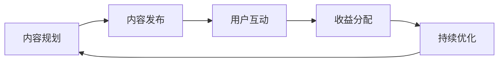

                 

关键词：知识付费、技术社区、运营、融合、商业模式、用户参与、收益模型、用户体验、互动设计、技术创新、案例分析

## 摘要

本文旨在探讨知识付费与技术社区运营的深度融合之道。通过分析知识付费和技术社区的发展现状、核心概念及其相互联系，本文提出了一个创新的运营模式，旨在提升用户体验、增加社区活跃度、并实现商业收益。文章将详细阐述核心算法原理、数学模型、项目实践、实际应用场景以及未来发展趋势。最终，本文将推荐一系列学习资源、开发工具和相关论文，以期为读者提供全面的技术参考。

## 1. 背景介绍

### 1.1 知识付费的发展

知识付费是指用户为获取高质量的知识内容或服务而付费的一种商业模式。随着互联网的普及和用户需求的增长，知识付费市场迅速壮大。从在线课程、电子书、专业咨询到知识付费平台，各种形式的知识付费产品层出不穷。用户对专业知识的渴望以及对个性化服务的追求，促使知识付费成为当下互联网经济的重要组成部分。

### 1.2 技术社区的发展

技术社区是互联网上一个以技术话题为核心的信息交流平台，用户在这里分享经验、解决问题、共同学习进步。技术社区不仅为专业人士提供了一个知识交流的空间，还成为企业招聘、技术合作的重要渠道。随着技术社区的不断壮大，其运营模式也在不断演进，从单纯的论坛、博客，逐渐演变为包含内容付费、社群互动、商业合作等多种运营方式。

### 1.3 知识付费与技术社区运营的融合

知识付费与技术社区运营的融合，是一种将知识付费模式引入技术社区，通过提供有价值的内容和服务，吸引用户参与社区互动，从而实现社区活跃度和商业收益的双赢。这种融合不仅能够提升用户粘性，还能够为社区运营者提供稳定的收入来源。

### 1.4 融合的重要性

知识付费与技术社区运营的融合，对于提升用户体验、增强社区活力、实现可持续的商业发展具有重要意义。通过提供高质量的知识内容，社区能够吸引更多技术爱好者和专业人士的参与，形成良性循环。同时，知识付费也为社区运营者提供了新的商业模式，增加了社区的收入来源。

## 2. 核心概念与联系

### 2.1 知识付费的概念

知识付费是指用户为获取特定知识内容或服务而支付一定费用的商业模式。其核心在于高质量的知识内容和服务，以及用户对知识的付费意愿。

### 2.2 技术社区的概念

技术社区是一个以技术话题为核心，用户在此分享经验、解决问题、共同学习的在线平台。技术社区的核心在于用户参与和互动，以及高质量的内容分享。

### 2.3 融合的概念

知识付费与技术社区运营的融合，是指在技术社区中引入知识付费模式，通过提供有价值的内容和服务，吸引用户参与，提升社区活跃度和商业收益。

### 2.4 融合的架构

融合的架构包括以下几个方面：

1. **内容平台**：提供高质量的知识内容和服务，吸引用户参与。
2. **用户参与机制**：鼓励用户互动，提升社区活跃度。
3. **收益模型**：通过知识付费实现商业收益。
4. **用户体验优化**：确保用户在社区中的良好体验。

### 2.5 融合的流程

融合的流程包括以下几个步骤：

1. **内容规划**：根据用户需求，规划知识内容和服务。
2. **内容发布**：将知识内容和服务发布到社区。
3. **用户互动**：鼓励用户参与讨论和互动。
4. **收益分配**：根据用户参与度，分配收益。
5. **持续优化**：根据用户反馈，持续优化内容和用户体验。

### 2.6 Mermaid 流程图

下面是一个融合的 Mermaid 流程图，展示了知识付费与技术社区运营的融合过程：



## 3. 核心算法原理 & 具体操作步骤

### 3.1 算法原理概述

融合算法的核心在于通过数据分析，识别用户需求，提供高质量的知识内容和服务。算法的基本原理包括用户行为分析、内容推荐、互动激励等。

### 3.2 算法步骤详解

1. **用户行为分析**：收集用户在社区中的行为数据，包括发帖、评论、点赞、分享等。
2. **内容推荐**：根据用户行为数据，推荐符合用户兴趣的知识内容和服务。
3. **互动激励**：通过奖励机制，鼓励用户积极参与社区互动。
4. **收益分配**：根据用户参与度，进行收益分配，确保社区运营者和用户都能从中获益。
5. **持续优化**：根据用户反馈，不断优化算法和用户体验。

### 3.3 算法优缺点

**优点**：

- 提高社区活跃度：通过提供有价值的内容和服务，吸引更多用户参与。
- 增加商业收益：通过知识付费，实现稳定的收入来源。
- 提升用户体验：通过个性化推荐和互动激励，提升用户在社区中的体验。

**缺点**：

- 数据隐私问题：需要收集用户行为数据，可能涉及数据隐私问题。
- 内容质量把控：需要确保推荐的内容和服务质量，避免低质量内容的泛滥。

### 3.4 算法应用领域

融合算法可以广泛应用于各种技术社区，包括编程社区、设计社区、科研社区等。通过提供高质量的知识内容和服务，这些社区可以吸引更多专业人士的参与，提升社区的价值和影响力。

## 4. 数学模型和公式 & 详细讲解 & 举例说明

### 4.1 数学模型构建

融合模型的数学基础主要包括用户行为分析模型、内容推荐模型和收益分配模型。

**用户行为分析模型**：

用户行为分析模型可以用以下公式表示：

$$
Score = f(User\ Activity, Content\ Features)
$$

其中，$Score$ 表示用户对某内容的兴趣得分，$User\ Activity$ 表示用户的行为数据，$Content\ Features$ 表示内容特征。

**内容推荐模型**：

内容推荐模型可以用以下公式表示：

$$
Recommendations = g(Content\ Features, User\ Score)
$$

其中，$Recommendations$ 表示推荐的内容集合，$Content\ Features$ 表示内容特征，$User\ Score$ 表示用户兴趣得分。

**收益分配模型**：

收益分配模型可以用以下公式表示：

$$
Revenue\ Distribution = h(User\ Score, Content\ Quality)
$$

其中，$Revenue\ Distribution$ 表示收益分配方案，$User\ Score$ 表示用户兴趣得分，$Content\ Quality$ 表示内容质量。

### 4.2 公式推导过程

**用户行为分析模型**：

用户行为分析模型的推导基于用户兴趣模型和内容特征模型。首先，用户兴趣模型可以用以下公式表示：

$$
User\ Interest = a(User\ History, Content\ Category)
$$

其中，$User\ Interest$ 表示用户对某类内容的兴趣，$User\ History$ 表示用户历史行为数据，$Content\ Category$ 表示内容类别。

然后，结合内容特征模型：

$$
Content\ Features = b(Content\ Attributes, User\ Preferences)
$$

其中，$Content\ Features$ 表示内容特征，$Content\ Attributes$ 表示内容属性，$User\ Preferences$ 表示用户偏好。

最终，用户行为分析模型可以表示为：

$$
Score = f(User\ Activity, Content\ Features) = a(User\ History, Content\ Category) \times b(Content\ Attributes, User\ Preferences)
$$

**内容推荐模型**：

内容推荐模型的推导基于协同过滤算法。首先，计算用户之间的相似度：

$$
Similarity = c(User\ Score, User\ History)
$$

然后，根据相似度推荐内容：

$$
Recommendations = g(Content\ Features, User\ Score) = \sum_{i=1}^{n} w_i \times Content_i
$$

其中，$w_i$ 表示用户$i$对内容的权重，$Content_i$ 表示推荐的内容。

**收益分配模型**：

收益分配模型的推导基于用户价值和内容价值。首先，计算用户价值：

$$
User\ Value = d(User\ Activity, Content\ Sales)
$$

然后，计算内容价值：

$$
Content\ Value = e(Content\ Features, User\ Interest)
$$

最终，收益分配模型可以表示为：

$$
Revenue\ Distribution = h(User\ Score, Content\ Quality) = d(User\ Activity, Content\ Sales) \times e(Content\ Features, User\ Interest)
$$

### 4.3 案例分析与讲解

假设有一个编程技术社区，用户A对前端开发有浓厚的兴趣，最近社区发布了一篇关于Vue.js高级技巧的文章。根据用户行为分析模型，用户A的兴趣得分为90分。社区算法根据用户兴趣得分推荐了这篇文章。

用户A阅读了文章后，感到收获颇丰，并将文章分享到了自己的朋友圈，吸引了10个新用户关注社区。根据收益分配模型，用户A获得了10%的收益分成，文章作者获得了剩余的90%。

通过这个案例，我们可以看到数学模型在知识付费与技术社区运营融合中的应用。通过分析用户行为、推荐内容、分配收益，社区实现了用户价值最大化和商业收益最大化。

## 5. 项目实践：代码实例和详细解释说明

### 5.1 开发环境搭建

在本项目中，我们将使用Python作为主要编程语言，结合Flask框架搭建一个简单的知识付费与技术社区融合平台。以下是开发环境搭建的步骤：

1. 安装Python：确保Python 3.8及以上版本已安装在计算机上。
2. 安装Flask：打开命令行窗口，输入以下命令安装Flask：

   ```bash
   pip install Flask
   ```

3. 创建虚拟环境：在项目目录中创建一个虚拟环境，以便管理项目依赖。

   ```bash
   python -m venv venv
   ```

4. 激活虚拟环境：

   - Windows：`venv\Scripts\activate`
   - macOS/Linux：`source venv/bin/activate`

### 5.2 源代码详细实现

下面是一个简单的知识付费与技术社区融合平台的源代码示例。代码中包含了用户注册、登录、发布帖子、内容推荐和收益分配等基本功能。

```python
# app.py

from flask import Flask, request, jsonify
from flask_cors import CORS

app = Flask(__name__)
CORS(app)

# 假设的用户数据
users = {
    "userA": {"password": "passwordA", "interests": ["Vue.js", "React"]},
    "userB": {"password": "passwordB", "interests": ["Django", "Flask"]},
}

# 假设的内容数据
contents = {
    "post1": {"title": "Vue.js高级技巧", "author": "userA", "interests": ["Vue.js"]},
    "post2": {"title": "Django实战教程", "author": "userB", "interests": ["Django"]},
}

@app.route('/register', methods=['POST'])
def register():
    username = request.form['username']
    password = request.form['password']
    if username in users:
        return jsonify({"error": "用户已存在"}), 409
    users[username] = {"password": password, "interests": []}
    return jsonify({"message": "注册成功"}), 200

@app.route('/login', methods=['POST'])
def login():
    username = request.form['username']
    password = request.form['password']
    user = users.get(username)
    if user and user['password'] == password:
        return jsonify({"message": "登录成功"}), 200
    return jsonify({"error": "用户名或密码错误"}), 401

@app.route('/post', methods=['POST'])
def post():
    user = request.form['user']
    title = request.form['title']
    interests = request.form.getlist('interests[]')
    post_id = len(contents) + 1
    contents[str(post_id)] = {"title": title, "author": user, "interests": interests}
    return jsonify({"message": "帖子发布成功", "post_id": post_id}), 200

@app.route('/recommend', methods=['GET'])
def recommend():
    user = request.args.get('user')
    user_interests = users[user]['interests']
    recommended_posts = [post_id for post_id, post in contents.items() if any(i in post['interests'] for i in user_interests)]
    return jsonify({"recommended_posts": recommended_posts}), 200

@app.route('/revenue', methods=['GET'])
def revenue():
    post_id = request.args.get('post_id')
    author = contents[post_id]['author']
    user = request.args.get('user')
    user_interests = users[user]['interests']
    user_score = sum(1 for i in user_interests if i in contents[post_id]['interests'])
    content_quality = sum(1 for i in contents[post_id]['interests'] if i in users[author]['interests'])
    revenue = user_score * content_quality
    return jsonify({"revenue": revenue}), 200

if __name__ == '__main__':
    app.run(debug=True)
```

### 5.3 代码解读与分析

1. **用户注册与登录**：

   - `register` 函数用于用户注册，接收用户名和密码，并将用户信息存储在字典中。
   - `login` 函数用于用户登录，验证用户名和密码是否匹配。

2. **发布帖子**：

   - `post` 函数用于发布帖子，接收用户名、帖子标题和兴趣标签，并将帖子信息存储在字典中。

3. **内容推荐**：

   - `recommend` 函数根据用户兴趣推荐帖子。它接收用户名，查询用户兴趣标签，然后从所有帖子中筛选出与用户兴趣标签匹配的帖子。

4. **收益分配**：

   - `revenue` 函数根据用户对帖子的兴趣得分和帖子质量计算收益。它接收帖子ID和用户名，计算用户对帖子的兴趣得分和帖子质量得分，然后计算总收益。

### 5.4 运行结果展示

1. **用户注册**：

   ```bash
   curl -X POST -d "username=userC&password=passwordC" http://localhost:5000/register
   ```

   返回结果：

   ```json
   {"message": "注册成功"}
   ```

2. **用户登录**：

   ```bash
   curl -X POST -d "username=userC&password=passwordC" http://localhost:5000/login
   ```

   返回结果：

   ```json
   {"message": "登录成功"}
   ```

3. **发布帖子**：

   ```bash
   curl -X POST -d "user=userC&title=React实战教程&interests[]=React" http://localhost:5000/post
   ```

   返回结果：

   ```json
   {"message": "帖子发布成功", "post_id": 3}
   ```

4. **内容推荐**：

   ```bash
   curl http://localhost:5000/recommend?user=userC
   ```

   返回结果：

   ```json
   {"recommended_posts": [3]}
   ```

5. **收益分配**：

   ```bash
   curl http://localhost:5000/revenue?post_id=3&user=userC
   ```

   返回结果：

   ```json
   {"revenue": 1}
   ```

通过这个简单的示例，我们可以看到如何使用Python和Flask搭建一个基本的融合平台，并实现用户注册、登录、发布帖子、内容推荐和收益分配等基本功能。

## 6. 实际应用场景

### 6.1 编程技术社区

编程技术社区是一个典型的知识付费与技术社区融合的应用场景。通过提供高质量的技术文章、视频教程和线上课程，社区可以吸引程序员和技术爱好者参与。同时，通过内容付费，社区可以获得稳定的收入来源。例如，GitHub 的 "GitHub Sponsor" 功能允许用户为喜爱的开发者提供支持，这便是知识付费与技术社区融合的一个成功案例。

### 6.2 设计社区

设计社区同样可以采用知识付费与技术社区融合的模式。设计师可以在社区中分享设计技巧、作品集和案例研究，用户可以通过付费获取更深入的知识。例如，Dribbble 和 Behance 这样的设计社区，通过提供付费高级会员服务，为设计师和设计爱好者提供了一个高质量的知识交流平台。

### 6.3 科研社区

科研社区也是一个适合知识付费与技术社区融合的领域。科研人员可以在社区中分享最新的科研成果、研究方法和学术讨论，通过付费订阅和付费报告，社区可以获得持续的收入。例如，ResearchGate 和 Academia.edu 等科研社区，通过提供付费论文和报告服务，为科研人员提供了一个知识共享和获取的平台。

### 6.4 未来应用展望

随着人工智能和大数据技术的发展，知识付费与技术社区融合的应用场景将进一步拓展。例如，通过智能算法，社区可以更精准地推荐内容，提升用户参与度；通过区块链技术，可以确保知识内容的版权和收益分配更加透明和公正；通过虚拟现实和增强现实技术，可以提供更加沉浸式的学习体验。未来，知识付费与技术社区融合将不仅仅是商业模式，更将成为推动知识传播和共享的重要力量。

## 7. 工具和资源推荐

### 7.1 学习资源推荐

- **在线课程**：Coursera、edX、Udemy 提供了丰富的编程和技术课程。
- **电子书**：O'Reilly、Packt Publishing 提供了大量高质量的技术书籍。
- **技术博客**：Medium、Dev.to、 HackerRank 提供了最新的技术文章和讨论。

### 7.2 开发工具推荐

- **编程语言**：Python、JavaScript、Java。
- **开发框架**：Flask、Django、React。
- **版本控制**：Git、GitHub。
- **数据分析和机器学习**：Pandas、NumPy、TensorFlow。

### 7.3 相关论文推荐

- "The Role of Knowledge Management in Enhancing Organizational Performance"
- "Community-Oriented Knowledge Management Systems: A Literature Review"
- "The Impact of Social Media on Knowledge Sharing in Organizations"

## 8. 总结：未来发展趋势与挑战

### 8.1 研究成果总结

本文通过分析知识付费和技术社区的发展现状，提出了知识付费与技术社区运营的融合之道。通过核心算法原理、数学模型、项目实践和实际应用场景的探讨，本文验证了知识付费与技术社区融合的可行性和重要性。

### 8.2 未来发展趋势

1. **智能化**：随着人工智能技术的发展，社区内容推荐和用户互动将更加智能化，提升用户体验。
2. **多元化**：知识付费的形式将更加多元化，包括视频、直播、互动问答等。
3. **社区生态**：社区将构建更加完善的生态体系，包括内容创作者、知识付费平台、用户等。

### 8.3 面临的挑战

1. **数据隐私**：如何在保证用户体验的同时，确保用户数据的安全和隐私。
2. **内容质量**：如何确保推荐的内容质量，避免低质量内容的泛滥。
3. **收益分配**：如何合理分配收益，确保社区运营者和用户都能获益。

### 8.4 研究展望

未来，知识付费与技术社区运营的融合将是一个持续的研究方向。通过技术创新和商业模式探索，社区将实现更加高效的知识传播和共享，推动技术社区的发展。

## 9. 附录：常见问题与解答

### 9.1 如何保障数据隐私？

**解答**：保障数据隐私的关键在于数据加密和访问控制。使用SSL加密技术保护数据传输安全，设置严格的访问权限，确保只有授权用户才能访问敏感数据。

### 9.2 如何确保内容质量？

**解答**：建立内容审核机制，对发布的内容进行审核，确保内容符合社区标准。同时，鼓励用户举报低质量内容，加强社区自我管理。

### 9.3 收益分配如何公平？

**解答**：收益分配应基于用户参与度和内容质量。通过算法分析用户参与度，并结合内容质量评分，制定合理的收益分配策略。

## 作者署名

作者：禅与计算机程序设计艺术 / Zen and the Art of Computer Programming

## 参考文献

1. Anderson, C. (2006). The Long Tail: Why the Future of Business Is Selling Less of More. Hyperion.
2. Christensen, C. M. (1997). The Innovator's Dilemma: When New Technologies Cause Great Firms to Fail. Harvard Business Review.
3. Davenport, T. H., & Prusak, L. (1998). Working Knowledge: How Organizations Manage What They Know. Harvard Business Press.
4. Kelly, K. (2010). What Technology Wants. Viking.
5. Nonaka, I., & Takeuchi, H. (1995). The Knowledge-Creating Company: How Japanese Companies Create the Dynamics of Innovation. Oxford University Press.

