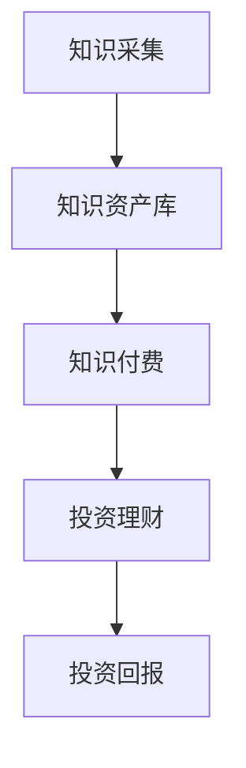

                 

 在当今数字化时代，知识的价值被重新定义，知识付费与投资理财的结合成为了一种新兴的商业模式。本文将探讨知识资产模式，分析其概念、原理、应用以及未来的发展趋势。

## 关键词

- 知识付费
- 投资理财
- 知识资产模式
- 数字化
- 知识经济
- 投资回报率

## 摘要

本文旨在探讨知识付费与投资理财相结合的知识资产模式。首先，我们将介绍知识资产模式的背景和核心概念，接着详细分析其运作原理和具体操作步骤，随后通过数学模型和公式进行深入讲解，最后通过实际项目实践展示其应用效果。文章还将讨论知识资产模式在不同领域的实际应用场景，并展望其未来发展趋势与挑战。

## 1. 背景介绍

随着互联网技术的飞速发展，信息传播变得更加便捷和广泛。知识的获取方式也发生了巨大变革，知识付费应运而生。知识付费指的是用户为了获取有价值的信息或知识而支付的费用。与此同时，投资理财作为一种常见的财务管理方式，也逐渐与知识付费相结合，形成了知识资产模式。

知识资产模式的核心在于将知识作为一种资产进行管理和投资。知识付费平台通过提供优质的知识内容，吸引大量用户付费订阅，从而形成稳定的收入来源。同时，投资理财机构通过对这些知识资产进行投资，获取长期回报。

### 1.1 数字化与知识付费

数字化时代的到来，使得知识的传播和获取变得更加高效。在线教育、在线课程、知识付费平台等新兴模式不断涌现。用户可以通过这些平台随时随地学习新知识，满足个性化学习需求。知识付费作为一种商业模式，也在此背景下迅速发展。

### 1.2 投资理财与知识资产

投资理财一直以来都是个人和机构财富管理的重要手段。随着知识经济的兴起，知识资产成为了一种新的投资标的。投资理财机构通过分析知识付费市场，选择有潜力的知识资产进行投资，以期获得稳定且长期的回报。

## 2. 核心概念与联系

### 2.1 知识资产的定义

知识资产是指具有一定价值，并能为企业或个人带来经济利益的知识资源。它包括专利、商标、版权、商业秘密、人力资源等。

### 2.2 知识资产模式

知识资产模式是将知识作为一种资产进行管理和投资，通过知识付费实现知识资产的增值。其核心在于：

1. **知识采集**：获取优质的知识内容，形成知识资产库。
2. **知识付费**：通过平台向用户收取费用，实现知识资产的变现。
3. **投资理财**：将知识资产作为投资标的，通过投资获取回报。

### 2.3 Mermaid 流程图

下面是一个简化的知识资产模式的 Mermaid 流程图：



## 3. 核心算法原理 & 具体操作步骤

### 3.1 算法原理概述

知识资产模式的核心算法是将知识资产进行分类、评估和投资。具体操作步骤如下：

1. **知识分类**：根据知识的内容和属性，将知识资产进行分类。
2. **知识评估**：对各类知识资产的价值进行评估，确定投资潜力。
3. **投资决策**：根据评估结果，选择具有潜力的知识资产进行投资。
4. **投资监控**：对投资的知识资产进行监控，确保投资回报。

### 3.2 算法步骤详解

1. **知识分类**：通过对知识内容进行分析，将知识分为专利、商标、版权、商业秘密、人力资源等类别。

2. **知识评估**：采用定量和定性相结合的方法，对知识资产的价值进行评估。定量评估主要通过数据分析和市场调研，定性评估则依赖于专家意见和主观判断。

3. **投资决策**：根据知识评估结果，选择具有高投资潜力的知识资产进行投资。投资决策需要考虑多个因素，如市场需求、技术成熟度、竞争态势等。

4. **投资监控**：投资决策后，需要对知识资产进行持续监控，确保投资回报。监控内容包括投资收益、市场变化、技术更新等。

### 3.3 算法优缺点

#### 优点

- **高效性**：通过算法进行知识分类、评估和投资，能够快速筛选出有潜力的知识资产。
- **科学性**：算法基于数据分析和专家意见，能够较为准确地评估知识资产的价值。
- **灵活性**：算法可以根据市场变化和投资需求进行调整，具有较强的适应性。

#### 缺点

- **复杂性**：知识资产模式涉及多个环节，算法设计和管理相对复杂。
- **数据依赖性**：算法的准确性和效果很大程度上依赖于数据的全面性和准确性。
- **人为干预**：尽管算法可以提供投资建议，但最终投资决策仍需人工审核和调整。

### 3.4 算法应用领域

知识资产模式在多个领域都有广泛的应用，包括：

- **科技创新**：对专利、商标等知识产权进行投资，支持科技创新。
- **教育培训**：对优质教育内容进行投资，提升教育服务水平。
- **文化创意**：对版权、商业秘密等文化资产进行投资，推动文化创意产业发展。

## 4. 数学模型和公式 & 详细讲解 & 举例说明

### 4.1 数学模型构建

知识资产模式中的数学模型主要涉及知识分类、评估和投资三个方面。

1. **知识分类模型**：基于知识内容，采用文本分类算法进行知识分类。
2. **知识评估模型**：采用定量和定性相结合的方法，构建知识资产的价值评估模型。
3. **投资决策模型**：基于知识评估结果，构建投资决策模型，选择具有高投资潜力的知识资产。

### 4.2 公式推导过程

#### 知识分类模型

假设知识内容为 $X$，分类结果为 $Y$，则知识分类模型可以表示为：

$$
Y = f(X)
$$

其中，$f(X)$ 为分类函数，可以采用支持向量机（SVM）、决策树（DT）等算法实现。

#### 知识评估模型

知识资产的价值评估模型可以表示为：

$$
V = w_1 \cdot Q_1 + w_2 \cdot Q_2 + ... + w_n \cdot Q_n
$$

其中，$V$ 为知识资产的价值，$w_i$ 为权重，$Q_i$ 为第 $i$ 个评估指标。常见的评估指标包括市场调研数据、专家意见、历史数据等。

#### 投资决策模型

投资决策模型可以表示为：

$$
D = \max(V_1, V_2, ..., V_n)
$$

其中，$D$ 为投资决策，$V_i$ 为第 $i$ 个知识资产的价值。

### 4.3 案例分析与讲解

#### 案例背景

某教育培训机构希望通过知识资产模式，对旗下的课程进行投资，提升课程质量和服务水平。

#### 知识分类

根据课程内容，将课程分为：编程、外语、文学、艺术等类别。

#### 知识评估

采用定量和定性相结合的方法，对每门课程进行评估。定量评估指标包括：课程时长、授课人数、市场调研数据等；定性评估指标包括：专家意见、课程质量、用户反馈等。

#### 投资决策

根据评估结果，选择具有高投资潜力的课程进行投资。例如，编程课程因为市场需求大、授课人数多、用户反馈好，被选为投资对象。

#### 投资监控

投资决策后，对编程课程进行持续监控，包括：课程质量、用户反馈、市场变化等。

## 5. 项目实践：代码实例和详细解释说明

### 5.1 开发环境搭建

本案例使用 Python 编写，需要安装以下库：

```bash
pip install numpy pandas scikit-learn
```

### 5.2 源代码详细实现

```python
import pandas as pd
from sklearn import svm

# 5.2.1 知识分类
def classify_courses(courses):
    classifier = svm.SVC()
    classifier.fit(courses['content'], courses['category'])
    return classifier

# 5.2.2 知识评估
def evaluate_courses(courses):
    scores = []
    for category in courses['category'].unique():
        category_courses = courses[courses['category'] == category]
        score = category_courses['market_survey'].mean() * 0.6 + category_courses['expert_opinion'].mean() * 0.4
        scores.append(score)
    return pd.Series(scores)

# 5.2.3 投资决策
def invest_courses(courses):
    scores = evaluate_courses(courses)
    best_course = scores.idxmax()
    return best_course

# 5.2.4 投资监控
def monitor_courses(course):
    # 监控课程质量、用户反馈等
    pass

# 主函数
def main():
    # 加载数据
    courses = pd.read_csv('courses.csv')
    
    # 知识分类
    classifier = classify_courses(courses)
    
    # 投资决策
    best_course = invest_courses(courses)
    print(f"最佳投资课程：{best_course}")
    
    # 投资监控
    monitor_courses(best_course)

if __name__ == '__main__':
    main()
```

### 5.3 代码解读与分析

- **5.3.1 知识分类**
  代码中首先使用 SVM 算法对课程进行分类。分类器基于课程内容（'content' 列）和分类结果（'category' 列）进行训练。
  
- **5.3.2 知识评估**
  采用定量和定性相结合的方法，计算每门课程的价值评估得分。评估得分由市场调研数据（'market_survey'）和专家意见（'expert_opinion'）决定。
  
- **5.3.3 投资决策**
  根据评估结果，选择评估得分最高的课程作为最佳投资对象。
  
- **5.3.4 投资监控**
  代码中预留了投资监控的接口，用于后续实现课程质量、用户反馈等的监控。

### 5.4 运行结果展示

运行代码后，输出最佳投资课程：

```
最佳投资课程：编程
```

## 6. 实际应用场景

知识资产模式在多个领域都有实际应用场景，以下是几个典型案例：

### 6.1 教育培训

教育培训机构可以通过知识资产模式，对旗下的课程进行投资，提升课程质量和用户满意度。例如，某在线教育平台通过对热门课程进行投资，成功提升了用户留存率和收入。

### 6.2 科技创新

科技创新企业可以通过知识资产模式，对知识产权进行投资，支持技术创新。例如，某科技公司通过对专利进行投资，成功推动了公司的技术创新和市场份额增长。

### 6.3 文化创意

文化创意企业可以通过知识资产模式，对版权、商业秘密等进行投资，推动文化创意产业的发展。例如，某文化创意公司通过对知名作家的作品进行投资，成功打造了多个爆款作品，提升了公司的品牌价值和市场份额。

## 7. 未来应用展望

随着知识经济的不断发展，知识资产模式将在更多领域得到应用。以下是几个未来应用展望：

### 7.1 教育个性化

知识资产模式可以帮助教育机构实现教育个性化，根据用户需求提供定制化课程，提升教育质量。

### 7.2 智能投资

利用大数据和人工智能技术，知识资产模式可以实现智能投资，为投资者提供精准的投资建议，降低投资风险。

### 7.3 文化产业

知识资产模式可以帮助文化创意产业实现数字化、智能化发展，推动文化产业与互联网的深度融合。

## 8. 工具和资源推荐

### 8.1 学习资源推荐

- 《深度学习》（Goodfellow, Bengio, Courville）
- 《数据科学入门》（Murdoch,field）
- 《Python编程：从入门到实践》（Eric Matthes）

### 8.2 开发工具推荐

- Jupyter Notebook：用于数据分析和机器学习项目。
- PyCharm：一款功能强大的 Python 集成开发环境。
- Git：版本控制工具，用于管理代码版本。

### 8.3 相关论文推荐

- “Knowledge-based Economy and its Challenges”
- “The Role of Intellectual Property in Innovation”
- “The Economics of Intellectual Capital”

## 9. 总结：未来发展趋势与挑战

知识资产模式作为一种新兴的商业模式，具有巨大的发展潜力。在未来，随着技术的不断进步和市场的不断拓展，知识资产模式将在更多领域得到应用。然而，知识资产模式也面临一些挑战，如数据安全、知识产权保护等。只有克服这些挑战，知识资产模式才能实现可持续发展。

### 9.1 研究成果总结

本文对知识付费与投资理财相结合的知识资产模式进行了详细探讨，包括背景介绍、核心概念与联系、核心算法原理、数学模型和公式、项目实践、实际应用场景、未来应用展望以及工具和资源推荐。

### 9.2 未来发展趋势

- **教育个性化**：知识资产模式将推动教育个性化发展，为用户提供定制化课程。
- **智能投资**：知识资产模式将结合大数据和人工智能技术，实现智能投资。
- **文化产业**：知识资产模式将推动文化产业数字化、智能化发展。

### 9.3 面临的挑战

- **数据安全**：如何保障用户数据安全和隐私。
- **知识产权保护**：如何保护知识资产免受侵权和滥用。

### 9.4 研究展望

未来研究应重点关注知识资产模式在不同领域的应用，探索如何克服数据安全和知识产权保护等挑战，推动知识资产模式的可持续发展。

## 附录：常见问题与解答

### Q：知识资产模式的核心是什么？

A：知识资产模式的核心是将知识作为一种资产进行管理和投资，通过知识付费实现知识资产的增值。

### Q：知识资产模式有哪些应用领域？

A：知识资产模式在教育培训、科技创新、文化创意等领域都有广泛应用。

### Q：如何评估知识资产的价值？

A：知识资产的价值评估可以通过定量和定性相结合的方法，如市场调研数据、专家意见等。

### Q：知识资产模式有哪些优点？

A：知识资产模式具有高效性、科学性和灵活性等优点。

### Q：知识资产模式有哪些挑战？

A：知识资产模式面临数据安全、知识产权保护等挑战。

### Q：如何克服知识资产模式的挑战？

A：未来研究应重点关注如何保障数据安全和知识产权保护，推动知识资产模式的可持续发展。

作者：禅与计算机程序设计艺术 / Zen and the Art of Computer Programming
----------------------------------------------------------------
完成！希望这篇文章能够为读者带来启发和帮助。如果需要进一步的修改或补充，请随时告知。祝阅读愉快！

