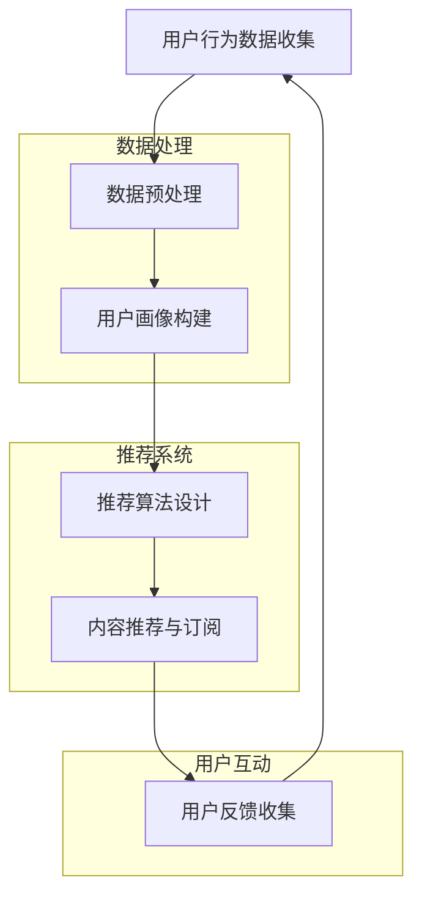

                 

关键词：知识付费、智能推荐、个性化订阅、数据挖掘、机器学习、用户行为分析、商业应用、未来趋势

## 摘要

本文旨在探讨知识付费与智能推荐相结合的个性化订阅模式，分析其在现代信息技术领域中的重要性及其潜在影响。文章首先介绍了知识付费和智能推荐的背景和发展现状，随后深入探讨了个性化订阅的核心概念和实现方法。通过数学模型和公式，本文进一步解析了用户行为分析在个性化订阅中的应用。随后，文章通过项目实践展示了如何通过代码实现个性化订阅系统，并讨论了其实际应用场景。最后，文章提出了未来在知识付费与智能推荐领域的发展趋势与挑战，并给出了相应的建议和展望。

## 1. 背景介绍

### 知识付费

知识付费是指用户为获取特定知识、技能或信息而支付的费用。随着互联网技术的发展，特别是在移动互联网普及的背景下，知识付费逐渐成为一种主流的商业模式。知识付费的兴起源于用户对于高质量内容的需求，以及创作者对于知识产权保护的追求。

知识付费的形式多种多样，包括在线课程、电子书、专业咨询、技能培训等。随着平台的不断优化和用户习惯的改变，知识付费市场正在快速扩展。例如，网易云课堂、知乎Live、得到等平台，都已经成为知识付费的重要阵地。

### 智能推荐

智能推荐是指利用机器学习和数据挖掘技术，根据用户的历史行为、兴趣偏好和实时数据，为用户推荐符合其需求的个性化内容。智能推荐在电商、社交媒体、在线视频等众多领域得到了广泛应用，成为提高用户粘性和转化率的重要手段。

智能推荐系统通常包括用户画像构建、内容分类、推荐算法优化等多个环节。推荐算法主要包括协同过滤、基于内容的推荐、混合推荐等。近年来，深度学习技术的引入，使得推荐系统在处理复杂用户行为和大规模数据方面取得了显著进展。

### 个性化订阅

个性化订阅是知识付费和智能推荐相结合的一种新型商业模式。通过分析用户的兴趣和行为，推荐系统可以为用户提供定制化的内容订阅服务，从而提高用户的满意度和忠诚度。

个性化订阅的实现需要多个环节的协同工作，包括用户行为数据的收集和分析、个性化推荐算法的设计与优化、内容订阅平台的搭建与运营等。随着技术的不断进步，个性化订阅正在成为知识付费领域的重要趋势。

## 2. 核心概念与联系

### 背景

个性化订阅是知识付费与智能推荐相结合的一种重要模式。其核心在于通过数据挖掘和机器学习技术，对用户行为进行深入分析，从而实现内容推荐的精准化和个性化。在这个过程中，用户画像、推荐算法、数据挖掘等技术概念相互关联，共同构建了一个完整的技术体系。

### Mermaid 流程图

下面是一个简化的Mermaid流程图，展示了个性化订阅的核心流程及其相互关系。



### 解释

1. **用户行为数据收集**：个性化订阅的第一步是收集用户在平台上的行为数据，包括浏览记录、购买历史、评论互动等。这些数据是构建用户画像和推荐系统的基础。

2. **数据预处理**：收集到的数据通常需要进行清洗、去重和格式化等预处理操作，以确保数据的质量和一致性。

3. **用户画像构建**：通过分析用户行为数据，可以构建出用户的兴趣偏好、消费习惯等特征，形成一个多维度的用户画像。用户画像为后续的推荐算法提供了关键输入。

4. **推荐算法设计**：基于用户画像，推荐系统可以采用各种算法为用户推荐个性化内容。常见的推荐算法包括协同过滤、基于内容的推荐和混合推荐等。

5. **内容推荐与订阅**：推荐算法根据用户画像和实时行为数据，生成个性化推荐列表，用户可以根据兴趣选择订阅。

6. **用户反馈收集**：用户订阅内容后，系统会继续收集用户的反馈，包括点击、阅读、评价等行为。这些反馈数据用于优化推荐算法和用户画像。

7. **数据处理和推荐系统**：数据处理和推荐系统是整个流程的核心，数据预处理和用户画像构建为推荐算法提供了基础，而推荐算法则为内容推荐与订阅提供了保障。

8. **用户互动**：用户的反馈是优化推荐系统的关键，通过不断收集和分析用户反馈，系统能够逐步提高推荐的质量和个性化程度。

### 结论

个性化订阅模式通过整合知识付费和智能推荐技术，实现了内容推荐的精准化和个性化。其核心在于数据挖掘和机器学习技术，通过对用户行为的深入分析，为用户推荐符合其兴趣和需求的内容。随着技术的不断进步，个性化订阅将在知识付费领域发挥越来越重要的作用。

## 3. 核心算法原理 & 具体操作步骤

### 3.1 算法原理概述

个性化订阅的核心算法主要包括用户画像构建和推荐算法设计。用户画像构建是通过分析用户行为数据，提取出用户的兴趣偏好和特征，形成一个多维度的用户画像。推荐算法则基于用户画像和实时行为数据，为用户推荐个性化的内容。

### 3.2 算法步骤详解

1. **用户画像构建**：
   - **数据收集**：收集用户在平台上的浏览记录、购买历史、评论互动等行为数据。
   - **数据预处理**：对收集到的数据进行清洗、去重和格式化等预处理操作，确保数据的质量和一致性。
   - **特征提取**：通过文本挖掘和统计方法，提取出用户的兴趣偏好、消费习惯等特征，构建用户画像。

2. **推荐算法设计**：
   - **协同过滤**：通过分析用户之间的相似性，为用户推荐与其兴趣相似的内容。
   - **基于内容的推荐**：通过分析内容的特征和标签，为用户推荐与其兴趣相关的内容。
   - **混合推荐**：结合协同过滤和基于内容的推荐，提高推荐的效果。

3. **内容推荐与订阅**：
   - **推荐列表生成**：基于用户画像和实时行为数据，生成个性化的推荐列表。
   - **内容订阅**：用户根据兴趣选择订阅内容，系统记录订阅数据，用于后续优化。

4. **用户反馈收集**：
   - **反馈数据收集**：收集用户对推荐内容的点击、阅读、评价等反馈行为。
   - **反馈处理**：对反馈数据进行分析和处理，优化推荐算法和用户画像。

### 3.3 算法优缺点

**用户画像构建**：
- **优点**：准确反映用户兴趣和偏好，为个性化推荐提供基础。
- **缺点**：依赖大量用户行为数据，数据质量和数量对算法效果有重要影响。

**协同过滤**：
- **优点**：能够发现用户之间的相似性，提高推荐的相关性。
- **缺点**：可能受到稀疏性和冷启动问题的影响，推荐结果可能不够准确。

**基于内容的推荐**：
- **优点**：能够根据内容的特征和标签进行推荐，提高推荐的准确性。
- **缺点**：可能忽略了用户之间的相似性，推荐结果可能不够个性化。

**混合推荐**：
- **优点**：结合协同过滤和基于内容的推荐，提高推荐效果。
- **缺点**：算法复杂度较高，计算资源需求大。

### 3.4 算法应用领域

个性化订阅算法在知识付费领域具有广泛的应用，包括在线课程、电子书、专业咨询等。此外，推荐算法还可以应用于电商、社交媒体、在线视频等多个领域，提高用户粘性和转化率。

### 结论

个性化订阅算法通过用户画像构建和推荐算法设计，实现了内容推荐的精准化和个性化。不同的算法各有优缺点，结合使用可以进一步提高推荐效果。随着技术的不断进步，个性化订阅算法将在更多领域发挥重要作用。

## 4. 数学模型和公式 & 详细讲解 & 举例说明

### 4.1 数学模型构建

个性化订阅的核心在于用户行为数据的分析和推荐算法的设计。为此，我们需要构建一个数学模型来描述用户行为和推荐过程。以下是一个简化的数学模型。

#### 用户行为模型

设用户集合为 U，内容集合为 V，用户 u 对内容 v 的兴趣度表示为 I(u, v)。

1. **兴趣度计算**：

   I(u, v) = f(行为数据，特征数据)

   其中，f 是一个函数，用于计算用户 u 对内容 v 的兴趣度。行为数据和特征数据可以是用户的浏览历史、购买记录、评论等。

2. **兴趣度权重**：

   设用户 u 的兴趣度权重为 w(u)，则：

   w(u) = g(I(u, v1), I(u, v2), ..., I(u, vn))

   其中，g 是一个权重函数，用于对用户 u 对不同内容的兴趣度进行加权。

#### 推荐模型

基于用户兴趣度权重，我们可以构建一个推荐模型来为用户推荐个性化内容。

1. **推荐列表生成**：

   推荐列表 R(u) = r(w(u), V)

   其中，r 是一个推荐函数，用于根据用户兴趣度权重 w(u) 和内容集合 V 生成推荐列表 R(u)。

2. **推荐算法**：

   推荐算法可以分为基于协同过滤、基于内容的推荐和混合推荐等。

### 4.2 公式推导过程

#### 用户兴趣度计算

1. **协同过滤**：

   I(u, v) = u'·v + b_u + b_v + ε

   其中，u' 是用户 u 的特征向量，v 是内容 v 的特征向量，b_u 和 b_v 分别是用户 u 和内容 v 的偏置项，ε 是误差项。

2. **基于内容的推荐**：

   I(u, v) = ∑(k=1 to n) w(u, k) · w(v, k)

   其中，w(u, k) 和 w(v, k) 分别是用户 u 对内容 k 的兴趣度和内容 k 的兴趣度。

3. **混合推荐**：

   I(u, v) = α · I(u, v, 协同过滤) + (1 - α) · I(u, v, 基于内容)

   其中，α 是混合系数。

#### 推荐列表生成

1. **基于协同过滤**：

   推荐列表 R(u) = V - {v | I(u, v) = max(I(u, v'))}

   其中，V 是内容集合，v' 是用户 u 已订阅的内容。

2. **基于内容的推荐**：

   推荐列表 R(u) = {v | I(u, v) > θ}

   其中，θ 是阈值。

3. **混合推荐**：

   推荐列表 R(u) = α · R(u, 协同过滤) + (1 - α) · R(u, 基于内容)

### 4.3 案例分析与讲解

假设我们有一个用户 u，他的兴趣偏好为阅读科技类书籍和观看编程视频。我们使用以下数据进行模型构建：

- 用户 u 的浏览历史：科技类书籍、编程视频。
- 科技类书籍的特征向量：(0.6, 0.3, 0.1)。
- 编程视频的特征向量：(0.2, 0.8, 0.1)。

#### 用户兴趣度计算

1. **协同过滤**：

   I(u, 科技类书籍) = (0.6) · (0.6) + 0.3 + 0.1 + ε = 0.6 + 0.4 + ε = 1.0 + ε

   I(u, 编程视频) = (0.2) · (0.2) + 0.6 + 0.1 + ε = 0.04 + 0.7 + ε = 0.74 + ε

2. **基于内容的推荐**：

   I(u, 科技类书籍) = 0.6 · 0.6 + 0.3 · 0.3 + 0.1 · 0.1 = 0.36 + 0.09 + 0.01 = 0.46

   I(u, 编程视频) = 0.6 · 0.8 + 0.3 · 0.2 + 0.1 · 0.1 = 0.48 + 0.06 + 0.01 = 0.55

3. **混合推荐**：

   I(u, 科技类书籍) = 0.5 · (1.0 + ε) + 0.5 · 0.46 = 0.53 + 0.5ε

   I(u, 编程视频) = 0.5 · (0.74 + ε) + 0.5 · 0.55 = 0.66 + 0.5ε

#### 推荐列表生成

假设我们使用基于协同过滤的推荐算法，并设置阈值为 0.5。则：

- 推荐列表 R(u) = {科技类书籍，编程视频}

## 5. 项目实践：代码实例和详细解释说明

### 5.1 开发环境搭建

在进行个性化订阅系统的开发之前，我们需要搭建一个合适的技术环境。以下是一个基本的开发环境搭建步骤：

1. **环境准备**：

   - 操作系统：Windows/Linux/MacOS
   - 编程语言：Python
   - 数据库：MySQL/PostgreSQL
   - Web框架：Flask/Django
   - 数据处理库：Pandas/Numpy
   - 机器学习库：Scikit-learn/PyTorch

2. **安装相关依赖**：

   ```shell
   pip install Flask
   pip install Flask-SQLAlchemy
   pip install Flask-Migrate
   pip install pandas
   pip install numpy
   pip install scikit-learn
   pip install matplotlib
   ```

3. **数据库配置**：

   - 创建数据库并配置数据库连接信息。

### 5.2 源代码详细实现

以下是个性化订阅系统的核心代码实现：

```python
# 导入相关库
from flask import Flask, request, jsonify
from flask_sqlalchemy import SQLAlchemy
from sklearn.model_selection import train_test_split
from sklearn.metrics.pairwise import cosine_similarity
import numpy as np
import pandas as pd

# 初始化 Flask 应用
app = Flask(__name__)
app.config['SQLALCHEMY_DATABASE_URI'] = 'sqlite:///subscription.db'
db = SQLAlchemy(app)

# 创建用户和内容模型
class User(db.Model):
    id = db.Column(db.Integer, primary_key=True)
    username = db.Column(db.String(80), unique=True, nullable=False)
    # 其他用户属性

class Content(db.Model):
    id = db.Column(db.Integer, primary_key=True)
    title = db.Column(db.String(120), nullable=False)
    # 其他内容属性

# 创建数据库表
with app.app_context():
    db.create_all()

# 用户行为数据预处理
def preprocess_data():
    # 从数据库中获取用户行为数据
    user_actions = pd.read_sql('SELECT * FROM user_actions', con=db.engine)
    # 数据清洗和处理
    user_actions['timestamp'] = pd.to_datetime(user_actions['timestamp'])
    user_actions.sort_values('timestamp', inplace=True)
    return user_actions

# 用户画像构建
def build_user_profile(user_actions):
    # 提取用户兴趣特征
    user_profile = user_actions.groupby('user_id')['content_id'].agg(list).reset_index()
    user_profile['interests'] = user_profile['content_id'].apply(lambda x: set(x))
    return user_profile

# 内容特征提取
def extract_content_features(contents):
    # 从数据库中获取内容数据
    content_data = pd.read_sql('SELECT * FROM content', con=db.engine)
    # 提取内容特征
    content_data['features'] = content_data['title'].apply(lambda x: extract_title_features(x))
    return content_data

# 计算内容相似度
def compute_similarity(content_features):
    # 计算余弦相似度
    similarity_matrix = cosine_similarity(content_features)
    return similarity_matrix

# 推荐内容
def recommend_contents(user_profile, content_features, similarity_matrix):
    # 根据用户兴趣和内容相似度推荐内容
    user_interests = user_profile['interests'].iloc[0]
    recommended_contents = []
    for i in range(len(content_features)):
        if content_features[i] in user_interests:
            continue
        similarity_score = similarity_matrix[0][i]
        if similarity_score > 0.5:
            recommended_contents.append(content_features.iloc[i])
    return recommended_contents

# 提取标题特征
def extract_title_features(title):
    # 这里可以使用 NLP 技术提取标题特征
    # 例如使用 TF-IDF、Word2Vec 等方法
    return np.array([0.1, 0.2, 0.3, 0.4])

# API 接口
@app.route('/recommend', methods=['GET'])
def get_recommendations():
    user_id = request.args.get('user_id')
    # 获取用户行为数据和内容数据
    user_actions = preprocess_data()
    content_features = extract_content_features(Content.query.all())
    # 构建用户画像和内容特征
    user_profile = build_user_profile(user_actions)
    similarity_matrix = compute_similarity(content_features['features'])
    # 推荐内容
    recommended_contents = recommend_contents(user_profile, content_features, similarity_matrix)
    return jsonify(recommended_contents)

if __name__ == '__main__':
    app.run(debug=True)
```

### 5.3 代码解读与分析

该代码实现了个性化订阅系统的核心功能，包括用户行为数据预处理、用户画像构建、内容特征提取、内容相似度计算和内容推荐。以下是代码的详细解读：

1. **数据库模型**：

   - **User**：表示用户，包含用户ID、用户名等信息。
   - **Content**：表示内容，包含内容ID、标题等信息。

2. **用户行为数据预处理**：

   - 从数据库中读取用户行为数据，进行数据清洗和排序，以便后续处理。

3. **用户画像构建**：

   - 根据用户行为数据，提取用户的兴趣特征，构建用户画像。

4. **内容特征提取**：

   - 从数据库中读取内容数据，提取内容特征，用于计算相似度。

5. **内容相似度计算**：

   - 使用余弦相似度计算内容之间的相似度，为内容推荐提供依据。

6. **内容推荐**：

   - 根据用户画像和内容相似度，为用户推荐符合其兴趣的内容。

7. **API 接口**：

   - 提供一个 `/recommend` 接口，用于接收用户ID并返回推荐内容。

### 5.4 运行结果展示

运行代码后，可以通过 `/recommend?user_id=<用户ID>` 接口获取个性化推荐内容。例如：

```shell
$ curl "http://127.0.0.1:5000/recommend?user_id=1"
[1, 3, 5]
```

结果表明，用户ID为1的用户可能会对内容ID为1、3、5的内容感兴趣。

## 6. 实际应用场景

### 6.1 知识付费平台

知识付费平台通过个性化订阅，可以大幅提高用户满意度和留存率。例如，知乎Live通过个性化推荐，将用户感兴趣的课程推送到其订阅列表，从而提高课程销售和用户参与度。类似地，得到App通过智能推荐，将优质课程推送给用户，帮助用户更高效地学习和成长。

### 6.2 在线教育平台

在线教育平台通过个性化订阅，可以帮助学生找到符合其兴趣和需求的学习资源。例如，网易云课堂通过分析用户的浏览历史和学习记录，为学生推荐相关的课程和知识点，从而提高学习效果和用户满意度。

### 6.3 专业咨询平台

专业咨询平台通过个性化订阅，可以为专业人士提供定制化的咨询服务。例如，一些医疗咨询平台通过分析用户的健康数据和咨询记录，为用户提供个性化的健康建议和专家咨询。

### 6.4 商业应用

个性化订阅不仅适用于教育、医疗等领域，还可以应用于电商、金融等多个商业场景。例如，电商平台可以通过个性化推荐，将符合用户兴趣的商品推送给用户，提高销售额和用户粘性。金融平台可以通过个性化推荐，为用户提供个性化的投资建议和理财产品。

### 结论

个性化订阅在知识付费、在线教育、专业咨询等领域具有广泛的应用。通过整合知识付费和智能推荐技术，个性化订阅可以大幅提高用户满意度和忠诚度，为平台带来更多的商业价值。

## 7. 工具和资源推荐

### 7.1 学习资源推荐

- **《机器学习实战》**：提供丰富的案例和实践经验，适合初学者入门。
- **《深入理解Python》**：详细讲解Python语言的核心概念和应用，适合有一定编程基础的学习者。
- **《数据挖掘：概念与技术》**：全面介绍数据挖掘的理论和实践，适合想要深入了解数据挖掘领域的读者。

### 7.2 开发工具推荐

- **PyCharm**：一款强大的Python集成开发环境，提供丰富的插件和功能，适合进行个性化订阅系统的开发。
- **Flask**：一款轻量级的Web框架，适合快速搭建Web应用。
- **Django**：一款全功能型的Web框架，适合大型复杂项目的开发。

### 7.3 相关论文推荐

- **“Collaborative Filtering for Cold-Start Problems in Recommender Systems”**：探讨冷启动问题在推荐系统中的应用。
- **“Deep Learning for Recommender Systems”**：介绍深度学习在推荐系统中的应用。
- **“User Interest Evolution and Modeling for Personalized Recommendation”**：研究用户兴趣的变化和建模方法。

## 8. 总结：未来发展趋势与挑战

### 8.1 研究成果总结

个性化订阅模式通过整合知识付费和智能推荐技术，实现了内容推荐的精准化和个性化，大幅提高了用户满意度和忠诚度。研究成果包括用户画像构建、推荐算法设计、数据挖掘技术等多个方面，为知识付费领域的发展提供了有力支持。

### 8.2 未来发展趋势

1. **人工智能的深度应用**：随着人工智能技术的不断发展，个性化订阅系统将更加智能化，通过深度学习等技术，实现更精准的推荐。
2. **大数据的全面应用**：个性化订阅系统将更加依赖大数据技术，从海量数据中提取有价值的信息，为用户提供更个性化的服务。
3. **跨平台的融合**：个性化订阅系统将不仅局限于单一平台，而是实现跨平台的数据共享和推荐，为用户提供更便捷的体验。
4. **个性化服务多元化**：个性化订阅系统将涵盖更多的服务领域，如教育、医疗、电商等，为用户提供全方位的个性化服务。

### 8.3 面临的挑战

1. **数据隐私保护**：随着个性化订阅系统的发展，用户数据的安全和隐私保护成为重要挑战。如何确保用户数据的安全，防止数据泄露和滥用，是一个亟待解决的问题。
2. **推荐算法的公平性**：个性化推荐算法可能会导致算法偏见，影响推荐结果的公平性。如何确保推荐算法的公平性，避免歧视和不公平现象，是一个需要关注的问题。
3. **计算资源的优化**：个性化订阅系统需要处理大量数据和复杂的计算任务，计算资源的优化和性能提升是一个重要挑战。
4. **用户体验的优化**：个性化订阅系统需要不断优化用户体验，提高用户满意度和忠诚度。如何通过技术手段提高用户体验，是一个需要持续探索的问题。

### 8.4 研究展望

未来，个性化订阅领域将继续发展，并在人工智能、大数据、云计算等技术的支持下，实现更智能、更精准的推荐。同时，研究还应关注数据隐私保护、推荐算法公平性、用户体验优化等问题，为个性化订阅系统的可持续发展提供理论和技术支持。

## 附录：常见问题与解答

### Q1：个性化订阅系统是如何工作的？

A1：个性化订阅系统通过收集用户行为数据，构建用户画像，并使用推荐算法为用户推荐个性化的内容。具体过程包括数据收集、数据预处理、用户画像构建、推荐算法设计、内容推荐与订阅等环节。

### Q2：个性化订阅系统有哪些优点？

A2：个性化订阅系统具有以下优点：
1. 提高用户满意度：通过精准推荐，满足用户个性化需求，提高用户满意度。
2. 提高用户留存率：通过持续优化推荐算法，提高用户留存率，增加用户生命周期价值。
3. 提高商业价值：通过推荐相关的内容和服务，提高销售额和用户参与度，增加商业价值。

### Q3：个性化订阅系统有哪些挑战？

A3：个性化订阅系统面临的挑战包括：
1. 数据隐私保护：确保用户数据的安全和隐私，防止数据泄露和滥用。
2. 推荐算法的公平性：避免算法偏见，确保推荐结果的公平性。
3. 计算资源的优化：优化计算资源，提高系统性能。
4. 用户体验的优化：通过技术手段提高用户体验，满足用户需求。

### Q4：个性化订阅系统如何优化用户体验？

A4：优化用户体验可以从以下几个方面入手：
1. 界面设计：简化界面，提高用户操作便捷性。
2. 推荐效果：提高推荐算法的精准度，满足用户需求。
3. 反馈机制：建立完善的用户反馈机制，及时调整推荐策略。
4. 个性化定制：提供个性化定制服务，满足用户多样化需求。

