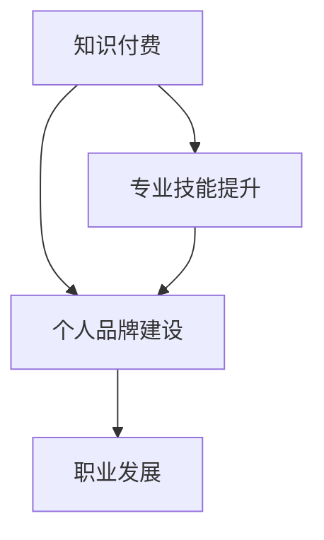

                 

关键词：知识付费、程序员、个人品牌、职业发展、技术传承

> 摘要：本文旨在探讨知识付费在现代程序员职业发展中的作用，以及如何通过个人品牌建设提升个人竞争力。文章将分析知识付费的现状，阐述个人品牌的重要性，并给出一系列策略和实例，以帮助程序员在日益激烈的技术市场中脱颖而出。

## 1. 背景介绍

在信息爆炸的时代，知识的获取方式发生了翻天覆地的变化。传统的学习途径逐渐被网络课程、专业论坛、技术博客等新兴的知识付费平台所取代。这些平台为程序员提供了丰富且高效的学习资源，同时也为知识创造者提供了变现的机会。然而，随着知识的快速迭代，程序员如何保持竞争力，如何将自己的知识转化为实际价值，成为了一个值得探讨的问题。

### 1.1 知识付费的兴起

知识付费是一种通过付费获取知识和服务的商业模式。它打破了传统教育资源的垄断，让更多人能够便捷地学习到高质量的内容。从线上教育平台，如 Coursera、Udemy，到专业论坛，如 Stack Overflow、GitHub，再到一些垂直领域的知识付费平台，如极客时间、InfoQ，知识付费已经成为程序员学习和成长的重要途径。

### 1.2 个人品牌的重要性

个人品牌是指个人在职场和社会中的形象、声誉和影响力。在技术领域，个人品牌不仅能够提升个人的职业地位，还能为个人带来更多的机会和资源。随着知识付费的普及，程序员个人品牌的重要性愈发凸显。一个强大的个人品牌能够帮助程序员在求职、升职、技术合作等方面获得优势。

## 2. 核心概念与联系

### 2.1 知识付费与个人品牌的联系

知识付费和个人品牌之间存在着密切的联系。知识付费是个人品牌建设的基石，通过不断学习和掌握前沿技术，程序员可以提升自己的专业能力，从而增强个人品牌的影响力。同时，个人品牌也能够为知识付费提供更大的价值，使程序员的知识和经验得到更广泛的传播和应用。

### 2.2 个人品牌建设与职业发展的联系

个人品牌建设对于程序员的职业发展至关重要。一个强大的个人品牌能够帮助程序员在职场中脱颖而出，获得更多的职业机会。同时，个人品牌还能够提升程序员的谈判力和议价能力，使其在升职加薪方面具备更大的优势。

### 2.3 Mermaid 流程图



## 3. 核心算法原理 & 具体操作步骤

### 3.1 算法原理概述

个人品牌建设可以看作是一种“算法”，其核心原理是通过持续的学习、实践和传播，打造一个具有吸引力和影响力的个人形象。具体步骤包括：

1. 确定个人定位和目标
2. 学习和掌握前沿技术
3. 实践和积累项目经验
4. 建立个人品牌渠道
5. 维护和提升个人形象

### 3.2 算法步骤详解

#### 3.2.1 确定个人定位和目标

在开始个人品牌建设之前，程序员需要明确自己的定位和目标。这包括了解自己的兴趣和擅长领域，以及未来想要达到的职业高度。明确的目标能够为个人品牌建设提供方向和动力。

#### 3.2.2 学习和掌握前沿技术

个人品牌建设的关键在于持续学习和掌握前沿技术。程序员可以通过参加线上课程、阅读技术书籍、关注技术博客等方式，不断提升自己的技术水平。同时，还要关注行业动态，了解新技术和新趋势。

#### 3.2.3 实践和积累项目经验

理论知识是基础，但实践是检验真理的唯一标准。程序员需要通过实际项目来验证和巩固自己的技术水平。参与开源项目、完成商业项目或个人项目，都是积累经验的有效途径。

#### 3.2.4 建立个人品牌渠道

个人品牌建设需要借助各种渠道来传播。程序员可以创建个人博客、开设技术公众号、参与技术社区、发表技术文章等，从而建立自己的个人品牌渠道。这些渠道能够帮助程序员扩大影响力，吸引更多关注者。

#### 3.2.5 维护和提升个人形象

个人品牌建设不是一蹴而就的，需要长期维护和提升。程序员需要保持专业素养，积极与同行交流，分享技术心得，参加技术会议，提升自己在行业内的知名度。同时，还要注意个人形象的维护，避免因为个人行为不当而损害个人品牌。

### 3.3 算法优缺点

#### 优点

- 提升个人竞争力
- 扩大职业机会
- 增加收入来源
- 提高社会影响力

#### 缺点

- 需要持续投入时间和精力
- 面临市场竞争压力
- 可能会遇到挫折和失败

### 3.4 算法应用领域

个人品牌建设算法适用于所有技术领域的程序员，无论是在软件开发、数据分析、人工智能，还是在其他技术领域，个人品牌建设都能为程序员带来显著的优势。

## 4. 数学模型和公式 & 详细讲解 & 举例说明

### 4.1 数学模型构建

个人品牌建设的数学模型可以看作是一个非线性优化问题，其目标是最小化个人品牌的建设成本，最大化个人品牌的市场价值。具体公式如下：

$$
\min_{x} C(x) \\
s.t. V(x) \geq V_0
$$

其中，$C(x)$ 表示个人品牌建设的成本，$V(x)$ 表示个人品牌的市场价值，$V_0$ 表示初始市场价值。

### 4.2 公式推导过程

个人品牌建设的成本可以分为三个部分：学习成本、实践成本和传播成本。具体推导过程如下：

$$
C(x) = C_{\text{学习}}(x) + C_{\text{实践}}(x) + C_{\text{传播}}(x)
$$

其中，$C_{\text{学习}}(x)$ 表示学习成本，与学习时间成正比；$C_{\text{实践}}(x)$ 表示实践成本，与项目数量成正比；$C_{\text{传播}}(x)$ 表示传播成本，与传播渠道的数量和活跃度成正比。

个人品牌的市场价值可以分为两部分：技术价值和影响力价值。具体推导过程如下：

$$
V(x) = V_{\text{技术}}(x) + V_{\text{影响力}}(x)
$$

其中，$V_{\text{技术}}(x)$ 表示技术价值，与个人技术水平成正比；$V_{\text{影响力}}(x)$ 表示影响力价值，与个人品牌的知名度成正比。

### 4.3 案例分析与讲解

假设程序员 A 和程序员 B 都在努力建设个人品牌，他们的学习成本、实践成本和传播成本分别为 $C_A$、$C_B$；他们的技术价值、影响力价值分别为 $V_{\text{技术},A}$、$V_{\text{技术},B}$、$V_{\text{影响力},A}$、$V_{\text{影响力},B}$。根据上述数学模型，我们可以得到以下结论：

- 如果 $C_A < C_B$ 且 $V_{\text{技术},A} > V_{\text{技术},B}$，则程序员 A 的个人品牌建设效果优于程序员 B。
- 如果 $C_A < C_B$ 且 $V_{\text{影响力},A} > V_{\text{影响力},B}$，则程序员 A 的个人品牌建设效果仍优于程序员 B。
- 如果 $C_A > C_B$，则无论 $V_{\text{技术}}$ 和 $V_{\text{影响力}}$ 的大小如何，程序员 B 的个人品牌建设效果都会优于程序员 A。

这个例子表明，个人品牌建设不仅仅是技术能力的比拼，还包括成本控制和影响力价值的考量。

## 5. 项目实践：代码实例和详细解释说明

### 5.1 开发环境搭建

为了更好地展示个人品牌建设的实践过程，我们以搭建一个个人博客为例。搭建个人博客需要以下开发环境和工具：

- 代码编辑器（如 Visual Studio Code）
- 服务器（如 AWS、阿里云）
- 域名注册（如 Namecheap）
- 博客框架（如 Hexo、Hugo）

### 5.2 源代码详细实现

以下是使用 Hexo 搭建个人博客的源代码实现：

```bash
# 安装 Node.js
npm install -g node.js

# 安装 Hexo
npm install -g hexo

# 创建博客目录
mkdir my_blog

# 初始化博客
cd my_blog
hexo init

# 安装 Hexo 主题
cd themes
git clone https://github.com/sun11/hexo-theme-matery.git

# 配置博客配置文件
cd ..
vi _config.yml

# 修改博客配置
title: My Blog
theme: matery
```

### 5.3 代码解读与分析

上述代码实现了一个基本的个人博客，主要包括以下步骤：

1. 安装 Node.js 和 Hexo。
2. 创建博客目录并初始化博客。
3. 安装并配置 Hexo 主题。
4. 修改博客配置文件，设置博客的基本信息。

通过这个简单的实例，我们可以看到搭建个人博客的整个过程。这只是一个开始，后续还需要不断优化博客内容、优化搜索引擎排名等，以提升个人品牌的知名度。

### 5.4 运行结果展示

运行以下命令，生成静态网页并部署到服务器：

```bash
hexo generate
hexo deploy
```

运行结果展示了一个具有自定义主题的个人博客。通过这个博客，程序员可以分享技术心得、发布博客文章，从而提升个人品牌的影响力。

## 6. 实际应用场景

### 6.1 求职场景

在求职过程中，一个强大的个人品牌能够帮助程序员在简历筛选阶段脱颖而出。通过个人博客、GitHub 等，求职者可以展示自己的技术实力、项目经验和学习成果，从而提高求职成功率。

### 6.2 升职场景

在职场中，一个强大的个人品牌能够为程序员带来更多的升职机会。通过在技术社区活跃、发表高质量的技术文章、参与开源项目等方式，程序员可以提升自己的知名度和影响力，从而获得更多的职业机会。

### 6.3 技术合作场景

在技术合作场景中，一个强大的个人品牌能够帮助程序员吸引更多的合作伙伴。通过展示个人技术实力和项目经验，程序员可以更容易地获得技术合作机会，从而实现共同成长。

## 7. 未来应用展望

随着知识付费的持续发展和个人品牌的不断强化，程序员在职业发展中的竞争力将得到显著提升。未来，知识付费和个人品牌建设将进一步融合，形成一种新的职业发展模式。同时，随着人工智能、大数据等技术的发展，个人品牌建设也将变得更加智能和高效。然而，面对市场竞争和知识更新速度的加快，程序员需要不断学习、创新和适应，以应对未来的挑战。

## 8. 工具和资源推荐

### 8.1 学习资源推荐

- Coursera：提供丰富的在线课程，涵盖计算机科学、数据科学、人工智能等多个领域。
- Udemy：提供各类技术课程，包括编程语言、框架和工具等。
- 慕课网（imooc）：提供国内优质的技术课程，适合不同层次的学习者。

### 8.2 开发工具推荐

- Visual Studio Code：一款功能强大的代码编辑器，支持多种编程语言。
- Git：版本控制工具，用于代码管理和协作。
- GitHub：代码托管平台，提供开源项目和协作工具。

### 8.3 相关论文推荐

- "The Nature of Code"：探索编程中的数学和物理概念。
- "Artificial Intelligence: A Modern Approach"：人工智能领域的经典教材。
- "Building Microservices"：关于微服务架构的实践指南。

## 9. 总结：未来发展趋势与挑战

### 9.1 研究成果总结

本文通过对知识付费和个人品牌建设的探讨，揭示了其在程序员职业发展中的重要作用。研究表明，通过知识付费和个人品牌建设，程序员可以显著提升自身竞争力，扩大职业机会，增加收入来源。

### 9.2 未来发展趋势

随着知识付费的持续发展和个人品牌的不断强化，程序员在职业发展中的竞争力将得到显著提升。未来，知识付费和个人品牌建设将进一步融合，形成一种新的职业发展模式。同时，随着人工智能、大数据等技术的发展，个人品牌建设也将变得更加智能和高效。

### 9.3 面临的挑战

面对市场竞争和知识更新速度的加快，程序员需要不断学习、创新和适应，以应对未来的挑战。此外，如何在海量信息中筛选高质量的知识资源，也是程序员需要解决的问题。

### 9.4 研究展望

未来研究可以进一步探讨知识付费和个人品牌建设在不同技术领域中的应用，以及如何通过技术创新提升个人品牌建设的效率和效果。同时，还可以研究个人品牌建设对程序员心理健康和社会影响力的影响。

## 10. 附录：常见问题与解答

### 10.1 问题1：知识付费是否值得投入？

解答：知识付费是一种投资，其回报取决于个人的投入程度和努力程度。对于有明确职业规划和学习目标的程序员来说，知识付费是值得投入的。

### 10.2 问题2：个人品牌建设需要多长时间才能见效？

解答：个人品牌建设的效果因人而异，一般需要半年到一年左右的时间才能初步见效。但需要注意的是，个人品牌建设是一个长期的过程，需要持续投入时间和精力。

### 10.3 问题3：如何避免个人品牌建设过程中的误区？

解答：在个人品牌建设过程中，程序员应避免以下误区：

- 过分追求速度和效果，忽视长期积累。
- 盲目跟随热点，忽略个人兴趣和优势。
- 忽视个人形象和声誉，过分强调技术实力。

通过避免这些误区，程序员可以更有效地进行个人品牌建设。

### 10.4 问题4：个人品牌建设是否适用于所有程序员？

解答：个人品牌建设适用于所有程序员，不论技术领域、职业阶段或个人背景。一个强大的个人品牌能够为程序员带来更多的职业机会和资源。

## 11. 结束语

知识付费和个人品牌建设是程序员职业发展的重要途径。通过不断学习和积累，程序员可以提升自身竞争力，实现职业价值的最大化。希望本文能为广大程序员提供一些有益的启示和指导。

### 12. 作者署名

作者：禅与计算机程序设计艺术 / Zen and the Art of Computer Programming

----------------------------------------------------------------
以上内容为根据您提供的指示和要求撰写的文章。如果您有任何修改意见或需要进一步细化某个部分，请随时告知。再次感谢您对本文的信任和支持！<|user|>

