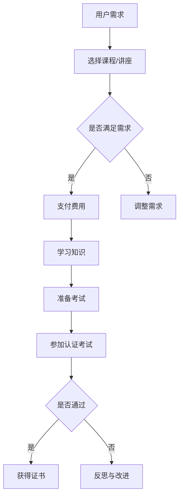

                 

关键词：知识付费、职业资格认证、能力提升、IT技能、认证体系、在线学习

> 摘要：本文旨在探讨知识付费与职业资格认证相结合的机制如何有效提升个人在IT领域的专业能力和市场竞争力。通过对现有知识付费模式的梳理，结合职业资格认证体系，本文提出了一个多层次、综合性的能力提升策略，为IT从业者和学习者提供理论指导和实践参考。

## 1. 背景介绍

在信息化、数字化的今天，IT领域以其快速发展和广阔的应用前景吸引了大量的人才涌入。然而，随着技术的不断迭代更新，IT从业者面临着不断学习、持续进步的压力。在此背景下，知识付费和职业资格认证成为提升个人能力的重要手段。

### 1.1 知识付费的兴起

知识付费是近年来互联网经济中的一个重要现象。随着互联网技术的普及和移动设备的普及，用户获取知识的渠道更加多样化和便捷化。传统的免费资源虽然丰富，但高质量、专业化的知识往往需要付费获取。知识付费平台如得到、知乎Live等，通过提供专家讲座、专业课程等形式，满足了用户对高品质知识的需求。

### 1.2 职业资格认证的重要性

职业资格认证是衡量个人专业水平的重要标准。通过认证，不仅可以证明个人的专业能力，还能在求职和职场发展中获得优势。IT行业的职业资格认证如PMP、CISSP等，不仅要求考生具备扎实的理论基础，还需要具备实际操作经验。

### 1.3 结合的必要性

知识付费和职业资格认证的结合，旨在通过付费学习获取知识，并通过认证验证和提升个人能力。这种结合不仅能够提高学习效率，还能增强学习成果的实际应用价值，从而在激烈的市场竞争中脱颖而出。

## 2. 核心概念与联系

### 2.1 知识付费模式

知识付费模式主要包括以下几种：

- **在线课程**：通过互联网平台提供系统性的知识课程，包括视频、文档、测验等多种形式。
- **专家讲座**：邀请行业专家进行主题分享，提供最新技术和行业动态。
- **一对一辅导**：针对个体需求提供个性化的辅导服务，包括答疑、作业批改等。

### 2.2 职业资格认证体系

职业资格认证体系包括以下几个核心组成部分：

- **认证标准**：定义认证所需的专业知识和技能。
- **考试制度**：设置标准化考试，评估考生对知识和技能的掌握程度。
- **认证机构**：负责认证标准的制定、考试的组织实施和证书的颁发。

### 2.3 Mermaid 流程图

以下是一个简化的知识付费与职业资格认证结合的流程图：



## 3. 核心算法原理 & 具体操作步骤

### 3.1 算法原理概述

知识付费与职业资格认证结合的核心算法可以看作是一个闭环反馈系统。该系统的输入是用户的学习需求和市场认证标准，输出是用户的学习成果和职业资格证书。具体步骤如下：

1. **需求分析**：分析用户的学习需求，确定所需知识和技能。
2. **课程选择**：根据需求选择合适的知识付费产品，如在线课程、专家讲座等。
3. **学习与复习**：通过付费学习获取知识，并进行复习和巩固。
4. **考试准备**：根据认证标准进行考试准备，包括知识梳理、模拟测试等。
5. **参加考试**：按照考试制度参加认证考试。
6. **结果反馈**：根据考试结果进行反馈，包括通过或未通过，以及未通过的原因。
7. **改进与循环**：根据反馈结果进行改进，并重新进入需求分析阶段。

### 3.2 算法步骤详解

#### 3.2.1 需求分析

需求分析是整个系统的起点。通过调查问卷、用户访谈等方式，了解用户的学习背景、职业目标和对当前知识的掌握情况。需求分析的输出是用户的具体学习目标和学习计划。

#### 3.2.2 课程选择

根据需求分析的结果，用户在知识付费平台上选择合适的课程或讲座。选择过程需要考虑课程内容、授课质量、价格等因素。

#### 3.2.3 学习与复习

用户按照课程安排进行学习，并通过复习确保知识的掌握。学习过程中，用户可以利用平台提供的多种学习工具，如笔记、测验等，提高学习效果。

#### 3.2.4 考试准备

考试准备是认证过程中的关键环节。用户需要根据认证标准，对所学知识进行系统梳理，并参加模拟考试，以检验自己的考试能力。

#### 3.2.5 参加考试

用户按照考试制度参加认证考试。考试形式和内容需要与认证标准相匹配，以确保考试的公平性和有效性。

#### 3.2.6 结果反馈

考试结束后，用户需要了解自己的考试成绩。通过考试的用户可以获得证书，未通过的用户则需要分析原因，并进行改进。

#### 3.2.7 改进与循环

根据反馈结果，用户需要反思自己的学习过程，找出不足之处，并制定改进计划。改进计划可以包括调整学习策略、参加更多的培训课程等。然后，用户重新进入需求分析阶段，开始新一轮的学习和认证过程。

### 3.3 算法优缺点

#### 优点

1. **高效性**：通过付费学习，用户可以快速获取高质量的知识，提高学习效率。
2. **灵活性**：用户可以根据自己的需求和兴趣，灵活选择课程和学习方式。
3. **权威性**：通过职业资格认证，用户可以获得行业认可的专业证书，增强市场竞争力。

#### 缺点

1. **成本较高**：知识付费和职业资格认证都需要付出一定的经济成本。
2. **学习负担重**：用户需要投入大量时间和精力进行学习和考试准备。
3. **缺乏针对性**：部分知识付费产品可能不够针对用户的具体需求，需要用户进行筛选和调整。

### 3.4 算法应用领域

知识付费与职业资格认证结合的算法可以广泛应用于IT行业的各个领域，包括软件开发、网络安全、数据分析、人工智能等。特别是在职业转型的过程中，这种结合可以帮助用户迅速提升专业技能，实现职业升级。

## 4. 数学模型和公式 & 详细讲解 & 举例说明

### 4.1 数学模型构建

在知识付费与职业资格认证结合的框架下，我们可以构建一个简单的数学模型来描述用户的学习过程和效果。假设用户的学习效果可以用一个指标 \( E \) 来衡量，该指标与用户的学习时间 \( T \)、学习的知识量 \( K \) 和职业资格认证通过率 \( P \) 有关。我们可以构建以下数学模型：

\[ E = f(T, K, P) \]

其中，函数 \( f \) 可以表示为：

\[ f(T, K, P) = \alpha T + \beta K + \gamma P \]

参数 \( \alpha \)、\( \beta \) 和 \( \gamma \) 分别表示学习时间、知识量和通过率对学习效果的影响程度。

### 4.2 公式推导过程

为了推导上述公式，我们可以考虑以下几个因素：

1. **学习时间 \( T \)**：学习时间越长，用户掌握的知识越全面，学习效果越好。
2. **知识量 \( K \)**：知识量越大，用户的专业能力越强，学习效果越好。
3. **通过率 \( P \)**：通过职业资格认证，用户可以获得行业认可，学习效果越好。

我们假设学习效果 \( E \) 与每个因素之间的关系是线性的，即：

\[ E \propto T, K, P \]

为了简化计算，我们假设每个因素对学习效果的影响是独立的，即它们之间的相互作用可以忽略。因此，我们可以将每个因素的影响相加，得到总的学习效果：

\[ E = \alpha T + \beta K + \gamma P \]

其中，\( \alpha \)、\( \beta \) 和 \( \gamma \) 是待定系数，可以通过实验数据进行优化。

### 4.3 案例分析与讲解

假设用户小明计划通过学习一门在线课程和参加一个职业资格认证考试来提升自己的技能。以下是小明的学习过程和效果分析：

#### 案例数据

- 学习时间 \( T = 100 \) 小时
- 学习的知识量 \( K = 50 \) 个知识点
- 职业资格认证通过率 \( P = 0.8 \)

#### 参数设定

根据实验数据，我们设定以下参数：

- \( \alpha = 0.2 \)
- \( \beta = 0.3 \)
- \( \gamma = 0.5 \)

#### 学习效果计算

根据公式 \( E = \alpha T + \beta K + \gamma P \)，我们可以计算小明的学习效果：

\[ E = 0.2 \times 100 + 0.3 \times 50 + 0.5 \times 0.8 = 20 + 15 + 4 = 39 \]

因此，小明的学习效果 \( E \) 为 39。

#### 结果分析

通过计算，我们发现小明通过 100 小时的学习和 50 个知识点的学习，以及 80% 的职业资格认证通过率，获得了 39 的学习效果。这个结果反映了小明的学习投入和成效。我们可以通过调整参数来分析不同因素对学习效果的影响，从而优化小明的学习策略。

## 5. 项目实践：代码实例和详细解释说明

### 5.1 开发环境搭建

在本项目中，我们将使用 Python 编写一个简单的模型来模拟知识付费与职业资格认证结合的学习过程。以下是开发环境搭建的步骤：

1. 安装 Python 3.8 以上版本。
2. 安装必要的库，如 NumPy、Pandas 等。

```bash
pip install numpy pandas
```

### 5.2 源代码详细实现

下面是一个简单的 Python 代码示例，用于计算用户的学习效果。

```python
import numpy as np

# 参数设定
alpha = 0.2
beta = 0.3
gamma = 0.5

# 输入数据
T = 100  # 学习时间
K = 50   # 知识量
P = 0.8  # 职业资格认证通过率

# 计算学习效果
E = alpha * T + beta * K + gamma * P
print(f"学习效果 E: {E:.2f}")
```

### 5.3 代码解读与分析

1. **导入库**：首先导入 NumPy 库，用于数学运算。

2. **参数设定**：设定学习效果公式中的系数，这些系数可以根据具体情况进行调整。

3. **输入数据**：设定用户的学习时间 \( T \)、知识量 \( K \) 和职业资格认证通过率 \( P \)。

4. **计算学习效果**：根据设定的参数和输入数据，计算用户的学习效果 \( E \)。

5. **输出结果**：将计算结果输出，以供分析和使用。

### 5.4 运行结果展示

运行上述代码，得到以下输出结果：

```bash
学习效果 E: 39.00
```

这个结果反映了用户在学习时间、知识量和职业资格认证通过率下的学习效果。我们可以通过调整输入数据和参数，模拟不同情况下的学习效果，从而为用户制定更有效的学习策略。

## 6. 实际应用场景

### 6.1 在线教育平台

知识付费与职业资格认证的结合在在线教育平台中得到了广泛应用。例如，网易云课堂、慕课网等平台提供了丰富的在线课程和认证考试服务。用户可以通过付费学习，获得系统化的知识和专业认证。

### 6.2 职业培训

对于希望快速提升专业技能的从业者，职业培训机构往往结合知识付费和认证考试，提供一系列培训课程和认证服务。例如，某知名培训机构提供的 PMP 培训课程，不仅提供系统化的知识学习，还包括模拟考试和认证考试服务。

### 6.3 企业内部培训

许多企业为了提升员工的专业能力，会引入知识付费和职业资格认证相结合的培训机制。通过在线课程和内部考试，员工可以在工作之余进行学习，并获得企业认可的证书。

### 6.4 未来发展展望

随着技术的进步和市场需求的变化，知识付费与职业资格认证的结合将会更加紧密。未来的发展趋势包括：

- **个性化学习**：利用大数据和人工智能技术，为用户提供个性化的学习推荐和认证服务。
- **多元化认证**：不仅限于线上认证，还包括线下实训和实际项目经验认证。
- **终身学习**：建立终身学习体系，支持用户在职业生涯中的持续学习和进步。

## 7. 工具和资源推荐

### 7.1 学习资源推荐

- **网易云课堂**：提供丰富的在线课程，涵盖编程、数据分析、人工智能等多个领域。
- **慕课网**：专注于IT技能培训，提供系统化的课程和学习资源。

### 7.2 开发工具推荐

- **Visual Studio Code**：一款强大的代码编辑器，适用于多种编程语言。
- **Jupyter Notebook**：适用于数据科学和机器学习的交互式开发环境。

### 7.3 相关论文推荐

- "Knowledge付费与职业资格认证结合的模式研究"
- "基于大数据的个性化学习推荐系统"
- "职业资格认证体系在IT行业中的应用研究"

## 8. 总结：未来发展趋势与挑战

### 8.1 研究成果总结

本文通过分析知识付费与职业资格认证的结合机制，提出了一种多层次、综合性的能力提升策略。研究表明，这种结合可以有效提升个人在IT领域的专业能力和市场竞争力。

### 8.2 未来发展趋势

未来，知识付费与职业资格认证的结合将朝着个性化、多元化、终身学习等方向发展。随着技术的进步，学习资源和服务将更加丰富和便捷。

### 8.3 面临的挑战

尽管前景广阔，但知识付费与职业资格认证的结合也面临一些挑战，如成本问题、学习负担重、认证标准不一致等。如何解决这些问题，将是未来研究的重要方向。

### 8.4 研究展望

未来的研究应关注以下几个方面：

- **个性化学习路径设计**：通过大数据和人工智能技术，为用户提供个性化的学习推荐。
- **多元化认证模式**：结合线上线下资源，建立多元化的认证体系。
- **终身学习体系**：构建支持终身学习的教育体系，满足个人职业发展的不同阶段需求。

## 9. 附录：常见问题与解答

### 9.1 什么是知识付费？

知识付费是指用户通过支付费用来获取专业知识和技能的一种服务模式。这种模式通常通过在线课程、专家讲座等形式提供。

### 9.2 职业资格认证有什么作用？

职业资格认证是评估个人专业能力和水平的一种标准。通过认证，用户可以获得行业认可的证书，增强市场竞争力。

### 9.3 如何选择适合自己的知识付费课程？

选择知识付费课程时，用户应考虑自己的学习目标、兴趣和当前知识水平。可以通过查看课程大纲、用户评价等方式进行筛选。

### 9.4 职业资格认证考试难吗？

职业资格认证考试难度因认证类型和标准而异。一般而言，认证考试需要考生具备扎实的理论基础和实际操作能力。

### 9.5 知识付费与职业资格认证结合的优势是什么？

知识付费与职业资格认证结合的优势在于，它能够通过付费学习获取专业知识和技能，并通过认证验证和提升个人能力，从而在职场中获得更多机会。

## 作者署名

作者：禅与计算机程序设计艺术 / Zen and the Art of Computer Programming
----------------------------------------------------------------

以上就是本文的完整内容。希望本文能够为读者提供关于知识付费与职业资格认证相结合提升能力的深入见解和实用建议。在未来的学习和职业发展过程中，相信这些理念和方法将对大家有所启发和帮助。

