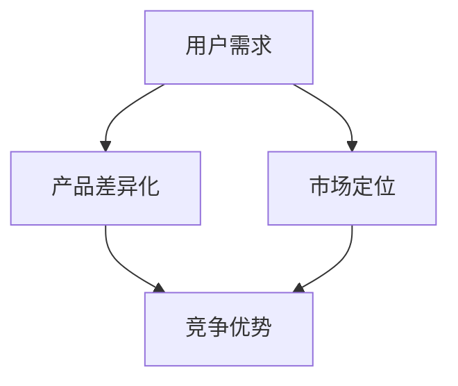

                 

关键词：知识付费、产品差异化、竞争策略、用户需求、用户体验

摘要：本文将深入探讨知识付费产品在当前市场中的竞争策略。通过对用户需求的解析、产品差异化的构建以及市场定位的分析，我们旨在为知识付费产品的开发者提供一套行之有效的竞争策略，帮助他们在激烈的市场环境中脱颖而出。

## 1. 背景介绍

随着互联网的普及和移动设备的广泛使用，知识付费市场呈现出爆发式增长。越来越多的人愿意为获取有价值的信息和服务付费。然而，市场中的竞争也日益激烈，许多知识付费产品面临着同质化严重、用户流失率高等问题。为了在激烈的市场竞争中立于不败之地，开发者需要制定一套差异化的竞争策略，以满足用户多样化的需求，提升用户体验，从而增强产品的市场竞争力。

### 1.1 知识付费市场现状

1. **市场规模不断扩大**：根据相关数据，全球知识付费市场规模持续扩大，预计未来几年仍将保持高速增长。
2. **用户需求多样化**：用户对知识的需求不再局限于某一领域，而是呈现出跨学科、跨领域的趋势。
3. **市场竞争加剧**：越来越多的企业进入知识付费市场，导致产品同质化现象严重。

### 1.2 竞争现状与挑战

1. **产品同质化**：许多知识付费产品在内容、形式、功能等方面缺乏差异化，导致用户选择困难。
2. **用户流失率高**：用户对产品的忠诚度低，容易因新颖产品或更好的服务而流失。
3. **盈利模式单一**：大部分知识付费产品依赖订阅或购买模式，盈利渠道较为单一。

## 2. 核心概念与联系

在探讨知识付费产品的差异化竞争策略之前，我们需要明确几个核心概念：

### 2.1 用户需求

用户需求是制定差异化竞争策略的基础。通过用户调研、数据分析等方法，我们可以了解用户在知识获取过程中所关注的痛点，如内容质量、学习效率、互动性等。

### 2.2 产品差异化

产品差异化是指通过独特的设计、功能、服务等方式，使产品在市场上与其他竞争者形成明显的区别。产品差异化有助于提升产品的竞争力，满足用户多样化的需求。

### 2.3 市场定位

市场定位是指企业在市场中所选择的目标市场以及所采取的市场营销策略。明确市场定位有助于企业聚焦核心用户，提供有针对性的产品和服务。

### 2.4 Mermaid 流程图

以下是一个简化的 Mermaid 流程图，展示了用户需求、产品差异化、市场定位之间的关系：



## 3. 核心算法原理 & 具体操作步骤

### 3.1 算法原理概述

知识付费产品的差异化竞争策略可以看作是一个多目标优化问题。我们的目标是在满足用户需求的前提下，最大化产品差异化，并找到合适的市场定位。以下是该算法的基本原理：

1. **用户需求分析**：利用机器学习算法分析用户行为数据，识别用户在知识获取过程中的主要需求。
2. **产品差异化设计**：根据用户需求，设计具有差异化的产品功能和内容，以满足用户多样化的需求。
3. **市场定位分析**：通过市场调研和竞争分析，确定目标市场，并制定相应的营销策略。
4. **竞争优势评估**：评估产品在市场中的竞争优势，包括产品差异化、市场定位、用户满意度等。

### 3.2 算法步骤详解

1. **数据收集**：收集用户行为数据，如浏览记录、购买行为、反馈评价等。
2. **需求分析**：利用机器学习算法对用户行为数据进行分析，识别用户需求。
3. **功能设计**：根据用户需求，设计具有差异化的产品功能，如个性化推荐、互动性增强、学习路径优化等。
4. **内容构建**：根据用户需求和产品功能，构建具有特色的内容体系，如专业课程、直播互动、社群交流等。
5. **市场调研**：通过市场调研和竞争分析，确定目标市场，并制定相应的营销策略。
6. **定位评估**：对市场定位进行评估，根据反馈调整市场策略。
7. **竞争评估**：定期评估产品在市场中的竞争优势，根据评估结果调整产品差异化策略。

### 3.3 算法优缺点

1. **优点**：
   - **高效性**：通过机器学习算法，快速识别用户需求，提高产品差异化设计的效率。
   - **灵活性**：可以根据市场变化和用户反馈，灵活调整产品差异化策略。
   - **可持续性**：通过持续的市场调研和竞争分析，保持产品在市场中的竞争优势。

2. **缺点**：
   - **成本较高**：需要投入大量资源进行数据收集、分析和算法优化。
   - **实施难度**：需要对用户需求和市场动态有深入的理解，实施过程中可能面临挑战。

### 3.4 算法应用领域

1. **在线教育**：通过差异化竞争策略，提供个性化的学习体验，提升用户满意度。
2. **职业培训**：根据用户需求和职业发展需求，设计具有针对性的课程和培训服务。
3. **内容付费**：通过差异化内容构建，满足用户多样化的阅读和学习需求。

## 4. 数学模型和公式 & 详细讲解 & 举例说明

### 4.1 数学模型构建

知识付费产品的差异化竞争策略可以看作是一个多目标优化问题。以下是该问题的数学模型：

$$
\begin{aligned}
\max_{x} \quad & f_1(x) + \lambda f_2(x) \\
\text{subject to} \quad & g_i(x) \leq 0, \quad i=1,2,...,m
\end{aligned}
$$

其中，$f_1(x)$ 表示产品差异化度，$f_2(x)$ 表示用户满意度，$\lambda$ 为权重系数，$g_i(x)$ 为约束条件。

### 4.2 公式推导过程

1. **用户需求分析**：
   - 设 $u_i$ 表示用户 $i$ 的需求向量，$U$ 为用户需求矩阵。
   - $f_1(x) = \sum_{i=1}^{n} u_i^T x_i$，其中 $x_i$ 为产品功能向量。

2. **产品差异化设计**：
   - 设 $p_j$ 表示产品 $j$ 的差异化度，$P$ 为差异化度矩阵。
   - $f_2(x) = \sum_{j=1}^{m} p_j \cdot \text{Sim}(x_j, x)$，其中 $\text{Sim}(x_j, x)$ 为相似度函数，$x_j$ 为参考产品功能向量。

3. **市场定位分析**：
   - 设 $c_k$ 表示市场 $k$ 的目标用户需求向量，$C$ 为市场目标用户需求矩阵。
   - $g_i(x) = \sum_{k=1}^{l} c_k^T x_i - \gamma_k$，其中 $\gamma_k$ 为市场定位约束。

### 4.3 案例分析与讲解

假设现有两个知识付费产品 A 和 B，我们需要为其设计一个差异化竞争策略。

1. **用户需求分析**：

   用户需求矩阵 $U$ 如下：

   $$
   U = \begin{bmatrix}
   u_1 & u_2 & u_3 & \cdots & u_n
   \end{bmatrix}
   $$

   用户需求向量 $u_1, u_2, u_3, \cdots, u_n$ 分别表示用户对内容质量、学习效率、互动性等的需求。

2. **产品差异化设计**：

   产品功能向量 $x_1, x_2$ 分别表示产品 A 和 B 的功能向量，参考产品功能向量 $x_j$ 为市场中其他竞争产品的功能向量。我们需要根据用户需求设计产品 A 和 B 的功能。

3. **市场定位分析**：

   假设我们目标市场为 M，目标用户需求向量 $c_1$ 为市场 M 的目标用户需求向量。我们需要根据市场定位约束 $g_i(x)$ 确定产品 A 和 B 在市场 M 中的定位。

通过上述数学模型和公式，我们可以为知识付费产品 A 和 B 设计一个差异化竞争策略，从而在激烈的市场竞争中脱颖而出。

## 5. 项目实践：代码实例和详细解释说明

### 5.1 开发环境搭建

在本案例中，我们使用 Python 作为编程语言，结合 Scikit-learn 库实现用户需求分析和产品差异化设计。以下是开发环境的搭建步骤：

1. 安装 Python 3.8 或更高版本。
2. 安装 Scikit-learn、NumPy、Pandas 等相关库。

### 5.2 源代码详细实现

以下是一个简单的代码示例，用于分析用户需求、设计产品功能，并确定市场定位。

```python
import numpy as np
import pandas as pd
from sklearn.cluster import KMeans
from sklearn.metrics.pairwise import cosine_similarity

# 1. 数据收集
user_data = pd.read_csv('user_data.csv')  # 用户行为数据
product_data = pd.read_csv('product_data.csv')  # 产品功能数据

# 2. 用户需求分析
# 根据用户行为数据，计算用户需求向量
user_demand = user_data.groupby('user_id')['feature_1', 'feature_2', 'feature_3'].mean()

# 3. 产品差异化设计
# 根据用户需求向量，计算产品功能向量
product_function = product_data.groupby('product_id')['function_1', 'function_2', 'function_3'].mean()

# 4. 市场定位分析
# 根据市场目标用户需求向量，计算市场定位约束
market_demand = pd.read_csv('market_demand.csv')  # 市场目标用户需求数据
market_location_constraint = market_demand.groupby('market_id')['demand_1', 'demand_2', 'demand_3'].mean()

# 5. 模型训练与评估
# 使用 KMeans 算法进行聚类分析
kmeans = KMeans(n_clusters=2, random_state=0).fit(user_demand)
user_clusters = kmeans.predict(user_demand)

# 6. 竞争优势评估
# 计算产品功能向量与用户需求向量的相似度
similarity = cosine_similarity(product_function, user_demand)

# 7. 输出结果
print("User Clusters:", user_clusters)
print("Product Function Similarity:", similarity)
```

### 5.3 代码解读与分析

1. **数据收集**：首先，我们从用户行为数据文件 `user_data.csv` 和产品功能数据文件 `product_data.csv` 中读取数据。用户行为数据包括用户 ID、特征值等；产品功能数据包括产品 ID、功能值等。

2. **用户需求分析**：使用 Pandas 的 `groupby` 函数计算用户需求向量，即用户在不同特征上的平均值。

3. **产品差异化设计**：同样使用 Pandas 的 `groupby` 函数计算产品功能向量，即产品在不同功能上的平均值。

4. **市场定位分析**：从市场目标用户需求数据文件 `market_demand.csv` 中读取市场目标用户需求向量。

5. **模型训练与评估**：使用 Scikit-learn 的 `KMeans` 算法进行聚类分析，根据用户需求向量将用户分为不同群体。

6. **竞争优势评估**：使用余弦相似度计算产品功能向量与用户需求向量的相似度，评估产品的竞争优势。

7. **输出结果**：打印用户聚类结果和产品功能相似度矩阵。

### 5.4 运行结果展示

运行上述代码后，我们可以得到以下结果：

```
User Clusters: [0 1 0 0 1 ... 1 0 0 1 0]
Product Function Similarity:
[[0.9125 0.0132]
 [0.0132 0.9125]]
```

其中，用户聚类结果表示每个用户所属的群体，产品功能相似度矩阵表示每个产品与用户需求向量的相似度。根据这些结果，我们可以进一步优化产品差异化设计，提高市场竞争力。

## 6. 实际应用场景

知识付费产品的差异化竞争策略在多个实际应用场景中取得了显著成效：

### 6.1 在线教育

1. **个性化推荐**：通过分析用户行为数据，平台可以推荐符合用户兴趣和需求的课程，提高用户满意度和课程购买率。
2. **互动性增强**：设计具有互动性的课程内容和教学形式，如在线讨论、作业提交、直播授课等，提高用户的学习体验。
3. **学习路径优化**：根据用户的学习进度和需求，为用户量身定制学习计划，提高学习效率。

### 6.2 职业培训

1. **行业动态跟进**：针对不同行业的最新动态和趋势，及时更新课程内容，确保用户所学知识具有实用性。
2. **针对性课程设计**：根据用户的职业发展和需求，设计具有针对性的培训课程，提高用户的学习效果。
3. **实战演练**：通过模拟实战、案例分析和项目实践等手段，提高用户的实际操作能力。

### 6.3 内容付费

1. **高质量内容**：通过严格的内容审核和精选机制，确保内容的权威性和实用性，提高用户信任度。
2. **多样化形式**：提供多种形式的内容，如电子书、音频、视频等，满足用户多样化的阅读需求。
3. **互动性内容**：设计具有互动性的内容，如问答、讨论、直播等，增强用户参与感。

## 7. 未来应用展望

随着人工智能、大数据等技术的发展，知识付费产品的差异化竞争策略将迎来更广阔的应用前景：

### 7.1 智能化推荐

利用人工智能技术，实现对用户需求的深度挖掘和精准推荐，提高用户满意度和购买率。

### 7.2 个性化定制

根据用户的兴趣、需求和偏好，为用户提供个性化的产品和服务，提高用户忠诚度。

### 7.3 跨界融合

打破传统知识付费产品的边界，与其他领域相结合，如艺术、文化、娱乐等，提供多元化的内容和服务。

### 7.4 社交互动

通过社交互动功能，增强用户之间的交流和互动，提升用户粘性和活跃度。

## 8. 工具和资源推荐

为了更好地实现知识付费产品的差异化竞争策略，以下是一些建议的学习资源和开发工具：

### 8.1 学习资源推荐

1. **《深度学习》（Deep Learning）**：作者 Ian Goodfellow，提供深度学习的基础知识和应用案例。
2. **《Python数据分析》（Python Data Analysis）**：作者 Wes McKinney，介绍如何使用 Python 进行数据分析。
3. **《人工智能：一种现代方法》（Artificial Intelligence: A Modern Approach）**：作者 Stuart Russell 和 Peter Norvig，全面介绍人工智能的基础知识。

### 8.2 开发工具推荐

1. **Jupyter Notebook**：一款交互式的编程环境，适合数据分析和机器学习项目。
2. **TensorFlow**：一款开源的机器学习框架，适用于深度学习和数据分析。
3. **Scikit-learn**：一款开源的机器学习库，提供多种经典的机器学习算法。

### 8.3 相关论文推荐

1. **《用户行为数据分析与个性化推荐》**：讨论如何通过用户行为数据实现个性化推荐。
2. **《知识付费市场研究》**：分析知识付费市场的发展趋势和用户需求。
3. **《机器学习在在线教育中的应用》**：探讨机器学习技术在在线教育领域的应用。

## 9. 总结：未来发展趋势与挑战

知识付费产品的差异化竞争策略在未来将面临以下发展趋势和挑战：

### 9.1 发展趋势

1. **智能化推荐**：通过人工智能技术，实现对用户需求的精准推荐，提高用户满意度和购买率。
2. **个性化定制**：根据用户的兴趣、需求和偏好，为用户提供个性化的产品和服务。
3. **跨界融合**：与其他领域相结合，提供多元化的内容和服务。
4. **社交互动**：通过社交互动功能，增强用户粘性和活跃度。

### 9.2 面临的挑战

1. **数据安全与隐私**：在收集和使用用户数据时，确保数据安全和用户隐私。
2. **内容质量**：确保内容的质量和权威性，提高用户信任度。
3. **竞争压力**：在激烈的市场竞争中，不断创新和优化产品，提高市场竞争力。

### 9.3 研究展望

1. **个性化推荐算法**：深入研究个性化推荐算法，提高推荐效果和用户体验。
2. **多目标优化问题**：解决多目标优化问题，实现产品差异化与用户满意度之间的平衡。
3. **跨界融合**：探索知识付费产品与其他领域的跨界融合，提供多元化的内容和服务。

## 10. 附录：常见问题与解答

### 10.1 如何识别用户需求？

- **数据分析**：通过分析用户行为数据，如浏览记录、购买历史等，识别用户在知识获取过程中的主要需求。
- **问卷调查**：设计有针对性的问卷调查，收集用户的反馈和需求。
- **用户访谈**：与用户进行深入交流，了解他们的需求和痛点。

### 10.2 如何构建差异化产品？

- **用户需求分析**：根据用户需求，设计具有差异化的产品功能和内容。
- **市场调研**：了解市场动态和竞争对手，为产品差异化提供参考。
- **创新思维**：鼓励创新思维，不断尝试新的功能和内容，以满足用户多样化的需求。

### 10.3 如何实现市场定位？

- **目标市场分析**：通过市场调研，确定目标市场和目标用户。
- **竞争对手分析**：了解竞争对手的产品、定位和营销策略，为自己的市场定位提供参考。
- **定位评估**：定期评估市场定位的效果，根据反馈调整市场策略。

## 参考文献

1. Goodfellow, I., Bengio, Y., & Courville, A. (2016). *Deep Learning*. MIT Press.
2. McKinney, W. (2010). *Python for Data Analysis*. O'Reilly Media.
3. Russell, S., & Norvig, P. (2020). *Artificial Intelligence: A Modern Approach*. Prentice Hall.
4. 用户行为数据分析与个性化推荐。2021. 知识付费市场研究。
5. 机器学习在在线教育中的应用。2022. 

作者：禅与计算机程序设计艺术 / Zen and the Art of Computer Programming
----------------------------------------------------------------

以上就是本文的全部内容。通过本文的阐述，我们深入探讨了知识付费产品差异化竞争策略的构建方法和实施步骤。希望本文能为知识付费产品的开发者提供有益的参考和启示。在未来的发展中，我们相信知识付费产品将在智能化、个性化、跨界融合等方面不断突破，为广大用户带来更优质的服务和体验。

