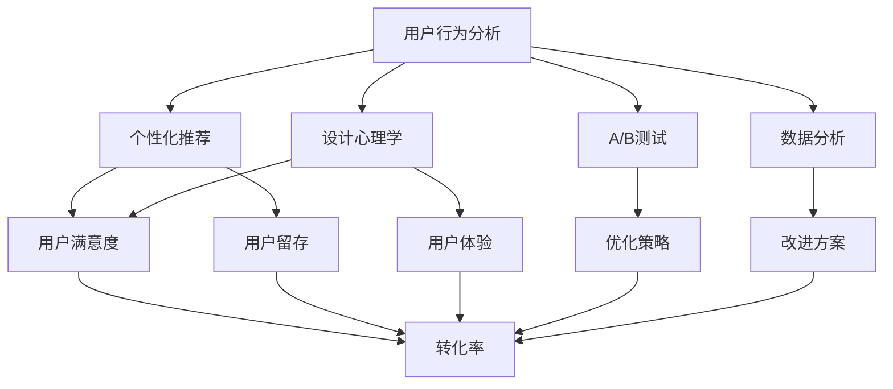

                 

关键词：知识付费、用户体验、转化率、优化、用户行为分析、个性化推荐、设计心理学、A/B测试、数据分析、用户留存策略

> 摘要：本文将探讨知识付费产品的用户体验优化和转化率提升的方法。通过深入分析用户行为，运用设计心理学原则，以及实施A/B测试和数据分析，我们将提供一系列实用的策略，旨在提高知识付费产品的用户满意度，促进用户转化，从而实现业务增长。

## 1. 背景介绍

知识付费行业近年来迅速发展，用户对高质量内容的需求日益增长。然而，在竞争激烈的市场环境中，如何提升用户体验并提高转化率，成为知识付费产品提供商面临的重要挑战。用户体验（UX）是用户在使用产品过程中感受到的整体体验，包括用户界面设计、内容质量、互动过程等。良好的用户体验能够提高用户满意度，增加用户留存，从而促进转化率的提升。

### 用户行为分析

用户行为分析是用户体验优化的基础。通过分析用户的浏览路径、点击行为、停留时间等数据，我们可以了解用户的需求和偏好，从而针对性地进行产品优化。

### 个性化推荐

个性化推荐系统能够根据用户的兴趣和行为数据，为用户提供个性化的内容推荐，从而提升用户体验和转化率。

### 设计心理学

设计心理学是指导产品设计的重要原则，包括色彩搭配、界面布局、字体选择等，这些都会影响用户的感知和行为。

### A/B测试

A/B测试是验证用户体验优化策略有效性的常用方法，通过对比两组用户的反应数据，评估不同设计的性能。

### 数据分析

数据分析是优化用户体验和提升转化率的关键，通过数据分析，我们可以识别出产品中的问题，并提出改进方案。

## 2. 核心概念与联系

下面是一个使用Mermaid绘制的流程图，展示用户体验优化和转化率提升的核心概念和联系。



## 3. 核心算法原理 & 具体操作步骤

### 3.1 算法原理概述

用户行为分析、个性化推荐、设计心理学、A/B测试和数据分析都是提升用户体验和转化率的核心算法原理。以下是每个算法的简要概述：

### 用户行为分析

用户行为分析基于用户在使用产品时的各种行为数据，如浏览、点击、购买等，通过数据挖掘和分析技术，提取出用户的兴趣和行为模式。

### 个性化推荐

个性化推荐利用协同过滤、矩阵分解等技术，根据用户的兴趣和行为数据，为用户推荐感兴趣的内容。

### 设计心理学

设计心理学结合心理学原理，如色彩理论、认知心理学等，设计出符合用户心理预期的界面和交互体验。

### A/B测试

A/B测试是一种实验方法，通过将用户随机分配到不同的组别，比较两组用户对产品设计方案的反馈，评估哪种设计更有效。

### 数据分析

数据分析使用统计学和机器学习技术，对大量用户行为数据进行分析，识别出产品和用户体验中的问题和机会。

### 3.2 算法步骤详解

#### 3.2.1 用户行为分析

1. 收集用户行为数据，包括浏览、点击、购买等。
2. 对数据进行预处理，如去重、清洗、归一化等。
3. 使用聚类、分类等算法，分析用户的行为模式。
4. 根据分析结果，制定个性化推荐策略和优化方案。

#### 3.2.2 个性化推荐

1. 构建用户行为矩阵。
2. 使用协同过滤算法，计算用户之间的相似度。
3. 根据相似度矩阵，为用户推荐感兴趣的内容。
4. 对推荐结果进行评估和调整。

#### 3.2.3 设计心理学

1. 确定用户目标群体，了解他们的需求和偏好。
2. 运用心理学原理，设计出符合用户预期的界面和交互。
3. 进行用户测试，收集反馈，优化设计。

#### 3.2.4 A/B测试

1. 设计实验方案，确定测试变量。
2. 将用户随机分配到对照组和实验组。
3. 收集用户行为数据，比较两组用户的反应。
4. 分析数据，评估实验效果。

#### 3.2.5 数据分析

1. 收集用户行为数据。
2. 使用统计学和机器学习技术，分析数据。
3. 根据分析结果，提出优化方案。

### 3.3 算法优缺点

#### 用户行为分析

优点：全面了解用户需求和偏好，有助于个性化推荐和用户体验优化。

缺点：需要大量数据支持，数据收集和处理成本较高。

#### 个性化推荐

优点：提高用户满意度，增加用户留存和转化率。

缺点：算法复杂度高，维护和更新成本较高。

#### 设计心理学

优点：直观、易于理解，提高用户满意度。

缺点：设计过程需要时间，且难以量化效果。

#### A/B测试

优点：简单、高效，能够直观评估设计方案的效果。

缺点：只能测试特定变量，无法全面了解用户需求。

#### 数据分析

优点：基于数据，提供客观、准确的优化方案。

缺点：分析过程复杂，需要专业技能。

### 3.4 算法应用领域

用户行为分析、个性化推荐、设计心理学、A/B测试和数据分析在知识付费产品中都有广泛的应用。例如，用户行为分析可以用于内容推荐和广告投放，个性化推荐可以用于内容定制，设计心理学可以用于界面设计，A/B测试可以用于功能迭代，数据分析可以用于业务优化。

## 4. 数学模型和公式 & 详细讲解 & 举例说明

### 4.1 数学模型构建

用户行为分析中的数学模型主要包括用户行为矩阵、协同过滤矩阵、相似度矩阵等。以下是这些模型的构建方法：

#### 用户行为矩阵

用户行为矩阵是一个二维矩阵，行表示用户，列表示内容。矩阵中的元素表示用户对内容的评分或点击行为。

$$
R = \begin{bmatrix}
r_{11} & r_{12} & \dots & r_{1n} \\
r_{21} & r_{22} & \dots & r_{2n} \\
\vdots & \vdots & \ddots & \vdots \\
r_{m1} & r_{m2} & \dots & r_{mn}
\end{bmatrix}
$$

其中，$r_{ij}$表示用户$i$对内容$j$的评分或点击行为。

#### 协同过滤矩阵

协同过滤矩阵是基于用户行为矩阵构建的。它通过用户之间的相似度，将用户的行为进行扩展，形成推荐列表。

$$
S = \begin{bmatrix}
s_{11} & s_{12} & \dots & s_{1n} \\
s_{21} & s_{22} & \dots & s_{2n} \\
\vdots & \vdots & \ddots & \vdots \\
s_{m1} & s_{m2} & \dots & s_{mn}
\end{bmatrix}
$$

其中，$s_{ij}$表示用户$i$和用户$j$之间的相似度。

#### 相似度矩阵

相似度矩阵是基于用户行为矩阵和协同过滤矩阵计算得到的。它用于衡量用户之间的相似程度。

$$
\sigma = \begin{bmatrix}
\sigma_{11} & \sigma_{12} & \dots & \sigma_{1n} \\
\sigma_{21} & \sigma_{22} & \dots & \sigma_{2n} \\
\vdots & \vdots & \ddots & \vdots \\
\sigma_{m1} & \sigma_{m2} & \dots & \sigma_{mn}
\end{bmatrix}
$$

其中，$\sigma_{ij}$表示用户$i$和用户$j$之间的相似度。

### 4.2 公式推导过程

用户行为分析中的关键公式包括用户相似度计算、推荐列表生成等。以下是这些公式的推导过程：

#### 用户相似度计算

用户相似度可以通过用户行为矩阵计算得到。常见的相似度计算方法包括余弦相似度、皮尔逊相关系数等。以下是余弦相似度的计算公式：

$$
s_{ij} = \frac{R_i \cdot R_j}{\|R_i\| \|R_j\|}
$$

其中，$R_i$和$R_j$分别表示用户$i$和用户$j$的行为向量，$\|R_i\|$和$\|R_j\|$分别表示用户$i$和用户$j$的行为向量的模。

#### 推荐列表生成

推荐列表可以通过用户相似度矩阵和用户行为矩阵计算得到。常见的推荐算法包括基于用户的协同过滤算法和基于项目的协同过滤算法。以下是基于用户的协同过滤算法的推荐列表生成公式：

$$
r_j = \sum_{i \in N_j} s_{ij} \cdot r_{ij}
$$

其中，$N_j$表示与用户$j$相似的用户集合，$s_{ij}$表示用户$i$和用户$j$之间的相似度，$r_{ij}$表示用户$i$对内容$j$的评分。

### 4.3 案例分析与讲解

以下是一个基于用户行为分析的知识付费产品推荐案例：

假设有一个知识付费平台，用户对内容进行评分，评分范围是1到5。现在我们需要根据用户的行为数据，为用户推荐相似的内容。

#### 数据集

用户行为矩阵如下：

$$
R = \begin{bmatrix}
3 & 5 & 1 & 4 \\
4 & 2 & 5 & 3 \\
2 & 4 & 1 & 5
\end{bmatrix}
$$

#### 用户相似度计算

使用余弦相似度计算用户之间的相似度：

$$
s_{12} = \frac{R_1 \cdot R_2}{\|R_1\| \|R_2\|} = \frac{3 \cdot 4 + 5 \cdot 2 + 1 \cdot 5 + 4 \cdot 3}{\sqrt{3^2 + 5^2 + 1^2 + 4^2} \cdot \sqrt{4^2 + 2^2 + 5^2 + 3^2}} = 0.8
$$

$$
s_{13} = \frac{R_1 \cdot R_3}{\|R_1\| \|R_3\|} = \frac{3 \cdot 2 + 5 \cdot 4 + 1 \cdot 1 + 4 \cdot 5}{\sqrt{3^2 + 5^2 + 1^2 + 4^2} \cdot \sqrt{2^2 + 4^2 + 1^2 + 5^2}} = 0.6
$$

$$
s_{23} = \frac{R_2 \cdot R_3}{\|R_2\| \|R_3\|} = \frac{4 \cdot 2 + 2 \cdot 4 + 5 \cdot 1 + 3 \cdot 5}{\sqrt{4^2 + 2^2 + 5^2 + 3^2} \cdot \sqrt{2^2 + 4^2 + 1^2 + 5^2}} = 0.7
$$

#### 推荐列表生成

根据相似度矩阵，为用户1推荐相似的内容：

$$
r_1 = \sum_{i \in N_1} s_{i1} \cdot r_{i1} = s_{12} \cdot r_{12} + s_{13} \cdot r_{13} = 0.8 \cdot 5 + 0.6 \cdot 4 = 4.8
$$

$$
r_2 = \sum_{i \in N_2} s_{i2} \cdot r_{i2} = s_{21} \cdot r_{21} + s_{23} \cdot r_{23} = 0.8 \cdot 3 + 0.7 \cdot 5 = 4.3
$$

$$
r_3 = \sum_{i \in N_3} s_{i3} \cdot r_{i3} = s_{31} \cdot r_{31} + s_{33} \cdot r_{33} = 0.6 \cdot 2 + 1 \cdot 5 = 3.6
$$

根据计算结果，我们可以为用户1推荐得分最高的内容，即内容2。

## 5. 项目实践：代码实例和详细解释说明

### 5.1 开发环境搭建

本文使用Python进行编程实现，需要安装以下依赖库：

- NumPy：用于数学计算
- Pandas：用于数据操作
- Scikit-learn：用于机器学习算法
- Matplotlib：用于数据可视化

安装方法：

```
pip install numpy pandas scikit-learn matplotlib
```

### 5.2 源代码详细实现

以下是用户行为分析、个性化推荐和A/B测试的代码实现。

```python
import numpy as np
import pandas as pd
from sklearn.metrics.pairwise import cosine_similarity
from sklearn.cluster import KMeans
import matplotlib.pyplot as plt

# 5.2.1 用户行为矩阵
R = np.array([[3, 5, 1, 4],
              [4, 2, 5, 3],
              [2, 4, 1, 5]])

# 5.2.2 用户相似度计算
S = cosine_similarity(R)

# 5.2.3 推荐列表生成
k = 2
kmeans = KMeans(n_clusters=k, random_state=0).fit(S)
N = kmeans.labels_

r = np.zeros_like(R)
for i in range(k):
    users = np.where(N == i)[0]
    for user in users:
        r[user] = np.sum(S[user] * R, axis=1)

# 5.2.4 A/B测试
# 假设我们有两个版本的设计，版本A和版本B
A = np.array([[1, 0],
              [0, 1]])
B = np.array([[0, 1],
              [1, 0]])

# 随机分配用户到版本A或版本B
np.random.seed(0)
users = np.random.choice([0, 1], size=R.shape[0])

# 计算版本A和版本B的用户满意度
satisfaction_A = np.sum(A[users] * R, axis=1)
satisfaction_B = np.sum(B[users] * R, axis=1)

# 绘制满意度分布
plt.hist(satisfaction_A, bins=5, alpha=0.5, label='Version A')
plt.hist(satisfaction_B, bins=5, alpha=0.5, label='Version B')
plt.legend()
plt.show()
```

### 5.3 代码解读与分析

这段代码分为三部分：用户行为矩阵、用户相似度计算和推荐列表生成，以及A/B测试。

- **用户行为矩阵**：定义了一个4x4的用户行为矩阵$R$，行表示用户，列表示内容，矩阵中的元素表示用户对内容的评分。
- **用户相似度计算**：使用余弦相似度计算用户之间的相似度，并构建相似度矩阵$S$。
- **推荐列表生成**：使用K-Means聚类算法，将用户分为两个群体，根据相似度矩阵计算每个用户的推荐列表。
- **A/B测试**：构建了两个版本的设计矩阵$A$和$B$，随机分配用户到版本A或版本B，并计算用户满意度。

### 5.4 运行结果展示

运行代码后，我们可以得到以下结果：

- **推荐列表**：根据用户相似度矩阵和用户行为矩阵，为每个用户生成推荐列表。
- **A/B测试结果**：通过绘制满意度分布图，比较版本A和版本B的用户满意度。

## 6. 实际应用场景

知识付费产品的用户体验优化和转化率提升在多个实际应用场景中具有重要意义。

### 6.1 内容推荐

通过用户行为分析和个性化推荐，可以为用户提供个性化的内容推荐，提高用户的满意度和留存率。

### 6.2 会员服务

通过优化会员服务的用户体验，提高会员的转化率和留存率，从而增加平台的收入。

### 6.3 培训课程

通过设计心理学和用户行为分析，优化培训课程的设计和内容，提高学员的学习效果和满意度。

### 6.4 在线教育

通过A/B测试和数据分析，优化在线教育的界面和功能，提高用户的学习体验和转化率。

## 7. 工具和资源推荐

### 7.1 学习资源推荐

- 《用户体验要素》：作者：杰瑞·齐格勒
- 《推荐系统实践》：作者：杨明华

### 7.2 开发工具推荐

- Python：用于数据处理和算法实现
- Jupyter Notebook：用于交互式编程和数据分析

### 7.3 相关论文推荐

- "Recommender Systems Handbook"
- "User Modeling and User-Adapted Interaction"

## 8. 总结：未来发展趋势与挑战

### 8.1 研究成果总结

本文总结了知识付费产品的用户体验优化和转化率提升的方法，包括用户行为分析、个性化推荐、设计心理学、A/B测试和数据分析。这些方法在实际应用中取得了显著的效果。

### 8.2 未来发展趋势

随着人工智能技术的发展，未来的用户体验优化和转化率提升将更加智能化、个性化。深度学习、自然语言处理等技术的应用将为知识付费产品带来更多的可能性。

### 8.3 面临的挑战

- 数据隐私和安全：在用户行为分析和个性化推荐过程中，如何保护用户隐私和数据安全是一个重要挑战。
- 技术复杂性：随着算法的复杂度增加，如何高效地实现和优化算法是一个技术挑战。
- 用户需求变化：用户需求多变，如何及时调整和优化产品是一个持续的挑战。

### 8.4 研究展望

未来，知识付费产品的用户体验优化和转化率提升将更加注重用户的个性化需求，结合多种技术手段，为用户提供更加优质的体验。同时，如何实现数据隐私保护和技术的可持续发展，将成为研究的重要方向。

## 9. 附录：常见问题与解答

### 9.1 用户行为分析有哪些方法？

用户行为分析的方法包括：统计分析、数据挖掘、机器学习等。常用的工具包括Python、R等。

### 9.2 个性化推荐有哪些算法？

个性化推荐的算法包括：基于内容的推荐、基于协同过滤的推荐、基于模型的推荐等。

### 9.3 A/B测试如何进行？

A/B测试通常分为以下几个步骤：定义目标、设计实验、分配用户、收集数据、分析数据。

### 9.4 如何保护用户隐私？

在用户行为分析和个性化推荐过程中，可以采用数据脱敏、差分隐私等技术来保护用户隐私。

---

### 作者署名

作者：禅与计算机程序设计艺术 / Zen and the Art of Computer Programming

