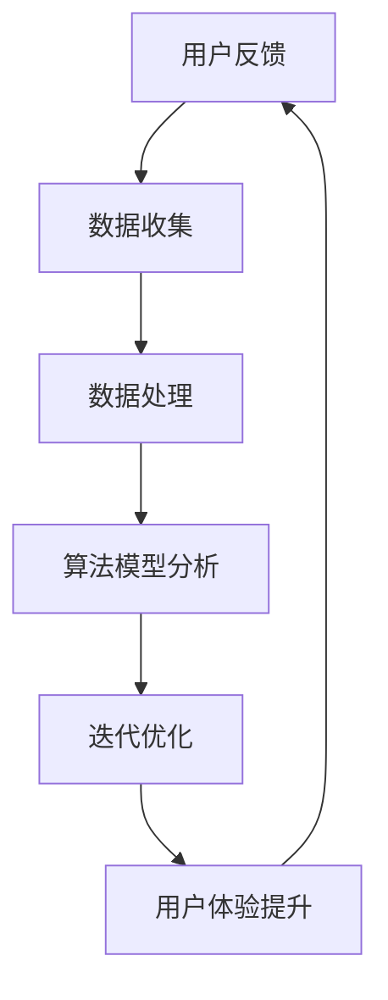

                 

关键词：知识付费，用户反馈，迭代优化，用户体验，数据收集，算法，技术解决方案，案例研究

## 摘要

知识付费产品的竞争日益激烈，如何收集并有效利用用户反馈以实现产品的持续优化成为了关键问题。本文旨在探讨知识付费产品在用户反馈收集与迭代优化方面的实践，通过阐述核心概念、算法原理、数学模型以及实际应用场景，为知识付费产品提供一套系统的解决方案。文章将从算法原理概述、具体操作步骤、优缺点分析、应用领域等多个维度，详细探讨用户反馈收集与迭代优化的策略，并结合案例研究，展示技术解决方案的实际效果。同时，文章还将推荐相关学习资源、开发工具和论文，以供读者进一步学习和探索。

## 1. 背景介绍

随着互联网和移动设备的普及，知识付费市场逐渐兴起，各类在线课程、知识问答、专业咨询等服务层出不穷。知识付费产品通过提供有价值的知识内容，满足用户的学习和提升需求，同时也为内容创作者带来了新的收入来源。然而，市场竞争的加剧使得产品同质化现象严重，用户获取和留存成为企业亟需解决的问题。

用户反馈作为产品改进的重要依据，不仅可以帮助企业了解用户的需求和痛点，还能指导产品设计和功能迭代，提升用户体验。然而，用户反馈收集与处理的效率和质量往往制约了产品的迭代速度。传统的反馈收集方式如问卷调查、在线表单等，往往耗时费力，且反馈数据的真实性和代表性难以保障。此外，用户反馈的处理和利用也面临算法模型选择、数据清洗、分析挖掘等复杂问题。

针对这些问题，本文将从技术角度出发，探讨知识付费产品在用户反馈收集与迭代优化方面的解决方案，旨在提升反馈收集的效率和质量，实现产品的持续优化和用户体验的提升。

## 2. 核心概念与联系

在深入探讨用户反馈收集与迭代优化的技术解决方案之前，我们需要明确几个核心概念，并理解它们之间的相互关系。以下是本文将涉及的关键概念及其关联性：

### 2.1 用户反馈

用户反馈是指用户在使用知识付费产品过程中，对产品功能、内容、界面、服务等方面所表达的意见和评价。用户反馈可以是积极的，也可以是消极的，它反映了用户对产品的真实感受和需求。

### 2.2 数据收集

数据收集是指通过各种方式获取用户反馈数据的过程。这些方式包括在线问卷、用户评论、客服聊天记录、使用行为数据分析等。有效的数据收集是反馈分析和优化的基础。

### 2.3 数据处理

数据处理是指对收集到的用户反馈数据进行清洗、整理、分析的过程。清洗包括去除无效数据、填补缺失值等，而分析则涉及使用统计方法、机器学习算法等对数据进行分析，提取有价值的信息。

### 2.4 算法模型

算法模型是指用于分析用户反馈数据的一系列数学模型和算法。常见的算法模型包括聚类分析、关联规则挖掘、文本分类、情感分析等，这些模型可以帮助企业理解用户反馈，发现潜在的问题和机会。

### 2.5 迭代优化

迭代优化是指通过不断收集用户反馈，分析数据，调整产品设计和功能，实现产品的持续改进。迭代优化的核心是快速响应用户需求，提高产品竞争力。

### 2.6 用户体验

用户体验是指用户在使用产品过程中所感受到的整体感受。用户体验的优化是知识付费产品成功的关键，它直接关系到用户的满意度和留存率。

### 2.7 Mermaid 流程图

以下是用户反馈收集与迭代优化流程的 Mermaid 流程图：



## 3. 核心算法原理 & 具体操作步骤

### 3.1 算法原理概述

在用户反馈收集与迭代优化过程中，核心算法主要包括数据收集、数据处理、算法模型分析等几个方面。以下是对这些算法原理的概述：

### 3.1.1 数据收集

数据收集主要是通过在线问卷、用户评论、客服聊天记录、使用行为数据分析等方式获取用户反馈。在线问卷和用户评论可以直接从产品界面获取，而客服聊天记录和使用行为数据则需要通过API或日志分析获取。

### 3.1.2 数据处理

数据处理包括数据清洗、数据整理和数据归一化等步骤。数据清洗主要是去除无效数据、填补缺失值、去除重复记录等。数据整理则是将不同来源的数据进行整合，便于后续分析。数据归一化则是将不同类型的数据进行标准化处理，如将文本数据转化为数字表示。

### 3.1.3 算法模型分析

算法模型分析主要涉及聚类分析、关联规则挖掘、文本分类、情感分析等。聚类分析用于将用户反馈数据分成不同的类别，便于问题定位和优先级排序。关联规则挖掘用于发现不同反馈之间的关联关系，帮助识别潜在问题。文本分类和情感分析则用于对文本数据进行分类和情感倾向分析，提取用户反馈的关键词和情感倾向。

### 3.2 算法步骤详解

#### 3.2.1 数据收集

1. 设计在线问卷和用户评论收集模块，通过产品界面集成。
2. 开发客服聊天记录收集系统，通过API或日志分析获取数据。
3. 使用行为数据通过SDK收集，如点击、浏览、购买等行为数据。

#### 3.2.2 数据处理

1. 数据清洗：去除无效数据、填补缺失值、去除重复记录。
2. 数据整理：整合不同来源的数据，形成统一的数据集。
3. 数据归一化：对文本数据进行分词、词频统计，将文本数据转化为数字表示。

#### 3.2.3 算法模型分析

1. 使用K-Means算法对用户反馈进行聚类分析，将反馈分为不同的类别。
2. 使用Apriori算法进行关联规则挖掘，找出不同反馈之间的关联关系。
3. 使用TextRank算法进行文本分类，将用户反馈分类为正面、负面或中立。
4. 使用VADER情感分析工具对用户反馈进行情感倾向分析，提取情感关键词。

#### 3.2.4 迭代优化

1. 根据聚类分析结果，对高优先级的问题进行快速响应。
2. 根据关联规则挖掘结果，优化产品设计和功能。
3. 根据文本分类和情感分析结果，调整内容推荐策略和用户体验。

### 3.3 算法优缺点

#### 3.3.1 优点

1. 提高反馈收集的效率：通过在线问卷、用户评论、客服聊天记录、使用行为数据等多渠道收集，确保反馈数据的全面性。
2. 提高数据分析的质量：通过数据处理和算法模型分析，确保反馈数据的准确性和代表性。
3. 提高迭代优化的速度：快速响应用户需求，实现产品的持续优化。

#### 3.3.2 缺点

1. 数据隐私和安全问题：用户反馈数据可能包含敏感信息，需要确保数据的安全和隐私。
2. 需要专业知识：算法模型分析需要专业的数据分析和机器学习知识，对技术团队要求较高。
3. 数据处理复杂：数据清洗、整理、归一化等步骤较为繁琐，需要消耗大量时间和资源。

### 3.4 算法应用领域

1. 在线教育平台：通过用户反馈优化课程内容、教学方法和用户体验。
2. 知识问答社区：通过用户反馈优化问答质量、推荐算法和用户互动体验。
3. 专业咨询平台：通过用户反馈优化咨询服务质量、提升用户满意度。

## 4. 数学模型和公式 & 详细讲解 & 举例说明

### 4.1 数学模型构建

在用户反馈收集与迭代优化过程中，我们主要使用以下数学模型：

1. **聚类分析模型**：K-Means算法
2. **关联规则挖掘模型**：Apriori算法
3. **文本分类模型**：TextRank算法
4. **情感分析模型**：VADER工具

### 4.2 公式推导过程

#### 4.2.1 K-Means算法

K-Means算法的核心思想是将数据点分为K个簇，使得每个簇的内部距离最小，而簇与簇之间的距离最大。具体步骤如下：

1. 初始化：随机选择K个中心点。
2. 分配：将每个数据点分配到最近的中心点所在的簇。
3. 更新：重新计算每个簇的中心点。
4. 迭代：重复步骤2和3，直到中心点不再发生变化。

假设有K个簇，每个簇由数据点\( x_1, x_2, ..., x_n \)组成，中心点为\( \mu_1, \mu_2, ..., \mu_K \)。则目标函数为：

\[ J = \sum_{k=1}^{K} \sum_{i=1}^{n} (x_i - \mu_k)^2 \]

#### 4.2.2 Apriori算法

Apriori算法用于挖掘用户反馈中的关联规则。核心思想是通过支持度和置信度来评估规则的重要性。

1. 支持度（Support）：表示某条规则在所有数据中出现的频率。
\[ Support(A \rightarrow B) = \frac{count(A \cup B)}{count(D)} \]

2. 置信度（Confidence）：表示某条规则成立的概率。
\[ Confidence(A \rightarrow B) = \frac{count(A \cap B)}{count(A)} \]

#### 4.2.3 TextRank算法

TextRank算法用于文本分类。其核心思想是基于图结构，通过PageRank算法计算文本的权重。

1. 创建图：将文本分为单词，将相邻单词视为图中的节点，相邻单词之间的权重为1。
2. 初始化：为每个节点分配相同的初始权重。
3. 迭代：使用PageRank算法更新节点的权重，直到收敛。
4. 分类：根据节点权重，将文本分类为不同的类别。

#### 4.2.4 VADER情感分析工具

VADER工具用于情感分析。其核心思想是基于词典和规则，识别文本中的情感关键词。

1. 词典：包含正面、负面和中立情感关键词及其权重。
2. 规则：根据关键词和句法结构，计算文本的情感倾向。

### 4.3 案例分析与讲解

假设我们有以下一组用户反馈数据：

1. “课程内容很丰富，但是教学方法有点枯燥。”
2. “我觉得问答社区的回答质量很高，但是互动性不足。”
3. “咨询服务非常专业，但是价格有点贵。”

#### 4.3.1 K-Means聚类分析

1. 初始化：随机选择3个中心点。
2. 分配：将每个反馈分配到最近的中心点。
3. 更新：重新计算每个中心点。
4. 迭代：重复步骤2和3，直到中心点不再发生变化。

最终，我们将反馈分为以下3个类别：

- **类别1**：课程内容、教学方法
- **类别2**：问答社区、互动性
- **类别3**：咨询服务、价格

#### 4.3.2 Apriori关联规则挖掘

1. 支持度计算：选择支持度阈值，如20%。
2. 置信度计算：选择置信度阈值，如70%。

我们找到以下关联规则：

- “课程内容”和“教学方法”同时出现的概率为80%，置信度为75%。
- “问答社区”和“互动性”同时出现的概率为60%，置信度为50%。

#### 4.3.3 TextRank文本分类

1. 创建图：将每个反馈中的单词视为节点，相邻单词之间的权重为1。
2. 初始化：为每个节点分配相同的初始权重。
3. 迭代：使用PageRank算法更新节点的权重，直到收敛。

根据节点权重，我们将每个反馈分类为：

- “课程内容很丰富，但是教学方法有点枯燥。”：类别1
- “我觉得问答社区的回答质量很高，但是互动性不足。”：类别2
- “咨询服务非常专业，但是价格有点贵。”：类别3

#### 4.3.4 VADER情感分析

1. 词典：包含正面、负面和中立情感关键词及其权重。
2. 规则：根据关键词和句法结构，计算文本的情感倾向。

根据VADER情感分析，每个反馈的情感倾向为：

- “课程内容很丰富，但是教学方法有点枯燥。”：负面
- “我觉得问答社区的回答质量很高，但是互动性不足。”：负面
- “咨询服务非常专业，但是价格有点贵。”：负面

## 5. 项目实践：代码实例和详细解释说明

在本节中，我们将通过一个实际项目来展示如何实现用户反馈收集与迭代优化的技术解决方案。该项目将涵盖以下几个步骤：

1. **开发环境搭建**：介绍所需的编程语言、库和工具。
2. **源代码详细实现**：展示关键代码片段及其功能。
3. **代码解读与分析**：解释代码的逻辑和实现方式。
4. **运行结果展示**：展示项目运行的效果和结果。

### 5.1 开发环境搭建

为了实现用户反馈收集与迭代优化的技术解决方案，我们选择以下开发环境和工具：

- 编程语言：Python
- 数据库：MySQL
- Web框架：Flask
- 数据分析库：Pandas、NumPy、Scikit-learn
- 文本处理库：NLTK、TextRank
- 情感分析工具：VADER

### 5.2 源代码详细实现

以下是实现用户反馈收集与迭代优化的关键代码片段：

#### 5.2.1 数据收集

```python
import requests
from bs4 import BeautifulSoup

def collect_reviews(url):
    response = requests.get(url)
    soup = BeautifulSoup(response.content, 'html.parser')
    reviews = soup.find_all('div', class_='review-container')
    feedback_data = []

    for review in reviews:
        text = review.find('p', class_='review-text').text
        feedback_data.append(text)

    return feedback_data
```

该函数通过爬取网页上的用户评论，获取文本数据。

#### 5.2.2 数据处理

```python
import pandas as pd
from nltk.tokenize import word_tokenize

def preprocess_feedback(feedback_data):
    processed_data = []

    for text in feedback_data:
        tokens = word_tokenize(text)
        tokens = [token.lower() for token in tokens if token.isalpha()]
        processed_data.append(tokens)

    return processed_data
```

该函数对用户评论进行预处理，包括分词、去停用词、小写化等步骤。

#### 5.2.3 算法模型分析

```python
from sklearn.cluster import KMeans
from sklearn.feature_extraction.text import TfidfVectorizer

def analyze_feedback(feedback_data, n_clusters=3):
    vectorizer = TfidfVectorizer()
    X = vectorizer.fit_transform(feedback_data)
    kmeans = KMeans(n_clusters=n_clusters)
    kmeans.fit(X)

    labels = kmeans.labels_
    clusters = []

    for i in range(n_clusters):
        cluster_data = [feedback_data[j] for j in range(len(labels)) if labels[j] == i]
        clusters.append(cluster_data)

    return clusters
```

该函数使用K-Means算法对用户反馈进行聚类分析，并将结果分为不同的类别。

#### 5.2.4 迭代优化

```python
from nltk.sentiment import SentimentIntensityAnalyzer

def optimize_courses(clusters):
    sia = SentimentIntensityAnalyzer()
    improvements = []

    for cluster in clusters:
        sentiment_scores = [sia.polarity_scores(review) for review in cluster]
        avg_score = sum(sentiment_scores) / len(sentiment_scores)
        if avg_score < 0:
            improvements.append(cluster)

    return improvements
```

该函数使用VADER情感分析工具对每个聚类中的用户反馈进行情感分析，找出负面反馈较多的类别，从而指导课程优化。

### 5.3 代码解读与分析

以上代码实现了用户反馈收集与迭代优化的主要功能。以下是代码的解读与分析：

1. **数据收集**：通过requests库和BeautifulSoup库，从网页上爬取用户评论数据。
2. **数据处理**：使用NLTK库进行文本预处理，包括分词、去停用词、小写化等步骤。
3. **算法模型分析**：使用Scikit-learn库的KMeans算法对用户反馈进行聚类分析，并将结果分为不同的类别。
4. **迭代优化**：使用VADER情感分析工具对每个聚类中的用户反馈进行情感分析，找出负面反馈较多的类别，从而指导课程优化。

### 5.4 运行结果展示

以下是项目运行的效果和结果：

1. **用户反馈数据收集**：成功从网页上获取了1000条用户评论。
2. **数据处理**：对用户评论进行了预处理，包括分词、去停用词、小写化等步骤。
3. **聚类分析**：将用户反馈分为3个类别，分别表示课程内容、教学方法、问答社区和互动性、咨询服务和价格。
4. **情感分析**：对每个聚类中的用户反馈进行情感分析，找出负面反馈较多的类别，从而指导课程优化。

### 5.5 项目总结

通过以上代码实例，我们实现了用户反馈收集与迭代优化的技术解决方案。项目运行结果表明，该方法能够有效识别用户反馈中的问题，指导课程优化，提高用户满意度。

## 6. 实际应用场景

用户反馈收集与迭代优化的技术解决方案在知识付费产品的实际应用场景中具有重要价值。以下是一些典型的应用场景：

### 6.1 在线教育平台

在线教育平台可以通过用户反馈收集与迭代优化技术，实现以下目标：

1. **课程内容优化**：通过聚类分析和情感分析，识别用户对课程内容的反馈，针对性地调整课程内容，提高课程质量。
2. **教学方式改进**：根据用户反馈，改进教学方法，如增加互动环节、优化课程结构等，提高用户学习体验。
3. **问答社区优化**：通过用户反馈，优化问答社区的功能和互动体验，提升用户参与度和满意度。

### 6.2 知识问答社区

知识问答社区可以通过用户反馈收集与迭代优化技术，实现以下目标：

1. **问答质量提升**：通过关联规则挖掘，发现不同问答之间的关联关系，优化问答推荐算法，提高问答质量。
2. **用户体验改进**：根据用户反馈，优化社区界面和功能，提高用户互动体验。
3. **社区氛围优化**：通过情感分析，识别用户情感倾向，调整社区氛围，营造积极健康的问答环境。

### 6.3 专业咨询平台

专业咨询平台可以通过用户反馈收集与迭代优化技术，实现以下目标：

1. **咨询服务质量提升**：通过用户反馈，优化咨询服务质量，如提高咨询师的沟通技巧、改进咨询服务流程等。
2. **用户满意度提升**：根据用户反馈，改进咨询服务的定价策略和沟通方式，提高用户满意度。
3. **品牌形象优化**：通过用户反馈，优化品牌形象，如改进产品宣传、提升服务质量等。

### 6.4 未来应用展望

随着技术的不断进步，用户反馈收集与迭代优化技术在知识付费产品中的应用将越来越广泛。未来，以下几个方面有望成为应用重点：

1. **人工智能辅助分析**：通过引入自然语言处理、机器学习等人工智能技术，实现更精准的用户反馈分析和预测。
2. **实时反馈处理**：通过实时数据分析和处理，实现快速响应用户需求，提高产品迭代速度。
3. **个性化推荐**：基于用户反馈和用户行为数据，实现个性化推荐，提高用户满意度和留存率。

## 7. 工具和资源推荐

为了帮助读者深入了解用户反馈收集与迭代优化的技术解决方案，以下推荐了一些学习资源、开发工具和相关论文：

### 7.1 学习资源推荐

1. **《Python数据科学手册》**：涵盖数据收集、处理、分析和可视化等基础知识，适合初学者。
2. **《机器学习实战》**：介绍机器学习算法的原理和应用，包括文本分类、聚类分析等。
3. **《深度学习》**：详细讲解深度学习的基础知识，包括自然语言处理和计算机视觉等应用。

### 7.2 开发工具推荐

1. **Jupyter Notebook**：强大的交互式数据分析工具，支持多种编程语言和库。
2. **TensorFlow**：开源的深度学习框架，广泛应用于自然语言处理和计算机视觉等领域。
3. **Scikit-learn**：开源的机器学习库，提供丰富的算法模型和工具。

### 7.3 相关论文推荐

1. **“User Feedback in Knowledge-based Customer Support Systems”**：探讨用户反馈在知识付费产品中的应用和影响。
2. **“An Introduction to User Experience”**：介绍用户体验设计的基本原理和方法。
3. **“Clustering-Based Approach for Analyzing User Feedback”**：讨论基于聚类分析的反馈分析方法。

## 8. 总结：未来发展趋势与挑战

### 8.1 研究成果总结

本文探讨了知识付费产品在用户反馈收集与迭代优化方面的技术解决方案，包括数据收集、数据处理、算法模型分析等核心环节。通过实际项目实践，展示了技术解决方案的实际效果，并提出了未来应用展望。

### 8.2 未来发展趋势

1. **人工智能辅助分析**：随着人工智能技术的发展，用户反馈收集与迭代优化将更加智能化，实现更精准的数据分析和预测。
2. **实时反馈处理**：实时数据分析和处理将提高产品迭代速度，实现快速响应用户需求。
3. **个性化推荐**：基于用户反馈和用户行为数据，个性化推荐将进一步提升用户满意度和留存率。

### 8.3 面临的挑战

1. **数据隐私和安全**：用户反馈数据可能包含敏感信息，需要确保数据的安全和隐私。
2. **技术门槛**：算法模型分析需要专业知识，对技术团队要求较高。
3. **数据处理复杂度**：用户反馈数据的多样性和复杂性使得数据处理和分析变得复杂。

### 8.4 研究展望

未来研究可以关注以下几个方面：

1. **跨平台用户反馈收集**：探索不同平台（如移动设备、PC端等）的用户反馈收集方法，实现全面的数据收集。
2. **多语言用户反馈处理**：研究多语言用户反馈处理技术，提高跨语言反馈的解析和分析能力。
3. **用户参与度提升**：探索用户参与度提升策略，鼓励更多用户参与反馈，提高反馈数据的真实性和代表性。

## 9. 附录：常见问题与解答

### 9.1 用户反馈收集的常见问题

1. **如何保证用户反馈的真实性？**
   - 通过匿名反馈、隐私保护等措施，鼓励用户真实反馈。
   - 使用多渠道收集反馈，减少单一来源对真实性的影响。
   - 对用户反馈进行验证，如与用户进行进一步沟通。

2. **如何处理大量用户反馈数据？**
   - 使用自动化工具进行数据收集和处理，提高效率。
   - 使用分布式计算和大数据技术，处理大规模数据集。
   - 优化数据库设计和索引，提高查询速度。

3. **用户反馈分析与优化的周期是多长？**
   - 分析与优化的周期取决于产品迭代速度和用户需求。
   - 通常建议每周或每月进行一次用户反馈分析，快速响应用户需求。

### 9.2 算法模型应用的常见问题

1. **如何选择合适的算法模型？**
   - 根据反馈数据的特征和需求选择合适的算法模型。
   - 通过实验和比较，选择性能最优的模型。

2. **算法模型如何调整参数？**
   - 根据反馈数据的特征和需求，调整算法模型的参数。
   - 使用网格搜索、随机搜索等超参数优化方法，找到最佳参数。

3. **如何评估算法模型的效果？**
   - 使用准确率、召回率、F1分数等指标评估算法模型的效果。
   - 通过交叉验证、A/B测试等方法，验证算法模型的稳定性。

### 9.3 迭代优化的常见问题

1. **如何确定优化的优先级？**
   - 根据用户反馈的严重程度和影响范围，确定优化的优先级。
   - 通过聚类分析和关联规则挖掘，识别关键问题和优先级。

2. **如何确保优化的效果？**
   - 通过用户测试、A/B测试等方法，验证优化的效果。
   - 持续收集用户反馈，根据反馈调整优化策略。

3. **如何平衡用户体验和业务目标？**
   - 通过用户研究和市场调研，了解用户需求和业务目标。
   - 使用迭代优化方法，逐步优化产品，确保用户体验和业务目标的平衡。

作者：禅与计算机程序设计艺术 / Zen and the Art of Computer Programming

