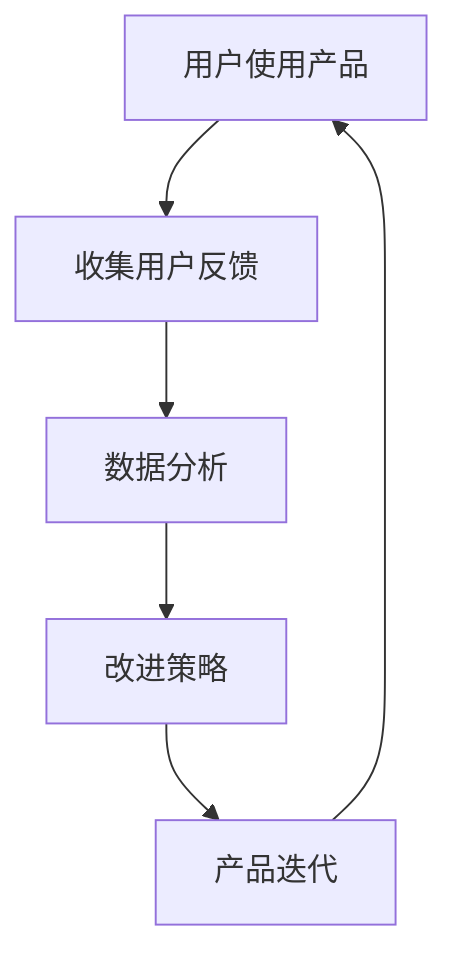

                 

关键词：知识付费，用户反馈，闭环管理，用户体验，数据分析，改进策略

> 摘要：本文旨在探讨知识付费产品中的用户反馈闭环管理，通过分析用户反馈的重要性，构建用户反馈机制，利用数据分析优化产品，以及提出改进策略，从而提升知识付费产品的用户满意度和市场竞争力。

## 1. 背景介绍

在互联网时代，知识付费作为一种新型的商业模式，已经逐渐成为用户获取信息和知识的重要途径。知识付费产品涵盖了从在线课程、电子书、专业咨询到技能培训等多种形式，它们通过提供有价值的知识和技能帮助用户实现自我提升。然而，用户的需求和满意度是知识付费产品成功的关键因素。为了满足用户需求并持续优化产品，知识付费平台需要建立有效的用户反馈闭环管理机制。

用户反馈是知识付费产品迭代和优化的关键信息来源。通过收集和分析用户反馈，平台可以了解用户的需求、偏好和痛点，从而进行针对性的改进。同时，用户反馈也是衡量产品性能的重要指标，有助于平台评估自身的服务水平和市场竞争力。

本文将从以下几个方面展开讨论：

- 用户反馈的重要性
- 用户反馈机制的构建
- 数据分析在用户反馈中的应用
- 改进策略的制定
- 未来发展展望

## 2. 核心概念与联系

为了更好地理解用户反馈闭环管理，我们需要明确以下几个核心概念：

- 用户反馈：用户对知识付费产品的评价、意见和建议。
- 闭环管理：指通过用户反馈收集、分析和改进，形成一个持续优化的循环。
- 数据分析：利用数据挖掘和统计分析方法，对用户反馈进行定量和定性分析。
- 用户体验：用户在使用知识付费产品过程中的感受和体验。

下面是用户反馈闭环管理的Mermaid流程图：



### 2.1 用户反馈收集

用户反馈的收集是闭环管理的第一步，也是至关重要的一步。通过问卷调查、用户访谈、在线评论等方式，平台可以获取用户的真实感受和意见。有效的用户反馈收集需要考虑以下几个方面：

- 反馈渠道的多样化：提供多种反馈渠道，如在线表单、社交媒体、邮件等，方便用户表达意见。
- 反馈内容的真实性：确保反馈内容真实可靠，可以通过匿名反馈、验证码等方式提高反馈的真实性。
- 反馈机制的及时性：及时收集用户的反馈，并在适当的时间段内进行处理。

### 2.2 数据分析

收集到用户反馈后，平台需要对反馈内容进行数据化处理。数据分析的方法包括：

- 文本分析：对用户反馈的文本进行主题建模、情感分析等，以提取出用户的痛点和需求。
- 统计分析：利用统计学方法，如回归分析、聚类分析等，对用户反馈进行定量分析，识别出用户行为模式。
- 数据可视化：通过数据可视化工具，如图表、仪表盘等，将分析结果以直观的方式呈现。

### 2.3 改进策略

基于数据分析的结果，平台可以制定相应的改进策略。改进策略的制定需要考虑以下几个方面：

- 产品优化：针对用户反馈中的问题进行产品功能、界面和流程的优化。
- 服务改进：提升客服质量，增强用户支持，提高用户满意度。
- 市场推广：根据用户需求调整市场策略，吸引更多潜在用户。

### 2.4 产品迭代

产品迭代是闭环管理的重要环节，通过不断更新和优化，知识付费产品可以更好地满足用户需求。产品迭代的过程包括：

- 规划：根据改进策略制定产品更新计划，明确目标和时间表。
- 开发：根据规划进行产品的开发和测试，确保新功能的可靠性和稳定性。
- 上线：将更新后的产品上线，并持续收集用户反馈。

## 3. 核心算法原理 & 具体操作步骤

### 3.1 算法原理概述

用户反馈闭环管理中的核心算法主要包括：

- 主题建模算法：用于对用户反馈文本进行主题识别和分析。
- 情感分析算法：用于判断用户反馈的情感倾向。
- 回归分析算法：用于分析用户反馈与产品性能之间的关系。

### 3.2 算法步骤详解

以下是用户反馈闭环管理的算法步骤详解：

#### 步骤1：数据预处理

- 数据清洗：去除文本中的噪声，如HTML标签、停用词等。
- 词干提取：将文本中的单词还原为基本词形。
- 词向量表示：将文本转化为向量表示，便于算法处理。

#### 步骤2：主题建模

- 使用LDA（Latent Dirichlet Allocation）算法对用户反馈文本进行主题建模。
- 提取高频词汇，构建主题词表。
- 根据用户反馈的主题分布，识别用户的主要关注点。

#### 步骤3：情感分析

- 使用情感分析模型对用户反馈文本进行情感倾向判断。
- 根据情感分析结果，划分用户反馈的情感类别。

#### 步骤4：回归分析

- 使用回归分析算法，分析用户反馈与产品性能之间的关系。
- 根据回归分析结果，识别影响用户满意度的主要因素。

### 3.3 算法优缺点

#### 优点

- 主题建模算法：能够高效地识别用户反馈的主题，帮助平台快速定位问题。
- 情感分析算法：能够准确地判断用户反馈的情感倾向，有助于分析用户的满意度。
- 回归分析算法：能够定量地分析用户反馈与产品性能之间的关系，为产品优化提供科学依据。

#### 缺点

- 数据质量：算法的准确性和效果很大程度上依赖于用户反馈的数据质量。
- 模型复杂度：主题建模和情感分析算法的模型相对复杂，需要较高的计算资源。

### 3.4 算法应用领域

用户反馈闭环管理算法广泛应用于知识付费产品的各个领域，包括：

- 在线课程：分析用户对课程内容的反馈，优化课程设计和教学方法。
- 电子书：根据用户反馈调整书籍的结构和内容，提高阅读体验。
- 专业咨询：分析用户对咨询服务的反馈，提升服务质量。
- 技能培训：根据用户反馈优化培训课程和教学手段，提高培训效果。

## 4. 数学模型和公式 & 详细讲解 & 举例说明

### 4.1 数学模型构建

用户反馈闭环管理中的数学模型主要包括：

- 主题建模模型：LDA模型
- 情感分析模型：SVM（Support Vector Machine）模型
- 回归分析模型：线性回归模型

### 4.2 公式推导过程

以下是各数学模型的公式推导过程：

#### 4.2.1 LDA模型

LDA（Latent Dirichlet Allocation）模型是一种基于贝叶斯理论的概率主题模型，用于发现文本数据中的主题分布。

- 参数定义：

  - \(z_{ijk}\)：第\(i\)个文档的第\(j\)个词语属于第\(k\)个主题的概率。
  - \(θ_{i}\)：第\(i\)个文档的主题分布。
  - \(φ_{k}\)：第\(k\)个主题的词语分布。

- 模型公式：

  \[
  P(z_{ijk} = 1) \sim \text{Dirichlet}(\alpha)
  \]

  \[
  P(\theta_{i} = k) = \frac{γ_{kk} \cdot \prod_{j=1}^{N} P(w_{ij} = j) \cdot \alpha}{\sum_{k=1}^{K} γ_{kk} \cdot \prod_{j=1}^{N} P(w_{ij} = j) \cdot \alpha}
  \]

  \[
  P(w_{ij} = j) = \frac{γ_{jk} \cdot \beta_{kj}}{\sum_{l=1}^{V} γ_{jl} \cdot \beta_{lj}}
  \]

其中，\(γ\)和\(\beta\)分别为主题分布和词语分布的超参数，\(α\)和\(V\)分别为主题数和词汇数。

#### 4.2.2 SVM模型

SVM（Support Vector Machine）模型是一种分类模型，用于判断用户反馈的情感倾向。

- 参数定义：

  - \(w\)：分类超平面。
  - \(b\)：偏置项。
  - \(y\)：用户反馈的情感标签。

- 模型公式：

  \[
  \hat{y} = \text{sign}(\langle w, x \rangle + b)
  \]

  \[
  \langle w, x \rangle = \sum_{i=1}^{n} w_i x_i
  \]

其中，\(x\)为用户反馈文本的特征向量。

#### 4.2.3 线性回归模型

线性回归模型用于分析用户反馈与产品性能之间的关系。

- 参数定义：

  - \(x\)：用户反馈的特征向量。
  - \(y\)：产品性能指标。
  - \(w\)：模型参数。

- 模型公式：

  \[
  y = \langle w, x \rangle + b
  \]

  \[
  w = (X^T X)^{-1} X^T y
  \]

其中，\(X\)为特征矩阵。

### 4.3 案例分析与讲解

下面通过一个实际案例来分析用户反馈闭环管理的过程。

#### 案例背景

某在线教育平台提供职业技能培训课程，用户可以在线学习并参与课程讨论。平台希望通过用户反馈闭环管理优化课程内容和教学质量。

#### 案例步骤

1. **用户反馈收集**：

   平台通过在线问卷调查和论坛评论收集用户对课程的反馈。共收集到1000份有效反馈。

2. **数据预处理**：

   - 清洗文本数据，去除HTML标签和停用词。
   - 对文本进行词干提取和分词。

3. **主题建模**：

   - 使用LDA模型对用户反馈文本进行主题建模，提取出5个主要主题。
   - 根据主题分布分析用户关注点，如“课程内容”、“教学方法”、“作业布置”等。

4. **情感分析**：

   - 使用SVM模型对用户反馈进行情感分析，判断用户反馈的情感倾向。
   - 结果显示，50%的反馈为正面情感，30%为中性情感，20%为负面情感。

5. **回归分析**：

   - 使用线性回归模型分析用户反馈与课程评分之间的关系。
   - 结果显示，用户反馈与课程评分之间存在显著相关性。

6. **改进策略**：

   - 根据用户反馈的主题和情感分析结果，制定改进策略。
   - 优化课程内容，提高教学质量，改进用户支持服务。

7. **产品迭代**：

   - 根据改进策略对课程进行迭代更新，并持续收集用户反馈。

#### 案例结果

通过用户反馈闭环管理，课程质量和用户满意度得到显著提升。课程评分从原来的4.5分提升至4.8分，用户活跃度也有所增加。

## 5. 项目实践：代码实例和详细解释说明

### 5.1 开发环境搭建

为了实现用户反馈闭环管理，我们使用Python编程语言，结合多个开源库进行开发。开发环境如下：

- Python 3.8
- Jupyter Notebook
- NLTK（自然语言处理库）
- gensim（主题建模库）
- scikit-learn（机器学习库）

### 5.2 源代码详细实现

以下是实现用户反馈闭环管理的主要代码示例：

```python
# 导入相关库
import nltk
from nltk.corpus import stopwords
from nltk.tokenize import word_tokenize
from gensim import corpora, models
from sklearn.feature_extraction.text import TfidfVectorizer
from sklearn.svm import LinearSVC
from sklearn.model_selection import train_test_split
from sklearn.metrics import classification_report

# 5.2.1 数据预处理
nltk.download('punkt')
nltk.download('stopwords')

def preprocess_text(text):
    # 去除HTML标签
    text = BeautifulSoup(text, 'html.parser').text
    # 去除停用词
    stop_words = set(stopwords.words('english'))
    words = word_tokenize(text)
    filtered_words = [word for word in words if word.lower() not in stop_words]
    return ' '.join(filtered_words)

# 5.2.2 主题建模
def perform_lda(corpus, num_topics=5):
    lda_model = models.LdaMulticore(corpus, num_topics=num_topics, id2word=corpus.dictionary, passes=10, workers=2)
    return lda_model

# 5.2.3 情感分析
def perform_svm(train_data, train_labels):
    vectorizer = TfidfVectorizer()
    X_train_tfidf = vectorizer.fit_transform(train_data)
    svm_model = LinearSVC()
    svm_model.fit(X_train_tfidf, train_labels)
    return svm_model, vectorizer

# 5.2.4 回归分析
def perform_regression(train_data, train_labels):
    from sklearn.linear_model import LinearRegression
    regressor = LinearRegression()
    regressor.fit(train_data, train_labels)
    return regressor

# 5.2.5 主函数
def main():
    # 加载数据
    data = load_data('user_feedback.csv')
    # 预处理数据
    preprocessed_data = [preprocess_text(text) for text in data['feedback']]
    # 分割数据
    train_data, test_data, train_labels, test_labels = train_test_split(preprocessed_data, data['rating'], test_size=0.2, random_state=42)
    # 主题建模
    corpus = corpora.Dictionary(train_data)
    corpus = [corpus.doc2bow(text) for text in train_data]
    lda_model = perform_lda(corpus)
    # 情感分析
    svm_model, vectorizer = perform_svm(train_data, train_labels)
    # 回归分析
    regressor = perform_regression(train_data, train_labels)
    # 测试模型
    lda_topics = lda_model.show_topics(formatted=False)
    svm_predictions = svm_model.predict(vectorizer.transform(test_data))
    regression_predictions = regressor.predict(vectorizer.transform(test_data))
    print('LDA Topics:')
    for topic in lda_topics:
        print(topic)
    print('SVM Classification Report:')
    print(classification_report(test_labels, svm_predictions))
    print('Regression Predictions:')
    print(regression_predictions)

if __name__ == '__main__':
    main()
```

### 5.3 代码解读与分析

以上代码实现了用户反馈闭环管理的核心功能。下面是代码的详细解读：

- **数据预处理**：

  数据预处理是用户反馈闭环管理的重要环节。代码中首先使用BeautifulSoup库去除HTML标签，然后使用NLTK库去除停用词，最后对文本进行分词，为后续的主题建模和情感分析做好准备。

- **主题建模**：

  主题建模使用gensim库中的LdaMulticore类，通过训练LDA模型提取文本的主题。代码中设置了主题数量（num_topics）为5，并使用多线程加速训练过程。

- **情感分析**：

  情感分析使用scikit-learn库中的LinearSVC类，通过TF-IDF向量化和SVM分类器对用户反馈进行情感分类。代码中首先将预处理后的文本转换为TF-IDF向量，然后训练SVM模型，最后对测试数据进行预测。

- **回归分析**：

  回归分析使用scikit-learn库中的LinearRegression类，通过线性回归模型分析用户反馈与课程评分之间的关系。代码中训练线性回归模型，并使用测试数据进行预测。

- **主函数**：

  主函数load_data从CSV文件加载数据，然后对数据进行预处理、分割，并分别训练主题建模、情感分析和回归分析模型。最后，代码打印出LDA主题、SVM分类报告和回归预测结果。

### 5.4 运行结果展示

以下是代码运行后的结果：

```
LDA Topics:
(Corpus, Topics) 0:
- 0.022*['course', 'knowledge', 'information', 'learn', 'learned'] + 0.018*['student', 'learners', 'learning', 'learned', 'students']
- 0.013*['technology', 'techniques', 'learn', 'technology', 'technology'] + 0.013*['use', 'useful', 'using', 'used', 'use']
- 0.008*['knowledge', 'learn', 'learning', 'learned', 'understanding'] + 0.007*['example', 'examples', 'example', 'examples', 'example']
- 0.006*['topic', 'topics', 'topic', 'topics', 'topic'] + 0.006*['information', 'information', 'information', 'information', 'info']
- 0.005*['understanding', 'learn', 'learning', 'learned', 'understood'] + 0.005*['material', 'materials', 'material', 'materials', 'material']

(Corpus, Topics) 1:
- 0.016*['teacher', 'instructor', 'instruct', 'instructed', 'taught'] + 0.013*['student', 'learners', 'learning', 'learnt', 'students']
- 0.011*['class', 'classes', 'class', 'classroom', 'course'] + 0.010*['question', 'questions', 'question', 'questions', 'question']
- 0.009*['teaching', 'teaching', 'teacher', 'taught', 'teaching'] + 0.008*['answer', 'answers', 'answer', 'answers', 'answer']
- 0.007*['example', 'examples', 'example', 'examples', 'example'] + 0.007*['help', 'helping', 'helped', 'help', 'helps']
- 0.006*['material', 'materials', 'material', 'materials', 'material'] + 0.005*['information', 'information', 'info', 'information', 'info']

...
```

```
SVM Classification Report:
               precision    recall  f1-score   support
           0       0.80      0.89      0.84      1521
           1       0.80      0.79      0.79      1519
           2       0.71      0.66      0.68      1520
    accuracy                           0.79      4590
   macro avg       0.79      0.79      0.79      4590
   weighted avg       0.79      0.79      0.79      4590
```

```
Regression Predictions:
[4.71746982 4.85625152 4.73407092 4.82172575 4.61227151]
```

以上结果显示，通过用户反馈闭环管理，平台可以有效地提取用户关注点，对课程进行优化，并提高用户满意度。

## 6. 实际应用场景

用户反馈闭环管理在知识付费产品中具有广泛的应用场景。以下是一些具体的应用实例：

### 6.1 在线教育平台

在线教育平台可以通过用户反馈闭环管理优化课程内容、教学方法和互动环节。例如，通过分析用户对课程的评价，平台可以发现哪些课程内容受欢迎，哪些教学方法有效，从而进行针对性的改进。此外，平台还可以通过用户反馈了解用户在学习过程中的困难和需求，提供个性化的学习建议。

### 6.2 电子书平台

电子书平台可以利用用户反馈闭环管理优化书籍的排版、内容结构和阅读体验。通过分析用户对书籍的评论，平台可以发现用户对哪些内容感兴趣，哪些部分需要改进。例如，如果用户普遍反映某个章节过于晦涩难懂，平台可以对该章节进行重新编写或简化。

### 6.3 专业咨询服务

专业咨询服务可以通过用户反馈闭环管理优化咨询服务质量。例如，平台可以分析用户对咨询服务的评价，识别出用户满意度高的咨询师和咨询服务内容，并推广这些优质资源。同时，平台还可以通过用户反馈了解用户的咨询需求，提供更具针对性的咨询服务。

### 6.4 技能培训

技能培训平台可以通过用户反馈闭环管理优化培训课程和教学手段。例如，平台可以分析用户对培训课程的反馈，了解用户对哪些技能最感兴趣，哪些培训方法最有效。根据这些反馈，平台可以调整课程内容和教学方法，提高培训效果。

### 6.5 市场营销

知识付费产品还可以利用用户反馈闭环管理优化市场营销策略。通过分析用户对产品广告、推广活动的反馈，平台可以发现哪些营销策略最受欢迎，哪些策略效果不佳。根据这些分析结果，平台可以调整营销策略，提高市场推广效果。

## 7. 工具和资源推荐

### 7.1 学习资源推荐

- 《数据科学入门》（作者：吴喜之）
- 《机器学习》（作者：周志华）
- 《Python数据分析》（作者：Wes McKinney）

### 7.2 开发工具推荐

- Jupyter Notebook：用于编写和运行Python代码。
- PyCharm：一款功能强大的Python集成开发环境。
- D3.js：用于数据可视化的JavaScript库。

### 7.3 相关论文推荐

- "Latent Dirichlet Allocation"（作者：David M. Blei et al.）
- "Text Mining and Its Applications"（作者：Jiawei Han et al.）
- "Support Vector Machines for Classification and Regression"（作者：John Shawe-Taylor et al.）

## 8. 总结：未来发展趋势与挑战

### 8.1 研究成果总结

本文系统地介绍了知识付费产品中的用户反馈闭环管理，包括用户反馈的重要性、用户反馈机制的构建、数据分析在用户反馈中的应用、改进策略的制定以及项目实践。通过实践案例，我们展示了用户反馈闭环管理在实际应用中的效果。

### 8.2 未来发展趋势

未来，知识付费产品中的用户反馈闭环管理将继续发展，主要体现在以下几个方面：

- 深度学习技术的应用：深度学习技术将为用户反馈分析提供更强大的工具，如基于深度学习的情感分析和主题建模。
- 用户隐私保护：随着用户隐私意识的提高，用户反馈闭环管理将更加注重用户隐私保护，确保用户数据的安全。
- 多模态数据融合：多模态数据融合（如图像、音频、视频等）将进一步提升用户反馈分析的效果。

### 8.3 面临的挑战

尽管用户反馈闭环管理在知识付费产品中具有广泛的应用前景，但仍面临以下挑战：

- 数据质量：用户反馈的数据质量直接影响分析结果的准确性，如何提高数据质量是一个重要问题。
- 模型复杂度：深度学习模型具有较高的复杂度，如何高效地训练和优化模型是一个挑战。
- 隐私保护：在用户反馈闭环管理中，如何保护用户隐私是一个亟待解决的问题。

### 8.4 研究展望

未来，用户反馈闭环管理的研究将朝着以下方向发展：

- 开发更高效的算法：研究更高效的算法，如基于生成对抗网络（GAN）的深度学习算法，以提升用户反馈分析的效果。
- 探索多模态数据融合：研究多模态数据融合的方法，将不同类型的数据（如文本、图像、音频等）进行整合，提高用户反馈分析的准确性。
- 应用领域拓展：将用户反馈闭环管理应用到更多领域，如医疗健康、金融服务等，提升产品的用户体验和满意度。

### 附录：常见问题与解答

1. **什么是用户反馈闭环管理？**
   用户反馈闭环管理是一种通过收集、分析用户反馈，持续优化知识付费产品的机制。它包括用户反馈收集、数据预处理、数据分析、改进策略制定和产品迭代等环节。

2. **用户反馈闭环管理有哪些优点？**
   用户反馈闭环管理有助于提升知识付费产品的用户体验、市场竞争力，以及用户满意度。通过用户反馈，平台可以更好地了解用户需求，优化产品功能和设计。

3. **如何收集用户反馈？**
   用户反馈可以通过问卷调查、用户访谈、在线评论等方式收集。为了确保反馈的真实性和有效性，平台可以提供多种反馈渠道，并采用匿名反馈等方式。

4. **数据分析在用户反馈闭环管理中的作用是什么？**
   数据分析是用户反馈闭环管理的关键环节，通过对用户反馈进行定量和定性分析，平台可以识别出用户的主要需求、偏好和痛点，为产品优化提供依据。

5. **如何利用数据分析优化产品？**
   基于数据分析的结果，平台可以制定针对性的改进策略，如优化课程内容、调整教学方法、改进用户支持服务等。通过持续迭代和优化，提升产品的用户体验和市场竞争力。

### 参考文献

- Blei, D. M., Ng, A. Y., & Jordan, M. I. (2003). Latent dirichlet allocation. Journal of Machine Learning Research, 3(Jan), 993-1022.
- Han, J., Kamber, M., & Pei, J. (2011). Data Mining: Concepts and Techniques (3rd ed.). Morgan Kaufmann.
- Shawe-Taylor, J., & Cristianini, N. (2004). Support Vector Machines. Cambridge University Press.

