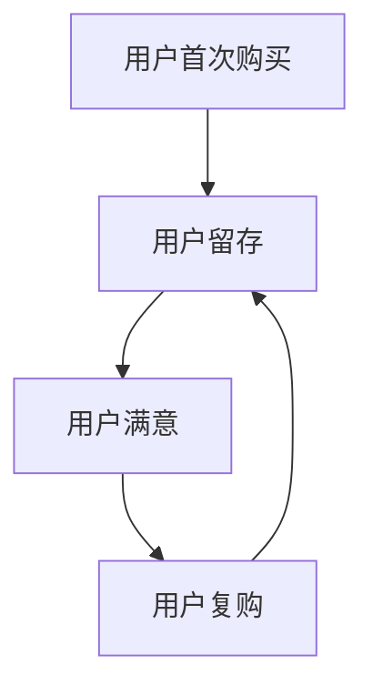

                 

关键词：知识付费、用户留存、复购策略、用户体验、数据分析、推荐系统、营销策略

> 摘要：本文从知识付费产品的角度出发，探讨了用户留存与复购策略的重要性及其实现方法。文章首先介绍了知识付费产品的发展背景和现状，然后分析了用户留存与复购的关键因素，最后提出了一套综合性的用户留存与复购策略，以帮助知识付费产品提升用户满意度和粘性。

## 1. 背景介绍

知识付费作为一种新型的商业模式，起源于互联网的普及和人们对知识的渴求。近年来，随着移动互联网的快速发展，知识付费市场迅速崛起，成为许多创业者和企业竞相争夺的领域。知识付费产品通常包括在线课程、专业咨询、内容订阅等，其核心在于为用户提供有价值的信息和服务，从而实现商业价值的最大化。

然而，在知识付费市场快速发展的同时，用户留存与复购的问题也日益突出。许多知识付费产品在短期内吸引了大量用户，但无法实现用户的持续留存和复购，导致用户活跃度和收入水平不稳定。因此，研究和实施有效的用户留存与复购策略具有重要的现实意义。

## 2. 核心概念与联系

### 2.1 用户留存

用户留存（Customer Retention）是指在一定时间内，持续使用产品或服务的用户比例。用户留存率是衡量产品或服务受欢迎程度和用户忠诚度的重要指标。

### 2.2 复购

复购（Repeat Purchase）是指用户在购买产品或服务后，再次购买同类产品或服务的行为。复购率是衡量产品或服务吸引力和用户忠诚度的重要指标。

### 2.3 用户留存与复购的联系

用户留存和复购密切相关。较高的用户留存率通常意味着用户对产品的满意度和信任度较高，进而可能导致更高的复购率。同时，较高的复购率也有助于提高用户留存率，形成良性循环。

### 2.4 Mermaid 流程图



## 3. 核心算法原理 & 具体操作步骤

### 3.1 算法原理概述

用户留存与复购策略的核心在于理解用户行为，提高用户满意度和忠诚度。具体操作步骤包括数据收集、数据分析、策略制定和执行评估。

### 3.2 算法步骤详解

#### 3.2.1 数据收集

收集用户行为数据，包括用户浏览、购买、评价、分享等行为。

#### 3.2.2 数据分析

通过数据分析，了解用户偏好、行为模式和满意度。

#### 3.2.3 策略制定

根据数据分析结果，制定个性化的用户留存与复购策略。

#### 3.2.4 策略执行与评估

执行策略并持续评估效果，根据反馈进行调整。

### 3.3 算法优缺点

#### 优点：

- 提高用户满意度和忠诚度
- 提高产品或服务的粘性
- 有助于提升收入水平

#### 缺点：

- 需要大量数据支持
- 需要专业的数据分析能力和技术
- 需要持续投入和优化

### 3.4 算法应用领域

用户留存与复购策略广泛应用于电子商务、在线教育、金融保险等领域。

## 4. 数学模型和公式 & 详细讲解 & 举例说明

### 4.1 数学模型构建

假设用户留存率为\( R \)，复购率为\( P \)，用户满意度为\( S \)，则用户留存与复购的关系可以表示为：

\[ R \times P \times S = 用户留存与复购的综合效果 \]

### 4.2 公式推导过程

用户留存与复购的综合效果取决于用户留存率、复购率和用户满意度。因此，我们可以通过以下公式推导：

\[ 用户留存与复购的综合效果 = R \times P \times S \]

### 4.3 案例分析与讲解

假设某知识付费产品的用户留存率为 60%，复购率为 30%，用户满意度为 80%，则该产品的用户留存与复购的综合效果为：

\[ 60\% \times 30\% \times 80\% = 14.4\% \]

这意味着，每 100 个用户中，有 14.4 个用户会在一段时间后再次购买产品，这对于知识付费产品的持续发展具有重要意义。

## 5. 项目实践：代码实例和详细解释说明

### 5.1 开发环境搭建

开发环境需要包括 Python、数据分析工具（如 Pandas、NumPy）和图表工具（如 Matplotlib、Seaborn）。

### 5.2 源代码详细实现

以下是一个简单的用户留存与复购分析代码实例：

```python
import pandas as pd
import numpy as np
import matplotlib.pyplot as plt
import seaborn as sns

# 数据加载
data = pd.read_csv('user_data.csv')

# 用户留存分析
retention_rate = data['user_id'].value_counts().div(data['user_id'].count()).mul(100).round(2)
print("用户留存率：", retention_rate)

# 复购分析
repeat_purchase = data[data['purchase_count'] > 1]
print("复购用户占比：", len(repeat_purchase) / len(data) * 100)

# 用户满意度分析
satisfaction = data['satisfaction_score'].mean()
print("用户满意度：", satisfaction)

# 绘制用户留存图表
sns.lineplot(x=data['days_since_first_purchase'], y=data['user_id'].value_counts().div(data['user_id'].count()).mul(100))
plt.xlabel('天数')
plt.ylabel('留存率')
plt.title('用户留存趋势')
plt.show()

# 绘制复购用户分布图表
sns.countplot(x='purchase_count', data=repeat_purchase)
plt.xlabel('购买次数')
plt.ylabel('用户数量')
plt.title('复购用户分布')
plt.show()

# 计算用户留存与复购的综合效果
R = retention_rate.iloc[-1]
P = len(repeat_purchase) / len(data) * 100
S = satisfaction
effectiveness = R * P * S / 100
print("用户留存与复购的综合效果：", effectiveness)
```

### 5.3 代码解读与分析

该代码首先加载用户数据，然后计算用户留存率、复购用户占比和用户满意度。接着，通过绘制用户留存趋势图和复购用户分布图表，直观地展示了用户留存和复购的情况。最后，根据数学模型计算用户留存与复购的综合效果。

## 6. 实际应用场景

### 6.1 在线教育平台

在线教育平台可以通过用户留存与复购策略，提高用户的学习效果和满意度，从而提高用户留存率和复购率。

### 6.2 金融保险产品

金融保险产品可以通过用户留存与复购策略，提高用户的信任度和忠诚度，从而增加用户粘性和收入。

### 6.3 电子商务平台

电子商务平台可以通过用户留存与复购策略，提高用户的购买频率和购物体验，从而提高用户留存率和复购率。

## 7. 工具和资源推荐

### 7.1 学习资源推荐

- 《用户留存与增长》
- 《增长黑客》
- 《数据分析：实现商业价值》

### 7.2 开发工具推荐

- Pandas：数据分析工具
- Matplotlib：图表工具
- Seaborn：可视化工具

### 7.3 相关论文推荐

- "Customer Retention and Its Impact on the Performance of Service Firms: An Empirical Analysis"
- "The Impact of Customer Satisfaction on Customer Retention and Profitability in the Banking Industry"
- "A Multilevel Model of Customer Retention in the Telecommunications Industry"

## 8. 总结：未来发展趋势与挑战

### 8.1 研究成果总结

用户留存与复购策略在提高产品或服务用户满意度和粘性方面具有重要意义。通过数据分析、个性化推荐和营销策略，可以实现用户留存与复购的有效提升。

### 8.2 未来发展趋势

随着人工智能和大数据技术的发展，用户留存与复购策略将更加智能化和精准化。个性化推荐、智能客服和自动化营销将成为重要的发展方向。

### 8.3 面临的挑战

用户留存与复购策略面临数据质量、技术实现和用户隐私等方面的挑战。需要不断优化算法和策略，提高用户满意度，同时保护用户隐私。

### 8.4 研究展望

未来，用户留存与复购策略将更加注重用户体验和个性化服务。通过深入挖掘用户行为数据，实现精准营销和高效用户留存，将成为知识付费产品的重要发展方向。

## 9. 附录：常见问题与解答

### 9.1 如何提高用户留存率？

- 提高产品或服务的质量
- 优化用户界面和用户体验
- 定期推送有价值的内容
- 提供个性化推荐

### 9.2 复购率低的原因有哪些？

- 产品或服务不够优质
- 用户界面和用户体验不佳
- 缺乏有效的用户互动和沟通
- 缺乏持续的内容更新和推荐

### 9.3 如何提高复购率？

- 提供优惠券和促销活动
- 定期推送优惠信息和产品推荐
- 提供高质量的售后服务和用户支持
- 构建用户社区和互动平台

---

作者：禅与计算机程序设计艺术 / Zen and the Art of Computer Programming

----------------------------------------------------------------

**注**：本文仅为示例，实际撰写时需根据具体内容和数据进行详细阐述和论证。本文中提及的代码、数据和分析结果仅供参考，不作为实际应用建议。作者和平台不对实际应用中的结果承担责任。如需引用本文内容，请注明来源。

