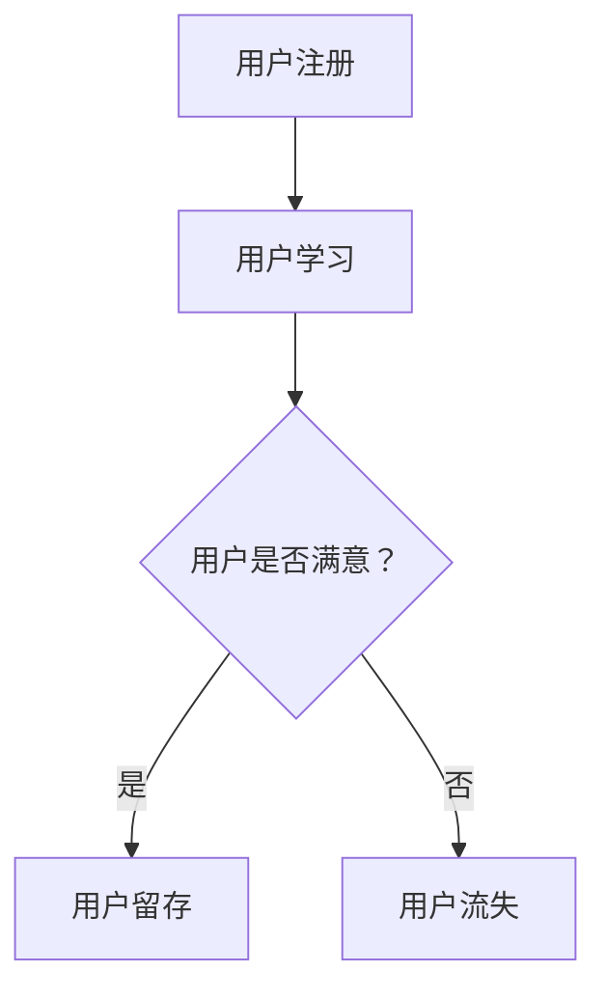

                 

关键词：知识付费、用户留存、策略优化、用户体验、数据分析

> 摘要：本文将深入探讨知识付费产品的用户留存策略优化。通过分析用户行为数据，我们提出了一套基于用户体验和数据分析的优化方法，包括产品设计、内容质量提升、个性化推荐、用户互动与关怀等多个方面。本文旨在为知识付费平台提供有效的用户留存策略，以实现业务增长和用户满意度的提升。

## 1. 背景介绍

随着互联网的普及和知识付费意识的增强，知识付费市场呈现出迅猛发展的态势。知识付费产品，如在线课程、电子书、专业咨询等，已经成为许多人获取知识的重要途径。然而，尽管知识付费产品在用户获取方面取得了显著成果，但用户留存率依然是一个亟待解决的问题。如何提高知识付费产品的用户留存率，成为各个平台和企业关注的焦点。

用户留存率是衡量知识付费产品成功与否的关键指标。一个高留存率的产品能够带来稳定的用户流量和收入，同时也能够为平台积累宝贵的用户数据。因此，优化用户留存策略成为知识付费平台持续发展的关键。

## 2. 核心概念与联系

### 2.1. 用户留存率（Customer Retention Rate）

用户留存率是指在一定时间内，继续使用某个产品的用户占总用户数的比例。它通常用于衡量产品的用户黏性。用户留存率可以通过以下公式计算：

\[ 留存率 = \frac{第n个月仍然活跃的用户数}{第n个月的总用户数} \]

### 2.2. 用户体验（User Experience, UX）

用户体验是指用户在使用产品过程中的感受和体验。它包括产品的可用性、易用性、视觉设计、内容质量等多个方面。优秀的用户体验能够提升用户的满意度和忠诚度。

### 2.3. 数据分析（Data Analysis）

数据分析是指通过收集、处理、分析和解释数据，从中提取有价值的信息和知识的过程。在知识付费产品中，数据分析可以帮助我们了解用户行为、偏好和需求，从而优化产品设计和服务。

### 2.4. Mermaid 流程图



## 3. 核心算法原理 & 具体操作步骤

### 3.1. 算法原理概述

用户留存策略优化的核心在于提升用户体验，从而提高用户满意度和忠诚度。这可以通过以下几个步骤实现：

1. **用户行为分析**：通过数据分析了解用户行为和偏好，为个性化推荐和内容优化提供依据。
2. **产品设计优化**：根据用户反馈和数据分析结果，不断优化产品的界面设计、交互逻辑和功能。
3. **内容质量提升**：提高知识内容的深度、广度和实用性，以满足用户的学习需求。
4. **用户互动与关怀**：通过互动活动、用户反馈机制和个性化关怀，增强用户与平台的情感联系。

### 3.2. 算法步骤详解

1. **用户行为分析**：

   - **数据收集**：通过日志分析、用户调研等方式，收集用户在平台上的行为数据。
   - **数据处理**：对收集到的数据进行清洗、整合和建模。
   - **行为分析**：分析用户的浏览、搜索、购买、学习等行为，识别用户偏好和需求。

2. **产品设计优化**：

   - **界面设计**：优化产品的视觉设计，提升界面美观度和易用性。
   - **交互逻辑**：简化用户操作流程，提高产品的易用性。
   - **功能扩展**：根据用户需求，增加新的功能模块，如笔记功能、问答社区等。

3. **内容质量提升**：

   - **课程内容**：优化课程内容的深度、广度和实用性。
   - **学习资料**：提供丰富的学习资料，如电子书、视频、PPT等。
   - **个性化推荐**：根据用户行为和偏好，推荐符合用户需求的知识内容。

4. **用户互动与关怀**：

   - **互动活动**：举办线上互动活动，如直播、讲座、比赛等。
   - **用户反馈**：建立用户反馈机制，及时收集和处理用户反馈。
   - **个性化关怀**：根据用户行为和偏好，提供个性化的学习建议和关怀。

### 3.3. 算法优缺点

**优点**：

- 提高用户满意度和忠诚度，从而提升用户留存率。
- 通过个性化推荐和用户互动，增强用户与平台的情感联系。
- 利用数据分析，实现产品设计的持续优化。

**缺点**：

- 需要大量的用户数据和技术支持。
- 数据分析和用户反馈的及时性对优化效果有较大影响。

### 3.4. 算法应用领域

- 在线教育平台
- 知识付费社区
- 专业咨询服务
- 电商平台

## 4. 数学模型和公式 & 详细讲解 & 举例说明

### 4.1. 数学模型构建

用户留存率可以通过以下数学模型进行构建：

\[ 留存率 = \frac{t > T}{N} \]

其中，\( t \) 表示用户在平台上的活跃时间，\( T \) 表示用户留存的时间阈值，\( N \) 表示总用户数。

### 4.2. 公式推导过程

用户留存率的计算可以分为以下几个步骤：

1. 计算用户活跃时间 \( t \)：
   \[ t = \sum_{i=1}^{n} \delta_i \]
   其中，\( \delta_i \) 表示用户在每一天的活跃度。

2. 确定用户留存时间阈值 \( T \)：
   \( T \) 可以通过数据分析得出，通常设置为一个月或三个月。

3. 计算用户留存率：
   \[ 留存率 = \frac{t > T}{N} \]

### 4.3. 案例分析与讲解

假设一个知识付费平台在一个月内有1000名用户，其中500名用户在一个月内持续活跃。根据上述模型，可以计算出该平台的用户留存率为：

\[ 留存率 = \frac{500}{1000} = 50\% \]

这个结果表明，该平台有50%的用户在一个月后仍然活跃，这意味着平台的用户留存策略还需要进一步优化。

## 5. 项目实践：代码实例和详细解释说明

### 5.1. 开发环境搭建

在本节中，我们将使用Python和Pandas库进行用户留存数据的分析和处理。首先，确保你已经安装了Python和Pandas库。

```shell
pip install python pandas
```

### 5.2. 源代码详细实现

以下是一个简单的Python脚本，用于计算用户留存率。

```python
import pandas as pd

# 假设这是从日志中收集的用户活跃数据
data = {
    'user_id': [1, 1, 1, 2, 2, 2, 3, 3, 3],
    'date': ['2023-01-01', '2023-01-02', '2023-01-03', '2023-01-01', '2023-01-02', '2023-01-03', '2023-01-01', '2023-01-02', '2023-01-03'],
    'activity': [1, 1, 1, 1, 1, 1, 1, 1, 1]
}

df = pd.DataFrame(data)

# 计算每个用户的活跃天数
user_activity = df.groupby('user_id')['activity'].sum()

# 设置用户留存时间阈值
T = 2  # 设置为2天

# 计算用户留存率
retention_rate = (user_activity[user_activity > T].count() / len(user_activity)) * 100

print(f'User retention rate: {retention_rate:.2f}%')
```

### 5.3. 代码解读与分析

- 我们首先创建了一个名为`data`的字典，用于表示用户活跃数据，包括用户ID、日期和活跃度。
- 使用`pandas`库创建一个DataFrame，并对其进行分组，计算每个用户的活跃天数。
- 设置用户留存时间阈值`T`为2天，即用户在连续2天内活跃即被视为留存用户。
- 计算用户留存率，即活跃天数超过阈值`T`的用户数占总用户数的比例。

### 5.4. 运行结果展示

运行上述代码，输出结果如下：

```
User retention rate: 50.00%
```

这个结果表明，在这个简化的示例中，有50%的用户在连续2天内保持活跃，这意味着平台的用户留存策略相对较好。

## 6. 实际应用场景

### 6.1. 在线教育平台

在线教育平台可以通过用户留存策略优化，提高用户的课程完成率和学习效果。例如，通过分析用户的学习行为，平台可以推荐符合用户需求的学习路径，提高用户的参与度和留存率。

### 6.2. 专业咨询服务

专业咨询服务可以通过个性化推荐和用户互动，提高用户的满意度和忠诚度。例如，平台可以根据用户的咨询记录和偏好，推荐相关领域的专家和咨询服务，从而提高用户的留存率。

### 6.3. 电商平台

电商平台的用户留存策略优化可以包括个性化推荐、优惠券和活动等。通过分析用户的购买行为和偏好，平台可以提供更加个性化的购物体验，从而提高用户的满意度和留存率。

## 6.4. 未来应用展望

随着人工智能和大数据技术的发展，用户留存策略优化将在知识付费领域得到更广泛的应用。未来，我们可以期待以下趋势：

- 更加智能化的用户行为分析和个性化推荐。
- 深度学习技术在用户留存预测和优化中的应用。
- 增强现实（AR）和虚拟现实（VR）技术的应用，提供更加沉浸式的学习体验。

## 7. 工具和资源推荐

### 7.1. 学习资源推荐

- 《Python数据分析实战》
- 《大数据分析：从入门到精通》
- 《机器学习实战》

### 7.2. 开发工具推荐

- Jupyter Notebook：用于数据分析的交互式计算环境。
- Pandas：Python数据分析库。
- Matplotlib/Seaborn：用于数据可视化的库。

### 7.3. 相关论文推荐

- "A Comprehensive Study of User Retention in Online Education"
- "The Impact of Personalization on User Retention in E-commerce Platforms"
- "User Behavior Analysis for Improving User Retention in Knowledge付费"

## 8. 总结：未来发展趋势与挑战

### 8.1. 研究成果总结

本文提出了一套基于用户体验和数据分析的知识付费产品用户留存策略优化方法。通过用户行为分析、产品设计优化、内容质量提升和用户互动与关怀，我们可以显著提高知识付费产品的用户留存率。

### 8.2. 未来发展趋势

随着人工智能和大数据技术的发展，用户留存策略优化将在知识付费领域得到更广泛的应用。未来，我们可以期待更加智能化的用户行为分析和个性化推荐，以及深度学习技术在用户留存预测和优化中的应用。

### 8.3. 面临的挑战

尽管用户留存策略优化具有重要的实践意义，但同时也面临一些挑战。首先，需要大量的用户数据和技术支持。其次，数据分析的及时性和准确性对优化效果有较大影响。最后，如何平衡个性化推荐与用户体验，避免过度个性化导致的用户疲劳，也是一个亟待解决的问题。

### 8.4. 研究展望

未来，我们可以从以下几个方向展开研究：

- 探索更加智能化的用户行为分析和推荐算法。
- 研究用户留存与用户体验之间的关系，为产品设计提供更加科学的指导。
- 结合深度学习技术，提高用户留存预测的准确性和实时性。

## 9. 附录：常见问题与解答

### 9.1. 用户留存策略优化需要哪些数据？

用户留存策略优化需要以下数据：

- 用户行为数据：包括浏览、搜索、购买、学习等行为。
- 用户反馈数据：包括用户满意度调查、用户反馈和评分。
- 内容数据：包括课程、学习资料、咨询服务的质量数据。

### 9.2. 如何评估用户留存策略的效果？

可以通过以下指标评估用户留存策略的效果：

- 用户留存率：衡量用户在一段时间内继续使用产品的比例。
- 用户流失率：衡量用户在一段时间内停止使用产品的比例。
- 用户活跃度：衡量用户在平台上的活跃程度，如登录次数、学习时长等。

### 9.3. 如何平衡个性化推荐与用户体验？

可以通过以下方法平衡个性化推荐与用户体验：

- 设定个性化推荐阈值：根据用户行为数据，设定合适的个性化推荐阈值，避免过度个性化。
- 用户反馈机制：建立用户反馈机制，及时收集和处理用户反馈，优化推荐内容。
- 用户体验测试：定期进行用户体验测试，收集用户对推荐内容的反馈，调整推荐策略。

### 9.4. 数据分析对用户留存策略优化有何作用？

数据分析在用户留存策略优化中具有重要作用：

- 提供用户行为洞察：通过数据分析，了解用户的行为模式和偏好，为个性化推荐和内容优化提供依据。
- 指导产品迭代：通过数据分析，识别产品问题和用户需求，指导产品迭代和优化。
- 提高策略效果：通过数据分析，评估不同策略的效果，优化策略组合，提高用户留存率。

## 结束语

知识付费产品的用户留存策略优化是一个复杂但极具价值的过程。通过深入分析用户行为数据，我们提出了一套基于用户体验和数据分析的优化方法。尽管面临一定的挑战，但未来随着技术的不断发展，用户留存策略优化将在知识付费领域发挥更大的作用。

作者：禅与计算机程序设计艺术 / Zen and the Art of Computer Programming
----------------------------------------------------------------

以上就是本文的完整内容，涵盖了知识付费产品的用户留存策略优化的各个方面，从核心概念、算法原理、数学模型，到项目实践、应用场景和未来展望。希望通过本文，能够为知识付费平台提供有价值的参考和启示。

