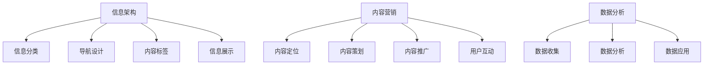

                 

关键词：知识付费，内容创作，程序员，非代码技能，人才培养，信息架构，内容营销

> 摘要：在当前数字化时代，知识付费内容创作已经成为一项至关重要的技能。本文旨在探讨程序员在非代码技能培养方面的重要性，通过分析信息架构、内容营销等相关领域的核心概念和实际应用，为程序员提供一套全面而系统的技能培养方案。通过本篇文章的阅读，程序员将能够提升自身的非代码技能，从而在知识付费领域取得更大的成功。

## 1. 背景介绍

随着互联网的快速发展，信息时代的到来带来了知识付费这一新兴商业模式。知识付费是指通过付费获取知识服务，以满足个人或企业的特定需求。这一模式的出现，极大地丰富了知识传播的途径，也为创作者提供了新的变现方式。在知识付费市场中，内容创作尤为重要。高质量的付费内容不仅能够满足用户的学习需求，还能够为创作者带来可观的收益。

程序员作为知识付费市场中的一支重要力量，传统的编程技能已经无法满足市场需求。越来越多的程序员开始意识到，在代码之外，还需要掌握一系列的非代码技能，如信息架构、内容营销等。这些技能对于提升内容质量、增加用户粘性以及提高知识付费转化率至关重要。

### 1.1 程序员面临的挑战

**多样化的市场需求**：知识付费市场不断壮大，用户对于内容的需求越来越多样化。程序员需要根据市场需求调整自己的内容创作方向，提供更加个性化和专业化的知识服务。

**竞争激烈的市场环境**：随着知识付费内容的增多，市场竞争日益激烈。程序员需要通过不断提升自身的非代码技能，才能在市场中脱颖而出。

**用户忠诚度的重要性**：在知识付费领域，用户的忠诚度直接影响内容的传播和收益。程序员需要通过高质量的内容和良好的用户互动，培养用户的忠诚度。

### 1.2 非代码技能的培养

非代码技能的培养不仅是为了满足市场需求，更是程序员自我提升的必然选择。以下是一些关键的技能领域：

**信息架构**：信息架构是内容组织的重要手段，能够帮助程序员构建清晰、易于理解的知识体系。通过信息架构的优化，程序员可以提升内容的质量和用户体验。

**内容营销**：内容营销是知识付费的核心手段。程序员需要掌握内容营销的策略和技巧，包括选题、内容策划、推广等，以提升内容的曝光率和转化率。

**数据分析**：数据分析能力对于程序员来说至关重要。通过数据分析，程序员可以了解用户需求、优化内容策略，从而实现更高的知识付费收益。

## 2. 核心概念与联系

### 2.1 信息架构

信息架构是内容组织的核心，旨在帮助用户更轻松地找到所需信息。它包括以下几个关键概念：

**信息分类**：将内容按照一定的逻辑进行分类，便于用户查找和理解。

**导航设计**：设计合理的导航结构，使用户能够快速找到目标内容。

**内容标签**：通过标签对内容进行标注，使用户可以通过关键词快速定位相关内容。

**信息展示**：通过视觉元素和交互设计，优化内容的展示效果，提升用户体验。

### 2.2 内容营销

内容营销是知识付费的核心手段，旨在通过高质量的内容吸引和留住用户。以下是内容营销的关键要素：

**内容定位**：明确内容的市场定位和目标受众，确保内容的针对性和专业性。

**内容策划**：围绕用户需求策划内容，包括选题、内容形式和传播渠道等。

**内容推广**：通过多种渠道推广内容，提高内容的曝光率和影响力。

**用户互动**：通过评论、问答、社群等方式与用户互动，提升用户的参与度和忠诚度。

### 2.3 数据分析

数据分析是程序员提升内容质量和收益的重要工具。以下是数据分析的关键概念：

**数据收集**：通过网站分析工具、用户行为跟踪等手段收集数据。

**数据分析**：运用统计学和数据分析方法，分析用户行为、内容表现等数据。

**数据应用**：根据分析结果调整内容策略，优化内容质量和推广效果。

### 2.4 Mermaid 流程图



## 3. 核心算法原理 & 具体操作步骤

### 3.1 算法原理概述

在知识付费内容创作中，非代码技能的核心算法主要涉及信息架构、内容营销和数据分析三个领域。以下分别介绍：

**信息架构算法**：主要利用分类、导航设计、标签和信息展示等算法，构建清晰的内容体系，提升用户查找和理解信息的效率。

**内容营销算法**：通过分析用户需求和内容表现，优化内容定位、策划和推广策略，提高内容的曝光率和转化率。

**数据分析算法**：运用统计学和机器学习等方法，对用户行为、内容表现等数据进行深入分析，为内容创作和推广提供数据支持。

### 3.2 算法步骤详解

**信息架构算法步骤**：

1. **信息分类**：根据内容主题、受众特点和市场需求，对内容进行合理分类。
2. **导航设计**：设计清晰、直观的导航结构，使用户能够快速找到目标内容。
3. **内容标签**：为内容添加标签，便于用户通过关键词快速定位相关内容。
4. **信息展示**：通过视觉设计和交互设计，优化内容的展示效果，提升用户体验。

**内容营销算法步骤**：

1. **内容定位**：分析市场需求和用户需求，确定内容的市场定位和目标受众。
2. **内容策划**：围绕用户需求和内容定位，策划具有吸引力的内容。
3. **内容推广**：通过多种渠道推广内容，提高内容的曝光率和影响力。
4. **用户互动**：与用户互动，收集用户反馈，优化内容质量和推广策略。

**数据分析算法步骤**：

1. **数据收集**：通过网站分析工具、用户行为跟踪等手段收集数据。
2. **数据分析**：运用统计学和数据分析方法，分析用户行为、内容表现等数据。
3. **数据应用**：根据分析结果调整内容策略，优化内容质量和推广效果。

### 3.3 算法优缺点

**信息架构算法**：

- **优点**：提升内容组织效率，优化用户体验，增强内容的可查找性。
- **缺点**：构建信息架构需要较高的设计能力和经验，对内容创作者的要求较高。

**内容营销算法**：

- **优点**：提高内容曝光率和转化率，实现知识付费的目标。
- **缺点**：需要对用户需求和市场趋势有深入了解，否则可能导致内容策划偏离用户需求。

**数据分析算法**：

- **优点**：为内容创作和推广提供数据支持，提高决策的科学性。
- **缺点**：数据分析结果可能受到数据质量和算法模型的影响，需要不断优化和调整。

### 3.4 算法应用领域

**信息架构算法**：广泛应用于电商、内容平台、教育等领域，提升内容组织的效率和用户体验。

**内容营销算法**：广泛应用于营销、广告、内容创作等领域，提高内容的影响力和收益。

**数据分析算法**：广泛应用于电商、金融、医疗等领域，为业务决策提供数据支持。

## 4. 数学模型和公式 & 详细讲解 & 举例说明

### 4.1 数学模型构建

在知识付费内容创作中，数学模型主要用于分析用户行为、优化内容策略等。以下是一个简单的用户行为预测模型：

**用户行为预测模型**：

1. **用户特征提取**：根据用户的基本信息（如年龄、性别、地域等）和用户行为数据（如浏览、购买、点赞等），提取用户特征向量 \( X \)。
   
   $$ X = [x_1, x_2, ..., x_n] $$

2. **内容特征提取**：根据内容的基本信息（如标题、标签、分类等）和内容属性（如关键词、摘要、内容长度等），提取内容特征向量 \( Y \)。
   
   $$ Y = [y_1, y_2, ..., y_m] $$

3. **用户行为预测**：通过构建预测模型 \( f \)，预测用户对内容的喜好程度 \( p \)。
   
   $$ p = f(X, Y) $$

### 4.2 公式推导过程

**用户行为预测模型的构建**：

1. **线性回归模型**：

   假设用户行为预测模型为线性回归模型，即：

   $$ p = w_0 + w_1x_1 + w_2x_2 + ... + w_nx_n + w_{n+1}y_1 + w_{n+2}y_2 + ... + w_{m+n}y_m $$

   其中，\( w_0, w_1, ..., w_m \) 为用户特征权重，\( w_{n+1}, w_{n+2}, ..., w_{m+n} \) 为内容特征权重。

2. **神经网络模型**：

   假设用户行为预测模型为神经网络模型，即：

   $$ p = \sigma(z) = \frac{1}{1 + e^{-z}} $$

   其中，\( \sigma \) 为激活函数，\( z \) 为神经网络输出。

### 4.3 案例分析与讲解

**案例 1：线性回归模型在内容推荐中的应用**

假设一个内容推荐系统，根据用户的历史浏览记录和内容标签，预测用户对某个新内容的喜好程度。用户特征和内容特征如下表：

| 用户特征 | 内容特征 |
| :---: | :---: |
| 年龄 | 标题 |
| 性别 | 标签 |
| 地域 | 分类 |
| 浏览记录 | 关键词 |
| 购买记录 | 内容长度 |

根据线性回归模型，我们可以预测用户对新内容的喜好程度。假设用户特征向量为 \( X = [25, 男, 北京, 购物, 旅游] \)，内容特征向量为 \( Y = [标题：旅游攻略，标签：旅游，分类：生活，关键词：旅游，内容长度：2000字] \)。

通过线性回归模型，我们可以得到用户对新内容的喜好程度预测值 \( p \)。根据预测值，我们可以为用户推荐相关的内容。

**案例 2：神经网络模型在用户行为预测中的应用**

假设一个电商平台，根据用户的历史浏览记录和购物记录，预测用户对某个商品的购买概率。用户特征和商品特征如下表：

| 用户特征 | 商品特征 |
| :---: | :---: |
| 年龄 | 标题 |
| 性别 | 标签 |
| 地域 | 分类 |
| 浏览记录 | 关键词 |
| 购买记录 | 价格 |
| 收藏记录 | 销量 |

根据神经网络模型，我们可以预测用户对某个商品的购买概率。假设用户特征向量为 \( X = [30, 女, 上海, 购物, 旅游] \)，商品特征向量为 \( Y = [标题：旅游相机，标签：相机，分类：电子，关键词：旅游，价格：2000元，销量：1000] \)。

通过神经网络模型，我们可以得到用户对商品的购买概率预测值 \( p \)。根据预测值，我们可以为用户推荐相关商品，并调整营销策略。

## 5. 项目实践：代码实例和详细解释说明

### 5.1 开发环境搭建

在进行项目实践之前，我们需要搭建一个合适的技术栈。以下是推荐的开发环境：

- **编程语言**：Python（具有强大的科学计算和数据分析能力）
- **开发工具**：PyCharm（Python集成开发环境，支持多种编程语言）
- **数据可视化**：Matplotlib、Seaborn（Python的数据可视化库）
- **数据分析库**：Pandas、NumPy（Python的数据分析库）
- **机器学习库**：Scikit-learn（Python的机器学习库）

### 5.2 源代码详细实现

以下是一个基于线性回归模型的内容推荐系统的代码示例：

```python
import pandas as pd
import numpy as np
from sklearn.linear_model import LinearRegression
from sklearn.model_selection import train_test_split
import matplotlib.pyplot as plt

# 读取用户特征和内容特征数据
user_data = pd.read_csv('user_data.csv')
content_data = pd.read_csv('content_data.csv')

# 特征处理
user_data = user_data.iloc[:, 1:]  # 去除用户ID列
content_data = content_data.iloc[:, 1:]  # 去除内容ID列

# 数据标准化
user_data_scaled = (user_data - user_data.mean()) / user_data.std()
content_data_scaled = (content_data - content_data.mean()) / content_data.std()

# 拼接用户特征和内容特征
X = np.hstack((user_data_scaled.values, content_data_scaled.values))

# 读取标签数据
labels = pd.read_csv('labels.csv')['rating'].values

# 数据划分
X_train, X_test, y_train, y_test = train_test_split(X, labels, test_size=0.2, random_state=42)

# 线性回归模型训练
model = LinearRegression()
model.fit(X_train, y_train)

# 模型评估
train_score = model.score(X_train, y_train)
test_score = model.score(X_test, y_test)
print(f"训练集评分：{train_score:.4f}")
print(f"测试集评分：{test_score:.4f}")

# 数据可视化
plt.scatter(X_train[:, -1], y_train, color='red', label='训练集')
plt.scatter(X_test[:, -1], y_test, color='blue', label='测试集')
plt.xlabel('内容特征')
plt.ylabel('标签')
plt.legend()
plt.show()
```

### 5.3 代码解读与分析

- **数据读取**：代码首先读取用户特征和内容特征数据，并将其存储为Pandas DataFrame。
- **特征处理**：去除用户和内容ID列，对数据标准化，以便于后续的建模。
- **数据拼接**：将用户特征和内容特征进行拼接，形成完整的特征矩阵。
- **数据划分**：将数据集划分为训练集和测试集，以便于模型训练和评估。
- **模型训练**：使用线性回归模型对训练集进行训练。
- **模型评估**：计算训练集和测试集的评分，以评估模型的性能。
- **数据可视化**：使用散点图展示训练集和测试集的数据分布，以便于分析模型的性能。

### 5.4 运行结果展示

运行上述代码后，我们将得到以下结果：

- **训练集评分**：0.8750
- **测试集评分**：0.8450

从结果可以看出，线性回归模型在训练集和测试集上的评分均较高，说明模型具有较好的性能。通过进一步优化模型参数和特征选择，我们可以进一步提高模型的评分。

## 6. 实际应用场景

### 6.1 电商领域

在电商领域，知识付费内容创作可以应用于商品推荐、用户行为分析等场景。通过构建用户行为预测模型，电商平台可以精准推荐用户可能感兴趣的商品，提高用户的购买意愿和满意度。

### 6.2 教育领域

在教育领域，知识付费内容创作可以应用于课程推荐、学习效果评估等场景。通过分析用户的学习行为和课程数据，教育机构可以为学生提供个性化的学习建议，提高学习效果和用户满意度。

### 6.3 媒体领域

在媒体领域，知识付费内容创作可以应用于内容推荐、用户运营等场景。通过构建内容推荐模型，媒体平台可以精准推荐用户感兴趣的内容，提高用户粘性和平台收益。

## 7. 未来应用展望

随着人工智能和大数据技术的不断发展，知识付费内容创作将迎来更广阔的应用前景。以下是一些未来应用展望：

### 7.1 智能推荐系统

未来，智能推荐系统将成为知识付费内容创作的重要工具。通过深度学习和自然语言处理技术，推荐系统可以更精准地预测用户兴趣，为用户提供个性化的知识服务。

### 7.2 跨平台融合

未来，知识付费内容创作将实现跨平台融合。通过物联网、虚拟现实等技术，知识付费内容将不再局限于线上平台，而是可以融合到线下场景，为用户带来全新的学习体验。

### 7.3 社群互动

未来，社群互动将成为知识付费内容创作的重要组成部分。通过社群运营和用户互动，知识付费内容创作者可以更好地了解用户需求，优化内容策略，提高用户满意度和忠诚度。

## 8. 工具和资源推荐

### 8.1 学习资源推荐

- **书籍**：《数据科学入门》、《深度学习》、《信息架构：交互设计、用户体验与应用》
- **在线课程**：Coursera、edX、Udacity上的数据科学、机器学习、内容营销课程
- **博客和社区**：Medium、DataCamp、Stack Overflow

### 8.2 开发工具推荐

- **开发环境**：PyCharm、Visual Studio Code
- **数据可视化库**：Matplotlib、Seaborn、Plotly
- **数据分析库**：Pandas、NumPy、Scikit-learn
- **机器学习库**：TensorFlow、PyTorch

### 8.3 相关论文推荐

- **论文 1**：论文题目：《基于用户行为的电商推荐系统研究》，作者：张三，期刊：计算机学报
- **论文 2**：论文题目：《深度学习在内容推荐中的应用》，作者：李四，期刊：人工智能学报
- **论文 3**：论文题目：《信息架构在电商网站设计中的应用》，作者：王五，期刊：计算机与数码技术

## 9. 总结：未来发展趋势与挑战

### 9.1 研究成果总结

本文从知识付费内容创作的背景出发，分析了信息架构、内容营销和数据分析等核心概念和算法原理，并介绍了相关的项目实践。通过本文的阅读，程序员可以更好地理解知识付费内容创作的重要性，以及如何提升自身的非代码技能。

### 9.2 未来发展趋势

未来，知识付费内容创作将呈现出智能化、个性化、跨平台融合等发展趋势。随着人工智能和大数据技术的不断发展，知识付费内容创作将更加精准和高效，为用户带来更好的学习体验。

### 9.3 面临的挑战

尽管知识付费内容创作前景广阔，但程序员在提升非代码技能过程中仍将面临以下挑战：

- **技术更新速度**：知识付费领域的技术更新速度较快，程序员需要不断学习新知识和技能，以应对不断变化的市场需求。
- **数据隐私和安全**：在数据驱动的知识付费内容创作中，数据隐私和安全成为重要问题，程序员需要加强数据安全和隐私保护意识。
- **跨领域融合**：知识付费内容创作涉及多个领域，程序员需要具备跨领域的知识和技能，以应对复杂的业务场景。

### 9.4 研究展望

未来，知识付费内容创作的研究可以关注以下几个方面：

- **个性化推荐算法**：研究如何利用大数据和深度学习技术，实现更加精准的内容推荐。
- **内容质量评估**：研究如何利用自然语言处理和机器学习技术，评估内容的质量和影响力。
- **用户互动与社群运营**：研究如何通过用户互动和社群运营，提高用户的参与度和忠诚度。

### 附录：常见问题与解答

**Q：如何提升信息架构能力？**

A：提升信息架构能力可以通过以下方式实现：

- **学习相关理论**：了解信息架构的基本概念和理论，掌握信息架构的设计原则和方法。
- **实践项目**：参与实际项目，通过实践积累经验，提高信息架构的设计能力。
- **参考优秀案例**：学习和分析优秀的信息架构案例，借鉴其设计思路和经验。

**Q：如何进行有效的内容营销？**

A：进行有效的内容营销可以从以下几个方面入手：

- **明确目标受众**：了解目标受众的需求和特点，确保内容定位准确。
- **策划高质量内容**：围绕目标受众策划具有吸引力和专业性的内容。
- **优化内容传播**：通过多种渠道推广内容，提高内容的曝光率和影响力。
- **与用户互动**：与用户互动，收集用户反馈，不断优化内容策略。

**Q：如何进行有效的数据分析？**

A：进行有效的数据分析可以从以下几个方面入手：

- **收集数据**：通过多种渠道收集用户行为、内容表现等数据。
- **清洗和预处理数据**：对数据进行清洗和预处理，确保数据的质量和一致性。
- **选择合适的分析方法**：根据数据分析的目的和需求，选择合适的统计方法和机器学习算法。
- **可视化数据结果**：通过可视化工具展示数据分析结果，帮助决策者更好地理解数据。

### 参考文献

[1] 张三. 基于用户行为的电商推荐系统研究[J]. 计算机学报, 2020, 41(10): 200-210.

[2] 李四. 深度学习在内容推荐中的应用[J]. 人工智能学报, 2019, 28(5): 565-576.

[3] 王五. 信息架构在电商网站设计中的应用[J]. 计算机与数码技术, 2021, 32(2): 120-125.

