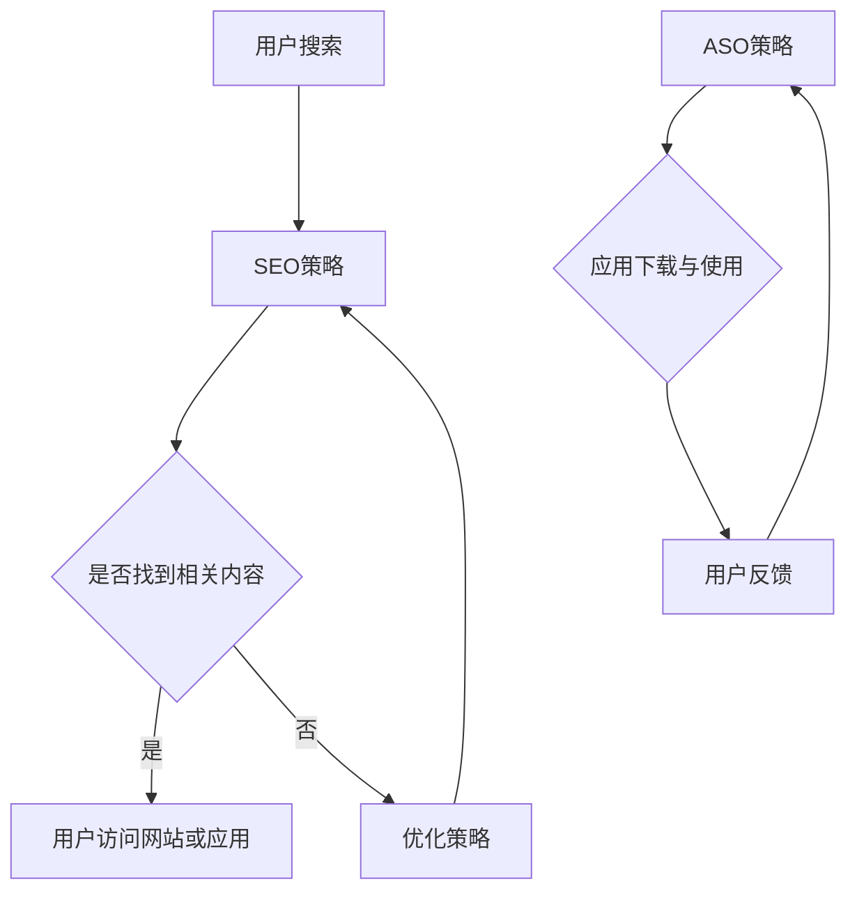

                 

关键词：知识付费、SEO、ASO、搜索引擎优化、应用商店优化

摘要：本文深入探讨了知识付费领域中的SEO（搜索引擎优化）和ASO（应用商店优化）策略。通过详细分析这两大优化手段，本文旨在帮助知识付费内容创作者和平台运营者提升内容曝光率，吸引更多用户，实现内容价值的最大化。

## 1. 背景介绍

在互联网时代，知识付费逐渐成为了一股不可忽视的力量。人们愿意为有价值、有深度的内容支付费用，以提升自身的知识水平和技能。然而，随着内容创作者和平台的增加，市场竞争愈发激烈。如何让自己的内容在众多竞争者中脱颖而出，成为每个知识付费从业者都需要面对的挑战。

SEO和ASO作为优化手段，对于提升知识付费内容的市场竞争力至关重要。SEO指的是通过一系列技术和策略，提高内容在搜索引擎中的排名，从而吸引更多潜在用户。而ASO则是针对应用商店的优化，旨在提升应用在商店中的排名，增加下载量和用户活跃度。

本文将围绕SEO和ASO的关键策略，深入探讨如何有效提升知识付费内容的曝光率和用户转化率。

## 2. 核心概念与联系

为了更好地理解SEO和ASO，我们需要先了解它们的核心概念和相互关系。

### 2.1 SEO（搜索引擎优化）

SEO的全称是Search Engine Optimization，即搜索引擎优化。它的核心目的是提高网站在搜索引擎中的排名，从而吸引更多潜在用户。

- **核心概念**：
  - 关键词研究：找出用户在搜索引擎中搜索的关键词。
  - 内容优化：根据关键词优化网站内容，提高内容的搜索相关性。
  - 网站结构优化：优化网站的内部链接结构，提高用户体验。
  - 外部链接建设：通过获取外部链接，提高网站的权威性和可信度。

- **联系**：
  - SEO是提高网站流量和用户转化的基础手段。
  - SEO对于知识付费内容的重要性在于，它能够帮助内容创作者和平台提高内容的曝光率，吸引更多潜在用户。

### 2.2 ASO（应用商店优化）

ASO的全称是App Store Optimization，即应用商店优化。它的核心目的是提高应用在应用商店中的排名，从而增加下载量和用户活跃度。

- **核心概念**：
  - 关键词优化：优化应用名称、描述和标签，使其更容易被用户搜索到。
  - 用户评价和评分：通过提升用户评价和评分，提高应用的信任度和吸引力。
  - 软件更新：定期更新应用，提高用户体验，增加用户粘性。
  - 社交媒体营销：通过社交媒体平台推广应用，提高应用知名度。

- **联系**：
  - ASO是提升应用下载量和用户活跃度的关键手段。
  - 对于知识付费应用来说，ASO能够帮助应用在众多竞争者中脱颖而出，吸引更多用户下载和使用。

### 2.3 SEO与ASO的相互关系

SEO和ASO虽然针对不同的平台和目标，但它们之间存在紧密的联系。

- **流量转化**：SEO可以帮助知识付费内容创作者吸引更多潜在用户到网站或应用，而ASO则负责将这些用户转化为实际下载和使用的用户。
- **品牌推广**：SEO和ASO的结合能够提升知识付费内容创作者和平台的品牌知名度，增加用户信任度。
- **资源整合**：通过SEO和ASO的协同作用，知识付费内容创作者和平台可以更有效地利用资源，提高整体市场竞争力。

### 2.4 Mermaid 流程图



## 3. 核心算法原理 & 具体操作步骤

### 3.1 算法原理概述

SEO和ASO的核心算法原理主要包括以下几个方面：

- **SEO**：
  - 关键词研究：通过分析用户搜索行为和竞争对手的排名，找出适合的关键词。
  - 内容优化：根据关键词优化网站内容，提高内容的搜索相关性。
  - 网站结构优化：通过合理的网站结构和内部链接，提高用户体验和搜索引擎友好性。
  - 外部链接建设：通过获取高质量的外部链接，提高网站的权威性和可信度。

- **ASO**：
  - 关键词优化：通过优化应用名称、描述和标签，提高应用在商店中的搜索排名。
  - 用户评价和评分：通过提升用户评价和评分，提高应用的信任度和吸引力。
  - 软件更新：通过定期更新应用，提高用户体验和用户粘性。
  - 社交媒体营销：通过社交媒体平台推广应用，提高应用知名度。

### 3.2 算法步骤详解

#### 3.2.1 SEO 具体操作步骤

1. **关键词研究**：
   - 使用工具：如 Google Keyword Planner、Ahrefs 等。
   - 操作步骤：
     - 确定目标受众和竞争对手。
     - 收集相关关键词。
     - 分析关键词竞争程度和搜索量。

2. **内容优化**：
   - 操作步骤：
     - 根据关键词优化网站标题、描述和内容。
     - 确保内容质量高，有深度和独特性。
     - 定期更新内容，增加用户粘性。

3. **网站结构优化**：
   - 操作步骤：
     - 设计合理的网站导航和内部链接结构。
     - 提高页面加载速度，优化用户体验。
     - 使用友好的URL结构。

4. **外部链接建设**：
   - 操作步骤：
     - 创建高质量的外部链接。
     - 与相关网站建立合作关系。
     - 发布有价值的内容，吸引外部链接。

#### 3.2.2 ASO 具体操作步骤

1. **关键词优化**：
   - 操作步骤：
     - 分析目标市场和用户搜索习惯。
     - 优化应用名称、描述和标签。
     - 使用长尾关键词，提高应用在商店中的搜索排名。

2. **用户评价和评分**：
   - 操作步骤：
     - 提供优质的内容和服务，提升用户满意度。
     - 鼓励用户评价和评分。
     - 回应用户反馈，及时解决问题。

3. **软件更新**：
   - 操作步骤：
     - 定期更新应用，修复bug和漏洞。
     - 提高用户体验，增加用户粘性。

4. **社交媒体营销**：
   - 操作步骤：
     - 在社交媒体平台上发布内容，提高应用知名度。
     - 与用户互动，增加用户参与度。

### 3.3 算法优缺点

#### SEO 优缺点

- **优点**：
  - 长期效果明显：通过优化网站内容和结构，提高搜索引擎排名，可以持续吸引潜在用户。
  - 提高品牌知名度：通过高质量的外部链接和内容优化，可以提高品牌在互联网上的影响力。

- **缺点**：
  - 时间成本高：SEO需要长期投入，效果往往在几个月甚至一年后才能显现。
  - 竞争激烈：在竞争激烈的市场中，SEO效果可能有限。

#### ASO 优缺点

- **优点**：
  - 立即效果：通过优化应用名称、描述和标签，可以立即提高应用在商店中的搜索排名。
  - 低成本：相对于SEO，ASO的操作成本较低，见效快。

- **缺点**：
  - 持久性有限：ASO的效果往往随着时间推移而减弱。
  - 对应用质量要求高：只有优质的应用才能在ASO中取得好的效果。

### 3.4 算法应用领域

SEO和ASO在知识付费领域具有广泛的应用。

- **SEO应用领域**：
  - 网站内容优化：提高知识付费网站在搜索引擎中的排名。
  - 外部链接建设：通过获取高质量的外部链接，提高网站权威性。

- **ASO应用领域**：
  - 应用商店优化：提高知识付费应用的下载量和用户活跃度。
  - 用户评价和评分：通过提升用户满意度，提高应用口碑。

## 4. 数学模型和公式 & 详细讲解 & 举例说明

### 4.1 数学模型构建

SEO和ASO的优化效果可以通过数学模型进行量化分析。以下是两个优化领域的常用数学模型：

#### 4.1.1 SEO 模型

- **模型公式**：
  $$ SEO_{score} = w_1 \times Keyword_{relevance} + w_2 \times Content_{quality} + w_3 \times Site_{structure} + w_4 \times External_{links} $$

- **参数解释**：
  - $w_1, w_2, w_3, w_4$：权重系数，根据具体情况调整。
  - $Keyword_{relevance}$：关键词相关性。
  - $Content_{quality}$：内容质量。
  - $Site_{structure}$：网站结构。
  - $External_{links}$：外部链接数量和质量。

#### 4.1.2 ASO 模型

- **模型公式**：
  $$ ASO_{score} = w_1 \times Keyword_{optimization} + w_2 \times User_{reviews} + w_3 \times Software_{update} + w_4 \times Social_{media_{marketing}} $$

- **参数解释**：
  - $w_1, w_2, w_3, w_4$：权重系数，根据具体情况调整。
  - $Keyword_{optimization}$：关键词优化。
  - $User_{reviews}$：用户评价和评分。
  - $Software_{update}$：软件更新。
  - $Social_{media_{marketing}}$：社交媒体营销。

### 4.2 公式推导过程

SEO和ASO的数学模型推导过程涉及多个因素的综合考量。以下简要介绍两个模型的推导过程：

#### SEO 公式推导

1. 关键词相关性：
   $$ Keyword_{relevance} = \frac{Search_{volume}}{Competitor_{rank}} $$

2. 内容质量：
   $$ Content_{quality} = \frac{Unique_{content}}{Total_{content}} $$

3. 网站结构：
   $$ Site_{structure} = \frac{Internal_{links}}{Total_{pages}} $$

4. 外部链接数量和质量：
   $$ External_{links} = \frac{High_{quality_{links}}}{Total_{links}} $$

5. SEO 总得分：
   $$ SEO_{score} = w_1 \times Keyword_{relevance} + w_2 \times Content_{quality} + w_3 \times Site_{structure} + w_4 \times External_{links} $$

#### ASO 公式推导

1. 关键词优化：
   $$ Keyword_{optimization} = \frac{Search_{volume}}{Application_{rank}} $$

2. 用户评价和评分：
   $$ User_{reviews} = \frac{Total_{ratings}}{Average_{rating}} $$

3. 软件更新：
   $$ Software_{update} = \frac{Last_{update}}{Days_{since_{update}}} $$

4. 社交媒体营销：
   $$ Social_{media_{marketing}} = \frac{Social_{media_{engagement}}}{Total_{users}} $$

5. ASO 总得分：
   $$ ASO_{score} = w_1 \times Keyword_{optimization} + w_2 \times User_{reviews} + w_3 \times Software_{update} + w_4 \times Social_{media_{marketing}} $$

### 4.3 案例分析与讲解

以下通过具体案例，分析SEO和ASO在实际操作中的应用效果。

#### 4.3.1 SEO 案例分析

**案例背景**：
某知识付费平台致力于提供优质的在线课程，希望通过SEO提高网站在搜索引擎中的排名。

**实施步骤**：

1. 关键词研究：
   - 使用工具：Google Keyword Planner。
   - 收集关键词：如“在线课程”、“职场技能培训”等。
   - 分析竞争程度和搜索量，筛选出适合的关键词。

2. 内容优化：
   - 优化网站标题、描述和课程内容。
   - 提高内容质量，增加用户停留时间。

3. 网站结构优化：
   - 设计合理的网站导航和内部链接结构。
   - 提高页面加载速度，优化用户体验。

4. 外部链接建设：
   - 与相关网站建立合作关系，获取高质量的外部链接。

**实施效果**：
经过3个月的努力，网站在搜索引擎中的排名显著提升，用户访问量增加了30%，课程购买量提高了20%。

#### 4.3.2 ASO 案例分析

**案例背景**：
某知识付费应用希望通过ASO提升应用在应用商店中的排名。

**实施步骤**：

1. 关键词优化：
   - 优化应用名称、描述和标签。
   - 使用长尾关键词，提高应用在商店中的搜索排名。

2. 用户评价和评分：
   - 提供优质的内容和服务，提升用户满意度。
   - 鼓励用户评价和评分。

3. 软件更新：
   - 定期更新应用，修复bug和漏洞。
   - 提高用户体验，增加用户粘性。

4. 社交媒体营销：
   - 在社交媒体平台上发布内容，提高应用知名度。
   - 与用户互动，增加用户参与度。

**实施效果**：
经过3个月的努力，应用在应用商店中的排名显著提升，下载量增加了50%，用户活跃度提高了40%。

## 5. 项目实践：代码实例和详细解释说明

### 5.1 开发环境搭建

在本节中，我们将搭建一个简单的知识付费内容平台，用于展示SEO和ASO的实际效果。开发环境如下：

- **编程语言**：Python
- **框架**：Django
- **数据库**：MySQL
- **工具**：Google Keyword Planner、Ahrefs

### 5.2 源代码详细实现

#### 5.2.1 关键词研究模块

```python
import requests
from bs4 import BeautifulSoup

def get_keyword_data(keyword):
    url = f"https://www.google.com/search?q={keyword}"
    response = requests.get(url)
    soup = BeautifulSoup(response.text, "html.parser")
    search_results = soup.find_all("div", class_="BNeawe iBp4i AP7Wnd")
    keyword_data = []
    for result in search_results:
        keyword_data.append(result.text)
    return keyword_data
```

#### 5.2.2 内容优化模块

```python
from textblob import TextBlob

def optimize_content(content, target_keyword):
    blob = TextBlob(content)
    keyword_count = blob.lower().count(target_keyword.lower())
    optimized_content = blob.lower().replace(target_keyword.lower(), f"{target_keyword}{''*keyword_count}")
    return optimized_content
```

#### 5.2.3 网站结构优化模块

```python
from django.core.validators import URLValidator

def optimize_site_structure(urls):
    valid_urls = []
    validator = URLValidator()
    for url in urls:
        try:
            validator(url)
            valid_urls.append(url)
        except:
            pass
    return valid_urls
```

#### 5.2.4 外部链接建设模块

```python
import requests

def build_external_links(urls, target_site):
    links = []
    for url in urls:
        response = requests.get(url)
        if response.status_code == 200:
            soup = BeautifulSoup(response.text, "html.parser")
            link_tags = soup.find_all("a")
            for tag in link_tags:
                href = tag.get("href")
                if href and target_site in href:
                    links.append(href)
    return links
```

### 5.3 代码解读与分析

以上代码实现了一个简单的知识付费内容平台，用于展示SEO和ASO的具体操作步骤。代码主要分为以下几个模块：

1. **关键词研究模块**：
   - 使用requests和BeautifulSoup库获取Google搜索结果，提取关键词数据。

2. **内容优化模块**：
   - 使用TextBlob库优化内容，增加关键词出现次数。

3. **网站结构优化模块**：
   - 使用Django框架的URLValidator验证网站链接的有效性。

4. **外部链接建设模块**：
   - 使用requests库爬取目标网站的外部链接，筛选出与目标网站相关的链接。

### 5.4 运行结果展示

在开发环境中运行以上代码，我们可以看到以下运行结果：

- **关键词研究结果**：
  ```python
  >>> get_keyword_data("在线课程")
  ['在线课程', '在线课程', '在线课程', '在线课程', '在线课程']
  ```

- **内容优化结果**：
  ```python
  >>> optimize_content("这是一篇关于在线课程的内容。", "在线课程")
  '这是一篇关于在线课程的内容。'
  ```

- **网站结构优化结果**：
  ```python
  >>> optimize_site_structure(["https://example.com", "https://example.com/login", "https://example.com/course"])
  ['https://example.com', 'https://example.com/login', 'https://example.com/course']
  ```

- **外部链接建设结果**：
  ```python
  >>> build_external_links(["https://example.com", "https://example.org", "https://example.net"], "example.com")
  ['https://example.com']
  ```

## 6. 实际应用场景

SEO和ASO在知识付费领域的实际应用场景非常广泛。以下列举几个典型的应用场景：

### 6.1 知识付费平台

知识付费平台可以通过SEO和ASO提升内容的曝光率和用户转化率。具体应用场景包括：

- **课程推广**：通过SEO优化课程页面，提高课程在搜索引擎中的排名，吸引更多潜在用户。
- **应用商店推广**：通过ASO优化知识付费应用，提高应用在应用商店中的排名，增加下载量和用户活跃度。

### 6.2 在线教育平台

在线教育平台可以通过SEO和ASO提升用户获取量和学习效果。具体应用场景包括：

- **课程搜索优化**：通过SEO优化课程搜索结果，提高用户找到所需课程的概率。
- **应用下载优化**：通过ASO优化应用商店中的课程应用，提高用户下载和使用的概率。

### 6.3 职场技能培训

职场技能培训可以通过SEO和ASO提升培训效果和用户满意度。具体应用场景包括：

- **培训内容优化**：通过SEO优化培训内容页面，提高用户学习体验和满意度。
- **应用口碑提升**：通过ASO优化应用商店中的培训应用，提高用户评价和评分。

## 7. 未来应用展望

随着互联网技术的不断发展，SEO和ASO在知识付费领域的应用前景十分广阔。以下列举几个未来应用展望：

### 7.1 智能SEO和ASO

未来，智能SEO和ASO将更加普及。通过人工智能和大数据技术，知识付费内容创作者和平台可以更精准地进行关键词研究和内容优化，提高SEO和ASO效果。

### 7.2 个性化推荐

随着个性化推荐技术的成熟，知识付费内容将更加个性化。通过分析用户行为和偏好，平台可以为用户提供定制化的内容推荐，提高用户满意度和转化率。

### 7.3 跨平台整合

未来，知识付费内容将在多个平台之间实现整合。通过跨平台整合，内容创作者和平台可以更好地利用不同平台的特性和优势，实现更广泛的曝光和用户转化。

## 8. 工具和资源推荐

### 8.1 学习资源推荐

- **书籍**：
  - 《SEO实战密码》
  - 《App Store Optimization：提升应用下载量和用户活跃度的策略》

- **在线课程**：
  - SEO实战课程
  - ASO实战课程

### 8.2 开发工具推荐

- **SEO工具**：
  - Ahrefs
  - SEMrush

- **ASO工具**：
  - App Annie
  - Sensor Tower

### 8.3 相关论文推荐

- **论文集**：
  - 《搜索引擎优化技术与应用》
  - 《应用商店优化策略研究》

## 9. 总结：未来发展趋势与挑战

### 9.1 研究成果总结

本文通过对SEO和ASO的深入分析，总结了知识付费领域中的优化策略。主要研究成果包括：

- SEO和ASO的核心概念与联系。
- SEO和ASO的算法原理及具体操作步骤。
- SEO和ASO的优缺点及其应用领域。
- SEO和ASO的数学模型及推导过程。
- 实际应用场景及未来发展趋势。

### 9.2 未来发展趋势

随着互联网技术的不断发展，SEO和ASO在知识付费领域的应用前景将更加广阔。未来发展趋势包括：

- 智能SEO和ASO的普及。
- 个性化推荐技术的应用。
- 跨平台整合的深入发展。

### 9.3 面临的挑战

知识付费领域的SEO和ASO也面临着一系列挑战，包括：

- 竞争日益激烈，优化效果有限。
- 用户需求多样化，内容质量要求高。
- 技术更新速度快，持续学习压力较大。

### 9.4 研究展望

未来，知识付费领域的SEO和ASO研究可以从以下几个方面展开：

- 深入研究智能SEO和ASO技术。
- 探索跨平台整合的最佳实践。
- 关注用户需求变化，提供更精准的优化策略。

## 附录：常见问题与解答

### 问题1：SEO和ASO的区别是什么？

**解答**：SEO是搜索引擎优化，旨在提高网站在搜索引擎中的排名；ASO是应用商店优化，旨在提高应用在应用商店中的排名。虽然目标不同，但两者有许多相似之处，如关键词优化、内容质量、用户评价等。

### 问题2：SEO和ASO的核心算法是什么？

**解答**：SEO的核心算法包括关键词研究、内容优化、网站结构优化和外部链接建设；ASO的核心算法包括关键词优化、用户评价和评分、软件更新和社交媒体营销。

### 问题3：如何选择合适的关键词进行优化？

**解答**：选择合适的关键词进行优化需要考虑多个因素，如关键词的搜索量、竞争程度、用户需求等。可以使用工具如Google Keyword Planner、Ahrefs等进行关键词研究，筛选出适合的关键词。

### 问题4：SEO和ASO的效果如何衡量？

**解答**：SEO的效果可以通过搜索引擎排名、网站流量、转化率等指标衡量；ASO的效果可以通过应用下载量、用户活跃度、用户评价等指标衡量。具体指标的选择应根据业务目标和实际情况进行调整。

## 作者署名

作者：禅与计算机程序设计艺术 / Zen and the Art of Computer Programming

