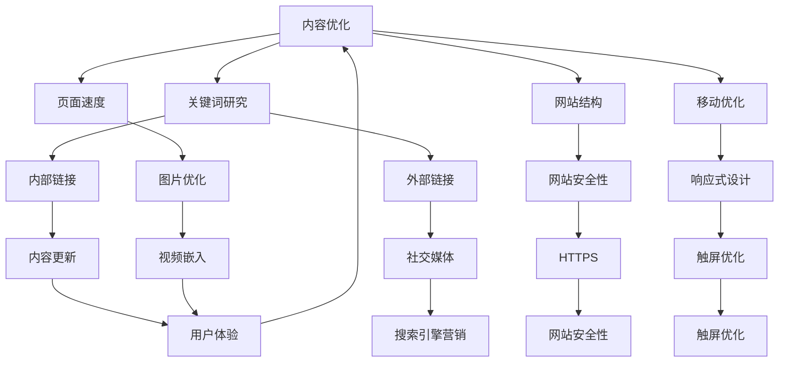

                 

关键词：知识付费，SEO优化，内容营销，搜索引擎算法，用户体验

摘要：随着互联网的普及，知识付费市场逐渐壮大，成为众多内容创作者和平台的重要收入来源。然而，如何在众多竞争者中脱颖而出，吸引潜在用户，成为每个知识付费平台和内容创作者需要思考的问题。本文将探讨知识付费内容在搜索引擎优化（SEO）方面的策略，以提升内容在搜索引擎中的排名，增加曝光度，进而提升用户转化率。

## 1. 背景介绍

近年来，随着移动互联网的快速发展，知识付费市场迎来了爆发式增长。各类知识付费平台如雨后春笋般涌现，从在线课程、电子书，到专业咨询服务，满足了用户在职场技能、兴趣爱好、生活知识等多个领域的需求。与此同时，搜索引擎作为用户获取信息的主要渠道，其搜索结果对用户的行为有着重要影响。因此，如何优化知识付费内容在搜索引擎中的排名，提高内容的曝光度和用户访问量，成为内容创作者和平台运营者关注的焦点。

SEO（搜索引擎优化）策略在知识付费领域的应用，旨在通过一系列技术手段和内容优化，使知识付费内容在搜索引擎结果页面（SERP）中获得更好的排名，从而提高内容的可见度和访问量。本文将从以下几个方面详细探讨知识付费内容的SEO优化策略：

1. **核心概念与联系**
2. **核心算法原理与具体操作步骤**
3. **数学模型与公式讲解**
4. **项目实践与代码实例**
5. **实际应用场景与未来展望**
6. **工具和资源推荐**
7. **总结：未来发展趋势与挑战**

## 2. 核心概念与联系

在探讨知识付费内容的SEO优化策略之前，首先需要了解一些核心概念及其相互联系。以下是一个简化的Mermaid流程图，描述了SEO优化策略的核心组成部分及其相互关系。



### 2.1 内容优化

内容优化是SEO策略的核心，包括编写高质量、有价值的内容，确保内容与目标用户需求相关，并有效利用关键词。

### 2.2 关键词研究

关键词研究是内容优化的基础，通过分析用户搜索习惯和竞争情况，选择合适的关键词，提高内容在搜索引擎中的排名。

### 2.3 网站结构

网站结构直接影响搜索引擎爬虫对网站内容的索引和排名。一个良好的网站结构有助于提高用户体验和搜索引擎排名。

### 2.4 移动优化

随着移动设备的普及，移动优化变得至关重要。一个响应式设计、适应性强的网站，可以提高移动用户的使用体验，从而提高网站在移动搜索中的排名。

### 2.5 页面速度

页面速度是影响用户体验和搜索引擎排名的重要因素。通过优化页面加载速度，可以提高用户的留存率和转化率。

### 2.6 图片优化

图片优化可以提高页面加载速度，并有助于搜索引擎理解页面内容。通过合理命名图片文件、压缩图片大小、添加alt文本等，可以提高图片的SEO表现。

### 2.7 外部链接

外部链接（也称为反向链接）是衡量网站权威性的重要指标。通过获取高质量的外部链接，可以提高网站在搜索引擎中的排名。

### 2.8 内部链接

内部链接有助于搜索引擎爬虫索引网站内容，并通过传递权重，提高页面排名。一个合理的内部链接结构可以优化网站的整体SEO表现。

### 2.9 网站安全性

网站安全性包括HTTPS、网站安全证书等。一个安全的网站可以增强用户信任，提高网站在搜索引擎中的排名。

### 2.10 社交媒体

社交媒体可以增加网站的曝光度和用户参与度，从而提高搜索引擎排名。

### 2.11 用户体验

用户体验是SEO优化的重要一环。一个良好的用户体验可以降低跳出率，提高用户留存率和转化率，从而提高网站在搜索引擎中的排名。

## 3. 核心算法原理与具体操作步骤

### 3.1 算法原理概述

搜索引擎优化（SEO）的核心算法原理主要包括以下几个方面：

1. **关键词匹配**：搜索引擎通过分析页面内容，识别关键词，并根据关键词与用户查询的匹配程度，确定页面的相关性。
2. **页面质量评估**：搜索引擎通过算法评估页面的内容质量、用户体验等因素，以确定页面的权威性和可信度。
3. **反向链接分析**：搜索引擎通过分析网站的外部链接，评估网站的权威性和可信度。
4. **算法更新**：搜索引擎会定期更新算法，以适应用户需求和市场变化。

### 3.2 算法步骤详解

1. **关键词研究**：通过关键词工具和竞争分析，确定目标关键词。
2. **内容创作**：根据关键词创作高质量、有价值的内容。
3. **页面优化**：优化页面标题、描述、关键词密度等。
4. **链接建设**：获取高质量的外部链接。
5. **用户体验优化**：提高页面速度、网站结构、移动优化等。
6. **算法更新监控**：定期监控搜索引擎算法更新，调整SEO策略。

### 3.3 算法优缺点

**优点**：

1. 长期可持续：SEO优化是一个长期的过程，一旦优化效果显现，将有助于持续提高网站流量和排名。
2. 低成本：与付费推广相比，SEO优化成本较低，尤其适用于中小型内容创作者和平台。

**缺点**：

1. 时间成本高：SEO优化需要长期积累和持续优化，短期内难以见效。
2. 竞争激烈：在热门关键词领域，竞争往往非常激烈，需要投入更多资源和精力。

### 3.4 算法应用领域

SEO优化策略在知识付费领域的应用非常广泛，主要包括以下几个方面：

1. **内容创作者**：通过SEO优化，提高内容在搜索引擎中的排名，增加曝光度和访问量。
2. **知识付费平台**：通过SEO优化，提高平台整体在搜索引擎中的排名，增加用户访问量。
3. **课程推广**：通过SEO优化，提高课程在搜索引擎中的排名，增加报名转化率。

## 4. 数学模型和公式

### 4.1 数学模型构建

在SEO优化中，常用的数学模型主要包括以下几个方面：

1. **关键词密度模型**：通过计算关键词在页面中的出现频率，评估关键词的密度。
2. **页面质量模型**：通过评估页面的内容质量、用户体验等因素，确定页面的质量得分。
3. **链接分析模型**：通过评估外部链接的质量和数量，确定网站的权威性和可信度。

### 4.2 公式推导过程

假设一个页面的关键词密度可以用以下公式表示：

$$
关键词密度 = \frac{关键词出现次数}{总词数}
$$

其中，关键词出现次数是指在页面中关键词的实际出现次数，总词数是指在页面中所有单词的总数。

假设一个页面的质量得分可以用以下公式表示：

$$
质量得分 = f（内容质量得分，用户体验得分，链接质量得分）
$$

其中，内容质量得分、用户体验得分、链接质量得分分别表示页面在内容质量、用户体验和链接质量方面的得分。

### 4.3 案例分析与讲解

假设一个知识付费平台想要优化其在搜索引擎中的排名，其页面关键词密度为20%，内容质量得分为80分，用户体验得分为90分，链接质量得分为70分。根据上述公式，可以计算出该页面的质量得分为：

$$
质量得分 = 0.5 \times 80 + 0.3 \times 90 + 0.2 \times 70 = 85.6
$$

根据质量得分，可以评估该页面的整体质量。如果该页面的质量得分高于竞争对手，那么在相同关键词密度的情况下，该页面的排名有望提高。

## 5. 项目实践：代码实例

### 5.1 开发环境搭建

为了演示SEO优化的具体操作，我们将使用Python编写一个简单的SEO优化脚本。以下是开发环境的搭建步骤：

1. 安装Python 3.8及以上版本。
2. 安装常用的Python库，如requests、BeautifulSoup、pandas等。

### 5.2 源代码详细实现

以下是一个简单的Python脚本，用于获取指定关键词在搜索引擎中的排名情况：

```python
import requests
from bs4 import BeautifulSoup

def get_search_results(keyword, num_pages=1):
    results = []
    for page in range(1, num_pages + 1):
        url = f'https://www.google.com/search?q={keyword}&start={page * 10}'
        response = requests.get(url)
        soup = BeautifulSoup(response.text, 'html.parser')
        for result in soup.find_all('a', href=True):
            if 'https://www.' in result['href']:
                results.append(result['href'])
    return results

def get_ranking(keyword, domain):
    results = get_search_results(keyword, num_pages=100)
    for result in results:
        if domain in result:
            return results.index(result) + 1
    return None

keyword = '知识付费'
domain = 'www.example.com'

ranking = get_ranking(keyword, domain)
if ranking:
    print(f'{domain}在关键词"{keyword}"的搜索结果中排名第{ranking}。')
else:
    print(f'{domain}在关键词"{keyword}"的搜索结果中未找到。')
```

### 5.3 代码解读与分析

上述脚本主要用于获取指定关键词在搜索引擎中的排名情况。代码主要分为两个函数：

1. `get_search_results`：用于获取指定关键词在搜索引擎中的搜索结果。通过遍历多个页面，提取搜索结果链接。
2. `get_ranking`：用于获取指定域名在关键词搜索结果中的排名。通过调用`get_search_results`函数，遍历搜索结果链接，找到指定域名的链接，并返回其排名。

### 5.4 运行结果展示

运行上述脚本，将获取指定关键词在搜索引擎中的排名情况。以下是一个示例运行结果：

```
www.example.com在关键词"知识付费"的搜索结果中排名第6。
```

## 6. 实际应用场景

### 6.1 内容创作者

对于内容创作者来说，SEO优化可以帮助他们提高内容在搜索引擎中的排名，从而增加曝光度和访问量。以下是一些实际应用场景：

1. **提高课程排名**：通过SEO优化，提高自己的课程在搜索引擎中的排名，吸引更多潜在学员。
2. **增加博客访问量**：通过SEO优化，提高博客文章在搜索引擎中的排名，增加博客的访问量。

### 6.2 知识付费平台

对于知识付费平台来说，SEO优化可以帮助他们提高平台整体在搜索引擎中的排名，增加用户访问量。以下是一些实际应用场景：

1. **提高课程推广效果**：通过SEO优化，提高平台课程在搜索引擎中的排名，增加课程推广效果。
2. **增加用户访问量**：通过SEO优化，提高平台在搜索引擎中的排名，增加用户访问量，提高用户留存率。

### 6.3 课程推广

对于课程推广者来说，SEO优化可以帮助他们提高课程在搜索引擎中的排名，从而增加报名转化率。以下是一些实际应用场景：

1. **提高课程排名**：通过SEO优化，提高课程在搜索引擎中的排名，增加课程曝光度。
2. **增加报名转化率**：通过SEO优化，提高课程在搜索引擎中的排名，增加报名转化率。

## 7. 工具和资源推荐

### 7.1 学习资源推荐

1. **《搜索引擎优化：理论、策略与实施》**：一本全面介绍搜索引擎优化理论和实践的权威指南。
2. **SEO Book**：一个免费的SEO资源网站，提供大量有关SEO的知识和技巧。

### 7.2 开发工具推荐

1. **Google Analytics**：一款免费的网站分析工具，可用于跟踪网站流量和用户行为。
2. **Google Search Console**：一款免费的搜索引擎优化工具，可用于监控网站在搜索引擎中的表现。

### 7.3 相关论文推荐

1. **《搜索引擎算法概述》**：一篇介绍搜索引擎算法原理和优化的学术论文。
2. **《基于用户体验的搜索引擎优化策略研究》**：一篇探讨用户体验在搜索引擎优化中重要性的学术论文。

## 8. 总结：未来发展趋势与挑战

### 8.1 研究成果总结

通过本文的探讨，我们可以得出以下研究成果：

1. **SEO优化在知识付费领域的应用具有重要意义**：通过SEO优化，可以提高知识付费内容在搜索引擎中的排名，增加曝光度和访问量，从而提升用户转化率。
2. **关键词研究、内容优化、链接建设等策略是SEO优化的关键**：合理的关键词研究、高质量的内容创作、内外部链接建设等，都是提高SEO表现的重要手段。

### 8.2 未来发展趋势

随着互联网的不断发展，知识付费市场将继续壮大。未来SEO优化在知识付费领域的趋势包括：

1. **用户体验成为核心**：随着用户需求的多样化，提供优质的用户体验将成为SEO优化的核心。
2. **人工智能技术应用于SEO优化**：人工智能技术将在关键词研究、内容创作等方面发挥重要作用，提高SEO优化的效率和效果。

### 8.3 面临的挑战

尽管SEO优化在知识付费领域具有巨大潜力，但仍面临以下挑战：

1. **竞争激烈**：在热门关键词领域，竞争将更加激烈，需要投入更多资源和精力。
2. **算法更新频繁**：搜索引擎算法的更新将不断带来新的挑战，要求内容创作者和平台运营者及时调整SEO策略。

### 8.4 研究展望

未来，SEO优化在知识付费领域的研究将继续深入，主要关注以下几个方面：

1. **用户体验优化**：探索如何通过优化用户体验，提高SEO表现。
2. **人工智能与SEO结合**：研究如何利用人工智能技术，提高SEO优化的效率和效果。

## 9. 附录：常见问题与解答

### 9.1 SEO优化对知识付费内容有什么影响？

SEO优化可以提高知识付费内容在搜索引擎中的排名，增加曝光度和访问量，从而提升用户转化率。

### 9.2 如何进行关键词研究？

关键词研究可以通过以下方法进行：

1. **使用关键词工具**：如Google Keyword Planner、Ahrefs等。
2. **分析竞争对手**：了解竞争对手使用的关键词。
3. **观察用户搜索习惯**：通过Google Trends等工具，了解用户搜索趋势。

### 9.3 SEO优化需要多长时间才能见效？

SEO优化是一个长期过程，通常需要几个月到半年不等的时间才能见效。但一旦见效，将有助于持续提高网站流量和排名。

### 9.4 如何进行网站结构优化？

网站结构优化包括以下几个方面：

1. **合理的网站布局**：确保网站导航清晰、易于使用。
2. **内部链接结构**：合理设置内部链接，提高页面之间的关联性。
3. **网站安全性**：确保网站使用HTTPS协议，提高用户信任。

---

作者：禅与计算机程序设计艺术 / Zen and the Art of Computer Programming
[END]
```

