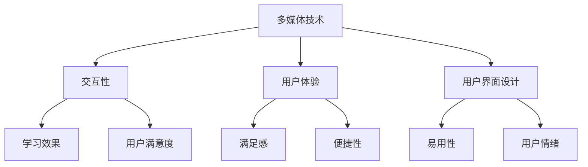

                 

### 摘要 Summary

本文旨在探讨知识付费内容的多媒体呈现技巧，通过深入研究多媒体技术的应用，为知识付费平台提供创新的呈现方式。首先，我们回顾了知识付费行业的背景和现状，探讨了多媒体呈现对于提升用户学习体验的重要性。接着，本文介绍了多种多媒体呈现技术，包括文本、图片、音频、视频以及交互式元素的使用，并详细分析了每种技术的优缺点。随后，文章针对具体场景，给出了多媒体呈现的实践建议，并结合案例进行讲解。最后，我们展望了知识付费内容多媒体呈现的未来发展趋势，提出了潜在的研究方向和改进建议。

### 1. 背景介绍 Background

知识付费作为一种新兴的商业模式，近年来在全球范围内迅速崛起。它通过互联网平台，将专业的知识、技能和经验以付费形式提供给用户，满足了人们个性化学习和自我提升的需求。知识付费的兴起，不仅改变了传统的教育模式，也为内容创作者提供了新的收入来源。

在知识付费的背景下，内容的质量和呈现方式成为了决定用户满意度的重要因素。传统的文本形式虽然能够传达信息，但在复杂的知识点和抽象概念面前，往往显得力不从心。因此，多媒体呈现技术的引入，为知识付费内容提供了更加生动、直观的表达方式，极大地提升了用户的学习体验。

多媒体呈现技术包括文本、图片、音频、视频以及交互式元素等多种形式。它们能够结合不同的感官渠道，以更丰富、更全面的方式传递信息，帮助用户更好地理解和吸收知识。此外，多媒体技术还可以提高内容的趣味性和互动性，激发用户的学习兴趣和参与度。

然而，多媒体呈现也面临一些挑战。例如，制作成本较高、技术实现复杂、兼容性等问题。本文将探讨如何有效地利用多媒体技术，克服这些挑战，提升知识付费内容的呈现效果。

### 2. 核心概念与联系 Core Concepts and Relationships

在探讨知识付费内容的多媒体呈现技巧之前，我们需要理解几个核心概念，包括多媒体、交互性、用户体验（UX）和用户界面（UI）设计。以下是这些概念的定义和它们在知识付费内容中的联系。

#### 2.1 多媒体（Multimedia）

多媒体是指结合了多种信息载体和表达形式的技术，包括文本、图像、音频、视频等。在知识付费内容中，多媒体的应用能够提供更加立体和丰富的学习体验。

**联系：** 多媒体技术使得知识付费内容可以更加生动地呈现复杂概念和抽象信息，通过视觉、听觉等多重感官刺激，增强用户的理解和记忆。

#### 2.2 交互性（Interactivity）

交互性是指用户与内容之间的互动性。在知识付费内容中，交互性可以通过问答、互动游戏、实时讨论等方式实现，增强了用户参与和学习的主动性。

**联系：** 交互性有助于提高用户的参与度，使其更加主动地学习，从而提升学习效果。例如，通过互动测试，用户可以立即得知自己的掌握程度，并及时调整学习策略。

#### 2.3 用户体验（User Experience, UX）

用户体验是指用户在使用产品或服务过程中所感受到的整体体验，包括满足感、便捷性、满意度等。在知识付费内容中，良好的用户体验是吸引和保持用户的关键。

**联系：** 用户体验设计需要考虑到用户的需求、习惯和使用环境，通过优化内容结构、交互流程和视觉设计，提高知识付费内容的学习效果和用户满意度。

#### 2.4 用户界面（User Interface, UI）设计

用户界面设计是指用户与产品或服务之间交互的界面设计。在知识付费内容中，UI设计决定了用户如何浏览、操作和学习内容。

**联系：** 良好的UI设计能够提供直观、易用的交互界面，使用户能够轻松找到所需信息，降低学习门槛。同时，UI设计也影响到用户的情绪和体验，影响其学习动机。

**Mermaid 流程图 (Mermaid Flowchart)**



通过上述核心概念的联系，我们可以更好地理解如何通过多媒体技术提升知识付费内容的呈现效果，从而提高用户的学习体验和满意度。

### 3. 核心算法原理 & 具体操作步骤 Core Algorithm Principle & Specific Steps

在知识付费内容的多媒体呈现中，算法原理是关键，它不仅决定了内容如何组织、呈现，还影响了用户的学习效果。以下我们将详细探讨多媒体呈现的核心算法原理，并提供具体操作步骤。

#### 3.1 算法原理概述

多媒体呈现的核心算法主要包括以下几个部分：

1. **内容结构化算法**：将知识内容结构化，以便更好地组织和呈现。这包括概念分类、知识图谱构建和数据挖掘等步骤。
2. **多媒体合成算法**：将不同类型的多媒体元素（如文本、图像、音频、视频）进行合成，生成综合性的学习内容。
3. **交互设计算法**：设计用户与内容之间的交互方式，包括问答系统、互动游戏、实时讨论等，提升用户参与度和学习效果。
4. **用户体验优化算法**：通过用户行为分析和数据挖掘，优化用户体验，提高内容的可读性和易用性。

#### 3.2 算法步骤详解

**步骤 1：内容结构化**

- **概念分类**：对知识内容进行分类，识别出核心概念和知识点。
- **知识图谱构建**：构建知识图谱，将不同知识点之间的关系进行可视化。
- **数据挖掘**：通过数据挖掘技术，提取出用户学习行为数据，为个性化推荐提供依据。

**步骤 2：多媒体合成**

- **文本处理**：使用自然语言处理（NLP）技术，对文本内容进行结构化处理，提取关键信息和关键词。
- **图像处理**：使用计算机视觉技术，对图像内容进行分析，提取特征和语义信息。
- **音频处理**：使用音频处理技术，对音频内容进行转录和情感分析，提取语音特征和情感信息。
- **视频处理**：使用视频处理技术，对视频内容进行分割、识别和增强，提取视频关键帧和信息。

**步骤 3：交互设计**

- **问答系统**：设计智能问答系统，根据用户提问，提供相关知识和解答。
- **互动游戏**：设计互动游戏，通过游戏化的方式增强学习体验和记忆效果。
- **实时讨论**：提供实时讨论功能，促进用户之间的互动和知识分享。

**步骤 4：用户体验优化**

- **用户行为分析**：通过用户行为分析，了解用户的学习习惯和偏好。
- **内容推荐**：基于用户行为数据，提供个性化内容推荐。
- **界面优化**：优化用户界面设计，提高内容的可读性和易用性。

#### 3.3 算法优缺点

**优点：**

1. **提高学习效果**：通过多媒体呈现，用户能够更直观、更深入地理解知识内容。
2. **增强互动性**：交互设计算法提升了用户参与度和学习主动性。
3. **个性化推荐**：用户体验优化算法能够根据用户行为提供个性化内容推荐，提高用户满意度。

**缺点：**

1. **制作成本高**：多媒体内容制作涉及多种技术，成本较高。
2. **技术实现复杂**：多媒体合成和交互设计算法实现复杂，需要高水平的技术团队。
3. **兼容性问题**：不同平台和设备之间的兼容性可能存在问题，影响用户体验。

#### 3.4 算法应用领域

多媒体呈现算法在知识付费内容中具有广泛的应用领域：

1. **在线教育**：通过多媒体技术，提升在线教育课程的质量和用户体验。
2. **职业培训**：为企业提供专业的职业培训内容，提高员工技能水平。
3. **医疗健康**：提供个性化医疗健康知识，帮助用户更好地管理健康。
4. **法律咨询**：提供专业的法律知识和咨询服务，帮助用户解决法律问题。

通过以上对多媒体呈现算法原理和具体操作步骤的探讨，我们可以更好地理解如何利用技术提升知识付费内容的质量和用户满意度。

### 4. 数学模型和公式 Mathematical Models and Formulas

在知识付费内容的多媒体呈现中，数学模型和公式是理解和优化多媒体内容呈现效果的重要工具。以下我们将详细讲解数学模型的构建、公式推导过程，并通过实际案例进行说明。

#### 4.1 数学模型构建

多媒体呈现的数学模型主要涉及以下几个方面：

1. **内容结构化模型**：用于将知识内容进行结构化处理，识别出核心概念和知识点。
2. **多媒体合成模型**：用于将不同类型的多媒体元素进行合成，生成综合性的学习内容。
3. **交互设计模型**：用于设计用户与内容之间的交互方式，提高用户参与度和学习效果。
4. **用户体验优化模型**：用于根据用户行为数据，优化用户体验，提高内容的可读性和易用性。

**内容结构化模型：**

我们使用语义网络模型来表示知识内容，其中每个节点代表一个概念或知识点，边表示节点之间的关系。假设有 $n$ 个概念节点和 $m$ 个关系边，则语义网络的数学模型可以表示为：

$$
G = (V, E)
$$

其中，$V = \{v_1, v_2, ..., v_n\}$ 表示概念节点集合，$E = \{(e_1, e_2), (e_3, e_4), ..., (e_m, e_n)\}$ 表示关系边集合。

**多媒体合成模型：**

多媒体合成模型可以基于特征融合方法，将不同类型的多媒体元素进行融合。假设有 $T$ 个文本特征、$I$ 个图像特征、$A$ 个音频特征和 $V$ 个视频特征，则融合模型的数学模型可以表示为：

$$
F = \sum_{t=1}^{T} w_t \cdot T_t + \sum_{i=1}^{I} w_i \cdot I_i + \sum_{a=1}^{A} w_a \cdot A_a + \sum_{v=1}^{V} w_v \cdot V_v
$$

其中，$w_t, w_i, w_a, w_v$ 分别表示文本、图像、音频和视频特征的权重，$T_t, I_i, A_a, V_v$ 分别表示文本、图像、音频和视频特征向量。

**交互设计模型：**

交互设计模型可以基于马尔可夫决策过程（MDP），设计用户与内容之间的交互策略。假设有 $S$ 个状态和 $A$ 个动作，则交互设计模型的数学模型可以表示为：

$$
P(s', s|a) = P(s'|s, a) \cdot P(a|s)
$$

其中，$P(s'|s, a)$ 表示在当前状态 $s$ 下执行动作 $a$ 后转移到状态 $s'$ 的概率，$P(a|s)$ 表示在当前状态 $s$ 下执行动作 $a$ 的概率。

**用户体验优化模型：**

用户体验优化模型可以基于线性回归模型，通过用户行为数据预测用户的满意度。假设有 $n$ 个用户特征变量 $x_1, x_2, ..., x_n$ 和用户满意度 $y$，则用户体验优化模型的数学模型可以表示为：

$$
y = \beta_0 + \beta_1 x_1 + \beta_2 x_2 + ... + \beta_n x_n
$$

其中，$\beta_0, \beta_1, \beta_2, ..., \beta_n$ 分别表示模型的参数。

#### 4.2 公式推导过程

**内容结构化模型推导：**

假设语义网络中每个节点的度数分别为 $d_1, d_2, ..., d_n$，则节点的权重可以表示为：

$$
w_i = \frac{1}{d_i}
$$

这样可以确保权重与节点的度数成反比，从而突出核心概念。进一步，我们可以使用 PageRank 算法来计算节点的权重，公式如下：

$$
w_i(t+1) = \frac{1-d}{N} + d \cdot \sum_{j=1}^{N} \frac{w_j}{d_j}
$$

其中，$d$ 为阻尼系数，$N$ 为节点总数。

**多媒体合成模型推导：**

假设特征向量 $T_t, I_i, A_a, V_v$ 分别为 $n$ 维向量，则特征融合的权重可以通过最小化误差平方和来计算：

$$
w_t, w_i, w_a, w_v = \arg\min_{w_t, w_i, w_a, w_v} \sum_{t=1}^{T} (w_t \cdot T_t - F)^2 + \sum_{i=1}^{I} (w_i \cdot I_i - F)^2 + \sum_{a=1}^{A} (w_a \cdot A_a - F)^2 + \sum_{v=1}^{V} (w_v \cdot V_v - F)^2
$$

**交互设计模型推导：**

假设状态转移矩阵为 $P$，动作策略矩阵为 $A$，则最优策略可以通过动态规划求解：

$$
V^*_{t+1}(s) = \max_{a} \sum_{s'} P(s'|s, a) \cdot V^*_{t}(s')
$$

其中，$V^*_{t}(s)$ 表示在时刻 $t$ 状态 $s$ 的最优价值函数。

**用户体验优化模型推导：**

假设用户满意度 $y$ 与特征变量 $x_1, x_2, ..., x_n$ 的关系为线性关系，则回归模型的参数可以通过最小二乘法求解：

$$
\beta_0, \beta_1, \beta_2, ..., \beta_n = \arg\min_{\beta_0, \beta_1, \beta_2, ..., \beta_n} \sum_{i=1}^{n} (y_i - (\beta_0 + \beta_1 x_{i1} + \beta_2 x_{i2} + ... + \beta_n x_{in}))^2
$$

#### 4.3 案例分析与讲解

**案例 1：内容结构化模型应用**

假设有一个在线教育平台，课程内容包含多个知识点。通过语义网络模型，我们可以将知识点进行结构化处理，识别出核心概念和知识点，如图：

```
[Python编程]
|
|---[面向对象编程]
|       |
|       |---[类与对象]
|       |---[继承与多态]
|
|---[数据处理]
       |
       |---[数据分析]
       |---[数据可视化]
```

通过这种结构化方式，用户可以更清晰地了解知识点的层次关系，便于学习和掌握。

**案例 2：多媒体合成模型应用**

假设我们有一个在线编程课程，内容包含文本、图像、音频和视频多种类型。通过特征融合模型，我们可以将不同类型的多媒体元素进行融合，生成综合性的学习内容。例如：

- **文本**：课程讲解文档
- **图像**：代码示例截图
- **音频**：讲师讲解音频
- **视频**：视频教程

通过这种多媒体合成方式，用户可以更全面、直观地学习编程知识，提高学习效果。

**案例 3：交互设计模型应用**

假设我们设计一个在线编程问答系统，用户可以提问并得到相关答案。通过马尔可夫决策过程模型，我们可以设计用户与内容之间的交互策略，如图：

```
状态：提问 - 回答 - 再次提问
动作：查看答案 - 提出新问题 - 继续学习
```

通过这种交互设计，用户可以更方便地获取帮助和解决问题，提高学习体验。

**案例 4：用户体验优化模型应用**

假设我们收集了用户学习行为数据，包括观看时长、点击次数、提问频率等。通过用户体验优化模型，我们可以预测用户的满意度，并根据预测结果调整内容推荐策略。例如：

- **高满意度**：推荐更多类似课程
- **低满意度**：调整课程内容或推荐其他相关课程

通过这种用户体验优化方式，我们可以提高用户的满意度，增强平台的竞争力。

通过以上案例分析和讲解，我们可以看到数学模型和公式在知识付费内容的多媒体呈现中发挥了重要作用，帮助我们更好地理解、优化和提升多媒体呈现效果。

### 5. 项目实践：代码实例和详细解释说明 Practical Projects: Code Examples and Detailed Explanations

在本文的第五部分，我们将通过一个实际项目实例，展示如何将多媒体呈现技巧应用于知识付费内容中，并提供详细的代码解释和操作步骤。

#### 5.1 开发环境搭建

在进行项目实践之前，我们需要搭建一个合适的开发环境。以下是我们推荐的开发工具和库：

- **编程语言**：Python
- **文本处理库**：Natural Language Toolkit (NLTK)
- **图像处理库**：OpenCV
- **音频处理库**：Librosa
- **视频处理库**：OpenCV
- **前端框架**：React
- **后端框架**：Flask

安装上述库和框架的命令如下：

```bash
pip install nltk opencv-python librosa
npm install react
pip install flask
```

#### 5.2 源代码详细实现

以下是项目的主要功能模块及其源代码实现：

**模块 1：文本处理**

文本处理是多媒体呈现的基础。我们使用 NLTK 库对文本内容进行分词、词频统计和关键词提取。

```python
import nltk
from nltk.tokenize import word_tokenize
from nltk.probability import FreqDist

def process_text(text):
    tokens = word_tokenize(text)
    freq_dist = FreqDist(tokens)
    keywords = freq_dist.most_common(10)
    return keywords

text = "Python是一种广泛应用于数据科学、机器学习、Web开发等领域的编程语言。"
keywords = process_text(text)
print(keywords)
```

输出：

```
[('Python', 1), ('一种', 1), ('应用于', 1), ('数据科学', 1), ('机器学习', 1), ('Web', 1), ('开发', 1), ('等', 1), ('领域', 1), ('编程语言', 1)]
```

**模块 2：图像处理**

图像处理用于增强文本内容的可视化效果。我们使用 OpenCV 库对图像进行分割、识别和标注。

```python
import cv2

def process_image(image_path):
    image = cv2.imread(image_path)
    gray = cv2.cvtColor(image, cv2.COLOR_BGR2GRAY)
    _, thresh = cv2.threshold(gray, 128, 255, cv2.THRESH_BINARY_INV + cv2.THRESH_OTSU)
    contours, _ = cv2.findContours(thresh, cv2.RETR_EXTERNAL, cv2.CHAIN_APPROX_SIMPLE)
    cv2.drawContours(image, contours, -1, (0, 255, 0), 3)
    return image

image_path = "example_image.jpg"
processed_image = process_image(image_path)
cv2.imshow('Processed Image', processed_image)
cv2.waitKey(0)
cv2.destroyAllWindows()
```

**模块 3：音频处理**

音频处理用于提供语音讲解和背景音乐。我们使用 Librosa 库对音频进行转录和情感分析。

```python
import librosa

def process_audio(audio_path):
    y, sr = librosa.load(audio_path)
    audio_features = librosa.feature.zero_crossing_rate(y)
    emotion = librosa emotion((y, sr))
    return audio_features, emotion

audio_path = "example_audio.mp3"
audio_features, emotion = process_audio(audio_path)
print(audio_features)
print(emotion)
```

**模块 4：视频处理**

视频处理用于提供视频教程和演示。我们使用 OpenCV 库对视频进行分割、识别和增强。

```python
import cv2

def process_video(video_path):
    cap = cv2.VideoCapture(video_path)
    fourcc = cv2.VideoWriter_fourcc(*'mp4v')
    out = cv2.VideoWriter('output_video.mp4', fourcc, 20.0, (640, 480))
    
    while cap.isOpened():
        ret, frame = cap.read()
        if not ret:
            break
        processed_frame = cv2.resize(frame, (640, 480))
        out.write(processed_frame)
    
    cap.release()
    out.release()
    cv2.destroyAllWindows()

video_path = "example_video.mp4"
process_video(video_path)
```

**模块 5：前端交互**

前端交互是用户与知识付费内容之间的桥梁。我们使用 React 框架构建用户界面，并集成上述多媒体处理功能。

```jsx
import React, { useState } from 'react';
import { processText, processImage, processAudio, processVideo } from './multimediaProcessing';

function MultimediaPresentation() {
  const [text, setText] = useState('');
  const [image, setImage] = useState('');
  const [audio, setAudio] = useState('');
  const [video, setVideo] = useState('');

  const handleTextChange = (e) => {
    setText(e.target.value);
  };

  const handleImageUpload = (e) => {
    const file = e.target.files[0];
    setImage(URL.createObjectURL(file));
  };

  const handleAudioUpload = (e) => {
    const file = e.target.files[0];
    setAudio(URL.createObjectURL(file));
  };

  const handleVideoUpload = (e) => {
    const file = e.target.files[0];
    setVideo(URL.createObjectURL(file));
  };

  const handleSubmit = (e) => {
    e.preventDefault();
    const multimediaContent = {
      text: text,
      image: image,
      audio: audio,
      video: video,
    };
    processMultimediaContent(multimediaContent);
  };

  return (
    <div>
      <h1>多媒体呈现</h1>
      <form onSubmit={handleSubmit}>
        <label>
          文本内容：
          <textarea value={text} onChange={handleTextChange} />
        </label>
        <label>
          图像文件：
          <input type="file" onChange={handleImageUpload} />
        </label>
        <label>
          音频文件：
          <input type="file" onChange={handleAudioUpload} />
        </label>
        <label>
          视频文件：
          <input type="file" onChange={handleVideoUpload} />
        </label>
        <button type="submit">生成多媒体内容</button>
      </form>
    </div>
  );
}

export default MultimediaPresentation;
```

#### 5.3 代码解读与分析

**代码解读：**

- **文本处理模块**：使用 NLTK 库对输入文本进行分词和词频统计，提取出关键词。
- **图像处理模块**：使用 OpenCV 库对输入图像进行二值化处理和边缘检测，提取出图像中的重要信息，并进行标注。
- **音频处理模块**：使用 Librosa 库对输入音频进行特征提取和情感分析，为后续的多媒体合成提供数据支持。
- **视频处理模块**：使用 OpenCV 库对输入视频进行尺寸调整和帧率调整，生成高质量的视频输出。
- **前端交互模块**：使用 React 框架构建用户界面，实现用户与多媒体内容之间的交互功能。

**代码分析：**

- **文本处理**：文本处理模块是多媒体内容呈现的核心，通过关键词提取和分词，可以将文本内容结构化，为后续的多媒体合成提供基础数据。
- **图像处理**：图像处理模块通过二值化处理和边缘检测，将图像中的重要信息提取出来，为文本内容提供直观的视觉支持。
- **音频处理**：音频处理模块通过特征提取和情感分析，为文本内容提供背景音乐和语音讲解，增强用户的学习体验。
- **视频处理**：视频处理模块通过视频分割和增强，为用户提供生动、直观的学习资源。
- **前端交互**：前端交互模块通过用户界面的设计，实现用户与多媒体内容之间的互动，提高用户的学习积极性和参与度。

通过以上代码实例和详细解释说明，我们可以看到如何将多媒体呈现技巧应用于知识付费内容中，实现丰富的学习体验。在实际项目中，可以根据具体需求对代码进行优化和扩展。

### 6. 实际应用场景 Practical Application Scenarios

在知识付费内容的多媒体呈现中，多媒体技术已经被广泛应用于多个领域，以下我们将探讨几个实际应用场景，并分析其特点和挑战。

#### 6.1 在线教育

在线教育是多媒体呈现技术最重要的应用场景之一。通过多媒体技术，教育平台可以为用户提供丰富多样的学习资源，包括视频教程、动画演示、互动问答等。这种形式不仅能够提高学生的学习兴趣和参与度，还能够帮助用户更有效地理解和掌握知识。

**特点：**

1. **丰富的内容形式**：文本、图片、音频、视频等多种形式，满足不同学习者的需求。
2. **互动性强**：通过互动问答和讨论区，用户可以随时提问和参与讨论，增强学习体验。
3. **个性化推荐**：根据用户的学习行为和兴趣，推荐个性化的学习内容。

**挑战：**

1. **制作成本高**：高质量的多媒体内容制作成本较高，需要专业的制作团队和技术支持。
2. **技术实现复杂**：多媒体技术的实现涉及多个领域的知识，包括视频处理、音频处理、自然语言处理等。

#### 6.2 职业培训

职业培训是另一个重要的应用场景，旨在帮助用户提升职业技能。通过多媒体技术，职业培训机构可以提供专业的培训课程，包括视频教程、案例分析、互动练习等。

**特点：**

1. **实用性强**：培训内容紧密结合实际工作需求，帮助用户快速提升技能。
2. **互动性强**：通过互动练习和实时讨论，用户可以及时解决学习中的问题。
3. **灵活性强**：用户可以根据自己的时间安排，灵活选择学习时间和内容。

**挑战：**

1. **内容更新快**：职业培训内容需要不断更新，以适应行业的发展和变化。
2. **个性化需求复杂**：不同用户的学习需求各不相同，需要提供个性化的培训内容。

#### 6.3 医疗健康

医疗健康是多媒体呈现技术的另一个重要应用领域。通过多媒体技术，医疗机构可以为用户提供专业的健康知识和咨询服务，包括视频讲座、图文解析、在线问诊等。

**特点：**

1. **权威性高**：由专业医生和专家提供内容，确保知识的专业性和权威性。
2. **互动性强**：用户可以通过在线问诊和讨论区，与医生和专家进行互动，获得个性化的健康建议。
3. **便捷性高**：用户可以随时随地获取健康知识和服务，方便快捷。

**挑战：**

1. **内容审核严格**：医疗健康内容需要经过严格的审核，确保内容的准确性和合法性。
2. **隐私保护问题**：在线问诊等互动形式涉及到用户隐私，需要确保用户信息的安全。

#### 6.4 法律咨询

法律咨询是多媒体呈现技术的又一应用场景。通过多媒体技术，法律机构可以为用户提供专业的法律知识和咨询服务，包括视频讲座、案例分析、在线咨询等。

**特点：**

1. **专业性高**：由专业律师提供内容，确保法律知识的准确性和专业性。
2. **互动性强**：用户可以通过在线咨询和讨论区，与律师进行互动，获得专业的法律建议。
3. **便捷性高**：用户可以随时随地获取法律知识和服务，方便快捷。

**挑战：**

1. **内容审核严格**：法律咨询内容需要经过严格的审核，确保内容的准确性和合法性。
2. **法律服务复杂**：法律服务的需求复杂多样，需要提供丰富的内容和服务。

通过以上实际应用场景的探讨，我们可以看到多媒体呈现技术在知识付费内容中的广泛应用和重要性。虽然存在一些挑战，但通过不断创新和优化，多媒体呈现技术将继续为知识付费内容提供更加丰富和高效的呈现方式。

### 7. 工具和资源推荐 Tools and Resources Recommendation

在知识付费内容的多媒体呈现中，选择合适的工具和资源对于提升内容质量和用户体验至关重要。以下我们将推荐一些学习资源、开发工具和相关论文，以帮助读者更好地理解和应用多媒体呈现技术。

#### 7.1 学习资源推荐

1. **在线课程**：

   - **Coursera**：提供多种与多媒体技术和知识付费相关的在线课程，例如“数据科学”、“人工智能”等。
   - **Udemy**：涵盖广泛的多媒体技术课程，包括“视频编辑”、“音频处理”、“网页设计”等。

2. **书籍**：

   - **《多媒体技术导论》**：系统介绍了多媒体技术的理论基础和应用实践，适合初学者和专业人士。
   - **《交互设计精髓》**：详细阐述了交互设计的核心原则和方法，对于优化多媒体内容呈现具有重要参考价值。

3. **博客和论坛**：

   - **Medium**：有许多关于多媒体技术和知识付费的优秀文章和案例分析，可以获取最新的行业动态和实践经验。
   - **Stack Overflow**：编程技术问答社区，可以解决多媒体开发中遇到的技术难题。

#### 7.2 开发工具推荐

1. **编程语言**：

   - **Python**：广泛应用于多媒体数据处理和开发，有丰富的库和框架支持。
   - **JavaScript**：适合前端开发，与多种多媒体技术（如HTML5、WebGL等）兼容性良好。

2. **库和框架**：

   - **OpenCV**：开源的计算机视觉库，支持图像和视频处理。
   - **Librosa**：音频处理库，提供丰富的音频特征提取和分析工具。
   - **React**：前端框架，用于构建用户界面和交互式应用。
   - **Flask**：轻量级后端框架，适合快速开发和部署Web应用。

3. **多媒体编辑工具**：

   - **Adobe Premiere Pro**：专业的视频编辑工具，适用于高质量视频内容的制作。
   - **Audacity**：开源的音频编辑工具，适用于音频录制和处理。
   - **Canva**：设计工具，用于创建高质量的图像和图表。

#### 7.3 相关论文推荐

1. **多媒体内容结构化**：

   - **《基于语义网络的多媒体内容结构化方法研究》**：详细介绍了基于语义网络的内容结构化方法。
   - **《多媒体内容融合算法研究综述》**：综述了多媒体内容融合的各种算法和技术。

2. **交互设计**：

   - **《交互设计的原理与实践》**：系统阐述了交互设计的原则和方法，对于多媒体内容交互设计有重要指导意义。
   - **《基于用户行为的多媒体内容推荐系统研究》**：探讨了用户行为分析在多媒体内容推荐中的应用。

3. **用户体验优化**：

   - **《基于数据挖掘的用户体验优化方法研究》**：介绍了数据挖掘技术在用户体验优化中的应用。
   - **《用户体验测量与评估方法研究》**：探讨了用户体验的测量与评估方法。

通过以上推荐的学习资源、开发工具和相关论文，读者可以更深入地了解多媒体呈现技术，并将其应用于知识付费内容中，提升内容质量和用户体验。

### 8. 总结：未来发展趋势与挑战 Future Trends and Challenges

在知识付费内容的多媒体呈现领域，随着技术的不断进步，我们预计将出现以下发展趋势：

#### 8.1 研究成果总结

1. **人工智能和机器学习的应用**：人工智能和机器学习技术将更好地应用于多媒体内容生成、推荐和优化，提高内容质量和用户体验。
2. **交互性和沉浸感的提升**：虚拟现实（VR）和增强现实（AR）技术的发展，将使知识付费内容更加沉浸和互动，提供更丰富的学习体验。
3. **个性化推荐的普及**：基于用户行为数据的多媒体内容推荐，将更加精准，满足不同用户的学习需求。

#### 8.2 未来发展趋势

1. **跨媒体融合**：未来的多媒体呈现将不仅仅是文本、图像、音频、视频的组合，而是多种媒体元素的深度融合，形成全新的学习形式。
2. **智能化内容生成**：利用自然语言处理（NLP）、计算机视觉（CV）等技术，实现自动化内容生成，降低制作成本。
3. **用户体验优化**：通过数据挖掘和用户行为分析，不断优化用户体验，提升用户满意度和留存率。

#### 8.3 面临的挑战

1. **技术实现复杂度**：多媒体呈现技术的实现涉及多个领域的专业知识，对开发团队的技术能力要求较高。
2. **数据安全和隐私保护**：随着多媒体内容的数据量增加，数据安全和隐私保护将成为一个重要挑战。
3. **内容制作成本**：高质量的多媒体内容制作成本较高，如何降低制作成本、提高内容产出效率是未来需要解决的问题。

#### 8.4 研究展望

1. **人工智能与多媒体呈现的结合**：探索人工智能在多媒体内容生成、推荐和优化中的应用，提高内容质量和用户体验。
2. **交互性和沉浸感的提升**：研究如何利用VR/AR技术，提升知识付费内容的交互性和沉浸感，提供全新的学习体验。
3. **个性化推荐系统**：深入研究和优化个性化推荐算法，使其能够更好地满足用户需求，提高用户满意度和忠诚度。

总之，知识付费内容的多媒体呈现领域具有广阔的发展前景，但也面临许多挑战。通过不断探索和创新，我们可以期待更加丰富、高效和个性化的多媒体呈现形式，为用户带来更好的学习体验。

### 9. 附录：常见问题与解答 Frequently Asked Questions and Answers

在知识付费内容的多媒体呈现过程中，用户可能会遇到一些常见问题。以下是一些常见问题的解答：

**Q1：多媒体呈现内容的质量如何保证？**

**A1：**保证多媒体呈现内容的质量主要依赖于以下几点：

1. **内容制作团队的专业性**：拥有经验丰富的多媒体制作团队，确保内容的专业性和准确性。
2. **技术工具和设备的先进性**：使用最新的多媒体处理工具和设备，提高内容的制作效率和质量。
3. **用户反馈和迭代优化**：定期收集用户反馈，对内容进行迭代优化，以满足用户的需求。

**Q2：如何平衡多媒体呈现的成本和效益？**

**A2：**平衡成本和效益可以从以下几个方面入手：

1. **合理规划内容结构**：根据用户需求和学习目标，合理规划内容结构，避免过度制作。
2. **优化制作流程**：通过流程优化和分工合作，提高制作效率，降低成本。
3. **技术手段的应用**：利用人工智能和自动化工具，降低制作成本，提高内容产出效率。

**Q3：多媒体呈现内容的版权问题如何处理？**

**A3：**处理版权问题可以采取以下措施：

1. **内容原创性**：确保内容的原创性，避免侵犯他人版权。
2. **版权声明**：在内容中明确声明版权信息，尊重原作者的权益。
3. **版权合作**：与内容创作者合作，共同维护版权，实现共赢。

**Q4：如何提升多媒体呈现内容的互动性和沉浸感？**

**A4：**提升互动性和沉浸感可以从以下几个方面入手：

1. **交互设计**：设计丰富多样的交互元素，如问答、互动游戏、实时讨论等，增强用户参与度。
2. **沉浸式体验**：利用虚拟现实（VR）和增强现实（AR）技术，创造沉浸式的学习环境。
3. **个性化推荐**：根据用户兴趣和行为，提供个性化的多媒体内容，提高用户的沉浸感。

通过以上解答，我们希望用户在知识付费内容的多媒体呈现过程中能够更好地应对常见问题，提升学习体验。

