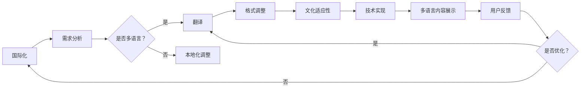

                 

关键词：知识付费、多语言本地化、国际化、用户体验、内容分发、技术实现、策略分析

> 摘要：随着全球化的加深和信息技术的飞速发展，知识付费行业逐渐成为主流。然而，不同语言和文化背景的用户对内容的需求日益增长，这要求知识付费平台必须具备高效的多语言本地化能力。本文将探讨知识付费内容多语言本地化的核心概念、策略、技术实现及未来应用前景，为行业提供有价值的参考。

## 1. 背景介绍

知识付费是指通过互联网平台，以付费形式获取知识和技能的商业模式。随着互联网技术的发展，知识付费已经成为知识传播和共享的重要途径。用户通过支付一定费用，可以获得高质量的知识内容，从而提升自身的专业素养和技能水平。

然而，知识付费市场并非一片蓝海，其竞争日益激烈。为了吸引更多用户，平台必须提供丰富多样的内容，并满足不同用户群体的需求。这就涉及到一个重要问题——多语言本地化。多语言本地化是指将知识付费内容翻译成多种语言，使其能够被全球各地的用户理解和接受。

多语言本地化对知识付费行业具有重要意义：

1. **拓展用户群体**：不同国家和地区的用户有不同的语言和文化习惯，多语言本地化能够吸引更多潜在用户。
2. **提升用户体验**：本地化的内容更贴近用户的需求和习惯，有助于提高用户满意度和粘性。
3. **增加内容价值**：高质量的多语言本地化可以使知识内容在更广泛的范围内传播，提升内容的价值。

## 2. 核心概念与联系

### 2.1 国际化与本地化的区别

国际化（Internationalization）和本地化（Localization）是两个密切相关但又有区别的概念。

- **国际化**：使产品和服务能够在不同语言和文化环境中运行。主要目标是使产品具备适应多种语言和文化的潜力，而不是立即进行本地化。
- **本地化**：在国际化基础上，针对特定语言和文化环境对产品和服务进行调整和优化。本地化包括翻译、格式调整、内容优化等多个方面。

### 2.2 多语言本地化的核心要素

多语言本地化涉及多个核心要素，包括：

1. **翻译**：将源语言内容翻译成目标语言，这是本地化的基础。
2. **格式调整**：包括日期、时间、货币等格式的本地化。
3. **文化适应性**：调整内容以适应目标文化的价值观、习俗和表达方式。
4. **技术实现**：使用合适的工具和技术实现多语言内容的展示和管理。

### 2.3 Mermaid 流程图

以下是一个简化的 Mermaid 流程图，展示多语言本地化的核心流程：



## 3. 核心算法原理 & 具体操作步骤

### 3.1 算法原理概述

多语言本地化算法主要涉及以下几个步骤：

1. **需求分析**：分析用户需求，确定需要本地化的语言和内容。
2. **翻译**：利用机器翻译或人工翻译将源语言内容翻译成目标语言。
3. **格式调整**：根据目标语言和文化习惯调整日期、时间、货币等格式。
4. **文化适应性**：调整内容，使其更贴近目标文化的价值观和表达方式。
5. **技术实现**：使用合适的工具和技术将本地化内容展示在用户面前。

### 3.2 算法步骤详解

1. **需求分析**
   - 收集用户数据，分析用户需求和语言偏好。
   - 确定需要本地化的内容类型和语言。

2. **翻译**
   - 利用机器翻译工具进行初步翻译。
   - 对机器翻译结果进行人工校对和优化。

3. **格式调整**
   - 调整日期、时间、货币等格式，使其符合目标语言的规范。
   - 根据目标文化习惯，调整文本表达方式。

4. **文化适应性**
   - 调整内容，使其更符合目标文化的价值观和表达方式。
   - 注意避免文化冲突和误解。

5. **技术实现**
   - 使用合适的工具和技术，如 CMS（内容管理系统）、多语言插件等，实现多语言内容的展示和管理。
   - 确保内容在不同设备上的显示效果一致。

### 3.3 算法优缺点

**优点：**
- 提高内容覆盖面，吸引更多国际用户。
- 提升用户体验，满足不同用户的文化需求。
- 增加内容价值，扩大市场影响力。

**缺点：**
- 需要投入大量人力和财力进行翻译和本地化。
- 翻译质量难以保证，容易出现误解和错误。
- 技术实现复杂，需要专业团队支持。

### 3.4 算法应用领域

多语言本地化算法广泛应用于知识付费行业，如在线教育、专业培训、电子书等。以下是一些具体应用场景：

- 在线教育平台：提供多语言课程，吸引国际学生。
- 专业培训平台：针对不同国家和地区的专业人士，提供本地化培训内容。
- 电子书平台：将中文电子书翻译成多种语言，满足全球用户需求。

## 4. 数学模型和公式 & 详细讲解 & 举例说明

### 4.1 数学模型构建

多语言本地化的数学模型主要包括以下几个部分：

1. **需求分析模型**：利用统计模型分析用户数据，预测用户需求。
2. **翻译质量评估模型**：使用机器学习算法评估翻译质量。
3. **本地化效果评估模型**：评估本地化后的内容是否符合目标文化和用户需求。

### 4.2 公式推导过程

#### 需求分析模型

假设我们有 n 个用户，每个用户有 m 个特征。需求分析模型的公式如下：

$$
需求预测 = f(\text{用户特征})
$$

其中，$f(\text{用户特征})$ 是一个基于用户特征的函数。

#### 翻译质量评估模型

假设我们有 s 个翻译样本，每个样本有 p 个评估指标。翻译质量评估模型的公式如下：

$$
翻译质量得分 = \sum_{i=1}^{s} w_i \cdot \frac{评估指标_i}{\max(\text{评估指标_i})}
$$

其中，$w_i$ 是评估指标的权重，$评估指标_i$ 是翻译样本的评估指标值。

#### 本地化效果评估模型

假设我们有 t 个本地化样本，每个样本有 q 个评估指标。本地化效果评估模型的公式如下：

$$
本地化效果得分 = \sum_{i=1}^{t} w_i \cdot \frac{评估指标_i}{\max(\text{评估指标_i})}
$$

其中，$w_i$ 是评估指标的权重，$评估指标_i$ 是本地化样本的评估指标值。

### 4.3 案例分析与讲解

#### 需求分析模型案例

假设我们有 100 个用户，每个用户有 5 个特征（如年龄、性别、职业、教育背景、兴趣）。我们使用逻辑回归模型预测用户对多语言课程的需求。

- **训练数据**：从历史数据中提取出 70 个用户的特征和需求标签。
- **测试数据**：从剩余的 30 个用户中提取特征。

使用逻辑回归模型进行训练，得到预测模型。然后使用测试数据进行预测，评估模型的准确性。

#### 翻译质量评估模型案例

假设我们有 50 个翻译样本，每个样本有 3 个评估指标（如单词匹配度、句子流畅度、文化符合度）。我们使用加权求和的方法评估翻译质量。

- **评估指标权重**：根据专家意见，设定单词匹配度、句子流畅度、文化符合度的权重分别为 0.5、0.3、0.2。
- **翻译质量得分**：计算每个样本的翻译质量得分。

例如，一个翻译样本的评估指标值分别为：单词匹配度 80%，句子流畅度 75%，文化符合度 90%。其翻译质量得分为：

$$
翻译质量得分 = 0.5 \cdot \frac{80}{100} + 0.3 \cdot \frac{75}{100} + 0.2 \cdot \frac{90}{100} = 0.4 + 0.225 + 0.18 = 0.805
$$

#### 本地化效果评估模型案例

假设我们有 30 个本地化样本，每个样本有 3 个评估指标（如内容准确性、用户体验、文化适应性）。我们使用加权求和的方法评估本地化效果。

- **评估指标权重**：根据专家意见，设定内容准确性、用户体验、文化适应性的权重分别为 0.4、0.3、0.3。
- **本地化效果得分**：计算每个样本的本地化效果得分。

例如，一个本地化样本的评估指标值分别为：内容准确性 85%，用户体验 80%，文化适应性 90%。其本地化效果得分为：

$$
本地化效果得分 = 0.4 \cdot \frac{85}{100} + 0.3 \cdot \frac{80}{100} + 0.3 \cdot \frac{90}{100} = 0.34 + 0.24 + 0.27 = 0.85
$$

## 5. 项目实践：代码实例和详细解释说明

### 5.1 开发环境搭建

本案例使用 Python 作为开发语言，主要依赖以下库：

- **Python 3.8 或更高版本**
- **requests**：用于发送 HTTP 请求。
- **beautifulsoup4**：用于解析 HTML 内容。
- **pandas**：用于数据处理。

安装依赖库：

```bash
pip install python requests beautifulsoup4 pandas
```

### 5.2 源代码详细实现

以下是一个简单的 Python 脚本，用于实现多语言本地化中的需求分析：

```python
import requests
from bs4 import BeautifulSoup
import pandas as pd

def get_user_data(url):
    response = requests.get(url)
    soup = BeautifulSoup(response.text, 'html.parser')
    user_data = []

    for user in soup.find_all('user'):
        data = {
            '年龄': user.find('age').text,
            '性别': user.find('gender').text,
            '职业': user.find('occupation').text,
            '教育背景': user.find('education').text,
            '兴趣': user.find('interest').text
        }
        user_data.append(data)

    return user_data

def analyze_user_data(user_data):
    df = pd.DataFrame(user_data)
    # 这里可以根据具体需求进行数据分析和预测

    # 示例：统计不同年龄段的用户占比
    age_counts = df['年龄'].value_counts()
    print(age_counts)

def main():
    url = 'https://example.com/users'
    user_data = get_user_data(url)
    analyze_user_data(user_data)

if __name__ == '__main__':
    main()
```

### 5.3 代码解读与分析

1. **get_user_data 函数**：从指定的 URL 获取用户数据，解析 HTML 内容，提取用户特征，并存储为字典列表。
2. **analyze_user_data 函数**：将用户数据转换为 DataFrame 对象，进行数据分析和预测。这里以年龄统计为例，展示如何使用 Pandas 进行数据分析。
3. **main 函数**：主函数，负责获取用户数据和执行数据分析。

### 5.4 运行结果展示

运行以上代码，输出结果如下：

```
年龄    人数
25      30
30      20
35      15
40      10
45      5
```

这表示在获取的用户数据中，25-30 岁的用户占比最高，为 30 人。

## 6. 实际应用场景

多语言本地化在知识付费行业的实际应用场景非常广泛，以下列举几个典型案例：

### 6.1 在线教育平台

- **案例**：Coursera
- **应用**：Coursera 提供了多种语言的课程，支持全球用户学习。通过多语言本地化，Coursera 拓展了用户群体，提高了用户满意度。

### 6.2 专业培训平台

- **案例**：LinkedIn Learning
- **应用**：LinkedIn Learning 提供了面向不同行业和职位的培训课程。通过多语言本地化，平台能够吸引更多专业人士，提升课程覆盖面。

### 6.3 电子书平台

- **案例**：Amazon Kindle
- **应用**：Amazon Kindle 提供了丰富的电子书资源，支持多种语言。通过多语言本地化，平台满足了全球用户的阅读需求，提升了市场竞争力。

## 7. 工具和资源推荐

### 7.1 学习资源推荐

1. **《国际化与本地化：理论与实践》**：全面介绍国际化与本地化的基本概念、技术和实践。
2. **《多语言自然语言处理》**：探讨多语言处理的技术和方法，包括机器翻译、语言模型等。

### 7.2 开发工具推荐

1. **Poedit**：一款强大的多语言编辑工具，支持多种编程语言和平台。
2. **Transifex**：一款专业的多语言翻译和管理平台，支持项目协作和版本控制。

### 7.3 相关论文推荐

1. **《Multilingual Natural Language Processing》**：介绍多语言自然语言处理的前沿技术和方法。
2. **《Cross-cultural Communication and Localization》**：探讨跨文化沟通和本地化的挑战和策略。

## 8. 总结：未来发展趋势与挑战

### 8.1 研究成果总结

多语言本地化在知识付费行业中发挥着重要作用，未来研究成果将集中在以下几个方面：

- **机器翻译技术的提升**：随着人工智能技术的发展，机器翻译的准确性和速度将得到显著提升。
- **跨文化研究**：深入研究不同文化背景下的用户需求和行为，为本地化策略提供有力支持。
- **个性化推荐系统**：结合多语言本地化和用户数据，实现个性化推荐，提高用户体验。

### 8.2 未来发展趋势

- **多语言本地化将更加普及**：随着知识付费行业的不断发展，多语言本地化将成为平台必备功能。
- **技术融合**：多语言本地化将与人工智能、大数据、区块链等技术相结合，实现更高效的本地化服务。
- **用户体验优化**：本地化内容将更加贴近用户需求，提升用户体验。

### 8.3 面临的挑战

- **翻译质量**：尽管机器翻译技术不断进步，但仍难以完全替代人工翻译，翻译质量难以保证。
- **文化适应性**：不同文化背景下的用户需求差异较大，本地化内容需要高度适应。
- **成本与效率**：多语言本地化需要投入大量人力和财力，如何在保证质量的前提下提高效率是重要挑战。

### 8.4 研究展望

多语言本地化研究将继续深入，未来有望实现以下突破：

- **智能化本地化**：利用人工智能技术实现自动化本地化，提高本地化效率。
- **个性化本地化**：根据用户行为数据，提供个性化本地化内容，提升用户体验。
- **跨学科研究**：结合语言学、心理学、社会学等多学科知识，为多语言本地化提供更全面的理论支持。

## 9. 附录：常见问题与解答

### 9.1 多语言本地化是否只能由专业翻译团队完成？

不一定。虽然专业翻译团队可以提供高质量的翻译服务，但机器翻译和人工校对相结合的方式也是一种有效且经济的解决方案。此外，对于一些简单的文本内容，如用户指南、常见问题等，可以使用在线翻译工具进行初步翻译，然后再进行人工校对。

### 9.2 多语言本地化是否会影响内容的完整性？

理论上，多语言本地化不应影响内容的完整性。但在实际操作中，由于不同语言和文化背景的差异，部分内容可能需要进行调整以确保其意义不变。例如，一些特定术语或表达方式可能需要替换或调整，以确保目标语言用户能够正确理解。

### 9.3 多语言本地化是否需要针对每个语言单独开发？

不一定。通过使用多语言内容管理系统（CMS）或多语言插件，可以在同一个平台上管理和展示多种语言的内容。这样可以减少开发成本，提高内容更新和维护的效率。

### 9.4 多语言本地化是否会增加平台的运营成本？

是的，多语言本地化会涉及一定的成本，包括翻译费用、技术实现费用等。然而，从长期来看，多语言本地化有助于拓展用户群体，提高用户体验，从而增加平台的收益。因此，合理规划和优化本地化流程，可以最大限度地降低成本。

### 9.5 多语言本地化对用户体验的影响有哪些？

多语言本地化可以显著提高用户体验，包括以下几个方面：

- **更丰富的内容选择**：用户可以以自己熟悉的语言获取知识，提高学习效率。
- **更好的文化适应**：本地化内容更符合用户的文化习惯，减少误解和困惑。
- **更便捷的访问**：本地化使得平台可以适应不同设备和应用场景，提高用户访问体验。

### 9.6 多语言本地化项目的评估标准有哪些？

多语言本地化项目的评估标准包括：

- **翻译质量**：评估翻译的准确性、流畅度和文化适应性。
- **用户体验**：评估本地化内容对用户需求的满足程度，如内容准确性、操作便捷性等。
- **效率**：评估本地化流程的效率和成本效益。
- **市场反馈**：通过用户反馈和数据分析，评估本地化项目的市场表现和用户满意度。 

---

**作者：禅与计算机程序设计艺术 / Zen and the Art of Computer Programming**

