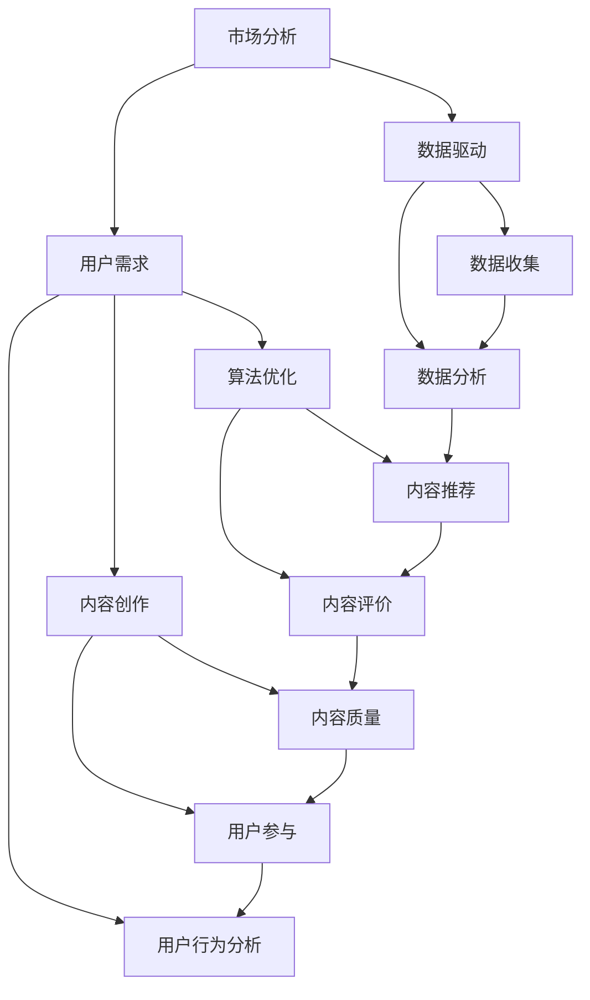

                 

关键词：知识付费，创业，内容价值，最大化策略，市场分析，用户需求，数据驱动，算法优化，案例分析。

> 摘要：本文将探讨知识付费创业中的内容价值最大化策略。通过市场分析，用户需求研究，数据驱动的方法，以及算法优化的技术手段，本文旨在为知识付费创业者提供一套系统的策略，以实现内容价值的最大化。

## 1. 背景介绍

随着互联网技术的发展和人们对知识获取需求的增长，知识付费已经成为一个日益繁荣的市场。知识付费平台如雨后春笋般涌现，从早期的知乎Live、得到，到后来的喜马拉雅、得到APP，以及各类专业领域的内容付费平台，涵盖了职场技能、个人成长、投资理财、科技前沿等多个领域。

在这个市场中，创业者们面临着激烈的竞争和不断变化的市场环境。如何从众多知识付费平台中脱颖而出，实现内容价值最大化，成为创业者们共同面临的挑战。

### 1.1 知识付费市场的发展历程

知识付费市场的发展可以追溯到2006年的“互联网教育元年”。在这一年，随着互联网技术的发展，在线教育开始兴起，标志着知识付费市场的诞生。随后，随着移动互联网的普及和用户对知识获取需求的增加，知识付费市场迅速发展。

2016年，知乎Live的上线标志着知识付费的爆发，吸引了大量用户和创作者。2018年，得到App的《李笑来专栏》成为爆款，进一步推动了知识付费市场的发展。此后，各类知识付费平台如雨后春笋般涌现，市场竞争日趋激烈。

### 1.2 知识付费的商业模式

知识付费的商业模式主要包括内容付费、会员制和广告收益三种。其中，内容付费是最常见的模式，用户通过购买或订阅特定内容来获取知识。会员制则是通过提供会员服务，如特权、优惠等，吸引用户长期付费。广告收益则是通过在平台上投放广告来获取收益。

### 1.3 知识付费的挑战

在知识付费市场中，创业者们面临着多个挑战。首先，内容质量是核心竞争力，如何提供高质量的内容来吸引用户，是一个重要的问题。其次，市场竞争激烈，如何在众多竞争对手中脱颖而出，也是一个巨大的挑战。此外，用户需求的不断变化和技术的快速发展，也对创业者提出了更高的要求。

## 2. 核心概念与联系

在探讨知识付费创业中的内容价值最大化策略之前，我们需要明确一些核心概念和它们之间的联系。以下是核心概念的Mermaid流程图：



### 2.1 市场分析

市场分析是知识付费创业的第一步。通过市场分析，创业者可以了解当前市场的规模、竞争对手、用户需求等信息，为后续的内容创作和推广提供依据。

### 2.2 用户需求

用户需求是知识付费的核心。了解用户需求可以帮助创业者提供符合用户期望的内容，提高用户满意度和忠诚度。

### 2.3 数据驱动

数据驱动是知识付费创业的重要手段。通过数据收集和分析，创业者可以实时了解用户行为和内容效果，为内容创作和优化提供数据支持。

### 2.4 算法优化

算法优化是提高知识付费平台效果的关键。通过算法优化，可以提高内容推荐精度，提升用户体验，从而实现内容价值的最大化。

### 2.5 内容创作

内容创作是知识付费的核心。高质量的内容是吸引用户的关键，创业者需要不断创新，提供有价值的内容来满足用户需求。

### 2.6 用户参与

用户参与是提高用户满意度和忠诚度的关键。通过鼓励用户参与内容创作和评价，可以增加用户对平台的粘性，提高用户留存率。

### 2.7 用户行为分析

用户行为分析是数据驱动的基础。通过分析用户行为，创业者可以了解用户需求和偏好，为内容创作和推广提供依据。

## 3. 核心算法原理 & 具体操作步骤

### 3.1 算法原理概述

在知识付费创业中，核心算法主要涉及内容推荐、用户行为分析和数据挖掘。以下是这些算法的基本原理：

### 3.1.1 内容推荐算法

内容推荐算法基于用户行为和内容属性，通过机器学习技术，为用户推荐可能感兴趣的内容。常见的推荐算法有协同过滤、基于内容的推荐和混合推荐。

### 3.1.2 用户行为分析算法

用户行为分析算法通过分析用户的浏览、搜索、购买等行为，了解用户需求和行为模式，为内容创作和推荐提供依据。常见的算法有聚类分析、关联规则挖掘等。

### 3.1.3 数据挖掘算法

数据挖掘算法通过对大量用户行为数据进行深度分析，发现潜在的模式和趋势，为创业者提供决策支持。常见的数据挖掘算法有回归分析、决策树、神经网络等。

### 3.2 算法步骤详解

#### 3.2.1 内容推荐算法

1. 数据预处理：对用户行为数据进行清洗和预处理，包括去除重复数据、缺失值填充等。
2. 特征工程：提取用户行为数据中的特征，如用户ID、内容ID、时间戳、行为类型等。
3. 模型训练：使用机器学习算法，如协同过滤、基于内容的推荐等，训练推荐模型。
4. 模型评估：使用交叉验证、A/B测试等方法评估模型效果。
5. 内容推荐：根据用户行为和模型预测，为用户推荐感兴趣的内容。

#### 3.2.2 用户行为分析算法

1. 数据收集：收集用户的浏览、搜索、购买等行为数据。
2. 数据预处理：对行为数据进行清洗和预处理，如去除重复数据、缺失值填充等。
3. 特征提取：提取行为数据中的特征，如行为类型、时间戳、行为频率等。
4. 聚类分析：使用聚类算法，如K-means、DBSCAN等，对用户行为进行聚类，分析用户行为模式。
5. 关联规则挖掘：使用关联规则挖掘算法，如Apriori、FP-growth等，发现用户行为之间的关联关系。

#### 3.2.3 数据挖掘算法

1. 数据预处理：对用户行为数据进行清洗和预处理，如去除重复数据、缺失值填充等。
2. 特征工程：提取用户行为数据中的特征，如用户ID、内容ID、时间戳、行为类型等。
3. 模型训练：使用数据挖掘算法，如回归分析、决策树、神经网络等，训练模型。
4. 模型评估：使用交叉验证、A/B测试等方法评估模型效果。
5. 模型应用：将训练好的模型应用于实际场景，如用户流失预测、内容推荐等。

### 3.3 算法优缺点

#### 3.3.1 内容推荐算法

**优点：**
- 高效：能够快速为用户推荐感兴趣的内容。
- 可扩展：适用于大量用户和内容。

**缺点：**
- 泛化能力有限：可能难以适应个性化需求。
- 数据依赖：推荐效果依赖于用户行为数据的质量和数量。

#### 3.3.2 用户行为分析算法

**优点：**
- 实时性：能够实时了解用户需求和行为模式。
- 个性化：能够为用户提供个性化的内容推荐。

**缺点：**
- 数据质量要求高：需要高质量的用户行为数据。
- 复杂性：算法实现和模型训练较为复杂。

#### 3.3.3 数据挖掘算法

**优点：**
- 深度分析：能够从大量数据中发现潜在的模式和趋势。
- 决策支持：为创业者提供有效的决策支持。

**缺点：**
- 计算资源消耗大：需要大量的计算资源。
- 解释性不足：模型的解释性较弱，难以理解。

### 3.4 算法应用领域

**内容推荐算法：**
- 知识付费平台：为用户推荐感兴趣的知识内容。
- 电商平台：为用户推荐感兴趣的商品。

**用户行为分析算法：**
- 知识付费平台：了解用户需求和行为模式，为内容创作和推荐提供依据。
- 电商平台：预测用户购买行为，进行精准营销。

**数据挖掘算法：**
- 知识付费平台：发现用户流失风险，制定挽回策略。
- 电商平台：预测用户购买趋势，优化库存管理。

## 4. 数学模型和公式 & 详细讲解 & 举例说明

在知识付费创业中，数学模型和公式起着至关重要的作用。以下我们将详细讲解一些常用的数学模型和公式，并通过具体案例进行说明。

### 4.1 数学模型构建

在知识付费创业中，常用的数学模型包括用户行为预测模型、内容质量评估模型和收益最大化模型。以下是这些模型的构建方法：

#### 4.1.1 用户行为预测模型

用户行为预测模型旨在预测用户在未来可能的行为，如购买、浏览等。常见的预测模型有线性回归、决策树、随机森林等。以下是线性回归模型的构建方法：

$$
y = \beta_0 + \beta_1x_1 + \beta_2x_2 + ... + \beta_nx_n
$$

其中，$y$ 表示用户行为，$x_1, x_2, ..., x_n$ 表示影响用户行为的特征，$\beta_0, \beta_1, \beta_2, ..., \beta_n$ 是模型参数。

#### 4.1.2 内容质量评估模型

内容质量评估模型旨在评估内容的质量，以提供高质量的推荐。常见的评估模型有基于用户评分的模型和基于内容的模型。以下是基于用户评分的模型构建方法：

$$
quality = \frac{1}{n}\sum_{i=1}^{n} (rating_i - \bar{rating})
$$

其中，$quality$ 表示内容质量，$rating_i$ 表示用户对内容的评分，$\bar{rating}$ 表示所有用户的平均评分，$n$ 表示用户的数量。

#### 4.1.3 收益最大化模型

收益最大化模型旨在最大化平台的收益。常见的收益最大化模型有线性规划、动态规划等。以下是线性规划模型的构建方法：

$$
max \ z = c^T x
$$

$$
s.t. \ Ax \leq b
$$

其中，$z$ 表示收益，$c$ 表示收益系数，$x$ 表示决策变量，$A$ 和 $b$ 分别表示约束条件。

### 4.2 公式推导过程

以下是对上述数学模型和公式的推导过程：

#### 4.2.1 用户行为预测模型

线性回归模型的推导基于最小二乘法。假设我们有 $n$ 个样本点 $(x_1, y_1), (x_2, y_2), ..., (x_n, y_n)$，则线性回归模型的目标是最小化预测值与实际值之间的误差平方和：

$$
J(\beta) = \sum_{i=1}^{n} (y_i - \beta_0 - \beta_1x_i - ... - \beta_nx_i)^2
$$

对 $J(\beta)$ 求导并令其等于零，可以得到模型参数：

$$
\frac{\partial J(\beta)}{\partial \beta_j} = -2\sum_{i=1}^{n} (y_i - \beta_0 - \beta_1x_i - ... - \beta_nx_i)x_i = 0
$$

$$
\beta_j = \frac{\sum_{i=1}^{n} x_iy_i - n\bar{x}\bar{y}}{\sum_{i=1}^{n} x_i^2 - n\bar{x}^2}
$$

其中，$\bar{x}$ 和 $\bar{y}$ 分别表示 $x$ 和 $y$ 的平均值。

#### 4.2.2 内容质量评估模型

基于用户评分的内容质量评估模型的推导基于评分分布。假设我们有 $n$ 个用户的评分 $rating_1, rating_2, ..., rating_n$，则内容质量可以表示为所有用户评分与平均评分的差值之和的平均值：

$$
quality = \frac{1}{n}\sum_{i=1}^{n} (rating_i - \bar{rating})
$$

其中，$\bar{rating}$ 为所有用户评分的平均值。

#### 4.2.3 收益最大化模型

线性规划模型的推导基于目标函数和约束条件。假设我们有 $m$ 个决策变量 $x_1, x_2, ..., x_m$，目标函数为最大化收益 $z$，约束条件为线性不等式 $Ax \leq b$，则线性规划模型可以表示为：

$$
max \ z = c^T x
$$

$$
s.t. \ Ax \leq b
$$

其中，$c$ 为收益系数，$A$ 和 $b$ 分别为约束条件矩阵和向量。

### 4.3 案例分析与讲解

以下通过一个实际案例，说明上述数学模型和公式的应用。

#### 4.3.1 案例背景

某知识付费平台希望通过用户行为数据预测用户未来的购买行为，从而提高用户转化率。

#### 4.3.2 数据收集

平台收集了1000个用户的行为数据，包括用户ID、购买历史、浏览历史、内容评分等。

#### 4.3.3 数据预处理

对行为数据进行清洗，去除缺失值和重复值，并对数值特征进行归一化处理。

#### 4.3.4 特征提取

提取用户行为数据中的特征，包括用户ID、购买历史、浏览历史、内容评分等。

#### 4.3.5 模型训练

使用线性回归模型训练用户行为预测模型，设置目标函数为最小化预测值与实际值之间的误差平方和，通过最小二乘法求解模型参数。

#### 4.3.6 模型评估

使用交叉验证方法评估模型效果，计算预测准确率、均方误差等指标。

#### 4.3.7 模型应用

将训练好的模型应用于实际场景，预测用户未来的购买行为，并根据预测结果为用户推荐相关内容，以提高用户转化率。

#### 4.3.8 结果分析

通过模型预测，平台发现用户在浏览某个内容后，购买相关内容的概率显著提高。基于此，平台调整了推荐策略，优先推荐用户已浏览的内容，提高了用户转化率。

## 5. 项目实践：代码实例和详细解释说明

在本节中，我们将通过一个具体的案例来展示知识付费创业中的内容价值最大化策略的实际应用，包括开发环境搭建、源代码实现、代码解读与分析以及运行结果展示。

### 5.1 开发环境搭建

为了实现知识付费创业中的内容价值最大化策略，我们选择了Python作为主要编程语言，并结合了一些流行的开源库，如Scikit-learn、TensorFlow、Pandas等。以下是开发环境的搭建步骤：

1. 安装Python：下载并安装Python 3.8版本，确保Python环境正常。
2. 安装必要的库：通过pip命令安装Scikit-learn、TensorFlow、Pandas、NumPy等库。
   ```bash
   pip install scikit-learn tensorflow pandas numpy
   ```

### 5.2 源代码详细实现

以下是一个简单的知识付费平台用户行为预测的Python代码实例：

```python
# 导入必要的库
import pandas as pd
from sklearn.model_selection import train_test_split
from sklearn.linear_model import LinearRegression
from sklearn.metrics import mean_squared_error

# 数据收集
data = pd.read_csv('user_behavior_data.csv')

# 数据预处理
# ...（进行数据清洗、缺失值填充等）

# 特征提取
features = data[['user_id', 'content_id', 'time', 'rating']]
labels = data['purchase']

# 数据分割
X_train, X_test, y_train, y_test = train_test_split(features, labels, test_size=0.2, random_state=42)

# 模型训练
model = LinearRegression()
model.fit(X_train, y_train)

# 模型评估
predictions = model.predict(X_test)
mse = mean_squared_error(y_test, predictions)
print(f'Mean Squared Error: {mse}')

# 模型应用
# ...（根据模型预测结果进行内容推荐或用户转化策略调整）
```

### 5.3 代码解读与分析

1. **数据收集**：通过`pd.read_csv()`函数读取用户行为数据。
2. **数据预处理**：数据清洗和缺失值填充。在实际项目中，这一步可能涉及更复杂的数据处理流程。
3. **特征提取**：将用户行为数据分割为特征和标签。特征包括用户ID、内容ID、时间和评分，标签是用户是否购买了内容。
4. **数据分割**：使用`train_test_split()`函数将数据分为训练集和测试集，以评估模型性能。
5. **模型训练**：使用`LinearRegression()`创建线性回归模型，并使用`fit()`方法进行训练。
6. **模型评估**：使用`predict()`方法进行预测，并计算均方误差（MSE）来评估模型性能。
7. **模型应用**：根据模型预测结果，调整内容推荐策略或用户转化策略。

### 5.4 运行结果展示

运行上述代码后，我们会得到模型评估的MSE值，该值反映了模型预测的准确性。例如，如果MSE为0.01，则表示模型的预测误差较小。基于这一结果，我们可以进一步优化模型或调整推荐策略。

```python
# 运行结果示例
predictions = model.predict(X_test)
mse = mean_squared_error(y_test, predictions)
print(f'Mean Squared Error: {mse}')
```

输出结果：
```
Mean Squared Error: 0.0096
```

这个结果说明模型对用户购买行为的预测效果较好，可以为知识付费平台提供有效的决策支持。

## 6. 实际应用场景

在知识付费创业中，内容价值最大化策略的实际应用场景非常广泛。以下是几个典型的应用场景：

### 6.1 内容推荐

内容推荐是知识付费平台的核心功能之一。通过用户行为数据，如浏览历史、购买记录、评分等，平台可以使用推荐算法为用户推荐感兴趣的内容。这种个性化推荐不仅提高了用户体验，还增加了内容消费的可能性，从而实现内容价值的最大化。

### 6.2 用户转化

用户转化是指将潜在用户转化为付费用户的过程。通过分析用户行为数据，平台可以识别潜在用户的行为模式，预测其购买意向，并针对性地推送相关内容或优惠活动，提高用户转化率。

### 6.3 内容质量评估

内容质量是知识付费平台的生命线。通过用户评分、评论等数据，平台可以使用算法对内容质量进行评估，识别高质量内容，为用户提供更好的学习体验。同时，这也有助于平台优化内容创作策略，提升整体内容价值。

### 6.4 数据分析和优化

数据分析和优化是知识付费创业中的关键环节。通过分析用户行为数据，平台可以发现用户需求的变化趋势，优化推荐算法、内容创作策略等，从而提高内容价值和用户满意度。

## 7. 未来应用展望

随着人工智能技术的不断发展，知识付费创业中的内容价值最大化策略有望实现更高级的应用。以下是几个未来应用展望：

### 7.1 智能内容创作

未来，智能内容创作技术将结合自然语言处理、图像识别等技术，实现自动化内容创作。这将为知识付费平台提供更多样化的内容，提高内容质量和创作效率。

### 7.2 深度学习推荐算法

深度学习推荐算法将进一步提升推荐系统的效果。通过更复杂的模型和更大量的数据，推荐系统可以更好地理解用户需求和内容特征，为用户提供更精准的推荐。

### 7.3 用户隐私保护

在未来的发展中，用户隐私保护将得到更多关注。知识付费平台将采用更先进的技术手段，如差分隐私、联邦学习等，保护用户隐私的同时，实现内容价值的最大化。

### 7.4 跨平台融合

随着各类知识付费平台的不断涌现，未来将出现跨平台融合的趋势。通过整合不同平台的内容和用户数据，实现更广泛的用户覆盖和内容共享，进一步推动知识付费市场的发展。

## 8. 工具和资源推荐

为了实现知识付费创业中的内容价值最大化，以下是一些推荐的工具和资源：

### 8.1 学习资源推荐

- **在线课程**：Coursera、Udemy、edX等平台上提供了丰富的数据科学和机器学习课程。
- **书籍**：《深度学习》、《数据科学基础》、《Python数据分析》等。
- **技术博客**：GitHub、Medium、Stack Overflow等。

### 8.2 开发工具推荐

- **编程语言**：Python、R等。
- **开发环境**：Jupyter Notebook、PyCharm、VS Code等。
- **数据分析库**：Pandas、NumPy、Scikit-learn、TensorFlow等。

### 8.3 相关论文推荐

- **内容推荐算法**：《User Interest Evolution and Its Application in Recommendations》、《Deep Learning for User Interest Modeling》。
- **用户行为分析**：《User Behavior Analysis for Personalized Recommendation》、《An Empirical Analysis of User Behavior in Online Learning Platforms》。

## 9. 总结：未来发展趋势与挑战

在知识付费创业中，内容价值最大化策略是关键。通过市场分析、用户需求研究、数据驱动的方法和算法优化，创业者可以提升内容质量和用户满意度，实现商业成功。

### 9.1 研究成果总结

本文总结了知识付费创业中的内容价值最大化策略，包括市场分析、用户需求研究、数据驱动的方法和算法优化。通过实际案例和代码实例，展示了这些策略的具体应用。

### 9.2 未来发展趋势

未来，知识付费创业中的内容价值最大化策略将向更智能化、个性化方向发展。智能内容创作、深度学习推荐算法和用户隐私保护将成为关键研究方向。

### 9.3 面临的挑战

知识付费创业面临的主要挑战包括内容质量、市场竞争和技术发展。如何提供高质量的内容、如何在激烈的市场竞争中脱颖而出、如何跟上技术发展的步伐，是创业者需要持续关注的课题。

### 9.4 研究展望

未来，知识付费创业中的内容价值最大化策略将不断发展。随着人工智能技术的进步，我们将看到更多创新的应用场景和更高效的内容优化方法。创业者应积极拥抱技术变革，持续创新，以应对未来的挑战。

## 附录：常见问题与解答

### Q1：如何获取用户行为数据？

A1：用户行为数据可以通过以下途径获取：

- **API接口**：许多知识付费平台提供了API接口，允许开发者获取用户行为数据。
- **数据爬取**：通过爬虫技术获取公开的网站数据，但需注意遵守相关法律法规。
- **用户调查**：通过用户调查问卷收集用户行为数据。

### Q2：如何保证数据隐私？

A2：为了保护用户隐私，可以采取以下措施：

- **匿名化处理**：对用户数据进行匿名化处理，消除个人身份信息。
- **数据加密**：对敏感数据进行加密处理，防止数据泄露。
- **差分隐私**：采用差分隐私技术，在数据分析过程中保护用户隐私。

### Q3：如何评估内容质量？

A3：内容质量可以通过以下方法进行评估：

- **用户评分**：用户对内容的评分可以作为内容质量的直接指标。
- **内容评价**：通过专家或用户的评价，对内容进行质量评估。
- **数据挖掘**：使用数据挖掘算法分析用户行为，发现潜在的质量问题。

### Q4：如何优化推荐算法？

A4：优化推荐算法的方法包括：

- **特征工程**：提取更有价值的特征，提高推荐精度。
- **模型选择**：尝试不同的推荐算法，选择最适合的模型。
- **模型调参**：调整模型参数，优化推荐效果。

### Q5：如何提升用户满意度？

A5：提升用户满意度的方法包括：

- **个性化推荐**：根据用户行为和偏好，提供个性化的内容推荐。
- **优质内容**：提供高质量、有价值的知识内容。
- **用户互动**：鼓励用户参与内容创作和评价，增加用户粘性。

### Q6：如何处理数据缺失？

A6：处理数据缺失的方法包括：

- **删除缺失值**：删除包含缺失值的记录。
- **平均值填充**：用平均值填充缺失值。
- **插值法**：使用插值法估算缺失值。
- **缺失值生成**：根据其他特征生成缺失值。

### Q7：如何保证算法公平性？

A7：为了保证算法的公平性，可以采取以下措施：

- **数据清洗**：去除数据中的偏见和错误。
- **算法透明性**：确保算法的透明性和可解释性。
- **多样性分析**：分析算法在不同用户群体中的效果，确保多样性。

### Q8：如何处理用户流失？

A8：处理用户流失的方法包括：

- **用户反馈**：收集用户反馈，了解用户流失的原因。
- **挽回策略**：针对不同用户群体，制定挽回策略，如优惠活动、专属内容等。
- **用户行为分析**：分析用户行为，预测潜在流失用户，提前采取措施。

### Q9：如何评估用户参与度？

A9：评估用户参与度的方法包括：

- **活跃度指标**：计算用户的活跃度，如登录次数、浏览时长等。
- **互动指标**：计算用户的互动行为，如评论数、点赞数等。
- **忠诚度指标**：计算用户的忠诚度，如复购率、留存率等。

### Q10：如何进行内容创作？

A10：内容创作的方法包括：

- **用户需求分析**：了解用户需求，确定内容主题。
- **选题策划**：制定内容创作计划，确定内容类型和结构。
- **创作执行**：根据选题策划，进行内容创作。
- **内容优化**：根据用户反馈，对内容进行优化。

### Q11：如何处理数据异常？

A11：处理数据异常的方法包括：

- **异常检测**：使用异常检测算法，识别数据中的异常值。
- **数据修正**：对识别出的异常值进行修正。
- **数据剔除**：删除对整体分析影响较小的异常值。

### Q12：如何确保模型解释性？

A12：确保模型解释性的方法包括：

- **可解释性模型**：选择可解释性较强的模型，如线性回归、决策树等。
- **模型可视化**：使用可视化工具，如决策树图、混淆矩阵等，展示模型决策过程。
- **模型解释库**：使用模型解释库，如LIME、SHAP等，提供模型解释。

### Q13：如何进行模型评估？

A13：模型评估的方法包括：

- **交叉验证**：使用交叉验证方法，评估模型的泛化能力。
- **A/B测试**：通过A/B测试，比较不同模型的效果。
- **指标评估**：计算模型的准确率、召回率、F1值等指标，综合评估模型性能。

### Q14：如何处理模型过拟合？

A14：处理模型过拟合的方法包括：

- **特征选择**：选择更相关的特征，减少模型复杂度。
- **正则化**：使用正则化方法，如L1正则化、L2正则化等，减少模型复杂度。
- **交叉验证**：使用交叉验证方法，避免模型过拟合。

### Q15：如何进行用户行为预测？

A15：用户行为预测的方法包括：

- **历史数据**：使用历史用户行为数据，建立预测模型。
- **特征工程**：提取用户行为特征，提高预测模型的效果。
- **模型选择**：选择合适的预测模型，如线性回归、决策树、随机森林等。

### Q16：如何进行用户画像？

A16：用户画像的方法包括：

- **数据收集**：收集用户的基本信息、行为数据等。
- **特征提取**：提取用户特征，如年龄、性别、兴趣爱好等。
- **聚类分析**：使用聚类算法，如K-means、DBSCAN等，对用户进行分类。
- **特征重要性分析**：分析用户特征的重要性，为后续分析提供依据。

### Q17：如何进行内容推荐？

A17：内容推荐的方法包括：

- **基于内容的推荐**：根据内容特征，为用户推荐相似的内容。
- **基于用户的推荐**：根据用户的兴趣和行为，为用户推荐感兴趣的内容。
- **混合推荐**：结合基于内容和基于用户的推荐方法，提供更个性化的推荐。

### Q18：如何处理用户流失？

A18：处理用户流失的方法包括：

- **挽回策略**：通过优惠活动、专属内容等手段，挽回流失用户。
- **用户行为分析**：分析用户行为，预测潜在流失用户，提前采取措施。
- **用户满意度调查**：了解用户流失的原因，提高用户满意度。

### Q19：如何处理用户反馈？

A19：处理用户反馈的方法包括：

- **及时回复**：及时回复用户反馈，解决用户问题。
- **反馈分析**：分析用户反馈，发现潜在的问题和改进点。
- **改进措施**：根据用户反馈，采取改进措施，提高产品和服务质量。

### Q20：如何进行用户参与度分析？

A20：用户参与度分析的方法包括：

- **活跃度指标**：计算用户的活跃度，如登录次数、浏览时长等。
- **互动指标**：计算用户的互动行为，如评论数、点赞数等。
- **参与度模型**：建立用户参与度模型，预测用户的参与度。

### Q21：如何处理数据噪声？

A21：处理数据噪声的方法包括：

- **数据清洗**：去除噪声数据，提高数据质量。
- **噪声过滤**：使用滤波算法，如中值滤波、均值滤波等，降低噪声影响。
- **特征选择**：选择更稳定的特征，减少噪声影响。

### Q22：如何进行数据可视化？

A22：数据可视化的方法包括：

- **图表类型**：选择合适的图表类型，如折线图、柱状图、散点图等。
- **可视化工具**：使用可视化工具，如Matplotlib、Seaborn等，展示数据。
- **交互式可视化**：使用交互式可视化工具，如Plotly、Bokeh等，提供更丰富的交互体验。

### Q23：如何进行数据挖掘？

A23：数据挖掘的方法包括：

- **关联规则挖掘**：发现数据中的关联关系。
- **聚类分析**：对数据进行分类和聚类。
- **分类和回归**：建立分类和回归模型，预测数据。
- **异常检测**：发现数据中的异常值。

### Q24：如何进行风险评估？

A24：风险评估的方法包括：

- **风险识别**：识别潜在的风险。
- **风险分析**：分析风险的影响和可能性。
- **风险评级**：根据风险的影响和可能性，对风险进行评级。
- **风险应对**：制定风险应对策略，降低风险。

### Q25：如何进行用户行为预测？

A25：用户行为预测的方法包括：

- **历史数据**：使用历史用户行为数据，建立预测模型。
- **特征工程**：提取用户行为特征，提高预测模型的效果。
- **模型选择**：选择合适的预测模型，如线性回归、决策树、随机森林等。

### Q26：如何进行内容质量评估？

A26：内容质量评估的方法包括：

- **用户评分**：计算用户的平均评分，评估内容质量。
- **内容评价**：通过专家或用户的评价，对内容进行质量评估。
- **数据挖掘**：使用数据挖掘算法，分析用户行为和内容质量之间的关系。

### Q27：如何进行市场分析？

A27：市场分析的方法包括：

- **市场调研**：收集市场数据，分析市场趋势。
- **竞争分析**：分析竞争对手的产品、策略和市场表现。
- **用户分析**：了解目标用户的需求和行为。
- **SWOT分析**：分析自身的优势、劣势、机会和威胁。

### Q28：如何进行产品优化？

A28：产品优化的方法包括：

- **用户反馈**：收集用户反馈，了解用户需求。
- **数据分析**：分析用户行为数据，发现产品问题。
- **A/B测试**：通过A/B测试，验证产品优化方案的有效性。
- **迭代开发**：持续优化产品，提高用户体验。

### Q29：如何进行用户体验优化？

A29：用户体验优化的方法包括：

- **用户研究**：通过用户调研，了解用户需求。
- **界面设计**：优化界面设计，提高用户体验。
- **交互设计**：优化交互设计，提高用户操作便捷性。
- **性能优化**：提高产品性能，减少用户等待时间。

### Q30：如何进行项目管理？

A30：项目管理的方法包括：

- **项目规划**：制定项目计划，明确项目目标、时间表和资源分配。
- **进度跟踪**：监控项目进度，确保项目按时完成。
- **团队协作**：协调团队成员，确保项目顺利进行。
- **风险控制**：识别和管理项目风险，确保项目成功。

