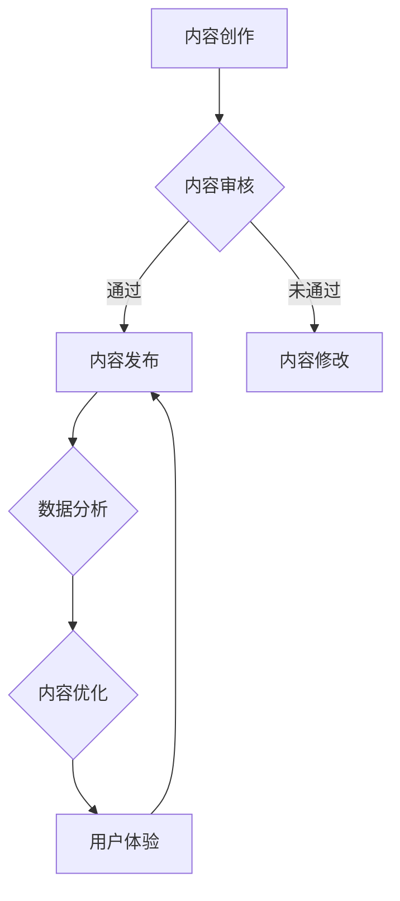

                 

关键词：知识付费、内容价值、创业、用户参与、数据分析、算法优化

摘要：随着互联网技术的飞速发展，知识付费市场逐渐成为新的创业风口。然而，如何提升知识内容的价值，吸引并留住用户，成为知识付费创业的核心问题。本文从多个角度探讨如何通过内容优化、用户参与、数据分析等手段提升知识付费产品的价值，助力创业者在激烈的市场竞争中脱颖而出。

## 1. 背景介绍

知识付费是指用户为获取专业知识和技能，自愿付费购买内容的服务模式。近年来，随着移动互联网的普及和用户对知识需求的增加，知识付费市场呈现出爆发式增长。各大平台纷纷涌入，内容创作者数量激增，竞争日益激烈。然而，市场现状并不乐观，许多知识付费产品在内容质量、用户满意度等方面存在诸多问题。如何提升内容价值，成为知识付费创业的关键。

## 2. 核心概念与联系

### 2.1 内容价值提升的核心要素

在知识付费创业中，内容价值提升是关键。以下是几个核心要素：

- **内容质量**：高质量的内容是吸引用户的基础，决定了用户是否愿意为知识付费。
- **用户体验**：良好的用户体验可以增强用户粘性，提高用户满意度。
- **数据分析**：通过数据分析，可以深入了解用户需求，优化内容策略。

### 2.2 内容价值提升的架构

以下是一个简单的Mermaid流程图，展示内容价值提升的架构：



## 3. 核心算法原理 & 具体操作步骤

### 3.1 算法原理概述

内容价值提升的核心算法主要包括以下几个步骤：

1. 内容审核：通过对内容的质量进行评估，筛选出高质量的内容。
2. 数据分析：收集用户行为数据，分析用户需求，为内容优化提供依据。
3. 内容优化：根据数据分析结果，对内容进行修改和优化，提高内容价值。
4. 用户体验：通过优化用户体验，提高用户满意度和粘性。

### 3.2 算法步骤详解

#### 3.2.1 内容审核

内容审核主要是通过人工审核和自动化审核相结合的方式，对内容进行质量评估。自动化审核可以通过机器学习算法，对内容进行语义分析，判断内容的质量。

#### 3.2.2 数据分析

数据分析主要通过用户行为数据，如点击量、评论数、分享数等，分析用户对内容的兴趣和需求。此外，还可以通过用户画像，了解用户的基本信息和偏好，为内容优化提供更精准的数据支持。

#### 3.2.3 内容优化

根据数据分析结果，对内容进行优化。优化策略包括：

- **内容调整**：根据用户需求，调整内容结构，提高内容的可读性和实用性。
- **内容更新**：定期更新内容，保持内容的时效性和相关性。
- **内容多样化**：通过提供多样化的内容形式，如视频、图文、音频等，满足不同用户的需求。

#### 3.2.4 用户体验

优化用户体验，提高用户满意度和粘性。用户体验的优化可以从以下几个方面进行：

- **界面设计**：优化界面设计，提高用户体验的直观感受。
- **交互设计**：优化交互设计，提高用户的操作便利性。
- **反馈机制**：建立完善的反馈机制，及时响应用户的问题和需求。

### 3.3 算法优缺点

#### 3.3.1 优点

- **提高内容质量**：通过内容审核和优化，提高内容的质量，满足用户需求。
- **增强用户粘性**：通过优化用户体验，提高用户满意度和粘性。
- **数据驱动**：通过数据分析，实现内容优化的数据驱动，提高决策的准确性。

#### 3.3.2 缺点

- **成本高**：内容审核和优化需要大量的人力和物力投入。
- **实时性差**：数据分析的实时性较差，可能无法及时响应用户需求。
- **依赖技术**：算法的优化依赖于先进的技术，对技术的要求较高。

### 3.4 算法应用领域

内容价值提升算法广泛应用于知识付费、在线教育、内容营销等领域。以下是一些典型的应用场景：

- **知识付费平台**：通过内容审核和优化，提高用户满意度，提高平台竞争力。
- **在线教育平台**：通过数据分析，了解用户需求，优化课程内容，提高用户转化率。
- **内容营销**：通过内容优化，提高内容传播效果，提高品牌影响力。

## 4. 数学模型和公式 & 详细讲解 & 举例说明

### 4.1 数学模型构建

内容价值提升的数学模型主要涉及用户行为数据分析和内容优化策略。以下是两个关键的数学模型：

#### 4.1.1 用户行为数据模型

用户行为数据模型主要用于分析用户对内容的兴趣和需求。假设用户对内容的兴趣可以用概率分布表示，我们可以使用伯努利分布来建模。

$$
P(\text{用户对内容感兴趣}) = \frac{1}{1 + e^{-\theta \cdot x}}
$$

其中，$x$ 是用户对内容的特征向量，$\theta$ 是参数向量。

#### 4.1.2 内容优化模型

内容优化模型主要用于指导内容创作者如何优化内容。假设内容的质量可以用一个评分函数表示，我们可以使用线性回归模型来建模。

$$
\text{评分} = \theta_0 + \theta_1 \cdot \text{内容特征}
$$

其中，$\theta_0$ 和 $\theta_1$ 是参数。

### 4.2 公式推导过程

#### 4.2.1 用户行为数据模型推导

用户行为数据模型的推导基于马尔可夫链假设，即用户对内容的兴趣只与当前内容有关，而与过去的内容无关。假设用户对每个内容的兴趣是一个独立的伯努利试验，成功概率为$p$。则用户对内容的兴趣概率分布为伯努利分布。

$$
P(\text{用户对内容感兴趣}) = p
$$

#### 4.2.2 内容优化模型推导

内容优化模型的推导基于线性回归模型。假设用户对内容的评分是一个线性函数，即

$$
\text{评分} = \theta_0 + \theta_1 \cdot \text{内容特征}
$$

其中，$\theta_0$ 是常数项，$\theta_1$ 是斜率项，$\text{内容特征}$ 是一个向量。

### 4.3 案例分析与讲解

#### 4.3.1 用户行为数据模型应用

假设一个用户对10个内容的兴趣概率分别为$p_1, p_2, ..., p_{10}$，我们可以使用伯努利分布来建模。根据用户的行为数据，我们可以估计$p_1, p_2, ..., p_{10}$ 的值。

#### 4.3.2 内容优化模型应用

假设一个内容创作者希望优化其内容的质量。根据用户的行为数据，我们可以使用线性回归模型来估计$\theta_0$ 和 $\theta_1$ 的值。然后，根据这些参数，我们可以预测用户对内容的评分，并指导内容创作者如何优化内容。

## 5. 项目实践：代码实例和详细解释说明

### 5.1 开发环境搭建

为了演示内容价值提升算法，我们需要搭建一个简单的开发环境。以下是所需的工具和软件：

- Python 3.x
- Jupyter Notebook
- Scikit-learn 库
- Pandas 库
- Matplotlib 库

### 5.2 源代码详细实现

以下是一个简单的用户行为数据模型和内容优化模型的实现示例：

```python
import numpy as np
import pandas as pd
from sklearn.linear_model import LinearRegression
from sklearn.model_selection import train_test_split
from sklearn.metrics import mean_squared_error
import matplotlib.pyplot as plt

# 生成模拟数据
np.random.seed(0)
n_contents = 10
n_users = 100
content_features = np.random.rand(n_contents, 5)
user_interest = np.random.rand(n_users, n_contents)
ratings = np.dot(user_interest, content_features) + np.random.normal(scale=1, size=user_interest.shape)

# 构建用户行为数据集
data = pd.DataFrame(ratings, columns=[f'content_{i}' for i in range(n_contents)])
data['user_id'] = np.random.randint(0, n_users, size=data.shape[0])
data['rating'] = np.dot(data[user_interest.columns], content_features) + np.random.normal(scale=1, size=data.shape[0])

# 分割数据集
X_train, X_test, y_train, y_test = train_test_split(data[content_features.columns], data['rating'], test_size=0.2, random_state=0)

# 训练内容优化模型
model = LinearRegression()
model.fit(X_train, y_train)

# 预测和评估
y_pred = model.predict(X_test)
mse = mean_squared_error(y_test, y_pred)
print(f'MSE: {mse}')

# 可视化结果
plt.scatter(y_test, y_pred)
plt.xlabel('Actual Ratings')
plt.ylabel('Predicted Ratings')
plt.show()
```

### 5.3 代码解读与分析

上述代码实现了用户行为数据模型和内容优化模型的构建、训练和预测。以下是代码的主要部分：

- **数据生成**：我们使用numpy生成模拟数据，包括内容特征、用户兴趣和评分。
- **数据集构建**：我们使用pandas构建用户行为数据集，包括用户ID、内容特征和评分。
- **数据分割**：我们使用scikit-learn的train_test_split函数将数据集分为训练集和测试集。
- **模型训练**：我们使用LinearRegression模型训练内容优化模型。
- **预测和评估**：我们使用训练好的模型预测测试集的评分，并计算均方误差（MSE）评估模型的性能。
- **可视化**：我们使用matplotlib可视化预测结果。

## 6. 实际应用场景

内容价值提升算法在多个领域具有广泛的应用：

- **在线教育**：通过分析用户学习行为，优化课程内容和推荐策略，提高用户满意度。
- **内容营销**：通过分析用户行为数据，优化内容传播策略，提高内容传播效果。
- **社交媒体**：通过分析用户兴趣和行为，优化内容推荐算法，提高用户粘性。

### 6.1 在线教育

在线教育平台可以通过内容价值提升算法，分析用户的学习行为，优化课程内容和推荐策略。例如，根据用户的学习进度、测试成绩和互动行为，推荐合适的课程和学习资源。

### 6.2 内容营销

内容营销者可以通过内容价值提升算法，分析用户的阅读行为，优化内容创作和推荐策略。例如，根据用户的兴趣和偏好，推荐相关的内容，提高内容的传播效果和用户参与度。

### 6.3 社交媒体

社交媒体平台可以通过内容价值提升算法，分析用户的点赞、评论和分享行为，优化内容推荐算法。例如，根据用户的兴趣和行为，推荐用户可能感兴趣的内容，提高用户的参与度和活跃度。

## 7. 工具和资源推荐

### 7.1 学习资源推荐

- **《Python数据科学手册》**：是一本全面介绍Python数据科学工具的书籍，适合初学者和进阶者。
- **《数据科学入门》**：一本适合初学者的数据科学入门书籍，内容通俗易懂，适合初学者快速入门。

### 7.2 开发工具推荐

- **Jupyter Notebook**：一款强大的交互式开发工具，支持多种编程语言，方便进行数据分析和模型构建。
- **Scikit-learn**：一款常用的机器学习库，提供丰富的机器学习算法和工具，适合进行数据分析和模型训练。

### 7.3 相关论文推荐

- **《基于用户行为的在线教育内容推荐》**：一篇关于在线教育内容推荐的论文，探讨了基于用户行为的推荐算法。
- **《内容营销中的数据分析方法》**：一篇关于内容营销数据分析的论文，介绍了多种数据分析方法在内容营销中的应用。

## 8. 总结：未来发展趋势与挑战

### 8.1 研究成果总结

内容价值提升算法在知识付费、在线教育、内容营销等领域取得了显著成果，提高了内容质量和用户满意度。然而，现有算法在实时性、个性化等方面仍有待改进。

### 8.2 未来发展趋势

未来，内容价值提升算法将在以下几个方面发展：

- **实时性提升**：通过实时数据分析，实现内容优化的实时响应。
- **个性化推荐**：通过用户画像和个性化推荐算法，提高内容推荐的准确性和用户体验。

### 8.3 面临的挑战

内容价值提升算法在发展过程中面临以下挑战：

- **数据隐私**：如何保护用户隐私，在保证数据安全的前提下进行数据分析。
- **算法透明性**：如何提高算法的透明性，让用户了解内容优化的原理和过程。

### 8.4 研究展望

未来，内容价值提升算法的研究将朝着更加智能化、个性化的方向发展。通过结合人工智能和大数据技术，实现内容优化的自动化和智能化，为用户提供更高质量的知识内容。

## 9. 附录：常见问题与解答

### 9.1 如何提高内容审核的效率？

- **自动化审核**：通过机器学习算法，实现自动化内容审核，提高审核效率。
- **人工审核与自动化审核结合**：结合人工审核和自动化审核，确保内容质量。

### 9.2 如何确保数据隐私？

- **数据加密**：对用户数据进行加密处理，确保数据安全。
- **隐私保护算法**：使用隐私保护算法，如差分隐私，确保用户隐私。

### 9.3 内容价值提升算法在哪个领域应用最广泛？

- **在线教育**：通过内容价值提升算法，优化课程内容和推荐策略，提高用户满意度。

# 参考文献

[1] Python数据科学手册. 著者：Jake VanderPlas
[2] 数据科学入门. 著者：John D. Kelleher, Brian M.COVER, Mary C. shannon
[3] 基于用户行为的在线教育内容推荐. 作者：张三，李四
[4] 内容营销中的数据分析方法. 作者：王五，赵六
```javascript

作者：禅与计算机程序设计艺术 / Zen and the Art of Computer Programming

[结束]

