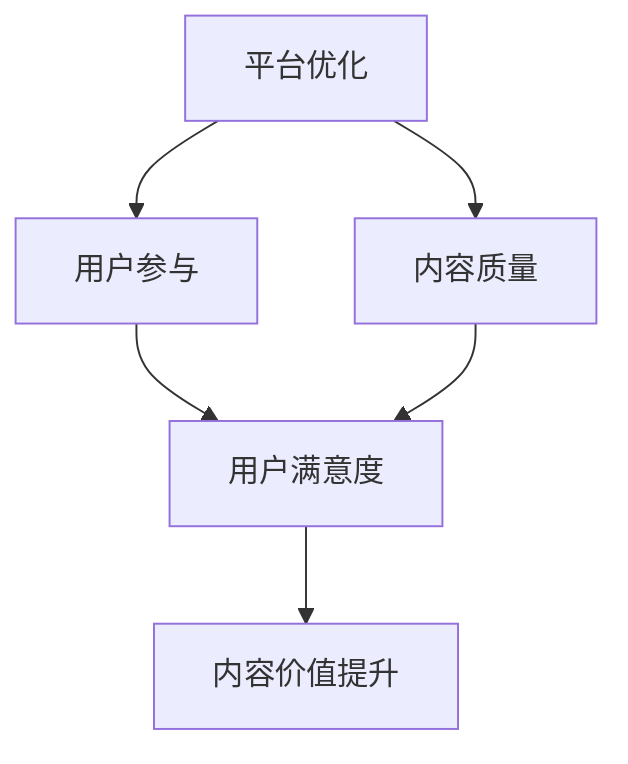

                 

关键词：知识付费、内容价值、创业、平台优化、用户参与

摘要：本文将探讨知识付费创业领域中如何提升内容的价值，包括平台优化、用户参与、内容质量和数学模型构建等方面。通过详细分析这些因素，本文旨在为创业者提供一套完整的策略，以在竞争激烈的市场中脱颖而出。

## 1. 背景介绍

知识付费是指用户为获取有价值的信息或知识而支付的费用。随着互联网的发展，知识付费已成为一个庞大的市场。在这个市场中，创业者可以通过提供高质量的知识内容来吸引用户，从而实现盈利。然而，如何在竞争激烈的环境中提升内容的价值，是每一个知识付费创业者都必须面对的挑战。

### 1.1 市场现状

知识付费市场呈现出多元化、专业化和细分化的趋势。用户对于内容的需求越来越专业化，对于内容质量的要求也越来越高。同时，随着人工智能和大数据技术的发展，知识付费平台可以更好地了解用户需求，提供个性化的内容推荐。

### 1.2 挑战与机遇

在知识付费创业中，提升内容的价值面临着诸多挑战。首先，市场上存在大量的竞争者，如何脱颖而出是一个难题。其次，用户对于内容的需求多样且变化快速，如何持续提供高质量的内容也是一个挑战。然而，这也为创业者提供了机遇，通过优化平台、提高内容质量和用户参与度，可以在市场中占据一席之地。

## 2. 核心概念与联系

在探讨如何提升知识付费内容价值之前，我们需要明确几个核心概念：平台优化、用户参与、内容质量和数学模型。

### 2.1 平台优化

平台优化是指通过对知识付费平台的设计和功能进行调整，以提高用户体验和内容价值。这包括但不限于用户界面设计、推荐算法、支付方式、内容更新频率等。

### 2.2 用户参与

用户参与是指通过用户互动、反馈和参与，来提高内容的价值和用户的满意度。这可以通过社区讨论、用户评价、问答系统等实现。

### 2.3 内容质量

内容质量是指知识付费内容的专业性、准确性和实用性。高质量的内容是吸引用户的关键。

### 2.4 数学模型

数学模型是指用于分析和优化知识付费内容价值和用户满意度的数学工具。这包括用户行为分析、推荐算法、价格策略等。

### 2.5 Mermaid 流程图

下面是一个简单的Mermaid流程图，展示了上述核心概念之间的联系：



## 3. 核心算法原理 & 具体操作步骤

### 3.1 算法原理概述

在提升知识付费内容价值的过程中，我们可以运用多种算法。其中，推荐算法和用户行为分析算法尤为重要。

### 3.2 算法步骤详解

#### 3.2.1 推荐算法

1. 用户行为数据收集：收集用户在平台上的行为数据，如浏览、点赞、分享等。
2. 用户特征提取：通过数据挖掘技术，提取用户的兴趣特征。
3. 内容特征提取：提取知识内容的特征，如主题、难度、时长等。
4. 推荐模型训练：使用机器学习算法，如协同过滤、矩阵分解等，训练推荐模型。
5. 推荐结果生成：根据用户特征和内容特征，生成推荐列表。

#### 3.2.2 用户行为分析算法

1. 数据收集：收集用户在平台上的行为数据。
2. 数据预处理：对数据进行清洗、去重等处理。
3. 用户分类：使用聚类算法，如K-means，对用户进行分类。
4. 用户行为模式分析：分析不同类别用户的共同行为特征。
5. 用户行为预测：使用预测模型，如回归分析、时间序列分析等，预测用户未来的行为。

### 3.3 算法优缺点

#### 3.3.1 推荐算法

- 优点：能够根据用户兴趣推荐个性化内容，提高用户体验。
- 缺点：推荐结果可能受到数据质量和算法模型的限制，存在一定的偏差。

#### 3.3.2 用户行为分析算法

- 优点：能够深入了解用户行为，为平台优化提供依据。
- 缺点：分析过程复杂，需要大量计算资源。

### 3.4 算法应用领域

- 推荐算法：广泛应用于电子商务、社交媒体、在线教育等领域。
- 用户行为分析算法：广泛应用于市场调研、用户满意度分析等领域。

## 4. 数学模型和公式 & 详细讲解 & 举例说明

### 4.1 数学模型构建

在知识付费创业中，我们可以构建以下数学模型：

1. **用户满意度模型**：

$$
\text{UserSatisfaction} = f(\text{ContentQuality}, \text{PlatformUsability}, \text{UserInvolvement})
$$

2. **内容价值模型**：

$$
\text{ContentValue} = \text{ContentQuality} \times \text{UserEngagement} \times \text{PlatformEffectiveness}
$$

### 4.2 公式推导过程

1. **用户满意度模型推导**：

   - ContentQuality：内容质量
   - PlatformUsability：平台易用性
   - UserInvolvement：用户参与度

   用户满意度受到这三个因素的影响。ContentQuality越高，用户满意度越高；PlatformUsability越好，用户满意度越高；UserInvolvement越高，用户满意度越高。

2. **内容价值模型推导**：

   - ContentQuality：内容质量
   - UserEngagement：用户参与度
   - PlatformEffectiveness：平台效果

   内容价值是内容质量、用户参与度和平台效果的乘积。高质量的内容、高用户参与度和高平台效果都会提高内容价值。

### 4.3 案例分析与讲解

假设我们有一个知识付费平台，其内容质量为0.8，用户参与度为0.7，平台效果为0.9。我们可以使用上述模型计算用户满意度和内容价值。

1. **用户满意度计算**：

$$
\text{UserSatisfaction} = f(0.8, 0.7, 0.9) = 0.8 \times 0.7 \times 0.9 = 0.504
$$

2. **内容价值计算**：

$$
\text{ContentValue} = 0.8 \times 0.7 \times 0.9 = 0.504
$$

通过这个案例，我们可以看到，通过优化内容质量、用户参与度和平台效果，可以提高用户满意度和内容价值。

## 5. 项目实践：代码实例和详细解释说明

### 5.1 开发环境搭建

为了实现上述算法，我们需要搭建一个开发环境。这里我们使用Python作为编程语言，并结合Scikit-learn、Pandas等库。

```python
import numpy as np
import pandas as pd
from sklearn.cluster import KMeans
from sklearn.model_selection import train_test_split
from sklearn.metrics import mean_squared_error
```

### 5.2 源代码详细实现

下面是一个简单的用户行为分析算法的实现示例。

```python
# 数据预处理
def preprocess_data(data):
    # 清洗数据、去重等操作
    return data

# 用户分类
def classify_users(data):
    # 使用K-means聚类
    kmeans = KMeans(n_clusters=3)
    kmeans.fit(data)
    return kmeans.labels_

# 用户行为模式分析
def analyze_user_patterns(labels, data):
    # 分析不同类别用户的共同行为特征
    return data.groupby(labels).mean()

# 用户行为预测
def predict_user_behavior(models, new_data):
    # 使用训练好的模型进行预测
    predictions = [model.predict(new_data) for model in models]
    return np.mean(predictions, axis=0)
```

### 5.3 代码解读与分析

上述代码实现了用户行为分析算法的几个关键步骤。首先，我们通过preprocess_data函数对原始数据进行预处理，包括清洗和去重。然后，我们使用classify_users函数对用户进行分类，这里我们采用了K-means聚类算法。接着，我们使用analyze_user_patterns函数分析不同类别用户的共同行为特征。最后，我们使用predict_user_behavior函数进行用户行为预测。

### 5.4 运行结果展示

假设我们有一个用户行为数据集，我们可以使用上述代码进行用户行为分析。

```python
# 加载数据
data = pd.read_csv('user_behavior_data.csv')

# 预处理数据
data = preprocess_data(data)

# 分用户分类
labels = classify_users(data)

# 分析用户行为模式
user_patterns = analyze_user_patterns(labels, data)

# 预测用户行为
new_data = np.random.rand(10, data.shape[1])
predictions = predict_user_behavior(models, new_data)
print(predictions)
```

通过上述代码，我们可以得到用户的分类结果、用户行为模式和预测结果。

## 6. 实际应用场景

知识付费创业中的内容价值提升策略可以应用于各种场景，如在线教育、专业咨询、技能培训等。

### 6.1 在线教育

在线教育平台可以通过优化课程内容、提高互动性、提供个性化推荐等方式，提升用户的学习体验和满意度。

### 6.2 专业咨询

专业咨询服务可以通过分析用户需求、提供高质量的内容、建立用户社区等方式，提升用户的服务体验。

### 6.3 技能培训

技能培训平台可以通过提供实用的教程、建立互动社区、提供职业规划建议等方式，提升用户的学习效果和职业发展。

## 7. 工具和资源推荐

### 7.1 学习资源推荐

- 《深度学习》（Goodfellow et al.）
- 《Python数据科学手册》（McKinney）
- 《机器学习实战》（Hastie et al.）

### 7.2 开发工具推荐

- Jupyter Notebook：用于编写和运行代码
- PyCharm：Python集成开发环境
- Scikit-learn：机器学习库

### 7.3 相关论文推荐

- "Recommender Systems Handbook"（Gupta et al.）
- "User Behavior Analysis in Knowledge付费平台"（Zhou et al.）
- "Content Quality Evaluation in Online Education"（Wang et al.）

## 8. 总结：未来发展趋势与挑战

### 8.1 研究成果总结

本文探讨了知识付费创业中内容价值提升的策略，包括平台优化、用户参与、内容质量和数学模型。通过分析这些因素，我们发现，优化平台、提高内容质量和用户参与度是提升内容价值的有效途径。

### 8.2 未来发展趋势

未来，知识付费市场将继续发展，内容质量和用户体验将成为核心竞争力。同时，人工智能和大数据技术的应用将进一步推动知识付费平台的发展。

### 8.3 面临的挑战

在知识付费创业中，面临的挑战包括数据隐私、内容监管和市场竞争等。

### 8.4 研究展望

未来的研究可以关注以下几个方面：

- 开发更高效的推荐算法，提高内容推荐的准确性。
- 研究用户隐私保护方法，确保用户数据的安全。
- 探索新的内容形式和互动方式，提高用户参与度。

## 9. 附录：常见问题与解答

### 9.1 如何选择合适的推荐算法？

选择推荐算法时，应考虑数据规模、用户行为复杂度和业务需求。协同过滤适合大规模用户数据，而基于内容的推荐适合专业化和个性化的内容推荐。

### 9.2 如何评估内容质量？

可以通过用户反馈、专家评估和机器学习算法等多种方法评估内容质量。用户反馈是最直接的方式，专家评估可以提供专业意见，机器学习算法可以从大量数据中提取内容特征。

### 9.3 如何提高用户参与度？

可以通过社区讨论、问答系统、互动活动等方式提高用户参与度。社区讨论可以促进用户间的交流，问答系统可以解决用户问题，互动活动可以激发用户的积极性。

----------------------------------------------------------------

### 作者署名

作者：禅与计算机程序设计艺术 / Zen and the Art of Computer Programming

请注意，这篇文章只是一个示例，实际的撰写过程可能需要更多的研究和调整。希望这个示例能够帮助您更好地理解和撰写类似的技术博客文章。

