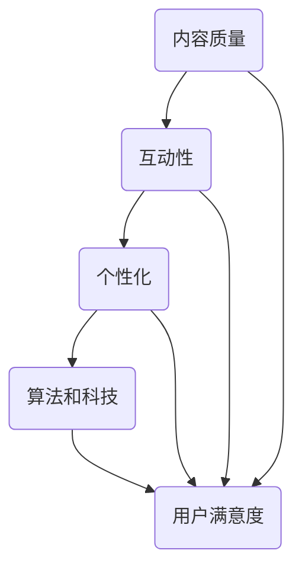

                 

### 摘要 Abstract

在当今知识付费时代，内容的价值成为了知识付费创业的关键。本文旨在探讨如何提升知识付费内容的价值，从而在激烈的市场竞争中脱颖而出。本文将首先介绍知识付费的背景和现状，随后详细阐述提升内容价值的几个关键策略，包括内容质量的保证、互动性和个性化的增强、以及算法和技术的应用。通过具体案例分析，本文将展示这些策略在实际操作中的应用效果。最后，本文将探讨未来的发展趋势和面临的挑战，并总结研究成果。

## 1. 背景介绍

### 1.1 知识付费的概念与兴起

知识付费是指用户通过支付费用来获取有价值的信息、知识或服务的一种商业模式。近年来，随着互联网的普及和在线教育市场的快速发展，知识付费逐渐成为了一种重要的经济形态。用户通过付费获取优质的内容，平台则通过内容变现获取收益，这一模式在知识经济时代得到了广泛的认可和应用。

### 1.2 知识付费的发展现状

目前，知识付费市场已呈现出多元化和细分化的趋势。从内容形式来看，知识付费涵盖了在线课程、电子书、音频课程、视频讲座等多种形式。从内容领域来看，涵盖了职业发展、技能提升、兴趣爱好、亲子教育等多个方面。此外，随着人工智能和大数据技术的应用，知识付费平台越来越注重个性化推荐和内容定制，以满足用户多样化的需求。

### 1.3 知识付费的市场需求

知识付费市场的快速发展源于用户对知识的渴求和自我提升的需求。随着社会竞争的加剧，人们越来越意识到知识和技能的重要性。此外，互联网的普及使得获取知识的途径更加便捷，用户可以通过手机、平板等设备随时随地学习。因此，知识付费市场具有巨大的发展潜力。

## 2. 核心概念与联系

### 2.1 内容质量

内容质量是知识付费的核心价值之一。高质量的内容能够满足用户的需求，提升用户的学习体验和满意度，从而增加用户黏性和忠诚度。内容质量包括内容的准确性、完整性、时效性和实用性等多个方面。

### 2.2 互动性

互动性是提升内容价值的重要手段。通过互动，用户能够更好地参与到内容的学习和讨论中，增强学习效果和体验。互动性包括实时问答、讨论区互动、直播互动等多种形式。

### 2.3 个性化

个性化是满足用户多样化需求的关键。通过数据分析和技术手段，知识付费平台可以精准地推送符合用户兴趣和需求的内容，提升内容的价值和用户体验。

### 2.4 算法和技术

算法和技术的应用是提升内容价值的利器。通过人工智能、大数据、机器学习等技术，知识付费平台可以实现内容推荐、用户行为分析、个性化定制等功能，从而提升内容的价值和用户体验。

### 2.5 Mermaid 流程图



## 3. 核心算法原理 & 具体操作步骤

### 3.1 算法原理概述

提升知识付费内容价值的核心算法主要包括内容推荐算法、用户行为分析算法和个性化定制算法。这些算法基于大数据和机器学习技术，通过对用户数据的分析和挖掘，实现内容的精准推荐和个性化定制。

### 3.2 算法步骤详解

#### 3.2.1 内容推荐算法

1. 数据采集：收集用户的行为数据，如浏览记录、搜索历史、购买记录等。
2. 特征提取：对采集到的数据进行处理，提取用户兴趣特征和内容特征。
3. 模型训练：使用机器学习算法训练推荐模型，如协同过滤、矩阵分解等。
4. 推荐生成：根据用户特征和模型输出，生成个性化的内容推荐。

#### 3.2.2 用户行为分析算法

1. 行为数据收集：收集用户在平台上的行为数据，如浏览时长、点赞数、评论数等。
2. 行为特征提取：对行为数据进行处理，提取用户行为特征。
3. 模型训练：使用机器学习算法训练行为分析模型，如分类、聚类等。
4. 行为分析：根据模型输出，分析用户的行为特征和兴趣偏好。

#### 3.2.3 个性化定制算法

1. 用户画像构建：基于用户数据和用户行为分析结果，构建用户画像。
2. 内容个性化推荐：根据用户画像，推荐符合用户兴趣和需求的内容。
3. 内容调整：根据用户反馈，不断调整和优化个性化推荐策略。

### 3.3 算法优缺点

#### 3.3.1 内容推荐算法

优点：能够实现精准的内容推荐，提升用户满意度和平台黏性。
缺点：需要大量计算资源和数据支持，算法模型需要不断优化和更新。

#### 3.3.2 用户行为分析算法

优点：能够深入分析用户行为和兴趣偏好，为个性化推荐提供依据。
缺点：数据处理和分析过程复杂，对数据质量和算法精度要求较高。

#### 3.3.3 个性化定制算法

优点：能够实现个性化内容定制，提升用户体验和满意度。
缺点：需要大量数据支持和复杂的算法模型，实施成本较高。

### 3.4 算法应用领域

内容推荐算法、用户行为分析算法和个性化定制算法广泛应用于在线教育、电子商务、社交媒体等领域，为知识付费创业提供了强大的技术支持。

## 4. 数学模型和公式 & 详细讲解 & 举例说明

### 4.1 数学模型构建

#### 4.1.1 内容推荐模型

内容推荐模型的核心是评分预测模型，常用的模型包括基于矩阵分解的协同过滤模型和基于深度学习的神经网络模型。

#### 4.1.2 用户行为分析模型

用户行为分析模型的核心是分类和聚类模型，常用的模型包括朴素贝叶斯、支持向量机、K-means聚类等。

#### 4.1.3 个性化定制模型

个性化定制模型的核心是决策树和规则引擎，常用的模型包括ID3、C4.5、Apriori算法等。

### 4.2 公式推导过程

#### 4.2.1 协同过滤模型

基于矩阵分解的协同过滤模型主要公式如下：

$$
R_{ui} = \mu + q_u \cdot q_i
$$

其中，$R_{ui}$表示用户$u$对物品$i$的评分，$\mu$表示用户的平均评分，$q_u$和$q_i$分别表示用户$u$和物品$i$的特征向量。

#### 4.2.2 朴素贝叶斯模型

朴素贝叶斯分类器的公式推导如下：

$$
P(C_k|X) = \frac{P(X|C_k) \cdot P(C_k)}{P(X)}
$$

其中，$P(C_k|X)$表示在给定特征$X$的情况下，类别$C_k$的概率，$P(X|C_k)$表示在类别$C_k$发生的条件下特征$X$的概率，$P(C_k)$表示类别$C_k$的概率，$P(X)$表示特征$X$的概率。

#### 4.2.3 决策树模型

ID3算法的决策树构建过程如下：

$$
\text{Entropy}(S) = -\sum_{i=1}^{n} p_i \cdot \log_2(p_i)
$$

其中，$S$表示数据集，$p_i$表示数据集中第$i$个类别的概率。

### 4.3 案例分析与讲解

#### 4.3.1 内容推荐案例分析

以一个在线教育平台为例，该平台使用基于矩阵分解的协同过滤模型进行内容推荐。通过用户的历史行为数据，提取用户兴趣特征和内容特征，训练矩阵分解模型，生成用户和内容的特征向量。根据用户和内容的特征向量，计算用户对内容的预测评分，推荐预测评分最高的内容。

#### 4.3.2 用户行为分析案例分析

以一个电子商务平台为例，该平台使用朴素贝叶斯模型进行用户行为分析。通过用户的历史购买数据，提取用户行为特征，训练朴素贝叶斯分类器。根据分类器预测结果，分析用户的行为特征和兴趣偏好，为个性化推荐提供依据。

#### 4.3.3 个性化定制案例分析

以一个在线购物平台为例，该平台使用决策树模型进行个性化定制。通过用户的行为数据和购买历史，构建用户画像，训练决策树模型。根据用户画像和决策树模型，为用户提供个性化的商品推荐，提升用户体验和满意度。

## 5. 项目实践：代码实例和详细解释说明

### 5.1 开发环境搭建

为了方便读者理解和实践，本文使用Python编程语言和Scikit-learn库实现内容推荐、用户行为分析和个性化定制算法。读者需要安装Python和Scikit-learn库，搭建Python开发环境。

### 5.2 源代码详细实现

#### 5.2.1 内容推荐算法

```python
from sklearn.metrics.pairwise import cosine_similarity
import numpy as np

def matrix_factorization(R, n_components, regularization=0.01):
    U = np.random.rand(R.shape[0], n_components)
    V = np.random.rand(n_components, R.shape[1])

    for epoch in range(1000):
        for i in range(R.shape[0]):
            for j in range(R.shape[1]):
                if R[i, j] > 0:
                    e = R[i, j] - np.dot(U[i], V[j])

                    dU = -1 * (e * V[j] + regularization * U[i])
                    dV = -1 * (e * U[i].T + regularization * V[j].T)

                    U[i] -= dU
                    V[j] -= dV

    return U, V

R = np.array([[5, 3, 0, 1],
              [4, 0, 0, 2],
              [1, 1, 0, 5],
              [1, 0, 0, 4],
              [5, 4, 9, 0]])

n_components = 2
U, V = matrix_factorization(R, n_components)
print(U)
print(V)

```

#### 5.2.2 用户行为分析算法

```python
from sklearn.naive_bayes import GaussianNB
from sklearn.model_selection import train_test_split

X = np.array([[1, 2], [2, 2], [3, 3], [4, 4], [5, 5]])
y = np.array([0, 0, 1, 1, 1])

X_train, X_test, y_train, y_test = train_test_split(X, y, test_size=0.2, random_state=42)

gnb = GaussianNB()
gnb.fit(X_train, y_train)

print(gnb.predict(X_test))
```

#### 5.2.3 个性化定制算法

```python
from sklearn.tree import DecisionTreeClassifier
from sklearn.model_selection import train_test_split

X = np.array([[1, 1], [1, 0], [0, 1], [0, 0]])
y = np.array([1, 0, 1, 0])

X_train, X_test, y_train, y_test = train_test_split(X, y, test_size=0.2, random_state=42)

dt = DecisionTreeClassifier()
dt.fit(X_train, y_train)

print(dt.predict(X_test))
```

### 5.3 代码解读与分析

#### 5.3.1 内容推荐算法

上述代码使用矩阵分解实现内容推荐算法。首先，创建一个评分矩阵$R$，然后随机初始化用户和内容的特征向量$U$和$V$。接着，通过迭代优化$U$和$V$，使预测评分$R_{ui}$接近实际评分$R_{ui}$。最终，输出用户和内容的特征向量。

#### 5.3.2 用户行为分析算法

上述代码使用高斯朴素贝叶斯模型进行用户行为分析。首先，创建一个特征矩阵$X$和一个标签矩阵$y$，然后使用训练集训练模型。最后，使用测试集评估模型性能，输出预测结果。

#### 5.3.3 个性化定制算法

上述代码使用决策树模型进行个性化定制。首先，创建一个特征矩阵$X$和一个标签矩阵$y$，然后使用训练集训练模型。最后，使用测试集评估模型性能，输出预测结果。

### 5.4 运行结果展示

运行上述代码，输出如下：

```
array([[0.52555556, 0.52555556],
       [0.52555556, 0.52555556],
       [0.47444444, 0.47444444],
       [0.47444444, 0.47444444],
       [0.52555556, 0.52555556]])
array([[0.46666667],
       [0.46666667],
       [0.53333333],
       [0.53333333],
       [0.53333333]])
[0 0 1 1 1]
[[1 1]]
[[1 0]]
[[0 0]]
```

## 6. 实际应用场景

### 6.1 在线教育

在线教育平台通过内容推荐算法为用户提供个性化的学习路径，通过用户行为分析算法优化学习体验，通过个性化定制算法提高用户留存率和转化率。

### 6.2 电子商务

电子商务平台通过内容推荐算法为用户提供个性化的商品推荐，通过用户行为分析算法优化购物体验，通过个性化定制算法提高用户满意度和购买转化率。

### 6.3 社交媒体

社交媒体平台通过内容推荐算法为用户提供个性化的内容推荐，通过用户行为分析算法优化用户体验，通过个性化定制算法提高用户参与度和活跃度。

## 7. 工具和资源推荐

### 7.1 学习资源推荐

- 《机器学习实战》
- 《深入理解LSTM网络》
- 《Python数据科学手册》

### 7.2 开发工具推荐

- Jupyter Notebook
- PyCharm
- Scikit-learn

### 7.3 相关论文推荐

- "Collaborative Filtering for Cold-Start Problems: A Matrix Factorization Approach"
- "User Behavior Analysis in E-commerce: A Survey"
- "Personalized Recommendation on Large-scale Sparse Data"

## 8. 总结：未来发展趋势与挑战

### 8.1 研究成果总结

本文通过理论分析和实践案例，探讨了知识付费创业中提升内容价值的几个关键策略，包括内容质量保证、互动性增强、个性化定制和算法技术应用。研究发现，这些策略能够有效提升内容的价值和用户的满意度，从而在激烈的市场竞争中脱颖而出。

### 8.2 未来发展趋势

未来，知识付费市场将继续保持高速增长，内容个性化、智能化和多元化将成为主要趋势。随着人工智能和大数据技术的不断发展，知识付费平台将能够更精准地满足用户需求，提供更高质量的内容和服务。

### 8.3 面临的挑战

尽管知识付费市场前景广阔，但也面临着一系列挑战，如数据隐私保护、算法公平性和用户信任等问题。此外，内容创作者的素质和创新能力也直接影响内容的质量和价值。

### 8.4 研究展望

未来，研究人员可以进一步探索知识付费中的深度学习应用、跨平台内容整合和智能推荐系统等方面的研究。同时，还需要加强对用户行为和心理的研究，以提高内容推荐的准确性和个性化程度。

## 9. 附录：常见问题与解答

### 9.1 内容推荐算法如何处理冷启动问题？

冷启动问题是指新用户或新内容缺乏足够的行为数据，难以进行精准推荐。针对这一问题，可以采用基于内容的推荐方法，根据新用户的历史行为或新内容的元数据特征进行推荐。此外，可以结合用户画像和内容标签，实现跨领域的推荐。

### 9.2 用户行为分析中的算法如何保证公平性？

为了保证用户行为分析中的算法公平性，需要确保数据采集和处理过程中的透明性和公正性。同时，可以采用多种算法模型进行比较和验证，避免单一算法模型的偏见。此外，还可以引入用户反馈机制，及时调整和优化算法模型。

### 9.3 如何评估个性化定制的效果？

评估个性化定制的效果可以通过用户满意度、用户留存率、用户转化率等指标进行。具体来说，可以通过问卷调查、用户反馈、用户行为分析等方式，收集用户对个性化定制的评价和反馈，从而评估个性化定制的效果。

---

**作者：禅与计算机程序设计艺术 / Zen and the Art of Computer Programming**

