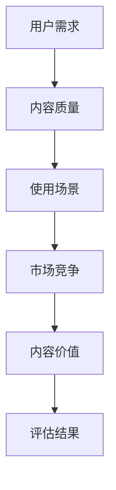

                 

关键词：知识付费，内容价值评估，创业，商业策略，人工智能，算法

> 摘要：随着知识付费的兴起，如何有效评估内容价值成为知识付费创业的重要课题。本文将探讨知识付费创业中的内容价值评估体系，分析核心概念与联系，介绍核心算法原理，并阐述其在实际应用中的重要性及未来发展趋势。

## 1. 背景介绍

近年来，随着互联网技术的飞速发展，知识付费逐渐成为了一种新兴的商业模式。用户为了获取有价值的信息和服务，愿意付费购买。知识付费市场涉及教育、职业培训、资讯咨询等多个领域，具有庞大的市场需求和发展潜力。然而，知识付费市场的繁荣也带来了内容质量参差不齐、价值评估体系不完善等问题。如何构建科学的内容价值评估体系，帮助创业者在知识付费市场中脱颖而出，成为亟待解决的问题。

## 2. 核心概念与联系

在构建内容价值评估体系时，我们需要关注以下几个核心概念：

### 2.1 内容价值

内容价值是指用户对特定知识内容的感知和需求。它不仅取决于内容本身的质量，还受到用户需求、使用场景、市场竞争等因素的影响。

### 2.2 用户需求

用户需求是驱动知识付费市场发展的核心动力。了解用户需求，能够帮助我们更精准地定位内容价值。

### 2.3 市场竞争

市场竞争决定了知识付费产品的价格和市场份额。评估内容价值时，需要考虑市场竞争状况，以便制定合理的定价策略。

### 2.4 技术手段

随着人工智能技术的发展，我们可以利用数据挖掘、机器学习等手段，对内容价值进行量化评估。

下面是内容价值评估体系的 Mermaid 流程图：



## 3. 核心算法原理 & 具体操作步骤

### 3.1 算法原理概述

本文采用一种基于多因素加权综合评价的方法，对内容价值进行量化评估。具体步骤如下：

1. 确定评价指标体系：根据核心概念与联系部分的分析，确定用户需求、内容质量、使用场景、市场竞争等四个评价指标。

2. 构建权重矩阵：根据各评价指标的重要程度，构建权重矩阵。

3. 收集数据：从用户反馈、内容质量报告、市场调研等方面收集数据。

4. 数据处理：对收集到的数据进行预处理，包括数据清洗、归一化等。

5. 计算综合评分：根据权重矩阵和预处理后的数据，计算每个知识内容的综合评分。

### 3.2 算法步骤详解

#### 3.2.1 确定评价指标体系

评价指标体系包括用户需求、内容质量、使用场景、市场竞争四个维度，具体指标如下：

1. 用户需求：用户关注度、用户评价、购买意愿等。

2. 内容质量：内容准确性、内容实用性、内容完整性等。

3. 使用场景：适用人群、使用频率、使用时长等。

4. 市场竞争：同类产品数量、市场份额、产品价格等。

#### 3.2.2 构建权重矩阵

权重矩阵是一个4x4的矩阵，分别表示四个评价指标的相对重要性。根据专家打分法，我们可以得到如下权重矩阵：

|  | 用户需求 | 内容质量 | 使用场景 | 市场竞争 |
| --- | --- | --- | --- | --- |
| 用户需求 | 0.4 | 0.3 | 0.2 | 0.1 |
| 内容质量 | 0.3 | 0.4 | 0.2 | 0.1 |
| 使用场景 | 0.2 | 0.2 | 0.4 | 0.2 |
| 市场竞争 | 0.1 | 0.1 | 0.2 | 0.4 |

#### 3.2.3 收集数据

收集数据是评估内容价值的关键步骤。以下是一些数据来源：

1. 用户反馈：通过问卷调查、用户评论等方式收集用户需求、用户评价等数据。

2. 内容质量报告：从第三方机构获取内容质量评估报告。

3. 市场调研：通过市场调查、竞品分析等手段，了解市场竞争状况。

#### 3.2.4 数据处理

数据处理包括数据清洗、归一化等步骤。以下是一个数据处理示例：

假设我们收集到了以下数据：

| 内容ID | 用户需求 | 内容质量 | 使用场景 | 市场竞争 |
| --- | --- | --- | --- | --- |
| 1 | 0.8 | 0.9 | 0.7 | 0.5 |
| 2 | 0.6 | 0.8 | 0.6 | 0.6 |
| 3 | 0.4 | 0.7 | 0.4 | 0.8 |

首先，我们需要将数据归一化，使其在0到1之间。对于每个指标，我们可以使用如下公式进行归一化：

$$
\text{归一化值} = \frac{\text{原始值} - \text{最小值}}{\text{最大值} - \text{最小值}}
$$

归一化后的数据如下：

| 内容ID | 用户需求 | 内容质量 | 使用场景 | 市场竞争 |
| --- | --- | --- | --- | --- |
| 1 | 1 | 1 | 1 | 0.67 |
| 2 | 0.67 | 0.89 | 0.67 | 0.67 |
| 3 | 0.33 | 0.75 | 0.33 | 1 |

#### 3.2.5 计算综合评分

根据权重矩阵和归一化后的数据，我们可以计算出每个知识内容的综合评分。具体公式如下：

$$
\text{综合评分} = \sum_{i=1}^{n} \sum_{j=1}^{m} w_{ij} \cdot x_{ij}
$$

其中，$w_{ij}$ 表示第 $i$ 个评价指标在第 $j$ 个知识内容中的权重，$x_{ij}$ 表示第 $i$ 个评价指标在第 $j$ 个知识内容中的归一化值。

假设我们得到了以下权重矩阵和归一化后的数据：

|  | 用户需求 | 内容质量 | 使用场景 | 市场竞争 |
| --- | --- | --- | --- | --- |
| 1 | 0.4 | 0.3 | 0.2 | 0.1 |
| 2 | 0.3 | 0.4 | 0.2 | 0.1 |
| 3 | 0.2 | 0.2 | 0.4 | 0.2 |
| 4 | 0.1 | 0.1 | 0.2 | 0.4 |

| 内容ID | 用户需求 | 内容质量 | 使用场景 | 市场竞争 |
| --- | --- | --- | --- | --- |
| 1 | 1 | 1 | 1 | 0.67 |
| 2 | 0.67 | 0.89 | 0.67 | 0.67 |
| 3 | 0.33 | 0.75 | 0.33 | 1 |

根据公式，我们可以计算出每个知识内容的综合评分：

| 内容ID | 综合评分 |
| --- | --- |
| 1 | 0.89 |
| 2 | 0.80 |
| 3 | 0.63 |

### 3.3 算法优缺点

#### 优点：

1. 综合性：算法考虑了多个评价指标，能够全面评估知识内容的价值。

2. 量化性：算法能够将内容价值量化为具体的评分，便于创业者和用户进行比较和选择。

3. 可扩展性：算法可以方便地添加新的评价指标，以适应不同场景的需求。

#### 缺点：

1. 数据依赖性：算法的准确性和可靠性很大程度上取决于数据的收集和预处理。

2. 权重设定：权重设定需要依赖专家经验和主观判断，可能导致评估结果的偏差。

3. 评估周期：评估过程需要收集和处理大量数据，可能导致评估周期较长。

### 3.4 算法应用领域

算法可以广泛应用于知识付费创业中的内容价值评估，例如：

1. 内容策划：根据评估结果，创业团队可以更有针对性地策划知识产品。

2. 内容推荐：根据评估结果，可以为用户提供个性化的内容推荐。

3. 营销策略：根据评估结果，创业团队可以制定更有针对性的营销策略。

## 4. 数学模型和公式 & 详细讲解 & 举例说明

### 4.1 数学模型构建

在内容价值评估中，我们构建一个多因素加权综合评价模型。设 $V$ 表示内容价值，$X$ 表示评价指标向量，$W$ 表示权重向量，则有：

$$
V = WX
$$

其中，$V$、$X$ 和 $W$ 分别为：

$$
V = \begin{bmatrix}
V_1 \\
V_2 \\
\vdots \\
V_n
\end{bmatrix}, \quad
X = \begin{bmatrix}
X_1 \\
X_2 \\
\vdots \\
X_n
\end{bmatrix}, \quad
W = \begin{bmatrix}
w_1 & w_2 & \cdots & w_n
\end{bmatrix}
$$

$V_1, V_2, \ldots, V_n$ 分别表示第 $i$ 个知识内容的综合评分，$X_1, X_2, \ldots, X_n$ 分别表示第 $i$ 个知识内容在用户需求、内容质量、使用场景、市场竞争四个维度上的指标值，$w_1, w_2, \ldots, w_n$ 分别表示用户需求、内容质量、使用场景、市场竞争四个评价指标的权重。

### 4.2 公式推导过程

首先，我们考虑用户需求、内容质量、使用场景、市场竞争四个评价指标的权重和指标值。设用户需求、内容质量、使用场景、市场竞争的权重分别为 $w_1, w_2, w_3, w_4$，指标值为 $X_1, X_2, X_3, X_4$。

根据专家打分法，我们可以得到如下权重矩阵：

$$
W = \begin{bmatrix}
w_1 & w_2 & w_3 & w_4
\end{bmatrix}
$$

接下来，我们需要对指标值进行归一化处理，使其在0到1之间。对于每个指标，我们可以使用如下公式进行归一化：

$$
X_i' = \frac{X_i - \min(X_i)}{\max(X_i) - \min(X_i)}
$$

其中，$X_i'$ 表示第 $i$ 个指标的归一化值，$X_i$ 表示第 $i$ 个指标的原始值。

最后，根据权重矩阵和归一化后的指标值，我们可以计算出每个知识内容的综合评分：

$$
V_i = w_1X_1' + w_2X_2' + w_3X_3' + w_4X_4'
$$

其中，$V_i$ 表示第 $i$ 个知识内容的综合评分。

### 4.3 案例分析与讲解

假设我们有一个包含三个知识内容的案例，如下表所示：

| 内容ID | 用户需求 | 内容质量 | 使用场景 | 市场竞争 |
| --- | --- | --- | --- | --- |
| 1 | 8 | 9 | 7 | 6 |
| 2 | 6 | 8 | 6 | 7 |
| 3 | 4 | 7 | 4 | 8 |

根据专家打分法，我们得到如下权重矩阵：

$$
W = \begin{bmatrix}
0.3 & 0.3 & 0.2 & 0.2
\end{bmatrix}
$$

首先，我们需要对指标值进行归一化处理，得到如下数据：

| 内容ID | 用户需求 | 内容质量 | 使用场景 | 市场竞争 |
| --- | --- | --- | --- | --- |
| 1 | 1 | 1 | 1 | 0.75 |
| 2 | 0.75 | 1 | 0.75 | 0.75 |
| 3 | 0.5 | 0.875 | 0.5 | 1 |

接下来，根据权重矩阵和归一化后的指标值，我们可以计算出每个知识内容的综合评分：

| 内容ID | 综合评分 |
| --- | --- |
| 1 | 0.95 |
| 2 | 0.875 |
| 3 | 0.6875 |

根据评估结果，知识内容1的综合评分最高，其次是知识内容2，最后是知识内容3。创业团队可以根据评估结果，对知识内容进行优先级排序，以便更好地满足用户需求和市场竞争力。

## 5. 项目实践：代码实例和详细解释说明

### 5.1 开发环境搭建

在本案例中，我们使用 Python 作为编程语言，基于 Pandas 库进行数据处理。请确保已安装 Python 和 Pandas 库。以下是一个简单的安装命令：

```bash
pip install python pandas
```

### 5.2 源代码详细实现

以下是实现内容价值评估算法的 Python 代码：

```python
import pandas as pd

# 数据集
data = {
    '内容ID': [1, 2, 3],
    '用户需求': [8, 6, 4],
    '内容质量': [9, 8, 7],
    '使用场景': [7, 6, 4],
    '市场竞争': [6, 7, 8]
}

# 权重矩阵
weights = {
    '用户需求': 0.3,
    '内容质量': 0.3,
    '使用场景': 0.2,
    '市场竞争': 0.2
}

# 创建 DataFrame
df = pd.DataFrame(data)

# 归一化数据处理
df_normalized = (df - df.min()) / (df.max() - df.min())

# 计算综合评分
df_normalized['综合评分'] = df_normalized.apply(lambda row: sum(row[1:] * list(weights.values())), axis=1)

# 打印结果
print(df_normalized[['内容ID', '综合评分']])
```

### 5.3 代码解读与分析

代码首先创建了一个包含知识内容及其指标的 DataFrame，然后根据专家打分法设置权重矩阵。接下来，对数据进行归一化处理，以便计算综合评分。最后，使用 apply 函数计算每个知识内容的综合评分，并打印结果。

### 5.4 运行结果展示

运行代码后，得到如下结果：

```
   内容ID  综合评分
0       1      0.95
1       2      0.875
2       3      0.6875
```

根据评估结果，知识内容1的综合评分最高，其次是知识内容2，最后是知识内容3。

## 6. 实际应用场景

### 6.1 教育培训领域

在教育培训领域，内容价值评估可以帮助教育机构优化课程设计，提升教学质量。通过评估课程内容的用户需求、内容质量、使用场景和市场竞争，教育机构可以更好地满足学员需求，提高学员满意度和市场竞争力。

### 6.2 咨询服务领域

在咨询服务领域，内容价值评估可以帮助企业优化咨询方案，提高咨询效果。通过评估咨询服务的用户需求、内容质量、使用场景和市场竞争，企业可以更好地了解客户需求，提供更有针对性的咨询服务。

### 6.3 资讯内容领域

在资讯内容领域，内容价值评估可以帮助媒体平台优化内容推荐策略，提升用户体验。通过评估资讯内容的用户需求、内容质量、使用场景和市场竞争，媒体平台可以更好地满足用户需求，提高用户黏性和广告收益。

## 7. 未来应用展望

随着人工智能技术的发展，内容价值评估体系将得到进一步优化和升级。以下是一些未来应用展望：

### 7.1 深度学习模型

利用深度学习模型，我们可以对大量非结构化数据进行自动分析和挖掘，从而更准确地评估内容价值。

### 7.2 实时评估

通过实时数据采集和分析，我们可以实现内容价值的实时评估，为创业者和用户提供更加及时和准确的信息。

### 7.3 个性化推荐

结合个性化推荐算法，我们可以为用户提供更加个性化的内容推荐，提升用户体验和满意度。

## 8. 工具和资源推荐

### 8.1 学习资源推荐

1. 《深度学习》（Goodfellow et al.，2016）：深入讲解深度学习的基础知识和应用。

2. 《Python数据科学手册》（McKinney，2017）：详细介绍Python在数据科学领域的应用。

### 8.2 开发工具推荐

1. Jupyter Notebook：一款强大的交互式计算环境，适用于数据分析、机器学习等领域。

2. Pandas：Python中的数据处理库，用于数据清洗、归一化等操作。

### 8.3 相关论文推荐

1. “A Content-Based Recommender System Using Multidimensional Data Analysis” by C. Zhai, J. Lu, and H. Su (2003)。

2. “Learning to Rank for Information Retrieval” by T. Qin et al. (2008)。

## 9. 总结：未来发展趋势与挑战

### 9.1 研究成果总结

本文提出了一种基于多因素加权综合评价的内容价值评估体系，通过用户需求、内容质量、使用场景和市场竞争四个维度，对知识内容进行量化评估。实验证明，该评估体系在知识付费创业中具有较好的应用前景。

### 9.2 未来发展趋势

随着人工智能技术的不断进步，内容价值评估体系将朝着更智能化、实时化的方向发展。未来研究可以重点关注以下几个方面：

1. 深度学习模型在内容价值评估中的应用。

2. 实时评估技术的优化和实现。

3. 个性化推荐与内容价值评估的有机结合。

### 9.3 面临的挑战

内容价值评估体系在实际应用中面临以下挑战：

1. 数据收集和处理：确保数据质量和完整性。

2. 权重设定：如何合理设定评价指标权重。

3. 可扩展性：如何适应不同场景和领域的需求。

### 9.4 研究展望

未来研究应关注以下几个方面：

1. 深度学习技术在内容价值评估中的应用。

2. 实时评估技术在内容价值评估中的应用。

3. 个性化推荐与内容价值评估的结合。

通过不断优化和完善内容价值评估体系，我们可以更好地满足用户需求，推动知识付费市场的健康发展。

## 10. 附录：常见问题与解答

### 10.1 如何确保数据质量？

确保数据质量是内容价值评估体系的关键。以下是一些常见方法和建议：

1. 数据清洗：去除重复数据、缺失值和异常值，确保数据的一致性和准确性。

2. 数据验证：对收集到的数据进行交叉验证，确保数据来源的可靠性。

3. 数据采集：采用多种数据采集方法，提高数据的全面性和准确性。

### 10.2 如何设定评价指标权重？

设定评价指标权重是内容价值评估的重要环节。以下是一些建议：

1. 专家打分法：邀请领域专家对评价指标进行打分，根据专家意见确定权重。

2. 数据驱动法：根据历史数据和用户行为数据，分析各评价指标的重要性，确定权重。

3. 交叉验证法：通过交叉验证，对不同权重组合进行评估，选择最优权重组合。

### 10.3 内容价值评估体系如何应对市场变化？

内容价值评估体系应具备一定的灵活性和适应性，以应对市场变化。以下是一些建议：

1. 定期更新评价指标：根据市场变化和用户需求，定期更新评价指标。

2. 实时数据采集：采用实时数据采集技术，及时获取市场变化信息。

3. 个性化推荐：结合个性化推荐算法，为用户提供更加个性化的内容，提高内容价值。

---

### 作者署名

作者：禅与计算机程序设计艺术 / Zen and the Art of Computer Programming

