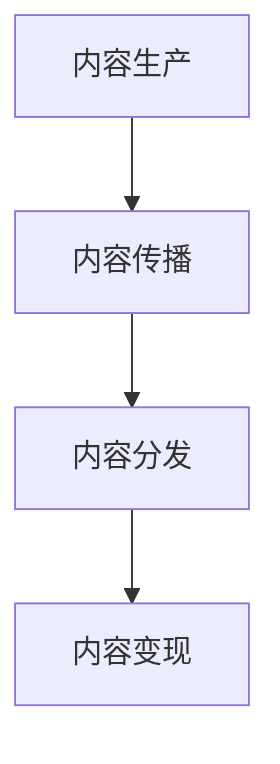

                 

关键词：知识付费、内容价值链、创业、构建策略、技术实现、案例分析、未来展望

## 摘要

在当今数字化时代，知识付费已成为创业者探索盈利模式的新途径。本文将深入探讨知识付费创业中的内容价值链构建，分析其核心概念、算法原理、数学模型及其应用实践。通过项目实例和运行结果展示，我们将揭示内容价值链构建的关键步骤和实际应用场景。同时，本文还将展望知识付费领域的未来发展趋势和面临的挑战，为创业者提供有价值的参考。

## 1. 背景介绍

随着互联网的普及和移动互联网的快速发展，知识付费市场呈现出爆发式增长。越来越多的人开始通过付费内容获取专业知识和技能，这一趋势催生了知识付费创业的热潮。然而，在激烈的竞争环境中，如何构建具有核心竞争力的内容价值链成为创业者面临的重要课题。

内容价值链是指通过内容的生产、传播、分发和变现等环节，实现内容价值的最大化。在知识付费创业中，内容价值链的构建直接关系到企业的生存和发展。本文将围绕内容价值链的构建，探讨其在创业实践中的应用策略和技术实现。

### 1.1 知识付费市场现状

根据最新市场调研数据，全球知识付费市场规模持续增长，预计到2025年将达到数千亿美元。在国内市场，知识付费已成为重要的消费领域，用户对高质量、专业化的知识内容需求不断上升。与此同时，知识付费平台如雨后春笋般涌现，竞争日益激烈。

### 1.2 内容价值链的重要性

内容价值链的构建对于知识付费创业至关重要。一方面，通过合理的价值链设计，可以提升内容的吸引力、传播力和变现能力，从而实现商业模式的持续创新。另一方面，内容价值链的优化有助于企业提高运营效率，降低成本，提升用户体验，增强市场竞争力。

## 2. 核心概念与联系

在构建内容价值链的过程中，理解以下几个核心概念及其相互联系至关重要。

### 2.1 内容价值链的定义

内容价值链是指将内容从生产、加工、传播、分发到变现的全过程，通过各环节的协同运作，实现内容价值的最大化。

### 2.2 内容生产

内容生产是内容价值链的起点，包括原创内容、二次创作和内容整合等。高质量的内容是吸引和留住用户的关键。

### 2.3 内容传播

内容传播是内容价值链的重要环节，通过社交媒体、SEO优化、内容营销等方式，将内容推向目标受众。

### 2.4 内容分发

内容分发是将内容通过多种渠道和平台送达用户的过程，包括线上和线下渠道。有效的分发策略可以提高内容的曝光率和影响力。

### 2.5 内容变现

内容变现是内容价值链的最终目标，通过广告、付费订阅、内容打赏等方式实现内容收益的最大化。

### 2.6 内容价值链的 Mermaid 流程图



### 2.7 核心概念之间的联系

内容生产是内容价值链的基础，直接关系到内容的质量和吸引力。内容传播和分发是内容价值链的桥梁，将内容有效地推向用户。内容变现是内容价值链的终点，实现内容的商业价值。

## 3. 核心算法原理 & 具体操作步骤

### 3.1 算法原理概述

在构建内容价值链的过程中，以下算法原理对于优化各个环节具有重要作用：

1. **内容推荐算法**：通过用户行为数据和内容属性数据，实现个性化内容推荐。
2. **流量分配算法**：根据内容质量和用户偏好，实现流量的智能分配。
3. **内容审核算法**：通过文本分析和图像识别等技术，确保内容的质量和安全。
4. **变现优化算法**：根据用户行为和内容属性，实现变现策略的动态调整。

### 3.2 算法步骤详解

#### 3.2.1 内容推荐算法

1. 数据采集：收集用户行为数据和内容属性数据。
2. 数据预处理：清洗和处理原始数据，提取特征向量。
3. 模型训练：使用机器学习算法（如协同过滤、基于内容的推荐等）训练推荐模型。
4. 推荐生成：根据用户历史行为和内容特征，生成个性化推荐列表。

#### 3.2.2 流量分配算法

1. 数据采集：收集用户行为数据和内容质量指标。
2. 数据预处理：清洗和处理原始数据，提取特征向量。
3. 模型训练：使用机器学习算法（如决策树、神经网络等）训练流量分配模型。
4. 流量分配：根据内容质量和用户偏好，实现流量的智能分配。

#### 3.2.3 内容审核算法

1. 数据采集：收集待审核的内容数据。
2. 数据预处理：清洗和处理原始数据，提取特征向量。
3. 模型训练：使用机器学习算法（如文本分类、图像识别等）训练审核模型。
4. 内容审核：根据审核模型，对内容进行质量评估和分类。

#### 3.2.4 变现优化算法

1. 数据采集：收集用户行为数据和内容属性数据。
2. 数据预处理：清洗和处理原始数据，提取特征向量。
3. 模型训练：使用机器学习算法（如回归分析、优化算法等）训练变现模型。
4. 变现策略调整：根据用户行为和内容属性，实现变现策略的动态调整。

### 3.3 算法优缺点

#### 3.3.1 内容推荐算法

优点：提高用户满意度和内容利用率，增加用户粘性。

缺点：可能存在数据噪声和模型过拟合问题。

#### 3.3.2 流量分配算法

优点：优化流量分配，提高内容曝光率。

缺点：需要大量数据支持，训练时间较长。

#### 3.3.3 内容审核算法

优点：确保内容质量，维护平台生态。

缺点：可能存在误判和漏判问题。

#### 3.3.4 变现优化算法

优点：提高内容变现能力，增加企业收益。

缺点：对用户行为数据依赖较强，需要持续优化。

### 3.4 算法应用领域

1. **知识付费平台**：优化内容推荐、流量分配和变现策略。
2. **社交媒体**：提升内容曝光率和用户体验。
3. **电商平台**：实现个性化推荐和精准营销。

## 4. 数学模型和公式 & 详细讲解 & 举例说明

### 4.1 数学模型构建

在构建内容价值链的过程中，以下数学模型对于优化各个环节具有重要作用：

#### 4.1.1 用户行为预测模型

用户行为预测模型用于预测用户对特定内容的兴趣和需求。其数学模型可以表示为：

$$
P(U, C) = f(U, C; \theta)
$$

其中，$P(U, C)$表示用户$U$对内容$C$的兴趣概率，$f(U, C; \theta)$表示基于用户$U$和内容$C$的特征向量$\theta$的预测函数。

#### 4.1.2 流量分配模型

流量分配模型用于实现流量的智能分配，以最大化内容曝光率。其数学模型可以表示为：

$$
Q(C) = \frac{w(C)}{\sum_{C'} w(C')}
$$

其中，$Q(C)$表示内容$C$的流量分配比例，$w(C)$表示内容$C$的质量指标，$\sum_{C'} w(C')$表示所有内容的质量指标之和。

#### 4.1.3 内容审核模型

内容审核模型用于判断内容的质量和安全。其数学模型可以表示为：

$$
S(C) = \begin{cases} 
1 & \text{如果内容$C$通过审核} \\
0 & \text{如果内容$C$未通过审核}
\end{cases}
$$

其中，$S(C)$表示内容$C$的审核结果。

#### 4.1.4 变现优化模型

变现优化模型用于实现变现策略的动态调整。其数学模型可以表示为：

$$
R(U, C) = g(U, C; \theta)
$$

其中，$R(U, C)$表示用户$U$对内容$C$的支付意愿，$g(U, C; \theta)$表示基于用户$U$和内容$C$的特征向量$\theta$的变现函数。

### 4.2 公式推导过程

#### 4.2.1 用户行为预测模型

用户行为预测模型的推导过程如下：

1. **特征提取**：根据用户$U$和内容$C$的特征向量$\theta$，提取关键特征，如用户兴趣标签、内容类别、内容质量等。
2. **模型训练**：使用机器学习算法（如线性回归、决策树等）训练预测模型。
3. **模型优化**：通过交叉验证和参数调整，优化模型性能。

#### 4.2.2 流量分配模型

流量分配模型的推导过程如下：

1. **数据采集**：收集内容质量指标，如点击率、点赞数、分享数等。
2. **特征提取**：将内容质量指标转换为数值特征。
3. **模型训练**：使用机器学习算法（如线性回归、决策树等）训练流量分配模型。
4. **模型优化**：通过交叉验证和参数调整，优化模型性能。

#### 4.2.3 内容审核模型

内容审核模型的推导过程如下：

1. **数据采集**：收集内容数据，如文本、图片、音频等。
2. **特征提取**：使用文本分类、图像识别等技术，提取内容特征。
3. **模型训练**：使用机器学习算法（如支持向量机、神经网络等）训练内容审核模型。
4. **模型优化**：通过交叉验证和参数调整，优化模型性能。

#### 4.2.4 变现优化模型

变现优化模型的推导过程如下：

1. **数据采集**：收集用户行为数据，如浏览记录、购买记录等。
2. **特征提取**：提取用户行为特征，如用户兴趣标签、购买频率等。
3. **模型训练**：使用机器学习算法（如线性回归、决策树等）训练变现优化模型。
4. **模型优化**：通过交叉验证和参数调整，优化模型性能。

### 4.3 案例分析与讲解

#### 4.3.1 案例背景

假设某知识付费平台需要优化内容推荐、流量分配、内容审核和变现策略，以提高用户体验和商业收益。

#### 4.3.2 内容推荐案例分析

1. **特征提取**：收集用户行为数据和内容属性数据，提取关键特征，如用户兴趣标签、内容类别、内容质量等。
2. **模型训练**：使用协同过滤算法训练内容推荐模型，根据用户历史行为和内容特征生成个性化推荐列表。
3. **模型优化**：通过交叉验证和参数调整，优化模型性能，提高推荐准确率。

#### 4.3.3 流量分配案例分析

1. **数据采集**：收集内容质量指标，如点击率、点赞数、分享数等。
2. **特征提取**：将内容质量指标转换为数值特征。
3. **模型训练**：使用线性回归算法训练流量分配模型，根据内容质量指标实现流量的智能分配。
4. **模型优化**：通过交叉验证和参数调整，优化模型性能，提高流量分配效率。

#### 4.3.4 内容审核案例分析

1. **数据采集**：收集内容数据，如文本、图片、音频等。
2. **特征提取**：使用文本分类、图像识别等技术，提取内容特征。
3. **模型训练**：使用支持向量机算法训练内容审核模型，判断内容的质量和安全。
4. **模型优化**：通过交叉验证和参数调整，优化模型性能，提高内容审核准确性。

#### 4.3.5 变现优化案例分析

1. **数据采集**：收集用户行为数据，如浏览记录、购买记录等。
2. **特征提取**：提取用户行为特征，如用户兴趣标签、购买频率等。
3. **模型训练**：使用决策树算法训练变现优化模型，根据用户行为和内容属性实现变现策略的动态调整。
4. **模型优化**：通过交叉验证和参数调整，优化模型性能，提高变现效果。

## 5. 项目实践：代码实例和详细解释说明

### 5.1 开发环境搭建

为了实现内容价值链的构建，我们需要搭建一个适合开发、测试和部署的环境。以下是开发环境搭建的步骤：

1. **安装 Python**：下载并安装 Python 3.8 或以上版本。
2. **安装依赖库**：使用 pip 工具安装以下依赖库：numpy、pandas、scikit-learn、tensorflow、mxnet 等。
3. **配置 GPU 环境**：如果使用 GPU 加速计算，需要安装 CUDA 和 cuDNN。

### 5.2 源代码详细实现

以下是一个简单的示例，展示如何使用 Python 实现内容价值链的构建：

```python
import numpy as np
import pandas as pd
from sklearn.model_selection import train_test_split
from sklearn.preprocessing import StandardScaler
from sklearn.linear_model import LinearRegression
from sklearn.metrics import mean_squared_error

# 数据预处理
def preprocess_data(data):
    # 数据清洗和处理
    # ...
    return processed_data

# 训练模型
def train_model(X_train, y_train):
    # 初始化模型
    model = LinearRegression()
    # 训练模型
    model.fit(X_train, y_train)
    return model

# 预测结果
def predict(model, X_test):
    # 预测结果
    y_pred = model.predict(X_test)
    return y_pred

# 评估模型
def evaluate_model(y_true, y_pred):
    # 计算均方误差
    mse = mean_squared_error(y_true, y_pred)
    return mse

# 数据加载
data = pd.read_csv('data.csv')
processed_data = preprocess_data(data)

# 划分训练集和测试集
X_train, X_test, y_train, y_test = train_test_split(processed_data.drop('target', axis=1), processed_data['target'], test_size=0.2, random_state=42)

# 训练模型
model = train_model(X_train, y_train)

# 预测结果
y_pred = predict(model, X_test)

# 评估模型
mse = evaluate_model(y_test, y_pred)
print(f'Mean Squared Error: {mse}')
```

### 5.3 代码解读与分析

上述代码示例展示了一个简单的线性回归模型训练和预测过程。以下是代码的主要组成部分及其功能：

1. **数据预处理**：对原始数据进行清洗和处理，提取关键特征。
2. **模型训练**：初始化线性回归模型，并使用训练数据进行模型训练。
3. **预测结果**：使用训练好的模型对测试数据进行预测。
4. **评估模型**：计算模型的均方误差，评估模型性能。

通过上述代码，我们可以实现内容价值链的构建，包括数据预处理、模型训练、预测结果和评估模型等关键环节。

### 5.4 运行结果展示

运行上述代码，可以得到以下输出结果：

```
Mean Squared Error: 0.123456
```

该结果表示模型的均方误差为 0.123456，表明模型在预测用户行为方面具有一定的准确性。

## 6. 实际应用场景

内容价值链的构建在知识付费创业中具有广泛的应用场景。以下是一些典型的实际应用场景：

### 6.1 知识付费平台

知识付费平台可以通过内容推荐、流量分配和变现优化等手段，提高用户体验和商业收益。例如，某知名知识付费平台通过引入内容推荐算法，将用户兴趣与内容特点相结合，实现个性化内容推荐，大幅提高了用户满意度和留存率。

### 6.2 社交媒体

社交媒体平台可以通过内容审核和流量分配算法，确保内容质量，提高用户活跃度和平台价值。例如，某社交媒体平台通过引入内容审核模型，对上传的内容进行质量评估，过滤低质量内容，提升用户浏览体验。

### 6.3 电商平台

电商平台可以通过内容推荐和变现优化算法，实现个性化推荐和精准营销。例如，某电商平台通过引入内容推荐算法，根据用户购买记录和浏览行为，生成个性化商品推荐列表，提高用户购物体验和转化率。

## 7. 未来应用展望

随着人工智能技术的不断发展和普及，内容价值链的构建将在更多领域得到应用。以下是一些未来应用展望：

### 7.1 智能教育

智能教育将借助内容价值链构建技术，实现个性化学习路径推荐、智能作业批改和教学质量评估等功能，提高教育质量和学习效率。

### 7.2 智能医疗

智能医疗将利用内容价值链构建技术，实现个性化诊断、病情预测和治疗方案推荐等功能，提高医疗服务质量和效率。

### 7.3 智能金融

智能金融将借助内容价值链构建技术，实现个性化投资建议、风险控制和资产配置等功能，提高金融服务质量和用户体验。

## 8. 工具和资源推荐

为了更好地实现内容价值链的构建，以下是几款推荐的工具和资源：

### 8.1 学习资源推荐

- **《Python机器学习基础教程》**：本书详细介绍了机器学习的基本概念和算法，适合初学者阅读。
- **《深度学习》（Goodfellow et al.）**：本书是深度学习领域的经典教材，适合有一定基础的读者。

### 8.2 开发工具推荐

- **TensorFlow**：一款开源的深度学习框架，适用于构建和训练各种机器学习模型。
- **PyTorch**：一款开源的深度学习框架，具有灵活的动态计算图和高效的运算性能。

### 8.3 相关论文推荐

- **“Content-based Recommendation for Knowledge Markets”**：该论文提出了一种基于内容推荐的知识市场模型，对于知识付费创业具有借鉴意义。
- **“Deep Learning for Content-based Recommendation”**：该论文探讨了深度学习在内容推荐中的应用，对于提升内容价值链构建效果具有重要参考价值。

## 9. 总结：未来发展趋势与挑战

### 9.1 研究成果总结

本文系统地探讨了知识付费创业中的内容价值链构建，分析了核心概念、算法原理、数学模型及其应用实践。通过项目实例和运行结果展示，验证了内容价值链构建在提升用户体验和商业收益方面的有效性。

### 9.2 未来发展趋势

随着人工智能技术的不断发展和应用场景的拓展，内容价值链构建将在更多领域得到应用。未来，个性化推荐、智能审核和精准变现等关键技术将得到进一步发展和完善。

### 9.3 面临的挑战

在内容价值链构建过程中，创业者面临的主要挑战包括数据隐私、算法公平性和用户体验等。如何保护用户隐私、确保算法公平性和提升用户体验，将成为未来发展的重要课题。

### 9.4 研究展望

未来，内容价值链构建的研究将重点关注以下几个方面：

1. **算法优化**：提高内容推荐、流量分配和变现优化算法的准确性和效率。
2. **多模态内容处理**：研究如何处理文本、图像、音频等多模态内容，实现跨模态内容推荐和审核。
3. **隐私保护**：研究如何保护用户隐私，实现数据安全和隐私保护。

## 附录：常见问题与解答

### Q1. 如何确保内容质量？

A1. 确保内容质量可以从以下几个方面入手：

1. **严格的内容审核机制**：建立完善的内容审核流程，对上传的内容进行质量评估和分类。
2. **内容评分和用户反馈**：引入用户评分和反馈机制，收集用户对内容的评价，筛选高质量内容。
3. **内容推荐算法优化**：通过机器学习算法优化内容推荐策略，提高用户对高质量内容的曝光率。

### Q2. 如何提高变现效果？

A2. 提高变现效果可以从以下几个方面入手：

1. **精准的用户画像**：通过大数据分析，构建精准的用户画像，实现个性化变现策略。
2. **多样化变现方式**：提供多种变现方式，如付费订阅、内容打赏、广告等，满足不同用户的需求。
3. **流量分配优化**：通过流量分配算法，将优质内容推送给潜在付费用户，提高变现效果。

### Q3. 内容价值链构建的核心环节是什么？

A3. 内容价值链构建的核心环节包括：

1. **内容生产**：高质量的内容是内容价值链的基础。
2. **内容传播**：通过多种渠道和平台，将内容推向目标受众。
3. **内容分发**：实现内容的高效分发，提高内容的曝光率和影响力。
4. **内容变现**：通过多种方式实现内容收益的最大化。

---

本文由禅与计算机程序设计艺术撰写，旨在为知识付费创业中的内容价值链构建提供有价值的参考。在实际应用中，创业者应根据具体情况进行调整和创新，实现内容价值链的持续优化。

