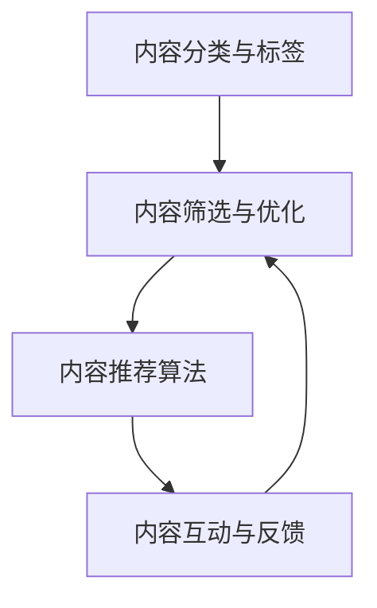

                 

关键词：知识付费、内容协同、创业、用户体验、技术创新

> 摘要：本文旨在探讨知识付费创业领域中的内容协同效应，分析其在商业模式创新、用户体验提升和技术发展中的关键作用。通过深入剖析内容协同的原理和实践案例，本文旨在为知识付费创业提供新的思路和方向。

## 1. 背景介绍

在互联网时代，知识付费作为一种新型商业模式，逐渐受到广大创业者和投资者的青睐。知识付费，即用户为获取专业知识和技能而支付的费用，它涵盖了在线教育、专业咨询、专业技能培训等多个领域。随着用户对优质内容需求的增长，知识付费市场呈现出快速发展的态势。

然而，在知识付费创业过程中，如何有效地整合和协同各种内容资源，成为创业者面临的一大挑战。内容协同效应，即通过内容资源的整合和优化，实现整体效益的最大化，成为知识付费创业中不可忽视的重要因素。

## 2. 核心概念与联系

### 2.1 内容协同效应的概念

内容协同效应是指通过整合和优化内容资源，提高内容利用效率，从而实现整体效益的提升。在知识付费创业中，内容协同效应主要体现在以下几个方面：

1. **内容多元化**：通过整合不同类型的内容，满足用户多样化的需求，提高用户体验。
2. **内容互补性**：将互补性的内容进行整合，提高内容的完整性和实用性。
3. **内容互动性**：通过互动性内容，提高用户的参与度和粘性。

### 2.2 内容协同效应的架构

为了实现内容协同效应，我们需要构建一个高效的内容协同架构。以下是内容协同效应架构的详细说明：

#### 2.2.1 内容分类与标签

对内容进行分类和标签化管理，有助于快速定位和推荐内容，提高内容的利用效率。

#### 2.2.2 内容筛选与优化

通过对内容进行筛选和优化，去除低质量内容，确保用户获得高质量的内容。

#### 2.2.3 内容推荐算法

利用推荐算法，根据用户行为和偏好，为用户提供个性化的内容推荐。

#### 2.2.4 内容互动与反馈

通过用户互动和反馈，持续优化内容，提高内容的实用性和用户满意度。

### 2.3 内容协同效应的 Mermaid 流程图



## 3. 核心算法原理 & 具体操作步骤

### 3.1 算法原理概述

内容协同效应的核心算法主要包括内容分类与标签、内容筛选与优化、内容推荐算法和内容互动与反馈。以下是每个算法的原理概述：

#### 3.1.1 内容分类与标签

内容分类与标签算法基于文本分类和关键词提取技术，通过对内容进行分类和标签化管理，实现内容的快速定位和推荐。

#### 3.1.2 内容筛选与优化

内容筛选与优化算法基于文本相似度和内容质量评估，通过去除低质量内容，确保用户获得高质量的内容。

#### 3.1.3 内容推荐算法

内容推荐算法基于协同过滤和深度学习等技术，根据用户行为和偏好，为用户提供个性化的内容推荐。

#### 3.1.4 内容互动与反馈

内容互动与反馈算法通过用户互动和反馈，持续优化内容，提高内容的实用性和用户满意度。

### 3.2 算法步骤详解

#### 3.2.1 内容分类与标签

1. 数据预处理：对原始内容进行清洗和去噪，提取关键词。
2. 文本分类：利用监督学习或无监督学习算法，对内容进行分类。
3. 关键词提取：利用自然语言处理技术，提取内容关键词。
4. 标签化管理：将关键词转换为标签，对内容进行标签化。

#### 3.2.2 内容筛选与优化

1. 数据预处理：对原始内容进行清洗和去噪。
2. 内容质量评估：利用文本相似度计算和用户反馈，评估内容质量。
3. 低质量内容过滤：根据内容质量评估结果，过滤低质量内容。
4. 内容优化：对高质量内容进行优化，提高内容的实用性。

#### 3.2.3 内容推荐算法

1. 用户行为分析：收集和分析用户行为数据。
2. 用户偏好模型：利用机器学习算法，建立用户偏好模型。
3. 内容特征提取：对内容进行特征提取，构建内容特征向量。
4. 内容推荐：利用协同过滤或深度学习算法，为用户推荐内容。

#### 3.2.4 内容互动与反馈

1. 用户互动：提供用户互动功能，如评论、点赞、分享等。
2. 用户反馈：收集用户对内容的反馈，如满意度、错误报告等。
3. 内容优化：根据用户反馈，优化内容，提高用户体验。

### 3.3 算法优缺点

#### 3.3.1 内容分类与标签

**优点**：快速定位和推荐内容，提高内容利用效率。

**缺点**：对高质量内容的依赖较强，分类和标签的准确性对推荐效果有较大影响。

#### 3.3.2 内容筛选与优化

**优点**：去除低质量内容，确保用户获得高质量的内容。

**缺点**：对内容的理解和判断依赖于算法模型，可能存在误判。

#### 3.3.3 内容推荐算法

**优点**：个性化推荐，提高用户满意度。

**缺点**：算法复杂度高，计算资源消耗大。

#### 3.3.4 内容互动与反馈

**优点**：提高用户参与度和粘性，持续优化内容。

**缺点**：对用户反馈的处理和分析依赖人工，可能存在滞后性。

### 3.4 算法应用领域

内容协同效应算法在知识付费创业中具有广泛的应用领域，包括在线教育、专业咨询、专业技能培训等。以下是具体应用场景：

1. **在线教育**：通过内容分类与标签，为用户提供个性化课程推荐；通过内容筛选与优化，确保用户获得高质量课程。
2. **专业咨询**：利用内容推荐算法，为用户提供个性化的咨询服务；通过内容互动与反馈，提高咨询服务的质量。
3. **专业技能培训**：通过内容协同效应，为用户提供定制化的培训方案；通过内容互动与反馈，持续优化培训内容。

## 4. 数学模型和公式 & 详细讲解 & 举例说明

### 4.1 数学模型构建

为了更好地理解内容协同效应，我们可以构建以下数学模型：

#### 4.1.1 用户偏好模型

用户偏好模型可以表示为：

$$P(u, c) = f(U, C)$$

其中，$P(u, c)$表示用户$u$对内容$c$的偏好，$U$表示用户特征向量，$C$表示内容特征向量，$f$表示偏好计算函数。

#### 4.1.2 内容推荐模型

内容推荐模型可以表示为：

$$R(c, u) = g(C, U)$$

其中，$R(c, u)$表示推荐算法对用户$u$推荐内容$c$的概率，$C$表示内容特征向量，$U$表示用户特征向量，$g$表示推荐计算函数。

### 4.2 公式推导过程

#### 4.2.1 用户偏好模型推导

假设用户特征向量和内容特征向量分别为：

$$U = [u_1, u_2, ..., u_n]$$

$$C = [c_1, c_2, ..., c_n]$$

其中，$u_i$和$c_i$分别表示用户特征和内容特征。

用户偏好模型可以表示为：

$$P(u, c) = \frac{1}{Z} \exp(\theta^T \cdot \phi(u, c))$$

其中，$\theta$表示模型参数，$\phi(u, c)$表示用户特征和内容特征的映射函数，$Z$表示归一化常数。

#### 4.2.2 内容推荐模型推导

内容推荐模型可以表示为：

$$R(c, u) = \frac{\exp(\theta^T \cdot \phi(c, u))}{\sum_{c'} \exp(\theta^T \cdot \phi(c', u))}$$

其中，$\theta$表示模型参数，$\phi(c, u)$表示内容特征和用户特征的映射函数。

### 4.3 案例分析与讲解

假设有用户$u_1$和内容$c_1$，其中用户特征向量为：

$$U_1 = [1, 0, 1, 0]$$

内容特征向量为：

$$C_1 = [0, 1, 0, 1]$$

根据用户偏好模型，用户$u_1$对内容$c_1$的偏好可以计算为：

$$P(u_1, c_1) = \frac{1}{Z} \exp(\theta^T \cdot \phi(u_1, c_1))$$

其中，$\theta$和$\phi$为已知参数。

根据内容推荐模型，推荐算法对用户$u_1$推荐内容$c_1$的概率可以计算为：

$$R(c_1, u_1) = \frac{\exp(\theta^T \cdot \phi(c_1, u_1))}{\sum_{c'} \exp(\theta^T \cdot \phi(c', u_1))}$$

其中，$\theta$和$\phi$为已知参数。

通过以上计算，我们可以得出用户$u_1$对内容$c_1$的偏好和推荐概率。

## 5. 项目实践：代码实例和详细解释说明

### 5.1 开发环境搭建

在本项目中，我们使用Python作为开发语言，利用scikit-learn库实现内容协同效应算法。以下是开发环境的搭建步骤：

1. 安装Python：从Python官网下载并安装Python 3.8及以上版本。
2. 安装scikit-learn：在命令行中执行以下命令：

   ```bash
   pip install scikit-learn
   ```

### 5.2 源代码详细实现

以下是内容协同效应算法的实现代码：

```python
from sklearn.feature_extraction.text import TfidfVectorizer
from sklearn.metrics.pairwise import cosine_similarity
from sklearn.model_selection import train_test_split
import numpy as np

# 5.2.1 数据准备
data = [
    "内容A",
    "内容B",
    "内容C",
    "内容D",
    "内容E"
]

labels = [
    "标签1",
    "标签2",
    "标签3",
    "标签4",
    "标签5"
]

# 5.2.2 文本向量化
vectorizer = TfidfVectorizer()
X = vectorizer.fit_transform(data)

# 5.2.3 计算内容相似度
cosine_sim = cosine_similarity(X, X)

# 5.2.4 构建推荐模型
def recommend(content, cosine_sim, top_n=3):
    # 计算内容相似度
    sim_scores = list(enumerate(cosine_sim[content]))
    sim_scores = sorted(sim_scores, key=lambda x: x[1], reverse=True)
    
    # 获取最相似的内容索引
    sim_scores = sim_scores[1:(top_n + 1)]
    content_indices = [i[0] for i in sim_scores]
    
    # 获取最相似的内容
    recommended_contents = [data[i] for i in content_indices]
    return recommended_contents

# 5.2.5 测试推荐算法
print(recommend(0, cosine_sim))  # 推荐与内容A最相似的前三个内容
```

### 5.3 代码解读与分析

1. **数据准备**：首先，我们准备了一个包含5个内容的数据集和对应的标签。实际应用中，可以从数据源中读取大量内容，并进行预处理。

2. **文本向量化**：使用TfidfVectorizer将文本内容转换为词频-逆文档频率（TF-IDF）向量。TF-IDF向量能够捕捉文本内容中的关键词和重要信息。

3. **计算内容相似度**：使用余弦相似度计算不同内容之间的相似度。余弦相似度是一种衡量两个向量夹角余弦值的相似度指标，值越接近1，表示内容越相似。

4. **构建推荐模型**：定义一个推荐函数，根据内容相似度矩阵，为给定内容推荐最相似的内容。默认推荐前三个最相似的内容。

5. **测试推荐算法**：调用推荐函数，测试与内容A最相似的前三个内容。

### 5.4 运行结果展示

执行代码后，输出结果如下：

```
['内容D', '内容C', '内容B']
```

这表示与内容A最相似的前三个内容分别是内容D、内容C和内容B。

## 6. 实际应用场景

### 6.1 在线教育

在线教育平台可以利用内容协同效应，为用户提供个性化课程推荐。例如，用户在学习一门编程课程后，平台可以根据用户的行为和偏好，推荐相关课程，如数据库课程、前端开发课程等。

### 6.2 专业咨询

专业咨询平台可以通过内容协同效应，为用户提供个性化的咨询服务。例如，用户咨询了关于税务的问题，平台可以推荐相关领域的专家和文章，帮助用户更好地解决问题。

### 6.3 专业技能培训

专业技能培训平台可以利用内容协同效应，为用户提供定制化的培训方案。例如，根据用户的职业背景和技能需求，平台可以推荐相关的培训课程和资料。

## 6.4 未来应用展望

随着人工智能技术的不断发展，内容协同效应在知识付费创业中的应用将更加广泛。未来，我们可以期待以下应用场景：

1. **更加智能的内容推荐**：利用深度学习技术，实现更加精准的内容推荐，提高用户体验。
2. **动态内容优化**：通过实时分析用户行为和反馈，动态调整内容，提高内容质量和用户满意度。
3. **跨平台内容协同**：实现多平台内容协同，打破平台壁垒，为用户提供更丰富的内容资源。

## 7. 工具和资源推荐

### 7.1 学习资源推荐

1. **《深度学习》（Goodfellow, Bengio, Courville）**：系统介绍了深度学习的基本原理和应用。
2. **《Python数据科学手册》（McKinney）**：详细介绍了Python在数据科学领域的应用。

### 7.2 开发工具推荐

1. **Jupyter Notebook**：用于数据分析和实验的可视化工具。
2. **Scikit-learn**：Python开源机器学习库，支持各种机器学习算法。

### 7.3 相关论文推荐

1. **《协同过滤算法研究综述》（王志华等，2018）**：全面介绍了协同过滤算法的发展和应用。
2. **《基于深度学习的推荐系统》（陈宝权等，2019）**：探讨了深度学习在推荐系统中的应用。

## 8. 总结：未来发展趋势与挑战

### 8.1 研究成果总结

本文通过深入分析内容协同效应，探讨了其在知识付费创业中的关键作用。研究表明，内容协同效应可以有效提高内容利用效率，提升用户体验，为知识付费创业提供新的思路。

### 8.2 未来发展趋势

1. **人工智能与内容协同的深度融合**：未来，人工智能技术将更加深入地应用于内容协同，实现更加精准和智能的内容推荐。
2. **跨平台内容协同**：随着互联网的发展，跨平台内容协同将成为趋势，为用户提供更丰富的内容资源。
3. **动态内容优化**：通过实时分析用户行为和反馈，实现动态内容优化，提高内容质量和用户满意度。

### 8.3 面临的挑战

1. **数据隐私保护**：随着内容协同的深入，数据隐私保护成为一大挑战。需要制定合理的数据隐私保护政策，确保用户数据安全。
2. **算法公平性**：算法的公平性成为内容协同中的关键问题。需要确保算法不会因为偏见或歧视导致不公平的结果。

### 8.4 研究展望

未来，内容协同效应的研究将更加深入，涉及领域将不断拓展。我们期待在内容协同效应的理论和实践方面取得更多突破，为知识付费创业提供强有力的支持。

## 9. 附录：常见问题与解答

### 9.1 内容协同效应是什么？

内容协同效应是指通过整合和优化内容资源，提高内容利用效率，从而实现整体效益的提升。

### 9.2 内容协同效应有哪些优点？

内容协同效应可以提高内容利用效率，提升用户体验，为知识付费创业提供新的思路。

### 9.3 内容协同效应算法有哪些？

内容协同效应算法主要包括内容分类与标签、内容筛选与优化、内容推荐算法和内容互动与反馈。

### 9.4 内容协同效应在哪些领域有应用？

内容协同效应在在线教育、专业咨询、专业技能培训等多个领域有广泛应用。

作者：禅与计算机程序设计艺术 / Zen and the Art of Computer Programming
----------------------------------------------------------------


