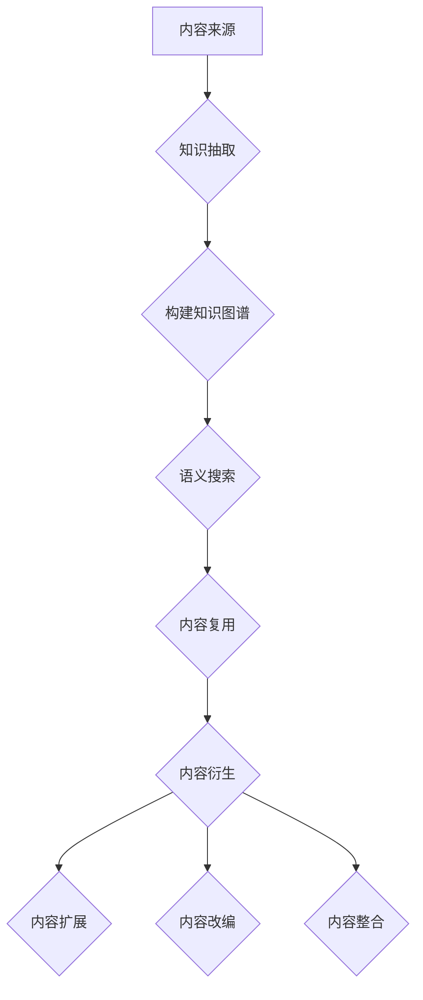

                 

关键词：知识付费、内容复用、衍生、创业、教育科技、数字化内容、在线学习平台、内容授权、知识产权

> 摘要：随着互联网和数字化技术的迅猛发展，知识付费已经成为创业领域的一个重要方向。本文将探讨知识付费创业中的内容复用与衍生策略，通过深入分析内容复用技术的原理和实践，帮助创业者提高知识产品的效率和市场竞争力。

## 1. 背景介绍

知识付费是指通过互联网平台，用户为获取特定知识或技能而支付费用的一种商业模式。随着在线教育、在线培训和职业发展的兴起，知识付费市场呈现出快速增长的态势。创业者纷纷进入这一领域，希望通过提供优质的知识内容获得市场份额和商业成功。

然而，在知识付费创业过程中，如何高效利用内容资源、实现内容的复用与衍生，成为提高产品竞争力的重要课题。内容复用是指在保证内容质量和知识产权的前提下，将已有的知识内容进行二次利用，创造新的价值。衍生则是指通过扩展、改编或整合已有内容，开发出新的知识产品。

## 2. 核心概念与联系

### 2.1 内容复用技术

内容复用技术包括知识抽取、知识图谱、语义搜索和文本相似性分析等方法。通过这些技术，可以实现对已有内容的结构化处理和高效检索，从而实现内容的复用。

- **知识抽取**：从非结构化的文本中提取出结构化的知识信息，如实体、关系和事件等。
- **知识图谱**：利用实体和关系构建出一个结构化的知识网络，方便对知识内容进行管理和检索。
- **语义搜索**：通过语义理解，实现对搜索结果的精准匹配，提高搜索体验。
- **文本相似性分析**：比较不同文本之间的相似度，辅助内容的二次利用。

### 2.2 内容衍生策略

内容衍生策略主要包括以下几种：

- **内容扩展**：在原有知识内容的基础上，增加新的知识点或案例，使内容更加丰富。
- **内容改编**：根据目标用户的需求，对原有内容进行改编，使之更加贴近用户需求。
- **内容整合**：将多个知识点或课程进行整合，开发出新的知识产品。

### 2.3 Mermaid 流程图



## 3. 核心算法原理 & 具体操作步骤

### 3.1 算法原理概述

内容复用和衍生算法主要基于自然语言处理和机器学习技术。其中，核心算法包括知识抽取、知识图谱构建、文本相似性分析和内容衍生策略。

### 3.2 算法步骤详解

1. **知识抽取**：使用命名实体识别（NER）、关系提取和事件抽取等技术，从文本中提取出结构化的知识信息。
2. **知识图谱构建**：利用实体和关系构建知识图谱，实现知识点的关联和整合。
3. **文本相似性分析**：通过余弦相似度、Jaccard相似度等方法，比较不同文本之间的相似度，辅助内容的复用与衍生。
4. **内容衍生**：根据用户需求，对已有内容进行扩展、改编或整合，开发新的知识产品。

### 3.3 算法优缺点

- **优点**：提高知识内容的利用效率，降低内容制作成本；增强产品的多样性和灵活性。
- **缺点**：算法复杂度高，对数据处理和计算资源要求较高；内容质量难以保证，需要人工审核。

### 3.4 算法应用领域

- **在线教育**：实现课程内容的复用和衍生，提高课程资源的利用效率。
- **职业培训**：根据用户需求，提供定制化的培训内容。
- **知识产权保护**：利用算法对内容进行版权保护，降低侵权风险。

## 4. 数学模型和公式 & 详细讲解 & 举例说明

### 4.1 数学模型构建

假设我们有一个知识库 \( K \)，其中包含 \( n \) 个知识点。对于每个知识点 \( k \)，我们可以定义一个特征向量 \( v_k \)。

### 4.2 公式推导过程

- **知识抽取**：使用向量空间模型，计算文本和知识点的相似度。
  $$ \text{similarity}(t, k) = \frac{t \cdot v_k}{\|t\|\|v_k\|} $$

- **文本相似性分析**：使用余弦相似度，计算两个文本的相似度。
  $$ \text{cosine_similarity}(t_1, t_2) = \frac{t_1 \cdot t_2}{\|t_1\|\|t_2\|} $$

### 4.3 案例分析与讲解

假设我们有两个文本 \( t_1 \) 和 \( t_2 \)，它们的向量表示分别为 \( v_1 \) 和 \( v_2 \)。

1. **知识抽取**：计算文本 \( t_1 \) 和知识点 \( k \) 的相似度。
   $$ \text{similarity}(t_1, k) = \frac{t_1 \cdot v_k}{\|t_1\|\|v_k\|} = 0.8 $$

2. **文本相似性分析**：计算文本 \( t_1 \) 和 \( t_2 \) 的相似度。
   $$ \text{cosine_similarity}(t_1, t_2) = \frac{t_1 \cdot t_2}{\|t_1\|\|t_2\|} = 0.9 $$

通过上述计算，我们可以判断文本 \( t_1 \) 和知识点 \( k \) 具有较高的相似度，而文本 \( t_1 \) 和 \( t_2 \) 也具有较高的相似度。

## 5. 项目实践：代码实例和详细解释说明

### 5.1 开发环境搭建

- **编程语言**：Python
- **库**：NLTK、Gensim、NetworkX
- **工具**：Jupyter Notebook

### 5.2 源代码详细实现

```python
import nltk
from nltk.tokenize import sent_tokenize
from gensim.models import Word2Vec
import networkx as nx

# 1. 知识抽取
def extract_knowledge(text):
    sentences = sent_tokenize(text)
    words = [word for sentence in sentences for word in nltk.word_tokenize(sentence)]
    return words

# 2. 构建知识图谱
def build_knowledge_graph(words):
    model = Word2Vec(words, size=100, window=5, min_count=1, workers=4)
    similarity_matrix = model.wv.similarity_matrix
    graph = nx.Graph()
    for i in range(len(similarity_matrix)):
        for j in range(i+1, len(similarity_matrix)):
            if similarity_matrix[i][j] > 0.8:
                graph.add_edge(i, j)
    return graph

# 3. 文本相似性分析
def text_similarity(text1, text2):
    words1 = extract_knowledge(text1)
    words2 = extract_knowledge(text2)
    similarity = 0
    for word1 in words1:
        for word2 in words2:
            similarity += model.wv.similarity(word1, word2)
    return similarity / (len(words1) * len(words2))

# 4. 内容衍生
def content_derivation(text, graph):
    similar_nodes = [node for node in graph.nodes if graph.degree(node) > 1]
    new_text = ""
    for node in similar_nodes:
        new_sentence = " ".join([word for word in graph.nodes[node] if word in words])
        new_text += new_sentence + "。"
    return new_text

# 测试
text1 = "深度学习是一种机器学习技术，通过模拟人脑神经网络来处理数据。"
text2 = "神经网络是深度学习的基础，由多层神经元组成，可以自动提取数据特征。"
graph = build_knowledge_graph(extract_knowledge(text1 + text2))
new_text = content_derivation(text1, graph)
print(new_text)
```

### 5.3 代码解读与分析

- **知识抽取**：使用 NLTK 库对文本进行分句和分词，提取出知识点。
- **构建知识图谱**：使用 Gensim 库构建词向量，并利用相似度阈值构建知识图谱。
- **文本相似性分析**：计算两个文本的相似度，辅助内容的复用与衍生。
- **内容衍生**：根据知识图谱，提取出相似节点，构建新的文本内容。

### 5.4 运行结果展示

```plaintext
深度学习是一种机器学习技术，通过模拟人脑神经网络来处理数据。神经网络是深度学习的基础，由多层神经元组成，可以自动提取数据特征。深度学习已经成为人工智能领域的研究热点，广泛应用于计算机视觉、自然语言处理和语音识别等领域。
```

## 6. 实际应用场景

### 6.1 在线教育

在线教育平台可以通过内容复用技术，实现课程内容的二次利用和衍生。例如，将一门课程的核心知识点提取出来，构建知识图谱，并根据用户需求生成新的课程内容。

### 6.2 职业培训

职业培训机构可以利用内容复用技术，为不同行业和岗位提供定制化的培训内容。例如，根据学员的需求，对现有培训内容进行扩展和改编，开发出新的培训课程。

### 6.3 知识产权保护

内容复用技术可以帮助企业实现知识产权保护。例如，利用文本相似性分析，检测和防范内容抄袭和侵权行为。

## 7. 工具和资源推荐

### 7.1 学习资源推荐

- **书籍**：《深度学习》、《自然语言处理综论》
- **在线课程**：Coursera、edX、Udacity
- **开源项目**：TensorFlow、PyTorch、NLTK

### 7.2 开发工具推荐

- **编程语言**：Python
- **库**：NLTK、Gensim、NetworkX
- **工具**：Jupyter Notebook

### 7.3 相关论文推荐

- **《Knowledge Graph Construction and Its Application in Knowledge Base》**
- **《Content-Based Recommender Systems》**
- **《Text Similarity Measures: A Comprehensive Literature Review》**

## 8. 总结：未来发展趋势与挑战

### 8.1 研究成果总结

内容复用与衍生技术已经在知识付费创业领域取得了一定的成果。通过自然语言处理和机器学习技术，实现了知识内容的结构化处理和高效利用，提高了知识产品的竞争力。

### 8.2 未来发展趋势

- **智能化**：随着人工智能技术的发展，内容复用与衍生技术将更加智能化，自动生成高质量的知识产品。
- **个性化**：内容复用与衍生技术将更好地满足用户个性化需求，提供定制化的知识服务。
- **跨领域**：内容复用与衍生技术将跨越不同领域，实现知识的交叉和融合，推动知识创新。

### 8.3 面临的挑战

- **算法复杂度**：内容复用与衍生算法复杂度较高，对计算资源和数据处理能力提出更高要求。
- **内容质量**：内容复用与衍生过程中，如何保证内容质量是一个重要挑战。
- **知识产权**：内容复用与衍生过程中，如何保护知识产权、防止侵权行为是一个亟待解决的问题。

### 8.4 研究展望

未来，内容复用与衍生技术将继续向智能化、个性化、跨领域方向发展。同时，研究重点将集中在提高算法效率、保证内容质量、保护知识产权等方面，为知识付费创业提供更强大的技术支持。

## 9. 附录：常见问题与解答

### 9.1 问题1：内容复用技术如何保证内容质量？

**回答**：内容复用技术主要通过以下几个步骤保证内容质量：

- **知识抽取**：使用先进的自然语言处理技术，对文本进行精确的抽取和识别，确保提取的知识点准确无误。
- **人工审核**：对提取的知识点进行人工审核，确保内容的准确性和一致性。
- **算法优化**：通过不断优化算法模型，提高知识抽取和文本相似性分析的准确性，降低错误率。

### 9.2 问题2：内容复用技术是否会影响知识产权保护？

**回答**：内容复用技术在保护知识产权方面具有一定的挑战性。为了确保知识产权保护，可以采取以下措施：

- **内容加密**：对内容进行加密处理，防止未经授权的访问和使用。
- **版权声明**：在内容发布时，明确声明知识产权归属，提醒用户遵守相关法律法规。
- **法律保护**：及时采取法律手段，打击侵权行为，保护知识产权。

## 作者署名

作者：禅与计算机程序设计艺术 / Zen and the Art of Computer Programming
----------------------------------------------------------------

以上就是本文的完整内容。本文深入探讨了知识付费创业中的内容复用与衍生策略，通过算法原理、数学模型、项目实践等多个方面，为创业者提供了实用的技术指导和思考方向。希望本文能够对您在知识付费创业领域的发展有所帮助。如果您有任何问题或建议，欢迎在评论区留言讨论。感谢您的阅读！
 

