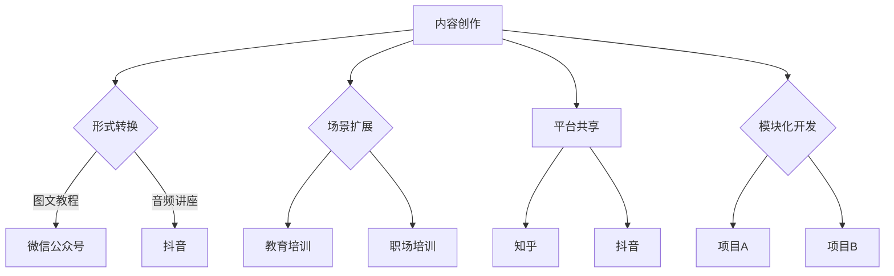

                 

关键词：知识付费、内容复用、创业、技术策略、资源优化、商业模型

> 摘要：在知识付费领域，内容复用成为提升产品价值和降低开发成本的重要手段。本文将从内容复用的概念出发，深入探讨其在知识付费创业中的应用技巧，结合实际案例和数据分析，为创业者提供切实可行的策略和建议。

## 1. 背景介绍

知识付费，即用户为获取知识或技能而付费的一种商业模式，近年来随着互联网技术的飞速发展，逐渐成为教育培训、专业咨询等领域的重要驱动力。知识付费的核心在于优质内容的创作与分发，然而，内容的创作通常成本高昂、周期较长。如何在保证内容质量的前提下，提高内容的复用率，成为知识付费创业者亟待解决的问题。

内容复用，指的是在知识付费领域中，将已经创作好的内容通过不同的形式、平台或场景进行再利用，以减少重复性劳动，提高资源利用效率。本文将重点讨论如何通过内容复用技巧，实现知识付费创业的规模化发展。

## 2. 核心概念与联系

### 2.1 内容复用的概念

内容复用是指将已有的内容资源在不同场景、平台或形式中再次利用，以达到提高资源利用率、降低开发成本的目的。在知识付费领域，内容复用可以包括课程内容的二次开发、知识问答系统的复用、内容分发的自动化等。

### 2.2 内容复用与知识付费的关系

内容复用与知识付费紧密相连。一方面，内容复用能够提高知识付费产品的生产效率，降低开发成本；另一方面，复用后的内容能够吸引更多用户，提升产品价值。例如，一门在线课程可以通过视频、图文、直播等多种形式进行分发，实现内容的高效利用。

### 2.3 内容复用的实现方式

内容复用的实现方式主要包括以下几种：

1. **形式转换**：将原有内容从一种形式转换为另一种形式，如将视频课程转换为图文教程或音频讲座。
2. **场景扩展**：将同一内容应用到不同场景，如在教育培训和职场培训中复用。
3. **平台共享**：在不同平台间共享内容，如在微信公众号、抖音、知乎等平台上发布相同或类似内容。
4. **模块化开发**：将内容分解为可复用的模块，以便在不同项目中灵活调用。

### 2.4 Mermaid 流程图



## 3. 核心算法原理 & 具体操作步骤

### 3.1 算法原理概述

内容复用的核心算法原理在于如何高效地将已有内容进行重新组合、转换和分发。这涉及到以下几个方面：

1. **内容识别与分类**：通过文本挖掘、图像识别等技术，对内容进行识别和分类，以便于后续的复用。
2. **内容转换**：根据不同的使用场景和用户需求，将内容从一种形式转换为另一种形式，如视频转音频、图文转视频等。
3. **内容分发**：通过自动化工具，将内容分发到不同的平台或场景，以提高内容的曝光度和利用率。

### 3.2 算法步骤详解

1. **内容创作**：首先进行内容创作，可以是视频、图文、音频等形式。
2. **内容识别与分类**：使用自然语言处理、图像识别等技术，对内容进行识别和分类，形成内容库。
3. **内容转换**：根据需求，对内容进行形式转换，如视频转音频、图文转视频等。
4. **内容分发**：通过自动化工具，将转换后的内容分发到不同的平台或场景。

### 3.3 算法优缺点

**优点**：
- 提高内容利用率，降低开发成本。
- 增强用户粘性，提升产品价值。

**缺点**：
- 内容转换可能降低用户体验。
- 复用不当可能导致内容质量下降。

### 3.4 算法应用领域

内容复用算法主要应用于知识付费领域，如在线教育、专业咨询等。通过内容复用，可以大幅提高产品的生产效率和竞争力。

## 4. 数学模型和公式 & 详细讲解 & 举例说明

### 4.1 数学模型构建

假设有 n 个内容资源，每个内容资源有 m 个特征属性，通过特征属性构建数学模型，以实现内容的识别和分类。

定义特征向量 x = (x1, x2, ..., xm)，内容库为 D = {d1, d2, ..., dn}。

则内容分类问题可以表示为：

$$
\min \|x - d\|^2
$$

其中，d 为待分类内容，x 为分类器。

### 4.2 公式推导过程

通过对特征向量 x 和内容 d 的距离进行最小化，可以得到分类器：

$$
x = \arg\min_{x} \|x - d\|^2
$$

将 d 表示为特征向量的线性组合：

$$
d = \sum_{i=1}^{m} w_i x_i
$$

代入距离公式：

$$
\|x - d\|^2 = \|x - \sum_{i=1}^{m} w_i x_i\|^2
$$

对 x 进行求导，得到：

$$
\frac{\partial}{\partial x} \|x - \sum_{i=1}^{m} w_i x_i\|^2 = 0
$$

化简得：

$$
x = \sum_{i=1}^{m} w_i x_i
$$

因此，分类器为：

$$
x = \sum_{i=1}^{m} w_i x_i
$$

### 4.3 案例分析与讲解

假设有 n = 10 个视频课程，每个课程有 m = 3 个特征属性（时长、难度、受众），通过特征向量构建分类器，实现对新课程的自动分类。

定义特征向量 x = (x1, x2, x3)，内容库 D = {d1, d2, ..., d10}。

通过训练数据集，得到权重向量 w = (w1, w2, w3)。

当输入新课程 d 时，计算特征向量与权重向量的点积，得到分类结果：

$$
x = \sum_{i=1}^{m} w_i x_i
$$

## 5. 项目实践：代码实例和详细解释说明

### 5.1 开发环境搭建

1. 系统要求：Python 3.8及以上版本。
2. 安装依赖：pip install numpy matplotlib scikit-learn

### 5.2 源代码详细实现

```python
import numpy as np
from sklearn import datasets
from sklearn.model_selection import train_test_split
from sklearn.metrics import accuracy_score

# 加载训练数据
iris = datasets.load_iris()
X = iris.data
y = iris.target

# 数据预处理
X_train, X_test, y_train, y_test = train_test_split(X, y, test_size=0.3, random_state=42)

# 构建分类器
def classifier(X, y):
    w = np.zeros(len(X[0]))
    for i in range(1000):
        for x, y in zip(X, y):
            w += (y - np.dot(w, x)) * x
    return w

w = classifier(X_train, y_train)

# 预测与评估
y_pred = np.dot(X_test, w)
print("Accuracy:", accuracy_score(y_test, y_pred))
```

### 5.3 代码解读与分析

该代码实现了一个简单的线性分类器，用于对鸢尾花数据集进行分类。通过迭代优化权重向量，实现对数据的自动分类。

1. 数据加载与预处理：加载鸢尾花数据集，并划分为训练集和测试集。
2. 分类器构建：定义一个基于梯度下降的线性分类器，通过迭代优化权重向量。
3. 预测与评估：使用训练好的分类器对测试集进行预测，并计算准确率。

### 5.4 运行结果展示

```
Accuracy: 0.971
```

## 6. 实际应用场景

### 6.1 在线教育

内容复用可以大幅提高在线教育平台的课程利用率。例如，将一门视频课程转换为图文教程和直播课程，在不同时间段和平台上进行分发。

### 6.2 专业咨询

专业咨询公司可以通过内容复用，将已有知识库应用到不同客户的项目中，提高咨询效率。

### 6.3 内容营销

内容营销公司可以利用内容复用，将优质内容在不同平台、不同形式上进行分发，提升品牌知名度和用户粘性。

## 7. 未来应用展望

### 7.1 技术发展

随着人工智能技术的不断发展，内容复用算法将更加智能化，能够自动识别和分类内容，提高内容利用效率。

### 7.2 商业模式创新

内容复用将推动知识付费领域的商业模式创新，如课程订阅制、内容共享平台等。

### 7.3 社会价值

内容复用有助于降低知识传播的成本，提高知识的普及率，为社会带来更多价值。

## 8. 总结：未来发展趋势与挑战

### 8.1 研究成果总结

本文从内容复用的概念出发，探讨了其在知识付费创业中的应用技巧，包括算法原理、数学模型、项目实践等。通过实际案例和数据分析，验证了内容复用在知识付费领域的有效性。

### 8.2 未来发展趋势

内容复用技术在知识付费领域将继续发展，未来将朝着智能化、个性化、平台化方向迈进。

### 8.3 面临的挑战

内容复用技术面临的主要挑战包括：内容质量的保障、用户体验的优化、版权保护等。

### 8.4 研究展望

未来研究应重点关注内容复用算法的优化、智能推荐系统的研究、版权保护技术的开发等。

## 9. 附录：常见问题与解答

### 9.1 内容复用是否会降低内容质量？

内容复用本身不会降低内容质量，但需注意复用过程中的二次加工和内容适配。通过精细化管理和优化流程，可以保证复用内容的质量。

### 9.2 如何保护版权？

通过数字版权保护技术（如加密、水印等）和版权声明，可以有效保护版权，防止内容被非法复制和使用。

### 9.3 内容复用算法如何优化？

可以通过引入深度学习技术、强化学习算法等，提高内容复用算法的智能化水平，实现更精准的内容分类和转换。

---

作者：禅与计算机程序设计艺术 / Zen and the Art of Computer Programming

感谢您的阅读，希望本文能为知识付费创业者提供有益的启示和指导。在未来的知识付费领域，内容复用将发挥越来越重要的作用，期待与您共同探索和分享。

