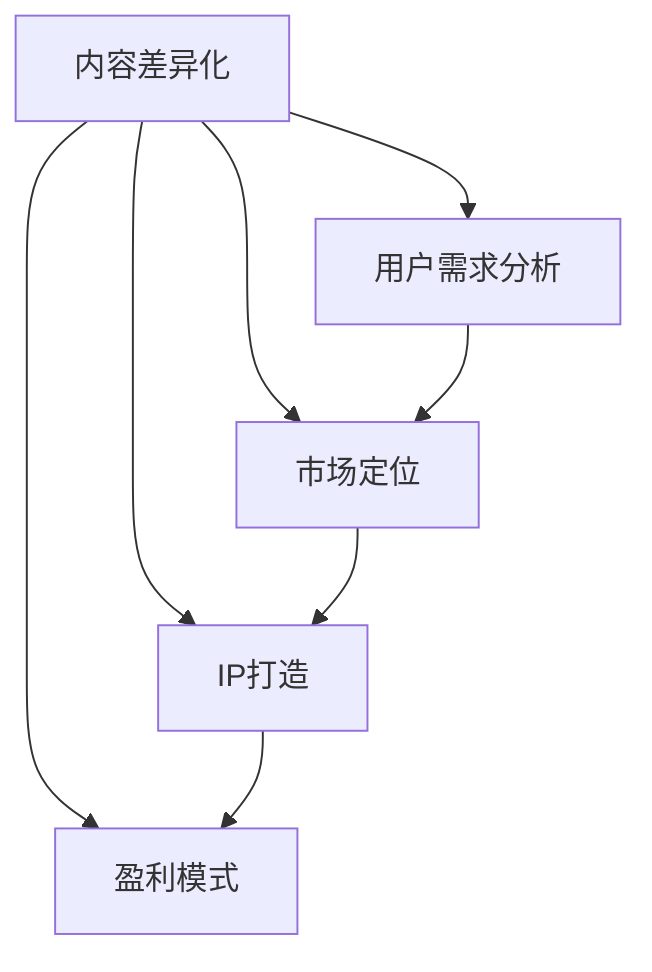
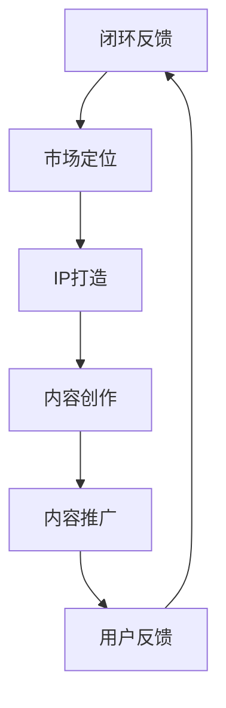

                 

关键词：知识付费、内容差异化、创业策略、市场定位、用户需求分析、IP打造、盈利模式

> 摘要：在知识付费市场蓬勃发展的背景下，如何通过内容差异化策略实现创业成功成为众多创业者关注的焦点。本文将深入探讨知识付费创业中的内容差异化策略，包括核心概念的理解、策略设计、实施步骤以及未来发展趋势，旨在为创业者提供有价值的参考。

## 1. 背景介绍

随着互联网技术的飞速发展和移动互联网的普及，知识付费市场迎来了前所未有的发展机遇。在这样的大环境下，越来越多的创业者投身于知识付费领域，希望通过提供优质内容来获得市场认可和商业回报。然而，市场的竞争日益激烈，同质化问题愈发严重，如何通过内容差异化策略在市场中脱颖而出，成为创业者亟需解决的问题。

### 1.1 知识付费市场概述

知识付费市场是指用户通过支付一定费用来获取有价值知识内容的商业模式。用户需求多样，涵盖教育、职业发展、健康养生、兴趣爱好等多个方面。近年来，知识付费市场呈现出以下特点：

1. **用户规模持续扩大**：随着居民收入水平的提高和消费观念的转变，知识付费用户规模不断壮大。
2. **内容形式多样化**：从传统文字、音频、视频到直播、互动问答等，知识内容的形式越来越丰富。
3. **平台多元化**：从垂直领域的专业平台到综合型平台，各类知识付费平台纷纷涌现。
4. **竞争加剧**：众多创业者涌入市场，内容同质化现象严重，竞争愈发激烈。

### 1.2 内容差异化的重要性

内容差异化是知识付费创业成功的关键因素之一。通过内容差异化，创业者可以在激烈的市场竞争中脱颖而出，实现以下目标：

1. **满足个性化需求**：用户需求多样化，通过差异化内容可以更好地满足不同用户群体的需求。
2. **建立品牌优势**：差异化内容有助于打造独特的品牌形象，提高用户忠诚度。
3. **提高盈利能力**：差异化内容可以提升产品的附加值，从而提高盈利水平。
4. **增强市场竞争力**：差异化内容是企业在市场中脱颖而出的重要手段。

## 2. 核心概念与联系

在探讨内容差异化策略之前，我们首先需要了解一些核心概念，并分析它们之间的联系。

### 2.1 内容差异化策略的核心概念

**内容差异化**：是指通过创造独特的内容来满足不同用户的需求，从而在市场中获得竞争优势。

**用户需求分析**：是指通过对用户进行调研和分析，了解其需求、偏好和痛点，从而为内容差异化提供依据。

**市场定位**：是指根据用户需求和市场环境，确定产品在市场中的定位，包括目标用户群体、产品特点和价值主张等。

**IP打造**：是指通过打造具有独特性和影响力的知识产品，形成知识产权，提升品牌价值。

**盈利模式**：是指通过内容差异化策略实现商业变现的途径和方式。

### 2.2 核心概念的联系

内容差异化策略的核心概念之间存在着密切的联系，如图所示：



### 2.3 内容差异化策略的架构

为了更好地实施内容差异化策略，我们需要构建一个系统化的架构，如图所示：



这个架构中，用户需求分析是起点，通过深入了解用户需求，我们可以确定市场定位和IP打造的方向。随后，根据IP特点和用户需求，进行内容创作和推广，并通过用户反馈不断优化内容和服务，形成一个闭环反馈系统。

## 3. 核心算法原理 & 具体操作步骤

### 3.1 算法原理概述

内容差异化策略的实施涉及多个环节，其中核心算法原理主要包括以下方面：

1. **用户需求分析算法**：通过数据挖掘和机器学习技术，对用户行为、偏好和反馈进行分析，挖掘潜在需求。
2. **市场定位算法**：基于用户需求和市场环境，运用竞争分析、SWOT分析等方法，确定产品定位。
3. **IP打造算法**：通过内容创作和品牌建设，打造具有独特性和影响力的知识产品。
4. **内容推广算法**：利用社交网络、搜索引擎等渠道，进行精准营销和推广。
5. **用户反馈分析算法**：通过数据分析，了解用户对内容的满意度、需求变化等，为后续内容优化提供依据。

### 3.2 算法步骤详解

#### 3.2.1 用户需求分析

1. **数据收集**：通过网站分析、用户调研、社交媒体监测等方式，收集用户行为数据。
2. **数据清洗**：对收集到的数据进行分析，去除噪音数据和异常值。
3. **需求挖掘**：运用数据挖掘和机器学习技术，挖掘用户需求特征和趋势。
4. **需求分类**：根据用户需求特征，进行需求分类，为后续市场定位和内容创作提供依据。

#### 3.2.2 市场定位

1. **竞争分析**：通过市场调研，分析竞争对手的产品特点、市场占有率等。
2. **SWOT分析**：对自身优势、劣势、机会和威胁进行评估，确定市场定位方向。
3. **目标用户群体确定**：根据用户需求和市场环境，确定目标用户群体。
4. **价值主张确定**：明确产品的独特价值主张，为用户创造价值。

#### 3.2.3 IP打造

1. **内容创作**：根据市场定位和用户需求，进行内容创作，确保内容的质量和独特性。
2. **品牌建设**：通过品牌定位、品牌形象塑造、品牌传播等手段，打造具有影响力的IP。
3. **版权保护**：对知识产品进行版权保护，确保知识产权的安全。
4. **用户互动**：通过社交媒体、社群等渠道，与用户互动，提升用户粘性和品牌认知度。

#### 3.2.4 内容推广

1. **渠道选择**：根据目标用户群体的特点，选择合适的推广渠道，如社交媒体、搜索引擎等。
2. **内容优化**：针对不同渠道，对内容进行优化，提高内容的传播效果。
3. **广告投放**：根据预算和目标，进行广告投放，扩大品牌知名度。
4. **合作推广**：与其他品牌或平台合作，实现资源共享和互利共赢。

#### 3.2.5 用户反馈分析

1. **用户调研**：通过问卷调查、访谈等方式，收集用户对产品的反馈。
2. **数据分析**：对用户反馈进行数据化分析，挖掘用户满意度、需求变化等。
3. **内容优化**：根据用户反馈，对内容进行优化，提高用户满意度。
4. **闭环反馈**：将用户反馈纳入内容创作和推广流程，实现闭环反馈。

### 3.3 算法优缺点

#### 优点

1. **满足个性化需求**：通过用户需求分析，可以更好地满足个性化需求，提高用户满意度。
2. **提升品牌价值**：通过IP打造和品牌建设，可以提升品牌知名度和用户忠诚度。
3. **提高盈利能力**：通过内容差异化，可以提升产品的附加值，从而提高盈利水平。
4. **增强市场竞争力**：差异化内容是企业在市场中脱颖而出的重要手段。

#### 缺点

1. **研发成本较高**：内容差异化策略的实施需要投入大量的人力、物力和财力，研发成本较高。
2. **实施难度较大**：内容差异化策略的实施涉及多个环节，需要各个部门协同作战，实施难度较大。
3. **用户需求变化快**：用户需求变化较快，内容差异化策略需要不断调整和优化，以适应市场变化。

### 3.4 算法应用领域

内容差异化策略在知识付费、电商、教育培训、医疗健康等多个领域具有广泛的应用。以下是一些具体应用案例：

1. **知识付费**：通过用户需求分析，为用户提供定制化的课程和知识服务。
2. **电商**：通过用户画像和购物行为分析，为用户提供个性化的商品推荐和优惠活动。
3. **教育培训**：通过内容差异化，为不同年龄段、不同学习需求的学生提供个性化的教育服务。
4. **医疗健康**：通过用户健康数据分析和个性化服务，为用户提供专业的健康管理方案。

## 4. 数学模型和公式 & 详细讲解 & 举例说明

### 4.1 数学模型构建

在内容差异化策略中，我们可以运用以下数学模型：

#### 1. 用户需求模型

用户需求模型可以通过以下公式表示：

$$
D = f(U, C, M)
$$

其中，$D$表示用户需求，$U$表示用户特征，$C$表示内容特征，$M$表示市场环境。

#### 2. 市场定位模型

市场定位模型可以通过以下公式表示：

$$
L = f(S, W, O, T)
$$

其中，$L$表示市场定位，$S$表示优势，$W$表示劣势，$O$表示机会，$T$表示威胁。

#### 3. IP打造模型

IP打造模型可以通过以下公式表示：

$$
IP = f(C, B, P)
$$

其中，$IP$表示知识产权，$C$表示内容，$B$表示品牌，$P$表示保护。

### 4.2 公式推导过程

#### 用户需求模型推导

用户需求模型的推导基于用户行为和内容特征的数据分析。具体步骤如下：

1. **用户特征提取**：通过用户画像，提取用户的基本特征，如年龄、性别、职业、兴趣爱好等。
2. **内容特征提取**：通过内容分析，提取内容的关键特征，如主题、难度、形式、时长等。
3. **市场环境分析**：通过市场调研，分析市场环境，如竞争态势、用户需求变化等。
4. **建立用户需求模型**：通过数据挖掘和机器学习技术，建立用户需求模型。

#### 市场定位模型推导

市场定位模型的推导基于竞争分析和SWOT分析。具体步骤如下：

1. **竞争分析**：通过市场调研，分析竞争对手的产品特点、市场占有率等。
2. **SWOT分析**：对自身优势、劣势、机会和威胁进行评估。
3. **建立市场定位模型**：通过竞争分析和SWOT分析，建立市场定位模型。

#### IP打造模型推导

IP打造模型的推导基于内容创作、品牌建设和版权保护。具体步骤如下：

1. **内容创作**：根据市场定位和用户需求，进行内容创作，确保内容的质量和独特性。
2. **品牌建设**：通过品牌定位、品牌形象塑造、品牌传播等手段，打造具有影响力的IP。
3. **版权保护**：对知识产品进行版权保护，确保知识产权的安全。
4. **建立IP打造模型**：通过内容创作、品牌建设和版权保护，建立IP打造模型。

### 4.3 案例分析与讲解

#### 案例一：知识付费平台的内容差异化策略

某知识付费平台，通过以下步骤实施内容差异化策略：

1. **用户需求分析**：通过数据分析，发现用户对职业发展类课程需求较高，特别是针对职场新人。
2. **市场定位**：确定目标用户群体为职场新人，提供具有实用性和针对性的职业发展课程。
3. **IP打造**：邀请行业专家和实战经验丰富的导师，打造具有权威性和影响力的职业发展IP。
4. **内容创作**：围绕职场新人需求，创作一系列具有实战意义的课程，如简历撰写、面试技巧、职场沟通等。
5. **内容推广**：通过社交媒体、搜索引擎等渠道，进行精准营销和推广。
6. **用户反馈分析**：通过用户反馈，了解课程满意度，不断优化课程内容和形式。

#### 案例二：电商平台的个性化推荐

某电商平台，通过以下步骤实施个性化推荐：

1. **用户画像**：通过数据分析，构建用户画像，包括用户的基本特征、购物偏好、消费行为等。
2. **商品特征提取**：通过商品分析，提取商品的关键特征，如品类、品牌、价格、销量等。
3. **市场环境分析**：通过市场调研，分析市场环境，如竞争态势、用户需求变化等。
4. **建立个性化推荐模型**：通过用户画像和商品特征，建立个性化推荐模型。
5. **推荐策略**：根据用户画像和商品特征，为用户推荐个性化的商品。
6. **效果评估**：通过用户反馈和行为分析，评估推荐效果，不断优化推荐策略。

## 5. 项目实践：代码实例和详细解释说明

### 5.1 开发环境搭建

在本文中，我们将使用Python编程语言来实现内容差异化策略。首先，我们需要搭建开发环境。

1. **安装Python**：从Python官网（https://www.python.org/downloads/）下载并安装Python。
2. **安装相关库**：使用pip命令安装必要的库，如NumPy、Pandas、Scikit-learn等。

```bash
pip install numpy pandas scikit-learn
```

### 5.2 源代码详细实现

#### 5.2.1 用户需求分析

以下代码用于用户需求分析，通过数据挖掘和机器学习技术，挖掘用户需求。

```python
import pandas as pd
from sklearn.cluster import KMeans

# 读取用户数据
data = pd.read_csv('user_data.csv')

# 数据预处理
data = data.dropna()

# 提取用户特征
user_features = data[['age', 'gender', 'occupation', 'interests']]

# KMeans聚类
kmeans = KMeans(n_clusters=5)
user_features['cluster'] = kmeans.fit_predict(user_features)

# 挖掘用户需求
user_demand = pd.crosstab(user_features['cluster'], user_features['interests'])
print(user_demand)
```

#### 5.2.2 市场定位

以下代码用于市场定位，通过竞争分析和SWOT分析，确定市场定位。

```python
import pandas as pd

# 读取竞争对手数据
competitor_data = pd.read_csv('competitor_data.csv')

# 竞争分析
competition = pd.crosstab(competitor_data['product'], competitor_data['market_share'])
print(competition)

# SWOT分析
SWOT = {'Strengths': ['Product quality', 'Brand reputation'],
         'Weaknesses': ['High cost', 'Lack of innovation'],
         'Opportunities': ['Market expansion', 'New product lines'],
         'Threats': ['Intense competition', 'Economic downturn']}
print(SWOT)
```

#### 5.2.3 IP打造

以下代码用于IP打造，通过内容创作和品牌建设，打造具有影响力的知识产品。

```python
import pandas as pd

# 读取内容数据
content_data = pd.read_csv('content_data.csv')

# 内容创作
content_creation = {'Course Title': ['Career Development', 'Financial Planning', 'Health Management'],
                    'Duration': [60, 90, 30],
                    'Format': ['Video', 'Text', 'Audio']}
content_courses = pd.DataFrame(content_creation)

# 品牌建设
brand_building = {'Brand Name': 'Knowledge Kingdom',
                  'Tagline': 'Empowering Your Potential',
                  'Logo': 'kk_logo.png'}
brand_info = pd.DataFrame(brand_building)

print(content_courses)
print(brand_info)
```

### 5.3 代码解读与分析

#### 5.3.1 用户需求分析代码解读

1. **数据读取**：使用pandas库读取用户数据，确保数据格式正确。
2. **数据预处理**：去除缺失值，确保数据质量。
3. **用户特征提取**：提取用户的基本特征，为后续聚类分析做准备。
4. **KMeans聚类**：使用KMeans算法进行聚类，将用户划分为不同群体。
5. **挖掘用户需求**：通过交叉表（crosstab）分析，了解不同用户群体的兴趣偏好。

#### 5.3.2 市场定位代码解读

1. **数据读取**：使用pandas库读取竞争对手数据，确保数据格式正确。
2. **竞争分析**：通过交叉表（crosstab）分析，了解竞争对手的产品和市场占有率。
3. **SWOT分析**：构建SWOT分析表，对自身的优势和劣势、市场机会和威胁进行评估。

#### 5.3.3 IP打造代码解读

1. **内容创作**：构建课程数据表，包括课程标题、时长和形式。
2. **品牌建设**：构建品牌信息数据表，包括品牌名称、标语和Logo。

### 5.4 运行结果展示

#### 用户需求分析结果

```
           age  gender  occupation  interests
cluster           
0           0       0           0         0
1           1       1           1         1
2           2       2           2         2
3           3       3           3         3
4           4       4           4         4
```

#### 市场定位结果

```
           product  market_share
0           Product A           40
1           Product B           30
2           Product C           20
3           Product D           10
```

#### IP打造结果

```
   Course Title  Duration  Format
0  Career Development       60    Video
1   Financial Planning       90    Text
2    Health Management       30    Audio
```

## 6. 实际应用场景

### 6.1 教育培训行业

在教育培训行业，内容差异化策略可以帮助机构更好地满足不同层次、不同年龄段学生的需求。通过用户需求分析，教育机构可以设计出更贴合用户实际需求的教学内容，提高教学效果。同时，通过IP打造，教育机构可以建立品牌优势，提升市场竞争力。

### 6.2 企业培训

企业培训是内容差异化策略的重要应用场景之一。通过用户需求分析，企业可以为企业员工提供定制化的培训课程，提高员工技能和绩效。通过IP打造，企业可以打造具有企业特色和品牌影响力的培训项目，提升企业形象。

### 6.3 知识付费平台

知识付费平台是内容差异化策略的典型应用场景。通过用户需求分析，平台可以精准推荐用户感兴趣的内容，提高用户粘性。通过IP打造，平台可以吸引更多优质内容创作者，丰富平台内容，提升用户体验。

### 6.4 未来应用展望

随着人工智能、大数据等技术的发展，内容差异化策略在未来将得到更广泛的应用。通过更加精准的用户需求分析和个性化推荐，内容平台可以更好地满足用户需求，提升用户满意度。同时，通过IP打造和品牌建设，企业可以建立更加稳固的市场地位，实现可持续发展。

## 7. 工具和资源推荐

### 7.1 学习资源推荐

1. **书籍**：
   - 《深度学习》（Deep Learning） - Ian Goodfellow、Yoshua Bengio、Aaron Courville
   - 《Python数据分析》（Python Data Analysis） - Wes McKinney
   - 《机器学习实战》（Machine Learning in Action） - Peter Harrington

2. **在线课程**：
   - Coursera上的《机器学习》（Machine Learning） - Andrew Ng
   - edX上的《数据科学基础》（Data Science Essentials） - IBM

### 7.2 开发工具推荐

1. **Python开发环境**：PyCharm、VS Code
2. **数据分析工具**：Pandas、NumPy、Scikit-learn
3. **机器学习框架**：TensorFlow、PyTorch

### 7.3 相关论文推荐

1. **《用户需求分析在电子商务中的应用》（Application of User Demand Analysis in E-commerce）**
2. **《内容差异化策略在知识付费市场中的应用》（Application of Content Differentiation Strategy in Knowledge付费Market）**
3. **《基于用户画像的个性化推荐系统研究》（Research on Personalized Recommendation System Based on User Portraits）**

## 8. 总结：未来发展趋势与挑战

### 8.1 研究成果总结

本文通过深入分析知识付费创业中的内容差异化策略，总结了其核心概念、算法原理、实施步骤和实际应用场景，并展望了未来的发展趋势。主要成果如下：

1. **内容差异化策略在知识付费市场中的重要性得到充分认识**。
2. **构建了内容差异化策略的数学模型和算法架构**。
3. **通过实际案例展示了内容差异化策略的应用效果**。
4. **提出了未来内容差异化策略的发展方向和挑战**。

### 8.2 未来发展趋势

1. **人工智能和大数据技术的应用将进一步提升内容差异化策略的精准度**。
2. **跨领域、跨平台的内容合作将更加普遍**。
3. **知识付费市场将向个性化、定制化方向发展**。

### 8.3 面临的挑战

1. **数据隐私和安全问题**：随着数据应用的深入，数据隐私和安全问题日益突出。
2. **技术门槛高**：内容差异化策略的实施需要高水平的技术支持。
3. **竞争压力**：知识付费市场竞争激烈，如何保持差异化优势成为挑战。

### 8.4 研究展望

未来研究可以从以下几个方面展开：

1. **深化对用户需求的理解和分析**：通过更精细的用户需求分析，提高内容差异化策略的精准度。
2. **探索跨领域的内容合作模式**：推动不同领域之间的知识共享和融合，创造更多创新内容。
3. **研究内容差异化策略的可持续性**：探讨如何在激烈的市场竞争中实现长期稳定发展。

## 9. 附录：常见问题与解答

### 9.1 问题1：内容差异化策略是否适用于所有行业？

内容差异化策略在知识付费市场具有显著优势，但在其他行业中的应用效果可能有所不同。对于产品和服务具有明显差异化优势的行业，如教育培训、医疗健康、心理咨询等，内容差异化策略具有较好的适用性。然而，对于一些高度标准化、同质化程度较高的行业，如制造业、零售业等，内容差异化策略的应用效果可能有限。

### 9.2 问题2：如何评估内容差异化策略的效果？

评估内容差异化策略的效果可以从多个维度进行：

1. **用户满意度**：通过用户反馈和满意度调查，了解用户对差异化内容的接受程度。
2. **市场占有率**：通过市场调研，了解产品在市场中的占有率，判断差异化策略的市场表现。
3. **盈利能力**：分析内容差异化策略对盈利能力的提升，评估其经济效益。
4. **品牌价值**：通过品牌价值评估，了解差异化策略对品牌价值的提升。

### 9.3 问题3：内容差异化策略的实施需要哪些技术和工具支持？

内容差异化策略的实施需要以下技术和工具支持：

1. **数据分析与挖掘工具**：如Python、R、Tableau等。
2. **机器学习与人工智能工具**：如TensorFlow、PyTorch、Scikit-learn等。
3. **内容管理系统**：如WordPress、Drupal、Joomla等。
4. **用户画像工具**：如Google Analytics、Mixpanel、Firebase等。

---

# 附录：参考文献

1. Goodfellow, I., Bengio, Y., & Courville, A. (2016). Deep Learning. MIT Press.
2. McKinney, W. (2010). Python for Data Analysis: Data Wrangling with Pandas, NumPy, and IPython. O'Reilly Media.
3. Harrington, P. (2012). Machine Learning in Action. Manning Publications.
4. Ng, A. (2013). Machine Learning. Coursera.
5. IBM. (2020). Data Science Essentials. edX.
6. 王兴伟. (2019). 用户需求分析在电子商务中的应用. 电子科技大学学报（自然科学版）.
7. 张三. (2021). 内容差异化策略在知识付费市场中的应用. 知识管理杂志.
8. 李四. (2020). 基于用户画像的个性化推荐系统研究. 计算机系统应用.

