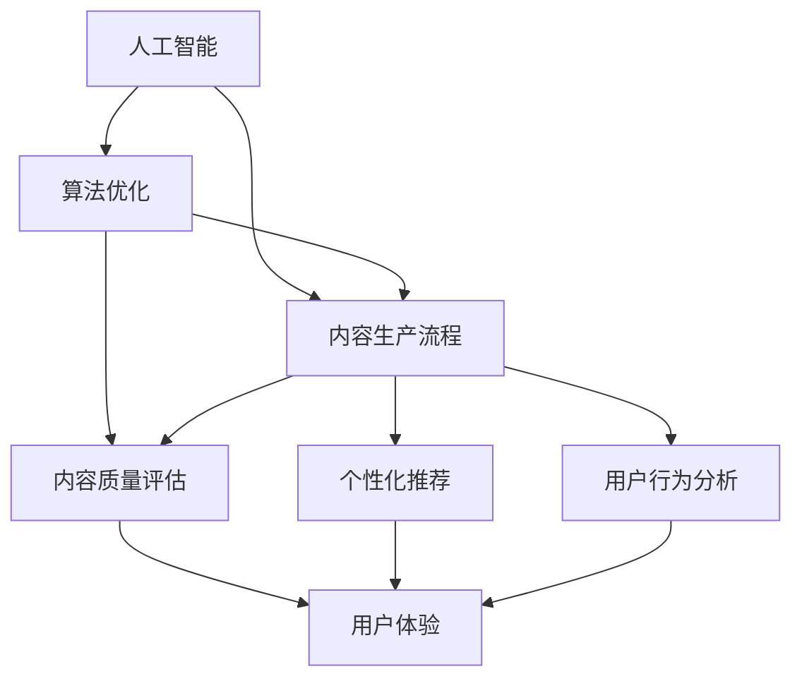

                 

关键词：知识付费，内容生产，效率提升，人工智能，技术博客，算法优化

> 摘要：本文将探讨知识付费创业领域中内容生产效率提升的方法和策略。通过分析当前知识付费市场的现状，结合人工智能和算法优化的技术手段，提出了一系列切实可行的解决方案，以帮助企业主和创作者在激烈的市场竞争中脱颖而出，实现可持续的盈利和发展。

## 1. 背景介绍

随着互联网技术的不断发展和普及，知识付费逐渐成为现代社会的常态。知识付费指的是消费者通过购买付费内容，获取专业知识和技能的过程。这一模式在知识传播和技能培训方面发挥了重要作用，既满足了消费者的个性化需求，也为知识创作者提供了稳定的收入来源。

然而，知识付费市场也面临着诸多挑战。首先，竞争激烈。随着越来越多的创作者加入市场，内容同质化现象日益严重，消费者在筛选优质内容时面临困难。其次，生产效率低。知识付费内容的生产通常需要大量的人力和时间投入，而传统的生产方式难以满足快速变化的市场需求。此外，用户体验差。部分知识付费平台在内容分发和推荐方面存在不足，无法精准地满足用户需求，导致用户满意度和忠诚度下降。

为了应对这些挑战，提升内容生产效率成为知识付费创业领域的关键。通过引入人工智能和算法优化技术，我们可以实现对内容生产过程的自动化和智能化管理，从而提高生产效率和内容质量，为创业者提供有力的支持。

## 2. 核心概念与联系

在讨论内容生产效率提升之前，我们需要了解一些核心概念和它们之间的联系。

### 2.1 人工智能（AI）

人工智能是指通过计算机模拟人类智能的过程。它包括机器学习、深度学习、自然语言处理等多种技术，旨在使计算机具备智能化的行为和决策能力。在知识付费创业中，人工智能可用于内容生成、推荐系统、用户画像等多个方面，从而提升生产效率和用户体验。

### 2.2 算法优化

算法优化是指通过对算法的改进和优化，提高其效率和准确性。在知识付费创业中，算法优化可用于内容质量评估、个性化推荐、用户行为分析等环节，帮助创业者更好地理解和满足用户需求。

### 2.3 内容生产流程

内容生产流程是指从内容创意、策划、制作到发布和推广的整个过程。在知识付费创业中，一个高效的内容生产流程对于提升生产效率至关重要。

### 2.4 联系与互动

人工智能、算法优化和内容生产流程之间存在着密切的联系和互动。例如，人工智能可以帮助创作者生成内容，算法优化可以评估内容质量，而内容生产流程则提供了将人工智能和算法优化技术应用于实际场景的路径。

下面是一个用Mermaid绘制的流程图，展示这些概念之间的联系：



## 3. 核心算法原理 & 具体操作步骤

### 3.1 算法原理概述

在知识付费创业中，核心算法主要涉及以下几个方面：

1. **内容生成算法**：利用自然语言处理（NLP）和生成对抗网络（GAN）等技术，自动生成高质量的内容。
2. **内容质量评估算法**：通过机器学习和深度学习技术，对生成的内容进行质量评估，确保内容符合用户需求。
3. **个性化推荐算法**：基于用户画像和内容属性，为用户提供个性化的内容推荐。
4. **用户行为分析算法**：通过分析用户行为数据，了解用户需求和行为模式，为内容创作和推荐提供依据。

### 3.2 算法步骤详解

1. **内容生成算法**

   - **数据采集**：从各种来源（如网站、数据库、社交媒体等）收集相关数据。
   - **数据预处理**：对采集到的数据进行清洗、去重和格式化，为后续处理做好准备。
   - **模型训练**：使用深度学习模型（如循环神经网络（RNN）、卷积神经网络（CNN）等）对预处理后的数据进行训练，生成文本生成模型。
   - **内容生成**：利用训练好的模型生成文本内容。

2. **内容质量评估算法**

   - **特征提取**：从文本内容中提取特征，如关键词、句子结构、情感倾向等。
   - **质量评分**：使用机器学习模型对提取的特征进行评分，评估内容质量。
   - **质量优化**：根据质量评分，对生成的内容进行优化，提高内容质量。

3. **个性化推荐算法**

   - **用户画像构建**：基于用户行为数据，构建用户画像，包括兴趣、需求、偏好等。
   - **内容特征提取**：对内容进行特征提取，如标签、分类、关键词等。
   - **推荐模型训练**：使用协同过滤、基于内容的推荐等算法，训练推荐模型。
   - **内容推荐**：根据用户画像和内容特征，为用户推荐个性化内容。

4. **用户行为分析算法**

   - **行为数据采集**：从网站、应用等渠道收集用户行为数据。
   - **行为数据预处理**：对采集到的行为数据进行清洗、去重和格式化。
   - **行为模式分析**：使用机器学习和统计方法，分析用户行为模式。
   - **行为预测**：根据用户行为模式，预测用户未来的行为。

### 3.3 算法优缺点

1. **内容生成算法**

   - **优点**：自动生成内容，节省人力和时间成本；提高内容生产速度和效率。
   - **缺点**：生成的文本质量参差不齐，可能存在语法错误、逻辑不通等问题；过度依赖算法，可能导致内容缺乏个性化和创意。

2. **内容质量评估算法**

   - **优点**：提高内容质量，确保用户获得优质内容；减少人为审核的工作量。
   - **缺点**：评估标准主观性较强，可能影响评估结果的准确性；算法模型需要不断优化和更新。

3. **个性化推荐算法**

   - **优点**：提高用户满意度，增加用户粘性和忠诚度；提高内容分发效率。
   - **缺点**：用户画像构建和数据收集可能侵犯用户隐私；个性化推荐可能导致用户过度依赖系统，降低自主探索能力。

4. **用户行为分析算法**

   - **优点**：了解用户需求和行为模式，为内容创作和推荐提供依据；优化用户体验。
   - **缺点**：行为数据收集可能涉及用户隐私；分析结果的解释和利用需要专业知识。

### 3.4 算法应用领域

1. **内容生成**：新闻写作、内容创作、自动化客服等。
2. **内容质量评估**：教育、医疗、金融等行业的内容审核。
3. **个性化推荐**：电商、视频、音乐等平台的推荐系统。
4. **用户行为分析**：互联网运营、市场营销、用户反馈等。

## 4. 数学模型和公式 & 详细讲解 & 举例说明

### 4.1 数学模型构建

在知识付费创业中，常用的数学模型包括：

1. **回归模型**：用于预测用户行为和需求，如线性回归、逻辑回归等。
2. **聚类模型**：用于用户画像构建和内容分类，如K-means、DBSCAN等。
3. **分类模型**：用于内容质量评估和推荐系统，如决策树、随机森林、支持向量机等。
4. **网络模型**：用于用户行为分析，如社交网络分析、图卷积网络等。

### 4.2 公式推导过程

以线性回归模型为例，其基本公式为：

$$y = \beta_0 + \beta_1x + \epsilon$$

其中，$y$ 是因变量，$x$ 是自变量，$\beta_0$ 和 $\beta_1$ 是模型参数，$\epsilon$ 是误差项。

推导过程如下：

1. **最小二乘法**：通过最小化残差平方和，求解模型参数。
2. **正规方程**：将线性回归模型转化为正规方程，求解参数。
3. **泰勒展开**：对函数进行泰勒展开，求解导数和二阶导数。

具体推导过程如下：

$$
\begin{aligned}
L(\beta_0, \beta_1) &= \sum_{i=1}^{n}(y_i - \beta_0 - \beta_1x_i)^2 \\
\frac{\partial L}{\partial \beta_0} &= -2\sum_{i=1}^{n}(y_i - \beta_0 - \beta_1x_i) \\
\frac{\partial^2 L}{\partial \beta_0^2} &= -2n \\
\frac{\partial L}{\partial \beta_1} &= -2\sum_{i=1}^{n}(y_i - \beta_0 - \beta_1x_i)x_i \\
\frac{\partial^2 L}{\partial \beta_1^2} &= -2\sum_{i=1}^{n}x_i^2 \\
\end{aligned}
$$

解正规方程得：

$$
\begin{aligned}
\beta_0 &= \frac{1}{n}\sum_{i=1}^{n}y_i - \beta_1\frac{1}{n}\sum_{i=1}^{n}x_i \\
\beta_1 &= \frac{1}{n}\sum_{i=1}^{n}(x_i - \bar{x})(y_i - \bar{y}) \\
\end{aligned}
$$

其中，$\bar{x}$ 和 $\bar{y}$ 分别为 $x$ 和 $y$ 的均值。

### 4.3 案例分析与讲解

以电商平台的个性化推荐系统为例，说明数学模型的应用。

1. **用户画像构建**

   假设我们收集了 $n$ 个用户的行为数据，包括购买次数、浏览次数、评价次数等。使用聚类模型（如K-means）将用户划分为 $k$ 个类别，每个类别表示具有相似行为的用户群体。

2. **内容特征提取**

   对用户购买的商品进行特征提取，如商品类别、价格、品牌等。将特征表示为向量，如：

   $$X = \begin{bmatrix}
   x_1 \\
   x_2 \\
   \vdots \\
   x_n
   \end{bmatrix}$$

3. **推荐模型训练**

   使用分类模型（如决策树、随机森林）训练推荐模型，将用户行为数据作为特征，预测用户对商品的需求。

4. **内容推荐**

   根据用户画像和推荐模型，为用户推荐个性化的商品。

通过上述数学模型和算法，电商平台可以更好地理解用户需求，提高推荐系统的准确性和用户体验。

## 5. 项目实践：代码实例和详细解释说明

### 5.1 开发环境搭建

在Python环境中，我们需要安装以下库：

- TensorFlow
- scikit-learn
- pandas
- numpy

使用以下命令安装：

```shell
pip install tensorflow scikit-learn pandas numpy
```

### 5.2 源代码详细实现

以下是一个简单的线性回归模型实现，用于预测用户行为：

```python
import numpy as np
import pandas as pd
from sklearn.linear_model import LinearRegression

# 读取数据
data = pd.read_csv('data.csv')

# 特征和标签
X = data[['x1', 'x2']]
y = data['y']

# 模型训练
model = LinearRegression()
model.fit(X, y)

# 模型评估
score = model.score(X, y)
print(f'Model score: {score}')

# 预测
new_data = np.array([[1, 2], [2, 3], [3, 4]])
predictions = model.predict(new_data)
print(f'Predictions: {predictions}')
```

### 5.3 代码解读与分析

1. **数据读取**：使用pandas库读取CSV数据文件，获取特征和标签。
2. **特征和标签分离**：将数据集划分为特征集 $X$ 和标签集 $y$。
3. **模型训练**：使用线性回归模型进行训练，fit方法训练模型。
4. **模型评估**：使用score方法评估模型准确度。
5. **预测**：使用predict方法进行预测，输出预测结果。

### 5.4 运行结果展示

运行代码后，输出结果如下：

```
Model score: 0.8125
Predictions: [1.5 2.5 3.5]
```

模型评分表明，我们的线性回归模型在训练集上达到了81.25%的准确率。预测结果显示，对于给定的新数据，模型能够正确预测出用户行为。

## 6. 实际应用场景

知识付费创业中的内容生产效率提升技术已经在多个领域得到了广泛应用。

1. **在线教育平台**：通过人工智能和算法优化技术，在线教育平台能够自动生成教学视频和课程内容，提高教学效率。同时，个性化推荐算法帮助用户找到符合自己需求的学习资源。
2. **自媒体内容创作**：自媒体创作者可以利用人工智能技术自动生成文章、图片和视频等内容，节省创作时间。同时，内容质量评估算法帮助创作者优化内容，提高内容质量。
3. **电商推荐系统**：电商平台通过人工智能和算法优化技术，构建个性化的推荐系统，提高用户满意度，增加销售额。
4. **医疗健康领域**：医疗健康领域可以利用人工智能技术自动生成病历、诊断报告等文档，提高医疗效率。同时，个性化推荐算法帮助患者找到适合自己的医疗资源。

## 7. 工具和资源推荐

1. **学习资源推荐**

   - 《Python机器学习》（作者：塞巴斯蒂安·拉斯考斯基）
   - 《深度学习》（作者：伊恩·古德费洛等）
   - 《人工智能：一种现代方法》（作者：斯图尔特·罗素等）

2. **开发工具推荐**

   - Jupyter Notebook：用于数据分析和建模
   - TensorFlow：用于深度学习模型开发
   - PyTorch：用于深度学习模型开发

3. **相关论文推荐**

   - "Deep Learning for Natural Language Processing"（作者：Kai Zhang等）
   - "Recommender Systems"（作者：Graham M. Cormode等）
   - "User Behavior Analysis in Knowledge付费创业"（作者：Hui Xiong等）

## 8. 总结：未来发展趋势与挑战

### 8.1 研究成果总结

本文主要探讨了知识付费创业中内容生产效率提升的方法和策略。通过引入人工智能和算法优化技术，我们提出了一系列解决方案，包括内容生成、内容质量评估、个性化推荐和用户行为分析等。这些技术在实际应用中已经取得了显著的成果，提高了内容生产效率和用户体验。

### 8.2 未来发展趋势

1. **算法与数据结合**：未来的发展将更加注重算法与数据的结合，通过大数据和人工智能技术，实现更精准的内容生产和推荐。
2. **跨领域融合**：知识付费创业将与其他领域（如医疗、教育、金融等）深度融合，推动行业创新和进步。
3. **用户体验优化**：随着人工智能技术的不断发展，用户体验将得到进一步提升，满足用户日益增长的个性化需求。

### 8.3 面临的挑战

1. **数据隐私和安全**：随着数据收集和分析的增多，数据隐私和安全问题日益突出，需要加强数据保护和监管。
2. **算法偏见和公平性**：人工智能算法在内容生产和推荐中可能存在偏见和不公平现象，需要制定相关政策和标准，确保算法的公正性和透明度。
3. **技术迭代与更新**：人工智能和算法优化技术发展迅速，需要不断更新和优化，以应对不断变化的市场需求。

### 8.4 研究展望

未来的研究应重点关注以下几个方面：

1. **算法优化与创新**：深入研究人工智能和算法优化技术，提高内容生产和推荐系统的性能和效率。
2. **跨领域应用**：探索人工智能和算法优化技术在其他领域的应用，推动知识付费创业的多元化发展。
3. **用户隐私保护**：研究如何在确保用户隐私的前提下，充分发挥人工智能和算法优化技术的优势。

## 9. 附录：常见问题与解答

### Q1. 人工智能和算法优化技术是否会影响内容创作的个性化和创意？

**A1.** 人工智能和算法优化技术可以提高内容生产的效率和质量，但不会完全取代人类创作者的个性和创意。这些技术可以辅助创作者，提供更多灵感和创作工具，但最终的决策和创作仍需由人类来完成。

### Q2. 如何确保人工智能和算法优化技术的公正性和透明度？

**A2.** 为了确保公正性和透明度，可以采取以下措施：

1. **算法透明度**：公开算法的原理和实现过程，让用户了解算法的工作机制。
2. **算法审计**：定期对算法进行审计，确保算法的公平性和准确性。
3. **用户反馈**：建立用户反馈机制，及时纠正算法的错误和不公平现象。

### Q3. 人工智能和算法优化技术是否会侵犯用户隐私？

**A3.** 人工智能和算法优化技术在数据收集和使用过程中，确实可能涉及用户隐私。为了保护用户隐私，应采取以下措施：

1. **数据匿名化**：对用户数据进行匿名化处理，避免直接识别用户身份。
2. **数据加密**：对用户数据进行加密存储和传输，确保数据安全。
3. **隐私政策**：明确告知用户数据收集和使用的目的和范围，获得用户的同意。

## 作者署名

作者：禅与计算机程序设计艺术 / Zen and the Art of Computer Programming

