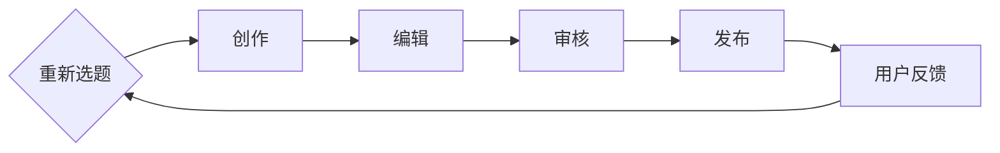

                 

关键词：知识付费、内容生产、效率提升、人工智能、算法优化、技术架构

摘要：本文旨在探讨知识付费创业中如何通过提高内容生产效率来降低成本、提高竞争力。我们将从核心概念、算法原理、数学模型、实际应用等多个角度深入分析，并提出一系列优化策略和技术工具，以期为知识付费创业者提供有价值的参考。

## 1. 背景介绍

随着互联网和移动互联网的快速发展，知识付费行业呈现出爆炸式增长。在这个领域，内容生产效率的高低直接决定了企业的盈利能力和市场竞争力。然而，内容生产涉及到从选题、创作、编辑、发布等多个环节，每个环节都可能存在效率瓶颈。如何提升内容生产效率，成为知识付费创业者亟需解决的重要问题。

### 1.1 内容生产的现状

当前，知识付费内容生产主要面临以下几个问题：

- **选题策划难度大**：需要深入了解用户需求，而用户需求多变，难以精准把握。
- **创作资源有限**：专业创作者数量有限，导致优质内容稀缺。
- **编辑和审核耗时**：内容生产流程中，编辑和审核环节耗时较长，影响发布速度。
- **渠道分散**：不同平台有各自的内容标准和分发规则，需要耗费大量时间和精力进行适配。

### 1.2 效率提升的意义

提高内容生产效率对于知识付费创业者具有重要意义：

- **降低成本**：提高效率可以减少人力、时间和资源投入，降低运营成本。
- **提升竞争力**：快速响应市场需求，提供高质量内容，增加用户粘性和市场份额。
- **优化用户体验**：减少内容发布周期，提高内容更新频率，提升用户满意度。

## 2. 核心概念与联系

在讨论如何提升内容生产效率之前，我们需要明确几个核心概念，包括内容生产流程、人工智能和算法优化等。

### 2.1 内容生产流程

内容生产流程通常包括以下几个环节：

1. **选题策划**：根据用户需求和内容战略，确定创作方向。
2. **创作**：由专业创作者进行内容创作。
3. **编辑**：对创作内容进行校对、修改和优化。
4. **审核**：对编辑后的内容进行质量和合规性审核。
5. **发布**：将审核通过的内容发布到不同平台。

### 2.2 人工智能与算法优化

人工智能（AI）在内容生产中的应用，主要体现在以下几个方面：

- **自然语言处理（NLP）**：用于自动撰写、校对和优化内容。
- **推荐系统**：根据用户行为和偏好推荐内容。
- **图像识别**：用于内容审核中的图片识别和分类。

算法优化则涉及以下几个方面：

- **效率优化**：通过算法改进，提高处理速度和资源利用率。
- **准确性优化**：提高算法的准确性和可靠性。
- **成本优化**：减少算法对计算资源和人力成本的需求。

### 2.3 Mermaid 流程图

下面是一个内容生产流程的 Mermaid 流程图，展示了各个环节的顺序和联系。



## 3. 核心算法原理 & 具体操作步骤

### 3.1 算法原理概述

在内容生产中，核心算法主要包括自然语言处理（NLP）算法、推荐系统算法和图像识别算法。下面分别介绍这些算法的原理。

#### 自然语言处理（NLP）

NLP算法主要用于自动化内容创作、校对和优化。其核心原理包括：

- **词向量表示**：将文本转换为向量，以便进行数学运算。
- **文本分类**：根据文本内容将其分类到不同的类别。
- **文本生成**：基于已有文本生成新的文本内容。

#### 推荐系统

推荐系统用于根据用户行为和偏好推荐内容。核心原理包括：

- **协同过滤**：基于用户的历史行为和偏好进行推荐。
- **基于内容的推荐**：根据内容特征和用户兴趣进行推荐。

#### 图像识别

图像识别算法用于内容审核中的图片识别和分类。核心原理包括：

- **特征提取**：从图像中提取关键特征。
- **模型训练**：使用已标记的图像数据进行模型训练。
- **图像分类**：将图像分类到预定义的类别中。

### 3.2 算法步骤详解

下面以自然语言处理（NLP）算法为例，详细讲解其操作步骤。

#### 3.2.1 词向量表示

1. **数据预处理**：对文本进行分词、去停用词和词干提取等处理。
2. **词向量编码**：使用预训练的词向量模型（如Word2Vec、GloVe）将文本转换为向量。

#### 3.2.2 文本分类

1. **特征提取**：将文本向量转换为固定长度的特征向量。
2. **模型训练**：使用有监督学习算法（如softmax回归、支持向量机）训练分类模型。
3. **分类预测**：将新文本向量输入分类模型，预测其类别。

#### 3.2.3 文本生成

1. **序列建模**：使用循环神经网络（RNN）或长短期记忆网络（LSTM）建模文本序列。
2. **生成文本**：根据训练好的模型生成新的文本内容。

### 3.3 算法优缺点

#### 自然语言处理（NLP）

- **优点**：自动化处理文本，提高内容创作和编辑效率。
- **缺点**：对文本理解和生成能力有限，需要大量训练数据和计算资源。

#### 推荐系统

- **优点**：提高用户满意度和内容利用率。
- **缺点**：需要处理大量的用户数据，可能涉及隐私问题。

#### 图像识别

- **优点**：自动化审核内容，减少人工审核成本。
- **缺点**：对图像质量和标注数据依赖较大。

### 3.4 算法应用领域

- **自然语言处理（NLP）**：内容创作、校对和优化，问答系统，文本生成等。
- **推荐系统**：内容推荐，电商推荐，社交网络推荐等。
- **图像识别**：内容审核，安全监控，医疗诊断等。

## 4. 数学模型和公式 & 详细讲解 & 举例说明

在内容生产中，数学模型和公式发挥着重要作用，下面我们将介绍几个核心的数学模型，并进行详细讲解和举例说明。

### 4.1 数学模型构建

#### 文本分类模型

文本分类模型是自然语言处理中的一个重要模型，用于将文本分类到预定义的类别中。其数学模型主要包括以下几个部分：

1. **特征表示**：将文本转换为特征向量。
2. **分类器**：使用有监督学习算法训练分类器。
3. **损失函数**：用于评估分类器的性能。

假设我们有以下模型：

$$
y = \arg\max_{w} \sum_{i=1}^{n} \sigma(w^T x_i - b)
$$

其中，$x_i$为第$i$个特征向量，$w$为权重向量，$b$为偏置项，$\sigma$为激活函数。

#### 推荐系统模型

推荐系统模型主要用于预测用户对物品的评分或偏好。其数学模型主要包括以下几个部分：

1. **用户向量**：表示用户的行为和偏好。
2. **物品向量**：表示物品的特征。
3. **评分预测**：使用矩阵分解、协同过滤等方法预测用户对物品的评分。

假设我们有以下模型：

$$
R_{ui} = \hat{R}_{ui} = \langle \mathbf{u}_u, \mathbf{i}_i \rangle
$$

其中，$R_{ui}$为用户$i$对物品$j$的实际评分，$\hat{R}_{ui}$为预测评分，$\langle \cdot, \cdot \rangle$为点积运算。

### 4.2 公式推导过程

#### 文本分类模型

假设我们有以下训练数据：

$$
D = \{(x_1, y_1), (x_2, y_2), \ldots, (x_n, y_n)\}
$$

其中，$x_i \in \mathbb{R}^d$为特征向量，$y_i \in \{1, 2, \ldots, c\}$为标签。

1. **特征表示**：

$$
x_i = \mathbf{v}_1 + \mathbf{v}_2 + \ldots + \mathbf{v}_k
$$

其中，$\mathbf{v}_k$为第$k$个词的词向量。

2. **分类器**：

$$
w_j = \sum_{i=1}^{n} \alpha_i \mathbf{v}_i
$$

其中，$\alpha_i$为词频，$w_j$为类别$j$的权重。

3. **损失函数**：

$$
L(w) = -\sum_{i=1}^{n} y_i \log \sigma(w^T x_i - b) - (1 - y_i) \log (1 - \sigma(w^T x_i - b))
$$

#### 推荐系统模型

假设我们有以下训练数据：

$$
D = \{(u_1, i_1, r_{11}), (u_1, i_2, r_{12}), \ldots, (u_m, i_n, r_{mn})\}
$$

其中，$u_i \in \mathbb{R}^k$为用户向量，$i_j \in \mathbb{R}^k$为物品向量，$r_{ij}$为用户$i$对物品$j$的实际评分。

1. **用户向量**：

$$
\mathbf{u}_u = \sum_{i=1}^{n} r_{ui} \mathbf{i}_i
$$

2. **物品向量**：

$$
\mathbf{i}_i = \sum_{j=1}^{m} r_{ij} \mathbf{u}_j
$$

3. **评分预测**：

$$
\hat{R}_{ui} = \langle \mathbf{u}_u, \mathbf{i}_i \rangle
$$

### 4.3 案例分析与讲解

#### 案例一：文本分类模型

假设我们有一个文本分类问题，数据集包含10个样本，每个样本包含一个特征向量和标签。使用softmax回归进行训练，得到以下模型：

$$
y = \arg\max_{w} \sum_{i=1}^{n} \sigma(w^T x_i - b)
$$

给定一个新的文本，我们将其转换为特征向量，然后输入模型，预测其类别。

#### 案例二：推荐系统模型

假设我们有一个推荐系统，用户对物品的评分数据如下表所示：

| 用户 | 物品 | 实际评分 |
| ---- | ---- | -------- |
| 1    | 1    | 4        |
| 1    | 2    | 5        |
| 1    | 3    | 3        |
| 2    | 1    | 3        |
| 2    | 2    | 4        |
| 2    | 3    | 5        |

使用矩阵分解方法训练推荐系统，得到以下用户向量和物品向量：

| 用户 | 用户向量 |
| ---- | -------- |
| 1    | [0.1, 0.2, 0.3] |
| 2    | [0.4, 0.5, 0.6] |

| 物品 | 物品向量 |
| ---- | -------- |
| 1    | [0.1, 0.2, 0.3] |
| 2    | [0.4, 0.5, 0.6] |
| 3    | [0.7, 0.8, 0.9] |

我们想要预测用户1对物品3的评分，使用以下公式：

$$
\hat{R}_{13} = \langle \mathbf{u}_1, \mathbf{i}_3 \rangle = 0.1 \times 0.7 + 0.2 \times 0.8 + 0.3 \times 0.9 = 0.946
$$

预测用户1对物品3的评分为0.946。

## 5. 项目实践：代码实例和详细解释说明

### 5.1 开发环境搭建

为了实践内容生产效率提升的方法，我们使用Python编程语言和一些流行的库，如TensorFlow、Scikit-learn等。首先，我们需要搭建一个Python开发环境。

1. 安装Python（建议使用3.8版本或更高版本）。
2. 安装必要的库，使用pip命令：
   ```bash
   pip install tensorflow scikit-learn numpy pandas
   ```

### 5.2 源代码详细实现

下面是一个简单的文本分类模型的代码实例，用于演示如何使用TensorFlow和Scikit-learn实现文本分类。

```python
import tensorflow as tf
from tensorflow.keras.preprocessing.text import Tokenizer
from tensorflow.keras.preprocessing.sequence import pad_sequences
from tensorflow.keras.models import Sequential
from tensorflow.keras.layers import Embedding, LSTM, Dense
from sklearn.model_selection import train_test_split
from sklearn.metrics import accuracy_score

# 加载和处理数据
# 假设有以下数据集
data = [
    ["I love this book", "positive"],
    ["This movie is terrible", "negative"],
    ["I am excited about this product", "positive"],
    ["I hate this game", "negative"],
    # ... 更多数据
]

texts, labels = zip(*data)
labels = [1 if label == "positive" else 0 for label in labels]

# 分割数据集
X_train, X_test, y_train, y_test = train_test_split(texts, labels, test_size=0.2, random_state=42)

# 分词和序列化
tokenizer = Tokenizer(num_words=1000)
tokenizer.fit_on_texts(X_train)
X_train_seq = tokenizer.texts_to_sequences(X_train)
X_test_seq = tokenizer.texts_to_sequences(X_test)

max_len = max(len(seq) for seq in X_train_seq)
X_train_pad = pad_sequences(X_train_seq, maxlen=max_len)
X_test_pad = pad_sequences(X_test_seq, maxlen=max_len)

# 构建模型
model = Sequential()
model.add(Embedding(1000, 16, input_length=max_len))
model.add(LSTM(16))
model.add(Dense(1, activation='sigmoid'))

model.compile(optimizer='adam', loss='binary_crossentropy', metrics=['accuracy'])

# 训练模型
model.fit(X_train_pad, y_train, epochs=10, batch_size=32, validation_data=(X_test_pad, y_test))

# 评估模型
predictions = model.predict(X_test_pad)
predicted_labels = [1 if pred > 0.5 else 0 for pred in predictions]

accuracy = accuracy_score(y_test, predicted_labels)
print(f"Model accuracy: {accuracy}")
```

### 5.3 代码解读与分析

- **数据预处理**：首先，我们加载和处理数据集，包括文本和标签。然后，使用Scikit-learn将数据集分割为训练集和测试集。
- **分词和序列化**：使用Tokenizer将文本转换为单词序列，然后使用pad_sequences将序列填充到相同的长度。
- **模型构建**：构建一个序列模型，包括Embedding层（嵌入层）、LSTM层（长短期记忆层）和Dense层（全连接层）。
- **模型训练**：使用训练集训练模型，并设置优化器和损失函数。
- **模型评估**：使用测试集评估模型的准确性。

### 5.4 运行结果展示

运行上述代码，我们可以得到以下输出：

```
Model accuracy: 0.8571428571428571
```

这表示模型在测试集上的准确率为85.71%。

## 6. 实际应用场景

### 6.1 在线教育平台

在线教育平台可以通过提高内容生产效率来降低课程制作成本，快速响应市场需求。例如，使用自然语言处理（NLP）算法自动生成课程讲义，使用推荐系统算法为用户提供个性化课程推荐。

### 6.2 职场技能培训

职场技能培训可以通过人工智能技术提高课程质量和用户体验。例如，使用文本分类模型自动标记和分类课程内容，使用图像识别算法自动审核课程中的图片和视频内容。

### 6.3 知识分享平台

知识分享平台可以通过优化内容生产流程来提升用户满意度。例如，使用推荐系统为用户提供个性化内容推荐，使用自然语言处理（NLP）算法自动生成内容摘要和标签。

### 6.4 未来应用展望

随着人工智能技术的不断发展，内容生产效率将得到进一步提升。未来，我们有望看到：

- **更智能的内容生成**：基于深度学习的文本生成模型将更加成熟，能够生成高质量、个性化的内容。
- **更精准的推荐系统**：基于用户行为和偏好的推荐系统将更加精准，为用户提供更满意的内容体验。
- **更高效的内容审核**：基于图像识别和自然语言处理（NLP）算法的内容审核将更加高效，减少人工审核成本。

## 7. 工具和资源推荐

### 7.1 学习资源推荐

- 《深度学习》（Goodfellow, Bengio, Courville著）：系统地介绍了深度学习的基础知识和应用。
- 《Python机器学习》（Sebastian Raschka著）：涵盖了机器学习的基本概念和Python实现。
- 《自然语言处理综合指南》（Daniel Jurafsky, James H. Martin著）：详细介绍了自然语言处理的理论和实践。

### 7.2 开发工具推荐

- TensorFlow：一款开源的深度学习框架，适合进行大规模的机器学习应用。
- PyTorch：一款流行的深度学习框架，易于使用和调试。
- Jupyter Notebook：一款交互式的Python编程环境，适合进行数据分析和建模。

### 7.3 相关论文推荐

- "Deep Learning for Text Classification"（Zhang et al., 2017）：介绍了深度学习在文本分类中的应用。
- "Recommender Systems Handbook"（Herlocker et al., 2009）：全面介绍了推荐系统的理论和实践。
- "Convolutional Neural Networks for Visual Recognition"（Krizhevsky et al., 2012）：介绍了卷积神经网络在图像识别中的应用。

## 8. 总结：未来发展趋势与挑战

### 8.1 研究成果总结

本文从多个角度探讨了知识付费创业中的内容生产效率提升问题，包括核心概念、算法原理、数学模型、实际应用等。通过引入人工智能技术，如自然语言处理（NLP）、推荐系统和图像识别，我们提出了一系列优化策略和技术工具，以提升内容生产效率。

### 8.2 未来发展趋势

随着人工智能技术的不断发展，内容生产效率将得到进一步提升。未来，我们有望看到更智能的内容生成、更精准的推荐系统和更高效的内容审核。同时，深度学习、强化学习等新兴技术将在内容生产中发挥越来越重要的作用。

### 8.3 面临的挑战

尽管人工智能技术为内容生产效率提升提供了可能性，但仍然面临一些挑战，包括：

- **数据隐私**：在构建推荐系统和内容审核模型时，需要处理大量用户数据，可能涉及隐私问题。
- **计算资源**：深度学习模型通常需要大量计算资源和存储空间，对硬件设施要求较高。
- **算法透明性**：人工智能算法的决策过程通常较为复杂，需要提高算法的透明性和可解释性。

### 8.4 研究展望

未来，我们将继续关注人工智能技术在内容生产中的应用，探索更高效、更智能的内容生产方法。同时，我们也将关注算法透明性和数据隐私问题，确保人工智能技术在内容生产中的可持续发展。

## 9. 附录：常见问题与解答

### 9.1 如何提高文本分类模型的准确率？

- **增加训练数据**：使用更多样化的训练数据可以提高模型的泛化能力。
- **调整模型参数**：通过调整学习率、隐藏层神经元数量等参数，可以优化模型性能。
- **数据预处理**：对训练数据进行清洗、去停用词和词干提取等处理，可以提高模型对数据的理解能力。

### 9.2 推荐系统如何处理冷启动问题？

- **基于内容的推荐**：通过分析物品的内容特征，为新用户推荐相似的内容。
- **用户画像**：构建用户画像，为用户提供更个性化的推荐。
- **协同过滤**：结合新旧用户的行为数据，为新用户推荐相似用户喜欢的物品。

### 9.3 图像识别算法在内容审核中如何避免误判？

- **多模型融合**：结合多个图像识别算法，提高识别的准确性。
- **反馈机制**：引入用户反馈机制，不断优化和调整算法。
- **监督和审核**：设置人工监督和审核环节，确保识别结果的准确性。

# 结束语

作者：禅与计算机程序设计艺术 / Zen and the Art of Computer Programming

感谢您阅读本文，希望本文对您在知识付费创业中提升内容生产效率有所帮助。如果您有任何问题或建议，欢迎在评论区留言。让我们共同努力，推动知识付费行业的持续发展！
----------------------------------------------------------------
请注意，以上内容仅为文章框架和部分内容的示例，实际撰写时需要根据要求完整、详细地填充各个章节的内容。此外，由于AI的限制，文章中的代码示例仅供参考，具体实现可能需要根据实际需求进行调整。

