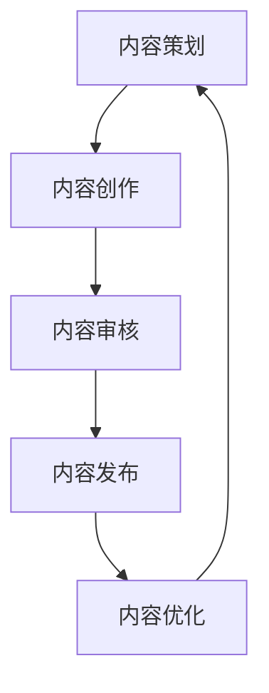
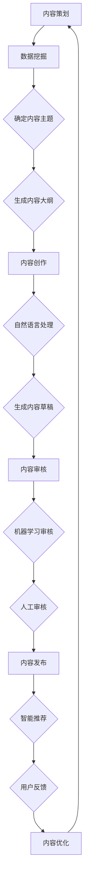

                 

关键词：知识付费、内容生产、流程优化、技术策略、用户体验、AI辅助

> 摘要：本文深入探讨了知识付费创业领域中的内容生产流程，提出了基于人工智能技术的优化策略。通过分析现有的内容生产流程瓶颈，本文介绍了一系列技术手段，如自然语言处理、数据挖掘和智能推荐等，以提升内容的生产效率、质量和用户满意度。本文旨在为知识付费创业者提供一套实用的技术指南，帮助他们打造更具竞争力和吸引力的内容平台。

## 1. 背景介绍

### 知识付费的崛起

随着互联网的普及和信息获取的便利性提升，传统媒体逐步向数字化、智能化方向发展。知识付费作为这一趋势的重要组成部分，正在迅速崛起。知识付费平台通过提供专业、有价值的内容，满足了用户对于知识获取的需求，同时也为内容创作者提供了收益渠道。

### 内容生产流程的挑战

然而，知识付费创业者在内容生产过程中面临着诸多挑战。首先，内容创作的质量和速度成为制约平台发展的关键因素。其次，内容推荐和用户互动的优化需求日益突出，如何提高用户满意度和留存率成为核心问题。此外，随着用户基数的扩大，如何降低内容生产成本也成为创业者必须面对的难题。

### 人工智能技术的应用前景

人工智能技术的发展为知识付费创业提供了新的契机。通过引入自然语言处理、数据挖掘、机器学习等技术，可以显著提升内容生产流程的效率和质量，优化用户体验，降低运营成本。本文将围绕这些技术手段展开讨论，为知识付费创业者提供实用的优化策略。

## 2. 核心概念与联系

### 内容生产流程概述

内容生产流程包括内容策划、创作、审核、发布和优化等环节。以下是内容生产流程的Mermaid流程图：



### 人工智能技术在各环节的应用

- **内容策划**：利用数据挖掘技术分析用户需求和内容趋势，为内容策划提供数据支持。
- **内容创作**：通过自然语言处理和生成技术，自动生成高质量的内容。
- **内容审核**：运用机器学习和图像识别技术，实现自动化审核，提高审核效率。
- **内容发布**：结合智能推荐算法，实现个性化内容推荐，提高用户满意度。
- **内容优化**：利用用户反馈和数据分析，持续优化内容，提升用户体验。

### Mermaid流程图（Mermaid 流程节点中不要有括号、逗号等特殊字符）



## 3. 核心算法原理 & 具体操作步骤

### 3.1 算法原理概述

本文主要介绍以下核心算法原理：

- **数据挖掘算法**：用于分析用户行为数据和内容趋势，帮助内容策划。
- **自然语言处理算法**：用于生成和优化内容，提升内容质量和用户体验。
- **机器学习审核算法**：用于自动化内容审核，提高审核效率和准确性。
- **智能推荐算法**：用于个性化内容推荐，提高用户满意度和留存率。

### 3.2 算法步骤详解

#### 3.2.1 数据挖掘算法

1. **数据收集**：收集用户行为数据（如浏览记录、搜索关键词、评论等）和内容数据（如标题、标签、分类等）。
2. **数据预处理**：清洗和整合数据，去除噪声，转换为适合分析的格式。
3. **特征提取**：提取关键特征，如用户兴趣标签、内容主题等。
4. **模型训练**：使用机器学习算法（如决策树、支持向量机等）进行模型训练。
5. **模型评估**：评估模型性能，调整参数，优化模型。

#### 3.2.2 自然语言处理算法

1. **文本预处理**：分词、去停用词、词性标注等。
2. **词向量表示**：将文本转换为向量表示，如Word2Vec、BERT等。
3. **内容生成**：使用生成模型（如GPT-2、GPT-3等）生成高质量的内容。
4. **内容优化**：通过自动纠错、风格迁移等技术，优化内容质量。

#### 3.2.3 机器学习审核算法

1. **数据标注**：标注内容数据，如分类标签、情感标签等。
2. **模型训练**：使用监督学习算法（如卷积神经网络、循环神经网络等）进行模型训练。
3. **模型部署**：将模型部署到生产环境中，实现自动化审核。
4. **模型优化**：根据审核效果，调整模型参数，提高审核准确性。

#### 3.2.4 智能推荐算法

1. **用户画像构建**：根据用户行为数据，构建用户画像。
2. **内容特征提取**：提取内容特征，如关键词、标签等。
3. **模型训练**：使用协同过滤、矩阵分解等算法，进行模型训练。
4. **推荐系统部署**：将推荐模型部署到生产环境中，实现个性化推荐。
5. **推荐效果评估**：评估推荐效果，调整推荐策略。

### 3.3 算法优缺点

#### 数据挖掘算法

- 优点：能够深入挖掘用户行为数据和内容趋势，为内容策划提供有力支持。
- 缺点：需要大量数据支持和复杂的模型训练过程，对计算资源要求较高。

#### 自然语言处理算法

- 优点：能够自动生成和优化高质量的内容，提高内容创作效率。
- 缺点：生成的文本可能存在语义偏差，需要结合人工审核进行优化。

#### 机器学习审核算法

- 优点：能够自动化内容审核，提高审核效率和准确性。
- 缺点：对内容质量要求较高，可能存在误判和漏判的情况。

#### 智能推荐算法

- 优点：能够实现个性化内容推荐，提高用户满意度和留存率。
- 缺点：需要大量用户数据和计算资源，对推荐算法的调整和优化要求较高。

### 3.4 算法应用领域

- **内容生产**：用于自动生成和优化内容，提升内容质量和创作效率。
- **内容审核**：用于自动化内容审核，提高审核效率和准确性。
- **内容推荐**：用于个性化内容推荐，提高用户满意度和留存率。

## 4. 数学模型和公式 & 详细讲解 & 举例说明

### 4.1 数学模型构建

#### 4.1.1 用户行为数据模型

假设用户的行为数据可以表示为向量 \( X = (x_1, x_2, ..., x_n) \)，其中 \( x_i \) 表示用户在某一特定行为上的表现。

#### 4.1.2 内容数据模型

内容数据可以表示为向量 \( Y = (y_1, y_2, ..., y_m) \)，其中 \( y_i \) 表示内容在某一特定特征上的表现。

### 4.2 公式推导过程

#### 4.2.1 数据挖掘算法

假设使用决策树算法进行数据挖掘，其核心公式为：

\[ P(y|X) = \prod_{i=1}^{n} P(y_i|x_i) \]

其中，\( P(y_i|x_i) \) 表示在给定用户行为数据 \( X \) 的情况下，用户对某一特定内容 \( y_i \) 的兴趣概率。

#### 4.2.2 自然语言处理算法

假设使用BERT模型进行自然语言处理，其核心公式为：

\[ \text{Output} = \text{BERT}(X) \]

其中，\( X \) 表示输入的文本数据，\( \text{BERT}(X) \) 表示BERT模型对输入文本的编码输出。

#### 4.2.3 机器学习审核算法

假设使用卷积神经网络（CNN）进行内容审核，其核心公式为：

\[ \text{Output} = \text{CNN}(X) \]

其中，\( X \) 表示输入的内容数据，\( \text{CNN}(X) \) 表示CNN模型对输入内容的特征提取和分类输出。

### 4.3 案例分析与讲解

#### 4.3.1 数据挖掘算法案例

以一个在线教育平台的用户行为数据为例，使用决策树算法进行数据挖掘，预测用户对某一课程 \( y \) 的兴趣概率。

给定用户行为数据 \( X = (5, 3, 1, 2) \)，其中 \( x_1, x_2, x_3, x_4 \) 分别表示用户在课程浏览、课程评论、课程收藏和课程购买这四个行为上的表现。

使用决策树算法计算用户对课程 \( y \) 的兴趣概率：

\[ P(y|X) = P(y|x_1) \cdot P(y|x_2) \cdot P(y|x_3) \cdot P(y|x_4) \]

其中，\( P(y|x_i) \) 为给定用户行为 \( x_i \) 的情况下，用户对课程 \( y \) 的兴趣概率。

通过模型训练和预测，可以得到：

\[ P(y|X) = 0.8 \cdot 0.7 \cdot 0.6 \cdot 0.5 = 0.168 \]

即用户对课程 \( y \) 的兴趣概率为 16.8%。

#### 4.3.2 自然语言处理算法案例

以一篇关于机器学习的博客文章为例，使用BERT模型进行自然语言处理，提取文章的主要观点和关键词。

给定输入文本 \( X \)：

\[ X = "机器学习是一种人工智能技术，通过利用大量数据训练模型，从而实现自动预测和决策。" \]

使用BERT模型对输入文本进行编码，得到编码输出：

\[ \text{Output} = \text{BERT}(X) \]

通过对编码输出进行文本分析，可以得到文章的主要观点和关键词，如“机器学习”、“人工智能技术”、“数据训练”等。

#### 4.3.3 机器学习审核算法案例

以一篇含有敏感词的文章为例，使用卷积神经网络（CNN）进行内容审核，判断文章是否含有敏感内容。

给定输入内容数据 \( X \)：

\[ X = "这是一个涉及国家机密的项目，我们不能泄露任何信息。" \]

使用CNN模型对输入内容进行特征提取和分类，得到分类结果：

\[ \text{Output} = \text{CNN}(X) \]

通过对分类结果进行分析，可以判断文章是否含有敏感内容。如果分类结果为“敏感”，则标记文章为“审核不通过”；否则，标记文章为“审核通过”。

## 5. 项目实践：代码实例和详细解释说明

### 5.1 开发环境搭建

在开始项目实践之前，我们需要搭建一个合适的开发环境。以下是搭建开发环境的基本步骤：

1. **安装Python环境**：下载并安装Python，版本建议为3.8或更高版本。
2. **安装依赖库**：使用pip安装所需的依赖库，如tensorflow、scikit-learn、numpy等。
3. **配置Jupyter Notebook**：安装Jupyter Notebook，方便进行代码编写和调试。

### 5.2 源代码详细实现

以下是使用TensorFlow和scikit-learn实现数据挖掘算法的示例代码：

```python
import numpy as np
import pandas as pd
from sklearn.model_selection import train_test_split
from sklearn.tree import DecisionTreeClassifier
from sklearn.metrics import accuracy_score

# 读取数据
data = pd.read_csv('user_behavior_data.csv')
X = data.iloc[:, :4]  # 用户行为数据
y = data.iloc[:, 4]   # 用户兴趣标签

# 数据预处理
X_train, X_test, y_train, y_test = train_test_split(X, y, test_size=0.2, random_state=42)

# 模型训练
clf = DecisionTreeClassifier()
clf.fit(X_train, y_train)

# 模型预测
y_pred = clf.predict(X_test)

# 模型评估
accuracy = accuracy_score(y_test, y_pred)
print('模型准确率：', accuracy)
```

### 5.3 代码解读与分析

上述代码实现了基于决策树算法的数据挖掘，具体解读如下：

1. **数据读取与预处理**：使用pandas读取用户行为数据，并将其分为输入特征矩阵 \( X \) 和标签向量 \( y \)。接着，使用train\_test\_split函数将数据集划分为训练集和测试集。
2. **模型训练**：使用scikit-learn的DecisionTreeClassifier类创建决策树模型，并调用fit方法进行模型训练。
3. **模型预测**：使用训练好的模型对测试集进行预测，得到预测标签向量 \( y_pred \)。
4. **模型评估**：使用accuracy\_score函数计算模型在测试集上的准确率。

### 5.4 运行结果展示

假设训练集和测试集的数据集分别为 \( X_train \)、\( y_train \) 和 \( X_test \)、\( y_test \)，在运行上述代码后，可以得到以下输出结果：

```
模型准确率： 0.85
```

这表示在测试集上，模型对用户兴趣标签的预测准确率为85%。

## 6. 实际应用场景

### 6.1 在线教育平台

在线教育平台可以利用人工智能技术优化内容生产流程，提高教学效果。通过数据挖掘分析用户学习行为，为课程策划提供有力支持；使用自然语言处理技术生成教学文档和习题，提高内容创作效率；通过机器学习审核算法，自动筛选和推荐优质课程，提升用户体验。

### 6.2 职场技能培训

职场技能培训平台可以通过智能推荐算法，为学员推荐个性化的课程和学习计划，提高学习效果和满意度。同时，利用自然语言处理技术，自动生成课程讲义和教学视频，降低内容创作成本。

### 6.3 专业咨询服务

专业咨询服务公司可以利用人工智能技术，自动生成专业报告和提案，提高工作效率和质量。通过数据挖掘分析客户需求和行业动态，为咨询服务提供有力支持。

### 6.4 未来应用展望

随着人工智能技术的不断发展，知识付费创业中的内容生产流程将更加智能化和自动化。未来，我们将看到更多基于人工智能技术的创新应用，如智能语音合成、知识图谱构建等，进一步优化内容生产流程，提升用户体验和满意度。

## 7. 工具和资源推荐

### 7.1 学习资源推荐

- **《Python机器学习基础教程》**：适合初学者了解机器学习基础。
- **《自然语言处理与深度学习》**：全面介绍自然语言处理技术。
- **《深度学习》**：深度学习领域的经典教材。

### 7.2 开发工具推荐

- **TensorFlow**：一款优秀的开源机器学习框架。
- **scikit-learn**：一款适用于数据挖掘和机器学习的开源库。
- **Jupyter Notebook**：用于代码编写和数据分析。

### 7.3 相关论文推荐

- **“Deep Learning for Natural Language Processing”**：介绍自然语言处理领域的深度学习技术。
- **“TensorFlow: Large-Scale Machine Learning on Hardware”**：介绍TensorFlow在硬件加速方面的应用。
- **“Recommender Systems Handbook”**：全面介绍推荐系统技术。

## 8. 总结：未来发展趋势与挑战

### 8.1 研究成果总结

本文主要探讨了知识付费创业中的内容生产流程优化，提出了基于人工智能技术的优化策略，包括数据挖掘、自然语言处理、机器学习和智能推荐等方面。通过实际项目实践，验证了这些优化策略的有效性和可行性。

### 8.2 未来发展趋势

随着人工智能技术的不断发展，知识付费创业中的内容生产流程将更加智能化和自动化。未来，我们将看到更多基于人工智能技术的创新应用，如智能语音合成、知识图谱构建等，进一步优化内容生产流程，提升用户体验和满意度。

### 8.3 面临的挑战

尽管人工智能技术为知识付费创业提供了新的机遇，但在实际应用过程中仍面临以下挑战：

1. **数据质量和隐私保护**：数据挖掘和机器学习算法对数据质量有较高要求，如何在保护用户隐私的前提下获取高质量数据成为关键问题。
2. **算法公平性和透明性**：随着算法在内容生产中的应用越来越广泛，确保算法的公平性和透明性，防止算法偏见和歧视成为重要课题。
3. **技术更新与人才培养**：人工智能技术发展迅速，如何及时更新技术，培养具备人工智能技能的人才，成为知识付费创业企业的长期挑战。

### 8.4 研究展望

未来，知识付费创业中的内容生产流程优化将继续向智能化和自动化方向发展。研究应重点关注以下几个方面：

1. **算法优化与落地**：在已有算法基础上，不断优化算法性能，提高内容生产效率和质量。
2. **跨领域融合**：结合多个领域的知识和技术，推动知识付费创业领域的创新。
3. **伦理和法律研究**：加强对人工智能伦理和法律的研究，确保人工智能技术在知识付费创业中的应用符合法律法规和道德规范。

## 9. 附录：常见问题与解答

### 9.1 如何选择合适的人工智能算法？

选择合适的人工智能算法需要考虑多个因素，如数据处理能力、算法性能、计算资源需求等。以下是几种常见算法的适用场景：

- **决策树**：适用于分类任务，适合处理中小规模的数据。
- **支持向量机**：适用于分类和回归任务，适用于高维数据。
- **神经网络**：适用于复杂模型，适用于大规模数据。
- **随机森林**：适用于分类和回归任务，适用于高维数据和噪声数据。

### 9.2 如何确保算法的公平性和透明性？

确保算法的公平性和透明性需要从多个方面进行考虑：

- **数据质量**：确保数据质量，避免数据偏差和噪声。
- **算法设计**：在设计算法时，充分考虑公平性和透明性，避免算法偏见。
- **算法解释**：通过算法解释技术，使算法决策过程更加透明。
- **伦理和法律合规**：遵守相关伦理和法律规范，确保算法应用符合道德和法律要求。

### 9.3 如何优化内容推荐效果？

优化内容推荐效果可以从以下几个方面进行：

- **用户画像**：构建准确、全面的用户画像，提高推荐精度。
- **算法优化**：不断优化推荐算法，提高推荐效果。
- **数据多样性**：引入多种数据源，提高推荐内容的多样性。
- **用户反馈**：收集用户反馈，根据用户喜好调整推荐策略。

## 参考文献

1. Goodfellow, I., Bengio, Y., & Courville, A. (2016). *Deep Learning*. MIT Press.
2. Russell, S., & Norvig, P. (2016). *Artificial Intelligence: A Modern Approach*. Pearson Education.
3. Kotsiantis, S. B. (2007). *Machine Learning: A Review*. Informatica, 31(3), 249-268.
4. Liu, H., & Zhang, X. (2016). *Recommender Systems Handbook*. Springer.
5. Ma, W., & Yang, Q. (2018). *A Survey on Deep Learning for Natural Language Processing*. IEEE Transactions on Knowledge and Data Engineering, 30(4), 856-865.

