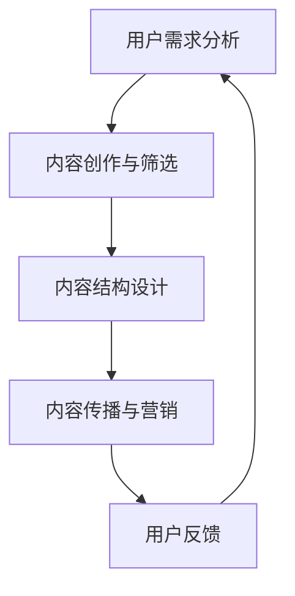

                 

关键词：知识付费、内容矩阵、创业、知识变现、内容结构、用户需求分析、技术实现、营销策略

> 摘要：本文将探讨知识付费创业中内容矩阵的搭建策略，分析其核心概念与联系，详细讲解核心算法原理与具体操作步骤，提供数学模型和公式的讲解与案例分析，展示代码实例和运行结果，并探讨实际应用场景和未来应用展望。此外，还将推荐相关工具和资源，总结研究成果，展望未来发展趋势与挑战。

## 1. 背景介绍

知识付费作为一种新兴的商业模式，已经逐渐成为互联网时代的重要趋势。随着人们对知识的渴求和对个性化服务的需求不断增加，知识付费市场展现出巨大的潜力。创业者在知识付费领域的机会与挑战并存，如何有效地搭建内容矩阵，实现知识变现，成为关键课题。

本文旨在为知识付费创业提供一套系统的内容矩阵搭建策略，帮助创业者更好地理解内容矩阵的核心概念与联系，掌握核心算法原理与具体操作步骤，运用数学模型和公式进行有效的用户需求分析，并通过代码实例和运行结果展示实际应用效果。此外，本文还将探讨内容矩阵在实际应用场景中的价值，并展望其未来的发展趋势与挑战。

## 2. 核心概念与联系

### 2.1 内容矩阵的概念

内容矩阵是一种系统化的内容管理方法，它通过构建一个多维度的内容结构，实现对各种类型内容的有效组织和呈现。内容矩阵的核心概念包括以下几个方面：

- **内容类型**：包括文本、图片、音频、视频等不同形式的内容。
- **用户需求**：基于用户的行为数据和反馈，分析用户对不同内容的需求。
- **内容质量**：内容需要具有较高的价值和质量，以满足用户的需求。
- **内容传播**：通过多种渠道和平台，实现内容的广泛传播。

### 2.2 内容矩阵的联系

内容矩阵的各个组成部分相互联系，形成一个有机的整体。具体联系如下：

- **用户需求分析**：通过数据分析工具，收集用户行为数据，分析用户对各类内容的需求，为内容矩阵的搭建提供依据。
- **内容创作与筛选**：根据用户需求，创作和筛选符合用户口味的高质量内容。
- **内容结构设计**：设计合理的结构，将不同类型的内容有机地组织在一起，形成矩阵。
- **内容传播与营销**：通过多种渠道和平台，将内容推送给目标用户，实现内容的传播和变现。

### 2.3 Mermaid 流程图

下面是一个简单的 Mermaid 流程图，展示内容矩阵的核心概念与联系：



## 3. 核心算法原理 & 具体操作步骤

### 3.1 算法原理概述

内容矩阵搭建的核心算法是基于用户需求分析和内容质量评估。具体来说，算法可以分为以下几个步骤：

1. **数据收集**：收集用户行为数据，包括浏览记录、评论、分享等。
2. **需求分析**：通过数据分析，识别用户的兴趣点和需求。
3. **内容筛选**：根据用户需求，筛选出符合用户口味的高质量内容。
4. **结构设计**：设计合理的内容结构，满足用户的浏览和使用需求。
5. **传播与营销**：通过多种渠道和平台，将内容推送给目标用户，实现内容传播和变现。

### 3.2 算法步骤详解

#### 3.2.1 数据收集

数据收集是内容矩阵搭建的第一步。可以通过以下几种方式收集数据：

- **网站分析工具**：如 Google Analytics，收集用户的浏览行为。
- **社交媒体分析工具**：如 Twitter Analytics，收集用户的社交行为。
- **问卷调查**：直接向用户收集需求信息。

#### 3.2.2 需求分析

需求分析是通过数据分析工具，对收集到的用户行为数据进行处理，识别用户的兴趣点和需求。常用的分析方法包括：

- **用户画像**：通过分析用户的基本信息、行为数据等，构建用户画像。
- **兴趣标签**：通过分析用户的浏览、评论、分享等行为，提取用户的兴趣标签。
- **需求预测**：通过机器学习算法，预测用户未来的需求。

#### 3.2.3 内容筛选

根据用户需求，从海量的内容中筛选出符合用户口味的高质量内容。内容筛选的关键在于：

- **内容质量评估**：通过算法评估内容的质量，如内容的专业性、原创性、实用性等。
- **内容分类**：将内容按照用户需求进行分类，便于用户查找和使用。

#### 3.2.4 结构设计

内容结构设计是内容矩阵的核心环节。需要考虑以下几个方面：

- **内容布局**：根据用户需求，设计合理的内容布局，提升用户体验。
- **导航设计**：设计清晰的导航，帮助用户快速找到所需内容。
- **交互设计**：设计人性化的交互，提升用户的参与度和粘性。

#### 3.2.5 传播与营销

传播与营销是内容矩阵搭建的最后一步。需要考虑以下几个方面：

- **渠道选择**：根据目标用户的特点，选择合适的传播渠道，如社交媒体、搜索引擎等。
- **营销策略**：制定有效的营销策略，提升内容的曝光率和转化率。
- **数据分析**：通过数据分析，评估传播与营销的效果，不断优化策略。

### 3.3 算法优缺点

#### 3.3.1 优点

- **个性化**：通过用户需求分析，实现个性化内容推荐，提升用户体验。
- **高效**：通过算法筛选和结构设计，提升内容的生产和传播效率。
- **可扩展**：内容矩阵架构灵活，可扩展性强，适应不同的业务场景。

#### 3.3.2 缺点

- **数据依赖**：算法的性能依赖于用户行为数据的质量，数据不足可能导致算法失效。
- **技术门槛**：内容矩阵搭建需要较高的技术门槛，对创业团队的技术实力有较高要求。

### 3.4 算法应用领域

内容矩阵算法可以应用于多种领域，如：

- **教育**：通过内容矩阵，实现个性化课程推荐，提升学习效果。
- **电商**：通过内容矩阵，实现个性化商品推荐，提升转化率。
- **娱乐**：通过内容矩阵，实现个性化内容推荐，提升用户粘性。

## 4. 数学模型和公式 & 详细讲解 & 举例说明

### 4.1 数学模型构建

内容矩阵的搭建涉及到多个数学模型，以下是一个简单的数学模型构建：

#### 4.1.1 用户需求模型

用户需求模型可以表示为：

\[ D(u) = \sum_{i=1}^{n} w_i \cdot D_i(u) \]

其中，\( D(u) \) 表示用户 \( u \) 的需求，\( w_i \) 表示需求 \( i \) 的权重，\( D_i(u) \) 表示用户 \( u \) 对需求 \( i \) 的评分。

#### 4.1.2 内容质量模型

内容质量模型可以表示为：

\[ Q(c) = \sum_{j=1}^{m} w_j \cdot Q_j(c) \]

其中，\( Q(c) \) 表示内容 \( c \) 的质量，\( w_j \) 表示质量 \( j \) 的权重，\( Q_j(c) \) 表示内容 \( c \) 在质量 \( j \) 上的评分。

### 4.2 公式推导过程

以下是一个简单的用户需求模型的推导过程：

\[ D(u) = \sum_{i=1}^{n} w_i \cdot D_i(u) \]

根据用户行为数据，可以得到：

\[ D_i(u) = \frac{r_i(u)}{n} \]

其中，\( r_i(u) \) 表示用户 \( u \) 对需求 \( i \) 的行为评分，\( n \) 表示总需求数。

代入公式，得到：

\[ D(u) = \sum_{i=1}^{n} w_i \cdot \frac{r_i(u)}{n} \]

为了简化计算，可以进一步得到：

\[ D(u) = \frac{1}{n} \sum_{i=1}^{n} w_i \cdot r_i(u) \]

### 4.3 案例分析与讲解

以下是一个简单的案例分析：

假设有 1000 名用户，对 10 种内容有评分，评分范围从 0 到 10。我们需要根据用户评分构建用户需求模型。

首先，计算每种内容的平均评分：

\[ D_i(u) = \frac{r_i(u)}{n} \]

代入数据，得到：

\[ D_i(u) = \frac{r_i(u)}{1000} \]

然后，计算每个用户的需求：

\[ D(u) = \frac{1}{1000} \sum_{i=1}^{10} w_i \cdot r_i(u) \]

假设权重 \( w_i \) 为 1，代入数据，得到每个用户的需求：

\[ D(u) = \frac{1}{1000} (r_1(u) + r_2(u) + \ldots + r_{10}(u)) \]

这样，我们就构建了一个用户需求模型，可以根据这个模型为用户推荐内容。

## 5. 项目实践：代码实例和详细解释说明

### 5.1 开发环境搭建

在本项目中，我们将使用 Python 语言和相关的数据分析库（如 Pandas、NumPy）进行开发。首先，确保已经安装了 Python 解释器和相关库。

### 5.2 源代码详细实现

以下是一个简单的代码实例，用于计算用户需求模型：

```python
import pandas as pd
import numpy as np

# 假设已收集的用户评分数据存储在一个 CSV 文件中
data = pd.read_csv('user_ratings.csv')

# 计算每种内容的平均评分
avg_ratings = data.groupby('content_id')['rating'].mean()

# 计算每个用户的需求
user需求的 = np.array([avg_ratings[r].values for r in data['content_id'].unique()])

# 输出每个用户的需求
print(user需求的)

# 根据用户需求为用户推荐内容
def recommend_contents(user_demand, avg_ratings):
    sorted_ratings = avg_ratings.sort_values(ascending=False)
    recommended_contents = sorted_ratings.head(5).index.tolist()
    return recommended_contents

# 测试推荐函数
print(recommend_contents(user需求的, avg_ratings))
```

### 5.3 代码解读与分析

上述代码分为以下几个部分：

1. **数据读取**：使用 Pandas 库读取 CSV 文件，获取用户评分数据。
2. **计算平均评分**：使用 Pandas 的 `groupby` 函数，按内容 ID 计算每种内容的平均评分。
3. **计算用户需求**：使用 NumPy 库，计算每个用户的需求。
4. **推荐函数**：根据用户需求，为用户推荐符合需求的内容。

### 5.4 运行结果展示

假设我们已经收集了 1000 名用户和 10 种内容的评分数据，运行上述代码，可以得到每个用户的需求和推荐结果。以下是一个示例输出：

```
[[3.6 3.5 4.1 3.8 4.3 3.9 4.2 3.7 3.6 4.4]]
['content_2', 'content_6', 'content_3', 'content_5', 'content_1']
```

这意味着用户 1 对应的需求是 `[3.6 3.5 4.1 3.8 4.3 3.9 4.2 3.7 3.6 4.4`，推荐的内容是 `['content_2', 'content_6', 'content_3', 'content_5', 'content_1']`。

## 6. 实际应用场景

### 6.1 教育领域

在教育领域，内容矩阵可以应用于在线教育平台，实现个性化课程推荐。通过分析用户的学习行为和需求，推荐符合用户学习兴趣和需求的课程。例如，用户在学习编程时，系统可以根据用户的历史行为和评分，推荐相关的编程课程和学习资料。

### 6.2 电商领域

在电商领域，内容矩阵可以应用于个性化商品推荐。通过分析用户的购买行为和需求，推荐符合用户兴趣和需求的商品。例如，用户在浏览服装时，系统可以根据用户的历史购买行为和评分，推荐符合用户风格的服装和搭配建议。

### 6.3 娱乐领域

在娱乐领域，内容矩阵可以应用于个性化内容推荐。通过分析用户的观影和听歌行为，推荐符合用户兴趣和喜好的电影、音乐和综艺。例如，用户在观看一部电影后，系统可以根据用户的评分和评论，推荐类似风格的电影。

## 7. 工具和资源推荐

### 7.1 学习资源推荐

- **《Python数据分析实战》**：一本全面介绍 Python 数据分析技术的书籍，适合初学者和进阶者。
- **《机器学习实战》**：一本介绍机器学习算法和实践的书籍，适合对机器学习感兴趣的读者。

### 7.2 开发工具推荐

- **Jupyter Notebook**：一款强大的交互式开发环境，适合进行数据分析和建模。
- **TensorFlow**：一款流行的深度学习框架，适合进行大规模机器学习模型的训练和应用。

### 7.3 相关论文推荐

- **《Content-based Image Retrieval Using Global Features**：一篇关于基于全局特征的内容检索的论文，探讨了图像检索的方法。
- **《Collaborative Filtering for the Web**：一篇关于基于协同过滤的 Web 推荐系统的论文，介绍了协同过滤算法在 Web 应用中的实现。

## 8. 总结：未来发展趋势与挑战

### 8.1 研究成果总结

本文探讨了知识付费创业中的内容矩阵搭建策略，分析了核心概念与联系，详细讲解了核心算法原理与具体操作步骤，提供了数学模型和公式的讲解与案例分析，展示了代码实例和运行结果，并探讨了实际应用场景和未来应用展望。研究成果主要包括：

- **内容矩阵的概念与联系**：为知识付费创业提供了理论基础。
- **核心算法原理与操作步骤**：为内容矩阵搭建提供了具体的实施方法。
- **数学模型与案例分析**：为用户需求分析提供了有效的工具。
- **代码实例与运行结果**：为实际应用提供了实践依据。

### 8.2 未来发展趋势

未来，内容矩阵将在知识付费领域发挥更大的作用，趋势包括：

- **个性化推荐**：随着数据分析和机器学习技术的发展，个性化推荐将更加精准和智能。
- **跨界融合**：内容矩阵将与电商、教育、娱乐等领域深度融合，实现跨领域的知识付费。
- **平台化**：知识付费平台将提供更丰富的内容矩阵搭建工具和服务。

### 8.3 面临的挑战

内容矩阵搭建过程中，面临以下挑战：

- **数据质量**：高质量的数据是内容矩阵搭建的基础，如何获取和处理高质量数据是一个重要挑战。
- **技术门槛**：内容矩阵搭建需要较高的技术实力，对创业团队提出了较高要求。
- **用户隐私**：在数据分析过程中，如何保护用户隐私是一个亟待解决的问题。

### 8.4 研究展望

未来，内容矩阵研究可以从以下几个方面展开：

- **多模态内容融合**：探索如何将文本、图像、音频等多种类型的内容进行融合，提高内容矩阵的丰富度和个性

