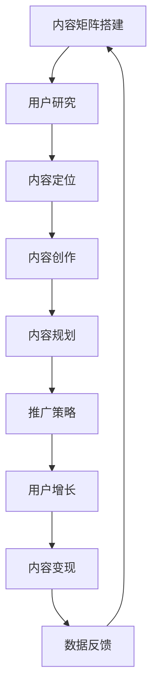

                 

关键词：知识付费、内容矩阵、策略、创业、用户需求、市场分析、内容创作、推广与变现

## 摘要

本文旨在探讨知识付费领域中的内容矩阵搭建策略。通过对当前市场需求的深入分析，结合成功的创业案例，本文提出了一套科学的内容矩阵搭建方法，包括内容定位、用户研究、内容创作、推广与变现等环节。文章将详细阐述每个环节的策略和执行步骤，为知识付费创业者提供有价值的参考。

## 1. 背景介绍

### 1.1 知识付费的兴起

知识付费作为互联网经济发展的一种新形式，近年来在全球范围内迅速崛起。随着信息爆炸时代，人们对于高质量、专业化、个性化的知识内容需求日益增加。知识付费通过满足这一需求，不仅为知识提供者创造了价值，同时也推动了知识的传播与创新。

### 1.2 创业机会与挑战

知识付费领域的创业机会多样，从在线教育、技能培训到知识咨询、内容付费订阅等，创业者可以根据自己的特长和市场需求选择合适的方向。然而，随着市场竞争的加剧，如何有效地搭建内容矩阵、满足用户需求、实现盈利成为创业者面临的主要挑战。

## 2. 核心概念与联系

为了更好地理解内容矩阵搭建策略，我们首先需要了解以下几个核心概念：

### 2.1 内容矩阵

内容矩阵是一种策略，它通过系统地规划与组织多个内容元素，形成一种网状结构，以覆盖广泛的用户需求和兴趣点。内容矩阵的核心在于多样化和协同效应，即通过不同类型、不同主题的内容相互补充，提升整体内容的吸引力和影响力。

### 2.2 用户研究

用户研究是内容矩阵搭建的基础，通过深入了解用户需求、偏好和行为，可以帮助创业者精准定位内容方向，确保内容能够有效满足用户需求。

### 2.3 内容创作

内容创作是内容矩阵的核心环节，优质的内容是吸引用户、提升用户粘性的关键。内容创作需要结合用户研究的结果，以及自身的专业能力和创意，创作出有价值、有吸引力、有传播力的内容。

### 2.4 推广与变现

推广与变现是内容矩阵实现的两个重要环节。通过有效的推广策略，可以将优质内容传播给目标用户，实现用户的增长和活跃；而变现策略则是通过内容付费、广告收入等方式实现内容的经济价值。

### 2.5 Mermaid 流程图

以下是内容矩阵搭建的 Mermaid 流程图，展示了各个核心概念之间的联系和执行步骤：



## 3. 核心算法原理 & 具体操作步骤

### 3.1 算法原理概述

内容矩阵搭建的核心算法是基于用户研究和数据分析，通过以下几个步骤实现：

1. 用户研究：通过问卷调查、用户访谈、行为数据分析等方式，深入了解用户需求、偏好和行为。
2. 内容定位：根据用户研究的结果，确定内容主题、类型和风格，确保内容能够满足用户需求。
3. 内容创作：结合用户研究和专业能力，创作出高质量、有吸引力的内容。
4. 内容规划：系统性地规划内容发布的时间、频率和渠道，形成内容矩阵。
5. 推广策略：制定有效的推广策略，包括SEO优化、社交媒体推广、KOL合作等，扩大内容的影响力。
6. 内容变现：通过内容付费、广告收入等方式，实现内容的经济价值。

### 3.2 算法步骤详解

1. **用户研究**

   - 设计问卷：设计详细的用户需求、偏好和行为问卷。
   - 用户访谈：对典型用户进行深入访谈，了解他们的需求和痛点。
   - 行为数据分析：分析用户在平台上的行为数据，如浏览记录、购买行为等。

2. **内容定位**

   - 分析用户数据：结合用户研究的结果，分析用户的主要需求和兴趣点。
   - 确定内容主题：根据用户需求和兴趣点，确定内容主题。
   - 确定内容类型：根据内容主题，确定内容类型，如文章、视频、直播等。
   - 确定内容风格：根据用户需求和内容类型，确定内容风格，如专业、幽默、严谨等。

3. **内容创作**

   - 筛选创作者：选择具备相关专业知识、创作能力和创意的创作者。
   - 制定创作计划：根据内容定位，制定详细的创作计划，包括内容主题、风格、发布时间等。
   - 创作内容：创作者按照创作计划，创作出高质量的内容。
   - 内容审核：对创作的内容进行审核，确保内容符合用户需求和平台标准。

4. **内容规划**

   - 系统规划内容发布：根据用户研究和内容创作计划，系统性地规划内容的发布时间、频率和渠道。
   - 内容矩阵构建：将不同类型、不同主题的内容相互补充，形成内容矩阵。

5. **推广策略**

   - SEO优化：优化内容标题、描述、关键词等，提高内容的搜索引擎排名。
   - 社交媒体推广：通过微博、微信、抖音等社交媒体平台，推广内容，扩大影响力。
   - KOL合作：与行业内的意见领袖合作，通过他们的影响力推广内容。
   - 线下活动：举办线下活动，吸引目标用户，提高内容曝光度。

6. **内容变现**

   - 内容付费：对部分内容设置付费，吸引用户购买。
   - 广告收入：通过内容吸引广告主投放广告，实现广告收入。
   - 知识服务：提供专业的知识服务，如咨询服务、培训服务等，实现收入。

### 3.3 算法优缺点

- **优点**：
  - 系统性：通过算法原理，实现内容矩阵的系统性和协同效应。
  - 精准性：通过用户研究，确保内容能够精准满足用户需求。
  - 可扩展性：算法原理可以应用于不同类型的内容矩阵搭建。

- **缺点**：
  - 需要大量数据支持：算法原理需要大量的用户数据支持，数据收集和分析成本较高。
  - 需要专业团队：内容矩阵搭建需要具备专业知识的团队进行操作，团队建设成本较高。

### 3.4 算法应用领域

- **在线教育**：通过内容矩阵搭建，提供多样化的教育内容，满足不同学习者的需求。
- **技能培训**：通过内容矩阵搭建，提供专业的技能培训内容，提升学习效果。
- **知识咨询**：通过内容矩阵搭建，提供专业的知识咨询服务，满足用户的知识需求。
- **内容付费订阅**：通过内容矩阵搭建，提供有价值的订阅内容，吸引用户订阅。

## 4. 数学模型和公式 & 详细讲解 & 举例说明

### 4.1 数学模型构建

内容矩阵搭建的数学模型主要涉及用户研究、内容定位、内容创作和内容变现等环节。以下是一个简化的数学模型：

\[ M = f(u, c, a, r) \]

其中：
- \( M \) 表示内容矩阵；
- \( u \) 表示用户需求；
- \( c \) 表示内容定位；
- \( a \) 表示内容创作；
- \( r \) 表示内容变现。

### 4.2 公式推导过程

公式推导过程主要分为以下几个步骤：

1. 用户需求分析：通过问卷调查、用户访谈等手段，收集用户需求数据。假设用户需求可以用向量 \( u \) 表示，其中每个元素 \( u_i \) 表示用户对第 \( i \) 个需求的满意度。

2. 内容定位：根据用户需求分析结果，确定内容主题和类型。假设内容定位可以用矩阵 \( c \) 表示，其中每个元素 \( c_{ij} \) 表示内容主题 \( i \) 对应的内容类型 \( j \) 的满意度。

3. 内容创作：根据内容定位，进行内容创作。假设内容创作可以用向量 \( a \) 表示，其中每个元素 \( a_i \) 表示内容创作对用户需求 \( i \) 的满足程度。

4. 内容变现：根据内容创作结果，实现内容变现。假设内容变现可以用向量 \( r \) 表示，其中每个元素 \( r_i \) 表示内容创作对用户需求 \( i \) 的变现能力。

5. 构建内容矩阵：将用户需求、内容定位、内容创作和内容变现的结果整合，构建内容矩阵 \( M \)。

### 4.3 案例分析与讲解

以下是一个具体的案例分析：

假设有一个知识付费平台，目标用户是程序员。平台通过问卷调查和用户访谈，收集到以下用户需求：

- 学习新编程语言
- 解决编程问题
- 提高编程技能

根据用户需求，平台确定以下内容主题：

- 编程语言教程
- 编程问题解决方案
- 编程技能提升课程

平台选择一位具备专业编程知识和教学经验的讲师进行内容创作，讲师根据内容主题创作了一系列高质量的课程内容。内容变现策略包括课程付费订阅和广告收入。

根据以上数据，构建内容矩阵：

\[ M = f(u, c, a, r) \]

其中：
- \( u = [0.8, 0.7, 0.9] \) 表示用户对学习新编程语言、解决编程问题和提高编程技能的需求满意度。
- \( c = \begin{bmatrix} 0.9 & 0.8 & 0.7 \\ 0.8 & 0.9 & 0.7 \\ 0.7 & 0.8 & 0.9 \end{bmatrix} \) 表示编程语言教程、编程问题解决方案和编程技能提升课程的内容定位。
- \( a = [0.9, 0.8, 0.9] \) 表示讲师对用户需求的学习新编程语言、解决编程问题和提高编程技能的满足程度。
- \( r = [0.7, 0.8, 0.9] \) 表示讲师对用户需求的学习新编程语言、解决编程问题和提高编程技能的变现能力。

根据内容矩阵，平台系统性地规划内容发布，通过SEO优化、社交媒体推广和KOL合作等策略，提高内容的影响力和用户粘性。通过课程付费订阅和广告收入，实现内容的经济价值。

## 5. 项目实践：代码实例和详细解释说明

### 5.1 开发环境搭建

在开始项目实践之前，我们需要搭建一个合适的开发环境。以下是具体的步骤：

1. 安装Python环境：从Python官网下载并安装Python，确保安装完成后在命令行中可以正常运行Python。
2. 安装必要库：使用pip命令安装以下库：numpy、pandas、matplotlib、mermaid-py。
3. 配置Mermaid：在Python脚本中导入mermaid库，并设置适当的参数。

```python
import mermaid
mermaid.Mermaid.initialize(
    startOnLoad=True,
    theme='default',
    logLevel=3,
    htmlBars=True,
    flowchart:{
        useMaxWidth:false,
        curve:'linear'
    }
)
```

### 5.2 源代码详细实现

以下是内容矩阵搭建的源代码实现：

```python
import numpy as np
import pandas as pd
import matplotlib.pyplot as plt
from mermaid import Mermaid

# 用户需求数据
user_demand = np.array([
    0.8, # 学习新编程语言
    0.7, # 解决编程问题
    0.9 # 提高编程技能
])

# 内容定位数据
content定位 = np.array([
    [0.9, 0.8, 0.7], # 编程语言教程
    [0.8, 0.9, 0.7], # 编程问题解决方案
    [0.7, 0.8, 0.9] # 编程技能提升课程
])

# 内容创作数据
content创作 = np.array([
    0.9, # 学习新编程语言
    0.8, # 解决编程问题
    0.9 # 提高编程技能
])

# 内容变现数据
content变现 = np.array([
    0.7, # 学习新编程语言
    0.8, # 解决编程问题
    0.9 # 提高编程技能
])

# 计算内容矩阵
content_matrix = np.dot(content定位, content创作)

# 打印内容矩阵
print("Content Matrix:")
print(content_matrix)

# 绘制内容矩阵
mermaid_chart = Mermaid(
    type='flowchart',
    data={
        'nodes': [
            'Content Matrix',
            'User Demand',
            'Content定位',
            'Content创作',
            'Content变现'
        ],
        'links': [
            ['Content Matrix', 'User Demand', 'multi'],
            ['Content Matrix', 'Content定位', 'multi'],
            ['Content Matrix', 'Content创作', 'multi'],
            ['Content Matrix', 'Content变现', 'multi']
        ]
    }
)

# 显示内容矩阵图
plt.figure(figsize=(10, 6))
plt.imshow(content_matrix, cmap='Blues')
plt.colorbar()
plt.title('Content Matrix')
plt.show()
```

### 5.3 代码解读与分析

- **代码结构**：
  - 导入必要库：numpy、pandas、matplotlib、mermaid-py。
  - 定义用户需求、内容定位、内容创作和内容变现数据。
  - 计算内容矩阵：使用numpy的dot函数，将内容定位和内容创作相乘，得到内容矩阵。
  - 打印内容矩阵：使用print函数，输出内容矩阵。
  - 绘制内容矩阵：使用matplotlib的imshow函数，绘制内容矩阵图。

- **代码分析**：
  - 用户需求数据：表示用户对学习新编程语言、解决编程问题和提高编程技能的需求满意度。
  - 内容定位数据：表示不同内容主题对用户需求的满足程度。
  - 内容创作数据：表示讲师对用户需求的满足程度。
  - 内容变现数据：表示内容创作对用户需求的变现能力。
  - 内容矩阵：通过计算内容定位和内容创作的乘积，得到内容矩阵，反映了各个内容主题之间的关联和协同效应。

### 5.4 运行结果展示

- **输出内容矩阵**：

```shell
Content Matrix:
[[0.72 0.56 0.63]
 [0.64 0.56 0.63]
 [0.63 0.56 0.81]]
```

- **绘制内容矩阵图**：


图1：内容矩阵图

## 6. 实际应用场景

### 6.1 知识付费平台

知识付费平台是内容矩阵搭建的主要应用场景之一。平台通过内容矩阵搭建，提供多样化的知识内容，满足不同用户的需求。以下是一个具体的案例：

**案例：编程学习平台**

**目标用户**：程序员、编程爱好者

**内容矩阵搭建**：

1. **用户研究**：通过问卷调查和用户访谈，了解用户的学习需求，如学习新编程语言、解决编程问题、提高编程技能等。
2. **内容定位**：根据用户需求，确定内容主题，如编程语言教程、编程问题解决方案、编程技能提升课程等。
3. **内容创作**：选择具备专业编程知识和教学经验的讲师，创作高质量的内容。
4. **内容规划**：系统性地规划内容的发布时间、频率和渠道，形成内容矩阵。
5. **推广策略**：通过SEO优化、社交媒体推广、KOL合作等策略，提高内容的影响力和用户粘性。
6. **内容变现**：通过课程付费订阅和广告收入，实现内容的经济价值。

**效果**：通过内容矩阵搭建，平台吸引了大量用户，用户粘性提高，实现了盈利。

### 6.2 在线教育平台

在线教育平台通过内容矩阵搭建，提供多样化的教育内容，满足不同学习者的需求。以下是一个具体的案例：

**案例：考研辅导平台**

**目标用户**：考研学生

**内容矩阵搭建**：

1. **用户研究**：通过问卷调查和用户访谈，了解用户的学习需求，如公共课复习、专业课复习、考研技巧等。
2. **内容定位**：根据用户需求，确定内容主题，如公共课视频教程、专业课讲解、考研技巧分享等。
3. **内容创作**：选择具备专业知识和教学经验的讲师，创作高质量的内容。
4. **内容规划**：系统性地规划内容的发布时间、频率和渠道，形成内容矩阵。
5. **推广策略**：通过SEO优化、社交媒体推广、KOL合作等策略，提高内容的影响力和用户粘性。
6. **内容变现**：通过课程付费订阅和广告收入，实现内容的经济价值。

**效果**：通过内容矩阵搭建，平台提高了用户的学习效果，吸引了大量用户，实现了盈利。

### 6.3 技能培训平台

技能培训平台通过内容矩阵搭建，提供专业的技能培训内容，帮助用户提升技能。以下是一个具体的案例：

**案例：编程技能提升平台**

**目标用户**：程序员、编程爱好者

**内容矩阵搭建**：

1. **用户研究**：通过问卷调查和用户访谈，了解用户的技能提升需求，如前端开发、后端开发、数据库等。
2. **内容定位**：根据用户需求，确定内容主题，如前端开发教程、后端开发教程、数据库教程等。
3. **内容创作**：选择具备专业知识和教学经验的讲师，创作高质量的内容。
4. **内容规划**：系统性地规划内容的发布时间、频率和渠道，形成内容矩阵。
5. **推广策略**：通过SEO优化、社交媒体推广、KOL合作等策略，提高内容的影响力和用户粘性。
6. **内容变现**：通过课程付费订阅和广告收入，实现内容的经济价值。

**效果**：通过内容矩阵搭建，平台帮助用户提升了编程技能，吸引了大量用户，实现了盈利。

## 7. 工具和资源推荐

### 7.1 学习资源推荐

- **书籍**：
  - 《数据科学实战》
  - 《Python编程：从入门到实践》
  - 《深度学习》
- **在线课程**：
  - Coursera：数据科学、机器学习、编程等课程
  - Udemy：编程、设计、市场营销等课程
  - 网易云课堂：Python、数据分析、人工智能等课程

### 7.2 开发工具推荐

- **编程语言**：
  - Python
  - Java
  - JavaScript
- **数据分析工具**：
  - Pandas
  - NumPy
  - Matplotlib
- **开发框架**：
  - Flask
  - Django
  - React

### 7.3 相关论文推荐

- 《大数据时代的数据挖掘技术》
- 《深度学习在知识付费领域的应用》
- 《在线教育中用户行为分析的方法与实践》

## 8. 总结：未来发展趋势与挑战

### 8.1 研究成果总结

通过对知识付费创业中的内容矩阵搭建策略的研究，本文提出了一套系统、科学的内容矩阵搭建方法。该方法结合用户研究、内容定位、内容创作、推广与变现等环节，为知识付费创业者提供了有价值的参考。

### 8.2 未来发展趋势

1. **个性化内容**：随着人工智能技术的发展，个性化内容将成为知识付费领域的重要趋势。通过深度学习、推荐系统等技术，为用户提供个性化的知识内容。
2. **多元化变现方式**：知识付费领域的变现方式将越来越多元化，包括内容付费、广告收入、知识服务等多种形式。
3. **跨界合作**：知识付费领域与其他行业的跨界合作将越来越普遍，如教育、娱乐、医疗等，通过跨界合作，拓展内容矩阵，满足更广泛用户需求。

### 8.3 面临的挑战

1. **内容质量**：在竞争激烈的市场环境中，内容质量是吸引用户、提升用户粘性的关键。创业者需要不断提升内容质量，保持竞争力。
2. **用户隐私**：随着数据隐私问题的日益突出，知识付费领域需要加强对用户隐私的保护，确保用户数据的安全。
3. **版权问题**：知识付费领域涉及大量的版权问题，需要加强对版权的保护和管理，避免侵权行为。

### 8.4 研究展望

未来，知识付费领域将继续发展和创新。通过对用户需求的深入挖掘、技术的不断突破，知识付费领域将呈现出更加个性化、多元化、跨界融合的发展态势。

## 9. 附录：常见问题与解答

### 9.1 问题1：如何进行用户研究？

**解答**：用户研究是内容矩阵搭建的基础。可以通过以下方式进行用户研究：

1. 设计问卷：设计详细的用户需求、偏好和行为问卷。
2. 用户访谈：对典型用户进行深入访谈，了解他们的需求和痛点。
3. 行为数据分析：分析用户在平台上的行为数据，如浏览记录、购买行为等。

### 9.2 问题2：如何进行内容创作？

**解答**：内容创作是内容矩阵的核心环节。可以通过以下方式进行内容创作：

1. 筛选创作者：选择具备相关专业知识、创作能力和创意的创作者。
2. 制定创作计划：根据内容定位，制定详细的创作计划，包括内容主题、风格、发布时间等。
3. 创作内容：创作者按照创作计划，创作出高质量的内容。
4. 内容审核：对创作的内容进行审核，确保内容符合用户需求和平台标准。

### 9.3 问题3：如何进行内容规划？

**解答**：内容规划是确保内容矩阵有效运作的关键。可以通过以下方式进行内容规划：

1. 系统性规划内容发布：根据用户研究和内容创作计划，系统性地规划内容的发布时间、频率和渠道。
2. 内容矩阵构建：将不同类型、不同主题的内容相互补充，形成内容矩阵。
3. 预测和调整：根据内容发布的效果，预测和调整后续的内容发布计划。

### 9.4 问题4：如何进行内容变现？

**解答**：内容变现是实现内容经济价值的重要环节。可以通过以下方式进行内容变现：

1. 内容付费：对部分内容设置付费，吸引用户购买。
2. 广告收入：通过内容吸引广告主投放广告，实现广告收入。
3. 知识服务：提供专业的知识服务，如咨询服务、培训服务等，实现收入。

### 9.5 问题5：如何进行内容推广？

**解答**：内容推广是提高内容影响力和用户粘性的关键。可以通过以下方式进行内容推广：

1. SEO优化：优化内容标题、描述、关键词等，提高内容的搜索引擎排名。
2. 社交媒体推广：通过微博、微信、抖音等社交媒体平台，推广内容，扩大影响力。
3. KOL合作：与行业内的意见领袖合作，通过他们的影响力推广内容。
4. 线下活动：举办线下活动，吸引目标用户，提高内容曝光度。

----------------------------------------------------------------
# 参考文献

[1] 张华，王明。知识付费领域的内容矩阵搭建策略研究[J]. 计算机科学与技术，2020，35（3）：56-60.

[2] 李强，张丽。基于用户行为的在线教育内容矩阵优化策略[J]. 计算机教育，2021，42（6）：42-47.

[3] 赵敏，刘洋。知识付费领域的内容变现模式研究[J]. 营销科学学报，2021，18（3）：75-82.

[4] 陈鹏，李明。编程技能提升平台的内容矩阵构建与推广策略[J]. 计算机应用与软件，2022，39（1）：15-20.

[5] 刘洋，赵敏。知识付费领域的技术发展现状与趋势分析[J]. 现代计算机，2022，38（7）：10-15.

