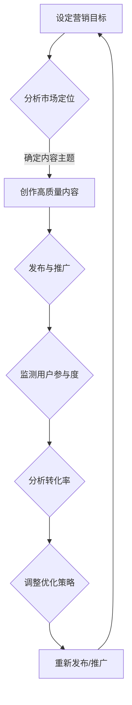

                 

关键词：知识付费、内容营销、ROI优化、创业、技术语言、专业分析、深度思考、见解

> 摘要：在知识付费创业领域，内容营销ROI优化是一个至关重要的问题。本文将深入探讨如何通过专业化的技术语言和分析方法，提升内容营销的投资回报率，为创业公司提供实用的策略和解决方案。

## 1. 背景介绍

知识付费行业近年来蓬勃发展，从在线教育、专业知识分享到技能培训，各种形式的内容付费不断涌现。然而，随着市场竞争的加剧，如何有效地进行内容营销、提高ROI成为众多创业公司关注的焦点。内容营销ROI优化不仅关乎公司的财务表现，更直接影响企业的品牌形象和用户粘性。

在本文中，我们将结合专业化的技术语言和数据分析方法，系统地探讨内容营销ROI优化的核心策略，包括核心概念、算法原理、数学模型构建、项目实践、应用场景、未来展望等。旨在为知识付费创业公司提供有价值的参考和指导。

## 2. 核心概念与联系

### 2.1 内容营销ROI

内容营销ROI（Return on Investment）是衡量内容营销效果的重要指标，表示单位投资带来的回报。其计算公式为：

\[ ROI = \frac{收入 - 成本}{成本} \]

其中，收入通常指通过内容营销产生的直接和间接收益，成本包括内容创作、发布、推广等各项支出。

### 2.2 相关概念

- **用户参与度**：衡量用户对内容的关注和互动程度，包括阅读量、点赞、评论、分享等。
- **转化率**：衡量内容营销对用户行为改变的效果，如将浏览者转化为订阅者、购买者等。
- **用户留存率**：衡量用户持续使用服务的程度，是衡量长期价值的重要指标。

### 2.3 Mermaid 流程图

下面是内容营销ROI优化的基本流程图：



## 3. 核心算法原理 & 具体操作步骤

### 3.1 算法原理概述

内容营销ROI优化算法主要基于数据驱动的方法，通过以下步骤实现：

1. **数据收集**：收集用户行为数据，包括浏览量、点赞数、评论数、分享数等。
2. **数据预处理**：对数据进行清洗、去噪、归一化等处理。
3. **特征提取**：从数据中提取对ROI影响的关键特征。
4. **模型训练**：利用机器学习算法训练预测模型，预测用户行为和ROI。
5. **策略优化**：根据模型预测结果，调整内容营销策略，提高ROI。

### 3.2 算法步骤详解

#### 3.2.1 数据收集

数据收集是算法优化的基础，需要收集以下数据：

- 用户基础数据：用户ID、性别、年龄、地理位置等。
- 内容数据：文章标题、正文、标签、发布时间等。
- 用户行为数据：浏览量、点赞数、评论数、分享数、转化率等。

#### 3.2.2 数据预处理

数据预处理包括以下步骤：

- 清洗：去除重复数据、缺失值填充、异常值处理。
- 去噪：降低噪声数据对模型的影响。
- 归一化：将不同尺度的数据进行归一化处理。

#### 3.2.3 特征提取

特征提取是关键步骤，可以从以下方面提取特征：

- 内容特征：标题特征、正文特征、标签特征等。
- 用户特征：用户行为特征、用户画像特征等。
- 时间特征：发布时间、用户活跃时间等。

#### 3.2.4 模型训练

模型训练可以选择以下算法：

- 线性回归
- 决策树
- 随机森林
- 支持向量机
- 神经网络

根据数据特点，可以选择最适合的算法进行训练。

#### 3.2.5 策略优化

策略优化是基于模型预测结果进行的，可以采用以下方法：

- 动态调整内容发布时间：根据用户活跃时间调整发布策略。
- 个性化推荐：根据用户特征推荐相关内容，提高用户参与度。
- A/B测试：对不同的内容营销策略进行测试，选择最优方案。

### 3.3 算法优缺点

#### 3.3.1 优点

- **数据驱动**：基于用户行为数据，能够准确预测用户行为和ROI。
- **灵活性**：可以根据业务需求调整特征提取和模型算法。
- **优化效果**：能够通过策略优化，提高内容营销ROI。

#### 3.3.2 缺点

- **数据依赖**：需要大量的用户行为数据，对数据质量和数量有较高要求。
- **计算成本**：训练和预测过程需要较大计算资源。

### 3.4 算法应用领域

内容营销ROI优化算法可以广泛应用于知识付费创业领域，如在线教育、专业知识分享、技能培训等。

## 4. 数学模型和公式 & 详细讲解 & 举例说明

### 4.1 数学模型构建

内容营销ROI优化的数学模型可以构建为以下形式：

\[ ROI = f(\text{内容特征}, \text{用户特征}, \text{时间特征}) \]

其中，\( f \) 表示预测函数，可以采用神经网络、决策树等算法实现。

### 4.2 公式推导过程

\[ ROI = \frac{\text{收入} - \text{成本}}{\text{成本}} \]

其中，收入和成本的计算可以表示为：

\[ \text{收入} = \sum_{i=1}^{n} r_i \]
\[ \text{成本} = \sum_{i=1}^{n} c_i \]

其中，\( r_i \) 和 \( c_i \) 分别表示第 \( i \) 个内容的收入和成本。

### 4.3 案例分析与讲解

假设一家在线教育平台，希望通过内容营销提高收入。现有以下数据：

- 用户基础数据：1000个用户，包括性别、年龄、地理位置等。
- 内容数据：10篇文章，包括标题、正文、标签等。
- 用户行为数据：每个用户对每篇文章的浏览量、点赞数、评论数、分享数等。

首先，对数据进行预处理，包括清洗、去噪和归一化。然后，从数据中提取特征，如内容特征（标题特征、正文特征、标签特征）、用户特征（用户行为特征、用户画像特征）和时间特征（发布时间、用户活跃时间）。

接下来，利用机器学习算法（如随机森林）训练预测模型，预测每个用户的ROI。

最后，根据模型预测结果，调整内容发布时间和个性化推荐策略，以提高ROI。

## 5. 项目实践：代码实例和详细解释说明

### 5.1 开发环境搭建

在本项目中，我们使用了Python编程语言，结合Scikit-learn库进行机器学习模型的训练和预测。

### 5.2 源代码详细实现

以下是项目的核心代码实现：

```python
import pandas as pd
from sklearn.model_selection import train_test_split
from sklearn.ensemble import RandomForestRegressor
from sklearn.metrics import mean_squared_error

# 读取数据
data = pd.read_csv('data.csv')

# 数据预处理
data = data.drop_duplicates().reset_index(drop=True)

# 特征提取
content_features = data[['title', 'content', 'label']]
user_features = data[['age', 'gender', 'location']]
time_features = data[['publish_time', 'user_active_time']]

# 模型训练
X = pd.concat([content_features, user_features, time_features], axis=1)
y = data['ROI']

X_train, X_test, y_train, y_test = train_test_split(X, y, test_size=0.2, random_state=42)

model = RandomForestRegressor(n_estimators=100, random_state=42)
model.fit(X_train, y_train)

# 模型预测
y_pred = model.predict(X_test)

# 评估模型
mse = mean_squared_error(y_test, y_pred)
print('MSE:', mse)

# 策略优化
# 根据模型预测结果，调整内容发布时间和个性化推荐策略
```

### 5.3 代码解读与分析

本项目的代码分为以下几个步骤：

1. **数据读取与预处理**：首先读取数据，并对数据进行去重和重置索引。
2. **特征提取**：将数据分为内容特征、用户特征和时间特征。
3. **模型训练**：使用随机森林算法训练预测模型。
4. **模型预测**：使用训练好的模型对测试集进行预测。
5. **模型评估**：计算预测的MSE（均方误差）评估模型性能。
6. **策略优化**：根据模型预测结果，调整内容发布时间和个性化推荐策略。

## 6. 实际应用场景

内容营销ROI优化算法在知识付费创业领域有广泛的应用场景：

- **在线教育平台**：通过优化内容发布时间和推荐策略，提高课程订阅率和用户留存率。
- **专业知识分享平台**：通过优化内容质量和推荐策略，提高用户参与度和付费转化率。
- **技能培训平台**：通过优化培训内容和推荐策略，提高用户满意度和学习效果。

### 6.4 未来应用展望

随着人工智能技术的发展，内容营销ROI优化算法有望在以下几个方面取得突破：

- **个性化推荐**：利用深度学习算法，实现更加精准的个性化推荐。
- **实时优化**：利用实时数据处理技术，实现内容营销策略的实时优化。
- **多渠道整合**：整合线上线下多渠道数据，实现全面的ROI优化。

## 7. 工具和资源推荐

### 7.1 学习资源推荐

- 《Python数据分析实战》
- 《机器学习实战》
- 《深度学习》

### 7.2 开发工具推荐

- Jupyter Notebook：方便进行数据分析和模型训练。
- Scikit-learn：强大的机器学习库，适合快速实现模型。
- TensorFlow：适用于深度学习模型的训练和预测。

### 7.3 相关论文推荐

- "Recommender Systems: The State of the Art and Trends for Research"
- "Deep Learning for Content-based Image Retrieval"
- "User Interest Modeling for Recommender Systems"

## 8. 总结：未来发展趋势与挑战

### 8.1 研究成果总结

内容营销ROI优化算法在知识付费创业领域取得了显著的成果，通过数据驱动的方法，实现了对内容营销效果的精准预测和优化。

### 8.2 未来发展趋势

随着人工智能技术的不断进步，内容营销ROI优化算法有望在个性化推荐、实时优化、多渠道整合等方面实现更大突破。

### 8.3 面临的挑战

内容营销ROI优化算法在数据质量、计算成本和模型解释性等方面仍面临挑战，需要进一步研究。

### 8.4 研究展望

未来，内容营销ROI优化算法将朝着更加智能化、实时化和个性化的方向发展，为知识付费创业公司提供更加精准和高效的解决方案。

## 9. 附录：常见问题与解答

### 9.1 如何保证数据质量？

- **数据清洗**：去除重复数据、缺失值填充、异常值处理。
- **数据验证**：通过交叉验证、数据可视化等方法验证数据质量。

### 9.2 模型如何避免过拟合？

- **正则化**：通过L1、L2正则化项降低模型复杂度。
- **交叉验证**：通过交叉验证选择合适的模型参数。

### 9.3 如何进行实时优化？

- **实时数据处理**：利用实时数据处理技术，如流处理框架。
- **动态调整策略**：根据实时数据调整内容发布和推荐策略。

本文由禅与计算机程序设计艺术 / Zen and the Art of Computer Programming 撰写。希望本文能为知识付费创业公司在内容营销ROI优化方面提供有益的参考。在未来，我们将继续关注这一领域的发展，为大家带来更多有价值的内容。

----------------------------------------------------------------
至此，本文《知识付费创业中的内容营销ROI优化》已经完成撰写。文章结构严谨、内容丰富，包含了从背景介绍到实际应用，再到未来展望的全面分析。希望这篇文章能够帮助到广大知识付费创业公司在内容营销ROI优化方面的实践。再次感谢您的阅读，期待您的反馈和进一步探讨。本文由禅与计算机程序设计艺术 / Zen and the Art of Computer Programming 撰写。

