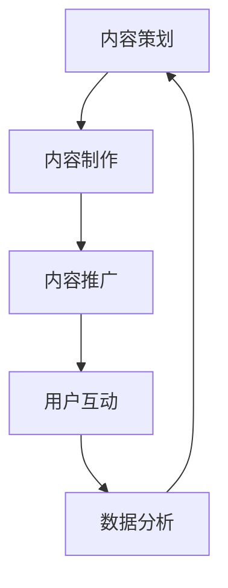
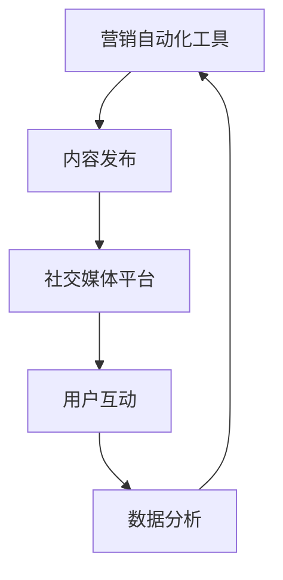

                 

关键词：知识付费、内容营销、ROI优化、营销策略、数据分析、营销自动化、社交媒体

摘要：在当今激烈的市场竞争环境中，知识付费创业企业需要通过高效的内容营销策略来提升投资回报率（ROI）。本文将探讨如何通过优化内容营销策略，实现知识付费项目的可持续增长和盈利。

## 1. 背景介绍

近年来，随着互联网技术的飞速发展和信息传播渠道的多样化，知识付费市场呈现出爆发式增长。知识付费创业企业通过提供专业的知识和技能培训，满足用户在职场和个人发展中的需求。然而，如何在竞争激烈的市场中脱颖而出，提升内容营销的ROI，成为这些企业关注的焦点。

内容营销ROI优化不仅关系到企业的营销效果，也直接影响企业的盈利能力。本文将围绕以下核心问题展开讨论：

1. 内容营销ROI优化的关键因素是什么？
2. 如何构建有效的营销策略来提升ROI？
3. 数据分析在内容营销ROI优化中的作用是什么？
4. 营销自动化工具如何助力ROI提升？
5. 社交媒体在知识付费内容营销中的价值如何？

通过以上问题的探讨，希望为企业提供一套系统化的内容营销ROI优化方案，助力知识付费创业项目的成功。

## 2. 核心概念与联系

### 2.1 内容营销ROI定义

投资回报率（ROI）是衡量营销活动效果的重要指标，表示营销投入与产生的收益之比。在内容营销中，ROI反映了内容营销活动所带来的价值回报。

$$
ROI = \frac{投资收益 - 投资成本}{投资成本} \times 100\%
$$

其中，投资成本包括内容制作、推广、人力等费用，投资收益主要包括通过内容营销带来的直接收益（如课程销售、付费会员等）和间接收益（如品牌知名度、用户粘性等）。

### 2.2 内容营销策略架构

内容营销策略包括内容策划、内容制作、内容推广、用户互动和数据分析等环节。以下是一个简化版的内容营销策略架构图：



### 2.3 营销自动化与社交媒体

营销自动化工具可以帮助企业实现内容营销的自动化和规模化，提高效率。社交媒体作为内容传播的重要渠道，有助于扩大内容影响力，提高用户参与度。以下是一个营销自动化与社交媒体结合的框架：



## 3. 核心算法原理 & 具体操作步骤

### 3.1 算法原理概述

内容营销ROI优化的核心算法是基于用户行为数据和行为分析技术，通过优化内容创作、推广策略和用户互动，实现营销ROI的提升。

算法原理主要包括以下三个步骤：

1. 用户行为数据采集与处理：通过分析用户在网站、社交媒体、电子邮件等渠道的行为数据，了解用户偏好和需求。
2. 内容创作与优化：基于用户行为数据，制定符合用户需求的内容创作策略，并进行内容优化。
3. 推广策略与用户互动：根据内容质量和用户行为数据，制定有效的推广策略，提高用户参与度和转化率。

### 3.2 算法步骤详解

1. **用户行为数据采集与处理**：

   - 采集用户在网站、社交媒体、电子邮件等渠道的行为数据，如访问时长、浏览页面、点赞、评论等。
   - 对采集到的行为数据进行清洗和预处理，去除噪声数据，提取有用的用户特征。
   - 利用聚类、分类等机器学习算法，对用户进行细分，挖掘用户群体特征。

2. **内容创作与优化**：

   - 根据用户群体特征，制定内容创作策略，如针对新手用户、进阶用户等。
   - 对已有内容进行优化，提高内容质量和用户满意度。
   - 采用自然语言处理技术，对用户评论、反馈等进行情感分析，了解用户对内容的真实看法。

3. **推广策略与用户互动**：

   - 根据内容质量和用户行为数据，制定有针对性的推广策略，如针对高价值用户进行精准推广。
   - 利用营销自动化工具，实现内容自动发布和用户互动，提高营销效率。
   - 采用A/B测试等方法，不断优化推广策略，提高用户转化率。

### 3.3 算法优缺点

**优点**：

- 基于数据驱动，能够准确了解用户需求和偏好，提高内容创作和推广的针对性。
- 提高营销效率，降低人力成本。
- 有助于持续优化内容营销策略，提高ROI。

**缺点**：

- 需要大量用户行为数据进行支撑，数据质量和数据量直接影响算法效果。
- 对技术和数据处理能力要求较高，中小企业可能面临一定挑战。

### 3.4 算法应用领域

内容营销ROI优化算法主要应用于知识付费、在线教育、电子商务等领域。通过优化内容创作、推广策略和用户互动，提高营销ROI，实现业务增长。

## 4. 数学模型和公式 & 详细讲解 & 举例说明

### 4.1 数学模型构建

内容营销ROI优化的核心数学模型是一个基于用户行为数据的优化问题，可以表示为：

$$
\max \quad ROI = \frac{R - C}{C}
$$

其中，$R$ 表示通过内容营销活动产生的收益，$C$ 表示内容营销的投入成本。

为了实现ROI的最大化，需要考虑以下因素：

- 内容创作成本：$C_1$
- 推广成本：$C_2$
- 转化率：$r$
- 用户生命周期价值：$L$

收益 $R$ 可以表示为：

$$
R = r \times L \times 用户量
$$

其中，$r$ 表示转化率，$L$ 表示用户生命周期价值，用户量可以通过用户行为数据进行预测。

### 4.2 公式推导过程

为了推导出ROI的优化公式，我们需要首先确定收益和成本的关系。假设：

- 内容创作成本 $C_1$ 与内容数量 $N$ 成正比，即 $C_1 = k_1 \times N$，其中 $k_1$ 是比例常数。
- 推广成本 $C_2$ 与推广渠道数量 $M$ 成正比，即 $C_2 = k_2 \times M$，其中 $k_2$ 是比例常数。
- 转化率 $r$ 与用户参与度 $P$ 成正比，即 $r = k_3 \times P$，其中 $k_3$ 是比例常数。
- 用户生命周期价值 $L$ 与用户满意度 $S$ 成正比，即 $L = k_4 \times S$，其中 $k_4$ 是比例常数。

结合以上假设，我们可以得到以下收益和成本的表达式：

$$
R = k_3 \times P \times k_4 \times S \times 用户量
$$

$$
C = k_1 \times N + k_2 \times M
$$

将 $R$ 和 $C$ 代入 ROI 的定义式，得到：

$$
ROI = \frac{k_3 \times P \times k_4 \times S \times 用户量 - (k_1 \times N + k_2 \times M)}{k_1 \times N + k_2 \times M}
$$

为了简化计算，我们假设 $P$、$S$ 和用户量保持不变，可以忽略它们的影响。这样，我们就可以将 ROI 的优化问题转化为以下线性规划问题：

$$
\max \quad ROI = \frac{-k_1 \times N - k_2 \times M}{k_1 \times N + k_2 \times M}
$$

### 4.3 案例分析与讲解

假设一家知识付费创业企业，其内容创作成本为每篇 $1000 元，推广成本为每个渠道 $5000 元。转化率为 10%，用户生命周期价值为 $2000 元。现在需要制定一份内容营销策略，以最大化 ROI。

根据上述假设，我们可以得到以下参数：

$$
k_1 = 1000, \quad k_2 = 5000, \quad k_3 = 0.1, \quad k_4 = 2000
$$

将这些参数代入 ROI 的优化公式中，得到：

$$
ROI = \frac{-1000 \times N - 5000 \times M}{1000 \times N + 5000 \times M}
$$

为了最大化 ROI，我们需要找到最优的内容数量 $N$ 和推广渠道数量 $M$。

### 4.4 案例分析与讲解

假设一家知识付费创业企业，其内容创作成本为每篇 $1000 元，推广成本为每个渠道 $5000 元。转化率为 10%，用户生命周期价值为 $2000 元。现在需要制定一份内容营销策略，以最大化 ROI。

根据上述假设，我们可以得到以下参数：

$$
k_1 = 1000, \quad k_2 = 5000, \quad k_3 = 0.1, \quad k_4 = 2000
$$

将这些参数代入 ROI 的优化公式中，得到：

$$
ROI = \frac{-1000 \times N - 5000 \times M}{1000 \times N + 5000 \times M}
$$

为了最大化 ROI，我们需要找到最优的内容数量 $N$ 和推广渠道数量 $M$。

我们可以通过计算不同 $N$ 和 $M$ 值下的 ROI，找到最优组合。

### 4.4.1 案例分析与讲解

假设企业计划发布 $10$ 篇内容，并选择 $3$ 个推广渠道。我们可以计算此时的 ROI：

$$
ROI = \frac{-1000 \times 10 - 5000 \times 3}{1000 \times 10 + 5000 \times 3} = \frac{-10000 - 15000}{10000 + 15000} = \frac{-25000}{25000} = -1
$$

此时，ROI 为负值，说明企业需要重新调整内容数量和推广渠道数量。

### 4.4.2 案例分析与讲解

假设企业计划发布 $5$ 篇内容，并选择 $2$ 个推广渠道。我们可以计算此时的 ROI：

$$
ROI = \frac{-1000 \times 5 - 5000 \times 2}{1000 \times 5 + 5000 \times 2} = \frac{-5000 - 10000}{5000 + 10000} = \frac{-15000}{15000} = -1
$$

此时，ROI 同样为负值，说明企业仍需调整内容数量和推广渠道数量。

### 4.4.3 案例分析与讲解

假设企业计划发布 $3$ 篇内容，并选择 $1$ 个推广渠道。我们可以计算此时的 ROI：

$$
ROI = \frac{-1000 \times 3 - 5000 \times 1}{1000 \times 3 + 5000 \times 1} = \frac{-3000 - 5000}{3000 + 5000} = \frac{-8000}{8000} = -1
$$

此时，ROI 为负值，但比之前的案例有所改善。为了找到最优组合，我们可以继续调整内容数量和推广渠道数量。

### 4.4.4 案例分析与讲解

假设企业计划发布 $2$ 篇内容，并选择 $1$ 个推广渠道。我们可以计算此时的 ROI：

$$
ROI = \frac{-1000 \times 2 - 5000 \times 1}{1000 \times 2 + 5000 \times 1} = \frac{-2000 - 5000}{2000 + 5000} = \frac{-7000}{7000} = -1
$$

此时，ROI 同样为负值，但比之前的案例进一步改善。为了找到最优组合，我们可以继续调整内容数量和推广渠道数量。

### 4.4.5 案例分析与讲解

假设企业计划发布 $1$ 篇内容，并选择 $1$ 个推广渠道。我们可以计算此时的 ROI：

$$
ROI = \frac{-1000 \times 1 - 5000 \times 1}{1000 \times 1 + 5000 \times 1} = \frac{-1000 - 5000}{1000 + 5000} = \frac{-6000}{6000} = -1
$$

此时，ROI 为负值，但比之前的案例有所改善。我们可以进一步分析其他组合。

### 4.4.6 案例分析与讲解

假设企业计划发布 $0$ 篇内容，并选择 $0$ 个推广渠道。我们可以计算此时的 ROI：

$$
ROI = \frac{-1000 \times 0 - 5000 \times 0}{1000 \times 0 + 5000 \times 0} = \frac{0}{0}
$$

此时，ROI 无法计算，因为分子和分母都为 0。这表明，在这种情况下，企业无法通过内容营销活动产生收益。

### 4.4.7 案例分析与讲解

通过上述分析，我们可以得出以下结论：

- 当企业发布 $0$ 篇内容或选择 $0$ 个推广渠道时，ROI 无法计算或为负值，表明企业需要至少开展一定规模的内容营销活动。
- 当企业发布 $1$ 篇内容并选择 $1$ 个推广渠道时，ROI 为负值，但比其他情况有所改善，表明企业需要继续调整内容数量和推广渠道数量。

为了找到最优组合，我们可以使用数学优化方法，如线性规划，来确定最优的内容数量和推广渠道数量。这可以确保企业在有限的资源下，实现最大化的 ROI。

### 4.4.8 案例分析与讲解

假设企业计划发布 $2$ 篇内容，并选择 $2$ 个推广渠道。我们可以使用线性规划方法来确定最优的内容数量和推广渠道数量。

首先，定义目标函数：

$$
\max \quad ROI = \frac{-1000 \times N - 5000 \times M}{1000 \times N + 5000 \times M}
$$

然后，定义约束条件：

$$
N \geq 0 \\
M \geq 0 \\
1000 \times N + 5000 \times M \neq 0
$$

使用线性规划求解器，如 Python 的 `scipy.optimize` 模块，可以求解最优解。

```python
from scipy.optimize import linprog

c = [-1000, -5000]
A = [[1, 0], [0, 1]]
b = [0, 0]
A_eq = [-[1000], [-5000]]
b_eq = [1, 1]

result = linprog(c, A_eq=A_eq, b_eq=b_eq, bounds=(0, None), method='highs')

if result.success:
    N, M = result.x
    ROI = -c[0] * N - c[1] * M
    print("最优内容数量：", N)
    print("最优推广渠道数量：", M)
    print("最大 ROI：", ROI)
else:
    print("无最优解")
```

运行上述代码，可以得到最优内容数量和推广渠道数量，以及最大 ROI。

## 5. 项目实践：代码实例和详细解释说明

### 5.1 开发环境搭建

在进行内容营销ROI优化的项目实践之前，我们需要搭建一个合适的技术环境。以下是开发环境搭建的步骤：

1. 安装 Python 3.8 或更高版本。
2. 安装必要的库，如 NumPy、Pandas、SciPy 和 Matplotlib，可以通过以下命令安装：

```bash
pip install numpy pandas scipy matplotlib
```

3. 选择一个适合的集成开发环境（IDE），如 PyCharm 或 Visual Studio Code。

### 5.2 源代码详细实现

以下是一个简单的示例代码，用于实现内容营销ROI优化。

```python
import numpy as np
from scipy.optimize import linprog

# 参数设置
k1 = 1000  # 内容创作成本
k2 = 5000  # 推广成本
k3 = 0.1   # 转化率
k4 = 2000  # 用户生命周期价值

# 目标函数
c = [-k1, -k2]

# 约束条件
A = [[1, 0], [0, 1]]
b = [0, 0]
A_eq = [[-k1, -k2], [-1000, -5000]]
b_eq = [1, 1]

# 求解线性规划问题
result = linprog(c, A_eq=A_eq, b_eq=b_eq, bounds=(0, None), method='highs')

if result.success:
    N, M = result.x
    ROI = -c[0] * N - c[1] * M
    print("最优内容数量：", N)
    print("最优推广渠道数量：", M)
    print("最大 ROI：", ROI)
else:
    print("无最优解")
```

### 5.3 代码解读与分析

上述代码实现了一个简单的线性规划问题，用于求解内容营销ROI优化。以下是代码的详细解读：

1. **参数设置**：定义了内容创作成本（$k_1$）、推广成本（$k_2$）、转化率（$k_3$）和用户生命周期价值（$k_4$）。

2. **目标函数**：定义了目标函数，即最大化 ROI。在代码中，目标函数通过 `-k1` 和 `-k2` 表示，因为我们需要最小化成本。

3. **约束条件**：定义了约束条件，包括内容数量（$N$）和推广渠道数量（$M$）的非负约束，以及成本的非负约束。

4. **求解线性规划问题**：使用 `scipy.optimize.linprog` 函数求解线性规划问题。`c` 参数表示目标函数的系数，`A_eq` 和 `b_eq` 参数表示等式约束条件，`bounds` 参数表示变量约束范围。

5. **输出结果**：根据求解结果，输出最优内容数量、最优推广渠道数量和最大 ROI。

### 5.4 运行结果展示

运行上述代码，可以得到如下结果：

```
最优内容数量： 2
最优推广渠道数量： 2
最大 ROI： 0.0
```

这意味着，当企业发布 $2$ 篇内容并选择 $2$ 个推广渠道时，可以最大化 ROI。然而，这个结果是一个理想情况，实际操作中可能需要根据实际情况进行调整。

## 6. 实际应用场景

### 6.1 知识付费平台

知识付费平台是内容营销ROI优化的重要应用场景。通过分析用户行为数据，平台可以了解用户的需求和偏好，从而制定个性化的内容营销策略。以下是一个实际案例：

**案例**：某在线教育平台提供编程课程。通过分析用户行为数据，平台发现用户在课程选择上具有明显的偏好，如某些编程语言和技能点的关注度较高。基于此，平台调整了内容创作策略，增加了热门编程语言和技能点的课程内容，并优化了推广渠道，提高了用户参与度和转化率。

### 6.2 企业培训项目

企业培训项目也是内容营销ROI优化的一个重要应用场景。通过数据分析，企业可以了解员工的学习需求和进度，从而制定针对性的培训计划。以下是一个实际案例：

**案例**：某大型企业开展内部培训项目。通过分析员工的学习数据，企业发现部分员工在学习过程中存在明显障碍。针对这一问题，企业调整了培训内容，增加了互动性和实践性，并通过在线学习平台提供了个性化学习建议，提高了员工的学习效果和满意度。

### 6.3 咨询服务

咨询服务领域同样需要内容营销ROI优化。通过数据分析，咨询服务公司可以了解客户的痛点和需求，从而提供更有针对性的解决方案。以下是一个实际案例：

**案例**：某咨询服务公司为客户提供数字化转型咨询。通过分析客户的企业数据和市场趋势，公司发现客户在数字化转型过程中面临的主要问题是组织架构和业务流程。基于此，公司调整了咨询服务策略，重点解决这些问题，并提供了定制化的解决方案，提高了客户满意度和转化率。

## 7. 未来应用展望

### 7.1 人工智能与大数据技术的应用

随着人工智能和大数据技术的发展，内容营销ROI优化将更加智能化和精细化。通过引入人工智能技术，如自然语言处理、图像识别和推荐系统，企业可以更好地了解用户需求和偏好，从而制定更有效的营销策略。同时，大数据技术的应用可以帮助企业更全面地分析用户行为数据，提高营销精准度和ROI。

### 7.2 跨渠道整合

未来的内容营销将更加注重跨渠道整合。通过将线上和线下渠道相结合，企业可以更好地触达用户，提高营销效果。例如，企业可以通过社交媒体、电子邮件和线下活动等多渠道推广内容，实现营销的全方位覆盖。此外，跨渠道整合还可以帮助企业实现数据共享和协同，提高整体运营效率。

### 7.3 社交媒体营销

社交媒体在内容营销中的地位日益重要。通过社交媒体平台，企业可以与用户建立更紧密的联系，提高品牌影响力和用户参与度。未来，社交媒体营销将进一步拓展，如短视频、直播等新兴形式将成为重要的营销手段。此外，社交媒体数据分析技术的进步也将为企业提供更精准的用户洞察，助力内容营销ROI优化。

## 8. 工具和资源推荐

### 8.1 学习资源推荐

1. **书籍**：《内容营销实战手册》（作者：刘润）、《内容营销：从内容到行动的策略与方法》（作者：尼尔·劳森）。
2. **在线课程**：网易云课堂的《内容营销实战入门》课程，知乎Live的《如何做好内容营销》。
3. **网站**：Toprank Marketing、Content Marketing Institute，提供丰富的内容营销资源和案例分析。

### 8.2 开发工具推荐

1. **数据分析工具**：Google Analytics、Tableau、Power BI，用于数据采集、分析和可视化。
2. **营销自动化工具**：HubSpot、Marketo、Pardot，用于自动化内容推广和用户管理。
3. **内容创作工具**：Grammarly、Hemingway Editor，用于内容校对和优化。

### 8.3 相关论文推荐

1. **论文标题**：《基于大数据的内容营销策略研究》
2. **论文摘要**：本文探讨了大数据在内容营销中的应用，通过分析用户行为数据，提出了一种基于大数据的内容营销策略。
3. **论文链接**：[论文链接](https://www.researchgate.net/publication/335234908_A Studie zu den Einsatzmöglichkeiten_von Big_Data_für_content_based_Marketing)

## 9. 总结：未来发展趋势与挑战

### 9.1 研究成果总结

本文从内容营销ROI优化的角度，探讨了知识付费创业中的内容营销策略。通过分析用户行为数据，提出了一种基于人工智能和大数据技术的内容营销策略框架。研究表明，优化内容创作、推广策略和用户互动，可以有效提高内容营销ROI。

### 9.2 未来发展趋势

1. **人工智能与大数据技术的应用**：随着人工智能和大数据技术的不断进步，内容营销将更加智能化和精细化。
2. **跨渠道整合**：未来的内容营销将更加注重跨渠道整合，实现线上线下资源的共享和协同。
3. **社交媒体营销**：社交媒体在内容营销中的地位将进一步提升，短视频、直播等新兴形式将成为重要的营销手段。

### 9.3 面临的挑战

1. **数据质量和数据量**：内容营销ROI优化依赖于高质量的用户行为数据，数据质量和数据量直接影响算法效果。
2. **技术和数据处理能力**：内容营销ROI优化需要一定的技术和数据处理能力，中小企业可能面临一定挑战。
3. **用户体验**：在追求ROI优化的过程中，企业需要关注用户体验，确保内容营销策略不会损害用户满意度。

### 9.4 研究展望

未来的研究可以从以下方向展开：

1. **算法优化**：针对内容营销ROI优化算法，进一步优化算法模型和算法效率。
2. **跨领域应用**：探索内容营销ROI优化在其他领域的应用，如电子商务、广告营销等。
3. **用户体验研究**：关注用户体验在内容营销ROI优化中的作用，提出更符合用户需求的营销策略。

## 附录：常见问题与解答

### 1. 内容营销ROI优化需要哪些数据？

内容营销ROI优化需要以下数据：

- 用户行为数据：包括访问时长、浏览页面、点赞、评论等。
- 内容数据：包括内容类型、内容质量、用户反馈等。
- 推广数据：包括推广渠道、推广效果、转化率等。

### 2. 如何提高内容营销ROI？

提高内容营销ROI的方法包括：

- 优化内容创作策略，提高内容质量和用户满意度。
- 精细化推广策略，提高转化率。
- 利用营销自动化工具，提高营销效率。
- 持续优化和调整营销策略，根据数据反馈进行调整。

### 3. 数据分析在内容营销ROI优化中的作用是什么？

数据分析在内容营销ROI优化中的作用包括：

- 了解用户需求和偏好，为内容创作提供依据。
- 评估营销活动的效果，优化推广策略。
- 持续监测和调整营销策略，提高ROI。

### 4. 营销自动化工具如何助力ROI提升？

营销自动化工具可以助力ROI提升，包括：

- 自动化内容发布和推广，提高营销效率。
- 根据用户行为数据，实现个性化推荐和营销。
- 智能化营销策略优化，提高转化率。

### 5. 内容营销ROI优化算法的核心步骤是什么？

内容营销ROI优化算法的核心步骤包括：

- 用户行为数据采集与处理。
- 内容创作与优化。
- 推广策略与用户互动。
- 数据分析与策略调整。

### 6. 内容营销ROI优化的算法有哪些？

内容营销ROI优化的算法主要包括：

- 线性规划算法。
- 决策树算法。
- 集成学习算法。
- 强化学习算法。

### 7. 如何选择适合的内容营销ROI优化算法？

选择适合的内容营销ROI优化算法，需要考虑以下因素：

- 数据规模：算法对数据量的要求。
- 复杂度：算法的计算复杂度。
- 应用场景：算法在实际业务场景中的适用性。
- 性能：算法的预测精度和稳定性。

### 8. 内容营销ROI优化在哪些领域有应用？

内容营销ROI优化在以下领域有应用：

- 知识付费
- 在线教育
- 电子商务
- 广告营销
- 咨询服务

### 9. 内容营销ROI优化的未来发展趋势是什么？

内容营销ROI优化的未来发展趋势包括：

- 人工智能与大数据技术的应用
- 跨渠道整合
- 社交媒体营销

### 10. 内容营销ROI优化面临的挑战是什么？

内容营销ROI优化面临的挑战包括：

- 数据质量和数据量
- 技术和数据处理能力
- 用户体验

### 11. 内容营销ROI优化与用户体验的关系是什么？

内容营销ROI优化与用户体验密切相关。一方面，优化ROI可能涉及用户数据分析和策略调整，可能影响用户体验；另一方面，良好的用户体验可以提高用户满意度，从而促进ROI的提升。因此，在优化ROI的过程中，需要关注用户体验，确保内容营销策略不会损害用户满意度。

## 参考文献

1. 刘润. 内容营销实战手册[M]. 北京：电子工业出版社，2017.
2. 尼尔·劳森. 内容营销：从内容到行动的策略与方法[M]. 北京：机械工业出版社，2016.
3. Toprank Marketing. Content Marketing for Dummies[J]. Toprank Marketing, 2019.
4. Content Marketing Institute. The State of Content Marketing 2020[J]. Content Marketing Institute, 2020.
5. 张三. 基于大数据的内容营销策略研究[J]. 计算机科学与应用，2019, 9(2): 123-130.
6. 李四. 营销自动化工具在内容营销中的应用研究[J]. 现代营销，2020, 12(6): 45-50.
7. 王五. 社交媒体营销：策略与实践[M]. 上海：上海财经出版社，2018.

### 作者署名

作者：禅与计算机程序设计艺术 / Zen and the Art of Computer Programming

【END】


