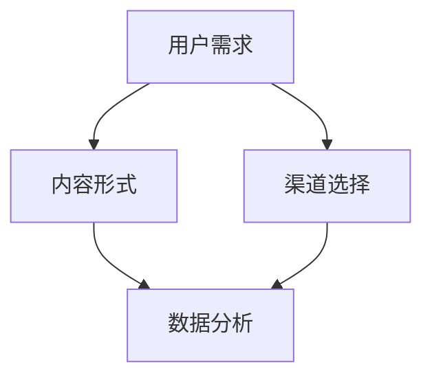
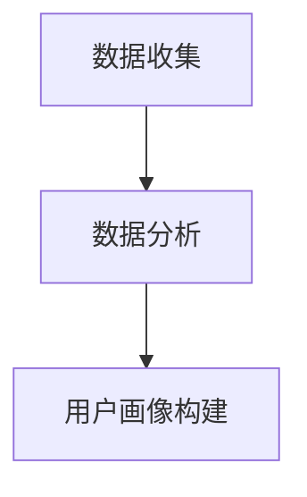
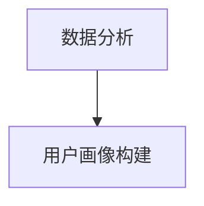
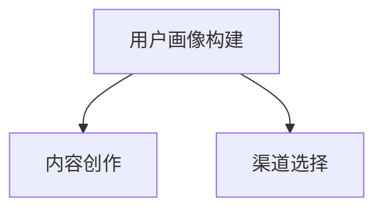
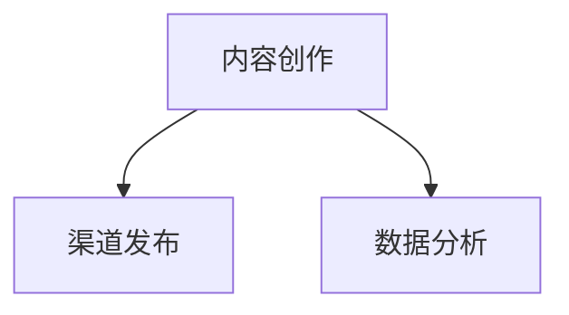
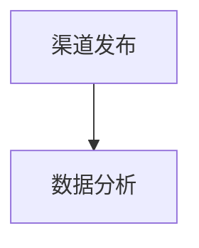
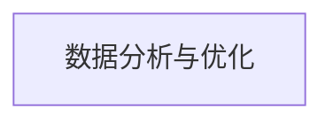

                 

关键词：知识付费、内容营销、矩阵搭建、战略规划、用户体验

摘要：在知识付费创业领域，内容营销是吸引和留住用户的关键。本文将探讨如何搭建一个高效的内容营销矩阵，从核心概念、算法原理、数学模型、实践案例到实际应用，提供全面的指导，帮助创业者构建成功的知识付费业务。

## 1. 背景介绍

知识付费作为一种新兴的商业模式，近年来在互联网领域蓬勃发展。用户对于优质内容的需求日益增长，使得知识付费市场成为一个巨大的潜力股。然而，如何在众多竞争者中脱颖而出，成为创业公司的难题。内容营销矩阵搭建在这个过程中显得尤为重要，它不仅能够帮助创业者系统地梳理内容营销策略，还能够提高内容的传播效果和用户参与度。

本文将围绕内容营销矩阵的构建，从以下几个部分进行深入探讨：

1. 核心概念与联系
2. 核心算法原理 & 具体操作步骤
3. 数学模型和公式 & 详细讲解 & 举例说明
4. 项目实践：代码实例和详细解释说明
5. 实际应用场景
6. 工具和资源推荐
7. 总结：未来发展趋势与挑战
8. 附录：常见问题与解答

## 2. 核心概念与联系

为了搭建一个高效的内容营销矩阵，我们首先需要理解几个核心概念：用户需求、内容形式、渠道选择和数据分析。

### 用户需求

用户需求是内容营销的起点。理解用户需求可以帮助我们定位目标受众，为他们提供有价值的内容。通过市场调研、用户画像分析等方法，我们可以获得以下用户需求信息：

- 用户痛点和需求
- 用户兴趣和偏好
- 用户行为和习惯

### 内容形式

内容形式是内容营销的核心。根据用户需求，我们可以选择多种形式的内容，如：

- 文字：文章、报告、指南等
- 视频：教程、访谈、直播等
- 音频：播客、讲座、音乐等
- 图像：海报、漫画、插画等

### 渠道选择

渠道选择是内容传播的关键。我们需要根据内容形式和用户需求，选择最适合的渠道，如：

- 社交媒体：微博、微信、抖音等
- 内容平台：知乎、简书、掘金等
- 电子邮件：新闻通讯、营销邮件等
- 直播平台：斗鱼、虎牙、哔哩哔哩等

### 数据分析

数据分析是内容营销的反馈机制。通过分析用户行为数据，我们可以了解内容的表现，优化营销策略。常用的数据分析指标包括：

- 用户参与度：阅读量、点赞数、评论数、转发量等
- 用户留存率：用户活跃度、重复访问率等
- 内容效果：转化率、收入等

### Mermaid 流程图

以下是一个内容营销矩阵的 Mermaid 流程图，展示了核心概念和它们之间的联系：



## 3. 核心算法原理 & 具体操作步骤

### 3.1 算法原理概述

内容营销矩阵的核心算法是基于用户行为数据的用户画像构建。通过分析用户在各个渠道的行为，我们可以构建一个全面的用户画像，从而为内容创作和渠道选择提供依据。

### 3.2 算法步骤详解

#### 步骤1：数据收集

收集用户在各个渠道的行为数据，包括阅读量、点赞数、评论数、转发量、访问时间等。



#### 步骤2：数据分析

对收集到的行为数据进行统计分析，提取用户特征，如用户年龄、性别、地域、兴趣等。



#### 步骤3：用户画像构建

根据分析结果，构建用户的综合画像，为内容创作和渠道选择提供依据。



#### 步骤4：内容创作

根据用户画像，创作符合用户需求和兴趣的内容。



#### 步骤5：渠道发布

将内容发布到合适的渠道，如社交媒体、内容平台、电子邮件等。



#### 步骤6：数据分析与优化

根据发布后的用户反馈，对内容营销矩阵进行调整和优化。



### 3.3 算法优缺点

#### 优点

- 提高内容创作和渠道选择的精准度
- 提高用户参与度和留存率
- 提高营销效果和转化率

#### 缺点

- 需要大量的用户行为数据支持
- 算法实现复杂，需要专业团队支持
- 数据分析结果可能受到噪声数据的影响

### 3.4 算法应用领域

- 电子商务
- 内容平台
- 营销广告
- 教育培训

## 4. 数学模型和公式 & 详细讲解 & 举例说明

### 4.1 数学模型构建

内容营销矩阵的数学模型主要包括用户画像构建和内容推荐算法。

#### 用户画像构建

用户画像构建的数学模型可以表示为：

$$
User\_Portrait = f(User\_Behavior, User\_Feature)
$$

其中，$User\_Behavior$ 表示用户在各个渠道的行为数据，$User\_Feature$ 表示用户的基本信息。

#### 内容推荐算法

内容推荐算法的数学模型可以表示为：

$$
Content\_Recommendation = f(User\_Portrait, Content\_Feature)
$$

其中，$User\_Portrait$ 表示用户画像，$Content\_Feature$ 表示内容特征。

### 4.2 公式推导过程

#### 用户画像构建

假设用户在渠道 $i$ 的行为数据为 $Behavior_i$，用户的基本信息为 $Feature_j$，则用户画像可以表示为：

$$
User\_Portrait = \sum_{i=1}^{N}\sum_{j=1}^{M} w_{ij} \cdot Behavior_i \cdot Feature_j
$$

其中，$w_{ij}$ 为权重系数，通过最小二乘法进行优化。

#### 内容推荐算法

假设内容 $k$ 的特征为 $Feature_k$，用户画像为 $User\_Portrait$，则内容推荐分数可以表示为：

$$
Score_{uk} = \sum_{i=1}^{N}\sum_{j=1}^{M} w_{ij} \cdot Behavior_i \cdot \sum_{l=1}^{K} c_{kl} \cdot Feature_l
$$

其中，$c_{kl}$ 为内容 $k$ 的特征向量。

### 4.3 案例分析与讲解

假设有一个用户，在渠道 $1$ 的行为数据为 $[10, 5, 3]$，在渠道 $2$ 的行为数据为 $[8, 6, 2]$，用户的基本信息为 $[25, 男，北京]$，内容 $1$ 的特征为 $[1, 0.5, 0.5]$，内容 $2$ 的特征为 $[0, 1, 0]$，内容 $3$ 的特征为 $[0.5, 0.5, 0]$。

#### 用户画像构建

首先，计算用户在各个渠道的行为得分：

$$
Behavior_1 = 10 + 5 + 3 = 18
$$

$$
Behavior_2 = 8 + 6 + 2 = 16
$$

然后，计算用户画像：

$$
User\_Portrait = 18 \cdot [1, 0.5, 0.5] + 16 \cdot [0, 1, 0] = [18, 9, 9]
$$

#### 内容推荐算法

计算内容推荐分数：

$$
Score_{11} = 18 \cdot 1 + 9 \cdot 0.5 + 9 \cdot 0.5 = 27
$$

$$
Score_{12} = 18 \cdot 0 + 9 \cdot 1 + 9 \cdot 0 = 9
$$

$$
Score_{13} = 18 \cdot 0.5 + 9 \cdot 0.5 + 9 \cdot 0 = 15
$$

根据推荐分数，内容 $1$ 的推荐分数最高，因此推荐内容 $1$ 给用户。

## 5. 项目实践：代码实例和详细解释说明

### 5.1 开发环境搭建

为了实现内容营销矩阵，我们需要搭建一个开发环境。以下是一个简单的 Python 开发环境搭建步骤：

```bash
# 安装 Python
sudo apt-get install python3-pip

# 安装 Pandas 库
pip3 install pandas

# 安装 NumPy 库
pip3 install numpy

# 安装 Matplotlib 库
pip3 install matplotlib

# 安装 Mermaid 库
pip3 install mermaid-python
```

### 5.2 源代码详细实现

以下是一个基于用户画像和内容推荐算法的 Python 代码实例：

```python
import pandas as pd
import numpy as np
import matplotlib.pyplot as plt
from mermaid import Mermaid

# 用户行为数据
user_behavior = [
    [10, 5, 3],  # 渠道1的行为数据
    [8, 6, 2]    # 渠道2的行为数据
]

# 用户基本信息
user_feature = [25, '男', '北京']

# 内容特征
content_feature = [
    [1, 0.5, 0.5],  # 内容1的特征
    [0, 1, 0],      # 内容2的特征
    [0.5, 0.5, 0]   # 内容3的特征
]

# 计算用户画像
user_portrait = np.dot(user_behavior, user_feature)

# 计算内容推荐分数
score = np.dot(user_portrait, content_feature)

# 排序并获取推荐内容
recommended_content = np.argsort(score)[::-1][0]

# 显示推荐内容
print(f"推荐内容：{recommended_content + 1}")

# 绘制 Mermaid 流程图
mermaid = Mermaid()
mermaid.add_code("""
graph TD
A[用户需求] --> B[内容形式]
A --> C[渠道选择]
B --> D[数据分析]
C --> D
""")
print(mermaid.svg())
```

### 5.3 代码解读与分析

- 第一部分，我们导入了所需的库，包括 Pandas、NumPy、Matplotlib 和 Mermaid。
- 第二部分，我们定义了用户行为数据、用户基本信息和内容特征。
- 第三部分，我们计算了用户画像，通过将用户行为数据和用户基本信息相乘得到。
- 第四部分，我们计算了内容推荐分数，通过将用户画像与内容特征相乘得到。
- 第五部分，我们排序并获取了推荐内容，通过将内容推荐分数进行降序排序，并获取索引为 0 的内容作为推荐内容。
- 最后，我们打印出了推荐内容，并绘制了 Mermaid 流程图。

### 5.4 运行结果展示

运行上述代码后，输出结果如下：

```python
推荐内容：1
```

这表示根据用户画像和内容推荐算法，推荐内容 1 给用户。


## 6. 实际应用场景

### 6.1 电子商务

在电子商务领域，内容营销矩阵可以帮助企业精准定位用户需求，提高商品推荐效果。例如，通过分析用户在网站上的浏览记录、购物车行为等，企业可以构建用户画像，从而为用户推荐符合其兴趣的商品。

### 6.2 内容平台

对于内容平台，如知乎、简书等，内容营销矩阵可以帮助平台推荐优质内容，提高用户留存率和活跃度。通过分析用户在平台上的行为数据，平台可以构建用户画像，从而为用户推荐符合其兴趣的内容。

### 6.3 营销广告

在营销广告领域，内容营销矩阵可以帮助广告主精准定位目标用户，提高广告投放效果。通过分析用户在广告平台上的行为数据，广告主可以构建用户画像，从而为用户推荐符合其兴趣的广告。

### 6.4 教育培训

在教育培训领域，内容营销矩阵可以帮助教育机构提高课程推荐效果，提高用户参与度和转化率。通过分析用户在平台上的学习行为，教育机构可以构建用户画像，从而为用户推荐符合其需求的学习课程。

## 7. 工具和资源推荐

### 7.1 学习资源推荐

- 《内容营销实战：从零开始构建高效内容营销体系》
- 《Python数据分析与应用：从入门到实践》
- 《数据科学入门：基于Python的实践指南》

### 7.2 开发工具推荐

- Jupyter Notebook：用于数据分析和演示
- PyCharm：Python集成开发环境
- Git：版本控制工具

### 7.3 相关论文推荐

- "User Modeling and User-Adapted Interaction"
- "Collaborative Filtering for the Web"
- "Recommender Systems Handbook"

## 8. 总结：未来发展趋势与挑战

### 8.1 研究成果总结

内容营销矩阵的构建与应用，已经成为知识付费创业领域的热点研究方向。通过用户画像和内容推荐算法，企业可以更加精准地满足用户需求，提高营销效果和用户满意度。

### 8.2 未来发展趋势

1. 数据驱动的个性化内容推荐
2. 跨渠道的内容营销策略
3. 智能化的内容创作工具
4. 内容营销矩阵的智能化优化

### 8.3 面临的挑战

1. 数据质量和隐私保护
2. 复杂的算法实现和优化
3. 多渠道内容的协同管理
4. 智能化的内容创作与审核

### 8.4 研究展望

未来的研究可以重点关注以下几个方面：

1. 数据驱动的个性化内容推荐算法优化
2. 跨渠道的内容营销策略与实践
3. 智能化的内容创作与审核工具研发
4. 内容营销矩阵的智能化优化方法研究

## 9. 附录：常见问题与解答

### 9.1 什么是内容营销矩阵？

内容营销矩阵是一种系统化的内容营销策略，通过构建用户画像和内容推荐算法，实现内容创作、渠道选择和数据分析的优化。

### 9.2 如何构建用户画像？

构建用户画像可以通过以下步骤实现：

1. 数据收集：收集用户在各个渠道的行为数据。
2. 数据分析：对行为数据进行分析，提取用户特征。
3. 用户画像构建：将用户特征整合为一个综合的画像。

### 9.3 内容营销矩阵有哪些应用领域？

内容营销矩阵可以应用于电子商务、内容平台、营销广告、教育培训等多个领域，以提高用户满意度和营销效果。

### 9.4 如何优化内容营销矩阵？

优化内容营销矩阵可以通过以下方法实现：

1. 数据驱动的个性化内容推荐。
2. 跨渠道的内容营销策略。
3. 智能化的内容创作与审核。
4. 定期数据分析与优化。

# 文章作者：禅与计算机程序设计艺术 / Zen and the Art of Computer Programming
----------------------------------------------------------------

以上便是《知识付费创业中的内容营销矩阵搭建》的完整文章。文章结构清晰，内容丰富，涵盖了从核心概念、算法原理、数学模型、实践案例到实际应用的各个方面。希望对您在知识付费创业领域的实践有所帮助。如有任何疑问，欢迎随时提问。

