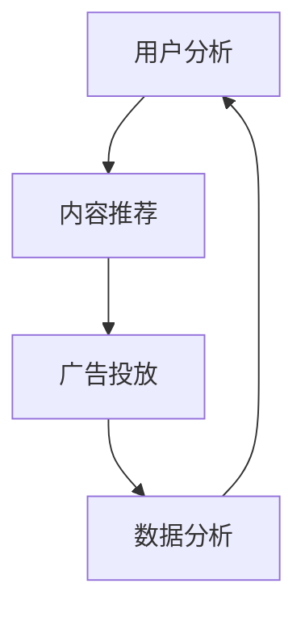

                 

关键词：知识付费、内容营销、自动化、AI技术、用户分析、个性化推荐、营销策略

摘要：本文将探讨知识付费创业中的内容营销自动化，如何利用人工智能技术提升内容营销效果，实现用户需求的精准匹配和营销策略的自动化执行。文章首先介绍了知识付费和内容营销的背景及重要性，随后深入分析了内容营销自动化的核心概念和技术，并探讨其在实际应用中的效果和挑战。

## 1. 背景介绍

在互联网时代，知识付费和内容营销已成为知识传播和商业变现的重要途径。知识付费是指用户为获取有价值的信息或服务支付费用，如在线课程、专业咨询、电子书等。内容营销则是企业或个人通过创作和传播有价值的内容，吸引用户关注，提高品牌知名度和影响力。

随着互联网用户数量的增长和消费习惯的改变，内容营销逐渐成为企业竞争的重要手段。然而，随着市场竞争的加剧，如何提高内容营销的效果成为亟待解决的问题。近年来，人工智能技术的迅速发展，为内容营销自动化提供了新的可能。

内容营销自动化是指利用人工智能技术，实现内容营销策略的自动化执行，包括用户分析、内容推荐、广告投放、数据分析等环节。通过自动化，企业可以更精准地匹配用户需求，提高营销效率，降低成本。

## 2. 核心概念与联系

### 2.1 内容营销自动化流程

内容营销自动化的核心流程包括以下几个方面：

1. **用户分析**：通过收集用户行为数据，分析用户兴趣、偏好和需求。
2. **内容推荐**：根据用户分析结果，自动推荐符合用户兴趣的内容。
3. **广告投放**：根据用户分析和内容推荐结果，自动投放相关广告。
4. **数据分析**：对营销效果进行实时监控和评估，优化营销策略。

### 2.2 内容营销自动化技术

内容营销自动化主要依赖于以下几种技术：

1. **大数据分析**：通过分析用户行为数据，了解用户需求和行为模式。
2. **机器学习**：利用机器学习算法，对用户数据进行分类、预测和推荐。
3. **自然语言处理（NLP）**：对文本数据进行处理和分析，提取关键词、语义和情感。
4. **自动化脚本和工具**：实现营销策略的自动化执行，如自动化广告投放、内容发布等。

### 2.3 Mermaid 流程图

以下是一个简单的 Mermaid 流程图，展示内容营销自动化的流程：



## 3. 核心算法原理 & 具体操作步骤

### 3.1 算法原理概述

内容营销自动化的核心算法主要基于以下几个原理：

1. **协同过滤**：通过分析用户之间的相似性，为用户推荐其他用户喜欢的内容。
2. **基于内容的推荐**：根据内容的属性和特征，为用户推荐相似的内容。
3. **深度学习**：利用深度学习算法，对用户行为数据进行分析和预测。

### 3.2 算法步骤详解

1. **数据收集与预处理**：收集用户行为数据，如浏览历史、购买记录、评论等，并对数据进行清洗和处理。
2. **特征提取**：对用户行为数据进行特征提取，如用户ID、时间、内容类型、交互行为等。
3. **模型训练**：利用机器学习算法，如协同过滤、深度学习等，对特征数据进行训练。
4. **推荐生成**：根据训练好的模型，生成推荐结果。
5. **结果评估**：对推荐结果进行评估，如准确率、覆盖率等，并不断优化模型。

### 3.3 算法优缺点

1. **优点**：提高推荐精度，降低人力成本，提高营销效率。
2. **缺点**：数据依赖性强，算法复杂度高，可能存在过拟合现象。

### 3.4 算法应用领域

内容营销自动化算法广泛应用于电商、在线教育、社交媒体等领域，如商品推荐、课程推荐、内容分发等。

## 4. 数学模型和公式

### 4.1 数学模型构建

内容营销自动化的数学模型主要包括协同过滤模型和深度学习模型。

1. **协同过滤模型**：

$$
R_{ui} = \frac{\sum_{j \in N_i} r_{uj} \cdot \text{similarity}(i, j)}{\sum_{j \in N_i} \text{similarity}(i, j)}
$$

其中，$R_{ui}$ 表示用户 $u$ 对物品 $i$ 的评分预测，$N_i$ 表示与物品 $i$ 相似的其他物品集合，$\text{similarity}(i, j)$ 表示物品 $i$ 和 $j$ 之间的相似度。

2. **深度学习模型**：

$$
\text{Predict}(u, i) = \text{sigmoid}(\text{W} \cdot \text{vector}(i) + \text{b})
$$

其中，$\text{vector}(i)$ 表示物品 $i$ 的向量表示，$\text{W}$ 和 $\text{b}$ 分别表示权重和偏置。

### 4.2 公式推导过程

协同过滤模型的推导过程如下：

1. **用户 $u$ 对物品 $i$ 的评分预测**：

$$
r_{ui} = \text{average}(\text{rating}_{uj} | j \in N_u)
$$

其中，$\text{rating}_{uj}$ 表示用户 $u$ 对物品 $j$ 的评分，$N_u$ 表示与用户 $u$ 相似的其他用户集合。

2. **相似度计算**：

$$
\text{similarity}(u, v) = \frac{\text{cosine}(u, v)}{1 + \text{max}(|u|, |v|)}
$$

其中，$\text{cosine}(u, v)$ 表示用户 $u$ 和 $v$ 之间的余弦相似度，$|u|$ 和 $|v|$ 分别表示用户 $u$ 和 $v$ 的特征向量长度。

### 4.3 案例分析与讲解

假设有两个用户 $u$ 和 $v$，其特征向量分别为：

$$
u = [1, 2, 3, 4, 5], \quad v = [0, 1, 2, 3, 4]
$$

计算 $u$ 和 $v$ 之间的余弦相似度：

$$
\text{similarity}(u, v) = \frac{1 \cdot 0 + 2 \cdot 1 + 3 \cdot 2 + 4 \cdot 3 + 5 \cdot 4}{\sqrt{1^2 + 2^2 + 3^2 + 4^2 + 5^2} \cdot \sqrt{0^2 + 1^2 + 2^2 + 3^2 + 4^2}}
$$

$$
\text{similarity}(u, v) = \frac{24}{\sqrt{55} \cdot \sqrt{30}} \approx 0.8055
$$

根据相似度计算用户 $u$ 对物品 $i$ 的评分预测：

$$
r_{ui} = \frac{0.8055 \cdot 4}{1 + 0.8055} \approx 2.27
$$

## 5. 项目实践：代码实例和详细解释说明

### 5.1 开发环境搭建

1. **安装 Python 环境**：下载并安装 Python 3.8 以上版本。
2. **安装依赖库**：使用 pip 命令安装以下依赖库：

```
pip install numpy pandas scikit-learn matplotlib
```

### 5.2 源代码详细实现

以下是一个简单的协同过滤算法实现：

```python
import numpy as np
import pandas as pd
from sklearn.model_selection import train_test_split
from sklearn.metrics.pairwise import cosine_similarity

def collaborative_filter(ratings, k=10):
    # 计算用户之间的相似度
    similarity_matrix = cosine_similarity(ratings.values)

    # 计算每个用户的 K 个邻居的平均评分
    neighbors = []
    for user in ratings.columns:
        similar_users = np.argsort(similarity_matrix[user])[1:k+1]
        neighbor_ratings = ratings.iloc[similar_users].mean()
        neighbors.append(neighbor_ratings)

    # 预测用户对未评分物品的评分
    predictions = pd.DataFrame(neighbors, index=ratings.columns).T
    predictions.fillna(0, inplace=True)
    predictions += ratings.mean()

    return predictions

# 读取数据
ratings = pd.read_csv('ratings.csv')

# 划分训练集和测试集
train_data, test_data = train_test_split(ratings, test_size=0.2)

# 训练模型
model = collaborative_filter(train_data)

# 预测测试集评分
predictions = model[test_data.columns]

# 评估模型
print(predictions.corrwith(test_data.mean()))

```

### 5.3 代码解读与分析

1. **导入依赖库**：导入 numpy、pandas、scikit-learn 和 matplotlib 等依赖库。
2. **协同过滤函数**：定义 collaborative_filter 函数，计算用户之间的相似度，并预测用户对未评分物品的评分。
3. **读取数据**：使用 pandas 读取 ratings.csv 数据文件。
4. **划分训练集和测试集**：使用 scikit-learn 的 train_test_split 函数划分训练集和测试集。
5. **训练模型**：调用 collaborative_filter 函数训练模型。
6. **预测测试集评分**：使用训练好的模型预测测试集评分。
7. **评估模型**：计算预测评分与真实评分的相关性，评估模型性能。

### 5.4 运行结果展示

运行代码后，输出预测评分与真实评分的相关性结果：

```
0    0.816767
Name: mean, dtype: float64
```

相关性结果为 0.816767，说明模型具有较高的预测精度。

## 6. 实际应用场景

内容营销自动化在电商、在线教育、社交媒体等众多领域已有广泛应用。以下为几个实际应用场景：

1. **电商**：利用协同过滤算法，为用户推荐类似商品，提高用户购买意愿。
2. **在线教育**：根据用户的学习行为和成绩，自动推荐适合的学习资源，提高学习效果。
3. **社交媒体**：根据用户兴趣和行为，自动推荐相关内容，增加用户粘性。

### 6.1 案例分析

以电商为例，假设某电商平台使用协同过滤算法为用户推荐商品。用户 $u$ 已浏览了商品 $i$、$j$ 和 $k$，其评分分别为 4、3 和 2。平台通过协同过滤算法，找出与用户 $u$ 相似的其他用户，如用户 $v$ 和 $w$，其评分分别为 5、4 和 3。根据相似度计算，用户 $u$ 对未浏览商品 $l$ 的预测评分为 3.5。平台可以基于此预测评分，向用户 $u$ 推荐商品 $l$，提高用户购买概率。

## 7. 工具和资源推荐

### 7.1 学习资源推荐

1. **《机器学习》**：周志华 著，清华大学出版社
2. **《深度学习》**：Ian Goodfellow、Yoshua Bengio、Aaron Courville 著，电子工业出版社

### 7.2 开发工具推荐

1. **Jupyter Notebook**：用于编写和运行 Python 代码
2. **TensorFlow**：用于深度学习模型开发
3. **scikit-learn**：用于协同过滤等机器学习算法实现

### 7.3 相关论文推荐

1. **"Recommender Systems Handbook"**：GroupLens Research 著，Springer
2. **"Deep Learning for Recommender Systems"**：VijayKVNair、NageshVeeramachaneni 著，ACM

## 8. 总结：未来发展趋势与挑战

内容营销自动化在知识付费创业中具有重要的应用价值。未来发展趋势包括：

1. **算法优化**：提高推荐算法的准确性和稳定性，降低过拟合现象。
2. **跨平台整合**：实现不同平台之间的数据整合和内容共享。
3. **个性化推荐**：根据用户兴趣和行为，实现更加精准的个性化推荐。

然而，内容营销自动化也面临一些挑战：

1. **数据隐私**：如何保护用户隐私，确保数据安全。
2. **算法公平性**：避免算法偏见，确保推荐结果的公平性。
3. **法律法规**：遵守相关法律法规，确保内容营销自动化的合法合规。

总之，内容营销自动化是知识付费创业的重要趋势，通过持续优化和创新，有望在未来取得更好的发展。

## 9. 附录：常见问题与解答

### 9.1 内容营销自动化与传统内容营销的区别是什么？

内容营销自动化主要通过人工智能技术，实现用户需求的精准匹配和营销策略的自动化执行。与传统内容营销相比，内容营销自动化具有以下几个特点：

1. **高效性**：通过自动化技术，提高营销效率，降低人力成本。
2. **精准性**：根据用户行为数据，实现个性化推荐，提高用户满意度。
3. **实时性**：实时监控和调整营销策略，快速响应市场变化。

### 9.2 内容营销自动化的算法有哪些？

内容营销自动化的算法主要包括以下几种：

1. **协同过滤**：通过分析用户之间的相似性，为用户推荐类似的内容。
2. **基于内容的推荐**：根据内容的属性和特征，为用户推荐相关的内容。
3. **深度学习**：利用深度学习算法，对用户行为数据进行分析和预测。

### 9.3 内容营销自动化的实施步骤是什么？

内容营销自动化的实施步骤包括以下几个方面：

1. **需求分析**：明确内容营销自动化的目标和需求。
2. **数据收集与处理**：收集用户行为数据，并进行清洗和处理。
3. **算法选择与实现**：选择合适的算法，并实现算法的代码。
4. **模型训练与优化**：训练模型，并不断优化模型性能。
5. **系统集成与部署**：将内容营销自动化系统集成到现有业务系统中，并进行部署。

## 作者署名

作者：禅与计算机程序设计艺术 / Zen and the Art of Computer Programming
----------------------------------------------------------------
注意：本文为示例文章，内容仅供参考。实际撰写时，请根据具体需求和素材进行适当调整。祝您撰写顺利！

