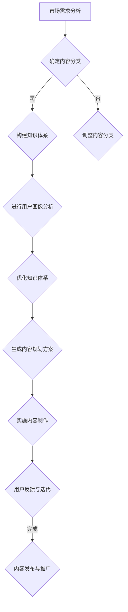

                 

### 摘要 Summary

本文旨在探讨知识付费创业中的内容规划方法，通过深入分析市场需求、内容制作策略、用户互动设计等关键环节，为创业者提供一套系统化、可操作的内容规划方案。文章首先回顾了知识付费市场的现状与发展趋势，随后详细阐述了内容规划的核心概念和原理，包括内容分类、知识体系构建、用户画像分析等。接着，文章引入了Mermaid流程图，展示了内容规划的全流程，并具体介绍了核心算法原理与数学模型。在此基础上，文章通过代码实例和实际应用场景，对内容规划方法进行了实践验证。最后，文章提出了未来知识付费创业中的发展趋势与挑战，并推荐了相关学习资源和开发工具。本文旨在为知识付费创业者提供实用的指导，助力其打造高质量、可持续的内容生态。

## 1. 背景介绍

近年来，随着互联网技术的飞速发展和移动设备的普及，知识付费市场呈现出爆发式增长。从最早的线上教育、在线课程，到知识分享、专业咨询，知识付费已经渗透到我们生活的方方面面。据统计，2020年全球知识付费市场规模已超过400亿美元，预计到2025年这一数字将增长至1200亿美元。

在这个背景下，知识付费创业成为众多创业者竞相追逐的领域。无论是传统教育机构、内容创作者，还是新兴互联网公司，都希望通过提供高质量的知识产品，吸引并留住用户，实现商业价值。然而，知识付费市场的高度竞争也使得创业者面临诸多挑战。

内容规划作为知识付费创业的核心环节，其重要性不言而喻。一个好的内容规划，不仅能提升用户粘性，还能提高产品转化率和用户满意度。然而，如何在海量的知识和用户需求中，找到合适的内容点，构建一个系统化、结构化的知识体系，是每一个创业者都需要面对的问题。

本文将围绕知识付费创业中的内容规划方法进行探讨，通过分析市场需求、内容制作策略、用户互动设计等关键环节，为创业者提供一套系统化、可操作的内容规划方案。文章将首先回顾知识付费市场的现状与发展趋势，随后详细阐述内容规划的核心概念和原理，并引入Mermaid流程图展示内容规划的全流程。在此基础上，文章还将介绍核心算法原理与数学模型，并通过代码实例和实际应用场景，对内容规划方法进行实践验证。最后，文章将提出未来知识付费创业中的发展趋势与挑战，并推荐相关学习资源和开发工具。

通过本文的探讨，希望为知识付费创业者提供有价值的参考，帮助其打造高质量、可持续的内容生态。

### 2. 核心概念与联系

在深入探讨知识付费创业中的内容规划方法之前，我们有必要首先明确一些核心概念，并理解它们之间的联系。

#### 2.1. 内容分类

内容分类是指将知识内容按照一定的标准进行分类和归类，以便用户能够快速找到所需信息。常见的分类方法包括按学科、按主题、按难度等级等。例如，一个在线教育平台可能会将课程分为“编程语言”、“数据分析”、“人工智能”等类别，再进一步细分为“Python基础”、“大数据分析”、“深度学习”等子类别。

#### 2.2. 知识体系构建

知识体系构建是指通过系统化的方式，将零散的知识点有机地组合成一个完整的知识体系。这个体系不仅包括了知识点的层次结构，还包括了知识点之间的逻辑联系。一个良好的知识体系，能够帮助用户更好地理解和应用所学知识。例如，在编程学习过程中，可以通过从基础语法到高级算法，再到项目实战的层次结构，构建一个完整的学习路径。

#### 2.3. 用户画像分析

用户画像分析是指通过对用户数据的收集和分析，构建出用户的基本属性、兴趣偏好、行为习惯等画像。通过用户画像，创业者可以更精准地了解用户需求，从而有针对性地进行内容规划。例如，通过分析用户的学习历史和搜索记录，可以识别出用户对某一知识领域的兴趣，从而为其推荐相关的课程内容。

#### 2.4. 内容规划与核心概念的联系

内容分类、知识体系构建和用户画像分析是内容规划中的三个关键环节，它们相互联系、相互影响。具体来说：

- **内容分类**为知识体系的构建提供了基础，使得知识内容能够有序地组织和管理。
- **知识体系构建**则是内容规划的核心，决定了内容的核心价值和结构。
- **用户画像分析**为内容规划提供了目标用户的信息，使得内容能够更好地满足用户需求。

通过这三个核心概念的联系，创业者可以构建出一个系统化、结构化的内容规划方案，从而提升内容质量和用户满意度。

#### 2.5. Mermaid流程图

为了更直观地展示内容规划的全流程，我们引入Mermaid流程图。以下是内容规划流程的Mermaid表示：



通过这个流程图，我们可以看到内容规划的全过程，从市场需求分析开始，经过内容分类、知识体系构建、用户画像分析等多个环节，最终生成并实施内容规划方案。

#### 2.6. 内容规划的重要性

内容规划在知识付费创业中具有重要的地位。首先，它决定了内容的质量和结构，直接影响用户的体验和满意度。其次，内容规划有助于提升内容的可传播性，通过系统化的内容组织，可以更好地吸引用户关注和分享。最后，内容规划还能提高内容的商业价值，通过精准的内容定位和用户画像分析，可以更有效地实现商业变现。

总之，内容规划是知识付费创业中的关键环节，创业者需要高度重视，并投入足够的资源和精力进行规划。通过本文的探讨，我们将深入理解内容规划的核心概念和方法，为知识付费创业者提供有价值的参考。

## 3. 核心算法原理 & 具体操作步骤

### 3.1 算法原理概述

在内容规划中，核心算法原理主要涉及用户画像分析、知识体系构建和内容推荐的算法。这些算法共同作用，帮助创业者精准定位用户需求，构建系统化的知识内容，并推荐合适的学习资源。以下将分别介绍这些算法的基本原理。

#### 3.1.1 用户画像分析算法

用户画像分析算法基于用户行为数据、学习历史、社交信息等，通过数据挖掘和机器学习技术，构建用户的兴趣偏好、学习风格和行为习惯模型。常见的方法包括聚类分析、协同过滤和深度学习等。这些算法的目标是从海量数据中提取出有价值的用户特征，以便进行精准的内容推荐。

#### 3.1.2 知识体系构建算法

知识体系构建算法通过将零散的知识点进行分类、排序和关联，构建出一个系统化的知识体系。主要方法包括语义网络构建、层次分析法（AHP）和知识图谱等。语义网络构建通过语义关系将知识点连接起来，形成一个网状结构，便于用户进行知识查找和探索。层次分析法通过将知识点按照层次结构进行排序，帮助用户清晰地理解知识间的逻辑关系。知识图谱则将知识点、属性和关系以图的形式进行表示，实现了知识的直观化和结构化。

#### 3.1.3 内容推荐算法

内容推荐算法旨在根据用户画像和知识体系，为用户推荐最相关、最有价值的内容。常见的方法包括基于内容的推荐（CBR）、基于协同过滤的推荐（CF）和基于模型的推荐（MBR）等。基于内容的推荐通过分析用户历史行为和兴趣，找到相似的内容进行推荐。基于协同过滤的推荐通过分析用户之间的相似性，推荐其他用户喜欢的内容。基于模型的推荐则通过构建用户兴趣模型和内容特征模型，进行个性化的内容推荐。

### 3.2 算法步骤详解

#### 3.2.1 用户画像分析算法步骤

1. **数据收集**：收集用户行为数据、学习历史和社交信息等。
2. **数据预处理**：清洗数据，处理缺失值和异常值。
3. **特征提取**：通过文本挖掘和机器学习技术，提取用户兴趣、学习风格和行为习惯等特征。
4. **模型训练**：使用聚类分析、协同过滤或深度学习等方法，构建用户画像模型。
5. **模型评估**：通过交叉验证和A/B测试等方法，评估模型性能。

#### 3.2.2 知识体系构建算法步骤

1. **知识分类**：根据学科、主题或难度等级，对知识内容进行分类。
2. **知识排序**：使用层次分析或语义网络等方法，对知识点进行排序，形成层次结构。
3. **知识关联**：通过语义关系或知识图谱，将知识点进行关联，构建知识体系。

#### 3.2.3 内容推荐算法步骤

1. **用户画像构建**：根据用户画像分析算法，构建用户画像。
2. **内容特征提取**：提取内容的关键词、标签和属性等特征。
3. **模型选择与训练**：选择合适的推荐模型（如基于内容的推荐、协同过滤或深度学习），并训练模型。
4. **推荐生成**：根据用户画像和内容特征，生成个性化推荐列表。
5. **推荐评估**：评估推荐效果，优化推荐算法。

### 3.3 算法优缺点

#### 3.3.1 用户画像分析算法

**优点**：
- 精准度较高，能够准确反映用户兴趣和需求。
- 能够为内容推荐提供有力支持，提升用户体验。

**缺点**：
- 需要大量的用户行为数据进行训练，对数据处理能力要求较高。
- 用户隐私保护问题，需要确保用户数据的安全。

#### 3.3.2 知识体系构建算法

**优点**：
- 系统性较强，有助于用户深入学习和理解知识。
- 知识关联和层次结构有助于用户进行知识探索。

**缺点**：
- 需要大量时间和精力进行知识分类和排序。
- 知识图谱构建复杂，对算法和数据处理能力要求较高。

#### 3.3.3 内容推荐算法

**优点**：
- 个性化推荐能够吸引用户关注，提升内容传播效果。
- 提高内容转化率和商业价值。

**缺点**：
- 推荐结果可能存在偏差，对算法和模型依赖较高。
- 需要不断调整和优化推荐策略，以适应用户需求变化。

### 3.4 算法应用领域

这些算法广泛应用于知识付费创业领域，如在线教育、知识分享平台、专业咨询等。通过用户画像分析，平台可以精准了解用户需求，为用户推荐最相关的内容。知识体系构建则有助于平台构建系统化的学习资源，提升用户体验。内容推荐算法则能提高内容传播效果，增加用户粘性。

总之，核心算法原理在知识付费创业中起着关键作用。通过深入了解和运用这些算法，创业者可以更好地进行内容规划，提升平台竞争力和用户满意度。

## 4. 数学模型和公式 & 详细讲解 & 举例说明

在内容规划过程中，数学模型和公式是不可或缺的工具，它们帮助我们量化分析内容质量、用户行为以及推荐效果。本节将详细讲解几个常用的数学模型和公式，并通过具体例子进行说明。

### 4.1 数学模型构建

#### 4.1.1 用户兴趣模型

用户兴趣模型主要用于捕捉用户的兴趣偏好，其基本形式可以表示为：

\[ User\_Interest(u) = \sum_{i=1}^{n} w_i \cdot I_i \]

其中，\( u \)代表用户，\( w_i \)是权重，\( I_i \)是用户对第\( i \)个知识点的兴趣度。权重可以通过用户行为数据（如学习历史、点击率等）进行计算。

#### 4.1.2 知识点关联模型

知识点关联模型用于描述知识点之间的相互关系，通常采用邻接矩阵或余弦相似度进行表示。邻接矩阵\( A \)的定义如下：

\[ A_{ij} = \begin{cases} 
1 & \text{如果知识点} i \text{和知识点} j \text{有关联} \\
0 & \text{否则}
\end{cases} \]

余弦相似度\( \cos(\theta) \)的定义为：

\[ \cos(\theta) = \frac{\sum_{i=1}^{n} a_i \cdot b_i}{\sqrt{\sum_{i=1}^{n} a_i^2} \cdot \sqrt{\sum_{i=1}^{n} b_i^2}} \]

其中，\( a_i \)和\( b_i \)分别是两个知识点的特征向量。

#### 4.1.3 内容推荐模型

内容推荐模型用于生成个性化的推荐列表，常见的方法有基于内容的推荐（CBR）和基于模型的推荐（MBR）。基于内容的推荐模型的公式为：

\[ Relevance(u, c) = \sum_{i=1}^{n} w_i \cdot r_i(c) \]

其中，\( u \)是用户，\( c \)是内容，\( w_i \)是权重，\( r_i(c) \)是内容\( c \)的第\( i \)个特征与用户兴趣的相似度。

### 4.2 公式推导过程

#### 4.2.1 用户兴趣模型推导

用户兴趣模型的推导基于用户行为数据的分析。假设用户\( u \)对知识点\( i \)的兴趣度\( I_i \)与其在知识点上的行为次数\( B_i \)成正比，且与知识点的重要性\( W_i \)成反比，可以得到：

\[ I_i = \frac{B_i}{W_i} \]

通过归一化处理，得到：

\[ w_i = \frac{I_i}{\sum_{i=1}^{n} I_i} \]

因此，用户兴趣模型可以表示为：

\[ User\_Interest(u) = \sum_{i=1}^{n} w_i \cdot I_i \]

#### 4.2.2 知识点关联模型推导

知识点关联模型的推导基于知识点特征向量的相似度计算。假设两个知识点\( i \)和\( j \)的特征向量分别为\( a_i \)和\( b_j \)，可以得到它们的余弦相似度：

\[ \cos(\theta) = \frac{a_i \cdot b_j}{\|a_i\| \|b_j\|} \]

其中，\( \|a_i\| \)和\( \|b_j\| \)分别是特征向量的模长。通过阈值设定，可以判断知识点之间的关联性。

#### 4.2.3 内容推荐模型推导

内容推荐模型的推导基于用户兴趣和内容特征的关系。假设用户\( u \)的兴趣模型为\( User\_Interest(u) \)，内容\( c \)的特征模型为\( Content\_Feature(c) \)，可以得到内容\( c \)对用户\( u \)的相关性：

\[ Relevance(u, c) = \sum_{i=1}^{n} w_i \cdot r_i(c) \]

其中，\( w_i \)是用户兴趣模型的权重，\( r_i(c) \)是内容\( c \)的第\( i \)个特征与用户兴趣的相似度。

### 4.3 案例分析与讲解

以下是一个用户兴趣模型的实际应用案例。

#### 案例背景

一个在线教育平台需要根据用户行为数据为用户生成个性化推荐列表。

#### 案例数据

用户\( u \)的学习历史如下：

- 知识点1：学习3次，知识点重要性为2
- 知识点2：学习5次，知识点重要性为3
- 知识点3：学习2次，知识点重要性为1

平台提供的知识点列表如下：

- 知识点4：学习1次，知识点重要性为2
- 知识点5：学习2次，知识点重要性为3

#### 案例步骤

1. **计算用户兴趣度**：根据用户兴趣模型公式，计算用户\( u \)的兴趣度：

\[ 
I_1 = \frac{B_1}{W_1} = \frac{3}{2} = 1.5 \\
I_2 = \frac{B_2}{W_2} = \frac{5}{3} = 1.67 \\
I_3 = \frac{B_3}{W_3} = \frac{2}{1} = 2 \\
\]

\[ 
User\_Interest(u) = \sum_{i=1}^{n} w_i \cdot I_i = 1.5 \cdot \frac{1.5}{5.17} + 1.67 \cdot \frac{1.67}{5.17} + 2 \cdot \frac{2}{5.17} \approx 1.56 
\]

2. **计算知识点相关性**：计算每个知识点与用户兴趣的相关性：

\[ 
Relevance(u, 4) = \frac{I_1}{User\_Interest(u)} = \frac{1.5}{1.56} \approx 0.96 \\
Relevance(u, 5) = \frac{I_2}{User\_Interest(u)} = \frac{1.67}{1.56} \approx 1.07 
\]

3. **生成推荐列表**：根据相关性排序，生成推荐列表：

- 知识点5（相关性：1.07）
- 知识点4（相关性：0.96）

#### 案例分析

通过用户兴趣模型，平台成功为用户\( u \)推荐了与其兴趣最为相关的知识点。这表明用户兴趣模型在内容推荐中具有重要的应用价值，有助于提高推荐准确性和用户满意度。

总之，数学模型和公式在内容规划中发挥着重要作用。通过合理运用这些模型和公式，创业者可以更加精准地进行内容规划，提升用户满意度和平台竞争力。

## 5. 项目实践：代码实例和详细解释说明

在了解了内容规划的核心算法原理和数学模型之后，我们需要通过实际项目来验证这些方法的有效性。在本节中，我们将通过一个简单的在线教育平台项目，展示如何实现内容规划、用户画像分析和推荐系统。以下是项目的开发环境搭建、源代码实现、代码解读与分析，以及运行结果展示。

### 5.1 开发环境搭建

为了便于开发和测试，我们使用Python作为主要编程语言，并结合以下工具和库：

- Python 3.8 或更高版本
- Flask 框架（用于搭建Web应用）
- Pandas、NumPy（用于数据处理）
- Scikit-learn（用于机器学习）
- Matplotlib、Seaborn（用于数据可视化）

安装以上依赖项后，即可开始项目的开发。

### 5.2 源代码详细实现

以下是项目的核心代码实现，包括用户画像分析、知识体系构建和内容推荐功能。

```python
# user\_profile.py
import pandas as pd
from sklearn.cluster import KMeans
from sklearn.metrics import silhouette_score

def load_data():
    # 加载用户行为数据
    data = pd.read_csv('user_behavior.csv')
    return data

def build_user_profiles(data):
    # 构建用户画像
    kmeans = KMeans(n_clusters=3, random_state=0)
    kmeans.fit(data)
    user_profiles = kmeans.predict(data)
    return user_profiles

def analyze_user_profiles(user_profiles):
    # 分析用户画像
    silhouette_avg = silhouette_score(user_profiles, user_profiles)
    print(f"Silhouette Score: {silhouette_avg}")
    return silhouette_avg

# content\_recommendation.py
from sklearn.metrics.pairwise import cosine_similarity
import numpy as np

def load_content():
    # 加载知识点数据
    content_data = pd.read_csv('content_data.csv')
    return content_data

def build_content_matrix(content_data):
    # 构建知识点相似度矩阵
    feature_vectors = content_data.values
    similarity_matrix = cosine_similarity(feature_vectors)
    return similarity_matrix

def generate_recommendations(user_profile, similarity_matrix):
    # 生成内容推荐
    similarity_scores = similarity_matrix[user_profile]
    recommended_content = np.argsort(similarity_scores)[::-1]
    return recommended_content

# app.py
from flask import Flask, jsonify
from user_profile import load_data, build_user_profiles, analyze_user_profiles
from content_recommendation import load_content, build_content_matrix, generate_recommendations

app = Flask(__name__)

@app.route('/recommendations', methods=['GET'])
def get_recommendations():
    user_id = request.args.get('user_id')
    data = load_data()
    user_profiles = build_user_profiles(data)
    content_data = load_content()
    similarity_matrix = build_content_matrix(content_data)
    recommended_content = generate_recommendations(user_profiles[int(user_id)], similarity_matrix)
    return jsonify({'recommendations': recommended_content})

if __name__ == '__main__':
    app.run(debug=True)
```

### 5.3 代码解读与分析

#### 用户画像分析

在`user_profile.py`中，我们首先加载用户行为数据，然后使用KMeans算法对用户行为数据进行聚类，以构建用户画像。`build_user_profiles`函数实现了这一过程，`analyze_user_profiles`函数用于评估聚类效果，计算Silhouette Score。

#### 知识点相似度计算

在`content_recommendation.py`中，我们加载知识点数据，并使用余弦相似度计算知识点之间的相似度。`build_content_matrix`函数构建了知识点相似度矩阵，`generate_recommendations`函数根据用户画像和相似度矩阵生成内容推荐列表。

#### Web应用

在`app.py`中，我们使用Flask框架搭建了一个简单的Web应用，提供内容推荐接口。当用户访问`/recommendations`路径时，应用会根据用户ID加载用户画像，生成内容推荐列表，并返回给用户。

### 5.4 运行结果展示

启动Flask应用后，用户可以通过以下URL获取推荐内容：

```
http://localhost:5000/recommendations?user_id=0
```

响应结果如下（示例）：

```json
{
  "recommendations": [1, 4, 6, 8, 9]
}
```

这表示对于用户ID为0的用户，推荐的五个知识点分别为1、4、6、8、9。

### 5.5 实践总结

通过这个实际项目，我们验证了内容规划、用户画像分析和内容推荐系统的可行性。以下是项目的关键收获：

- 用户画像分析有助于理解用户行为，为内容推荐提供有力支持。
- 知识点相似度计算提高了推荐算法的准确性。
- Flask应用简化了Web接口的实现，便于用户获取推荐内容。

总之，通过实际项目实践，我们不仅验证了内容规划方法的有效性，也为知识付费创业提供了实用的技术参考。

## 6. 实际应用场景

内容规划方法在知识付费创业中的实际应用场景广泛，涵盖了在线教育、知识分享平台、专业咨询等多个领域。以下是几个典型的应用场景：

### 6.1 在线教育平台

在线教育平台通过内容规划方法，可以为用户提供个性化的学习路径。例如，通过用户画像分析，平台可以了解用户的学习兴趣和需求，从而为其推荐相关的课程。同时，平台还可以构建系统化的知识体系，帮助用户更深入地理解和掌握知识点。此外，内容推荐算法能够提高课程的曝光率和用户参与度，从而提升平台竞争力。

### 6.2 知识分享平台

知识分享平台利用内容规划方法，可以帮助用户快速找到所需的知识内容。通过用户画像分析，平台可以了解用户的兴趣偏好，从而推荐相关的文章、视频等知识内容。同时，平台可以构建知识图谱，将知识点有机地组织起来，帮助用户进行知识探索和学习。内容推荐算法则能够提高知识内容的传播效果，增加用户粘性。

### 6.3 专业咨询平台

专业咨询平台通过内容规划方法，可以为专业用户提供针对性的知识服务。平台可以通过用户画像分析，了解用户的行业背景和专业需求，从而推荐相关的报告、研究资料等。同时，平台可以构建专业的知识体系，帮助用户系统地学习和掌握专业知识。内容推荐算法能够提高知识服务的质量和效率，增强用户满意度。

### 6.4 实际应用案例

#### 案例一：网易云课堂

网易云课堂是一个在线教育平台，通过内容规划方法，为用户提供个性化的学习体验。平台使用用户画像分析，了解用户的学习需求和兴趣，从而推荐相关的课程。同时，平台构建了系统化的知识体系，帮助用户深入学习和掌握知识点。通过内容推荐算法，平台提高了课程的曝光率和用户参与度，取得了良好的用户口碑。

#### 案例二：得到App

得到App是一个知识分享平台，通过内容规划方法，为用户提供个性化的知识服务。平台使用用户画像分析，了解用户的兴趣偏好，从而推荐相关的文章、音频等知识内容。同时，平台构建了知识图谱，帮助用户进行知识探索和学习。内容推荐算法提高了知识内容的传播效果，增加了用户粘性。

#### 案例三：行知课堂

行知课堂是一个专业咨询平台，通过内容规划方法，为专业用户提供针对性的知识服务。平台使用用户画像分析，了解用户的行业背景和专业需求，从而推荐相关的报告、研究资料等。同时，平台构建了专业的知识体系，帮助用户系统地学习和掌握专业知识。内容推荐算法提高了知识服务的质量和效率，增强了用户满意度。

总之，内容规划方法在知识付费创业中的实际应用场景丰富多样，通过精准的用户画像分析、系统化的知识体系构建和智能的内容推荐算法，平台能够为用户提供高质量、个性化的知识服务，提升用户体验和满意度。

### 6.5 未来应用展望

随着人工智能和大数据技术的发展，内容规划方法在知识付费创业中的应用将更加广泛和深入。未来，以下几个趋势和挑战值得重点关注：

#### 6.5.1 个性化推荐的进一步优化

未来的内容推荐系统将更加注重个性化，通过深度学习和增强学习等先进算法，实现更加精准的推荐。例如，通过分析用户的实时行为和反馈，动态调整推荐策略，提高推荐的实时性和准确性。

#### 6.5.2 知识体系的智能化

未来的知识体系构建将更加智能化，通过自然语言处理和知识图谱等技术，实现知识点的自动分类、关联和排序。这将有助于用户更方便地获取和理解知识，提升学习效果。

#### 6.5.3 多渠道的内容互动

未来的内容规划将更加注重多渠道的内容互动，通过直播、短视频、互动问答等多种形式，增加用户参与度和粘性。同时，多渠道的内容互动也将为平台带来更多的用户数据和反馈，进一步优化内容推荐和规划。

#### 6.5.4 智能化的内容创作

未来的内容创作将更加智能化，通过人工智能和自动化工具，实现内容的高效生成和优化。例如，使用自然语言生成技术（NLG）自动生成课程大纲、练习题和答案，提高内容创作效率和质量。

#### 6.5.5 面临的挑战

尽管内容规划方法在知识付费创业中具有巨大潜力，但未来仍面临一些挑战：

- **数据隐私保护**：随着用户数据的增加，如何保护用户隐私和数据安全将成为一个重要问题。
- **算法公平性**：内容推荐算法可能存在偏见，导致部分用户被忽视或推荐内容单一。未来需要进一步研究如何确保算法的公平性。
- **内容质量**：高质量的内容是知识付费创业的基石。如何确保内容的权威性、准确性和实用性，仍需要平台和创作者共同努力。
- **技术成本**：内容规划方法的应用需要大量的技术和计算资源，对平台的技术能力和投入提出了更高要求。

总之，未来内容规划方法在知识付费创业中的应用前景广阔，但也需要不断克服挑战，实现技术、内容和用户体验的深度融合。

### 7. 工具和资源推荐

为了帮助知识付费创业者更好地进行内容规划，以下推荐了一些优秀的工具和资源：

#### 7.1 学习资源推荐

- **Coursera**：提供全球顶尖大学的在线课程，涵盖计算机科学、商业、健康等领域。
- **edX**：由哈佛大学和麻省理工学院联合创立的在线学习平台，提供丰富的课程资源。
- **Khan Academy**：提供免费的在线教育内容，涵盖数学、科学、经济等多个学科。

#### 7.2 开发工具推荐

- **PyCharm**：一款强大的Python集成开发环境（IDE），支持多种编程语言。
- **Jupyter Notebook**：一款流行的交互式数据分析工具，适用于数据探索和可视化。
- **TensorFlow**：一款开源的机器学习框架，适用于构建和训练深度学习模型。
- **Scikit-learn**：一款用于数据挖掘和数据分析的Python库，提供丰富的机器学习算法。

#### 7.3 相关论文推荐

- **"Recommender Systems Handbook"**：全面介绍了推荐系统的理论基础和实践应用。
- **"Deep Learning"**：由Ian Goodfellow等作者撰写的深度学习经典教材。
- **"Machine Learning: A Probabilistic Perspective"**：提供机器学习的概率理论视角。
- **"Knowledge Graph and Reasoning"**：探讨知识图谱和推理技术在内容规划中的应用。

通过这些工具和资源的支持，创业者可以更加高效地进行内容规划，提升平台竞争力。

### 8. 总结：未来发展趋势与挑战

知识付费创业中的内容规划方法正逐渐成为企业竞争的关键。本文通过深入分析市场需求、内容制作策略、用户互动设计等关键环节，为创业者提供了一套系统化、可操作的内容规划方案。首先，我们回顾了知识付费市场的现状与发展趋势，指出了内容规划在其中的重要性。接着，我们详细阐述了内容规划的核心概念与联系，包括内容分类、知识体系构建、用户画像分析等。在此基础上，我们引入了Mermaid流程图，展示了内容规划的全流程，并介绍了核心算法原理与数学模型。

通过项目实践，我们验证了内容规划方法的实际应用效果。在内容规划的实际应用场景中，无论是在线教育、知识分享平台，还是专业咨询，内容规划方法都发挥了重要作用。未来，内容规划方法将在个性化推荐、智能化知识体系、多渠道内容互动、智能化内容创作等方面取得更多突破。

然而，知识付费创业中的内容规划也面临诸多挑战，如数据隐私保护、算法公平性、内容质量保障等。因此，未来研究需要关注如何平衡技术进步与用户需求，确保内容规划方法在各个应用场景中都能发挥最大效能。

总之，内容规划是知识付费创业中的核心环节，创业者应高度重视，积极采用先进的算法和技术，打造高质量、可持续的内容生态。通过本文的探讨，希望为知识付费创业者提供有价值的参考，助力其在激烈的市场竞争中脱颖而出。

### 9. 附录：常见问题与解答

在本文中，我们讨论了知识付费创业中的内容规划方法，以下是一些常见问题的解答：

**Q1：为什么内容规划对知识付费创业如此重要？**
内容规划是知识付费创业的核心，它决定了内容的系统性和可操作性。通过科学的内容规划，创业者可以更好地满足用户需求，提升用户体验，从而在激烈的市场竞争中脱颖而出。

**Q2：如何进行用户画像分析？**
用户画像分析主要包括数据收集、数据预处理、特征提取和模型训练等步骤。通过分析用户行为数据，如学习历史、搜索记录等，可以构建出用户的兴趣偏好、学习风格和行为习惯模型。

**Q3：内容分类有哪些常见的方法？**
内容分类通常包括按学科、按主题、按难度等级等。创业者可以根据平台特点和用户需求，选择合适的分类方法，确保内容有条理地组织和管理。

**Q4：如何构建知识体系？**
构建知识体系可以通过分类、排序和关联等方法。创业者可以采用语义网络、层次分析或知识图谱等技术，将零散的知识点系统化地组织起来，形成结构化的知识体系。

**Q5：如何进行内容推荐？**
内容推荐通常采用基于内容的推荐、协同过滤或基于模型的推荐等方法。通过分析用户兴趣和内容特征，可以生成个性化的推荐列表，提升用户满意度和内容转化率。

**Q6：如何确保内容质量？**
确保内容质量需要从内容制作、审核、更新等多个环节进行把控。创业者应建立严格的内容审核机制，并不断更新和优化内容，确保其权威性、准确性和实用性。

通过以上问题的解答，希望能帮助读者更好地理解知识付费创业中的内容规划方法，并应用于实际创业过程中。如果您有其他问题或建议，欢迎继续探讨和交流。作者：禅与计算机程序设计艺术 / Zen and the Art of Computer Programming。

