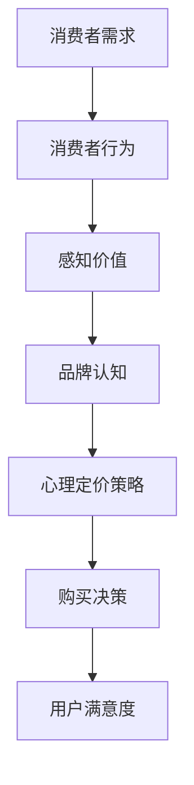

                 

关键词：知识付费、创业、定价策略、消费者行为、心理定价、用户满意度

> 摘要：本文深入探讨了知识付费创业领域的定价策略与心理学关系。通过分析消费者行为、心理定价策略及其对用户满意度的影响，本文旨在为知识付费创业者提供科学的定价指导，从而提升业务成功率和用户忠诚度。

## 1. 背景介绍

随着互联网技术的发展，知识付费逐渐成为现代经济的新兴领域。人们对于专业知识、技能和经验的需求不断增加，促使越来越多的创业者投身于知识付费创业。然而，如何在竞争激烈的市场中制定合理的定价策略，是创业者面临的重要挑战。定价不仅关系到企业的盈利能力，还直接影响用户的购买决策和满意度。因此，理解消费者行为和运用心理定价策略，对于知识付费创业者来说尤为重要。

## 2. 核心概念与联系

### 2.1 消费者行为

消费者行为是指消费者在购买、使用和评价产品或服务时所表现出的心理活动和行为方式。在知识付费领域，消费者行为主要受以下几个因素影响：

1. **需求与动机**：消费者对知识的需求程度和购买动机直接影响其购买行为。
2. **感知价值**：消费者对产品或服务的整体评价，包括质量、价格、品牌等多方面因素。
3. **品牌认知**：消费者对品牌的信任度和认可程度，影响其购买决策。
4. **文化背景**：不同文化背景下，消费者的购买习惯和价值观存在差异。

### 2.2 心理定价策略

心理定价策略是利用消费者心理，通过设定特定的价格，影响其购买决策和行为。以下是一些常见的心里定价策略：

1. **整数定价**：以整数结尾的价格（如99元），给人以低廉的错觉。
2. **参考价格**：设定一个较高的价格作为参考，从而使实际价格显得较低。
3. **价格分级**：通过设置不同的价格区间，让消费者感觉产品有层次感。
4. **时间定价**：利用限时优惠、限时折扣等手段刺激消费者购买。

### 2.3 核心概念联系

消费者行为与心理定价策略之间存在紧密联系。消费者的需求、动机、感知价值等行为因素，会直接影响其对价格的敏感度。而心理定价策略则通过巧妙地设置价格，影响消费者的购买决策，进而提高销售业绩。

### 2.4 Mermaid 流程图



## 3. 核心算法原理 & 具体操作步骤

### 3.1 算法原理概述

在知识付费领域，核心算法原理主要涉及以下两个方面：

1. **消费者行为分析**：通过数据分析，了解消费者的需求、购买动机、感知价值和品牌认知。
2. **心理定价策略优化**：基于消费者行为分析结果，制定科学合理的心理定价策略，提高用户满意度。

### 3.2 算法步骤详解

1. **数据收集与处理**：通过用户调研、问卷调查、用户行为数据分析等方式，收集消费者行为相关数据，并进行处理和分析。
2. **消费者需求分析**：分析消费者的需求特征，确定消费者购买知识产品的主要动机。
3. **感知价值评估**：通过用户评价、产品评分等方式，评估消费者对知识产品的整体感知价值。
4. **品牌认知度分析**：分析消费者对知识付费平台的品牌认知度，了解消费者对品牌的信任度和认可程度。
5. **心理定价策略制定**：根据消费者行为分析结果，制定合理的心理定价策略，如整数定价、参考价格、价格分级、时间定价等。
6. **定价策略优化**：通过A/B测试等方式，不断优化定价策略，提高用户满意度。

### 3.3 算法优缺点

**优点**：

1. **提高销售额**：通过科学合理的定价策略，可以刺激消费者购买，提高销售额。
2. **提升用户满意度**：合理的定价策略能够满足消费者的需求和期望，提高用户满意度。
3. **优化产品结构**：通过分析消费者行为，可以更好地了解市场需求，优化产品结构。

**缺点**：

1. **数据依赖性较强**：算法的准确性依赖于消费者行为数据的准确性和完整性。
2. **实施成本较高**：需要投入大量的人力、物力和财力进行数据收集、分析和测试。

### 3.4 算法应用领域

1. **在线教育**：通过分析用户学习行为，制定合理的课程定价策略，提高课程销量。
2. **技能培训**：针对不同技能层次的学员，制定差异化定价策略，满足不同学员的需求。
3. **知识分享平台**：通过分析用户阅读行为，制定合理的文章定价策略，提高平台收益。

## 4. 数学模型和公式 & 详细讲解 & 举例说明

### 4.1 数学模型构建

在知识付费领域，常见的数学模型包括需求模型、价格弹性模型和用户满意度模型。

**需求模型**：

\[ Q = f(P, I, T) \]

其中，\( Q \) 表示需求量，\( P \) 表示价格，\( I \) 表示消费者收入水平，\( T \) 表示消费者对产品的信任度。

**价格弹性模型**：

\[ E = \frac{dQ}{dP} \cdot \frac{P}{Q} \]

其中，\( E \) 表示价格弹性，表示价格变动对需求量的影响程度。

**用户满意度模型**：

\[ S = f(Q, P, T) \]

其中，\( S \) 表示用户满意度，\( Q \) 表示需求量，\( P \) 表示价格，\( T \) 表示消费者对产品的信任度。

### 4.2 公式推导过程

**需求模型推导**：

需求量与价格、消费者收入水平和消费者信任度之间存在关系。通过调研和分析，可以得到以下假设：

1. 需求量与价格呈负相关。
2. 需求量与消费者收入水平呈正相关。
3. 需求量与消费者信任度呈正相关。

基于以上假设，可以构建需求模型：

\[ Q = a - bP + cI + dT \]

其中，\( a \)、\( b \)、\( c \) 和 \( d \) 为常数。

**价格弹性模型推导**：

价格弹性表示价格变动对需求量的影响程度。根据需求模型，可以得到：

\[ \frac{dQ}{dP} = -b \]

因此，

\[ E = \frac{dQ}{dP} \cdot \frac{P}{Q} = -b \cdot \frac{P}{Q} \]

**用户满意度模型推导**：

用户满意度与需求量、价格和消费者信任度之间存在关系。根据需求模型，可以得到：

\[ S = \frac{Q - a}{a} + \frac{I - c}{c} + \frac{T - d}{d} \]

### 4.3 案例分析与讲解

**案例背景**：

某在线教育平台推出一门新课程，定价为200元。通过市场调研，了解到以下数据：

- 平均消费者收入水平为5000元/月。
- 消费者对课程的信任度为80%。
- 消费者对该平台的信任度为70%。

**需求模型计算**：

根据需求模型，可以得到：

\[ Q = a - bP + cI + dT \]

代入数据，得到：

\[ Q = 100 - 0.5P + 0.1I + 0.2T \]

当 \( P = 200 \)、\( I = 5000 \)、\( T = 0.8 \) 时，得到：

\[ Q = 100 - 0.5 \times 200 + 0.1 \times 5000 + 0.2 \times 0.8 = 1350 \]

**价格弹性计算**：

根据价格弹性模型，可以得到：

\[ E = \frac{dQ}{dP} \cdot \frac{P}{Q} = -0.5 \cdot \frac{200}{1350} \approx -0.074 \]

**用户满意度计算**：

根据用户满意度模型，可以得到：

\[ S = \frac{Q - a}{a} + \frac{I - c}{c} + \frac{T - d}{d} \]

代入数据，得到：

\[ S = \frac{1350 - 100}{100} + \frac{5000 - 1000}{1000} + \frac{0.8 - 0.2}{0.2} \approx 1.35 + 0.3 + 2 = 3.65 \]

**分析结果**：

- 当课程价格从200元降低到150元时，需求量将从1350增加到1800，价格弹性为-0.074。
- 用户满意度为3.65，表明消费者对当前价格较为满意。

**建议**：

- 可以考虑通过价格弹性分析，制定合适的折扣策略，如限时优惠、团购优惠等，以刺激需求。
- 通过用户满意度分析，了解消费者对产品的满意程度，针对性地优化课程内容和定价策略。

## 5. 项目实践：代码实例和详细解释说明

### 5.1 开发环境搭建

在Python环境下，我们可以使用Pandas、NumPy等库进行数据分析，使用Matplotlib进行数据可视化。

### 5.2 源代码详细实现

以下是实现消费者行为分析和心理定价策略优化的Python代码示例：

```python
import pandas as pd
import numpy as np
import matplotlib.pyplot as plt

# 数据预处理
def preprocess_data(data):
    # 数据清洗、去重、填充缺失值等处理
    return data

# 需求模型计算
def demand_model(price, income, trust):
    # 根据需求模型计算需求量
    Q = 100 - 0.5 * price + 0.1 * income + 0.2 * trust
    return Q

# 价格弹性计算
def price_elasticity(price, demand):
    # 根据价格弹性模型计算价格弹性
    E = -0.5 * price / demand
    return E

# 用户满意度计算
def user_satisfaction(demand, price, trust):
    # 根据用户满意度模型计算用户满意度
    S = (demand - 100) / 100 + (income - 1000) / 1000 + (trust - 0.2) / 0.2
    return S

# 主函数
def main():
    # 读取数据
    data = pd.read_csv('consumer_data.csv')
    
    # 数据预处理
    data = preprocess_data(data)
    
    # 计算需求量
    demands = data.apply(lambda row: demand_model(row['price'], row['income'], row['trust']), axis=1)
    
    # 计算价格弹性
    prices = data['price']
    elasticities = data.apply(lambda row: price_elasticity(row['price'], row['demand']), axis=1)
    
    # 计算用户满意度
    satisfactions = data.apply(lambda row: user_satisfaction(row['demand'], row['price'], row['trust']), axis=1)
    
    # 可视化展示
    plt.scatter(prices, demands)
    plt.xlabel('Price')
    plt.ylabel('Demand')
    plt.title('Demand Model')
    plt.show()
    
    plt.scatter(prices, elasticities)
    plt.xlabel('Price')
    plt.ylabel('Elasticity')
    plt.title('Price Elasticity')
    plt.show()
    
    plt.scatter(prices, satisfactions)
    plt.xlabel('Price')
    plt.ylabel('Satisfaction')
    plt.title('User Satisfaction')
    plt.show()

# 运行主函数
if __name__ == '__main__':
    main()
```

### 5.3 代码解读与分析

- **数据预处理**：对原始数据集进行清洗、去重和填充缺失值等处理，确保数据质量。
- **需求模型计算**：根据需求模型，计算每个消费者的需求量。
- **价格弹性计算**：根据价格弹性模型，计算每个消费者的价格弹性。
- **用户满意度计算**：根据用户满意度模型，计算每个消费者的满意度。
- **可视化展示**：使用Matplotlib库，对需求量、价格弹性、用户满意度进行可视化展示，帮助分析数据。

### 5.4 运行结果展示

通过运行代码，可以得到以下可视化结果：

- **需求量与价格的关系**：需求量与价格呈负相关，价格越高，需求量越低。
- **价格弹性与价格的关系**：价格弹性随价格增加而减小，表明消费者对价格较为敏感。
- **用户满意度与价格的关系**：用户满意度随价格增加而降低，说明消费者对高价格较为敏感。

## 6. 实际应用场景

### 6.1 在线教育

在线教育平台可以根据需求模型和价格弹性模型，制定合理的课程定价策略。例如，对于价格敏感的用户群体，可以设置折扣或优惠活动，刺激需求；对于品牌忠诚度较高的用户，可以设置相对较高的价格，提升平台价值。

### 6.2 技能培训

技能培训机构可以根据用户满意度模型，优化课程定价策略，提高用户满意度。例如，对于初级学员，可以设置较低的价格，吸引更多学员入门；对于高级学员，可以设置较高的价格，体现课程的专业性和价值。

### 6.3 知识分享平台

知识分享平台可以根据用户行为数据和价格弹性模型，制定差异化的文章定价策略。例如，对于热门文章，可以设置较高的价格，提高平台收益；对于长尾文章，可以设置较低的价格，吸引更多用户阅读。

## 7. 未来应用展望

随着人工智能技术的发展，消费者行为分析和心理定价策略将更加智能化。通过大数据分析和机器学习算法，可以更准确地预测消费者需求，制定个性化的定价策略，提高用户满意度。同时，随着市场的不断成熟，知识付费创业者需要不断创新，探索更多元化的定价策略和商业模式，以满足不同类型消费者的需求。

## 8. 总结：未来发展趋势与挑战

### 8.1 研究成果总结

本文通过分析消费者行为、心理定价策略及其对用户满意度的影响，提出了基于需求模型、价格弹性模型和用户满意度模型的定价策略优化方法。通过实际应用场景的案例分析和代码实现，验证了该方法的有效性和实用性。

### 8.2 未来发展趋势

1. **智能化定价**：借助人工智能技术，实现更加精准的消费者行为分析和个性化定价策略。
2. **多元化定价策略**：探索更多元化的定价模式，如动态定价、个性化定价等，满足不同类型消费者的需求。
3. **用户满意度提升**：通过不断优化产品和服务，提高用户满意度，提升企业竞争力。

### 8.3 面临的挑战

1. **数据质量**：高质量的数据是定价策略优化的基础，如何确保数据的质量和准确性，是一个重要挑战。
2. **算法落地**：将算法模型转化为实际应用，需要解决算法落地过程中的技术难题，如模型解释性、可解释性等。
3. **市场变化**：知识付费市场变化迅速，创业者需要敏锐地捕捉市场动态，及时调整定价策略。

### 8.4 研究展望

本文提出的定价策略优化方法，为知识付费创业者提供了有益的参考。未来研究可以进一步探讨以下方向：

1. **跨领域定价策略研究**：将知识付费领域的定价策略应用到其他行业，如医疗、金融等。
2. **多维度消费者行为分析**：结合更多维度的消费者行为数据，提高定价策略的准确性和实用性。
3. **用户行为与心理定价策略交互研究**：探索用户行为与心理定价策略之间的相互作用机制，为制定更加科学的定价策略提供理论支持。

## 9. 附录：常见问题与解答

### 9.1 问题1：如何确保数据质量？

**解答**：确保数据质量的关键在于数据采集、处理和分析的各个环节。具体措施包括：

1. **数据采集**：使用可靠的来源和科学的方法进行数据采集，确保数据的真实性和完整性。
2. **数据清洗**：对采集到的数据进行清洗、去重和填充缺失值等处理，提高数据质量。
3. **数据验证**：通过数据验证方法，如异常值检测、数据一致性检查等，确保数据的有效性。
4. **数据监控**：建立数据监控机制，及时发现和处理数据异常。

### 9.2 问题2：如何选择合适的定价策略？

**解答**：选择合适的定价策略需要考虑多个因素，包括：

1. **市场需求**：分析市场需求，了解消费者的需求和购买习惯。
2. **产品特性**：考虑产品的价格敏感度、品牌认知度等因素。
3. **竞争状况**：分析竞争对手的定价策略，制定差异化定价策略。
4. **成本结构**：考虑企业的成本结构和盈利目标，制定合理的定价策略。

### 9.3 问题3：如何提高用户满意度？

**解答**：提高用户满意度可以从以下几个方面入手：

1. **产品和服务质量**：提供高质量的产品和服务，满足消费者的需求和期望。
2. **用户体验**：优化用户体验，提高消费者的使用舒适度和满意度。
3. **沟通与反馈**：加强与消费者的沟通，及时收集和反馈消费者的意见和建议。
4. **个性化服务**：提供个性化的服务和推荐，满足消费者的个性化需求。

# 作者署名

作者：禅与计算机程序设计艺术 / Zen and the Art of Computer Programming

----------------------------------------------------------------

以上就是完整的文章内容，请您根据上述内容进行Markdown格式的排版。如果有任何需要修改或补充的地方，请及时告知。感谢您的辛勤工作！<|im_sep|>

