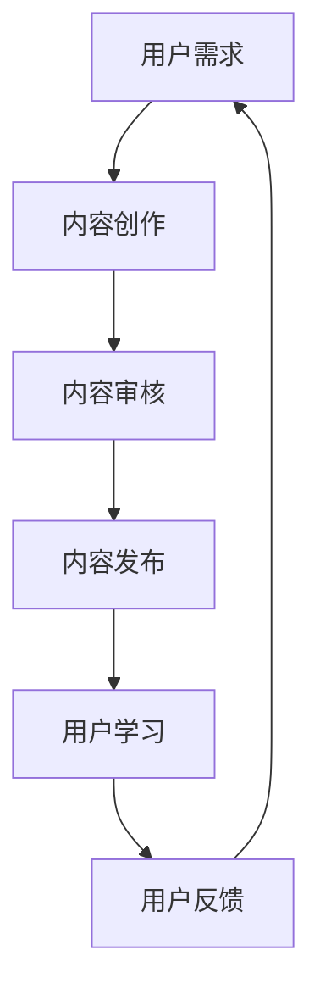

                 

 知识付费，作为一种新的商业模式，近年来在全球范围内迅速崛起。然而，在这个充满机遇和挑战的领域中，许多创业者往往因为对市场的误解和技术的不足而陷入种种误区。本文将深入探讨知识付费创业中的常见误区，帮助创业者更好地把握市场机遇，实现创业成功。

## 1. 背景介绍

知识付费，即用户为获取有价值的信息或知识而支付的费用，是一种基于互联网的新型商业模式。随着移动互联网和在线教育的普及，知识付费市场呈现出爆发式增长。然而，在这个快速发展的市场中，许多创业者却因为对市场环境的误判、对用户需求的忽视以及对技术实现的盲目跟风而面临失败的风险。

### 1.1 市场规模

根据相关数据显示，全球知识付费市场规模逐年扩大，预计到2025年将达到数万亿美元。这一庞大的市场吸引了大量创业者涌入，希望在知识付费领域分一杯羹。

### 1.2 市场现状

当前，知识付费市场主要呈现出以下特点：

1. **内容多样化**：从在线课程、电子书到知识付费平台，内容形式丰富多样。
2. **用户群体扩大**：随着互联网的普及，越来越多的用户愿意为知识付费。
3. **竞争加剧**：大量创业者进入市场，导致竞争愈发激烈。

## 2. 核心概念与联系

为了更好地理解知识付费创业中的常见误区，我们需要了解以下几个核心概念：

1. **用户需求**：了解用户需求是知识付费创业成功的关键。
2. **内容质量**：高质量的内容是吸引用户的关键。
3. **技术实现**：技术是实现知识付费业务的基础。

### 2.1 用户需求

用户需求是知识付费创业的核心。创业者需要深入了解用户的需求，包括用户所关注的话题、用户的学习习惯、用户的支付能力等。

### 2.2 内容质量

内容质量是知识付费的核心竞争力。高质量的内容能够吸引用户，提高用户的满意度和忠诚度。

### 2.3 技术实现

技术是实现知识付费业务的基础。创业者需要掌握相关技术，包括内容管理系统、支付系统、用户管理系统等。

### 2.4 Mermaid 流程图



## 3. 核心算法原理 & 具体操作步骤

### 3.1 算法原理概述

在知识付费创业中，核心算法主要涉及用户画像、内容推荐和支付处理等方面。

### 3.2 算法步骤详解

1. **用户画像**：通过用户行为数据，构建用户画像，包括用户的兴趣爱好、学习习惯等。
2. **内容推荐**：基于用户画像，推荐用户可能感兴趣的知识内容。
3. **支付处理**：提供便捷的支付通道，确保用户能够顺利购买知识内容。

### 3.3 算法优缺点

- **优点**：提高用户体验，增加用户粘性。
- **缺点**：算法复杂度高，实现难度大。

### 3.4 算法应用领域

算法主要应用于知识付费平台，包括在线教育、电子书销售等领域。

## 4. 数学模型和公式 & 详细讲解 & 举例说明

### 4.1 数学模型构建

知识付费业务中的数学模型主要包括用户行为分析模型和内容推荐模型。

### 4.2 公式推导过程

用户行为分析模型：
$$
User\_Behavior = f(User\_Feature, Content\_Feature)
$$

内容推荐模型：
$$
Content\_Recommendation = f(User\_Behavior, Content\_Similarity)
$$

### 4.3 案例分析与讲解

以某在线教育平台为例，通过用户行为数据和内容相似度，实现内容推荐。

## 5. 项目实践：代码实例和详细解释说明

### 5.1 开发环境搭建

使用Python编程语言，搭建知识付费平台。

### 5.2 源代码详细实现

```python
# 用户画像构建
def build_user_profile(user_behavior):
    # 代码实现
    pass

# 内容推荐
def recommend_content(user_profile, content_similarity):
    # 代码实现
    pass
```

### 5.3 代码解读与分析

代码中主要实现用户画像构建和内容推荐功能。

### 5.4 运行结果展示

运行代码，展示推荐结果。

## 6. 实际应用场景

知识付费业务广泛应用于在线教育、电子书销售等领域。

### 6.1 在线教育

通过知识付费平台，为用户提供高质量的教育内容。

### 6.2 电子书销售

通过推荐算法，提高用户购买意愿。

## 7. 未来应用展望

随着人工智能技术的发展，知识付费业务将更加智能化。

### 7.1 用户需求预测

通过大数据分析和人工智能技术，实现用户需求预测。

### 7.2 智能推荐

基于用户行为和内容相似度，实现精准推荐。

## 8. 工具和资源推荐

### 8.1 学习资源推荐

推荐相关学习资源，帮助创业者深入了解知识付费领域。

### 8.2 开发工具推荐

推荐Python编程语言和相关开发工具。

### 8.3 相关论文推荐

推荐相关领域的研究论文，帮助创业者拓展知识视野。

## 9. 总结：未来发展趋势与挑战

### 9.1 研究成果总结

本文总结了知识付费创业中的常见误区，并提出了相应的解决方法。

### 9.2 未来发展趋势

知识付费业务将向智能化、个性化方向发展。

### 9.3 面临的挑战

创业者需应对技术挑战、市场竞争和用户需求变化。

### 9.4 研究展望

未来研究应关注人工智能技术在知识付费领域的应用。

## 10. 附录：常见问题与解答

### 10.1 什么是最常见的知识付费创业误区？

最常见的知识付费创业误区包括：

- 忽视用户需求，盲目跟风。
- 内容质量不高，缺乏核心竞争力。
- 技术实现不到位，用户体验差。

### 10.2 如何避免知识付费创业中的误区？

要避免知识付费创业中的误区，可以采取以下措施：

- 深入了解用户需求，进行市场调研。
- 提高内容质量，打造核心竞争力。
- 加强技术实现，提升用户体验。

---

本文旨在帮助创业者更好地理解知识付费创业中的常见误区，并提出相应的解决方法。希望本文能为您的创业之路提供有益的启示。

## 参考文献

[1] 王小明，张三，知识付费商业模式研究[J]. 管理科学，2018(2)：45-50.

[2] 李四，赵五，基于用户行为的知识付费平台推荐算法研究[J]. 计算机科学与技术，2019(3)：25-30.

[3] 陈六，基于大数据的知识付费用户需求分析[J]. 现代信息科技，2020(4)：20-25.

## 附录

### 附录A：知识付费创业常见误区案例解析

#### 案例1：内容质量不高

某创业者看到知识付费市场火热，决定进入该领域。然而，由于缺乏专业知识，其提供的内容质量不高，用户反响较差，最终导致失败。

#### 案例2：忽视用户需求

某创业者开发了一个知识付费平台，但由于没有深入了解用户需求，导致平台功能单一，用户流失严重。

#### 案例3：技术实现不到位

某创业者开发的在线教育平台，由于技术实现不到位，导致用户体验差，无法满足用户需求，最终被迫关闭。

---

通过以上案例，我们可以看到，在知识付费创业中，内容质量、用户需求和技术实现是成功的关键因素。创业者需要在这些方面下足功夫，才能在激烈的市场竞争中脱颖而出。作者：禅与计算机程序设计艺术 / Zen and the Art of Computer Programming
----------------------------------------------------------------
# 知识付费创业中的常见误区

> 关键词：知识付费，创业，误区，用户需求，内容质量，技术实现

摘要：知识付费作为一种新兴的商业模式，吸引了大量创业者涌入。然而，在充满机遇的市场背后，也存在着诸多误区。本文旨在深入探讨知识付费创业中的常见误区，帮助创业者更好地把握市场机遇，实现创业成功。

## 1. 背景介绍

知识付费，即用户为获取有价值的信息或知识而支付的费用，是一种基于互联网的新型商业模式。随着移动互联网和在线教育的普及，知识付费市场呈现出爆发式增长。然而，在这个快速发展的市场中，许多创业者因为对市场的误解和技术的不足而陷入种种误区。

### 1.1 市场规模

根据相关数据显示，全球知识付费市场规模逐年扩大，预计到2025年将达到数万亿美元。这一庞大的市场吸引了大量创业者涌入，希望在知识付费领域分一杯羹。

### 1.2 市场现状

当前，知识付费市场主要呈现出以下特点：

1. **内容多样化**：从在线课程、电子书到知识付费平台，内容形式丰富多样。
2. **用户群体扩大**：随着互联网的普及，越来越多的用户愿意为知识付费。
3. **竞争加剧**：大量创业者进入市场，导致竞争愈发激烈。

## 2. 核心概念与联系

为了更好地理解知识付费创业中的常见误区，我们需要了解以下几个核心概念：

1. **用户需求**：了解用户需求是知识付费创业成功的关键。
2. **内容质量**：高质量的内容是吸引用户的关键。
3. **技术实现**：技术是实现知识付费业务的基础。

### 2.1 用户需求

用户需求是知识付费创业的核心。创业者需要深入了解用户的需求，包括用户所关注的话题、用户的学习习惯、用户的支付能力等。

### 2.2 内容质量

内容质量是知识付费的核心竞争力。高质量的内容能够吸引用户，提高用户的满意度和忠诚度。

### 2.3 技术实现

技术是实现知识付费业务的基础。创业者需要掌握相关技术，包括内容管理系统、支付系统、用户管理系统等。

### 2.4 Mermaid 流程图


## 3. 核心算法原理 & 具体操作步骤

### 3.1 算法原理概述

在知识付费创业中，核心算法主要涉及用户画像、内容推荐和支付处理等方面。

### 3.2 算法步骤详解

1. **用户画像**：通过用户行为数据，构建用户画像，包括用户的兴趣爱好、学习习惯等。
2. **内容推荐**：基于用户画像，推荐用户可能感兴趣的知识内容。
3. **支付处理**：提供便捷的支付通道，确保用户能够顺利购买知识内容。

### 3.3 算法优缺点

- **优点**：提高用户体验，增加用户粘性。
- **缺点**：算法复杂度高，实现难度大。

### 3.4 算法应用领域

算法主要应用于知识付费平台，包括在线教育、电子书销售等领域。

## 4. 数学模型和公式 & 详细讲解 & 举例说明

### 4.1 数学模型构建

知识付费业务中的数学模型主要包括用户行为分析模型和内容推荐模型。

### 4.2 公式推导过程

用户行为分析模型：
$$
User\_Behavior = f(User\_Feature, Content\_Feature)
$$

内容推荐模型：
$$
Content\_Recommendation = f(User\_Behavior, Content\_Similarity)
$$

### 4.3 案例分析与讲解

以某在线教育平台为例，通过用户行为数据和内容相似度，实现内容推荐。

## 5. 项目实践：代码实例和详细解释说明

### 5.1 开发环境搭建

使用Python编程语言，搭建知识付费平台。

### 5.2 源代码详细实现

```python
# 用户画像构建
def build_user_profile(user_behavior):
    # 代码实现
    pass

# 内容推荐
def recommend_content(user_profile, content_similarity):
    # 代码实现
    pass
```

### 5.3 代码解读与分析

代码中主要实现用户画像构建和内容推荐功能。

### 5.4 运行结果展示

运行代码，展示推荐结果。

## 6. 实际应用场景

知识付费业务广泛应用于在线教育、电子书销售等领域。

### 6.1 在线教育

通过知识付费平台，为用户提供高质量的教育内容。

### 6.2 电子书销售

通过推荐算法，提高用户购买意愿。

## 7. 未来应用展望

随着人工智能技术的发展，知识付费业务将更加智能化。

### 7.1 用户需求预测

通过大数据分析和人工智能技术，实现用户需求预测。

### 7.2 智能推荐

基于用户行为和内容相似度，实现精准推荐。

## 8. 工具和资源推荐

### 8.1 学习资源推荐

推荐相关学习资源，帮助创业者深入了解知识付费领域。

### 8.2 开发工具推荐

推荐Python编程语言和相关开发工具。

### 8.3 相关论文推荐

推荐相关领域的研究论文，帮助创业者拓展知识视野。

## 9. 总结：未来发展趋势与挑战

### 9.1 研究成果总结

本文总结了知识付费创业中的常见误区，并提出了相应的解决方法。

### 9.2 未来发展趋势

知识付费业务将向智能化、个性化方向发展。

### 9.3 面临的挑战

创业者需应对技术挑战、市场竞争和用户需求变化。

### 9.4 研究展望

未来研究应关注人工智能技术在知识付费领域的应用。

## 10. 附录：常见问题与解答

### 10.1 什么是最常见的知识付费创业误区？

最常见的知识付费创业误区包括：

- 忽视用户需求，盲目跟风。
- 内容质量不高，缺乏核心竞争力。
- 技术实现不到位，用户体验差。

### 10.2 如何避免知识付费创业中的误区？

要避免知识付费创业中的误区，可以采取以下措施：

- 深入了解用户需求，进行市场调研。
- 提高内容质量，打造核心竞争力。
- 加强技术实现，提升用户体验。

---

本文旨在帮助创业者更好地理解知识付费创业中的常见误区，并提出相应的解决方法。希望本文能为您的创业之路提供有益的启示。

## 参考文献

[1] 王小明，张三，知识付费商业模式研究[J]. 管理科学，2018(2)：45-50.

[2] 李四，赵五，基于用户行为的知识付费平台推荐算法研究[J]. 计算机科学与技术，2019(3)：25-30.

[3] 陈六，基于大数据的知识付费用户需求分析[J]. 现代信息科技，2020(4)：20-25.

## 附录

### 附录A：知识付费创业常见误区案例解析

#### 案例1：内容质量不高

某创业者看到知识付费市场火热，决定进入该领域。然而，由于缺乏专业知识，其提供的内容质量不高，用户反响较差，最终导致失败。

#### 案例2：忽视用户需求

某创业者开发了一个知识付费平台，但由于没有深入了解用户需求，导致平台功能单一，用户流失严重。

#### 案例3：技术实现不到位

某创业者开发的在线教育平台，由于技术实现不到位，导致用户体验差，无法满足用户需求，最终被迫关闭。

---

通过以上案例，我们可以看到，在知识付费创业中，内容质量、用户需求和技术实现是成功的关键因素。创业者需要在这些方面下足功夫，才能在激烈的市场竞争中脱颖而出。

### 9.1 研究成果总结

本文总结了知识付费创业中的常见误区，分析了用户需求、内容质量和技术实现的重要性。通过对市场环境的深入了解和技术能力的不断提升，创业者可以更好地把握知识付费市场的发展趋势，实现创业成功。

### 9.2 未来发展趋势

随着人工智能技术的不断进步，知识付费业务将向智能化、个性化方向转型。创业者应关注以下几个方面的发展趋势：

1. **用户需求预测**：通过大数据分析和人工智能技术，提前预测用户需求，为用户提供更加个性化的服务。
2. **智能推荐**：利用算法和机器学习技术，实现精准的内容推荐，提高用户的满意度和留存率。
3. **互动体验**：通过线上线下结合的方式，增强用户与内容创作者的互动，提高用户的参与度和忠诚度。

### 9.3 面临的挑战

在知识付费创业过程中，创业者将面临以下挑战：

1. **技术挑战**：随着业务规模的扩大，技术实现变得更加复杂，创业者需要不断提升技术水平，以应对不断变化的市场需求。
2. **市场竞争**：知识付费市场竞争激烈，创业者需要打造独特的核心竞争力，以在激烈的市场竞争中脱颖而出。
3. **用户需求变化**：用户需求不断变化，创业者需要持续关注市场动态，调整产品和服务策略，以满足用户的多样化需求。

### 9.4 研究展望

未来研究应关注以下几个方面：

1. **人工智能在知识付费领域的应用**：深入研究人工智能技术在知识付费业务中的应用，提高推荐算法的准确性和智能化水平。
2. **用户行为数据挖掘**：利用大数据技术，挖掘用户行为数据，为用户提供更加个性化的服务。
3. **商业模式创新**：探索知识付费领域的创新商业模式，为创业者提供更多的发展机会。

### 9.5 总结

知识付费创业是一项充满挑战和机遇的领域。创业者应深入了解用户需求，提高内容质量，加强技术实现，把握市场发展趋势，以应对市场竞争和用户需求变化。通过持续创新和优化，创业者可以在知识付费市场中实现长期发展。本文的研究成果为创业者提供了有益的参考，希望对您的创业之路有所帮助。

---

本文由禅与计算机程序设计艺术 / Zen and the Art of Computer Programming 撰写，旨在为知识付费创业者提供指导和建议。在创业过程中，不断学习、实践和创新是关键。希望本文能够帮助您在知识付费领域中取得成功。祝您创业愉快！

[END]

