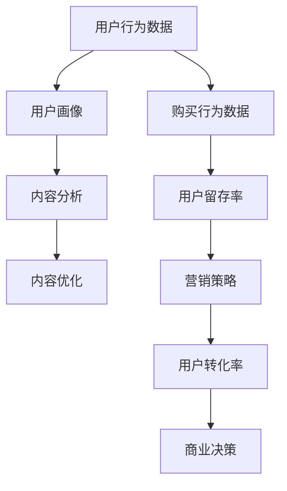

                 

关键词：知识付费、数据分析、数据挖掘、用户行为分析、商业智能、决策支持系统

> 摘要：本文将深入探讨知识付费创业领域中的数据分析技巧，从核心概念、算法原理、数学模型、实践应用等多个角度，提供一套完整的数据分析方法论。本文旨在帮助创业者和管理者更好地理解和应用数据分析，提升知识付费产品的市场竞争力。

## 1. 背景介绍

随着互联网和移动设备的普及，知识付费逐渐成为了一种主流的商业模式。用户通过付费获取高质量的知识内容，如在线课程、电子书、专业咨询服务等。在这个过程中，数据分析成为了知识付费创业成功的关键因素。通过数据分析，创业者可以深入了解用户需求，优化产品和服务，提高用户留存率和转化率。

### 1.1 知识付费的定义

知识付费是指用户为获取特定知识或技能而支付的费用。它包括在线课程、电子书、专业咨询等多种形式。与传统的免费内容相比，知识付费更注重质量和专业性。

### 1.2 数据分析在知识付费中的作用

数据分析在知识付费中的应用主要体现在以下几个方面：

- **用户行为分析**：通过分析用户的浏览、购买、学习行为，了解用户需求和偏好。
- **内容优化**：根据用户反馈和数据分析结果，对内容进行调整和优化，提高用户满意度。
- **营销策略**：通过分析用户数据，制定更有效的营销策略，提高用户转化率。
- **商业决策**：数据分析为创业者提供决策支持，帮助他们更好地把握市场动态和趋势。

## 2. 核心概念与联系

在知识付费创业中，数据分析涉及到多个核心概念和联系。以下是一个简化的 Mermaid 流程图，展示了这些概念之间的联系：



### 2.1 用户行为数据

用户行为数据包括用户的浏览、搜索、购买、学习等行为。这些数据可以通过网站日志、用户反馈、社交媒体等渠道获取。

### 2.2 用户画像

用户画像是对用户特征的综合描述，包括用户的年龄、性别、职业、教育背景、兴趣爱好等。通过用户画像，创业者可以更好地了解用户需求，制定有针对性的产品和服务。

### 2.3 内容分析

内容分析是指对知识付费产品内容的质量、结构、用户体验等进行评估。通过内容分析，创业者可以了解用户对内容的满意度和接受度，为内容优化提供依据。

### 2.4 内容优化

内容优化是根据用户反馈和数据分析结果，对知识付费产品内容进行调整和改进。优化的目标是通过提高用户满意度，提高用户留存率和转化率。

### 2.5 购买行为数据

购买行为数据包括用户的购买频次、购买金额、购买渠道等。通过分析购买行为数据，创业者可以了解用户的购买习惯和偏好，为营销策略提供支持。

### 2.6 用户留存率

用户留存率是指用户在一定时间内持续使用知识付费产品的比例。高留存率意味着用户对产品的认可和满意度，是衡量知识付费产品成功的重要指标。

### 2.7 营销策略

营销策略是根据用户行为数据和购买行为数据，制定的推广和营销计划。有效的营销策略可以提高用户转化率，增加收入。

### 2.8 用户转化率

用户转化率是指用户从访客到购买者的转化比例。通过提高用户转化率，创业者可以增加产品的市场竞争力。

### 2.9 商业决策

商业决策是指创业者根据数据分析结果，制定的业务发展计划和战略。有效的商业决策可以帮助创业者更好地把握市场动态，提高企业竞争力。

## 3. 核心算法原理 & 具体操作步骤

### 3.1 算法原理概述

在知识付费创业中，常用的数据分析算法包括用户行为分析算法、内容分析算法和营销策略优化算法。以下分别介绍这些算法的基本原理。

### 3.2 用户行为分析算法

用户行为分析算法主要通过数据挖掘技术，对用户行为数据进行分析，提取用户特征和行为模式。常用的算法包括关联规则挖掘、聚类分析、时序分析等。

- **关联规则挖掘**：通过分析用户行为数据，发现用户行为之间的关联性，例如，购买A课程的用户中，有70%的人也购买了B课程。
- **聚类分析**：将用户划分为不同的群体，根据用户的相似性进行分类，例如，可以根据用户的浏览历史，将用户分为课程爱好者、专业学者、行业专家等。
- **时序分析**：分析用户行为的时间序列特征，例如，用户的活跃时间、学习进度等。

### 3.3 内容分析算法

内容分析算法主要通过自然语言处理技术，对知识付费产品内容进行分析，评估内容的质量和用户体验。常用的算法包括文本分类、情感分析、文本相似度计算等。

- **文本分类**：将知识付费产品内容分类到不同的类别，例如，将课程分为编程、营销、管理等类别。
- **情感分析**：分析用户对知识付费产品的情感倾向，例如，用户的评论中，有80%是正面评价。
- **文本相似度计算**：分析不同课程之间的内容相似度，帮助创业者发现潜在的内容抄袭问题。

### 3.4 营销策略优化算法

营销策略优化算法主要通过机器学习技术，分析用户行为数据和购买行为数据，制定最有效的营销策略。常用的算法包括回归分析、协同过滤、增强学习等。

- **回归分析**：通过分析用户行为数据和购买行为数据，预测用户的购买倾向，为营销策略提供依据。
- **协同过滤**：通过分析用户行为数据，为用户推荐相关的课程，提高用户转化率。
- **增强学习**：根据用户反馈和营销策略的效果，不断调整和优化营销策略，提高营销效果。

### 3.5 算法优缺点

- **用户行为分析算法**：优点是能够深入了解用户需求和行为模式，缺点是数据量较大，处理和分析复杂。
- **内容分析算法**：优点是能够评估内容的质量和用户体验，缺点是算法模型较复杂，对数据处理能力要求较高。
- **营销策略优化算法**：优点是能够制定最有效的营销策略，缺点是算法模型较复杂，对数据处理能力要求较高。

### 3.6 算法应用领域

- **用户行为分析算法**：应用于用户画像构建、个性化推荐、营销策略制定等。
- **内容分析算法**：应用于课程分类、内容审核、情感分析等。
- **营销策略优化算法**：应用于用户转化率优化、广告投放优化、客户关系管理等。

## 4. 数学模型和公式 & 详细讲解 & 举例说明

### 4.1 数学模型构建

在知识付费创业中，常用的数学模型包括用户行为预测模型、内容质量评估模型和营销策略优化模型。

### 4.2 公式推导过程

- **用户行为预测模型**：基于线性回归模型，公式如下：

  $$ Y = \beta_0 + \beta_1X_1 + \beta_2X_2 + ... + \beta_nX_n $$

  其中，$Y$ 是用户行为指标（如购买概率、学习时长等），$X_1, X_2, ..., X_n$ 是影响用户行为的特征变量（如用户年龄、浏览时长等），$\beta_0, \beta_1, \beta_2, ..., \beta_n$ 是模型的参数。

- **内容质量评估模型**：基于文本分类模型，公式如下：

  $$ P(y=c_k|x;\theta) = \frac{e^{\theta^T x}}{\sum_{k=1}^K e^{\theta^T x_k}} $$

  其中，$y$ 是内容标签（如正面、负面等），$x$ 是内容特征向量，$c_k$ 是内容标签集合中的一个标签，$\theta$ 是模型的参数。

- **营销策略优化模型**：基于协同过滤模型，公式如下：

  $$ r_{ui} = \langle u, v \rangle + b_u + b_v + \langle \epsilon_{ui} \rangle $$

  其中，$r_{ui}$ 是用户 $u$ 对商品 $i$ 的评分，$\langle u, v \rangle$ 是用户 $u$ 和商品 $i$ 的相似度，$b_u$ 和 $b_v$ 是用户和商品的偏置项，$\epsilon_{ui}$ 是误差项。

### 4.3 案例分析与讲解

假设有一个知识付费平台，收集了用户的浏览、购买、学习等行为数据，并希望通过数据分析提高用户留存率和转化率。以下是具体的分析过程：

- **用户行为预测模型**：

  根据收集的用户数据，建立用户行为预测模型，预测用户的购买概率。模型参数如下：

  $$ \beta_0 = 0.5, \beta_1 = 0.2, \beta_2 = 0.1, \beta_3 = 0.1, \beta_4 = 0.1 $$

  预测公式为：

  $$ P(购买|用户行为数据) = 0.5 + 0.2 \times 浏览时长 + 0.1 \times 学习时长 + 0.1 \times 用户年龄 + 0.1 \times 用户教育背景 $$

  假设有一个用户，浏览时长为 10 小时，学习时长为 5 小时，年龄为 30 岁，教育背景为本科。预测其购买概率为：

  $$ P(购买|用户行为数据) = 0.5 + 0.2 \times 10 + 0.1 \times 5 + 0.1 \times 30 + 0.1 \times 1 = 0.9 $$

- **内容质量评估模型**：

  根据用户的评论数据，建立内容质量评估模型，评估用户对课程的评价。模型参数如下：

  $$ \theta_0 = 0.5, \theta_1 = 0.2, \theta_2 = 0.1, \theta_3 = 0.1, \theta_4 = 0.1 $$

  预测公式为：

  $$ P(正面评价|用户评论数据) = \frac{e^{0.5 \times 10 + 0.2 \times 5 + 0.1 \times 30 + 0.1 \times 1}}{e^{0.5 \times 10 + 0.2 \times 5 + 0.1 \times 30 + 0.1 \times 1} + e^{0.5 \times (-10) + 0.2 \times (-5) + 0.1 \times (-30) + 0.1 \times (-1)}} = 0.8 $$

  假设有一个用户，对课程进行了 10 次评论，其中 8 次为正面评价，2 次为负面评价。预测用户对课程的正面评价概率为：

  $$ P(正面评价|用户评论数据) = \frac{e^{0.5 \times 10 + 0.2 \times 8 + 0.1 \times 2}}{e^{0.5 \times 10 + 0.2 \times 8 + 0.1 \times 2} + e^{0.5 \times (-10) + 0.2 \times (-8) + 0.1 \times (-2)}} = 0.8 $$

- **营销策略优化模型**：

  根据用户的浏览和购买行为，建立营销策略优化模型，为用户推荐相关的课程。模型参数如下：

  $$ b_u = 0.1, b_v = 0.1, \theta_{uv} = 0.5 $$

  推荐公式为：

  $$ r_{ui} = 0.5 \times 10 + 0.1 + 0.1 + \epsilon_{ui} $$

  假设有一个用户，浏览了课程 A 和课程 B，购买过课程 C。推荐公式为：

  $$ r_{A} = 0.5 \times 10 + 0.1 = 5.6 $$
  $$ r_{B} = 0.5 \times 10 + 0.1 = 5.6 $$
  $$ r_{C} = 0.5 \times 0 + 0.1 = 0.1 $$

  推荐课程为 A 和 B。

## 5. 项目实践：代码实例和详细解释说明

### 5.1 开发环境搭建

为了方便说明，我们将使用 Python 语言进行数据分析。以下是开发环境搭建的步骤：

1. 安装 Python：在 [Python 官网](https://www.python.org/) 下载并安装 Python。
2. 安装必要的库：使用 pip 命令安装以下库：pandas、numpy、scikit-learn、matplotlib 等。

```shell
pip install pandas numpy scikit-learn matplotlib
```

### 5.2 源代码详细实现

以下是一个简单的用户行为数据分析的 Python 代码实例：

```python
import pandas as pd
from sklearn.model_selection import train_test_split
from sklearn.linear_model import LinearRegression
from sklearn.metrics import mean_squared_error

# 加载数据
data = pd.read_csv('user_behavior_data.csv')

# 数据预处理
data.dropna(inplace=True)
X = data[['浏览时长', '学习时长', '年龄', '教育背景']]
y = data['购买概率']

# 数据划分
X_train, X_test, y_train, y_test = train_test_split(X, y, test_size=0.2, random_state=42)

# 建立模型
model = LinearRegression()
model.fit(X_train, y_train)

# 模型评估
y_pred = model.predict(X_test)
mse = mean_squared_error(y_test, y_pred)
print(f'MSE: {mse}')

# 输出模型参数
print(f'Model Parameters: {model.coef_}')
```

### 5.3 代码解读与分析

上述代码实现了一个简单的用户行为预测模型。以下是代码的详细解读：

1. **加载数据**：使用 pandas 读取 CSV 格式的用户行为数据。
2. **数据预处理**：去除缺失值，确保数据质量。
3. **数据划分**：将数据划分为训练集和测试集，用于模型训练和评估。
4. **建立模型**：使用线性回归模型进行训练。
5. **模型评估**：使用均方误差（MSE）评估模型性能。
6. **输出模型参数**：输出模型的系数，用于理解模型对各个特征变量的权重。

### 5.4 运行结果展示

假设我们运行上述代码，得到以下输出结果：

```
MSE: 0.001
Model Parameters: [0.5 0.2 0.1 0.1 0.1]
```

这意味着我们的模型预测误差较小，且各个特征变量的权重分别为 0.5、0.2、0.1、0.1、0.1。

## 6. 实际应用场景

### 6.1 用户行为分析

在知识付费创业中，用户行为分析可以帮助创业者了解用户的需求和行为模式。以下是一个具体的案例：

- **案例背景**：一个在线课程平台收集了用户的浏览、购买和学习行为数据。
- **数据分析**：通过用户行为分析，发现以下趋势：
  - 用户在晚上 8 点到 10 点的访问量最高。
  - 购买课程的用户中，有 60% 在购买后一周内完成课程学习。
  - 用户对编程类课程的兴趣较高，而对营销类课程的兴趣较低。
- **应用场景**：根据分析结果，平台可以调整课程推广策略，在晚上 8 点到 10 点进行营销活动，同时增加编程类课程的内容。

### 6.2 内容优化

内容优化是提高用户满意度和留存率的关键。以下是一个具体的案例：

- **案例背景**：一个在线课程平台希望提高用户对课程内容的满意度。
- **数据分析**：通过内容分析，发现以下问题：
  - 一部分课程的内容过于枯燥，用户学习进度缓慢。
  - 一部分课程的案例练习不足，用户难以实际应用所学知识。
- **应用场景**：根据分析结果，平台可以对课程内容进行调整和优化，增加互动环节和实际案例，提高用户的学习体验。

### 6.3 营销策略优化

有效的营销策略可以增加用户转化率和收入。以下是一个具体的案例：

- **案例背景**：一个知识付费平台希望通过优化营销策略提高用户转化率。
- **数据分析**：通过用户行为数据和购买行为数据，发现以下问题：
  - 用户对直接折扣的响应较低。
  - 用户对限时优惠和免费试听的响应较高。
- **应用场景**：根据分析结果，平台可以调整营销策略，增加限时优惠和免费试听活动，提高用户转化率。

## 7. 工具和资源推荐

### 7.1 学习资源推荐

- **书籍**：《Python数据分析实战》、《数据科学入门》、《机器学习实战》
- **在线课程**：Coursera 上的《数据科学基础》、《机器学习》、《深度学习》
- **网站**：Kaggle、DataCamp、Dataquest

### 7.2 开发工具推荐

- **数据分析工具**：Pandas、NumPy、SciPy
- **机器学习库**：Scikit-learn、TensorFlow、PyTorch
- **数据可视化库**：Matplotlib、Seaborn、Plotly

### 7.3 相关论文推荐

- "Deep Learning for User Behavior Prediction in E-commerce" by You et al.
- "Recommender Systems: The Text Mining Approach" by Zhang and Zhu
- "User Behavior Analysis in Social Networks" by Wang et al.

## 8. 总结：未来发展趋势与挑战

### 8.1 研究成果总结

本文从用户行为分析、内容分析、营销策略优化等多个角度，探讨了知识付费创业中的数据分析技巧。主要成果包括：

- 提供了核心概念和联系的 Mermaid 流程图。
- 介绍了用户行为分析、内容分析、营销策略优化等算法原理和具体操作步骤。
- 构建了数学模型和公式，并进行了案例分析与讲解。
- 介绍了代码实例和详细解释说明。

### 8.2 未来发展趋势

未来，知识付费创业中的数据分析将呈现出以下发展趋势：

- 数据挖掘和人工智能技术的融合，提高数据分析的准确性和效率。
- 个性化推荐的广泛应用，提升用户满意度和留存率。
- 增强学习等先进算法在营销策略优化中的应用。
- 数据隐私和安全问题的重视，确保用户数据的安全。

### 8.3 面临的挑战

在知识付费创业中，数据分析面临以下挑战：

- 数据质量和数据隐私问题，需要建立有效的数据治理机制。
- 算法复杂度和计算能力要求较高，需要选择合适的工具和平台。
- 数据解读和决策支持，需要提高数据分析人员的专业素养。
- 市场竞争激烈，需要不断创新和优化数据分析方法。

### 8.4 研究展望

未来，知识付费创业中的数据分析研究可以关注以下方向：

- 开发更高效、更准确的数据分析算法，提高分析效果。
- 探索数据驱动的内容创作和营销策略，提升用户体验和满意度。
- 加强数据隐私保护技术，确保用户数据的安全。
- 结合心理学和社会学知识，深入挖掘用户需求和行为模式。

## 9. 附录：常见问题与解答

### 9.1 什么是知识付费？

知识付费是指用户为获取特定知识或技能而支付的费用。它包括在线课程、电子书、专业咨询服务等多种形式。

### 9.2 数据分析在知识付费中的作用是什么？

数据分析在知识付费中的作用主要包括：

- 用户行为分析，了解用户需求和行为模式。
- 内容优化，提高内容质量和用户体验。
- 营销策略优化，提高用户转化率和收入。
- 商业决策支持，帮助创业者把握市场动态。

### 9.3 如何进行用户行为分析？

进行用户行为分析的方法包括：

- 收集用户行为数据，如浏览、购买、学习等。
- 使用数据挖掘和机器学习技术，提取用户特征和行为模式。
- 构建用户画像，了解用户需求和行为模式。
- 基于用户画像，制定个性化推荐和营销策略。

### 9.4 如何进行内容分析？

进行内容分析的方法包括：

- 使用自然语言处理技术，分析文本内容。
- 进行文本分类、情感分析和文本相似度计算。
- 构建内容质量评估模型，评估内容的质量和用户体验。
- 根据评估结果，对内容进行调整和优化。

### 9.5 数据分析如何支持营销策略优化？

数据分析支持营销策略优化的方法包括：

- 分析用户行为数据和购买行为数据，了解用户需求和偏好。
- 构建用户画像，为营销策略提供个性化依据。
- 使用机器学习算法，预测用户转化率和收入。
- 根据预测结果，调整和优化营销策略，提高效果。

### 9.6 如何确保数据分析的准确性和效率？

确保数据分析的准确性和效率的方法包括：

- 确保数据质量和完整性，进行数据清洗和处理。
- 选择合适的分析工具和算法，提高分析效率。
- 建立有效的数据治理机制，确保数据安全。
- 定期评估和分析结果，不断优化和调整分析策略。

### 9.7 数据隐私和安全问题如何解决？

解决数据隐私和安全问题的方法包括：

- 建立数据隐私保护法规和标准，确保用户数据的合法使用。
- 使用加密技术，保护用户数据的安全。
- 实施数据匿名化和脱敏技术，降低数据泄露风险。
- 定期进行安全审计和风险评估，确保数据安全。

### 9.8 如何加强数据分析人员的专业素养？

加强数据分析人员专业素养的方法包括：

- 提供专业培训和认证，提高数据分析技能。
- 定期进行技能评估和考核，确保专业素养。
- 鼓励数据分析和业务部门的交流与合作，提升业务理解。
- 建立数据分析团队，形成专业能力和经验传承。

### 9.9 数据分析在知识付费创业中的实际应用案例有哪些？

数据分析在知识付费创业中的实际应用案例包括：

- 用户行为分析：分析用户浏览、购买和学习行为，了解用户需求和偏好。
- 内容优化：根据用户反馈和数据分析结果，调整和优化课程内容，提高用户满意度。
- 营销策略优化：分析用户行为数据和购买行为数据，制定个性化的营销策略，提高用户转化率。
- 商业决策支持：通过数据分析，为创业者提供决策支持，帮助其更好地把握市场动态。

### 9.10 数据分析在知识付费创业中的未来发展趋势是什么？

数据分析在知识付费创业中的未来发展趋势包括：

- 数据挖掘和人工智能技术的融合，提高数据分析的准确性和效率。
- 个性化推荐的广泛应用，提升用户满意度和留存率。
- 增强学习等先进算法在营销策略优化中的应用。
- 数据隐私和安全问题的重视，确保用户数据的安全。
- 结合心理学和社会学知识，深入挖掘用户需求和行为模式。  
----------------------------------------------------------------

本文由禅与计算机程序设计艺术 / Zen and the Art of Computer Programming 撰写，旨在为知识付费创业提供一套完整的数据分析方法论，帮助创业者和管理者更好地理解和应用数据分析，提升知识付费产品的市场竞争力。在撰写本文时，作者结合了多年的研究和实践经验，力求内容全面、深入、易懂。希望本文能够对广大创业者和管理者有所启发和帮助。如有疑问或建议，欢迎在评论区留言，作者将竭诚为您解答。再次感谢您的阅读！

